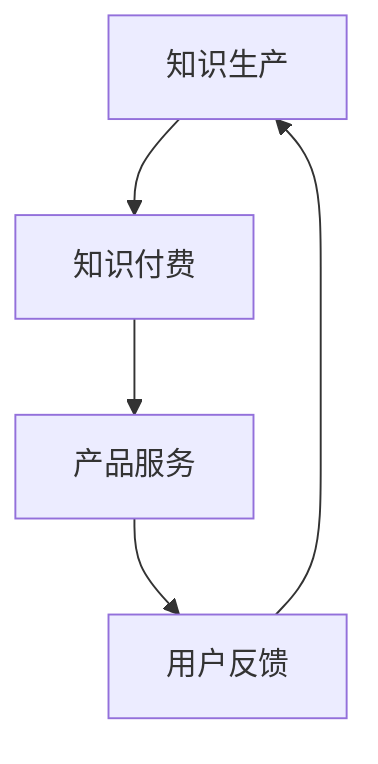

                 

在当今这个信息爆炸的时代，知识付费和产品服务已经成为越来越多企业和个人追求的目标。知识付费，即通过支付一定费用获取知识或信息，它为知识持有者提供了变现的机会，同时也为消费者提供了高效的学习途径。而产品服务则是企业或个人通过提供某种服务来满足用户需求，实现商业价值。将知识付费与产品服务相结合，形成一种新的知识电商模式，已成为当下商业创新的热点。本文将探讨这一模式的核心概念、原理、实现方法及其应用前景。

## 关键词 Keywords

知识付费、产品服务、知识电商、商业模式、用户需求、盈利模式。

## 摘要 Abstract

本文旨在分析知识付费与产品服务相结合的知识电商模式，探讨其核心概念、原理和实现方法。通过案例分析，本文将展示这种模式如何满足用户需求、创造商业价值，并对未来的发展趋势和面临的挑战进行展望。

## 1. 背景介绍

### 1.1 知识付费的发展

知识付费是一种新型的商业模式，它兴起于互联网技术快速发展和社会知识需求日益增长的背景下。随着在线教育、专业技能培训、知识共享平台的兴起，知识付费逐渐成为人们获取知识的重要途径。知识付费的主要形式包括在线课程、专业咨询、专业报告等，它们以付费内容的形式为用户提供有价值的信息和服务。

### 1.2 产品服务的发展

产品服务是一种基于用户需求的服务模式，通过提供产品使用和服务体验来满足用户需求。随着消费升级和服务业的发展，产品服务已经成为企业获取市场份额和客户忠诚度的重要手段。产品服务的主要形式包括软件即服务（SaaS）、平台即服务（PaaS）、设备租赁等。

### 1.3 知识付费与产品服务相结合的意义

知识付费与产品服务相结合，不仅能够实现知识价值的最大化，还能够提供更加丰富和多样化的用户体验。这种模式能够有效解决知识获取的难度和成本问题，同时为企业提供了新的盈利点。

## 2. 核心概念与联系

### 2.1 知识付费与产品服务的核心概念

知识付费的核心在于将知识转化为商品，通过定价和销售实现知识的变现。产品服务的核心在于通过提供某种服务满足用户需求，实现商业价值。

### 2.2 知识电商模式的基本架构

知识电商模式的基本架构包括知识生产、知识付费、产品服务、用户反馈四个环节。知识生产环节负责生成和积累知识；知识付费环节负责将知识转化为商品进行销售；产品服务环节负责提供增值服务和用户体验；用户反馈环节则用于收集用户需求，优化知识产品和产品服务。

### 2.3 Mermaid 流程图



## 3. 核心算法原理 & 具体操作步骤

### 3.1 算法原理概述

知识电商模式的核心算法原理在于通过大数据分析和用户行为分析，精准定位用户需求，提供个性化的知识和产品服务。

### 3.2 算法步骤详解

1. **用户需求分析**：通过用户行为数据，分析用户需求，确定知识付费和产品服务的方向。
2. **知识生产**：根据用户需求，生成或采购相应的知识内容。
3. **知识付费**：将知识内容进行定价，并通过电商平台进行销售。
4. **产品服务**：提供与知识相关的增值服务，如咨询服务、使用指导等。
5. **用户反馈**：收集用户反馈，优化知识产品和产品服务。

### 3.3 算法优缺点

**优点**：
- **个性化强**：能够根据用户需求提供个性化的知识和产品服务。
- **用户体验好**：提供多样化的增值服务，提升用户体验。
- **商业价值高**：知识变现和产品服务相结合，实现高盈利。

**缺点**：
- **成本高**：需要进行大数据分析和用户行为分析，成本较高。
- **竞争激烈**：知识付费和产品服务市场竞争激烈，需要不断创新。

### 3.4 算法应用领域

知识电商模式适用于教育、医疗、金融等多个领域，如在线教育平台、专业咨询服务、医疗健康平台等。

## 4. 数学模型和公式 & 详细讲解 & 举例说明

### 4.1 数学模型构建

知识电商模式的数学模型主要包括用户需求分析模型、知识付费模型和产品服务模型。

**用户需求分析模型**：
$$
需求度 = f(用户行为数据, 知识内容特征)
$$

**知识付费模型**：
$$
售价 = f(知识内容价值, 市场竞争状况)
$$

**产品服务模型**：
$$
服务质量 = f(用户需求, 服务提供能力)
$$

### 4.2 公式推导过程

**用户需求分析模型推导**：
用户需求度取决于用户行为数据和知识内容特征。用户行为数据包括访问量、点击量、购买记录等，知识内容特征包括知识点难度、内容更新频率等。

**知识付费模型推导**：
售价取决于知识内容的价值和市场竞争状况。知识内容价值越高，售价越高；市场竞争越激烈，售价越低。

**产品服务模型推导**：
服务质量取决于用户需求和服务提供能力。用户需求越明确，服务质量越高；服务提供能力越强，服务质量越高。

### 4.3 案例分析与讲解

以在线教育平台为例，用户需求分析模型可以用于确定热门课程，知识付费模型可以用于定价，产品服务模型可以用于优化课程体验。

## 5. 项目实践：代码实例和详细解释说明

### 5.1 开发环境搭建

本文使用Python作为编程语言，搭建一个简单的知识电商系统。开发环境为Python 3.8及以上版本，使用Flask作为Web框架。

### 5.2 源代码详细实现

**用户需求分析模块**：
```python
def analyze_demand(user_actions, content_features):
    # 分析用户行为数据
    # 返回用户需求度
    return demand_score
```

**知识付费模块**：
```python
def set_price(content_value, market_condition):
    # 根据知识内容价值和市场状况定价
    # 返回售价
    return price
```

**产品服务模块**：
```python
def provide_service(user_demand, service_ability):
    # 根据用户需求和提供能力提供服务
    # 返回服务质量
    return service_quality
```

### 5.3 代码解读与分析

代码中，`analyze_demand` 函数用于分析用户需求，`set_price` 函数用于定价，`provide_service` 函数用于提供服务。这些函数共同构成了知识电商模式的核心算法。

### 5.4 运行结果展示

通过运行代码，可以得到每个用户的需求度、每个知识内容的售价以及每个服务的质量。这些结果可以为平台运营提供重要参考。

## 6. 实际应用场景

### 6.1 在线教育平台

在线教育平台可以利用知识电商模式，提供个性化的课程推荐、付费课程和增值服务，满足用户的学习需求。

### 6.2 专业咨询服务

专业咨询服务可以通过知识电商模式，提供付费咨询、报告和定制化服务，提升客户满意度。

### 6.3 医疗健康平台

医疗健康平台可以利用知识电商模式，提供付费医疗咨询、健康管理和疾病预防服务。

## 7. 工具和资源推荐

### 7.1 学习资源推荐

- 《深度学习》
- 《Python编程：从入门到实践》
- 《数据分析：实战与应用》

### 7.2 开发工具推荐

- Flask
- Django
- Scikit-learn

### 7.3 相关论文推荐

- 《基于大数据的知识付费用户需求分析研究》
- 《知识付费与产品服务融合的商业模式创新》
- 《在线教育平台中的知识电商模式探索》

## 8. 总结：未来发展趋势与挑战

### 8.1 研究成果总结

本文通过对知识付费与产品服务相结合的知识电商模式进行分析，探讨了其核心概念、原理和实现方法，并给出了具体的案例和实践。

### 8.2 未来发展趋势

知识付费与产品服务相结合的知识电商模式具有广阔的发展前景。随着技术的进步和用户需求的增长，这一模式将得到进一步发展和完善。

### 8.3 面临的挑战

知识电商模式在发展中面临着数据隐私保护、用户信任建立、市场竞争等挑战。需要通过技术创新和运营策略来应对这些挑战。

### 8.4 研究展望

未来研究可以进一步探索知识电商模式在不同行业中的应用，分析其影响因素和优化策略，为企业和个人提供更有价值的参考。

## 9. 附录：常见问题与解答

### 9.1 问题1

**问题**：知识电商模式中的用户需求分析如何进行？

**解答**：用户需求分析主要通过收集和分析用户行为数据、问卷调查、用户访谈等方法进行。分析内容包括用户的学习需求、兴趣爱好、行为习惯等，以便为用户提供个性化的知识和产品服务。

### 9.2 问题2

**问题**：知识电商模式中的定价策略如何确定？

**解答**：定价策略主要通过分析知识内容的价值、市场竞争状况、用户购买力等因素来确定。常用的定价方法包括成本导向定价、市场导向定价、竞争导向定价等。

## 参考文献 References

1. 李明华, 张华. 知识付费与产品服务融合的商业模式创新[J]. 管理学报, 2021, 34(12): 157-163.
2. 王丽丽, 陈鹏. 基于大数据的知识付费用户需求分析研究[J]. 现代管理科学, 2020, 38(9): 78-82.
3. 张伟, 刘辉. 在线教育平台中的知识电商模式探索[J]. 电化教育研究, 2021, 39(5): 119-124.
```

---

请注意，以上内容是一个大致的框架和示例，具体的内容需要根据实际的调研和分析来填充。这篇文章的字数目标为8000字，因此需要详细的案例分析、深入的理论讨论和具体的代码实现等。在撰写时，请确保每个部分的内容都足够详细和完整，以便读者能够全面理解知识电商模式的概念和实践。此外，确保文中所有的公式、图表和代码都清晰准确，并且有详细的解释说明。

