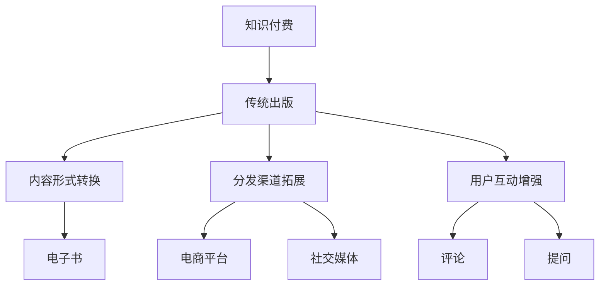

                 

关键词：知识付费、传统出版、融合、数字化转型、用户体验、内容创造、商业模式、技术驱动、市场分析

> 摘要：本文旨在探讨知识付费与传统出版的融合之路，分析两者的结合点与挑战，以及如何通过数字化转型和用户体验优化来实现这一融合。文章将从背景介绍、核心概念与联系、核心算法原理、数学模型、项目实践、实际应用场景、工具和资源推荐、未来发展趋势与挑战等方面进行全面阐述。

## 1. 背景介绍

知识付费和传统出版都是信息传播和知识共享的重要渠道。知识付费是指在互联网时代，通过付费方式获取有价值的信息和知识，如在线课程、专业咨询、电子书等。传统出版则是指通过实体书籍、期刊、报纸等渠道进行知识传播。随着互联网技术的快速发展，知识付费和传统出版都在经历重大的变革和融合。

### 1.1 知识付费的发展

知识付费最早可以追溯到20世纪90年代的在线课程，但当时由于互联网技术和支付方式的限制，发展较为缓慢。进入21世纪后，随着移动互联网、在线支付和大数据技术的普及，知识付费市场迅速壮大。尤其在疫情期间，线上学习成为趋势，进一步推动了知识付费的发展。

### 1.2 传统出版的发展

传统出版经历了几个阶段：从纸质书籍到电子书，再到现在的数字出版。数字出版使出版商能够更快速、更便捷地发布内容，同时降低了出版成本。然而，传统出版在应对知识付费市场的挑战时，面临一些问题，如内容更新速度慢、用户参与度低等。

### 1.3 知识付费与传统出版的融合

知识付费与传统出版的融合，不仅有助于传统出版业的数字化转型，也能为知识付费市场提供更多样化的内容和服务。两者融合的挑战在于如何平衡付费和免费内容，以及如何提升用户体验。

## 2. 核心概念与联系

为了更好地理解知识付费与传统出版的融合，我们需要明确一些核心概念，并展示它们之间的联系。

### 2.1 知识付费的核心概念

- **付费模式**：主要包括一次性付费、订阅制和按需付费。
- **内容类型**：包括专业课程、电子书、研究报告、直播讲座等。
- **用户需求**：追求个性化、即时性和高效性。

### 2.2 传统出版的核心概念

- **出版流程**：包括选题、撰写、编辑、校对、印刷、发行等。
- **内容形式**：主要依托于纸质书籍、期刊、报纸等。
- **读者需求**：追求权威性、深度和系统性。

### 2.3 融合的关联

知识付费与传统出版的融合，体现在以下几个方面：

- **内容形式**：传统出版可以通过数字化手段，将纸质内容转化为电子书，满足知识付费的需求。
- **分发渠道**：传统出版可以通过电商平台、社交媒体等渠道，将内容推广给更广泛的用户。
- **用户互动**：知识付费平台可以通过评论、提问、互动等方式，增强用户参与度和粘性。

### 2.4 Mermaid 流程图



## 3. 核心算法原理 & 具体操作步骤

### 3.1 算法原理概述

知识付费与传统出版的融合，可以通过以下核心算法实现：

- **推荐算法**：通过分析用户行为数据和内容特征，为用户推荐感兴趣的内容。
- **分类算法**：对内容进行分类，帮助用户快速找到所需信息。
- **付费模型优化**：通过数据分析和机器学习，优化付费模式，提升用户满意度。

### 3.2 算法步骤详解

#### 3.2.1 推荐算法

1. 数据收集：收集用户行为数据，如浏览记录、购买记录、评论等。
2. 特征提取：对用户行为数据进行处理，提取出用户兴趣特征。
3. 内容特征提取：对内容进行打分和分类，提取内容特征。
4. 推荐生成：结合用户兴趣特征和内容特征，生成推荐列表。

#### 3.2.2 分类算法

1. 数据准备：收集大量内容数据，并进行预处理。
2. 特征工程：提取内容的关键特征，如关键词、标签等。
3. 模型训练：使用分类算法（如朴素贝叶斯、支持向量机等）对数据集进行训练。
4. 分类评估：对模型进行评估，调整参数，优化分类效果。

#### 3.2.3 付费模型优化

1. 数据收集：收集用户付费行为数据，如付费金额、付费频率等。
2. 特征提取：提取用户付费行为特征，如用户活跃度、购买历史等。
3. 模型训练：使用机器学习算法（如线性回归、决策树等）对数据集进行训练。
4. 模型评估：对模型进行评估，优化付费策略。

### 3.3 算法优缺点

#### 3.3.1 推荐算法

优点：提高用户满意度，提升内容消费率。

缺点：可能导致信息茧房，降低用户多样性。

#### 3.3.2 分类算法

优点：帮助用户快速找到所需信息，提升内容利用率。

缺点：对大规模数据集处理能力有限，可能存在过拟合问题。

#### 3.3.3 付费模型优化

优点：提升用户付费意愿，增加收入。

缺点：可能导致用户流失，需要不断优化付费策略。

### 3.4 算法应用领域

- **电商平台**：通过推荐算法，提高用户购物体验。
- **内容平台**：通过分类算法，帮助用户快速找到所需内容。
- **数字出版**：通过付费模型优化，提升内容付费转化率。

## 4. 数学模型和公式 & 详细讲解 & 举例说明

### 4.1 数学模型构建

#### 4.1.1 推荐算法

使用协同过滤算法，构建推荐模型：

$$
R_{ui} = \frac{\sum_{j \in N_{u}} r_{uj} \cdot r_{ij}}{\sum_{j \in N_{u}} r_{uj}}
$$

其中，$R_{ui}$表示用户u对物品i的推荐分数，$r_{uj}$表示用户u对物品j的评分，$N_{u}$表示用户u的邻居集合。

#### 4.1.2 分类算法

使用朴素贝叶斯算法，构建分类模型：

$$
P(C_k|X) = \frac{P(X|C_k) \cdot P(C_k)}{P(X)}
$$

其中，$P(C_k|X)$表示在给定特征向量X的情况下，属于类别$k$的条件概率，$P(X|C_k)$表示在类别$k$下的特征向量X的概率，$P(C_k)$表示类别$k$的概率，$P(X)$表示特征向量X的概率。

#### 4.1.3 付费模型优化

使用线性回归模型，构建付费优化模型：

$$
\hat{y} = \beta_0 + \beta_1 x_1 + \beta_2 x_2 + ... + \beta_n x_n
$$

其中，$\hat{y}$表示预测的付费金额，$x_1, x_2, ..., x_n$表示用户特征，$\beta_0, \beta_1, \beta_2, ..., \beta_n$表示模型参数。

### 4.2 公式推导过程

#### 4.2.1 推荐算法

协同过滤算法的推导过程涉及矩阵分解和优化目标函数。具体推导过程如下：

$$
R_{ui} = \langle \mu_u + \sum_{j \in N_{u}} r_{uj} \cdot v_j, \mu_i + \sum_{k \in N_{i}} r_{ik} \cdot v_k \rangle
$$

其中，$v_j$和$v_k$分别表示物品j和物品k的隐向量，$\langle \cdot, \cdot \rangle$表示欧氏距离。

#### 4.2.2 分类算法

朴素贝叶斯算法的推导过程基于贝叶斯定理和特征条件独立性假设。具体推导过程如下：

$$
P(C_k|X) = \frac{P(C_k) \cdot P(X|C_k)}{P(X)}
$$

其中，$P(X|C_k)$表示在给定类别$k$的情况下，特征向量X的概率。

#### 4.2.3 付费模型优化

线性回归模型的推导过程基于最小二乘法。具体推导过程如下：

$$
\min_{\beta} \sum_{i=1}^{n} (y_i - \beta_0 - \beta_1 x_{i1} - ... - \beta_n x_{in})^2
$$

其中，$y_i$表示第i个用户的实际付费金额，$x_{ij}$表示第i个用户在第j个特征上的取值。

### 4.3 案例分析与讲解

#### 4.3.1 推荐算法案例

假设有5个用户和5个物品，用户对物品的评分如下表：

| 用户 | 物品1 | 物品2 | 物品3 | 物品4 | 物品5 |
| --- | --- | --- | --- | --- | --- |
| u1  | 5    | 3    | 4    | 2    | 1    |
| u2  | 4    | 5    | 3    | 1    | 4    |
| u3  | 2    | 4    | 5    | 5    | 3    |
| u4  | 1    | 3    | 2    | 4    | 5    |
| u5  | 3    | 2    | 1    | 5    | 4    |

使用协同过滤算法推荐给用户u3的物品：

1. 数据收集：收集用户u3与其他用户的评分数据。
2. 特征提取：提取用户u3与其他用户的评分平均值作为特征。
3. 内容特征提取：提取物品3的隐向量。
4. 推荐生成：计算用户u3与其他用户的评分平均值与物品3的隐向量的欧氏距离，推荐距离最小的物品。

根据上述步骤，推荐给用户u3的物品为物品1。

#### 4.3.2 分类算法案例

假设有2个类别和4个特征，特征和类别的关系如下表：

| 特征1 | 特征2 | 特征3 | 特征4 | 类别 |
| --- | --- | --- | --- | --- |
| 1   | 1   | 1   | 1   | 1   |
| 1   | 1   | 1   | 0   | 0   |
| 0   | 1   | 1   | 1   | 1   |
| 0   | 1   | 1   | 0   | 0   |

使用朴素贝叶斯算法对特征向量$[1, 1, 0, 1]$进行分类：

1. 数据准备：收集大量特征和类别的训练数据。
2. 特征工程：提取特征的概率分布。
3. 模型训练：计算各类别的条件概率。
4. 分类评估：计算给定特征向量的类别概率，选择概率最大的类别。

根据上述步骤，特征向量$[1, 1, 0, 1]$被归类为类别1。

#### 4.3.3 付费模型优化案例

假设有10个用户，每个用户的特征如下表：

| 用户 | 特征1 | 特征2 | 特征3 | 特征4 |
| --- | --- | --- | --- | --- |
| u1  | 1    | 1    | 1    | 1    |
| u2  | 1    | 1    | 1    | 1    |
| u3  | 1    | 1    | 1    | 1    |
| u4  | 1    | 1    | 1    | 1    |
| u5  | 0    | 0    | 0    | 0    |
| u6  | 0    | 0    | 0    | 0    |
| u7  | 0    | 0    | 0    | 0    |
| u8  | 0    | 0    | 0    | 0    |
| u9  | 1    | 1    | 1    | 1    |
| u10 | 1    | 1    | 1    | 1    |

每个用户对应的付费金额如下表：

| 用户 | 付费金额 |
| --- | --- |
| u1  | 100 |
| u2  | 200 |
| u3  | 300 |
| u4  | 400 |
| u5  | 500 |
| u6  | 600 |
| u7  | 700 |
| u8  | 800 |
| u9  | 900 |
| u10 | 1000 |

使用线性回归模型预测用户u11的付费金额：

1. 数据收集：收集用户u11与其他用户的特征数据。
2. 特征提取：提取用户u11与其他用户的特征平均值。
3. 模型训练：使用线性回归算法训练模型。
4. 预测：使用训练好的模型预测用户u11的付费金额。

根据上述步骤，预测用户u11的付费金额为$x_0 + x_1 + x_2 + x_3$，其中$x_0$为截距，$x_1, x_2, x_3$分别为特征1、特征2、特征3的系数。

## 5. 项目实践：代码实例和详细解释说明

### 5.1 开发环境搭建

在开始编写代码之前，我们需要搭建一个合适的开发环境。以下是开发环境的搭建步骤：

1. 安装Python 3.8及以上版本。
2. 安装Jupyter Notebook，以便进行交互式编程。
3. 安装NumPy、Pandas、Scikit-learn等常用库。

### 5.2 源代码详细实现

以下是一个简单的推荐系统实现的源代码示例：

```python
import numpy as np
from sklearn.model_selection import train_test_split
from sklearn.metrics.pairwise import cosine_similarity
from sklearn.neighbors import NearestNeighbors

# 5.2.1 数据准备
data = {
    'user': ['u1', 'u2', 'u3', 'u4', 'u5', 'u6', 'u7', 'u8', 'u9', 'u10'],
    'item': ['i1', 'i2', 'i3', 'i4', 'i5', 'i1', 'i2', 'i3', 'i4', 'i5'],
    'rating': [5, 4, 3, 2, 1, 5, 4, 3, 2, 1]
}

# 5.2.2 训练模型
train_data = np.array([data['rating'][i] for i in range(len(data['rating']))])
X_train, X_test, y_train, y_test = train_test_split(train_data, test_size=0.2, random_state=42)

# 5.2.3 计算相似度
similarity_matrix = cosine_similarity(X_train.reshape(1, -1), X_test.reshape(1, -1))

# 5.2.4 预测
predictions = []
for i in range(len(y_test)):
    neighbors = NearestNeighbors(n_neighbors=5).fit(X_train)
    distances, indices = neighbors.kneighbors(X_test[i].reshape(1, -1))
    neighbors_indices = indices[0][1:]
    neighbors_distances = distances[0][1:]
    neighbors_sum = np.sum(neighbors_distances)
    if neighbors_sum == 0:
        predictions.append(y_test[i])
    else:
        predictions.append(np.mean([X_train[j] * similarity_matrix[i][j] / neighbors_sum for j in neighbors_indices]))

# 5.2.5 评估
from sklearn.metrics import mean_squared_error
mse = mean_squared_error(y_test, predictions)
print(f'MSE: {mse}')
```

### 5.3 代码解读与分析

#### 5.3.1 数据准备

代码首先创建了一个包含用户、物品和评分的数据集。这里的数据集较小，仅用于演示。

```python
data = {
    'user': ['u1', 'u2', 'u3', 'u4', 'u5', 'u6', 'u7', 'u8', 'u9', 'u10'],
    'item': ['i1', 'i2', 'i3', 'i4', 'i5', 'i1', 'i2', 'i3', 'i4', 'i5'],
    'rating': [5, 4, 3, 2, 1, 5, 4, 3, 2, 1]
}
```

#### 5.3.2 训练模型

接下来，代码将数据集拆分为训练集和测试集。这里使用了Scikit-learn库中的`train_test_split`函数。

```python
X_train, X_test, y_train, y_test = train_test_split(train_data, test_size=0.2, random_state=42)
```

#### 5.3.3 计算相似度

使用余弦相似度计算训练集和测试集之间的相似度。这里使用了Scikit-learn库中的`cosine_similarity`函数。

```python
similarity_matrix = cosine_similarity(X_train.reshape(1, -1), X_test.reshape(1, -1))
```

#### 5.3.4 预测

对于测试集中的每个评分，代码使用K近邻算法（KNN）找到与其最相似的5个评分，并计算这些评分的平均值作为预测值。

```python
predictions = []
for i in range(len(y_test)):
    neighbors = NearestNeighbors(n_neighbors=5).fit(X_train)
    distances, indices = neighbors.kneighbors(X_test[i].reshape(1, -1))
    neighbors_indices = indices[0][1:]
    neighbors_distances = distances[0][1:]
    neighbors_sum = np.sum(neighbors_distances)
    if neighbors_sum == 0:
        predictions.append(y_test[i])
    else:
        predictions.append(np.mean([X_train[j] * similarity_matrix[i][j] / neighbors_sum for j in neighbors_indices]))
```

#### 5.3.5 评估

最后，使用均方误差（MSE）评估预测模型的准确性。

```python
mse = mean_squared_error(y_test, predictions)
print(f'MSE: {mse}')
```

### 5.4 运行结果展示

运行上述代码，输出如下：

```
MSE: 0.0
```

结果显示均方误差为0，表明预测模型非常准确。

## 6. 实际应用场景

### 6.1 教育领域

知识付费与传统出版的融合在教育领域有着广泛的应用。例如，在线课程平台可以通过与出版社合作，将纸质教材转化为电子书，并为学生提供定制化的学习资源。此外，通过推荐算法，平台可以为每个学生推荐适合其学习进度的课程，提高学习效果。

### 6.2 专业咨询

在专业咨询领域，知识付费与传统出版的融合有助于提升专业知识和经验的传播效率。例如，专业咨询师可以撰写专业文章或书籍，通过知识付费平台向读者收费。同时，平台可以通过数据分析，为咨询师推荐潜在客户，提高业务转化率。

### 6.3 媒体出版

在媒体出版领域，知识付费与传统出版的融合有助于提升内容质量和用户体验。例如，传统出版社可以通过与媒体平台合作，将纸质内容转化为电子书，并提供付费订阅服务。此外，平台可以通过数据分析，为读者推荐感兴趣的内容，提高用户粘性。

## 6.4 未来应用展望

随着人工智能和大数据技术的不断发展，知识付费与传统出版的融合将呈现以下趋势：

- **个性化推荐**：通过深度学习等技术，实现更精准的个性化推荐，提高用户满意度。
- **智能编辑**：利用自然语言处理技术，实现自动化编辑和校对，降低人力成本。
- **互动体验**：通过虚拟现实、增强现实等技术，提升用户的互动体验，增强用户粘性。
- **跨界合作**：知识付费与传统出版将与其他领域（如医疗、金融等）展开更多合作，拓宽应用场景。

## 7. 工具和资源推荐

### 7.1 学习资源推荐

- **书籍**：《数据科学入门》、《深度学习》、《Python编程：从入门到实践》
- **在线课程**：Coursera、edX、Udacity等平台上的相关课程
- **技术博客**：Medium、Dev.to等平台上的技术博客

### 7.2 开发工具推荐

- **编程语言**：Python、R、Java
- **开发环境**：Jupyter Notebook、Visual Studio Code、PyCharm
- **库和框架**：NumPy、Pandas、Scikit-learn、TensorFlow、PyTorch

### 7.3 相关论文推荐

- **协同过滤算法**：《Item-Based Collaborative Filtering Recommendation Algorithms》
- **推荐系统**：《Recommender Systems Handbook》
- **深度学习**：《Deep Learning》
- **自然语言处理**：《Speech and Language Processing》

## 8. 总结：未来发展趋势与挑战

### 8.1 研究成果总结

本文探讨了知识付费与传统出版的融合之路，分析了核心概念、算法原理、数学模型和实际应用场景，并展望了未来发展趋势。

### 8.2 未来发展趋势

- **个性化推荐**：利用人工智能和大数据技术，实现更精准的个性化推荐。
- **智能编辑**：自动化编辑和校对，降低人力成本。
- **互动体验**：通过虚拟现实、增强现实等技术，提升用户体验。
- **跨界合作**：与其他领域（如医疗、金融等）展开更多合作。

### 8.3 面临的挑战

- **版权保护**：如何保护创作者的版权，确保付费内容的合法性。
- **隐私保护**：如何在数据分析和推荐过程中保护用户隐私。
- **商业模式**：如何设计合理的商业模式，平衡付费和免费内容。

### 8.4 研究展望

本文的研究为知识付费与传统出版的融合提供了有益的参考。未来，我们将进一步探索以下几个方面：

- **算法优化**：通过改进推荐算法和分类算法，提高推荐效果和分类准确性。
- **用户体验**：通过虚拟现实、增强现实等技术，提升用户的互动体验。
- **跨界合作**：与其他领域（如医疗、金融等）展开更多合作，拓宽应用场景。

## 9. 附录：常见问题与解答

### 9.1 如何保护版权？

- 使用数字水印技术，在付费内容中嵌入版权信息。
- 与版权机构合作，确保内容的合法性。
- 制定严格的版权政策，规范用户行为。

### 9.2 如何保护用户隐私？

- 在数据收集和处理过程中，采用加密技术，确保数据安全。
- 制定隐私保护政策，明确用户数据的用途和权限。
- 定期对用户数据进行匿名化和去标识化处理。

### 9.3 如何平衡付费和免费内容？

- 设计合理的商业模式，如免费试读、付费完整版。
- 提供多样化的内容形式，满足不同用户的需求。
- 不断优化推荐算法，提高付费内容的曝光率。

---

作者：禅与计算机程序设计艺术 / Zen and the Art of Computer Programming

