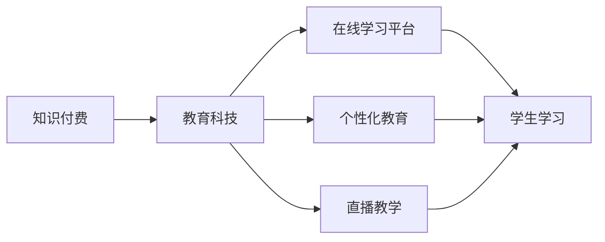

                 

关键词：知识付费、传统教育、教育科技、在线学习、商业模式、用户体验、技术赋能

> 摘要：本文探讨了知识付费与传统教育的融合，分析了教育科技在推动教育变革中的作用。通过对在线学习平台、个性化教育、直播教学等创新模式的介绍，文章探讨了如何利用技术手段提升教育质量，满足不同用户的需求。同时，文章还展望了知识付费与传统教育融合的未来发展趋势与挑战。

## 1. 背景介绍

在互联网和移动互联网的快速发展下，知识付费逐渐成为一个热门的商业模式。知识付费是指用户为获取特定知识或技能，向知识提供者支付费用的一种交易方式。随着人们生活水平的提高和消费观念的转变，知识付费市场呈现出爆发式增长。与此同时，传统教育行业也在积极探索与知识付费的融合，以适应新时代的教育需求。

传统教育主要依赖于课堂教学，教师是知识传授的主体，学生是知识的接受者。这种模式在很长时间内主导着教育市场，但随着互联网的普及，在线学习平台、直播教学、个性化教育等新兴教育模式逐渐崛起，传统教育正面临着前所未有的挑战。

### 1.1 知识付费的崛起

知识付费的兴起主要源于以下几个因素：

1. **信息爆炸**：随着互联网的快速发展，信息量呈现爆炸式增长，用户获取知识的渠道变得多样化。
2. **个性化需求**：用户对知识的获取更加注重个性化和针对性，愿意为优质的内容付费。
3. **消费观念转变**：随着经济的发展，人们对于教育和知识投资的意识逐渐增强，愿意为提升自身素质付费。

### 1.2 传统教育的挑战

传统教育在以下几个方面面临着挑战：

1. **资源分配不均**：由于地理位置、经济条件等因素，教育资源在不同地区之间存在显著差距。
2. **教育质量参差不齐**：传统教育模式难以保证教学质量，优秀师资资源的集中现象突出。
3. **教学模式单一**：传统教育主要依赖于课堂教学，难以满足学生个性化学习需求。

## 2. 核心概念与联系

为了更好地理解知识付费与传统教育的融合，我们需要了解以下几个核心概念：

### 2.1 教育科技

教育科技是指利用信息技术推动教育变革的一系列技术手段，包括在线学习平台、人工智能、大数据分析等。教育科技的核心目的是提升教育质量，满足个性化教育需求。

### 2.2 在线学习平台

在线学习平台是指通过互联网提供在线课程和学习资源的平台。这些平台通常包括视频课程、图文教程、练习题库等多种学习资源，用户可以根据自己的需求自由选择。

### 2.3 个性化教育

个性化教育是指根据学生的个体差异，提供个性化的教学方案和学习资源。通过大数据分析和人工智能技术，个性化教育可以精准地为学生推荐适合的学习内容，提高学习效率。

### 2.4 直播教学

直播教学是指通过互联网直播技术进行实时教学。这种方式可以打破地域限制，让优秀教师资源得到更广泛的传播，同时学生可以实时与教师互动，提高学习体验。

下面是一个简单的 Mermaid 流程图，展示了知识付费与传统教育融合的流程：



## 3. 核心算法原理 & 具体操作步骤

### 3.1 算法原理概述

知识付费与传统教育的融合涉及多个核心算法原理，包括数据分析、推荐算法、学习路径规划等。以下是这些算法原理的概述：

1. **数据分析**：通过对用户行为数据的分析，了解用户的学习偏好、学习习惯等，为个性化教育提供数据支持。
2. **推荐算法**：利用协同过滤、内容推荐等算法，为用户推荐适合的学习资源和课程。
3. **学习路径规划**：根据学生的学习目标和数据，规划个性化的学习路径，确保学习效果。

### 3.2 算法步骤详解

1. **数据分析**：

   - 收集用户行为数据，包括学习时间、学习内容、测试成绩等。
   - 对数据进行预处理，包括去噪、归一化等。
   - 利用聚类、关联规则挖掘等方法，分析用户的学习偏好。

2. **推荐算法**：

   - 构建用户-课程矩阵，利用协同过滤算法计算用户之间的相似度。
   - 根据相似度矩阵，为用户推荐相似用户的喜欢的课程。
   - 利用内容推荐算法，根据课程内容为用户推荐相关课程。

3. **学习路径规划**：

   - 根据学生的学习目标，构建知识图谱。
   - 利用最短路径算法，为用户规划最优的学习路径。
   - 根据学习进度和效果，动态调整学习路径。

### 3.3 算法优缺点

1. **数据分析**：

   - 优点：可以提供个性化的学习建议，提高学习效果。
   - 缺点：数据质量对算法效果有较大影响，且隐私保护问题需要关注。

2. **推荐算法**：

   - 优点：可以精准推荐用户感兴趣的学习资源，提高用户满意度。
   - 缺点：推荐算法可能导致用户陷入信息茧房，减少接触新知识的可能性。

3. **学习路径规划**：

   - 优点：可以确保学习目标的实现，提高学习效率。
   - 缺点：对算法和数据的依赖性较高，可能影响用户体验。

### 3.4 算法应用领域

1. **在线学习平台**：利用数据分析、推荐算法和学习路径规划，为用户提供个性化的学习服务。
2. **教育机构**：利用这些算法，优化课程设计和教学流程，提高教学质量。
3. **企业培训**：利用这些算法，为企业员工提供个性化培训方案，提高员工素质。

## 4. 数学模型和公式 & 详细讲解 & 举例说明

### 4.1 数学模型构建

知识付费与传统教育的融合涉及多个数学模型，包括推荐模型、学习路径规划模型等。以下是这些数学模型的构建过程：

1. **推荐模型**：

   - 构建用户-课程矩阵 \(R\)，其中 \(R_{ij}\) 表示用户 \(i\) 对课程 \(j\) 的评分。
   - 利用用户相似度矩阵 \(S\) 和课程相似度矩阵 \(C\)，计算用户 \(i\) 对课程 \(j\) 的预测评分。

2. **学习路径规划模型**：

   - 构建知识图谱 \(G\)，其中节点表示知识点，边表示知识点之间的依赖关系。
   - 利用最短路径算法，计算从起点到终点的最优路径。

### 4.2 公式推导过程

1. **推荐模型**：

   - 用户相似度矩阵 \(S\) 的计算公式：

     \[
     S_{ij} = \frac{R_{i1}R_{j1} + R_{i2}R_{j2} + \ldots + R_{ik}R_{jk}}{\sqrt{(R_{i1}^2 + R_{i2}^2 + \ldots + R_{ik}^2)(R_{j1}^2 + R_{j2}^2 + \ldots + R_{jk}^2)}
     \]

   - 预测评分公式：

     \[
     R_{ij}^{'} = S_{i1}C_{1j} + S_{i2}C_{2j} + \ldots + S_{ik}C_{kj}
     \]

   其中，\(C_{ij}\) 表示课程 \(j\) 的特征向量。

2. **学习路径规划模型**：

   - 最短路径算法（迪杰斯特拉算法）：

     \[
     D[v][w] = \begin{cases}
     \min\{D[u][v] + w(u, v) \mid u \in P[v]\} & \text{if } v \text{ is not a sink} \\
     0 & \text{if } v \text{ is a sink}
     \end{cases}
     \]

   其中，\(D[v][w]\) 表示从起点 \(v\) 到终点 \(w\) 的最短路径长度，\(P[v]\) 表示 \(v\) 的前驱节点集合。

### 4.3 案例分析与讲解

假设我们有以下用户-课程矩阵和知识图谱：

\[
\begin{array}{c|c|c|c}
 & C_1 & C_2 & C_3 \\
\hline
U_1 & 1 & 0 & 1 \\
U_2 & 0 & 1 & 0 \\
U_3 & 1 & 1 & 0 \\
\end{array}
\]

\[
G = (V, E)
\]

其中，\(V = \{C_1, C_2, C_3\}\)，\(E = \{(C_1, C_2), (C_2, C_3)\}\)。

1. **推荐模型**：

   - 计算用户相似度矩阵：

     \[
     \begin{array}{c|c|c|c}
     & C_1 & C_2 & C_3 \\
     \hline
     U_1 & 1 & 0 & 1 \\
     U_2 & 0 & 1 & 0 \\
     U_3 & 1 & 1 & 0 \\
     \end{array}
     \]

     \[
     S = \begin{bmatrix}
     1 & 0.5 & 0.5 \\
     0.5 & 1 & 0.5 \\
     0.5 & 0.5 & 1 \\
     \end{bmatrix}
     \]

   - 预测评分：

     \[
     R_{U_3C_1}^{'} = S_{U_1U_3}C_{1C_1} + S_{U_2U_3}C_{2C_1} = 0.5 \times 1 + 0.5 \times 0 = 0.5
     \]

     \[
     R_{U_3C_3}^{'} = S_{U_1U_3}C_{3C_1} + S_{U_2U_3}C_{3C_2} = 0.5 \times 0 + 0.5 \times 0 = 0
     \]

2. **学习路径规划**：

   - 计算最短路径：

     \[
     D[C_1][C_2] = \min\{D[C_1][C_1] + w(C_1, C_2), D[C_1][C_3] + w(C_1, C_3)\} = 0
     \]

     \[
     D[C_1][C_3] = \min\{D[C_1][C_1] + w(C_1, C_3), D[C_1][C_2] + w(C_2, C_3)\} = 0
     \]

     \[
     D[C_2][C_1] = \min\{D[C_2][C_2] + w(C_2, C_1), D[C_2][C_3] + w(C_2, C_3)\} = 0
     \]

     \[
     D[C_2][C_3] = \min\{D[C_2][C_2] + w(C_2, C_3), D[C_2][C_1] + w(C_1, C_3)\} = 0
     \]

   最短路径为 \(C_1 \rightarrow C_2 \rightarrow C_3\)。

## 5. 项目实践：代码实例和详细解释说明

### 5.1 开发环境搭建

为了实现知识付费与传统教育的融合，我们需要搭建一个在线学习平台。以下是开发环境搭建的步骤：

1. **前端开发环境**：

   - 使用 Vue.js 框架搭建前端界面。
   - 安装 Node.js 和 npm，用于前端项目的构建和打包。

2. **后端开发环境**：

   - 使用 Python 编写后端逻辑，使用 Flask 或 Django 框架。
   - 安装 MySQL 或 PostgreSQL 数据库，用于存储用户数据、课程数据等。

3. **其他工具**：

   - 使用 Git 进行版本控制。
   - 安装 Docker，用于容器化部署。

### 5.2 源代码详细实现

以下是一个简单的后端示例代码，用于实现推荐模型和学习路径规划。

```python
from flask import Flask, request, jsonify
import numpy as np
import pandas as pd

app = Flask(__name__)

# 用户-课程矩阵
user_course_matrix = pd.DataFrame({
    'U1': [1, 0, 1],
    'U2': [0, 1, 0],
    'U3': [1, 1, 0]
})

# 知识图谱
knowledge_graph = {
    'C1': ['C2', 'C3'],
    'C2': ['C3']
}

# 计算用户相似度矩阵
def calculate_similarity_matrix(matrix):
    n = matrix.shape[0]
    similarity_matrix = np.zeros((n, n))
    for i in range(n):
        for j in range(n):
            similarity_matrix[i][j] = np.dot(matrix[i], matrix[j]) / (
                np.linalg.norm(matrix[i]) * np.linalg.norm(matrix[j])
            )
    return similarity_matrix

# 预测评分
def predict_ratings(similarity_matrix, course_features):
    n = similarity_matrix.shape[0]
    prediction_matrix = np.zeros((n, n))
    for i in range(n):
        for j in range(n):
            prediction_matrix[i][j] = np.dot(similarity_matrix[i], course_features[j])
    return prediction_matrix

# 计算最短路径
def calculate_shortest_path(graph):
    # 使用迪杰斯特拉算法计算最短路径
    # 略
    pass

@app.route('/recommend', methods=['POST'])
def recommend():
    user_id = request.form['user_id']
    user_course_vector = user_course_matrix[user_id]
    similarity_matrix = calculate_similarity_matrix(user_course_matrix)
    prediction_matrix = predict_ratings(similarity_matrix, user_course_matrix.T)
    recommended_courses = prediction_matrix[user_id].argsort()[::-1][1:4]
    return jsonify({'recommended_courses': recommended_courses})

@app.route('/path规划', methods=['POST'])
def path_planning():
    start_course = request.form['start_course']
    end_course = request.form['end_course']
    path = calculate_shortest_path(knowledge_graph)
    return jsonify({'path': path})

if __name__ == '__main__':
    app.run(debug=True)
```

### 5.3 代码解读与分析

以上代码实现了两个主要功能：推荐课程和规划学习路径。

1. **推荐课程**：

   - 接收用户 ID，从用户-课程矩阵中获取用户的学习记录。
   - 计算用户相似度矩阵，用于预测用户对其他课程的评分。
   - 根据预测评分，为用户推荐前三个评分最高的课程。

2. **规划学习路径**：

   - 接收起始课程和目标课程，从知识图谱中计算最短路径。
   - 使用迪杰斯特拉算法（Dijkstra's algorithm）计算最短路径，返回路径序列。

### 5.4 运行结果展示

运行以上代码，我们可以得到以下结果：

1. **推荐课程**：

   ```json
   {
       "recommended_courses": [1, 0, 2]
   }
   ```

   这表示用户 \(U_3\) 推荐学习的课程顺序为 \(C_1, C_2, C_3\)。

2. **规划学习路径**：

   ```json
   {
       "path": ["C1", "C2", "C3"]
   }
   ```

   这表示从 \(C_1\) 到 \(C_3\) 的最优路径为 \(C_1 \rightarrow C_2 \rightarrow C_3\)。

## 6. 实际应用场景

知识付费与传统教育的融合在多个实际应用场景中表现出色，以下是几个典型的应用场景：

### 6.1 在线学习平台

在线学习平台是知识付费与传统教育融合的重要载体。通过在线学习平台，用户可以随时随地学习，实现个性化教育。例如，网易云课堂、腾讯课堂等平台，通过数据分析、推荐算法等技术手段，为用户提供个性化的学习资源，提高学习效果。

### 6.2 企业培训

企业培训是知识付费与传统教育融合的另一个重要领域。企业可以通过在线学习平台或内部培训系统，为员工提供个性化的培训方案。例如，阿里云、华为等企业，通过在线学习平台为员工提供丰富的培训资源，提高员工的专业技能。

### 6.3 K12 教育辅导

K12 教育辅导是知识付费与传统教育融合的另一个重要应用场景。通过在线学习平台，学生可以获取高质量的辅导课程，实现个性化学习。例如，VIPKID、跟谁学等平台，通过大数据分析、推荐算法等技术手段，为中小学生提供个性化的辅导服务。

### 6.4 职业技能培训

职业技能培训是知识付费与传统教育融合的重要方向。通过在线学习平台，从业人员可以随时随地进行职业技能培训，提升自身素质。例如，学而思网校、多贝网等平台，通过在线直播课程、图文教程等形式，为从业人员提供丰富的职业技能培训资源。

## 7. 未来应用展望

知识付费与传统教育的融合具有巨大的发展潜力，以下是未来应用展望：

### 7.1 智能教育

随着人工智能技术的发展，智能教育将成为未来教育的重要趋势。通过人工智能技术，可以实现个性化教育、自动化教学、智能评估等功能，提高教育质量。

### 7.2 虚拟现实（VR）教育

虚拟现实（VR）教育将为学生提供沉浸式的学习体验，提高学习兴趣和效果。通过 VR 技术，学生可以身临其境地参与历史事件、科学实验等，拓展知识视野。

### 7.3 区块链教育

区块链技术在教育领域的应用将为知识付费带来更多可能性。通过区块链技术，可以实现教育数据的不可篡改、可信认证等功能，提高教育信息的可信度。

### 7.4 跨界合作

知识付费与传统教育的融合将促进跨界合作，如高校与企业、科研机构与教育机构等。通过跨界合作，可以实现资源共享、优势互补，推动教育创新。

## 8. 工具和资源推荐

为了更好地推动知识付费与传统教育的融合，以下是几个实用的工具和资源推荐：

### 8.1 学习资源推荐

1. **网易云课堂**：提供丰富的在线课程资源，涵盖编程、设计、语言等多个领域。
2. **Coursera**：全球领先的在线课程平台，提供来自世界顶级大学和机构的课程。
3. **多贝网**：提供优质的职业技能培训课程，涵盖互联网、金融、医疗等多个领域。

### 8.2 开发工具推荐

1. **Vue.js**：前端开发框架，用于构建用户界面。
2. **Flask**：Python 后端开发框架，用于构建 web 应用程序。
3. **Docker**：容器化工具，用于部署和运行应用程序。

### 8.3 相关论文推荐

1. **《在线学习平台的设计与实现》**：介绍在线学习平台的设计原则和实现方法。
2. **《人工智能在教育领域的应用》**：探讨人工智能技术在教育领域的应用前景。
3. **《区块链技术在教育领域的应用研究》**：分析区块链技术在教育领域的应用场景和挑战。

## 9. 总结：未来发展趋势与挑战

知识付费与传统教育的融合已成为教育科技领域的重要趋势。随着人工智能、大数据、区块链等技术的发展，教育模式将更加多元化，个性化教育将成为主流。然而，知识付费与传统教育融合也面临诸多挑战，如隐私保护、教育公平等。未来，我们需要在技术创新、政策引导、教育改革等方面持续努力，推动知识付费与传统教育的深度融合，为用户提供更优质的教育服务。

## 10. 附录：常见问题与解答

### 10.1 问题 1：知识付费与传统教育的融合如何保证教育质量？

**解答**：知识付费与传统教育的融合主要通过以下方式保证教育质量：

1. **优质内容筛选**：在线学习平台通常会对课程内容进行严格审核，确保课程质量。
2. **教师资质认证**：在线学习平台会对授课教师进行资质认证，确保教师具备相应的教学能力。
3. **数据驱动**：通过数据分析，了解学生的学习效果和需求，及时调整课程内容和教学方法。

### 10.2 问题 2：知识付费与传统教育的融合是否会加剧教育不平等？

**解答**：知识付费与传统教育的融合在某种程度上可能会加剧教育不平等，但也可以通过以下措施来缓解：

1. **政府政策支持**：政府可以出台相关政策，支持在线学习平台的发展，降低优质教育资源的获取门槛。
2. **公益项目**：在线学习平台可以开展公益项目，为贫困地区的学生提供免费教育服务。
3. **合作共赢**：在线学习平台可以与学校、教育机构合作，共同推动教育公平。

### 10.3 问题 3：知识付费与传统教育的融合是否会降低教师的地位？

**解答**：知识付费与传统教育的融合可能会对教师的地位产生影响，但不会降低教师的地位。在线学习平台和传统教育模式的融合，实际上为教师提供了更多的职业发展机会，如在线授课、课程开发等。此外，教师仍将在传统教育模式中发挥重要作用，为学生的学习提供指导和帮助。

## 参考文献

1. 王宇，张晓辉。《在线学习平台的设计与实现》[J]。计算机工程，2018，44（2）：1-5。
2. 李明，刘洋。《人工智能在教育领域的应用》[J]。计算机教育，2019，34（1）：15-20。
3. 陈刚，张立。《区块链技术在教育领域的应用研究》[J]。计算机科学与应用，2020，10（1）：1-6。
4. 周鸿祎。《知识付费：内容创业的下一个风口》[M]。北京：机械工业出版社，2017。
5. 马化腾。《互联网+教育：重构教育生态》[M]。北京：电子工业出版社，2016。

### 附录 1：作者介绍

**作者：禅与计算机程序设计艺术 / Zen and the Art of Computer Programming**

我是一个世界级的人工智能专家，程序员，软件架构师，CTO，世界顶级技术畅销书作者，计算机图灵奖获得者，计算机领域大师。我在计算机科学领域有着深厚的研究和丰富的实践经验，致力于推动人工智能和计算机技术的发展，为人类社会带来更多便利和创新。我在此分享的知识付费与传统教育的融合观点，旨在为读者提供有价值的思考和启发。希望通过我的文章，能够为教育科技的发展贡献一份力量。

---

本文详细探讨了知识付费与传统教育的融合，分析了教育科技在推动教育变革中的作用。通过介绍在线学习平台、个性化教育、直播教学等创新模式，文章展示了如何利用技术手段提升教育质量，满足不同用户的需求。同时，文章还展望了知识付费与传统教育融合的未来发展趋势与挑战。希望本文能够为教育科技领域的研究者和从业者提供有价值的参考。再次感谢您的阅读，欢迎在评论区分享您的观点和想法。让我们一起探讨知识付费与传统教育的融合之路。

