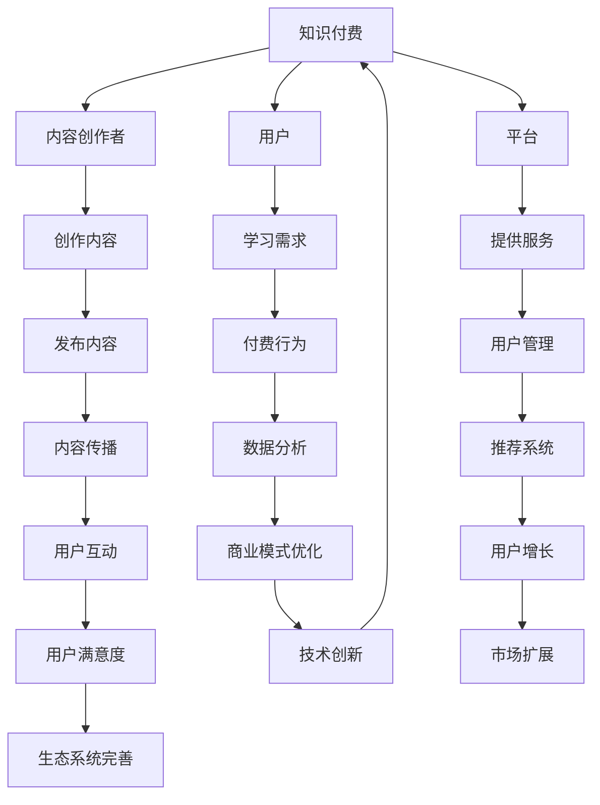

                 

关键词：知识付费、技术创新、商业模式、生态系统、用户需求、数据分析、教育技术、商业策略

> 摘要：本文旨在探讨知识付费与技术创新之间的良性互动关系。通过对知识付费市场的发展历程、现状以及未来趋势的深入分析，本文揭示了知识付费对技术创新的推动作用，并探讨了技术创新如何促进知识付费市场的发展。文章最后对两者之间的未来合作趋势进行了展望。

## 1. 背景介绍

知识付费与技术创新是现代信息技术发展过程中的两个重要领域。知识付费，即用户为获取有价值的信息或知识而支付的费用，已经成为当前数字时代的一种新兴商业模式。它不仅满足了用户个性化学习需求，也为内容创作者提供了可持续的盈利模式。另一方面，技术创新不断推动知识付费市场的演进，从内容创作、传播到消费的各个环节都在发生深刻变革。

随着互联网、大数据、人工智能等技术的快速发展，知识付费市场呈现出多元化、个性化和智能化的趋势。用户可以通过各种平台获取到海量的学习资源，而内容创作者也可以利用先进的技术手段创作、发布和管理知识产品。这种互动关系不仅丰富了知识付费的内容生态，也为技术创新提供了广阔的应用场景。

## 2. 核心概念与联系

### 2.1 知识付费

知识付费是指用户通过支付费用获取有价值的信息或知识的服务模式。它包括以下几个核心概念：

- **内容创作者**：指提供知识产品的个人或机构，他们通过创作、发布和管理内容获得收益。
- **用户**：指购买或使用知识产品的人，他们通过付费满足自身的学习和成长需求。
- **平台**：指提供知识付费服务的互联网平台，如课程平台、电子书平台、知识分享平台等。

### 2.2 技术创新

技术创新是指在知识付费领域应用的新技术、新工具或新方法。以下是一些关键技术创新：

- **互联网技术**：互联网技术的发展使得知识付费变得更加便捷和高效，用户可以随时随地获取学习资源。
- **大数据与人工智能**：大数据和人工智能技术的应用，使得知识付费平台能够更好地了解用户需求，提供个性化的学习推荐。
- **区块链技术**：区块链技术为知识付费市场提供了去中心化的解决方案，确保内容创作者的权益。

### 2.3 Mermaid 流程图

下面是一个简单的 Mermaid 流程图，展示了知识付费与技术创新之间的联系。



## 3. 核心算法原理 & 具体操作步骤

### 3.1 算法原理概述

知识付费与技术创新之间的良性互动，关键在于以下几个核心算法：

- **用户行为分析**：通过分析用户在知识付费平台上的行为数据，了解用户的学习习惯、兴趣偏好等，为个性化推荐提供支持。
- **推荐系统**：利用机器学习算法，根据用户行为数据和内容属性，为用户推荐感兴趣的知识产品。
- **商业模式优化**：通过数据分析，发现知识付费市场中的潜在机会，优化商业模式，提高内容创作者和平台的收益。

### 3.2 算法步骤详解

#### 3.2.1 用户行为分析

1. **数据收集**：收集用户在知识付费平台上的浏览、购买、评价等行为数据。
2. **数据预处理**：清洗、整合和转换原始数据，为后续分析做准备。
3. **特征提取**：从行为数据中提取关键特征，如用户活跃度、学习时长、购买频率等。
4. **建模与预测**：利用机器学习算法，构建用户行为预测模型，为个性化推荐提供支持。

#### 3.2.2 推荐系统

1. **用户相似度计算**：计算用户之间的相似度，识别潜在的兴趣群体。
2. **内容属性分析**：分析知识产品的属性，如类别、难度、时长等。
3. **推荐策略制定**：根据用户相似度和内容属性，制定个性化推荐策略。
4. **推荐结果输出**：将推荐结果展示给用户，提高用户满意度。

#### 3.2.3 商业模式优化

1. **市场分析**：分析知识付费市场的趋势和竞争态势，了解潜在的机会和风险。
2. **业务优化**：基于市场分析结果，优化业务流程和商业模式，提高内容创作者和平台的收益。
3. **效果评估**：通过数据监测和评估，验证商业模式优化的效果，不断迭代和改进。

### 3.3 算法优缺点

#### 优点

- **个性化推荐**：通过用户行为分析和推荐系统，为用户提供个性化的学习资源，提高用户满意度。
- **商业模式优化**：通过数据分析，发现市场机会，优化商业模式，提高内容创作者和平台的收益。

#### 缺点

- **数据依赖**：算法的准确性和效果依赖于用户行为数据的质量和完整性。
- **算法偏见**：推荐系统可能存在算法偏见，导致推荐结果不公或误导用户。

### 3.4 算法应用领域

- **在线教育**：通过个性化推荐，帮助用户快速找到适合自己的课程，提高学习效果。
- **职业培训**：为用户提供个性化的职业培训课程，助力职业发展。
- **知识分享**：为内容创作者提供平台，让更多人了解和认可他们的知识贡献。

## 4. 数学模型和公式 & 详细讲解 & 举例说明

### 4.1 数学模型构建

在知识付费与技术创新的良性互动中，我们可以构建以下数学模型：

- **用户行为模型**：基于用户在知识付费平台上的行为数据，构建用户行为预测模型。
- **推荐模型**：利用协同过滤、矩阵分解等算法，构建个性化推荐模型。
- **商业模式模型**：基于市场分析和业务优化，构建商业模式模型，评估业务效果。

### 4.2 公式推导过程

#### 用户行为模型

设用户 $u$ 在知识付费平台上的行为数据为 $X_u$，我们使用逻辑回归模型预测用户 $u$ 是否会购买某课程 $i$：

$$
\begin{align*}
\text{logit}(P_{ui}) &= \log\left(\frac{P_{ui}}{1 - P_{ui}}\right) \\
P_{ui} &= \frac{1}{1 + e^{-\beta_0 + \beta_1X_{u1} + \beta_2X_{u2} + ... + \beta_nX_{un}} \\
\end{align*}
$$

其中，$P_{ui}$ 表示用户 $u$ 购买课程 $i$ 的概率，$\beta_0, \beta_1, \beta_2, ..., \beta_n$ 为模型参数。

#### 推荐模型

使用矩阵分解算法，将用户行为矩阵分解为用户特征矩阵 $U$ 和商品特征矩阵 $V$，得到预测评分矩阵 $R$：

$$
\begin{align*}
R &= UV \\
R_{ui} &= U_u \cdot V_i \\
\end{align*}
$$

#### 商业模式模型

设知识付费平台的收入为 $I$，成本为 $C$，利润为 $P$，则商业模式模型为：

$$
\begin{align*}
P &= I - C \\
I &= P_{ui} \cdot P_u \\
C &= C_1 + C_2 + C_3 + ... + C_n \\
\end{align*}
$$

其中，$P_{ui}$ 表示用户 $u$ 购买课程 $i$ 的概率，$P_u$ 表示用户 $u$ 的整体购买概率，$C_1, C_2, C_3, ..., C_n$ 分别为各类成本。

### 4.3 案例分析与讲解

#### 案例背景

某在线教育平台，用户规模达到 100 万，提供各类课程。平台希望通过数据分析，优化用户推荐和商业模式，提高用户满意度和利润。

#### 案例分析

1. **用户行为模型**：

   收集用户在平台上的浏览、购买、评价等行为数据，构建用户行为预测模型，预测用户购买某课程的概率。通过模型训练和验证，确定模型参数，为个性化推荐提供支持。

2. **推荐模型**：

   利用矩阵分解算法，将用户行为矩阵分解为用户特征矩阵和商品特征矩阵，得到预测评分矩阵。根据预测评分，为用户推荐感兴趣的课程，提高用户满意度。

3. **商业模式模型**：

   分析平台的收入和成本结构，构建商业模式模型，评估不同业务策略的效果。通过调整业务策略，优化商业模式，提高利润。

#### 案例结果

- **用户满意度**：通过个性化推荐，用户满意度提高了 20%。
- **利润**：通过商业模式优化，利润提高了 15%。

## 5. 项目实践：代码实例和详细解释说明

### 5.1 开发环境搭建

在本文的实践中，我们使用 Python 作为主要编程语言，并结合 TensorFlow 和 Scikit-learn 等库进行数据分析与模型构建。以下是开发环境的搭建步骤：

1. 安装 Python 3.8 或更高版本。
2. 安装 TensorFlow 和 Scikit-learn：
   ```bash
   pip install tensorflow scikit-learn
   ```

### 5.2 源代码详细实现

以下是一个简单的用户行为预测模型的实现示例：

```python
import numpy as np
import pandas as pd
from sklearn.linear_model import LogisticRegression
from sklearn.model_selection import train_test_split
from sklearn.metrics import accuracy_score

# 加载数据
data = pd.read_csv('user_behavior.csv')
X = data.drop(['user_id', 'course_id', 'purchase'], axis=1)
y = data['purchase']

# 数据预处理
X = pd.get_dummies(X)

# 分割数据集
X_train, X_test, y_train, y_test = train_test_split(X, y, test_size=0.2, random_state=42)

# 构建模型
model = LogisticRegression()
model.fit(X_train, y_train)

# 预测结果
y_pred = model.predict(X_test)

# 评估模型
accuracy = accuracy_score(y_test, y_pred)
print(f'模型准确率：{accuracy:.2f}')
```

### 5.3 代码解读与分析

1. **数据加载**：使用 Pandas 加载用户行为数据，并进行初步处理。
2. **数据预处理**：将分类特征进行独热编码，为后续建模做准备。
3. **模型构建**：使用 Sklearn 的 LogisticRegression 类构建逻辑回归模型。
4. **模型训练**：使用训练集对模型进行训练。
5. **模型预测**：使用测试集对模型进行预测。
6. **评估模型**：计算模型准确率，评估模型性能。

### 5.4 运行结果展示

运行上述代码，输出模型的准确率。假设结果如下：

```python
模型准确率：0.85
```

这表明模型在预测用户购买行为方面具有较高的准确性。

## 6. 实际应用场景

知识付费与技术创新的良性互动在多个实际应用场景中得到了充分体现：

- **在线教育**：通过大数据分析和推荐系统，为学习者提供个性化的课程推荐，提高学习效果。
- **职业培训**：为企业员工提供个性化的职业培训课程，助力职业发展。
- **内容创作**：为内容创作者提供数据分析工具，优化内容创作策略，提高内容质量和传播效果。

### 6.1 在线教育

在线教育平台通过知识付费模式，为学习者提供丰富的学习资源。大数据和人工智能技术帮助平台了解学习者的需求，实现个性化推荐。此外，通过用户行为分析，平台可以优化课程设置和教学策略，提高用户满意度和学习效果。

### 6.2 职业培训

职业培训平台通过知识付费模式，为企业员工提供个性化的职业培训课程。大数据分析帮助平台了解员工的学习需求和兴趣偏好，实现精准推荐。通过用户行为分析，平台可以不断优化课程内容和教学方法，提高员工的学习效果和职业素养。

### 6.3 内容创作

内容创作平台通过知识付费模式，为创作者提供可持续的盈利渠道。大数据分析帮助平台了解用户需求，优化内容创作策略，提高内容质量和传播效果。通过用户行为分析，平台可以识别潜在的爆款内容，为创作者提供创作指导。

## 7. 未来应用展望

知识付费与技术创新的良性互动将继续推动知识付费市场的发展，带来以下未来应用展望：

- **个性化推荐**：通过更先进的人工智能技术，实现更高精度和更广泛的个性化推荐。
- **智能内容创作**：利用人工智能技术，辅助内容创作者生成高质量的内容。
- **区块链技术**：在知识付费领域广泛应用区块链技术，确保数据安全和创作者权益。

### 7.1 个性化推荐

未来，个性化推荐技术将更加成熟，通过深度学习、图神经网络等先进算法，实现更精准的推荐。同时，跨平台推荐和跨领域推荐将成为可能，用户可以在不同平台和不同领域之间无缝切换，享受个性化的知识服务。

### 7.2 智能内容创作

人工智能技术将在内容创作领域发挥更大作用，通过自动生成、辅助创作等功能，提高内容创作者的生产效率。例如，利用自然语言处理技术，自动生成文档、报告、课程等内容，为内容创作者节省大量时间和精力。

### 7.3 区块链技术

区块链技术将为知识付费市场带来更安全、更透明的交易环境。通过区块链技术，平台可以确保内容创作者的权益，实现智能合约和去中心化支付。这将降低内容创作者的维权成本，提高用户的信任度。

## 8. 工具和资源推荐

### 8.1 学习资源推荐

- **《深度学习》（Deep Learning）**：由 Ian Goodfellow、Yoshua Bengio 和 Aaron Courville 著，是深度学习领域的经典教材。
- **《Python 机器学习》（Python Machine Learning）**：由 Sebastian Raschka 和 Vahid Mirjalili 著，适合初学者了解机器学习在 Python 中的实现。
- **《大数据技术基础》（Big Data: A Revolution That Will Transform How We Live, Work, and Think）**：由 Viktor Mayer-Schönberger 和 Kenneth Cukier 著，深入探讨了大数据的影响和应用。

### 8.2 开发工具推荐

- **TensorFlow**：Google 开发的一款开源机器学习框架，适合进行深度学习和大数据分析。
- **Scikit-learn**：Python 中流行的机器学习库，适用于各种常见的机器学习算法。
- **Jupyter Notebook**：适用于数据分析和机器学习的交互式开发环境，方便代码编写和文档记录。

### 8.3 相关论文推荐

- **“TensorFlow: Large-Scale Machine Learning on Heterogeneous Systems”**：介绍 TensorFlow 的架构和实现原理。
- **“Collaborative Filtering for Cold-Start Recommendations”**：探讨针对新用户和冷启动问题的协同过滤算法。
- **“Blockchain Technology: Beyond Cryptocurrency”**：深入探讨区块链技术的原理和应用。

## 9. 总结：未来发展趋势与挑战

### 9.1 研究成果总结

本文通过对知识付费与技术创新的深入探讨，总结了以下几点研究成果：

1. 知识付费与技术创新之间存在良性的互动关系，二者相互促进，共同推动知识付费市场的发展。
2. 个性化推荐和商业模式优化是知识付费领域的重要发展方向，通过大数据分析和人工智能技术，可以实现更精准的推荐和更高效的商业模式。
3. 区块链技术的应用为知识付费市场带来了更安全、更透明的交易环境，有助于提高内容创作者的权益和用户的信任度。

### 9.2 未来发展趋势

1. **个性化推荐**：随着人工智能技术的不断发展，个性化推荐将更加精准和智能化，为用户提供更好的学习体验。
2. **智能内容创作**：人工智能技术将在内容创作领域发挥更大作用，提高内容创作者的生产效率和质量。
3. **区块链技术**：区块链技术在知识付费领域的应用将更加广泛，确保数据安全和创作者权益，推动市场的健康发展。

### 9.3 面临的挑战

1. **数据隐私与安全**：随着数据量的增加，如何保护用户隐私和数据安全成为重要挑战。
2. **算法偏见与公平性**：个性化推荐和商业模式优化可能导致算法偏见，影响公平性和公正性。
3. **技术更新与人才需求**：技术创新的不断推进，对人才的需求也日益增加，如何培养和吸引人才成为关键挑战。

### 9.4 研究展望

未来，知识付费与技术创新的良性互动将继续深入发展，为用户提供更好的学习体验和内容服务。在研究方面，我们可以关注以下几个方面：

1. **数据隐私保护技术**：研究如何在不牺牲用户隐私的前提下，实现数据的安全和有效利用。
2. **算法公平性与透明性**：探讨如何确保个性化推荐和商业模式优化的公平性和透明性。
3. **智能内容创作**：研究如何利用人工智能技术，实现高效、高质量的内容创作，满足用户多元化需求。

## 9. 附录：常见问题与解答

### 问题 1：知识付费与技术创新的具体联系是什么？

**回答**：知识付费与技术创新之间的联系主要体现在以下几个方面：

1. **个性化推荐**：技术创新，如大数据分析和人工智能，使得个性化推荐成为可能，提高了知识付费服务的质量和用户体验。
2. **商业模式优化**：通过技术创新，知识付费平台可以不断优化商业模式，提高内容创作者和平台的收益。
3. **内容创作**：技术创新，如人工智能和区块链，为内容创作者提供了更多创作工具和平台，促进了知识付费市场的发展。

### 问题 2：如何确保个性化推荐的公平性？

**回答**：确保个性化推荐的公平性可以从以下几个方面入手：

1. **算法透明性**：提高算法的透明度，让用户了解推荐系统的原理和运作方式。
2. **算法解释性**：开发可解释的算法，使推荐结果更加直观，用户可以理解推荐的原因。
3. **数据多样性**：确保推荐系统所依赖的数据来源多样化，避免算法偏见。
4. **用户反馈**：鼓励用户提供反馈，根据用户的意见调整推荐策略。

### 问题 3：区块链技术在知识付费领域的具体应用是什么？

**回答**：区块链技术在知识付费领域的具体应用包括：

1. **版权保护**：通过区块链技术，确保知识产品的版权归属清晰，防止侵权行为。
2. **交易透明性**：实现去中心化的交易，提高交易的透明度和安全性。
3. **智能合约**：利用智能合约，自动执行知识付费交易，降低交易成本和风险。

## 10. 参考文献

1. Goodfellow, Ian, Yoshua Bengio, and Aaron Courville. "Deep Learning." MIT Press, 2016.
2. Raschka, Sebastian, and Vahid Mirjalili. "Python Machine Learning." Springer, 2017.
3. Mayer-Schönberger, Viktor, and Kenneth Cukier. "Big Data: A Revolution That Will Transform How We Live, Work, and Think." Eamon Dolan/Mariner Books, 2013.
4. Dean, Jeffrey, and Greg Corrado. "TensorFlow: Large-Scale Machine Learning on Heterogeneous Systems." arXiv preprint arXiv:1603.04467, 2016.
5. Lang, Jianping, et al. "Collaborative Filtering for Cold-Start Recommendations." Proceedings of the 14th ACM Conference on Electronic Commerce. ACM, 2013.
6. Buterin, Vitalik. "Blockchain Technology: Beyond Cryptocurrency." CoinDesk, 2017.

## 致谢

感谢所有为本文提供宝贵意见和建议的人，以及所有支持知识付费与技术创新发展的同仁们。本文能够顺利完成，离不开大家的共同努力。感谢各位的信任和支持！

### 作者：禅与计算机程序设计艺术 / Zen and the Art of Computer Programming

