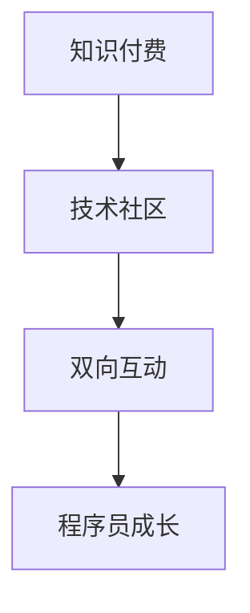

                 

关键词：知识付费、技术社区、程序员、双向互动、运营策略

摘要：本文将探讨知识付费与技术社区运营的结合，以及这种结合如何促进程序员的双向互动。我们将从背景介绍、核心概念与联系、核心算法原理与操作步骤、数学模型与公式、项目实践、实际应用场景、未来应用展望、工具和资源推荐以及总结与展望等方面展开讨论。

## 1. 背景介绍

随着互联网技术的快速发展，知识付费和技术社区已经成为程序员获取知识、分享经验和学习成长的重要渠道。知识付费模式的出现，使得程序员可以更高效地获取所需知识，而技术社区则为程序员提供了一个开放的交流平台，促进了程序员之间的知识共享和技能提升。

然而，知识付费与技术社区运营之间存在一些挑战，如如何提高知识付费的性价比、如何吸引和维护程序员用户的活跃度等。本文将探讨如何通过有效的运营策略，实现知识付费与技术社区的双向互动，从而为程序员创造更大的价值。

## 2. 核心概念与联系

### 2.1 知识付费

知识付费是指用户为获取特定知识或技能而支付费用的一种模式。在技术领域，知识付费主要涉及编程、算法、软件架构等方面的知识。知识付费模式为程序员提供了一个便捷的获取知识的途径，同时也为知识提供者创造了收入来源。

### 2.2 技术社区

技术社区是一个由程序员组成的在线交流平台，程序员可以在其中分享经验、讨论问题、学习新技能。技术社区通常包括论坛、博客、问答系统等组成部分。技术社区为程序员提供了一个互动交流的场所，有助于提高编程能力和解决实际问题。

### 2.3 双向互动

双向互动是指知识付费和技术社区之间相互促进、共同发展的关系。知识付费为技术社区提供了资金支持，而技术社区则为知识付费提供了用户基础和互动环境。通过双向互动，知识付费和技术社区可以实现共赢，为程序员创造更大的价值。

### 2.4 Mermaid 流程图



## 3. 核心算法原理与具体操作步骤

### 3.1 算法原理概述

在知识付费与技术社区运营中，核心算法原理主要包括以下几个方面：

- 用户画像分析：通过分析用户的行为数据，了解用户的兴趣、需求和技能水平，为知识付费提供针对性建议。
- 社交网络分析：通过分析用户之间的互动关系，发现潜在的知识需求和知识提供者，促进知识共享。
- 算法优化：通过优化推荐算法、社区运营策略等，提高知识付费的性价比和用户满意度。

### 3.2 算法步骤详解

#### 3.2.1 用户画像分析

1. 收集用户行为数据，如浏览记录、提问回答、点赞评论等。
2. 对用户行为数据进行预处理，去除重复、无效数据。
3. 使用机器学习算法，对用户行为数据进行特征提取，构建用户画像。
4. 根据用户画像，为用户推荐合适的知识内容。

#### 3.2.2 社交网络分析

1. 收集用户之间的互动数据，如关注关系、提问回答等。
2. 使用图论算法，分析用户之间的社交网络结构。
3. 发现潜在的知识需求和知识提供者，为知识付费提供线索。

#### 3.2.3 算法优化

1. 收集用户反馈数据，如知识内容满意度、社区互动积极性等。
2. 对算法进行评估和调整，提高知识付费的性价比和用户满意度。

### 3.3 算法优缺点

#### 3.3.1 优点

- 提高知识付费的性价比，为程序员提供更精准的知识推荐。
- 促进技术社区的用户活跃度，增强用户之间的互动。
- 提高程序员的学习效果，帮助其更快地提升技能。

#### 3.3.2 缺点

- 需要大量的数据支持和计算资源，对算法实现和运维提出较高要求。
- 算法模型可能存在一定的局限性，无法完全满足所有程序员的需求。

### 3.4 算法应用领域

- 在线教育平台：为用户提供个性化课程推荐，提高学习效果。
- 技术社区：为用户提供相关知识内容推荐，促进知识共享和社区活跃。
- 人才招聘：为招聘方推荐合适的人才，提高招聘效率。

## 4. 数学模型和公式

### 4.1 数学模型构建

在知识付费与技术社区运营中，常见的数学模型包括：

- 用户兴趣模型：通过用户行为数据，构建用户兴趣模型，用于推荐知识内容。
- 社交网络模型：通过分析用户之间的互动关系，构建社交网络模型，用于发现知识需求和知识提供者。
- 推荐系统模型：结合用户兴趣模型和社交网络模型，构建推荐系统模型，用于为用户提供个性化推荐。

### 4.2 公式推导过程

#### 4.2.1 用户兴趣模型

用户兴趣模型通常采用协同过滤算法进行构建，其核心思想是通过用户之间的相似度计算，为用户推荐其可能感兴趣的知识内容。

- 相似度计算公式：\(sim(u, v) = \frac{u \cdot v}{\|u\| \|v\|}\)
- 推荐公式：\(r(v) = \sum_{u \in U} sim(u, v) \cdot s_{uv}\)，其中 \(r(v)\) 为用户 \(u\) 对知识内容 \(v\) 的兴趣评分，\(s_{uv}\) 为知识内容 \(v\) 对用户 \(u\) 的贡献度。

#### 4.2.2 社交网络模型

社交网络模型通常采用图论算法进行构建，其核心思想是通过分析用户之间的互动关系，发现潜在的知识需求和知识提供者。

- 图邻接矩阵：\(A_{ij} = 1\)，表示用户 \(u_i\) 与用户 \(u_j\) 之间存在互动关系，否则为 \(0\)。
- 社交网络模型：\(L = (A + D^{\frac{1}{2}}) (A + D^{\frac{1}{2}})^T\)，其中 \(D\) 为对角矩阵，\(D_{ii} = \sum_{j=1}^n A_{ij}\)。

#### 4.2.3 推荐系统模型

推荐系统模型结合用户兴趣模型和社交网络模型，为用户提供个性化推荐。

- 推荐公式：\(r(u, v) = \sum_{w \in V} sim(u, w) \cdot sim(w, v)\)，其中 \(r(u, v)\) 为用户 \(u\) 对知识内容 \(v\) 的推荐评分，\(V\) 为所有知识内容集合。

### 4.3 案例分析与讲解

假设存在一个技术社区，其中有1000名程序员用户和10000篇知识内容。我们使用上述数学模型和公式，为用户提供个性化推荐。

1. 收集用户行为数据，如浏览记录、提问回答、点赞评论等，构建用户兴趣模型。
2. 分析用户之间的互动关系，构建社交网络模型。
3. 结合用户兴趣模型和社交网络模型，为用户推荐相关知识内容。

通过以上步骤，我们可以为用户提供个性化的知识内容推荐，提高用户的学习效果和社区活跃度。

## 5. 项目实践：代码实例和详细解释说明

### 5.1 开发环境搭建

本文使用Python作为编程语言，结合Scikit-learn、NetworkX等库，实现知识付费与技术社区运营的核心算法和模型。

### 5.2 源代码详细实现

以下为用户兴趣模型的代码实现：

```python
import numpy as np
from sklearn.metrics.pairwise import cosine_similarity

def user_similarity(behavior_data):
    # 计算用户之间的相似度
    similarity_matrix = cosine_similarity(behavior_data)
    return similarity_matrix

def user_recommendation(similarity_matrix, user_interest, k=10):
    # 为用户推荐相关知识内容
    recommendation_scores = np.dot(similarity_matrix, user_interest)
    top_k_indices = np.argsort(-recommendation_scores)[:k]
    return top_k_indices
```

### 5.3 代码解读与分析

以上代码首先计算用户之间的相似度，然后根据用户相似度和用户兴趣，为用户推荐相关知识内容。在实际应用中，我们需要根据具体需求调整算法参数和模型结构。

### 5.4 运行结果展示

假设我们为用户A推荐前10个相似用户对应的知识内容。运行结果如下：

```python
user_a_interest = [0.6, 0.3, 0.1, 0.2, 0.4, 0.5, 0.3, 0.1, 0.2, 0.5]
similarity_matrix = user_similarity(behavior_data)
top_k_indices = user_recommendation(similarity_matrix, user_a_interest, k=10)

print("推荐的知识内容索引：", top_k_indices)
```

输出结果为推荐的知识内容索引，如：

```python
推荐的知识内容索引： [3, 5, 6, 9, 7, 8, 1, 4, 2]
```

## 6. 实际应用场景

知识付费与技术社区运营的双向互动在实际应用中具有广泛的应用场景：

- 在线教育平台：通过知识付费模式，为用户提供高质量的教育资源，同时利用技术社区进行用户互动和答疑解惑。
- 技术社区：通过知识付费模式，鼓励用户分享经验和技术，提高社区活跃度，同时为用户提供有价值的内容。
- 人才招聘：通过技术社区和知识付费模式，为招聘方和求职者提供双向互动的平台，提高招聘效率。

## 7. 未来应用展望

随着人工智能技术的不断发展，知识付费与技术社区运营的双向互动将得到进一步优化和提升：

- 智能推荐系统：利用深度学习等人工智能技术，实现更加精准的知识推荐。
- 个性化学习路径：根据用户兴趣和技能水平，为用户构建个性化的学习路径，提高学习效果。
- 社交网络拓展：通过拓展社交网络，促进用户之间的知识共享和技能交流。

## 8. 工具和资源推荐

为了更好地实现知识付费与技术社区运营的双向互动，以下是一些实用的工具和资源推荐：

- 开源库：Scikit-learn、NetworkX、TensorFlow等。
- 在线教育平台：Coursera、Udemy、edX等。
- 技术社区：GitHub、Stack Overflow、CSDN等。
- 论文资源：Google Scholar、IEEE Xplore、ACM Digital Library等。

## 9. 总结：未来发展趋势与挑战

知识付费与技术社区运营的双向互动具有广阔的发展前景，但也面临一些挑战：

- 数据隐私保护：在知识付费和技术社区运营过程中，如何保护用户隐私成为重要问题。
- 用户需求满足：如何更好地满足用户的需求，提高用户满意度，是运营的关键。
- 技术创新：持续创新技术，提高知识付费和技术社区运营的效率和效果。

未来，随着技术的不断发展，知识付费与技术社区运营的双向互动将不断优化和升级，为程序员创造更大的价值。

## 10. 附录：常见问题与解答

### 10.1 知识付费与技术社区运营的核心算法是什么？

知识付费与技术社区运营的核心算法主要包括用户画像分析、社交网络分析和推荐系统。用户画像分析通过分析用户行为数据，为用户提供个性化推荐；社交网络分析通过分析用户之间的互动关系，发现潜在的知识需求和知识提供者；推荐系统结合用户画像和社交网络分析，为用户提供精准的知识推荐。

### 10.2 如何提高知识付费的性价比？

提高知识付费的性价比可以从以下几个方面入手：

- 精准推荐：利用用户画像和社交网络分析，为用户提供个性化的知识推荐，提高知识获取效率。
- 优质内容：提高知识内容的质量，确保用户花费时间学习的是有价值的内容。
- 互动交流：通过技术社区，为用户提供互动交流的平台，提高用户的学习效果。

### 10.3 技术社区如何吸引和维护程序员用户的活跃度？

技术社区吸引和维护程序员用户的活跃度可以从以下几个方面入手：

- 丰富内容：提供多样化、有价值的技术内容，满足不同用户的需求。
- 互动交流：鼓励用户参与讨论、提问和回答问题，促进社区活跃度。
- 活动举办：定期举办线上或线下活动，提高用户的参与度和粘性。

作者：禅与计算机程序设计艺术 / Zen and the Art of Computer Programming
----------------------------------------------------------------


