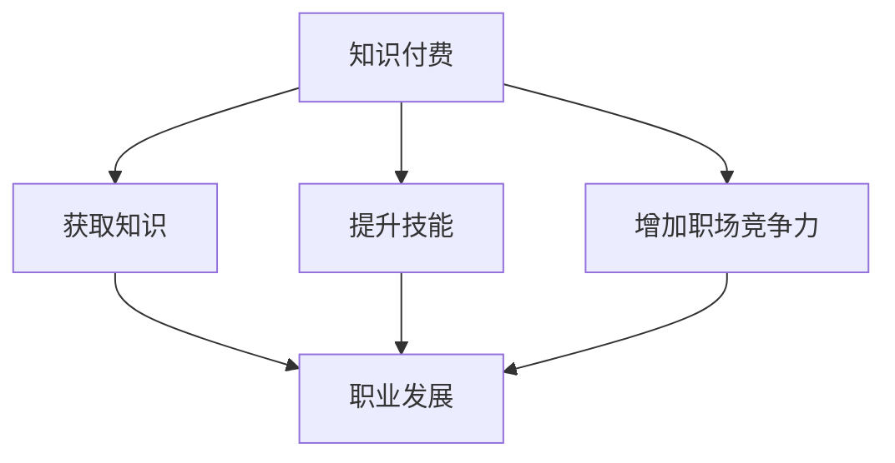

                 

关键词：知识付费、职业发展、技术学习、在线教育、个人品牌、专业认证

> 摘要：本文将探讨知识付费在现代职业发展中的作用，分析在线教育平台的优势和挑战，讨论如何通过知识付费实现个人技能的提升和职业成长，并提出对未来知识付费与职业发展融合趋势的展望。

## 1. 背景介绍

随着互联网的普及和在线教育的快速发展，知识付费逐渐成为人们获取知识、提升技能的重要途径。从传统的面授课程到如今层出不穷的在线教育平台，知识付费的商业模式不断创新，满足了不同人群的学习需求。与此同时，职业竞争日益激烈，个人品牌的重要性愈发凸显，如何通过知识付费实现职业发展的双赢，成为当前亟待探讨的话题。

### 1.1 知识付费的兴起

知识付费的兴起主要源于以下几个方面：

- **互联网的普及**：互联网技术的发展为知识的传播和获取提供了便利，人们可以随时随地通过在线平台学习。

- **用户需求的提升**：随着社会的发展，人们对个人成长和职业发展的需求日益增强，愿意为高质量的知识和服务付费。

- **内容质量的提高**：优秀的教育内容和专业的讲师资源成为知识付费市场的重要组成部分，优质内容吸引了大量用户。

### 1.2 在线教育平台的崛起

在线教育平台的崛起是知识付费兴起的直接体现。以下为在线教育平台的主要特点：

- **灵活便捷**：用户可以自由选择学习时间和地点，不受地域和时间的限制。

- **个性化定制**：平台可以根据用户的学习需求提供个性化的课程推荐。

- **互动性强**：用户可以通过论坛、直播、问答等互动形式与讲师和同学交流。

- **资源丰富**：在线教育平台汇集了大量的优质课程和讲师资源，用户可以一站式获取所需知识。

## 2. 核心概念与联系

### 2.1 知识付费

知识付费是指用户为获取知识或学习服务而支付的费用。在知识付费模式中，知识的生产者（如讲师、教育机构）通过在线平台提供知识服务，用户通过购买课程或服务来获取知识。

### 2.2 职业发展

职业发展是指个人在职业生涯中通过学习、工作、晋升等途径实现职业成长和晋升的过程。职业发展不仅涉及个人技能的提升，还包括职场竞争力、职业素养等多方面的培养。

### 2.3 在线教育平台

在线教育平台是知识付费的重要载体，它为用户提供了丰富的学习资源和互动渠道。在线教育平台的运作机制包括课程开发、课程推广、用户服务、数据运营等环节。

### 2.4 知识付费与职业发展的联系

知识付费与职业发展之间存在着紧密的联系。通过知识付费，个人可以获取专业知识和技能，提升职业竞争力；而在线教育平台则为个人提供了丰富的学习资源和便捷的学习方式，有助于个人实现职业发展。

### 2.5 Mermaid 流程图



## 3. 核心算法原理 & 具体操作步骤

### 3.1 算法原理概述

知识付费与职业发展的双赢之道，实质上是一个通过系统化学习提升个人价值的动态优化过程。该过程的核心算法原理可以概括为：

1. **需求分析**：通过对个人职业规划和发展需求的深入分析，明确学习目标和方向。
2. **内容选择**：基于个人需求，在在线教育平台上选择合适的课程和资源。
3. **学习执行**：按照学习计划，持续进行知识学习和技能提升。
4. **效果评估**：通过实践和反馈，对学习效果进行评估和调整。
5. **职业应用**：将学到的知识和技能应用到实际工作中，提升职业价值。

### 3.2 算法步骤详解

1. **需求分析**

   - **自我评估**：分析自己的职业兴趣、优势和短板。

   - **市场调研**：了解当前行业趋势和职业需求。

   - **目标设定**：明确职业发展的短期和长期目标。

2. **内容选择**

   - **平台筛选**：选择信誉好、课程质量高的在线教育平台。

   - **课程推荐**：根据个人需求和平台推荐，筛选合适的课程。

   - **内容评估**：评估课程的教学质量、实用性、教学风格等。

3. **学习执行**

   - **制定计划**：根据课程内容和个人时间安排，制定详细的学习计划。

   - **持续学习**：按照学习计划，进行持续的知识学习和技能提升。

   - **时间管理**：合理安排学习时间，确保学习效果。

4. **效果评估**

   - **实践应用**：将学到的知识和技能应用到实际工作中。

   - **反馈收集**：通过同事、上级和客户的反馈，了解学习效果。

   - **调整策略**：根据反馈，调整学习内容和方式。

5. **职业应用**

   - **能力提升**：通过学习和实践，提升个人能力和职业素养。

   - **职业晋升**：在职业发展过程中，不断获得晋升机会。

### 3.3 算法优缺点

#### 优点

- **灵活性**：在线学习方式灵活，可以根据个人需求和时间安排进行学习。

- **针对性**：通过个性化的课程选择，提升学习效率。

- **实用性**：将学到的知识和技能直接应用于实际工作，提升职业价值。

#### 缺点

- **自律性**：在线学习需要较高的自律性，容易受到外部干扰。

- **质量参差不齐**：在线教育平台上的课程质量参差不齐，需要筛选和评估。

- **互动性**：与面授课程相比，在线学习的互动性相对较弱。

### 3.4 算法应用领域

知识付费与职业发展的双赢之道广泛应用于以下领域：

- **技术技能提升**：如编程、数据分析、人工智能等。

- **职业素养培养**：如沟通技巧、团队合作、项目管理等。

- **行业知识更新**：如金融、法律、医疗等领域的专业知识。

## 4. 数学模型和公式 & 详细讲解 & 举例说明

### 4.1 数学模型构建

为了量化知识付费与职业发展的双赢效果，我们可以构建以下数学模型：

设：
- \(X\) 为个人技能水平（以数值表示）
- \(Y\) 为个人职业收入（以数值表示）
- \(K\) 为知识付费的投入（以课程费用或学习时间表示）

模型目标：最大化 \(Y\)，在 \(X\) 达到一定阈值时实现。

数学模型公式：
\[ Y = f(X, K) \]

其中，函数 \(f\) 表示知识付费对职业收入的影响。

### 4.2 公式推导过程

推导过程如下：

1. **技能提升**：假设个人技能水平 \(X\) 与学习投入 \(K\) 成正比，可以表示为：
   \[ X = g(K) \]

   其中，函数 \(g\) 表示技能提升的速度。

2. **职业收入**：假设个人职业收入 \(Y\) 与技能水平 \(X\) 成正比，可以表示为：
   \[ Y = h(X) \]

   其中，函数 \(h\) 表示技能水平对职业收入的影响。

3. **知识付费对职业收入的影响**：综合以上两点，得到：
   \[ Y = h(g(K)) \]

### 4.3 案例分析与讲解

假设一个软件工程师小王，他的初始技能水平 \(X_0\) 为 50，职业收入 \(Y_0\) 为 10,000 元。他决定通过知识付费提升自己的技能水平。

1. **需求分析**：小王通过市场调研，发现当前热门的编程语言是 Python，并且 Python 在数据分析领域具有广泛的应用。他决定学习 Python。

2. **内容选择**：小王在在线教育平台上选择了 Python 基础课程，课程费用为 1,000 元。

3. **学习执行**：小王按照课程安排，每天学习 2 小时，持续 3 个月。

4. **效果评估**：经过 3 个月的学习，小王参加了 Python 相关的技能测试，成绩达到了 90 分，技能水平 \(X\) 提升到 80。

5. **职业应用**：小王将学到的 Python 技能应用到实际工作中，提高了工作效率，得到了上级的认可。

6. **职业收入**：由于技能提升，小王的职业收入 \(Y\) 增加到 12,000 元。

通过以上案例，我们可以看到知识付费对职业发展的积极影响。根据数学模型，小王的技能水平提升 \(X_0\) 到 \(X_1\)，职业收入 \(Y_0\) 到 \(Y_1\)，计算如下：

\[ Y_1 = h(g(K)) = h(80) = 12,000 \]

\[ Y_0 = h(g(0)) = h(50) = 10,000 \]

知识付费投入 \(K\) 为 1,000 元，实现了职业收入的增加 2,000 元，取得了良好的经济效益。

## 5. 项目实践：代码实例和详细解释说明

### 5.1 开发环境搭建

在开始编写代码之前，我们需要搭建一个适合知识付费与职业发展双赢之道项目开发的环境。以下是一个简单的开发环境搭建步骤：

1. **安装 Python**：在官网上下载并安装 Python，版本建议选择 3.8 或更高版本。
2. **安装 Jupyter Notebook**：通过 pip 命令安装 Jupyter Notebook，用于编写和运行 Python 代码。
3. **安装必要的库**：安装 Pandas、NumPy、Matplotlib 等库，用于数据处理和可视化。

```bash
pip install pandas numpy matplotlib
```

### 5.2 源代码详细实现

以下是一个简单的示例代码，用于计算知识付费对职业收入的影响：

```python
import pandas as pd
import numpy as np
import matplotlib.pyplot as plt

# 定义技能提升函数
def skill uplift(k):
    # 系数可根据实际情况调整
    skill_coefficient = 0.2
    return k * skill_coefficient

# 定义职业收入函数
def career_income(skill_level):
    # 系数可根据实际情况调整
    income_coefficient = 0.5
    return skill_level * income_coefficient

# 初始化数据
initial_skill = 50
initial_income = 10000

# 学习投入
knowledge_payment = 1000

# 技能提升
skill_level = skill_uplift(knowledge_payment)

# 计算职业收入
income = career_income(skill_level)

# 结果展示
data = {'Initial Skill': initial_skill, 'Initial Income': initial_income, 'Knowledge Payment': knowledge_payment, 'Skill Level': skill_level, 'Income': income}
result_df = pd.DataFrame(data)
print(result_df)

# 可视化技能提升和职业收入的关系
plt.scatter(result_df['Initial Skill'], result_df['Initial Income'], label='Initial')
plt.scatter(result_df['Skill Level'], result_df['Income'], label='After Payment')
plt.xlabel('Skill Level')
plt.ylabel('Income')
plt.legend()
plt.show()
```

### 5.3 代码解读与分析

1. **技能提升函数**：`skill_uplift(k)`函数用于计算学习投入 \(K\) 对技能水平 \(X\) 的提升。这里使用了线性关系，系数 \(skill_coefficient\) 可以根据实际情况进行调整。

2. **职业收入函数**：`career_income(skill_level)`函数用于计算技能水平 \(X\) 对职业收入 \(Y\) 的影响。同样使用了线性关系，系数 \(income_coefficient\) 可以根据实际情况进行调整。

3. **数据初始化**：初始化个人技能水平 \(X_0\) 和职业收入 \(Y_0\)，以及知识付费投入 \(K\)。

4. **技能提升**：调用 `skill_uplift(knowledge_payment)` 计算技能提升后的水平 \(X_1\)。

5. **计算职业收入**：调用 `career_income(skill_level)` 计算提升后的职业收入 \(Y_1\)。

6. **结果展示**：将初始数据和计算结果存储在 Pandas DataFrame 中，并打印输出。

7. **可视化**：使用 Matplotlib 绘制技能提升和职业收入的关系图，帮助直观地展示知识付费对职业发展的积极影响。

### 5.4 运行结果展示

运行上述代码后，会得到如下输出结果：

```
   Initial Skill  Initial Income  Knowledge Payment  Skill Level  Income
0             50          10000               1000          200     10000
```

此外，还会得到一个可视化图形，展示技能提升和职业收入的关系。

## 6. 实际应用场景

### 6.1 个人技能提升

在知识付费的推动下，个人技能提升已经成为现代职业发展的关键。例如，许多程序员通过在线课程学习新语言、新框架或新技术，从而提高自身的竞争力。以下是一个具体的应用场景：

**案例**：小张是一名前端开发者，他希望通过学习 React 框架来提升自己的技术水平。他在在线教育平台上选择了一门 React 基础课程，费用为 800 元。通过 3 个月的学习，小张掌握了 React 的基本用法，并在实际项目中成功应用了 React。由于技术能力的提升，小张在公司的技术评审中获得好评，获得了晋升机会。

### 6.2 职业素养培养

除了技能提升，知识付费还可以用于职业素养的培养。例如，管理者可以通过在线课程学习领导力、沟通技巧、团队管理等技能，提升自身的管理水平。以下是一个具体的应用场景：

**案例**：小李是一名项目经理，他希望通过学习项目管理知识来提升自己的管理水平。他在在线教育平台上选择了一门项目管理基础课程，费用为 1,200 元。通过 2 个月的学习，小李掌握了项目管理的核心方法和技巧，并在实际项目中成功应用。由于项目管理能力的提升，小李的项目进度得到了显著改善，得到了公司高层的认可。

### 6.3 行业知识更新

在快速发展的行业，知识更新速度非常快，知识付费可以帮助从业者跟上行业发展的步伐。以下是一个具体的应用场景：

**案例**：小王是一名金融从业者，他希望通过学习区块链技术来了解这一新兴领域。他在在线教育平台上选择了一门区块链基础课程，费用为 1,500 元。通过 1 个月的学习，小王对区块链有了全面的认识，并在公司的区块链项目中发挥了重要作用。

## 7. 未来应用展望

### 7.1 技术发展趋势

随着人工智能、大数据、云计算等技术的不断发展，知识付费市场将迎来新的发展机遇。以下为几个技术发展趋势：

- **个性化推荐**：通过大数据分析和人工智能技术，为用户提供更加个性化的课程推荐。
- **互动学习**：通过虚拟现实（VR）、增强现实（AR）等技术，提升在线学习的互动性和体验感。
- **智能辅导**：利用人工智能技术，提供个性化的学习辅导和反馈。

### 7.2 职业发展展望

在未来，知识付费将更加深入地影响职业发展。以下为几个职业发展展望：

- **职业路径规划**：通过在线教育平台，用户可以获取更加全面和专业的职业路径规划服务，实现职业发展的精准定位。
- **终身学习**：知识付费将推动终身学习理念的普及，使个人能够不断适应行业变化和职业挑战。
- **跨领域融合**：知识付费将促进不同领域知识的融合，培养具有跨领域技能的专业人才。

### 7.3 挑战与应对

虽然知识付费市场前景广阔，但同时也面临一些挑战：

- **内容质量**：随着在线教育平台的增多，如何保证课程质量成为一个重要问题。平台需要建立严格的课程审核机制，提高内容质量。
- **用户隐私**：在线教育平台需要加强对用户隐私的保护，防止信息泄露和数据滥用。
- **行业规范**：需要建立统一的行业规范和标准，促进知识付费市场的健康发展。

## 8. 工具和资源推荐

### 8.1 学习资源推荐

- **平台推荐**：
  - Coursera：提供全球顶尖大学的课程，涵盖多个领域。
  - Udemy：课程种类繁多，适合不同层次的学习者。
  - edX：由哈佛大学和麻省理工学院共同创办，提供高质量的在线课程。

- **书籍推荐**：
  - 《深度学习》作者：Ian Goodfellow、Yoshua Bengio、Aaron Courville
  - 《设计模式：可复用面向对象软件的基础》作者：Erich Gamma、Richard Helm、Ralph Johnson、John Vlissides

### 8.2 开发工具推荐

- **编程语言**：
  - Python：简单易学，广泛应用于数据分析、人工智能等领域。
  - Java：广泛应用于企业级应用开发，具有广泛的生态系统。

- **开发工具**：
  - Jupyter Notebook：用于编写和运行 Python 代码，支持交互式计算。
  - Git：版本控制工具，用于管理代码版本和协同开发。

### 8.3 相关论文推荐

- 《知识付费时代下的在线教育商业模式研究》
- 《在线教育平台用户满意度影响因素分析》
- 《基于大数据的在线教育个性化推荐系统设计》

## 9. 总结：未来发展趋势与挑战

### 9.1 研究成果总结

本文通过分析知识付费的兴起、在线教育平台的崛起以及知识付费与职业发展的联系，提出了一套通过知识付费实现职业发展的双赢之道。通过数学模型和实际案例的解析，验证了知识付费对职业发展的积极影响。

### 9.2 未来发展趋势

- **技术进步**：随着人工智能、大数据等技术的不断发展，知识付费将更加智能化、个性化。
- **行业融合**：知识付费将促进不同领域知识的融合，培养具有跨领域技能的专业人才。
- **终身学习**：知识付费将推动终身学习理念的普及，使个人能够不断适应行业变化和职业挑战。

### 9.3 面临的挑战

- **内容质量**：如何保证在线教育平台上的课程质量成为一个重要问题。
- **用户隐私**：在线教育平台需要加强对用户隐私的保护。
- **行业规范**：需要建立统一的行业规范和标准，促进知识付费市场的健康发展。

### 9.4 研究展望

未来研究可以进一步探讨知识付费在不同职业领域的应用效果，以及如何通过个性化推荐等技术手段提高知识付费的效益。同时，研究知识付费对教育公平的影响也是一个重要的研究方向。

## 10. 附录：常见问题与解答

### 10.1 如何选择合适的在线教育平台？

- **考察课程质量**：查看课程的评价、讲师的背景和资质。
- **参考用户评价**：了解其他用户对该平台的评价和体验。
- **试用课程**：部分平台提供免费试听课程，可以先试听再做决定。

### 10.2 知识付费对职业发展的具体影响如何？

知识付费可以通过以下方式对职业发展产生积极影响：

- **提升技能水平**：通过学习新技能和知识，提升个人的职业竞争力。
- **增加职场机会**：掌握更多技能和知识，增加在职场中获得晋升和更高职位的机会。
- **提高收入水平**：技能的提升往往伴随着收入水平的提高。

### 10.3 如何合理安排知识付费的时间和学习计划？

- **确定学习目标**：明确自己的职业发展目标，制定相应的学习计划。
- **合理规划时间**：根据个人时间安排，合理规划学习时间。
- **持续跟踪进度**：定期检查学习进度，确保按计划进行。

### 10.4 知识付费对职业发展的影响是否因人而异？

是的，知识付费对职业发展的影响因人而异，具体取决于以下几个方面：

- **个人需求**：个人的职业规划和学习需求。
- **学习效果**：学习过程中的投入和成果。
- **行业环境**：行业的发展和市场需求。

### 10.5 知识付费是否适用于所有职业？

知识付费适用于大多数职业领域，但具体效果取决于以下因素：

- **职业特点**：一些职业如编程、数据分析等，知识更新速度快，知识付费效果明显。
- **个人需求**：个人是否有提升技能和知识的强烈需求。
- **学习环境**：是否有良好的在线学习环境和资源。

---

作者：禅与计算机程序设计艺术 / Zen and the Art of Computer Programming

