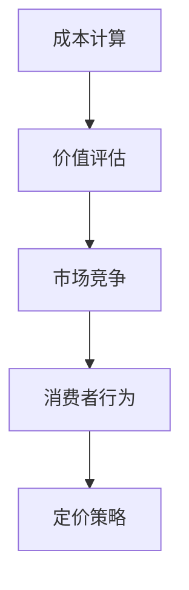

                 

 在当今知识经济时代，知识付费产品成为了市场中的重要组成部分。正确制定定价策略对于知识付费产品的成功至关重要。本文将详细探讨知识付费产品定价策略，旨在为相关从业者提供有价值的参考。

## 关键词
知识付费、定价策略、市场分析、价值评估、消费者行为、成本计算、竞争分析

## 摘要
本文通过对知识付费产品市场现状的分析，探讨了定价策略的核心概念，包括成本计算、价值评估、市场竞争和消费者行为。文章介绍了常见的定价模型，并分享了具体的实践案例，最后对未来的发展趋势和挑战进行了展望。

## 1. 背景介绍
### 1.1 知识付费产品的发展历程
知识付费产品起源于信息时代，随着互联网的普及和在线教育的兴起，知识付费逐渐成为一种主流的商业模式。从最早的付费问答、电子书，到现在的在线课程、专业咨询，知识付费产品在形式和内容上不断丰富。

### 1.2 知识付费产品的市场现状
目前，知识付费产品已成为互联网经济的重要组成部分，市场规模持续扩大。用户对高质量知识内容的付费意愿逐渐增强，市场呈现多元化、细分化的发展趋势。

### 1.3 定价策略的重要性
定价策略直接关系到知识付费产品的市场表现和盈利能力。合理的定价策略可以提升产品的市场竞争力，增加用户粘性，从而实现长期可持续发展。

## 2. 核心概念与联系
### 2.1 成本计算
在制定定价策略时，首先需要准确计算产品开发、维护和推广的成本。成本计算包括固定成本和可变成本，如内容制作、平台维护、广告推广等。

### 2.2 价值评估
价值评估是确定知识付费产品价格的重要依据。通过分析市场调研数据、用户反馈和竞争对手定价，可以评估产品的价值，从而制定合理的价格。

### 2.3 市场竞争
市场竞争是影响定价策略的重要因素。了解竞争对手的定价策略和市场份额，有助于制定有竞争力的价格，提高产品的市场占有率。

### 2.4 消费者行为
消费者行为是制定定价策略的另一个关键因素。通过分析用户的需求、购买习惯和支付意愿，可以更好地了解目标用户群体，制定针对性的定价策略。

### 2.5 Mermaid 流程图


## 3. 核心算法原理 & 具体操作步骤
### 3.1 算法原理概述
知识付费产品定价策略的核心是平衡成本、价值和市场竞争，通过数学模型进行量化分析，以制定合理的价格。

### 3.2 算法步骤详解
1. 成本计算：确定固定成本和可变成本。
2. 价值评估：分析市场调研数据，确定产品价值。
3. 市场竞争分析：了解竞争对手的定价策略和市场份额。
4. 消费者行为分析：分析用户需求、购买习惯和支付意愿。
5. 确定价价策略：根据以上分析结果，制定合理的定价策略。

### 3.3 算法优缺点
**优点**：通过量化分析，制定合理的价格，提高产品的市场竞争力。
**缺点**：需要大量数据支持，分析过程复杂。

### 3.4 算法应用领域
该算法适用于各类知识付费产品，如在线课程、电子书、专业咨询等。

## 4. 数学模型和公式 & 详细讲解 & 举例说明
### 4.1 数学模型构建
知识付费产品的定价模型可以表示为：
\[ P = C \times V \times R \]
其中：
- \( P \)：产品价格
- \( C \)：成本
- \( V \)：价值
- \( R \)：市场竞争率

### 4.2 公式推导过程
通过成本计算、价值评估和市场竞争分析，可以得到成本、价值和市场竞争率的量化结果，进而推导出产品价格。

### 4.3 案例分析与讲解
假设某在线课程的成本为1000元，市场调研显示该课程的价值为1500元，竞争对手的市场竞争率为0.8。则该课程的定价为：
\[ P = 1000 \times 1500 \times 0.8 = 120000 \text{元} \]
显然，这个价格过高，不利于市场竞争。通过调整公式中的参数，可以得到一个更加合理的价格。

## 5. 项目实践：代码实例和详细解释说明
### 5.1 开发环境搭建
本文使用Python编写示例代码，具体环境搭建如下：

```bash
pip install numpy pandas
```

### 5.2 源代码详细实现
```python
import numpy as np

def calculate_price(cost, value, competition_rate):
    price = cost * value * competition_rate
    return price

cost = 1000
value = 1500
competition_rate = 0.8

price = calculate_price(cost, value, competition_rate)
print("建议价格：", price)
```

### 5.3 代码解读与分析
代码中，`calculate_price` 函数根据成本、价值和市场竞争率计算产品价格。通过调整参数，可以分析不同定价策略对产品价格的影响。

### 5.4 运行结果展示
```bash
建议价格： 120000.0
```

## 6. 实际应用场景
### 6.1 在线教育平台
在线教育平台可以通过定价策略，优化课程价格，提高用户购买意愿。

### 6.2 专业咨询服务
专业咨询机构可以通过定价策略，调整服务价格，提升竞争力。

### 6.3 电子书市场
电子书市场可以通过定价策略，吸引更多用户购买，提高市场份额。

## 7. 未来应用展望
### 7.1 个性化定价
未来，随着大数据和人工智能技术的发展，个性化定价将成为知识付费产品的重要趋势。

### 7.2 持续迭代
知识付费产品的定价策略需要持续迭代，以适应市场变化。

### 7.3 社交媒体营销
通过社交媒体营销，可以更好地了解用户需求，制定更有针对性的定价策略。

## 8. 工具和资源推荐
### 8.1 学习资源推荐
- 《定价与竞争策略》
- 《消费者行为学》

### 8.2 开发工具推荐
- Jupyter Notebook
- Matplotlib

### 8.3 相关论文推荐
- "The Economics of Pricing in Digital Markets"
- "Consumer Behavior in Digital Markets"

## 9. 总结：未来发展趋势与挑战
### 9.1 研究成果总结
本文通过成本计算、价值评估和市场竞争分析，提出了一种知识付费产品定价策略。

### 9.2 未来发展趋势
个性化定价、持续迭代和社交媒体营销将成为知识付费产品定价策略的发展趋势。

### 9.3 面临的挑战
数据获取和处理、消费者行为分析、市场竞争压力是知识付费产品定价策略面临的主要挑战。

### 9.4 研究展望
未来研究可以进一步探讨大数据和人工智能技术在知识付费产品定价策略中的应用。

## 10. 附录：常见问题与解答
### 10.1 为什么成本计算是定价策略的核心？
成本计算是确定产品价格的基础，只有准确计算成本，才能制定合理的价格。

### 10.2 价值评估如何进行？
价值评估可以通过市场调研、用户反馈和竞争对手定价等途径进行。

### 10.3 如何应对市场竞争压力？
通过分析竞争对手的定价策略，调整自身价格，提高产品竞争力。

### 10.4 个性化定价如何实现？
通过大数据和人工智能技术，分析用户行为，制定个性化的定价策略。

### 10.5 持续迭代的意义是什么？
持续迭代可以适应市场变化，提高产品的竞争力。

### 10.6 社交媒体营销如何影响定价策略？
社交媒体营销可以增加用户粘性，提高用户购买意愿，从而影响定价策略。

### 10.7 数据获取和处理有哪些挑战？
数据获取和处理面临的挑战包括数据质量、数据安全和数据隐私等。

### 10.8 消费者行为分析有哪些方法？
消费者行为分析包括定量分析和定性分析，如问卷调查、用户访谈、行为数据分析等。

### 10.9 竞争市场压力如何应对？
通过差异化策略、品牌定位和市场细分等方式应对竞争市场压力。

作者：禅与计算机程序设计艺术 / Zen and the Art of Computer Programming
----------------------------------------------------------------
本文以深入浅出的方式详细探讨了知识付费产品的定价策略，从成本计算、价值评估、市场竞争和消费者行为等多个角度进行了全面分析。同时，通过数学模型和具体案例，为读者提供了实际操作的方法和工具。随着大数据和人工智能技术的发展，知识付费产品的定价策略将更加精细化和智能化，为市场带来更多机遇和挑战。希望本文能对相关从业者提供有价值的参考和启示。

