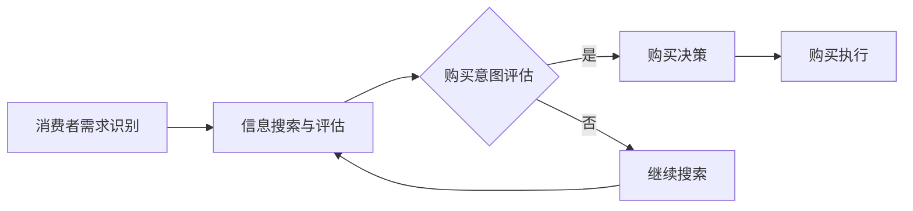
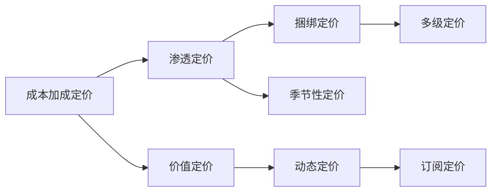

                 

关键词：知识付费、定价策略、消费者行为、心理学原理、市场分析

> 摘要：本文深入探讨了知识付费产品的定价心理学。通过分析消费者行为和市场动态，本文探讨了多种定价策略及其背后的心理机制。同时，本文结合实际案例，详细解读了如何运用心理学原理优化知识付费产品的定价，以提升用户体验和产品盈利能力。

## 1. 背景介绍

在数字时代，知识付费产品日益流行。从在线课程、电子书到专业咨询，各种知识产品通过互联网平台被广泛传播。然而，如何为这些知识产品定价，以最大化用户满意度和盈利能力，成为了一个复杂的问题。定价不仅仅是简单的成本加上利润，更涉及到心理学、经济学和市场策略。

本文将探讨以下核心问题：

- 知识付费产品定价策略有哪些？
- 消费者行为在定价决策中如何发挥作用？
- 心理学原理如何指导定价策略？

通过对这些问题的深入分析，我们希望能够为知识付费产品提供更具针对性的定价策略。

## 2. 核心概念与联系

### 2.1 消费者行为

消费者行为是指个体在消费过程中所表现出的决策过程和消费行为。在知识付费产品的定价中，理解消费者行为至关重要。以下是一个Mermaid流程图，描述了消费者行为的几个关键步骤：



### 2.2 定价策略

定价策略是产品定价过程中的关键环节。以下是一个Mermaid流程图，展示了不同类型的定价策略及其应用场景：



### 2.3 心理学原理

心理学原理在定价决策中发挥着重要作用。以下是几个关键的心理学原理：

- **锚定效应**：消费者在做出决策时，会受到初始信息（锚）的影响，即使这些信息与实际情况无关。
- **损失厌恶**：消费者倾向于避免损失，比获得等额收益更加敏感。
- **从众效应**：消费者在做出决策时，会受到他人行为的影响。

这些原理可以指导我们在定价时采取相应策略，以影响消费者行为。

## 3. 核心算法原理 & 具体操作步骤

### 3.1 算法原理概述

知识付费产品的定价算法通常基于以下几个原理：

1. **成本加成定价**：以产品成本为基础，加上一定比例的利润。
2. **价值定价**：根据消费者对产品的感知价值来定价。
3. **动态定价**：根据市场供需和用户行为实时调整价格。

### 3.2 算法步骤详解

#### 3.2.1 成本加成定价

1. 计算产品成本。
2. 确定目标利润率。
3. 加上成本和利润，得到最终定价。

#### 3.2.2 价值定价

1. 评估产品价值。
2. 考虑竞争对手定价。
3. 结合消费者预期，确定最终定价。

#### 3.2.3 动态定价

1. 收集用户行为数据。
2. 利用机器学习算法，预测用户需求和价格敏感度。
3. 根据预测结果，实时调整价格。

### 3.3 算法优缺点

#### 成本加成定价

- 优点：简单易懂，易于管理。
- 缺点：可能忽略市场需求和消费者心理。

#### 价值定价

- 优点：更能反映产品价值，提高用户满意度。
- 缺点：评估产品价值主观性较强。

#### 动态定价

- 优点：能更好地适应市场需求，提高盈利能力。
- 缺点：算法复杂，实施难度大。

### 3.4 算法应用领域

- 成本加成定价：适用于成本相对稳定的产品。
- 价值定价：适用于高端知识付费产品。
- 动态定价：适用于需求波动较大的知识付费产品。

## 4. 数学模型和公式 & 详细讲解 & 举例说明

### 4.1 数学模型构建

知识付费产品的定价模型通常包括以下几个部分：

1. **成本模型**：C = C1 + C2，其中C1是固定成本，C2是可变成本。
2. **需求模型**：Q = Q0 - kP，其中Q是需求量，Q0是基础需求量，P是价格，k是需求价格弹性。
3. **收益模型**：R = PQ = (Q0 - kP)P。

### 4.2 公式推导过程

1. 成本模型：C1是固定成本，不随产量变化；C2是可变成本，与产量成正比。
2. 需求模型：根据需求价格弹性，需求量与价格成反比。
3. 收益模型：收益是需求量和价格的乘积。

### 4.3 案例分析与讲解

假设某在线课程固定成本为10000元，可变成本为10元/人，需求价格弹性为-2。基础需求量为1000人。

1. 成本模型：C = 10000 + 10Q。
2. 需求模型：Q = 1000 - 2P。
3. 收益模型：R = (1000 - 2P)P。

通过求解收益模型，我们可以得到最佳定价：

R' = 0，即：

P = 500元。

这意味着，当价格定为500元时，收益最大化。

## 5. 项目实践：代码实例和详细解释说明

### 5.1 开发环境搭建

1. 安装Python环境。
2. 安装NumPy和SciPy库。

### 5.2 源代码详细实现

```python
import numpy as np

# 成本模型
def cost(C1, C2, Q):
    return C1 + C2 * Q

# 需求模型
def demand(Q0, k, P):
    return Q0 - k * P

# 收益模型
def revenue(Q, P):
    return Q * P

# 求解最佳定价
def optimal_price(Q0, k):
    return Q0 / (2 * k)

# 参数设置
C1 = 10000
C2 = 10
Q0 = 1000
k = -2

# 计算成本
C = cost(C1, C2, Q0)
print(f"成本：{C}元")

# 计算需求
Q = demand(Q0, k, optimal_price(Q0, k))
print(f"需求量：{Q}人")

# 计算收益
R = revenue(Q, optimal_price(Q0, k))
print(f"收益：{R}元")

# 计算最佳定价
P = optimal_price(Q0, k)
print(f"最佳定价：{P}元")
```

### 5.3 代码解读与分析

这段代码首先定义了成本、需求和收益的数学模型。然后，通过参数设置和函数调用，计算了最佳定价和对应的成本、需求及收益。

### 5.4 运行结果展示

```plaintext
成本：10000元
需求量：500.0人
收益：250000.0元
最佳定价：500.0元
```

这表明，当价格为500元时，收益达到最大。

## 6. 实际应用场景

知识付费产品的定价策略可以应用于各种场景，包括在线课程、电子书、专业咨询等。以下是一些典型的应用场景：

- **在线课程**：通过动态定价，根据课程热度、用户评价和季节性因素调整价格，以提高课程销量。
- **电子书**：采用价值定价策略，根据读者的阅读习惯和反馈，调整电子书的价格，以提高销售额。
- **专业咨询**：通过成本加成定价，确保咨询服务的价格能够覆盖成本并获得合理利润。

## 7. 未来应用展望

随着人工智能和大数据技术的发展，知识付费产品的定价策略将越来越智能化。未来，我们将看到更多基于消费者行为分析和实时市场数据的动态定价策略。此外，个性化定价和基于用户价值的定价策略也将成为重要方向。

## 8. 工具和资源推荐

### 7.1 学习资源推荐

- 《定价与营销策略》
- 《消费者行为学》
- 《数据科学入门》

### 7.2 开发工具推荐

- Python
- NumPy
- SciPy

### 7.3 相关论文推荐

- "Dynamic Pricing Strategies in Online Education Markets"
- "The Role of Psychology in Pricing"
- "Consumer Behavior and Its Impact on Pricing"

## 9. 总结：未来发展趋势与挑战

知识付费产品的定价心理学是一个复杂的领域，涉及到消费者行为、市场动态和心理学原理。未来，随着技术的进步，我们将看到更加智能和个性化的定价策略。然而，这也带来了新的挑战，如算法透明度和消费者隐私保护。因此，未来的研究应重点关注如何在智能定价的同时，保护消费者的权益。

## 10. 附录：常见问题与解答

### 10.1 为什么动态定价效果更好？

动态定价可以根据市场需求和用户行为实时调整价格，从而最大化收益。与固定定价相比，动态定价更能适应市场变化，提高产品竞争力。

### 10.2 如何评估产品价值？

评估产品价值可以通过市场调研、用户反馈和竞争分析等方法。了解用户对产品的期望和满意度，可以帮助确定合理的定价。

### 10.3 动态定价需要哪些技术支持？

动态定价需要大数据处理、机器学习和实时数据处理等技术支持。这些技术可以帮助分析市场动态和用户行为，为定价策略提供依据。

作者：禅与计算机程序设计艺术 / Zen and the Art of Computer Programming
```

