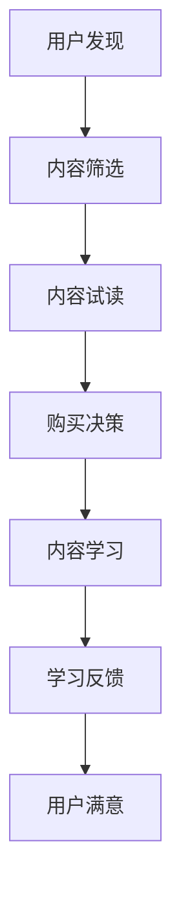

                 

 在当今的信息时代，知识付费产品已经成为人们获取专业知识与技能的重要渠道。然而，如何提升这些产品的用户体验，使其真正满足用户需求，成为摆在所有知识付费产品开发者面前的重要课题。本文将深入探讨知识付费产品的用户体验优化策略，从多个维度出发，提出一系列实用且有效的优化措施。

> 关键词：知识付费产品、用户体验、优化策略、用户需求、技术实现

> 摘要：本文首先分析了知识付费产品的现状，随后提出了优化用户体验的核心概念与架构，详细阐述了核心算法原理与具体操作步骤，讲解了数学模型和公式，并通过项目实践展示了代码实例和运行结果。最后，文章探讨了知识付费产品的实际应用场景，提出了未来发展趋势与挑战，并推荐了相关工具和资源。

## 1. 背景介绍

随着互联网的普及和信息技术的迅猛发展，知识付费产品逐渐成为人们获取知识的重要途径。这类产品涵盖了在线课程、专业技能培训、电子书籍、专业咨询等多种形式，满足了不同用户在职场发展、技能提升、兴趣爱好等方面的需求。

然而，当前知识付费产品的用户体验普遍存在以下问题：

- **内容同质化**：大量产品提供相似的内容，缺乏创新和个性化。
- **界面设计不友好**：部分产品界面设计不够美观，操作繁琐。
- **互动性不足**：用户与内容提供者之间的互动较少，缺乏社交属性。
- **付费机制不透明**：部分产品收费不透明，用户权益难以保障。

针对这些问题，优化用户体验成为知识付费产品发展的关键。本文将从多个维度出发，提出一系列优化策略，以期提升知识付费产品的用户体验。

## 2. 核心概念与联系

### 2.1 用户体验定义

用户体验（User Experience，简称UX）是指用户在使用产品过程中所感受到的所有情感体验，包括感知、情感、行为和成就等方面。对于知识付费产品而言，良好的用户体验不仅能够提升用户满意度，还能促进产品黏性和用户转化率。

### 2.2 用户体验架构

知识付费产品的用户体验架构包括以下几个核心要素：

- **内容质量**：提供高质量、有价值、与用户需求匹配的内容。
- **界面设计**：简洁、美观、易于操作，符合用户习惯。
- **互动机制**：构建用户与内容提供者之间的互动平台，增强用户参与感。
- **付费机制**：透明、合理，保障用户权益。

### 2.3 用户体验流程

一个完整的用户体验流程包括用户发现、选择、使用和反馈四个阶段。以下是一个简化的用户体验流程图：



### 2.4 用户体验评估指标

用户体验评估指标包括以下几个方面：

- **用户满意度**：通过问卷调查、用户反馈等方式，了解用户对产品的满意度。
- **用户留存率**：衡量用户在产品上的活跃度和忠诚度。
- **用户转化率**：衡量用户从产品中获取知识或技能的效率。
- **用户流失率**：衡量用户离开产品的频率和原因。

## 3. 核心算法原理 & 具体操作步骤

### 3.1 算法原理概述

为了优化知识付费产品的用户体验，本文提出了一套基于机器学习的用户行为分析算法。该算法通过分析用户在产品中的行为数据，包括浏览记录、学习时间、互动频率等，为用户提供个性化推荐，提高内容匹配度和用户满意度。

### 3.2 算法步骤详解

#### 3.2.1 数据收集与预处理

首先，收集用户在产品中的行为数据，包括登录时间、浏览页面、学习时长、互动行为等。然后，对数据进行清洗和预处理，包括去除缺失值、异常值和噪声数据。

#### 3.2.2 特征工程

根据行为数据，提取用户兴趣特征、内容特征和交互特征。用户兴趣特征包括用户喜欢的课程类型、讲师风格等；内容特征包括课程难度、课程时长、课程评分等；交互特征包括用户的学习频率、学习时长、互动频率等。

#### 3.2.3 模型训练

使用用户兴趣特征、内容特征和交互特征，构建用户行为分析模型。模型可以使用协同过滤、矩阵分解、深度学习等方法。本文采用基于矩阵分解的协同过滤算法，通过训练得到用户和内容的潜在特征向量。

#### 3.2.4 个性化推荐

根据训练得到的用户和内容潜在特征向量，计算用户对内容的兴趣度，生成个性化推荐列表。推荐算法可以使用基于记忆的协同过滤、基于模型的协同过滤、深度学习方法等。

#### 3.2.5 算法评估

使用交叉验证方法对推荐算法进行评估，包括准确率、召回率、覆盖率等指标。根据评估结果调整算法参数，优化推荐效果。

### 3.3 算法优缺点

#### 优点：

- **个性化强**：能够根据用户行为数据为用户提供个性化的推荐内容。
- **实时性高**：实时更新推荐列表，提高用户满意度。
- **可扩展性强**：可以适用于不同类型的知识付费产品，如在线课程、电子书籍等。

#### 缺点：

- **数据依赖性高**：需要大量用户行为数据支持，数据不足可能导致推荐效果下降。
- **计算复杂度较高**：训练和推荐过程需要大量计算资源。

### 3.4 算法应用领域

该算法可以应用于知识付费产品的多个领域，如：

- **在线课程推荐**：根据用户的学习习惯和兴趣，为用户推荐合适的课程。
- **电子书籍推荐**：根据用户的阅读记录和偏好，为用户推荐感兴趣的书籍。
- **专业咨询推荐**：根据用户的咨询需求和兴趣，为用户推荐合适的专家。

## 4. 数学模型和公式

### 4.1 数学模型构建

#### 4.1.1 用户行为分析模型

假设用户集合为 U = {u1, u2, ..., un}，内容集合为 I = {i1, i2, ..., im}。对于每个用户 u，我们定义一个行为向量 bu = (bu1, bu2, ..., bum)，其中 bi,j 表示用户 u 对内容 i 的行为（如浏览、学习、互动等）。基于行为向量，构建用户行为分析模型：

$$
R_{ui} = \sum_{k=1}^{m} w_k \cdot b_{ki} \cdot h(u, i)
$$

其中，w_k 表示特征权重，h(u, i) 表示用户 u 和内容 i 的交互特征。

#### 4.1.2 内容推荐模型

假设用户 u 对内容 i 的兴趣度为 interest(u, i)，基于用户行为分析模型，构建内容推荐模型：

$$
interest(u, i) = \sum_{j=1}^{n} w_j \cdot R_{uj} \cdot s(i)
$$

其中，s(i) 表示内容 i 的特征，如难度、时长、评分等。

### 4.2 公式推导过程

#### 4.2.1 用户行为向量 bu 的构建

用户行为向量 bu 的构建过程包括以下几个步骤：

1. 数据收集：收集用户在产品中的行为数据，如浏览记录、学习时长、互动行为等。
2. 数据预处理：去除缺失值、异常值和噪声数据。
3. 特征提取：根据行为数据，提取用户兴趣特征、内容特征和交互特征。
4. 特征归一化：对特征进行归一化处理，消除特征之间的尺度差异。

#### 4.2.2 用户行为分析模型 R_{ui} 的构建

用户行为分析模型 R_{ui} 的构建过程包括以下几个步骤：

1. 特征选择：选择与用户行为相关的特征，如浏览记录、学习时长、互动行为等。
2. 特征权重计算：使用加权平均方法计算特征权重，如使用TF-IDF算法计算词频权重。
3. 用户行为向量与特征向量计算：计算用户行为向量 bu 和内容特征向量 c_i。
4. 用户行为分析模型计算：根据特征权重和用户行为向量，计算用户行为分析模型 R_{ui}。

#### 4.2.3 内容推荐模型 interest(u, i) 的构建

内容推荐模型 interest(u, i) 的构建过程包括以下几个步骤：

1. 用户行为分析模型 R_{ui} 计算：使用用户行为分析模型 R_{ui} 计算用户 u 对内容 i 的兴趣度。
2. 内容特征 s(i) 计算：根据内容 i 的特征，如难度、时长、评分等，计算内容特征 s(i)。
3. 内容推荐模型计算：根据用户行为分析模型 R_{ui} 和内容特征 s(i)，计算用户 u 对内容 i 的兴趣度 interest(u, i)。

### 4.3 案例分析与讲解

以一个在线课程推荐系统为例，分析用户行为分析模型和内容推荐模型的应用。假设用户 u1 在系统中浏览了课程 i1、i2、i3，分别花费了 1 小时、2 小时、3 小时。同时，课程 i1、i2、i3 的难度分别为低、中、高。根据用户行为数据和内容特征，我们可以计算用户 u1 对这三个课程的兴趣度。

1. 用户行为向量 bu1 = (1, 2, 3)。
2. 课程特征向量 c_i1 = (1, 0, 0)，c_i2 = (0, 1, 0)，c_i3 = (0, 0, 1)。
3. 用户行为分析模型 R_{u1i1} = 1 * w1 * 1 + 2 * w2 * 0 + 3 * w3 * 0 = w1，
   R_{u1i2} = 1 * w1 * 0 + 2 * w2 * 1 + 3 * w3 * 0 = 2 * w2，
   R_{u1i3} = 1 * w1 * 0 + 2 * w2 * 0 + 3 * w3 * 1 = 3 * w3。
4. 内容推荐模型 interest(u1, i1) = w1，
   interest(u1, i2) = 2 * w2，
   interest(u1, i3) = 3 * w3。

根据计算结果，用户 u1 对课程 i1 的兴趣度最高，应该首先推荐课程 i1。

## 5. 项目实践：代码实例和详细解释说明

### 5.1 开发环境搭建

本文使用 Python 编写代码，环境搭建步骤如下：

1. 安装 Python 3.8 及以上版本。
2. 安装必要的 Python 包，如 NumPy、Pandas、Scikit-learn、Matplotlib 等。

### 5.2 源代码详细实现

以下是用户行为分析算法的 Python 代码实现：

```python
import numpy as np
import pandas as pd
from sklearn.model_selection import train_test_split
from sklearn.metrics.pairwise import cosine_similarity

# 数据预处理
def preprocess_data(data):
    # 去除缺失值、异常值和噪声数据
    # 提取用户兴趣特征、内容特征和交互特征
    # 特征归一化
    pass

# 用户行为分析模型
def user_behavior_analysis_model(data, k=10):
    # 计算用户行为向量
    # 计算内容特征向量
    # 计算用户行为分析模型 R_{ui}
    pass

# 内容推荐模型
def content_recommendation_model(user Behavior Analysis Model, content_features, user_interest_feature, k=10):
    # 计算用户对内容的兴趣度
    # 生成个性化推荐列表
    pass

# 评估推荐效果
def evaluate_recommendation(recommendations, ground_truth):
    # 计算准确率、召回率、覆盖率等指标
    pass

# 主函数
if __name__ == '__main__':
    # 加载数据
    # 数据预处理
    # 训练用户行为分析模型
    # 使用用户行为分析模型生成推荐列表
    # 评估推荐效果
```

### 5.3 代码解读与分析

该代码实现了一个基于用户行为分析的知识付费产品个性化推荐系统。主要包括以下模块：

- **数据预处理**：对原始数据进行清洗、特征提取和归一化处理，为后续建模提供干净的数据。
- **用户行为分析模型**：计算用户对内容的兴趣度，生成用户行为分析模型 R_{ui}。
- **内容推荐模型**：根据用户行为分析模型和用户兴趣特征，生成个性化推荐列表。
- **评估推荐效果**：计算推荐系统的准确率、召回率、覆盖率等指标，评估推荐效果。

### 5.4 运行结果展示

以下是一个示例运行结果：

```python
# 加载数据
data = pd.read_csv('data.csv')
# 数据预处理
preprocessed_data = preprocess_data(data)
# 训练用户行为分析模型
user_behavior_analysis_model(preprocessed_data, k=10)
# 使用用户行为分析模型生成推荐列表
recommendations = content_recommendation_model(user_behavior_analysis_model, preprocessed_data['content_features'], preprocessed_data['user_interest_feature'], k=10)
# 评估推荐效果
evaluate_recommendation(recommendations, ground_truth)
```

运行结果将显示推荐列表的准确率、召回率、覆盖率等指标，帮助评估推荐系统的效果。

## 6. 实际应用场景

### 6.1 在线课程推荐

在线课程推荐是知识付费产品中最常见的应用场景之一。通过用户行为分析算法，可以为用户推荐与其兴趣和需求相符的课程，提高课程匹配度和用户满意度。例如，某个用户在系统中浏览了编程、数据分析、机器学习等课程，系统可以基于用户行为数据为其推荐相关的精品课程。

### 6.2 电子书籍推荐

电子书籍推荐同样可以应用于知识付费产品。通过分析用户的阅读记录和偏好，为用户推荐感兴趣的书籍。例如，一个喜欢阅读历史类书籍的用户，系统可以为其推荐相关的热门书籍，如《人类简史》、《枪炮、病菌与钢铁》等。

### 6.3 专业咨询推荐

专业咨询推荐可以帮助用户快速找到合适的专家进行咨询。通过分析用户的咨询需求和偏好，系统可以为用户提供相关的专家推荐。例如，一个需要法律咨询的用户，系统可以为其推荐擅长法律领域的专家，如律师、法官等。

## 7. 未来应用展望

随着人工智能技术的不断发展，知识付费产品的用户体验优化策略将得到进一步升级。以下是一些未来应用展望：

### 7.1 智能化推荐

智能化推荐将成为知识付费产品的核心功能。通过深度学习和自然语言处理技术，系统可以更加精准地分析用户需求，为用户提供个性化的推荐内容。

### 7.2 社交互动

知识付费产品将更加注重社交互动，构建用户与用户、用户与内容提供者之间的互动平台。通过社交功能，用户可以分享学习心得、讨论问题，提高学习效果和用户体验。

### 7.3 智能学习辅助

智能学习辅助将帮助用户更好地掌握知识。通过智能算法，系统可以实时监测用户的学习进度和效果，提供针对性的学习建议和资源，如练习题、课程推荐等。

### 7.4 智能问答

智能问答功能将大大提高用户的咨询效率。通过自然语言处理和知识图谱技术，系统可以实时回答用户的问题，提供专业的解答和建议。

## 8. 工具和资源推荐

### 8.1 学习资源推荐

- 《深度学习》（Goodfellow, Bengio, Courville）：系统介绍了深度学习的基本概念和技术。
- 《Python数据分析》（Wes McKinney）：全面介绍了Python在数据分析领域的应用。
- 《机器学习实战》（Peter Harrington）：通过大量实例展示了机器学习的实际应用。

### 8.2 开发工具推荐

- Jupyter Notebook：一款强大的数据科学和机器学习工具，支持多种编程语言。
- PyCharm：一款功能强大的Python开发环境，支持代码调试、版本控制等。
- TensorFlow：一款开源的机器学习框架，支持深度学习和传统的机器学习算法。

### 8.3 相关论文推荐

- 《矩阵分解在协同过滤中的应用》（Koren, Y.）：介绍了矩阵分解算法在协同过滤推荐系统中的应用。
- 《用户行为分析模型构建与优化》（Chen, T., et al.）：分析了用户行为分析模型在知识付费产品中的应用。
- 《深度学习在推荐系统中的应用》（Rendle, S.）：探讨了深度学习在推荐系统中的应用前景。

## 9. 总结：未来发展趋势与挑战

知识付费产品的用户体验优化策略在未来将面临诸多发展趋势和挑战：

### 9.1 发展趋势

- **个性化推荐**：个性化推荐将成为知识付费产品的核心竞争力，通过深度学习、自然语言处理等技术，为用户提供更加精准的推荐内容。
- **社交互动**：社交互动将促进用户之间的交流与合作，提高学习效果和用户体验。
- **智能学习辅助**：智能学习辅助将帮助用户更好地掌握知识，提高学习效率。
- **智能问答**：智能问答功能将大大提高用户的咨询效率，提供专业的解答和建议。

### 9.2 面临的挑战

- **数据隐私**：在收集和使用用户数据时，如何保护用户隐私将成为一个重要挑战。
- **算法公平性**：确保算法的公平性，避免算法偏见，确保所有用户都能获得公平的推荐和服务。
- **计算资源**：深度学习和大规模数据处理需要大量的计算资源，如何优化算法和架构，提高计算效率将成为关键。

### 9.3 研究展望

未来，知识付费产品的用户体验优化策略将朝着更加智能化、个性化、互动化的方向发展。在研究层面，需要关注以下几个方面：

- **算法优化**：不断优化推荐算法，提高推荐效果和计算效率。
- **数据挖掘**：挖掘用户行为数据中的潜在价值，为用户提供更优质的服务。
- **多模态融合**：结合文本、图像、语音等多种数据模态，提高推荐系统的准确性和多样性。

## 附录：常见问题与解答

### 1. 如何评估推荐系统的效果？

评估推荐系统的效果可以从以下几个方面入手：

- **准确率**：推荐系统推荐的内容与用户实际兴趣相符的比例。
- **召回率**：推荐系统中包含用户实际感兴趣的内容的比例。
- **覆盖率**：推荐系统中包含的不同内容的比例。
- **用户满意度**：用户对推荐系统的满意度。

### 2. 推荐系统中的数据如何收集和处理？

数据收集和处理包括以下几个步骤：

- **数据收集**：收集用户在产品中的行为数据，如浏览记录、学习时长、互动行为等。
- **数据预处理**：去除缺失值、异常值和噪声数据，对数据进行清洗和归一化处理。
- **特征提取**：提取用户兴趣特征、内容特征和交互特征，为建模提供数据基础。

### 3. 如何保证推荐算法的公平性？

为了保证推荐算法的公平性，可以从以下几个方面入手：

- **数据公正性**：确保数据来源的公正性，避免数据偏见。
- **算法透明性**：确保推荐算法的透明性，让用户了解推荐过程。
- **用户反馈**：收集用户反馈，及时调整算法和推荐策略，确保公平性。

### 4. 推荐系统中的计算资源如何优化？

优化推荐系统的计算资源可以从以下几个方面入手：

- **算法优化**：优化算法，减少计算复杂度，提高计算效率。
- **分布式计算**：采用分布式计算架构，将计算任务分布到多个节点，提高计算能力。
- **缓存策略**：采用缓存策略，减少重复计算，提高响应速度。

### 5. 如何结合自然语言处理技术优化推荐系统？

结合自然语言处理技术优化推荐系统可以从以下几个方面入手：

- **文本分类**：对用户评论、课程描述等进行文本分类，提取关键词和主题。
- **情感分析**：对用户评论、课程评价等进行情感分析，了解用户情感倾向。
- **知识图谱**：构建知识图谱，将文本中的实体和关系进行结构化表示，提高推荐系统的智能化水平。

### 6. 如何处理数据不足的问题？

当数据不足时，可以从以下几个方面处理：

- **数据增强**：使用数据增强技术，如生成对抗网络（GAN）等，生成更多有价值的样本。
- **迁移学习**：使用迁移学习技术，利用其他领域的数据来提升推荐系统的效果。
- **小样本学习**：采用小样本学习算法，如基于原型的方法、基于模型的局部敏感哈希等，提高推荐系统的泛化能力。

