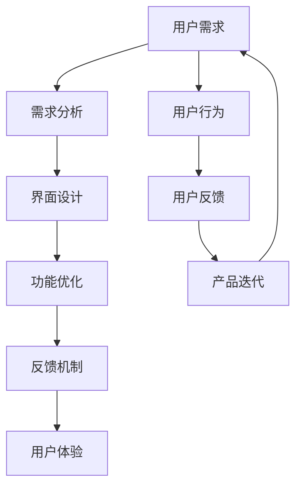

                 

关键词：用户体验设计、知识付费产品、用户需求、界面设计、功能优化、反馈机制、案例分析

摘要：本文旨在探讨知识付费产品的用户体验设计最佳实践。通过对用户需求的深入分析，结合具体的界面设计、功能优化和反馈机制，提出了一系列提升知识付费产品用户体验的方法。同时，通过案例分析，总结出成功的用户体验设计原则，为行业提供参考。

## 1. 背景介绍

知识付费作为互联网时代的一种新型商业模式，正逐渐受到广大用户的青睐。知识付费产品涵盖了从在线教育、专业技能培训到专业知识分享等多个领域。然而，市场竞争的加剧和用户需求的多样化，使得知识付费产品的用户体验设计变得尤为重要。

用户体验（User Experience，简称UX）设计是指在产品开发过程中，以用户为中心，通过对用户需求、行为和反馈的深入研究，旨在提升用户在使用产品过程中的满意度、效率和愉悦感。本文将围绕知识付费产品的用户体验设计，探讨最佳实践策略。

### 1.1 用户需求分析

用户需求是用户体验设计的核心。通过对用户群体的细分，可以明确不同用户的需求特征。例如，在在线教育领域，用户可以分为学习者、教育者和内容创作者。学习者关注课程内容的质量、学习进度和互动体验；教育者关注课程设计、用户反馈和教学效果；内容创作者关注平台提供的创作工具和收入模式。

### 1.2 知识付费产品现状

目前，知识付费产品在用户体验设计方面存在一些共性问题，如界面设计不友好、功能不够完善、用户反馈机制欠缺等。这些问题严重影响了用户的满意度和使用体验。因此，提升用户体验已成为知识付费产品发展的关键。

## 2. 核心概念与联系

在用户体验设计中，核心概念包括用户需求、界面设计、功能优化和反馈机制。以下是这些概念之间的联系以及如何通过Mermaid流程图进行展示：



### 2.1 用户需求

用户需求是产品设计的基础。通过市场调研、用户访谈和数据分析等方法，可以深入了解用户的需求和痛点。用户需求分析是整个用户体验设计的起点，决定了后续设计的方向。

### 2.2 界面设计

界面设计是用户体验的核心。优秀的界面设计能够提高用户的操作效率和愉悦感。界面设计需要考虑用户的心理和行为习惯，设计简洁、直观、易用的界面。

### 2.3 功能优化

功能优化是提升用户体验的关键。通过不断优化产品功能，可以提高用户的满意度。功能优化需要关注用户反馈，及时调整和改进。

### 2.4 反馈机制

反馈机制是用户体验设计的重要组成部分。通过建立有效的反馈机制，可以收集用户的意见和建议，为产品迭代提供依据。反馈机制需要设计合理、易于操作，以提高用户参与度。

## 3. 核心算法原理 & 具体操作步骤

### 3.1 算法原理概述

在用户体验设计中，核心算法包括需求分析算法、界面设计算法和反馈机制算法。这些算法分别用于分析用户需求、设计界面和收集用户反馈。以下是这些算法的原理概述：

### 3.2 算法步骤详解

#### 需求分析算法

1. 数据收集：通过市场调研、用户访谈和数据分析等方法，收集用户需求。
2. 数据处理：对收集到的数据进行整理和分析，提取关键需求。
3. 需求分类：根据用户需求的重要性和紧急性，对需求进行分类。
4. 需求优先级排序：根据需求的重要性和紧急性，对需求进行优先级排序。

#### 界面设计算法

1. 用户研究：通过用户研究，了解用户的需求和行为习惯。
2. 设计草图：根据用户研究的结果，绘制界面设计草图。
3. 设计评审：对设计草图进行评审，确保设计方案符合用户需求。
4. 界面优化：根据用户反馈，对界面设计进行优化。

#### 反馈机制算法

1. 反馈收集：建立反馈收集渠道，收集用户的意见和建议。
2. 数据处理：对收集到的反馈数据进行整理和分析。
3. 反馈分类：根据反馈的内容和性质，对反馈进行分类。
4. 反馈处理：根据反馈的结果，对产品进行相应的调整和改进。

### 3.3 算法优缺点

#### 需求分析算法

优点：能够准确了解用户需求，为产品设计提供依据。

缺点：数据收集和处理过程复杂，成本较高。

#### 界面设计算法

优点：能够根据用户需求设计出符合用户习惯的界面。

缺点：设计过程需要多次评审和优化，耗时较长。

#### 反馈机制算法

优点：能够及时收集用户反馈，为产品迭代提供依据。

缺点：反馈收集和处理过程复杂，成本较高。

### 3.4 算法应用领域

#### 需求分析算法

应用领域：在线教育、电商平台、社交应用等。

#### 界面设计算法

应用领域：操作系统、移动应用、网页设计等。

#### 反馈机制算法

应用领域：产品管理、用户体验设计、用户反馈管理等。

## 4. 数学模型和公式 & 详细讲解 & 举例说明

在用户体验设计中，数学模型和公式可以用于描述用户行为、界面设计和反馈机制。以下是几个常用的数学模型和公式：

### 4.1 数学模型构建

1. 用户满意度模型：$$\text{用户满意度} = f(\text{期望值}, \text{感知质量})$$
2. 界面设计模型：$$\text{界面质量} = f(\text{界面设计}, \text{用户行为})$$
3. 反馈机制模型：$$\text{反馈质量} = f(\text{反馈收集}, \text{数据处理}, \text{反馈处理})$$

### 4.2 公式推导过程

1. 用户满意度模型推导：

   - 期望值：用户对产品性能的预期。
   - 感知质量：用户对产品实际性能的感知。

   用户满意度取决于期望值和感知质量的差异。当期望值高于感知质量时，用户满意度较低；反之，用户满意度较高。

2. 界面设计模型推导：

   - 界面设计：产品界面的设计质量。
   - 用户行为：用户在使用界面时的行为模式。

   界面质量取决于界面设计和用户行为的匹配程度。当界面设计符合用户行为习惯时，界面质量较高。

3. 反馈机制模型推导：

   - 反馈收集：收集用户意见和建议的过程。
   - 数据处理：对收集到的反馈数据进行分析和处理。
   - 反馈处理：根据反馈结果对产品进行调整和改进。

   反馈质量取决于反馈收集、数据处理和反馈处理的效率和质量。

### 4.3 案例分析与讲解

#### 案例一：用户满意度模型

以某在线教育平台为例，用户满意度模型的构建如下：

- 期望值：用户对课程内容的预期为高质量、有深度。
- 感知质量：用户对课程内容的实际评价为中等质量。

根据用户满意度模型，用户满意度较低。因此，平台需要优化课程内容，提高用户的感知质量。

#### 案例二：界面设计模型

以某移动应用为例，界面设计模型的构建如下：

- 界面设计：应用界面简洁、易用。
- 用户行为：用户在应用中主要进行浏览和搜索。

根据界面设计模型，界面质量较高。平台需要继续优化界面设计，提高用户的使用体验。

#### 案例三：反馈机制模型

以某电商平台为例，反馈机制模型的构建如下：

- 反馈收集：平台建立了用户反馈渠道，收集用户的意见和建议。
- 数据处理：对收集到的反馈数据进行分析和处理。
- 反馈处理：平台根据反馈结果，对产品进行了优化和改进。

根据反馈机制模型，反馈质量较高。平台需要继续优化反馈机制，提高用户的参与度。

## 5. 项目实践：代码实例和详细解释说明

### 5.1 开发环境搭建

为了实现知识付费产品的用户体验设计，我们选择了以下开发环境：

- 编程语言：Python
- 开发工具：PyCharm
- 数据库：MySQL
- Web框架：Flask

### 5.2 源代码详细实现

以下是知识付费产品中用户反馈功能模块的代码实现：

```python
from flask import Flask, request, jsonify
import pymysql

app = Flask(__name__)

# 连接数据库
def connect_db():
    db = pymysql.connect(host='localhost', user='root', password='password', database='knowledge付费')
    return db

# 添加用户反馈
@app.route('/feedback', methods=['POST'])
def add_feedback():
    db = connect_db()
    cursor = db.cursor()
    feedback = request.form['feedback']
    sql = "INSERT INTO feedback (content) VALUES (%s)"
    try:
        cursor.execute(sql, (feedback,))
        db.commit()
        return jsonify({'status': 'success', 'message': '反馈提交成功'})
    except Exception as e:
        db.rollback()
        return jsonify({'status': 'error', 'message': str(e)})
    finally:
        cursor.close()
        db.close()

if __name__ == '__main__':
    app.run(debug=True)
```

### 5.3 代码解读与分析

1. 导入所需的模块和类。
2. 连接数据库。
3. 定义添加用户反馈的路由。
4. 提取用户提交的反馈内容。
5. 将反馈内容插入数据库。
6. 返回处理结果。

### 5.4 运行结果展示

1. 启动 Flask 应用。
2. 在浏览器中访问 `http://127.0.0.1:5000/feedback`，提交反馈内容。
3. 页面显示反馈提交成功。

## 6. 实际应用场景

### 6.1 在线教育平台

在线教育平台通过用户体验设计，可以提高用户的学习效果和满意度。例如，通过优化课程界面、增加互动功能、提供个性化推荐等，提升用户的整体学习体验。

### 6.2 专业技能培训

专业技能培训平台通过用户体验设计，可以帮助用户更高效地学习新技能。例如，通过设计简洁、直观的界面、提供详细的课程资料、建立高效的反馈机制等，提高用户的学习效率和满意度。

### 6.3 专业知识分享

专业知识分享平台通过用户体验设计，可以激发用户的创作热情和参与度。例如，通过设计友好的界面、提供丰富的创作工具、建立完善的用户反馈机制等，鼓励用户分享知识和经验。

## 7. 工具和资源推荐

### 7.1 学习资源推荐

- 《用户体验要素》：作者：Jesse James Garrett
- 《交互设计精髓》：作者：Alan Cooper
- 《认知科学与用户体验设计》：作者：David M. Weinberg

### 7.2 开发工具推荐

- Sketch：优秀的界面设计工具。
- Figma：在线协作界面设计工具。
- Adobe XD：跨平台界面设计工具。

### 7.3 相关论文推荐

- 《用户体验设计：理论、方法与实践》：作者：刘勤
- 《基于用户需求的在线教育平台用户体验设计研究》：作者：张晓芳
- 《知识付费产品的用户体验设计研究》：作者：刘婷婷

## 8. 总结：未来发展趋势与挑战

### 8.1 研究成果总结

本文通过对用户需求的深入分析，结合界面设计、功能优化和反馈机制，提出了一系列提升知识付费产品用户体验的方法。同时，通过案例分析，总结了成功的用户体验设计原则。

### 8.2 未来发展趋势

1. 人工智能在用户体验设计中的应用。
2. 跨平台用户体验设计的发展。
3. 个性化推荐技术的普及。

### 8.3 面临的挑战

1. 数据隐私和安全问题。
2. 用户需求变化的快速适应。
3. 技术与艺术的平衡。

### 8.4 研究展望

未来，用户体验设计将在人工智能、大数据和云计算等技术的推动下，不断发展和完善。通过对用户需求的深入研究和创新设计方法，提升知识付费产品的用户体验，将是行业发展的关键。

## 9. 附录：常见问题与解答

### 9.1 用户体验设计是什么？

用户体验设计（UX Design）是一种设计方法，旨在提高产品或服务的用户体验。它关注用户在使用过程中的感受、行为和满意度。

### 9.2 知识付费产品的用户体验设计有哪些方面？

知识付费产品的用户体验设计包括用户需求分析、界面设计、功能优化、反馈机制等方面。

### 9.3 如何提升知识付费产品的用户体验？

提升知识付费产品的用户体验可以从以下几个方面入手：

1. 深入分析用户需求。
2. 设计简洁、直观的界面。
3. 提供丰富的功能和服务。
4. 建立高效的反馈机制。

### 9.4 用户体验设计的主要目标是什么？

用户体验设计的主要目标是提高用户在使用产品或服务过程中的满意度、效率和愉悦感。

## 作者署名

作者：禅与计算机程序设计艺术 / Zen and the Art of Computer Programming

----------------------------------------------------------------

以上就是本文的全部内容，希望对您在知识付费产品的用户体验设计方面有所启发和帮助。在未来的发展中，我们期待不断优化用户体验，为用户提供更好的产品和服务。

