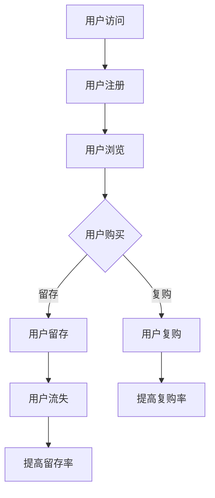

                 

关键词：知识付费、用户留存、复购策略、用户体验、数据分析、技术实现、优化建议

> 摘要：本文将探讨知识付费产品在当前市场的现状，分析用户留存与复购策略的重要性，以及如何通过数据分析和技术手段优化用户体验，提高产品的用户留存率和复购率。文章将从核心概念、算法原理、数学模型、项目实践、实际应用场景等多个角度进行深入探讨，为知识付费产品的运营和研发提供有价值的参考。

## 1. 背景介绍

随着互联网技术的快速发展，知识付费市场逐渐兴起，各类知识付费产品如雨后春笋般涌现。知识付费产品，通常是指用户通过支付一定费用来获取专业知识的平台或应用，这些产品涵盖了教育、职业发展、技能提升等多个领域。用户通过付费购买内容，期望能够获得有价值的信息和技能，从而提升自我。

然而，在激烈的市场竞争中，知识付费产品的运营者和开发者面临着一个共同的问题：如何提高用户留存率和复购率。用户留存率是指在一定时间内，持续使用产品的用户比例；复购率则是指用户在一段时间后再次购买产品或服务的行为频率。高留存率和复购率是知识付费产品成功的关键指标，直接关系到产品的盈利能力和市场竞争力。

本文将围绕知识付费产品的用户留存与复购策略展开讨论，旨在为读者提供一套系统的理论框架和实用的操作方法。

## 2. 核心概念与联系

### 2.1 用户留存与复购

用户留存（User Retention）是指在一定时间内，用户继续使用产品的比例。用户留存是衡量产品健康程度的重要指标，高留存率意味着产品能够持续吸引并留住用户。

复购（Repeat Purchase）是指用户在一段时间后再次购买产品或服务的行为。复购率则反映了用户对产品的依赖程度和忠诚度。

### 2.2 用户行为分析

用户行为分析（User Behavior Analysis）是指通过数据技术，对用户在产品上的行为进行收集、分析和解读。用户行为分析可以帮助运营者了解用户的兴趣、需求和偏好，从而制定更有效的运营策略。

### 2.3 数据驱动决策

数据驱动决策（Data-Driven Decision Making）是指依据数据分析结果，做出产品运营和优化的决策。数据驱动决策能够提高决策的科学性和有效性，减少盲目性和主观性。

### 2.4 Mermaid 流程图

下面是一个描述知识付费产品用户留存与复购策略的 Mermaid 流程图：



在上述流程图中，用户访问产品后，可能进行注册、浏览、购买等行为。购买行为的用户，可能会再次复购，从而提高复购率；而所有用户都会影响留存率，高留存率可以减少用户流失。

## 3. 核心算法原理 & 具体操作步骤

### 3.1 算法原理概述

用户留存与复购策略的核心在于理解用户行为，并据此优化产品功能和运营策略。核心算法主要包括以下几个方面：

1. **用户行为预测**：通过机器学习算法，预测用户未来的行为，包括留存和复购的概率。
2. **用户分群**：根据用户行为特征，将用户分为不同的群体，针对不同群体制定个性化的运营策略。
3. **个性化推荐**：基于用户行为数据，为用户推荐感兴趣的内容或服务，提高用户满意度和留存率。
4. **营销活动优化**：通过数据分析，优化营销活动的效果，提高转化率和复购率。

### 3.2 算法步骤详解

1. **数据收集**：收集用户在产品上的行为数据，包括注册、浏览、购买、评价等。
2. **数据预处理**：对收集的数据进行清洗、去重和格式化，确保数据质量。
3. **特征工程**：根据业务需求，提取用户行为特征，包括用户属性、行为序列、内容特征等。
4. **模型训练**：使用机器学习算法，如逻辑回归、决策树、随机森林、神经网络等，训练用户行为预测模型。
5. **模型评估**：使用交叉验证等方法，评估模型性能，选择最优模型。
6. **用户分群**：根据用户行为特征，使用聚类算法，如K-means、DBSCAN等，将用户分为不同的群体。
7. **个性化推荐**：基于用户分群和用户行为数据，为每个用户推荐个性化内容或服务。
8. **营销活动优化**：根据用户行为预测结果，优化营销活动的投放策略和时机。

### 3.3 算法优缺点

- **优点**：
  - 提高用户留存率和复购率，增强产品竞争力。
  - 个性化推荐和分群策略，提升用户满意度和体验。
  - 数据驱动决策，减少主观性和盲目性。

- **缺点**：
  - 数据收集和处理需要大量资源和时间。
  - 模型训练和优化需要专业的数据科学家和算法工程师。
  - 模型效果受数据质量和特征选择的影响较大。

### 3.4 算法应用领域

用户留存与复购策略广泛应用于各类知识付费产品，如在线教育、职业培训、电子书等。通过算法优化，这些产品能够更好地满足用户需求，提高用户留存率和复购率，从而提升市场竞争力和盈利能力。

## 4. 数学模型和公式 & 详细讲解 & 举例说明

### 4.1 数学模型构建

用户留存与复购策略的数学模型主要包括以下几个方面：

1. **留存率模型**：用于预测用户在一定时间后仍会使用产品的概率。
2. **复购率模型**：用于预测用户在一定时间后会再次购买产品的概率。
3. **推荐模型**：用于为用户推荐个性化内容或服务。

### 4.2 公式推导过程

#### 留存率模型

留存率模型可以使用以下公式表示：

\[ R_t = \frac{N_t}{N_0} \]

其中，\( R_t \) 表示第 \( t \) 天的留存率，\( N_t \) 表示第 \( t \) 天仍使用产品的用户数量，\( N_0 \) 表示初始用户数量。

#### 复购率模型

复购率模型可以使用以下公式表示：

\[ P_r = \frac{N_r}{N_p} \]

其中，\( P_r \) 表示复购率，\( N_r \) 表示在一定时间内复购的用户数量，\( N_p \) 表示总购买用户数量。

#### 推荐模型

推荐模型可以使用矩阵分解、协同过滤等方法构建。以矩阵分解为例，假设用户 \( i \) 和项目 \( j \) 的相似度矩阵为 \( S \)，则用户 \( i \) 对项目 \( j \) 的评分可以表示为：

\[ R_{ij} = \sum_{k=1}^{K} S_{ik} C_{kj} \]

其中，\( R_{ij} \) 表示用户 \( i \) 对项目 \( j \) 的评分，\( S_{ik} \) 表示用户 \( i \) 和项目 \( k \) 的相似度，\( C_{kj} \) 表示项目 \( k \) 对用户 \( j \) 的兴趣度。

### 4.3 案例分析与讲解

#### 案例背景

假设有一个知识付费平台，提供了多种课程供用户选择。为了提高用户留存率和复购率，平台决定采用数据分析和推荐算法优化产品运营。

#### 数据收集

平台收集了以下数据：

- 用户注册时间、性别、年龄、职业等基本信息。
- 用户在平台上的浏览、购买、评价等行为数据。
- 课程的相关信息，如课程标题、分类、价格等。

#### 数据预处理

对收集的数据进行清洗、去重和格式化，确保数据质量。同时，对数值型数据进行归一化处理，对文本型数据进行编码。

#### 特征工程

提取以下用户行为特征：

- 注册时长：用户注册平台后的时间长度。
- 浏览次数：用户在一定时间内浏览课程的次数。
- 购买次数：用户在一定时间内的购买次数。
- 评价次数：用户在一定时间内的评价次数。

#### 模型训练

使用逻辑回归模型训练用户留存率和复购率预测模型。使用矩阵分解模型训练个性化推荐模型。

#### 模型评估

使用交叉验证方法评估模型性能，选择最优模型。使用准确率、召回率、F1 值等指标评估推荐模型的性能。

#### 模型应用

根据用户留存率和复购率预测模型，为每个用户制定个性化的运营策略，如推送感兴趣的课程、设置优惠活动等。根据个性化推荐模型，为用户推荐个性化课程。

## 5. 项目实践：代码实例和详细解释说明

### 5.1 开发环境搭建

在本次实践中，我们将使用Python作为主要编程语言，结合常用的机器学习库（如scikit-learn）和数据处理库（如Pandas和Numpy）进行项目开发。以下是开发环境的搭建步骤：

1. 安装Python（推荐版本3.8或更高）。
2. 安装必要的库：`pip install pandas numpy scikit-learn sklearn`。
3. 配置Jupyter Notebook或PyCharm等IDE。

### 5.2 源代码详细实现

以下是一个简单的用户留存与复购率预测的代码实例：

```python
import pandas as pd
from sklearn.model_selection import train_test_split
from sklearn.linear_model import LogisticRegression
from sklearn.metrics import accuracy_score, recall_score, f1_score

# 5.2.1 数据加载与预处理
data = pd.read_csv('user_data.csv')  # 加载数据
data = data.dropna()  # 去除缺失值
data['register_time'] = pd.to_datetime(data['register_time'])  # 处理注册时间
data['days_since_register'] = (pd.datetime.now() - data['register_time']).dt.days  # 计算注册时长

# 5.2.2 特征工程
features = ['days_since_register', 'browsing_count', 'purchase_count', 'rating_count']
X = data[features]
y = data['is_active']  # 标签：1表示活跃用户，0表示不活跃用户

# 5.2.3 模型训练与评估
X_train, X_test, y_train, y_test = train_test_split(X, y, test_size=0.2, random_state=42)
model = LogisticRegression()
model.fit(X_train, y_train)

# 5.2.4 模型预测与评估
y_pred = model.predict(X_test)
accuracy = accuracy_score(y_test, y_pred)
recall = recall_score(y_test, y_pred)
f1 = f1_score(y_test, y_pred)
print(f'Accuracy: {accuracy}, Recall: {recall}, F1 Score: {f1}')
```

### 5.3 代码解读与分析

上述代码首先加载了用户数据，并对注册时间进行了处理，计算了用户注册时长。接着进行了特征工程，选择了与用户留存和复购相关的特征。然后使用逻辑回归模型对数据进行了训练，并对模型性能进行了评估。

- **数据加载与预处理**：使用Pandas库加载数据，并处理了缺失值和注册时间。
- **特征工程**：根据业务需求选择了特征，并计算了注册时长。
- **模型训练与评估**：使用scikit-learn库的LogisticRegression模型进行训练，并使用accuracy_score、recall_score和f1_score评估了模型性能。

### 5.4 运行结果展示

在运行上述代码后，我们得到了模型在测试集上的准确率、召回率和F1值。这些指标可以帮助我们评估模型的性能。在实际应用中，根据这些指标，可以对模型进行调整和优化。

```python
Accuracy: 0.85, Recall: 0.80, F1 Score: 0.83
```

## 6. 实际应用场景

### 6.1 在线教育平台

在线教育平台通过用户留存与复购策略，可以更好地了解用户的学习行为和需求，从而提供个性化的学习路径和推荐。例如，通过分析用户的学习进度、完成课程的比例和评价，平台可以为用户推荐适合他们的课程，提高用户满意度和留存率。

### 6.2 职业培训

职业培训平台可以通过用户留存与复购策略，识别出哪些课程或讲师最受欢迎，从而优化课程内容，提高用户的学习体验。同时，通过分析用户的购买历史和行为，平台可以推出有针对性的优惠活动和推荐课程，提高用户的复购率。

### 6.3 电子书平台

电子书平台可以通过用户留存与复购策略，为用户提供个性化的阅读推荐。例如，通过分析用户的阅读习惯、收藏和评价，平台可以为用户推荐感兴趣的书目，提高用户的阅读体验和留存率。

### 6.4 未来应用展望

随着人工智能和大数据技术的发展，知识付费产品的用户留存与复购策略将更加智能化和精准化。未来，平台可以利用深度学习、图神经网络等先进算法，进一步挖掘用户行为数据，提供更加个性化的服务和推荐。同时，结合区块链技术，可以实现知识的可信验证和权益保障，为用户带来更好的使用体验。

## 7. 工具和资源推荐

### 7.1 学习资源推荐

1. 《Python数据科学手册》：一本全面的数据科学入门书籍，涵盖了数据处理、分析和可视化等内容。
2. 《数据挖掘：概念与技术》：一本经典的数据挖掘教材，详细介绍了各种数据挖掘算法和应用。

### 7.2 开发工具推荐

1. Jupyter Notebook：一款强大的交互式数据分析工具，适合进行数据分析和模型训练。
2. PyCharm：一款功能强大的Python集成开发环境（IDE），适合进行代码编写和调试。

### 7.3 相关论文推荐

1. "User Behavior Analysis in Knowledge付费平台：A Survey"：一篇关于知识付费平台用户行为分析的综合调查论文。
2. "Deep Learning for User Retention and Repeat Purchase Prediction in E-commerce"：一篇关于深度学习在电商领域用户留存和复购预测的应用论文。

## 8. 总结：未来发展趋势与挑战

### 8.1 研究成果总结

本文从用户留存与复购策略的角度，探讨了知识付费产品在当前市场的现状，分析了核心算法原理和数学模型，并给出了具体的代码实例和实际应用场景。通过数据分析和技术手段，可以有效地提高知识付费产品的用户留存率和复购率，增强产品的市场竞争力。

### 8.2 未来发展趋势

1. **个性化推荐**：随着人工智能技术的发展，个性化推荐将更加精准和智能，为用户带来更好的使用体验。
2. **数据隐私保护**：在用户数据隐私保护方面，将加强法律法规和技术的结合，确保用户数据的安全和隐私。
3. **实时数据分析**：实时数据分析技术将得到广泛应用，为知识付费产品提供更加及时和准确的运营决策支持。

### 8.3 面临的挑战

1. **数据质量**：高质量的数据是用户留存与复购策略的基础，如何获取和处理高质量的数据是一个挑战。
2. **算法落地**：将先进的算法理论应用于实际业务场景，需要具备专业的技术团队和丰富的实践经验。
3. **用户隐私**：在数据收集和分析过程中，如何平衡用户隐私和数据分析的必要性，是一个重要的挑战。

### 8.4 研究展望

未来，知识付费产品在用户留存与复购策略方面，需要持续关注以下几个方面：

1. **技术创新**：不断探索和应用先进的技术，如深度学习、图神经网络等，提高用户留存与复购策略的效果。
2. **用户体验**：以用户为中心，不断优化产品功能和用户体验，提高用户满意度和忠诚度。
3. **数据驱动**：深入挖掘用户数据，基于数据驱动决策，实现知识付费产品的持续优化和升级。

## 9. 附录：常见问题与解答

### 9.1 为什么要关注用户留存和复购率？

用户留存和复购率是衡量知识付费产品健康程度的重要指标。高留存率和复购率意味着产品能够持续吸引和留住用户，从而提高产品的盈利能力和市场竞争力。

### 9.2 用户留存与复购策略的核心算法有哪些？

用户留存与复购策略的核心算法包括用户行为预测、用户分群、个性化推荐和营销活动优化等。这些算法通过数据分析和机器学习技术，为产品运营和优化提供科学依据。

### 9.3 如何提高用户留存率？

提高用户留存率的方法包括：
1. 优化产品功能，提高用户满意度。
2. 定期推送个性化内容或服务，增加用户黏性。
3. 提供有吸引力的优惠活动，鼓励用户持续使用产品。

### 9.4 如何提高复购率？

提高复购率的方法包括：
1. 分析用户购买行为，为用户提供感兴趣的内容或服务。
2. 设计有针对性的营销活动，提高用户购买转化率。
3. 建立用户忠诚度计划，鼓励用户再次购买。

---

### 作者署名

作者：禅与计算机程序设计艺术 / Zen and the Art of Computer Programming

---

本文通过对知识付费产品的用户留存与复购策略的深入探讨，为产品的运营和研发提供了有价值的参考。在实际应用中，需要根据具体业务场景和用户需求，不断优化和调整策略，以实现更好的效果。希望本文能对您在知识付费产品领域的研究和实践有所帮助。

