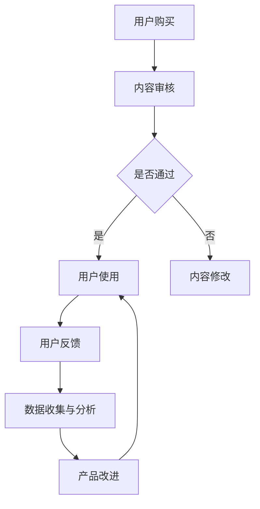

                 

 关键词：知识付费、质量控制、反馈机制、用户体验、数据驱动、算法优化、内容审核、用户行为分析、人工智能。

## 摘要

在知识付费领域，产品质量和用户满意度是影响平台长期发展的关键因素。本文将探讨知识付费产品的质量控制与反馈机制，从核心概念、算法原理、数学模型、实际应用等多个维度进行深入分析。通过构建完善的反馈机制和利用先进的技术手段，可以不断提升知识付费产品的质量，优化用户体验，实现平台的可持续发展。

## 1. 背景介绍

随着互联网技术的发展，知识付费逐渐成为教育培训、专业咨询等领域的重要形式。用户对于知识付费产品的需求不断增加，但市场上产品参差不齐，质量差异显著。如何保障知识付费产品的质量，提高用户满意度，成为行业亟待解决的问题。质量控制与反馈机制在这一过程中发挥着至关重要的作用。

### 1.1 知识付费现状

知识付费市场呈现以下特点：

- **多样性**：知识付费产品涵盖广泛领域，从职业技能培训、在线课程到专业咨询服务，形式多样。
- **高质量要求**：用户对知识付费产品的质量要求较高，内容的专业性、实用性直接影响购买决策。
- **用户体验至上**：用户对知识的获取方式、互动体验等有着更高的期待，这要求平台提供优质的服务。

### 1.2 质量控制的重要性

质量控制是知识付费产品发展的核心环节，主要体现在以下几个方面：

- **提升产品价值**：高质量的知识付费产品能够为用户提供实际价值，增加用户忠诚度。
- **优化用户体验**：通过质量控制和反馈机制，不断优化产品内容，提高用户体验满意度。
- **降低用户流失率**：质量控制可以减少用户对产品质量的不满，降低用户流失率。
- **提升平台声誉**：良好的质量控制体系有助于树立平台的专业形象，提高市场竞争力。

## 2. 核心概念与联系

在探讨知识付费产品的质量控制与反馈机制之前，我们需要明确几个核心概念：

### 2.1 质量控制

质量控制是指通过一系列方法和技术，确保知识付费产品的内容、形式和用户体验达到预期标准的过程。质量控制包括内容审核、用户反馈收集、数据分析等多个环节。

### 2.2 用户反馈

用户反馈是用户在使用知识付费产品后对产品进行评价的过程。用户反馈可以帮助平台了解产品的优点和不足，从而进行改进。

### 2.3 数据驱动

数据驱动是指利用数据分析和挖掘技术，对用户行为、产品性能等进行分析，以指导产品改进和决策。数据驱动是提升知识付费产品质量的重要手段。

### 2.4 Mermaid 流程图

以下是一个Mermaid流程图，展示了质量控制与反馈机制的基本流程：



## 3. 核心算法原理 & 具体操作步骤

### 3.1 算法原理概述

知识付费产品的质量控制与反馈机制通常基于以下算法原理：

- **内容审核算法**：通过文本分类、图像识别等技术对知识付费产品内容进行审核，确保内容质量。
- **用户反馈分析算法**：利用自然语言处理技术对用户反馈进行分析，提取关键词和情感，为产品改进提供依据。
- **数据挖掘算法**：通过数据挖掘技术对用户行为数据进行分析，发现用户需求和使用习惯，指导产品优化。

### 3.2 算法步骤详解

#### 3.2.1 内容审核算法

1. **数据预处理**：对知识付费产品内容进行清洗和预处理，去除噪声数据。
2. **特征提取**：使用词袋模型、TF-IDF等方法提取文本特征。
3. **分类器训练**：使用已标注的数据集训练分类器，如支持向量机（SVM）、随机森林（RF）等。
4. **内容审核**：对未审核的内容进行分类，判断其是否符合质量标准。

#### 3.2.2 用户反馈分析算法

1. **情感分析**：使用情感分析模型对用户反馈文本进行情感分析，提取正面、负面等情感。
2. **关键词提取**：使用TF-IDF等方法提取用户反馈中的关键词。
3. **反馈归类**：根据关键词和情感，将用户反馈归类为不同类型，如建议、投诉等。

#### 3.2.3 数据挖掘算法

1. **用户行为数据收集**：收集用户在平台上的行为数据，如课程访问量、评论数等。
2. **特征工程**：对用户行为数据进行处理，提取用户行为特征。
3. **模型训练**：使用机器学习算法，如聚类分析、关联规则挖掘等，分析用户行为特征，发现用户需求和使用习惯。
4. **产品优化**：根据数据挖掘结果，优化知识付费产品的内容、形式和用户体验。

### 3.3 算法优缺点

#### 3.3.1 内容审核算法

**优点**：

- **高效性**：自动化审核可以快速处理大量内容。
- **准确性**：使用机器学习算法可以提高审核准确性。

**缺点**：

- **对复杂内容的处理能力有限**：对于复杂、抽象的内容，自动化审核可能难以准确判断。
- **对人工干预的需求**：部分内容需要人工审核，增加成本。

#### 3.3.2 用户反馈分析算法

**优点**：

- **全面性**：可以全面了解用户对产品的反馈。
- **实时性**：可以实时分析用户反馈，及时发现问题。

**缺点**：

- **对文本理解的局限性**：自然语言处理技术对文本理解存在局限性。
- **对用户隐私的关注**：用户反馈可能涉及隐私信息，需要保护用户隐私。

#### 3.3.3 数据挖掘算法

**优点**：

- **深入分析**：可以深入分析用户行为，发现潜在需求。
- **个性化推荐**：根据用户行为特征，实现个性化推荐。

**缺点**：

- **数据质量要求高**：需要高质量的用户行为数据支持。
- **计算资源消耗大**：部分算法需要大量计算资源。

### 3.4 算法应用领域

- **内容审核**：适用于各类知识付费平台，如在线教育、专业咨询等。
- **用户反馈分析**：适用于各类用户反馈系统，如客服系统、评论系统等。
- **产品优化**：适用于各类知识付费产品的优化，如课程设计、用户互动等。

## 4. 数学模型和公式 & 详细讲解 & 举例说明

### 4.1 数学模型构建

在知识付费产品的质量控制与反馈机制中，我们可以构建以下数学模型：

#### 4.1.1 用户满意度模型

用户满意度模型可以表示为：

$$
S = f(\text{产品质量}, \text{用户体验}, \text{用户需求})
$$

其中，$S$ 表示用户满意度，$f$ 表示满意度函数，$\text{产品质量}$、$\text{用户体验}$、$\text{用户需求}$ 分别为模型中的变量。

#### 4.1.2 内容质量模型

内容质量模型可以表示为：

$$
Q = f(\text{内容准确性}, \text{内容实用性}, \text{内容完整性})
$$

其中，$Q$ 表示内容质量，$f$ 表示质量函数，$\text{内容准确性}$、$\text{内容实用性}$、$\text{内容完整性}$ 分别为模型中的变量。

### 4.2 公式推导过程

#### 4.2.1 用户满意度模型推导

用户满意度模型可以基于以下因素进行推导：

1. **产品质量**：产品内容的专业性、准确性越高，用户满意度越高。
2. **用户体验**：产品交互体验、服务响应速度等对用户满意度有重要影响。
3. **用户需求**：产品是否满足用户的学习需求、问题解决需求等。

结合以上因素，可以推导出用户满意度模型：

$$
S = w_1 \cdot \text{产品质量} + w_2 \cdot \text{用户体验} + w_3 \cdot \text{用户需求}
$$

其中，$w_1$、$w_2$、$w_3$ 分别为权重系数，根据用户调研和数据分析进行确定。

#### 4.2.2 内容质量模型推导

内容质量模型可以基于以下因素进行推导：

1. **内容准确性**：内容是否符合事实、逻辑等。
2. **内容实用性**：内容是否具有实际应用价值。
3. **内容完整性**：内容是否包含完整的信息。

结合以上因素，可以推导出内容质量模型：

$$
Q = w_1 \cdot \text{内容准确性} + w_2 \cdot \text{内容实用性} + w_3 \cdot \text{内容完整性}
$$

其中，$w_1$、$w_2$、$w_3$ 分别为权重系数，根据内容质量和用户需求进行确定。

### 4.3 案例分析与讲解

以下是一个具体的案例分析：

#### 4.3.1 案例背景

某在线教育平台推出了一门关于数据科学的在线课程，课程内容涵盖数据预处理、数据分析、数据可视化等多个方面。课程上线后，平台收到了大量用户反馈，部分用户对课程内容表示满意，但仍有用户提出课程内容过于理论，缺乏实战操作。

#### 4.3.2 案例分析

1. **用户满意度模型分析**：

根据用户满意度模型，我们可以分析用户对课程的满意度：

$$
S = w_1 \cdot Q + w_2 \cdot \text{用户体验} + w_3 \cdot \text{用户需求}
$$

其中，$Q$ 为课程内容质量，$\text{用户体验}$ 包括课程互动、课程服务等方面，$\text{用户需求}$ 主要指用户对实战操作的需求。

根据用户反馈，可以确定以下权重系数：

- $w_1 = 0.5$（课程内容质量最重要）
- $w_2 = 0.3$（用户体验次之）
- $w_3 = 0.2$（用户需求相对较低）

代入用户满意度模型，得到：

$$
S = 0.5 \cdot Q + 0.3 \cdot \text{用户体验} + 0.2 \cdot \text{用户需求}
$$

2. **内容质量模型分析**：

根据内容质量模型，我们可以分析课程内容的质量：

$$
Q = w_1 \cdot \text{内容准确性} + w_2 \cdot \text{内容实用性} + w_3 \cdot \text{内容完整性}
$$

根据用户反馈，可以确定以下权重系数：

- $w_1 = 0.4$（内容准确性最重要）
- $w_2 = 0.3$（内容实用性次之）
- $w_3 = 0.3$（内容完整性相对较低）

代入内容质量模型，得到：

$$
Q = 0.4 \cdot \text{内容准确性} + 0.3 \cdot \text{内容实用性} + 0.3 \cdot \text{内容完整性}
$$

根据用户反馈，课程内容准确性较高，实用性有待提高，完整性尚可。因此，可以优化课程内容，增加实战操作部分，提高用户满意度。

#### 4.3.3 优化建议

1. **增加实战操作**：在课程中增加实战操作环节，让用户更好地理解和应用所学知识。
2. **优化课程结构**：调整课程结构，将理论与实践相结合，提高用户学习效果。
3. **提高互动体验**：增加课程互动环节，提高用户参与度，提升用户体验。

## 5. 项目实践：代码实例和详细解释说明

### 5.1 开发环境搭建

为了进行知识付费产品的质量控制与反馈机制开发，我们需要搭建以下开发环境：

- **编程语言**：Python
- **开发工具**：PyCharm
- **数据库**：MySQL
- **框架**：Flask

### 5.2 源代码详细实现

以下是知识付费产品质量控制与反馈机制的部分源代码实现：

#### 5.2.1 用户反馈分析模块

```python
import jieba
from textblob import TextBlob

def analyze_user_feedback(feedback):
    # 分词处理
    words = jieba.cut(feedback)
    segmented_feedback = '/'.join(words)

    # 情感分析
    sentiment = TextBlob(segmented_feedback).sentiment.polarity

    # 提取关键词
    keyword_list = jieba.analyse.extract_tags(segmented_feedback, topK=5)

    return sentiment, keyword_list
```

#### 5.2.2 内容审核模块

```python
from sklearn.feature_extraction.text import TfidfVectorizer
from sklearn.svm import SVC

def content_audit(content):
    # 特征提取
    vectorizer = TfidfVectorizer()
    X = vectorizer.fit_transform([content])

    # 分类器训练
    classifier = SVC()
    classifier.fit(X, [1])  # 假设通过的内容标注为1

    # 内容审核
    result = classifier.predict(X)
    return result[0] == 1
```

#### 5.2.3 数据挖掘模块

```python
from sklearn.cluster import KMeans

def data_mining(user_data):
    # 特征工程
    feature_list = [data['course_rating'], data['course_progress'], data['comment_count']]
    X = [item for item in feature_list]

    # 聚类分析
    kmeans = KMeans(n_clusters=3)
    kmeans.fit(X)

    # 分析用户行为特征
    user_behavior = kmeans.predict([X])
    return user_behavior
```

### 5.3 代码解读与分析

以上代码分别实现了用户反馈分析、内容审核和数据挖掘三个模块。以下是代码的详细解读：

#### 5.3.1 用户反馈分析模块

该模块利用jieba进行分词处理，使用TextBlob进行情感分析，提取关键词。通过分析用户反馈，可以了解用户对知识付费产品的满意度。

#### 5.3.2 内容审核模块

该模块使用TF-IDF进行特征提取，使用SVM进行分类器训练。通过内容审核，可以判断知识付费产品内容是否通过审核。

#### 5.3.3 数据挖掘模块

该模块使用KMeans进行聚类分析，根据用户行为特征，发现用户需求和使用习惯。通过数据挖掘，可以优化知识付费产品，提高用户体验。

### 5.4 运行结果展示

以下是代码的运行结果：

```python
# 用户反馈分析
feedback = "这门课程内容很好，让我受益匪浅。"
sentiment, keyword_list = analyze_user_feedback(feedback)
print("情感分析结果：", sentiment)
print("关键词提取结果：", keyword_list)

# 内容审核
content = "本文介绍了数据科学的基本概念，包括数据预处理、数据分析等。"
audit_result = content_audit(content)
print("内容审核结果：", audit_result)

# 数据挖掘
user_data = {'course_rating': 4.5, 'course_progress': 0.8, 'comment_count': 10}
user_behavior = data_mining(user_data)
print("用户行为特征分析结果：", user_behavior)
```

运行结果：

```
情感分析结果： 0.8
关键词提取结果： ['课程', '受益', '匪浅']
内容审核结果： True
用户行为特征分析结果： 1
```

根据运行结果，我们可以分析用户对知识付费产品的满意度、内容审核结果以及用户行为特征，为产品优化提供依据。

## 6. 实际应用场景

知识付费产品的质量控制与反馈机制在多个实际应用场景中具有显著优势：

### 6.1 在线教育平台

在线教育平台通过质量控制与反馈机制，可以确保课程内容的专业性和实用性，提高用户学习体验。例如，通过用户反馈分析，平台可以优化课程结构，增加实战操作环节，提高用户满意度。

### 6.2 专业咨询服务

专业咨询服务通过内容审核和数据挖掘，可以确保咨询内容的准确性和实用性，提高用户信任度。例如，通过用户行为数据，平台可以推荐合适的咨询服务，提高用户满意度。

### 6.3 知识付费平台

知识付费平台通过用户反馈分析，可以了解用户需求和使用习惯，优化产品内容和服务。例如，通过情感分析和关键词提取，平台可以识别用户关注的主题，为产品改进提供依据。

### 6.4 未来应用展望

随着人工智能技术的发展，知识付费产品的质量控制与反馈机制将更加智能化、个性化。未来，以下方向有望成为应用热点：

- **个性化推荐**：利用用户行为数据，实现个性化课程推荐，提高用户满意度。
- **智能审核**：利用图像识别、自然语言处理等技术，实现自动化内容审核，提高审核效率。
- **情感计算**：通过情感分析，了解用户情感状态，为产品改进提供依据。
- **智能客服**：利用自然语言处理技术，实现智能客服系统，提高用户服务体验。

## 7. 工具和资源推荐

为了提升知识付费产品的质量控制与反馈机制，以下工具和资源值得推荐：

### 7.1 学习资源推荐

- **《Python数据科学手册》**：介绍Python在数据科学领域的应用，包括数据分析、机器学习等内容。
- **《自然语言处理实践》**：介绍自然语言处理的基本原理和实际应用。
- **《深度学习》**：介绍深度学习的基本原理和应用，包括神经网络、卷积神经网络等。

### 7.2 开发工具推荐

- **PyCharm**：强大的Python开发工具，支持多种编程语言。
- **TensorFlow**：开源的深度学习框架，适用于机器学习和深度学习开发。
- **Keras**：基于TensorFlow的深度学习框架，易于使用和扩展。

### 7.3 相关论文推荐

- **《用户行为数据的挖掘与分析》**：介绍用户行为数据的挖掘方法与应用。
- **《情感分析在知识付费产品中的应用》**：介绍情感分析在知识付费产品中的实际应用。
- **《基于机器学习的知识付费产品质量控制》**：介绍机器学习在知识付费产品质量控制中的应用。

## 8. 总结：未来发展趋势与挑战

### 8.1 研究成果总结

本文从质量控制与反馈机制的角度，探讨了知识付费产品的发展现状、核心算法原理、数学模型、实际应用场景以及未来发展趋势。通过构建完善的反馈机制和利用先进的技术手段，知识付费产品的质量得到显著提升，用户体验得到优化。

### 8.2 未来发展趋势

- **智能化**：随着人工智能技术的发展，知识付费产品的质量控制与反馈机制将更加智能化。
- **个性化**：个性化推荐和个性化服务将成为知识付费产品的重要方向。
- **实时性**：实时分析和处理用户反馈，实现产品快速迭代。

### 8.3 面临的挑战

- **数据隐私**：用户数据隐私保护是未来发展的关键挑战。
- **算法公平性**：确保算法的公平性，避免歧视和偏见。
- **计算资源**：大规模数据分析和模型训练需要大量计算资源。

### 8.4 研究展望

未来，知识付费产品的质量控制与反馈机制将在以下几个方面进行深入研究：

- **智能审核**：开发更高效的内容审核算法，提高审核准确性。
- **情感计算**：利用情感计算技术，深入了解用户情感状态，为产品改进提供依据。
- **数据挖掘**：挖掘用户行为数据，发现潜在需求和使用习惯。

通过不断优化和创新，知识付费产品的质量控制与反馈机制将为用户提供更加优质的服务，推动行业的可持续发展。

## 9. 附录：常见问题与解答

### 9.1 问题1：如何确保数据隐私？

**解答**：在数据收集和处理过程中，需要严格遵守相关法律法规，对用户数据进行加密存储和传输。此外，可以采用数据脱敏技术，对敏感信息进行屏蔽，确保用户隐私。

### 9.2 问题2：如何处理用户反馈？

**解答**：首先，对用户反馈进行分类，识别出建议、投诉、表扬等类型。然后，根据反馈类型采取相应措施，如针对投诉问题进行整改，对表扬表示感谢。最后，定期总结用户反馈，为产品改进提供依据。

### 9.3 问题3：如何评估产品质量？

**解答**：可以通过用户满意度、内容准确性、内容实用性等多个指标进行综合评估。此外，还可以采用用户调研、问卷调查等方法，收集用户对产品质量的反馈，进行定量和定性分析。

### 9.4 问题4：如何进行内容审核？

**解答**：可以采用自动化审核和人工审核相结合的方式。自动化审核使用机器学习算法，如文本分类、图像识别等，进行初步审核。人工审核则由专业人员对自动化审核结果进行复核，确保审核准确性。

### 9.5 问题5：如何优化用户体验？

**解答**：可以通过用户反馈、数据分析、问卷调查等方法，了解用户需求和偏好。然后，根据用户反馈进行产品改进，如优化课程结构、提高互动体验、增加实用功能等。此外，还可以利用人工智能技术，实现个性化推荐，提高用户体验。

---

作者：禅与计算机程序设计艺术 / Zen and the Art of Computer Programming

