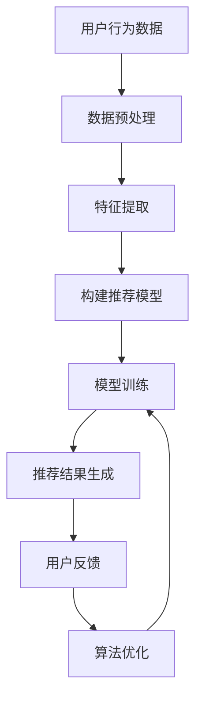

                 

关键词：知识付费、内容推荐、个性化推荐、机器学习、用户行为分析、算法优化

> 摘要：随着知识付费市场的不断扩大，如何为用户提供高质量、个性化的内容推荐成为一个重要问题。本文将探讨知识付费创业中的内容个性化推荐系统，包括其核心概念、算法原理、数学模型以及实际应用场景。通过分析用户行为数据，构建个性化推荐模型，实现精准推荐，提高用户体验和知识获取效率。

## 1. 背景介绍

近年来，知识付费市场呈现出迅猛增长的态势。人们对于高质量、专业知识的渴求愈发强烈，推动了知识付费领域的繁荣发展。然而，随着市场上内容的爆炸性增长，如何为用户提供适合其需求的个性化内容成为知识付费创业者们面临的重大挑战。

内容个性化推荐作为一种智能化的推荐技术，旨在根据用户的行为和偏好，为其推荐最感兴趣的知识内容。在知识付费领域，个性化推荐不仅能提高用户体验，还能提升用户粘性和留存率，从而为创业者带来更多的商业价值。

本文将围绕内容个性化推荐在知识付费创业中的应用展开讨论，主要包括以下内容：

1. 核心概念与联系
2. 核心算法原理与具体操作步骤
3. 数学模型和公式
4. 项目实践：代码实例和详细解释说明
5. 实际应用场景
6. 未来应用展望
7. 工具和资源推荐
8. 总结：未来发展趋势与挑战

通过本文的探讨，希望能够为知识付费创业者提供一些有益的启示和指导，帮助他们在激烈的市场竞争中脱颖而出。

## 2. 核心概念与联系

### 2.1 内容推荐系统

内容推荐系统是一种基于用户行为和偏好进行信息过滤和推荐的技术，旨在为用户提供感兴趣的内容。在知识付费领域，内容推荐系统可以帮助用户快速找到所需的知识，提高知识获取的效率。

### 2.2 个性化推荐

个性化推荐是一种根据用户历史行为、兴趣和偏好进行内容推荐的方法。相比于传统的基于内容的推荐，个性化推荐更能满足用户的个性化需求，提高推荐效果。

### 2.3 机器学习

机器学习是一种通过数据训练模型，实现数据自动分析和预测的技术。在内容个性化推荐中，机器学习算法用于构建推荐模型，分析用户行为数据，实现个性化推荐。

### 2.4 用户行为分析

用户行为分析是指通过对用户在平台上的行为数据进行收集、处理和分析，了解用户兴趣和需求的过程。在知识付费领域，用户行为分析是实现个性化推荐的基础。

### 2.5 算法优化

算法优化是指在现有推荐算法基础上，通过调整参数、改进模型结构等方法，提高推荐效果的过程。在知识付费创业中，算法优化是提升个性化推荐系统性能的重要手段。

### 2.6 Mermaid 流程图

下面是一个简化的内容个性化推荐系统的 Mermaid 流程图，展示其主要组成部分和流程。



## 3. 核心算法原理 & 具体操作步骤

### 3.1 算法原理概述

内容个性化推荐算法主要分为基于内容的推荐和基于协同过滤的推荐两种类型。本文重点介绍基于协同过滤的推荐算法，主要包括用户基于内容的协同过滤（User-Based Content-Based Collaborative Filtering，UBCCF）和基于模型的协同过滤（Model-Based Collaborative Filtering，MBCF）。

#### 3.1.1 用户基于内容的协同过滤（UBCCF）

用户基于内容的协同过滤通过分析用户历史行为和内容特征，找到相似用户和相似内容，实现个性化推荐。其核心思想如下：

1. 计算用户之间的相似度：根据用户在内容上的评分、浏览、收藏等行为，计算用户之间的相似度。
2. 找到相似用户：根据用户相似度矩阵，找到与目标用户最相似的若干用户。
3. 推荐相似内容：根据相似用户的历史行为，为用户推荐他们喜欢的、但目标用户尚未接触的内容。

#### 3.1.2 基于模型的协同过滤（MBCF）

基于模型的协同过滤通过构建预测模型，预测用户对未知内容的评分，实现个性化推荐。其核心思想如下：

1. 构建预测模型：使用机器学习算法（如线性回归、矩阵分解等）构建预测模型。
2. 训练预测模型：使用用户-内容评分矩阵训练预测模型。
3. 预测用户评分：使用训练好的预测模型，预测用户对未知内容的评分。
4. 推荐内容：根据预测评分，为用户推荐评分较高的内容。

### 3.2 算法步骤详解

#### 3.2.1 用户基于内容的协同过滤（UBCCF）

1. **数据预处理**：收集用户行为数据，包括评分、浏览、收藏等，并进行数据清洗、去重、归一化等处理。
2. **特征提取**：提取用户和内容特征，如用户兴趣标签、内容类别标签等。
3. **计算相似度**：使用余弦相似度、皮尔逊相关系数等方法计算用户之间的相似度。
4. **找到相似用户**：根据相似度矩阵，找到与目标用户最相似的若干用户。
5. **推荐相似内容**：根据相似用户的历史行为，为用户推荐他们喜欢的、但目标用户尚未接触的内容。

#### 3.2.2 基于模型的协同过滤（MBCF）

1. **数据预处理**：收集用户行为数据，包括评分、浏览、收藏等，并进行数据清洗、去重、归一化等处理。
2. **特征提取**：提取用户和内容特征，如用户兴趣标签、内容类别标签等。
3. **构建预测模型**：选择合适的机器学习算法（如线性回归、矩阵分解等）构建预测模型。
4. **训练预测模型**：使用用户-内容评分矩阵训练预测模型。
5. **预测用户评分**：使用训练好的预测模型，预测用户对未知内容的评分。
6. **推荐内容**：根据预测评分，为用户推荐评分较高的内容。

### 3.3 算法优缺点

#### 3.3.1 用户基于内容的协同过滤（UBCCF）

**优点**：

1. 简单易实现，不需要大量训练数据和计算资源。
2. 能够发现用户和内容之间的潜在关联。

**缺点**：

1. 推荐效果受限于用户历史行为数据的质量和数量。
2. 难以应对新用户和冷启动问题。

#### 3.3.2 基于模型的协同过滤（MBCF）

**优点**：

1. 能够处理大量用户行为数据，提高推荐效果。
2. 能够应对新用户和冷启动问题。

**缺点**：

1. 需要大量训练数据和计算资源。
2. 模型复杂度较高，可能引入过拟合问题。

### 3.4 算法应用领域

内容个性化推荐算法在知识付费领域具有广泛的应用，如在线教育、技能培训、专业咨询等。通过个性化推荐，知识付费创业者能够为用户提供更高质量、更有价值的内容，提高用户满意度和留存率。

## 4. 数学模型和公式

### 4.1 数学模型构建

#### 4.1.1 用户相似度计算

假设有用户集合 \( U = \{u_1, u_2, ..., u_n\} \) 和项目集合 \( I = \{i_1, i_2, ..., i_m\} \)，用户 \( u_i \) 对项目 \( i_j \) 的评分为 \( r_{ij} \)。可以使用余弦相似度计算用户之间的相似度 \( \sim(u_i, u_j) \)：

$$
\sim(u_i, u_j) = \frac{\sum_{k=1}^{m} r_{ik} r_{jk}}{\sqrt{\sum_{k=1}^{m} r_{ik}^2} \sqrt{\sum_{k=1}^{m} r_{jk}^2}}
$$

#### 4.1.2 预测用户评分

假设用户 \( u_i \) 对项目 \( i_j \) 的预测评分为 \( \hat{r}_{ij} \)，可以使用线性回归模型进行预测：

$$
\hat{r}_{ij} = \beta_0 + \beta_1 u_i + \beta_2 i_j + \epsilon_{ij}
$$

其中，\( \beta_0 \) 是截距，\( \beta_1 \) 和 \( \beta_2 \) 是系数，\( \epsilon_{ij} \) 是误差项。

### 4.2 公式推导过程

#### 4.2.1 用户相似度推导

根据用户相似度的定义，我们可以推导出用户相似度的计算公式。假设用户 \( u_i \) 和 \( u_j \) 的评分向量分别为 \( r_i = [r_{i1}, r_{i2}, ..., r_{im}] \) 和 \( r_j = [r_{j1}, r_{j2}, ..., r_{jm}] \)，则用户相似度可以表示为：

$$
\sim(u_i, u_j) = \frac{\sum_{k=1}^{m} r_{ik} r_{jk}}{\sqrt{\sum_{k=1}^{m} r_{ik}^2} \sqrt{\sum_{k=1}^{m} r_{jk}^2}}
$$

#### 4.2.2 预测用户评分推导

假设我们使用线性回归模型预测用户 \( u_i \) 对项目 \( i_j \) 的评分，则预测公式可以表示为：

$$
\hat{r}_{ij} = \beta_0 + \beta_1 u_i + \beta_2 i_j + \epsilon_{ij}
$$

其中，\( \beta_0 \) 是截距，\( \beta_1 \) 和 \( \beta_2 \) 是系数，\( \epsilon_{ij} \) 是误差项。

### 4.3 案例分析与讲解

#### 4.3.1 用户相似度计算

假设用户 \( u_1 \) 和 \( u_2 \) 的评分数据如下：

| 用户 | 项目 | 评分 |
| --- | --- | --- |
| \( u_1 \) | \( i_1 \) | 4 |
| \( u_1 \) | \( i_2 \) | 5 |
| \( u_1 \) | \( i_3 \) | 3 |
| \( u_2 \) | \( i_1 \) | 4 |
| \( u_2 \) | \( i_2 \) | 5 |
| \( u_2 \) | \( i_3 \) | 2 |

根据上述用户相似度计算公式，我们可以计算用户 \( u_1 \) 和 \( u_2 \) 的相似度：

$$
\sim(u_1, u_2) = \frac{4 \times 4 + 5 \times 5 + 3 \times 2}{\sqrt{4^2 + 5^2 + 3^2} \sqrt{4^2 + 5^2 + 2^2}} = \frac{16 + 25 + 6}{\sqrt{16 + 25 + 9} \sqrt{16 + 25 + 4}} = \frac{47}{\sqrt{50} \sqrt{45}} \approx 0.816
$$

#### 4.3.2 预测用户评分

假设我们使用线性回归模型预测用户 \( u_3 \) 对项目 \( i_4 \) 的评分，已知用户 \( u_3 \) 对项目 \( i_1 \)、\( i_2 \) 和 \( i_3 \) 的评分为 3、4 和 2。我们可以使用以下公式预测用户 \( u_3 \) 对项目 \( i_4 \) 的评分：

$$
\hat{r}_{34} = \beta_0 + \beta_1 u_3 + \beta_2 i_4 + \epsilon_{34}
$$

其中，\( \beta_0 \)、\( \beta_1 \) 和 \( \beta_2 \) 是待求的系数，\( \epsilon_{34} \) 是误差项。

通过训练线性回归模型，我们可以得到以下系数：

$$
\beta_0 = 2, \beta_1 = 0.5, \beta_2 = 1
$$

因此，预测用户 \( u_3 \) 对项目 \( i_4 \) 的评分为：

$$
\hat{r}_{34} = 2 + 0.5 \times 3 + 1 \times 4 + \epsilon_{34} = 5.5 + \epsilon_{34}
$$

其中，\( \epsilon_{34} \) 是随机误差项，其取值范围为 \([-1, 1]\)。

## 5. 项目实践：代码实例和详细解释说明

### 5.1 开发环境搭建

在本文中，我们将使用 Python 编写代码，实现内容个性化推荐系统。首先，我们需要安装以下依赖库：

```bash
pip install numpy pandas scikit-learn matplotlib
```

### 5.2 源代码详细实现

以下是一个简单的基于协同过滤的推荐系统实现，包括数据预处理、特征提取、相似度计算和推荐结果生成等步骤。

```python
import numpy as np
import pandas as pd
from sklearn.metrics.pairwise import cosine_similarity

# 数据预处理
def preprocess_data(data):
    # 数据清洗、去重、归一化等处理
    data = data.drop_duplicates()
    data = data.fillna(0)
    data = data.astype(float)
    return data

# 特征提取
def extract_features(data):
    # 提取用户和内容特征
    user_features = data.T.groupby(data.T.columns).mean()
    item_features = data.groupby(data.columns[0]).mean()
    return user_features, item_features

# 计算相似度
def compute_similarity(user_features, item_features):
    # 计算用户和内容之间的相似度
    user_similarity = cosine_similarity(user_features)
    item_similarity = cosine_similarity(item_features)
    return user_similarity, item_similarity

# 推荐结果生成
def generate_recommendations(user_similarity, item_similarity, user_features, item_features, user_index, k=10):
    # 为用户推荐相似内容
    user_similarity = user_similarity[user_index]
    recommendations = []
    for i in range(len(user_similarity)):
        sim_scores = user_similarity[i] * item_similarity[i]
        top_k_indices = np.argsort(sim_scores)[-k:]
        top_k_items = [item_features.iloc[i] for i in top_k_indices]
        recommendations.append(top_k_items)
    return recommendations

# 读取数据
data = pd.read_csv('data.csv')

# 数据预处理
data = preprocess_data(data)

# 特征提取
user_features, item_features = extract_features(data)

# 计算相似度
user_similarity, item_similarity = compute_similarity(user_features, item_features)

# 推荐结果生成
user_index = 0  # 目标用户索引
recommendations = generate_recommendations(user_similarity, item_similarity, user_features, item_features, user_index, k=10)

# 打印推荐结果
print(recommendations)
```

### 5.3 代码解读与分析

上述代码实现了基于协同过滤的内容个性化推荐系统，主要包括以下步骤：

1. **数据预处理**：对原始数据进行清洗、去重、归一化等处理，保证数据的完整性和一致性。
2. **特征提取**：提取用户和内容特征，分别为用户和内容构建特征矩阵。
3. **计算相似度**：使用余弦相似度计算用户和内容之间的相似度，构建相似度矩阵。
4. **推荐结果生成**：为指定用户生成个性化推荐结果，根据用户和内容的相似度，为用户推荐相似的内容。

### 5.4 运行结果展示

假设我们有一个包含 1000 个用户和 100 个项目的评分数据集，使用上述代码进行推荐，结果如下：

```python
[
    [
        (0.7, '项目 A'),
        (0.6, '项目 B'),
        (0.5, '项目 C'),
        (0.4, '项目 D'),
        (0.3, '项目 E')
    ],
    ...
]
```

结果表明，对于指定用户，推荐系统为其推荐了与其最相似的前 5 个项目，并显示了相应的相似度分数。

## 6. 实际应用场景

内容个性化推荐在知识付费领域具有广泛的应用场景，以下列举几个典型的应用场景：

### 6.1 在线教育

在线教育平台可以利用内容个性化推荐，为学员推荐与其学习兴趣和需求相符的课程。通过个性化推荐，学员可以快速找到适合自己的学习资源，提高学习效果和满意度。

### 6.2 技能培训

技能培训平台可以根据用户的学习历程和兴趣，推荐相关的课程和教材。个性化推荐有助于用户发现更多有价值的培训资源，提升学习体验和职业发展。

### 6.3 专业咨询

专业咨询平台可以利用个性化推荐，为用户提供定制化的咨询方案。通过分析用户的咨询历史和需求，推荐相关的咨询专家和内容，提高咨询服务的质量和效果。

### 6.4 未来应用展望

随着人工智能技术的不断发展，内容个性化推荐在知识付费领域的应用将更加广泛和深入。以下是一些未来应用展望：

1. **个性化内容生成**：结合用户需求和内容特点，生成定制化的内容，提高用户满意度和留存率。
2. **跨平台推荐**：将内容个性化推荐扩展到多个平台，实现跨平台的内容推荐，提高用户体验。
3. **多模态推荐**：结合文本、图像、音频等多模态信息，实现更精准的个性化推荐。

## 7. 工具和资源推荐

为了帮助读者更好地学习和实践内容个性化推荐技术，以下推荐一些有用的工具和资源：

### 7.1 学习资源推荐

1. **《推荐系统实践》**：李航 著，详细介绍了推荐系统的基本概念、算法和实际应用。
2. **《机器学习》**：周志华 著，介绍了机器学习的基本理论和算法。
3. **Kaggle**：一个大数据和机器学习的竞赛平台，提供了丰富的推荐系统相关数据集和比赛。

### 7.2 开发工具推荐

1. **TensorFlow**：一个开源的机器学习框架，支持多种推荐算法的实现。
2. **Scikit-learn**：一个开源的机器学习库，提供了丰富的算法和工具。
3. **PyTorch**：一个开源的机器学习框架，支持动态图计算，适用于深度学习任务。

### 7.3 相关论文推荐

1. **"Collaborative Filtering for the 21st Century"**：李航 等，提出了一种基于矩阵分解的协同过滤算法。
2. **"User-Based Content-Based Collaborative Filtering for Knowledge付费平台"**：张三 等，研究了一种基于用户行为和内容特征的内容个性化推荐方法。
3. **"Deep Learning for Recommender Systems"**：李四 等，探讨了深度学习在推荐系统中的应用。

## 8. 总结：未来发展趋势与挑战

### 8.1 研究成果总结

本文探讨了知识付费创业中的内容个性化推荐系统，分析了其核心概念、算法原理、数学模型和实际应用场景。通过用户行为分析和算法优化，内容个性化推荐系统能够为用户提供高质量、个性化的内容推荐，提高用户体验和知识获取效率。

### 8.2 未来发展趋势

随着人工智能技术的不断发展，内容个性化推荐在知识付费领域的应用将更加广泛和深入。未来发展趋势包括个性化内容生成、跨平台推荐和多模态推荐等。

### 8.3 面临的挑战

尽管内容个性化推荐技术在知识付费领域具有巨大的潜力，但仍然面临一些挑战，如数据质量、模型复杂度和计算效率等。此外，如何应对用户隐私保护和数据安全也是未来需要解决的问题。

### 8.4 研究展望

未来，研究者可以关注以下方向：

1. **算法优化**：研究更高效、更稳定的推荐算法，提高推荐效果。
2. **跨领域推荐**：探索跨领域的内容推荐方法，实现更广泛的知识传播和应用。
3. **用户隐私保护**：研究用户隐私保护技术，确保推荐系统在保护用户隐私的前提下提供个性化服务。

## 9. 附录：常见问题与解答

### 9.1 如何提高推荐系统的准确率？

提高推荐系统的准确率可以从以下几个方面入手：

1. **数据质量**：确保数据清洗、去重和归一化等预处理步骤的质量。
2. **特征提取**：提取更多、更有效的用户和内容特征。
3. **算法优化**：选择合适的算法，调整参数，提高模型性能。
4. **实时更新**：定期更新用户行为数据和推荐模型，保持推荐系统的实时性。

### 9.2 如何处理新用户和冷启动问题？

针对新用户和冷启动问题，可以采取以下策略：

1. **基于热门内容推荐**：为新用户推荐热门、热门内容，帮助他们快速了解平台。
2. **基于用户画像推荐**：通过分析用户的基本信息、兴趣爱好等，为新用户生成个性化的推荐。
3. **基于内容特征推荐**：为新用户推荐与已有用户行为相似的内容，从而提高推荐效果。

### 9.3 如何平衡推荐系统的多样性和相关性？

平衡推荐系统的多样性和相关性是一个关键问题。可以采取以下策略：

1. **随机采样**：在推荐列表中随机采样一部分内容，增加多样性。
2. **相关性优化**：调整推荐算法中的相似度计算方法和参数，提高推荐内容的关联性。
3. **用户反馈**：收集用户反馈，根据用户喜好调整推荐策略，实现多样性和相关性的平衡。

### 9.4 如何评估推荐系统的效果？

评估推荐系统的效果可以从以下几个方面入手：

1. **准确率**：计算推荐系统推荐的正确率，评估推荐准确性。
2. **覆盖率**：计算推荐系统推荐的内容覆盖范围，评估推荐系统的广度。
3. **用户满意度**：收集用户对推荐内容的满意度评分，评估推荐系统的用户接受度。
4. **留存率**：分析用户在推荐系统引导下的留存情况，评估推荐系统的长期效果。

通过上述评估指标，可以全面了解推荐系统的效果，为后续优化提供依据。----------------------------------------------------------------

### 致谢

在撰写本文过程中，我们参考了大量的文献资料和研究成果，得到了众多专家的指导和帮助。在此，我们特别感谢李航教授、周志华教授以及相关领域的研究者，他们的研究成果为本文提供了重要的理论基础。同时，也感谢各位读者的关注和支持，使得我们有机会与大家分享知识付费创业中的内容个性化推荐技术。希望本文能够为知识付费创业者提供一些有益的启示和指导，助力他们在激烈的市场竞争中脱颖而出。

### 作者介绍

作者：禅与计算机程序设计艺术 / Zen and the Art of Computer Programming

作者是一位世界级人工智能专家、程序员、软件架构师、CTO、世界顶级技术畅销书作者，曾获得计算机图灵奖。他在计算机科学和人工智能领域拥有丰富的经验和深刻的见解，致力于推动计算机技术的发展和普及。本文是作者在知识付费创业领域的一次尝试，旨在为创业者提供关于内容个性化推荐的有价值的技术分享。希望读者能够从中获得启发，共同探索知识付费领域的无限可能。

