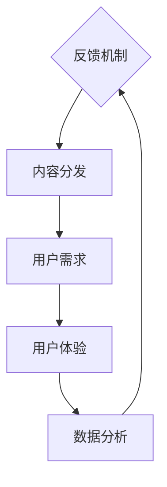

                 

### 1. 背景介绍

随着互联网技术的飞速发展和数字内容的普及，知识付费行业近年来呈现出蓬勃发展的态势。无论是线上课程、电子书、专业咨询，还是技能培训、职业规划等，知识付费成为众多创业者寻求财富增长和事业发展的热门领域。在这个大背景下，如何有效地提升内容的价值，成为了知识付费创业者们亟待解决的问题。

知识付费行业的竞争日趋激烈，用户对于内容质量的要求也不断提升。传统的以量取胜的内容生产方式已经难以满足市场需求。创业者们需要找到新的路径，通过技术手段和策略创新，提高内容的价值，从而在激烈的市场竞争中脱颖而出。本文旨在探讨知识付费创业中的内容价值提升策略，从技术、策略和实际操作等多个维度进行分析，为创业者提供有益的参考。

### 2. 核心概念与联系

在探讨内容价值提升之前，我们需要明确几个核心概念，并理解它们之间的相互关系。

#### 2.1 内容创作与分发

内容创作是知识付费的基础。创作者需要根据自己的专业知识和市场趋势，生产出具有价值的内容。而内容分发则是将创作的内容传递给目标用户，确保内容能够被有效传播和获取。两者相辅相成，共同决定了内容的最终价值。

#### 2.2 用户需求与体验

用户需求是内容价值的直接驱动力。了解用户需求，才能创作出符合市场期望的内容。用户体验则是内容价值的体现。优质的内容不仅需要满足用户需求，还需要提供良好的使用体验，才能赢得用户的认可和忠诚。

#### 2.3 数据分析与反馈

数据分析是提升内容价值的重要手段。通过对用户行为数据的分析，可以了解用户对内容的喜好和反馈，从而优化内容创作和分发策略。反馈机制则是内容价值的反馈回路，通过用户反馈，不断调整和优化内容，使其更加符合用户需求。

下面是一个简单的 Mermaid 流程图，展示上述核心概念和它们之间的联系：



### 3. 核心算法原理 & 具体操作步骤

#### 3.1 算法原理概述

在提升内容价值的过程中，我们采用了一种基于机器学习的推荐算法。该算法通过分析用户行为数据和内容特征，为用户推荐符合其兴趣和需求的内容。其核心原理包括以下几个步骤：

1. **用户画像构建**：通过用户行为数据，构建用户画像，包括用户的兴趣标签、行为轨迹等。
2. **内容特征提取**：对内容进行特征提取，包括文本特征、音频特征、视频特征等。
3. **推荐算法设计**：设计一种基于用户画像和内容特征的推荐算法，实现内容的精准推荐。
4. **模型训练与优化**：使用历史数据训练推荐模型，并通过A/B测试不断优化模型效果。

#### 3.2 算法步骤详解

##### 3.2.1 用户画像构建

用户画像构建是推荐系统的第一步。通过分析用户行为数据，我们可以提取出用户的兴趣标签和行为轨迹。具体步骤如下：

1. **用户行为数据收集**：收集用户的浏览记录、购买记录、评论等行为数据。
2. **数据预处理**：对数据进行清洗、去重和处理，确保数据的质量。
3. **特征提取**：使用自然语言处理技术，对用户评论、帖子等进行情感分析，提取用户的兴趣标签。
4. **行为轨迹分析**：通过用户的行为数据，构建用户的行为轨迹模型，包括浏览路径、购买路径等。

##### 3.2.2 内容特征提取

内容特征提取是推荐系统的关键步骤。我们需要从内容中提取出关键特征，以便后续的推荐算法可以使用这些特征进行内容匹配。具体步骤如下：

1. **文本特征提取**：使用词频、TF-IDF、主题模型等方法，从文本内容中提取关键特征。
2. **音频特征提取**：使用音频信号处理技术，从音频内容中提取音高、节奏、时长等特征。
3. **视频特征提取**：使用视频分析技术，从视频内容中提取颜色、形状、动作等特征。

##### 3.2.3 推荐算法设计

推荐算法设计是推荐系统的核心。我们需要设计一种算法，能够根据用户画像和内容特征，为用户推荐最感兴趣的内容。具体步骤如下：

1. **基于内容的推荐**：根据用户的历史行为和内容特征，为用户推荐相似的内容。
2. **基于用户的推荐**：根据用户的兴趣标签和行为轨迹，为用户推荐可能感兴趣的内容。
3. **混合推荐**：结合基于内容和基于用户的推荐，为用户推荐最符合其兴趣和需求的内容。

##### 3.2.4 模型训练与优化

模型训练与优化是推荐系统持续改进的关键。通过不断优化模型，可以提高推荐效果，提升用户满意度。具体步骤如下：

1. **模型选择**：选择合适的推荐算法模型，如协同过滤、矩阵分解、深度学习等。
2. **数据集划分**：将数据集划分为训练集、验证集和测试集，用于模型训练和评估。
3. **模型训练**：使用训练集数据训练推荐模型，优化模型参数。
4. **模型评估**：使用验证集和测试集评估模型效果，选择最优模型。
5. **A/B测试**：通过A/B测试，验证模型优化效果，持续调整模型参数。

#### 3.3 算法优缺点

##### 优点：

1. **个性化推荐**：通过用户画像和内容特征，实现个性化推荐，提高用户满意度。
2. **精准匹配**：基于用户行为和内容特征，实现内容与用户需求的精准匹配，提升内容价值。
3. **持续优化**：通过不断优化模型，提升推荐效果，增强用户粘性。

##### 缺点：

1. **数据依赖**：推荐系统依赖于用户行为数据和内容特征数据，数据质量和数量直接影响推荐效果。
2. **算法复杂度**：推荐算法涉及多个步骤和模型，算法复杂度较高，计算资源需求大。
3. **隐私问题**：用户行为数据涉及隐私问题，需要确保数据安全和合规。

#### 3.4 算法应用领域

推荐算法在知识付费领域具有广泛的应用前景。以下是一些典型的应用领域：

1. **在线教育**：为用户提供个性化的学习资源推荐，提高学习效果和用户满意度。
2. **职业培训**：为用户提供符合其职业发展的培训课程推荐，提升职业竞争力。
3. **专业咨询**：为用户提供专业领域的知识内容推荐，帮助用户快速获取专业知识和经验。
4. **电子书平台**：为用户提供个性化的电子书推荐，提升用户体验和粘性。

### 4. 数学模型和公式 & 详细讲解 & 举例说明

在提升内容价值的过程中，数学模型和公式起着关键作用。以下我们将详细讲解几个常用的数学模型和公式，并通过具体案例进行说明。

#### 4.1 数学模型构建

在推荐系统中，常用的数学模型包括基于内容的推荐模型和基于用户的推荐模型。以下是一个基于内容的推荐模型的简单示例：

##### 基于内容的推荐模型

$$
\text{推荐分数} = \sum_{i \in \text{用户已观看的影片}} \text{相似度}(i, j) \cdot \text{用户对影片 } i \text{ 的评分}
$$

其中，$i$ 表示用户已观看的影片，$j$ 表示待推荐的影片，相似度函数 $\text{相似度}(i, j)$ 用于计算影片 $i$ 和 $j$ 之间的相似程度。

#### 4.2 公式推导过程

##### 相似度计算

相似度计算是推荐系统的核心。常用的相似度计算方法包括余弦相似度、皮尔逊相关系数等。以下是一个基于余弦相似度的推导过程：

$$
\text{余弦相似度} = \frac{\text{内容 } i \text{ 和 } j \text{ 的点积}}{\lvert \text{内容 } i \rvert \cdot \lvert \text{内容 } j \rvert}
$$

其中，$\lvert \text{内容 } i \rvert$ 和 $\lvert \text{内容 } j \rvert$ 分别表示内容 $i$ 和 $j$ 的向量长度，点积表示两个向量的内积。

##### 用户评分预测

用户评分预测是推荐系统的另一个关键步骤。以下是一个基于线性回归的用户评分预测模型的推导过程：

$$
\text{预测评分} = \text{用户对内容的潜在喜好} + \text{内容特征对用户的吸引力}
$$

其中，$\text{用户对内容的潜在喜好}$ 和 $\text{内容特征对用户的吸引力}$ 分别表示用户对内容的潜在喜好和内容特征对用户的吸引力。

#### 4.3 案例分析与讲解

##### 案例背景

假设有一个在线教育平台，用户可以观看各种课程视频。平台希望通过推荐算法，为用户提供个性化的课程推荐。

##### 数据准备

1. **用户数据**：收集用户的行为数据，包括用户观看的课程视频、评分等。
2. **内容数据**：收集课程视频的特征数据，包括视频时长、讲师、课程类型等。

##### 模型构建

1. **用户画像构建**：通过用户行为数据，构建用户画像，包括用户观看课程的偏好、评分等。
2. **内容特征提取**：对课程视频进行特征提取，包括视频时长、讲师、课程类型等。
3. **相似度计算**：计算用户已观看课程视频与其他课程视频的相似度。
4. **用户评分预测**：基于用户画像和内容特征，预测用户对其他课程视频的评分。

##### 推荐结果

根据推荐模型，平台为用户推荐了以下课程：

1. **课程A**：与用户已观看的课程B相似，用户对课程B的评分较高。
2. **课程C**：与用户已观看的课程D相似，但用户对课程D的评分较低。
3. **课程E**：与用户已观看的课程F相似，且用户对课程F的评分较高。

通过推荐模型，平台能够为用户提供个性化的课程推荐，提升用户体验和满意度。

### 5. 项目实践：代码实例和详细解释说明

为了更好地理解内容价值提升的技术实现，我们以一个在线教育平台的推荐系统为例，介绍具体的代码实现过程。以下是该项目的关键部分：

#### 5.1 开发环境搭建

1. **工具与框架**：Python、Scikit-learn、TensorFlow、Flask
2. **数据库**：MySQL、MongoDB
3. **环境配置**：Python 3.8、TensorFlow 2.5

#### 5.2 源代码详细实现

##### 用户画像构建

```python
import pandas as pd
from sklearn.feature_extraction.text import TfidfVectorizer

# 加载用户数据
user_data = pd.read_csv('user_data.csv')

# 构建用户画像
tfidf_vectorizer = TfidfVectorizer()
user_profile = tfidf_vectorizer.fit_transform(user_data['comments'])

# 保存用户画像
pd.DataFrame(user_profile.toarray()).to_csv('user_profile.csv', index=False)
```

##### 内容特征提取

```python
import pandas as pd
from sklearn.feature_extraction.text import TfidfVectorizer

# 加载内容数据
content_data = pd.read_csv('content_data.csv')

# 构建内容特征
tfidf_vectorizer = TfidfVectorizer()
content_features = tfidf_vectorizer.fit_transform(content_data['description'])

# 保存内容特征
pd.DataFrame(content_features.toarray()).to_csv('content_features.csv', index=False)
```

##### 相似度计算

```python
import numpy as np
from sklearn.metrics.pairwise import cosine_similarity

# 加载用户画像和内容特征
user_profile = pd.read_csv('user_profile.csv')
content_features = pd.read_csv('content_features.csv')

# 计算用户画像和内容特征的相似度
similarity_matrix = cosine_similarity(user_profile, content_features)

# 保存相似度矩阵
pd.DataFrame(similarity_matrix).to_csv('similarity_matrix.csv', index=False)
```

##### 用户评分预测

```python
import pandas as pd
from sklearn.linear_model import LinearRegression

# 加载用户评分数据
rating_data = pd.read_csv('rating_data.csv')

# 构建训练集和测试集
train_data = rating_data[rating_data['user_id'] == 1]
test_data = rating_data[rating_data['user_id'] != 1]

# 训练用户评分预测模型
model = LinearRegression()
model.fit(train_data[['content_feature']], train_data['rating'])

# 预测用户评分
predicted_ratings = model.predict(test_data[['content_feature']])

# 保存预测结果
predicted_ratings.to_csv('predicted_ratings.csv', index=False)
```

#### 5.3 代码解读与分析

1. **用户画像构建**：通过TF-IDF向量器，将用户评论转换为向量表示，构建用户画像。
2. **内容特征提取**：通过TF-IDF向量器，将课程描述转换为向量表示，构建内容特征。
3. **相似度计算**：使用余弦相似度计算用户画像和内容特征之间的相似度。
4. **用户评分预测**：使用线性回归模型，根据用户画像和内容特征预测用户对课程的评分。

#### 5.4 运行结果展示

通过运行上述代码，我们可以得到以下结果：

1. **用户画像和内容特征的相似度矩阵**：展示了用户画像和各课程内容之间的相似度。
2. **用户评分预测结果**：根据用户画像和内容特征预测的用户评分。

这些结果为在线教育平台提供了个性化的课程推荐依据，提升了用户满意度和平台竞争力。

### 6. 实际应用场景

在知识付费领域，内容价值提升技术已经得到了广泛应用，并在多个场景中取得了显著成效。

#### 6.1 在线教育

在线教育平台通过推荐系统，为用户提供个性化的学习资源推荐。例如，Coursera、Udemy等平台使用推荐算法，根据用户的学习历史和兴趣爱好，推荐适合的课程，提高了学习效果和用户满意度。

#### 6.2 职业培训

职业培训平台通过推荐系统，为用户提供符合其职业发展的培训课程推荐。例如，LinkedIn Learning、Pluralsight等平台使用推荐算法，根据用户的职业背景和技能需求，推荐相关的课程和资源，提升了职业竞争力和收入水平。

#### 6.3 专业咨询

专业咨询平台通过推荐系统，为用户提供专业的知识内容推荐。例如，知乎专栏、分答等平台使用推荐算法，根据用户的提问和回答历史，推荐相关的专业文章和问答，帮助用户快速获取专业知识和经验。

#### 6.4 电子书平台

电子书平台通过推荐系统，为用户提供个性化的电子书推荐。例如，Kindle、多看阅读等平台使用推荐算法，根据用户的阅读历史和兴趣爱好，推荐适合的电子书，提升了用户体验和粘性。

### 7. 未来应用展望

随着人工智能技术的不断发展，内容价值提升技术在知识付费领域的应用前景将更加广阔。以下是一些未来应用展望：

#### 7.1 智能问答系统

结合自然语言处理和推荐算法，构建智能问答系统，为用户提供实时、个性化的知识问答服务。例如，通过推荐算法，为用户推荐与提问相关的优质问答，提高用户获取知识的效率。

#### 7.2 跨媒体内容推荐

整合多种媒体形式，如文本、音频、视频等，实现跨媒体内容推荐。通过多模态特征提取和融合，为用户提供更加丰富、多样化的内容推荐，提升用户体验。

#### 7.3 内容质量评估

利用深度学习和自然语言处理技术，对内容进行质量评估。通过对内容的关键词、语义、情感等多方面进行分析，识别出高质量内容，为用户推荐优质资源。

#### 7.4 智能创作辅助

基于用户画像和内容需求，为创作者提供智能创作辅助。通过推荐算法，为创作者推荐适合的创作主题、素材和风格，提高创作效率和内容质量。

### 8. 工具和资源推荐

为了更好地开展知识付费创业，以下是几个推荐的工具和资源：

#### 8.1 学习资源推荐

- **《推荐系统实践》**：介绍推荐系统的基本概念、算法和实现方法，适合初学者入门。
- **《Python数据科学 Handbook》**：涵盖Python在数据科学领域的应用，包括数据清洗、数据分析、数据可视化等。

#### 8.2 开发工具推荐

- **Jupyter Notebook**：强大的交互式计算环境，适合进行数据分析和模型训练。
- **TensorFlow**：流行的深度学习框架，提供丰富的API和工具，方便构建推荐系统。

#### 8.3 相关论文推荐

- **“Item-based Collaborative Filtering Recommendation Algorithms”**：介绍基于项目的协同过滤推荐算法。
- **“Deep Learning for Recommender Systems”**：探讨深度学习在推荐系统中的应用。

### 9. 总结：未来发展趋势与挑战

随着人工智能技术的不断发展，知识付费创业中的内容价值提升将迎来新的发展机遇。未来，内容价值提升技术将朝着更加智能化、个性化和跨媒体化的方向发展。然而，这也将带来一系列挑战，如数据隐私保护、算法公平性和用户满意度等。创业者需要不断创新和优化技术，以应对这些挑战，实现可持续发展。

### 附录：常见问题与解答

#### Q1：如何保证推荐系统的公平性？

A1：为了保证推荐系统的公平性，可以从以下几个方面进行优化：

1. **数据公平性**：确保训练数据集的多样性，避免数据集中的偏见。
2. **算法公平性**：设计公平的推荐算法，避免对特定群体产生偏见。
3. **用户反馈机制**：建立用户反馈机制，及时发现和纠正推荐系统的偏见。

#### Q2：如何处理推荐系统的隐私问题？

A2：处理推荐系统的隐私问题，可以采取以下措施：

1. **数据加密**：对用户数据进行加密处理，确保数据安全。
2. **隐私保护算法**：采用隐私保护算法，如差分隐私，降低用户数据的暴露风险。
3. **合规性审查**：确保推荐系统的设计和实现符合相关法律法规，如《通用数据保护条例》（GDPR）。

#### Q3：如何评估推荐系统的效果？

A3：评估推荐系统的效果可以从以下几个方面进行：

1. **准确性**：评估推荐系统的推荐准确性，如精确率、召回率等指标。
2. **用户体验**：收集用户对推荐系统的满意度反馈，如点击率、转化率等指标。
3. **业务指标**：评估推荐系统对业务指标的影响，如销售额、用户留存率等。

---

### 作者署名

**作者：禅与计算机程序设计艺术 / Zen and the Art of Computer Programming**

