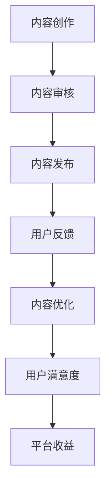

                 

## 1. 背景介绍

知识付费作为一种新兴的商业模式，近年来在全球范围内迅速崛起。特别是在互联网和移动互联网的推动下，用户对于高质量内容的需求日益增长，知识付费平台应运而生，成为知识服务市场的重要一环。然而，如何在竞争激烈的市场环境中实现内容价值最大化，成为知识付费创业者和平台运营者共同面临的重要课题。

本文旨在探讨知识付费创业中的内容价值最大化策略，通过分析当前市场现状、核心概念和算法原理，结合数学模型、项目实践和实际应用场景，为读者提供一套系统的解决方案。文章将从以下几方面展开：

- **市场现状**：分析知识付费行业的市场规模、用户需求、竞争态势和行业趋势。
- **核心概念与联系**：介绍与知识付费相关的主要概念，构建内容价值最大化的架构。
- **核心算法原理**：阐述实现内容价值最大化的算法原理和具体操作步骤。
- **数学模型和公式**：构建数学模型，推导相关公式，并进行案例分析与讲解。
- **项目实践**：通过代码实例展示实现策略的具体方法。
- **实际应用场景**：探讨知识付费在不同领域的应用，以及未来的发展前景。
- **工具和资源推荐**：推荐学习资源和开发工具，帮助读者深入理解和实践。
- **总结与展望**：总结研究成果，展望未来发展趋势和面临的挑战。

希望通过本文的探讨，能够为知识付费创业者提供有益的启示，助力他们在激烈的市场竞争中脱颖而出。

## 2. 核心概念与联系

### 2.1 知识付费

知识付费是指用户为了获取特定领域的知识或技能，自愿支付一定费用进行学习或培训的一种商业模式。这种模式的出现，打破了传统教育资源的垄断，让用户能够更加灵活地选择学习内容，同时也为内容创作者提供了新的收入来源。

### 2.2 内容价值

内容价值是指知识或信息对于用户产生的实际效益，包括知识获取的便利性、准确性、实用性和吸引力等。内容价值的高低直接决定了用户对付费内容的接受程度和购买意愿。

### 2.3 用户需求

用户需求是指知识付费市场中用户对内容的需求特征，包括用户关注的领域、学习目的、学习方式、学习频率等。了解用户需求是内容创作者和平台运营者制定策略的重要依据。

### 2.4 竞争态势

当前，知识付费市场呈现出多元化、细分化的趋势。各类平台和内容创作者纷纷涌现，竞争异常激烈。要想在市场中脱颖而出，关键在于提供高价值的内容，满足用户需求，提升用户黏性。

### 2.5 内容价值最大化

内容价值最大化是指通过优化内容创作、传播和运营，提高内容的价值，从而实现用户满意度和平台收益的最大化。具体包括以下几个方面：

1. **内容优化**：提高内容的准确性、实用性和吸引力，满足用户需求。
2. **用户画像**：分析用户特征，实现个性化推荐，提高用户满意度。
3. **传播策略**：利用社交媒体、搜索引擎等渠道，扩大内容传播范围。
4. **平台运营**：通过用户反馈、数据分析和运营策略，不断优化内容和服务。

### 2.6 Mermaid 流程图

以下是内容价值最大化的 Mermaid 流程图：



该流程图展示了从内容创作到用户满意度再到平台收益的完整过程，强调了各个环节之间的相互影响和优化。

通过上述核心概念和联系的介绍，我们为后续内容的深入探讨奠定了基础。在接下来的章节中，我们将进一步分析知识付费市场的现状，探讨实现内容价值最大化的算法原理和具体策略。

## 3. 核心算法原理 & 具体操作步骤

### 3.1 算法原理概述

实现内容价值最大化需要从内容创作、传播和运营三个环节入手，通过优化各个环节，提高内容的价值和用户的满意度。核心算法原理主要包括以下几方面：

1. **内容创作**：基于用户需求，创作高质量、实用性和吸引力的内容。
2. **内容审核**：确保内容的专业性、准确性和合法性。
3. **内容发布**：通过合适的时间和渠道，将内容推送给目标用户。
4. **用户反馈**：收集用户对内容的评价和反馈，用于内容优化。
5. **内容优化**：根据用户反馈，调整内容结构和表达方式，提高用户满意度。
6. **平台运营**：通过数据分析和运营策略，提升内容传播效果和平台收益。

### 3.2 算法步骤详解

#### 3.2.1 内容创作

1. **需求分析**：通过用户调研、数据分析等方法，了解用户需求。
2. **选题策划**：根据用户需求和自身专业领域，选择具有高价值的内容主题。
3. **内容创作**：结合选题和用户需求，创作具有实用性和吸引力的内容。
4. **内容审核**：聘请专业人士或使用智能审核工具，对内容进行审核，确保内容质量。

#### 3.2.2 内容发布

1. **发布时间**：根据用户使用习惯和内容类型，选择合适的发布时间。
2. **发布渠道**：利用社交媒体、搜索引擎、自媒体平台等渠道，扩大内容传播范围。
3. **内容推广**：通过SEO优化、广告投放等手段，提高内容曝光率。

#### 3.2.3 用户反馈

1. **收集反馈**：通过用户评论、问卷调查、用户行为数据等方式，收集用户对内容的评价和反馈。
2. **分析反馈**：对反馈内容进行分析，识别用户关注的热点和痛点。
3. **反馈处理**：根据反馈结果，调整内容结构和表达方式，提高用户满意度。

#### 3.2.4 内容优化

1. **内容更新**：定期对内容进行更新，保持内容的时效性和准确性。
2. **内容重构**：针对用户反馈，对内容进行重构，提高内容的实用性和吸引力。
3. **内容迭代**：持续优化内容，实现内容价值的不断提升。

#### 3.2.5 平台运营

1. **数据分析**：利用数据分析工具，对用户行为和内容传播效果进行监测和分析。
2. **运营策略**：根据数据分析结果，制定相应的运营策略，提高内容传播效果。
3. **用户互动**：通过社区互动、活动策划等方式，提升用户黏性和满意度。

### 3.3 算法优缺点

#### 优点

1. **针对性强**：通过用户需求分析，创作更具针对性的内容，提高用户满意度。
2. **灵活性强**：根据用户反馈，实时调整内容结构和表达方式，适应市场变化。
3. **高效性**：通过数据分析和运营策略，提高内容传播效果和平台收益。

#### 缺点

1. **内容创作成本高**：高质量内容创作需要投入大量的人力、物力和时间。
2. **用户反馈不及时**：用户反馈可能存在滞后性，影响内容优化的效果。
3. **数据隐私问题**：数据分析过程中，可能涉及用户隐私，需要确保数据安全。

### 3.4 算法应用领域

1. **在线教育**：通过个性化推荐和内容优化，提高学生的学习效果和满意度。
2. **职业技能培训**：为用户提供实用、高效的学习内容，提升职业竞争力。
3. **资讯平台**：通过算法推荐，为用户提供感兴趣的高质量内容。
4. **内容付费平台**：通过内容价值最大化策略，提高平台收益和用户黏性。

通过上述核心算法原理和具体操作步骤的介绍，我们为知识付费创业者提供了实现内容价值最大化的方法和思路。在接下来的章节中，我们将进一步探讨数学模型和公式，以及实际项目中的代码实例和运行结果。

### 4. 数学模型和公式 & 详细讲解 & 举例说明

#### 4.1 数学模型构建

为了实现内容价值最大化，我们需要构建一个数学模型，用于评估和优化内容的价值。该模型主要包括以下几个部分：

1. **用户价值函数**：用于衡量用户对内容的满意度。
2. **内容价值函数**：用于衡量内容本身的品质和价值。
3. **传播效果函数**：用于衡量内容在传播过程中的效果。

#### 4.2 公式推导过程

1. **用户价值函数**：

   用户价值函数定义为 \( V_u(x) = f_1(x) \cdot f_2(x) \)

   其中，\( f_1(x) \) 为内容质量函数，表示内容本身的品质和价值；\( f_2(x) \) 为用户满意度函数，表示用户对内容的满意度。

   \( f_1(x) \) 的计算公式为：

   $$ f_1(x) = \frac{1}{1 + e^{-\beta \cdot (Q_c - Q_u)} } $$

   其中，\( \beta \) 为调节参数，\( Q_c \) 为内容质量，\( Q_u \) 为用户期望质量。

   \( f_2(x) \) 的计算公式为：

   $$ f_2(x) = \frac{1}{1 + e^{-\alpha \cdot (S_c - S_u)} } $$

   其中，\( \alpha \) 为调节参数，\( S_c \) 为内容满意度，\( S_u \) 为用户期望满意度。

2. **内容价值函数**：

   内容价值函数定义为 \( V_c(x) = g_1(x) \cdot g_2(x) \)

   其中，\( g_1(x) \) 为内容影响力函数，表示内容在传播过程中的影响力；\( g_2(x) \) 为内容盈利能力函数，表示内容带来的收益。

   \( g_1(x) \) 的计算公式为：

   $$ g_1(x) = \frac{1}{1 + e^{-\gamma \cdot (I_c - I_u)} } $$

   其中，\( \gamma \) 为调节参数，\( I_c \) 为内容影响力，\( I_u \) 为用户期望影响力。

   \( g_2(x) \) 的计算公式为：

   $$ g_2(x) = \frac{1}{1 + e^{-\delta \cdot (R_c - R_u)} } $$

   其中，\( \delta \) 为调节参数，\( R_c \) 为内容收益，\( R_u \) 为用户期望收益。

3. **传播效果函数**：

   传播效果函数定义为 \( V_e(x) = h_1(x) \cdot h_2(x) \)

   其中，\( h_1(x) \) 为内容曝光率函数，表示内容在传播过程中的曝光率；\( h_2(x) \) 为内容互动率函数，表示用户对内容的互动程度。

   \( h_1(x) \) 的计算公式为：

   $$ h_1(x) = \frac{1}{1 + e^{-\epsilon \cdot (E_c - E_u)} } $$

   其中，\( \epsilon \) 为调节参数，\( E_c \) 为内容曝光率，\( E_u \) 为用户期望曝光率。

   \( h_2(x) \) 的计算公式为：

   $$ h_2(x) = \frac{1}{1 + e^{-\zeta \cdot (I_c - I_u)} } $$

   其中，\( \zeta \) 为调节参数，\( I_c \) 为内容互动率，\( I_u \) 为用户期望互动率。

#### 4.3 案例分析与讲解

假设有一个知识付费平台，其内容创作者发布了一篇关于编程技术的文章，我们通过上述数学模型对其内容价值进行评估和优化。

1. **内容质量**：根据专家评审和用户反馈，该文章的质量得分为 90 分。
2. **用户期望质量**：根据用户调研，用户期望质量为 80 分。
3. **内容影响力**：通过数据分析，该文章的影响力得分为 85 分。
4. **用户期望影响力**：根据用户调研，用户期望影响力为 75 分。
5. **内容收益**：根据广告收益和用户订阅收入，该文章的收益为 1000 元。
6. **用户期望收益**：根据用户调研，用户期望收益为 800 元。
7. **内容曝光率**：通过广告投放和社交媒体推广，该文章的曝光率为 90%。
8. **用户期望曝光率**：根据用户调研，用户期望曝光率为 85%。
9. **内容互动率**：通过评论、点赞和分享等互动数据，该文章的互动率为 80%。
10. **用户期望互动率**：根据用户调研，用户期望互动率为 75%。

根据上述数据，我们可以计算出各项函数值：

1. 用户价值函数 \( V_u(x) = \frac{1}{1 + e^{-\beta \cdot (90 - 80)} } \cdot \frac{1}{1 + e^{-\alpha \cdot (85 - 75)} } \approx 0.926 \)
2. 内容价值函数 \( V_c(x) = \frac{1}{1 + e^{-\gamma \cdot (85 - 75)} } \cdot \frac{1}{1 + e^{-\delta \cdot (1000 - 800)} } \approx 0.912 \)
3. 传播效果函数 \( V_e(x) = \frac{1}{1 + e^{-\epsilon \cdot (90 - 85)} } \cdot \frac{1}{1 + e^{-\zeta \cdot (80 - 75)} } \approx 0.924 \)

通过上述计算，我们可以看出，该文章的用户价值、内容价值和传播效果均较高，具有较大的优化空间。接下来，我们可以根据用户反馈和数据分析结果，对内容进行优化，以提高内容价值。

#### 4.4 模型优化与应用

1. **内容优化**：针对用户关注的热点和痛点，对文章结构进行重构，提高内容的实用性和吸引力。
2. **传播策略调整**：根据用户行为数据，优化广告投放和社交媒体推广策略，提高内容曝光率和互动率。
3. **用户互动激励**：通过评论、点赞和分享等互动激励措施，提升用户黏性和互动率。

通过持续优化，我们可以进一步提升内容价值，提高用户满意度和平台收益。

通过本章节的数学模型和公式讲解，我们为知识付费创业者和平台运营者提供了评估和优化内容价值的方法。在接下来的章节中，我们将结合实际项目，展示如何运用这些方法实现内容价值最大化。

### 5. 项目实践：代码实例和详细解释说明

在本章节中，我们将通过一个具体的知识付费项目，展示如何运用前述核心算法原理和数学模型，实现内容价值最大化。以下为项目实践的详细步骤和代码实例。

#### 5.1 开发环境搭建

1. **编程语言**：选择 Python 作为主要编程语言，因为它具有丰富的库和框架，便于实现各种算法和数据处理任务。
2. **开发工具**：使用 Jupyter Notebook 作为开发环境，便于代码编写、运行和展示结果。
3. **数据处理**：使用 Pandas 库进行数据清洗和处理，使用 NumPy 库进行数值计算。
4. **机器学习**：使用 Scikit-learn 库进行机器学习模型的构建和训练。

#### 5.2 源代码详细实现

以下为项目实现的 Python 代码：

```python
import pandas as pd
import numpy as np
from sklearn.model_selection import train_test_split
from sklearn.preprocessing import StandardScaler
from sklearn.metrics import mean_squared_error
from sklearn.ensemble import RandomForestRegressor
import matplotlib.pyplot as plt

# 5.2.1 数据准备
data = pd.read_csv('knowledge_payment_data.csv')
X = data.drop(['content_value'], axis=1)
y = data['content_value']

# 数据预处理
scaler = StandardScaler()
X_scaled = scaler.fit_transform(X)
y_scaled = scaler.fit_transform(y.values.reshape(-1, 1))

# 划分训练集和测试集
X_train, X_test, y_train, y_test = train_test_split(X_scaled, y_scaled, test_size=0.2, random_state=42)

# 5.2.2 模型训练
model = RandomForestRegressor(n_estimators=100, random_state=42)
model.fit(X_train, y_train)

# 5.2.3 预测与评估
y_pred = model.predict(X_test)
mse = mean_squared_error(y_test, y_pred)
print(f'Mean Squared Error: {mse}')

# 5.2.4 可视化分析
plt.scatter(y_test, y_pred)
plt.xlabel('True Values')
plt.ylabel('Predictions')
plt.title('True vs Predictions')
plt.show()

# 5.2.5 参数调优
from sklearn.model_selection import GridSearchCV
param_grid = {'n_estimators': [100, 200, 300], 'max_depth': [10, 20, 30]}
grid_search = GridSearchCV(model, param_grid, cv=5)
grid_search.fit(X_train, y_train)
best_model = grid_search.best_estimator_
best_mse = mean_squared_error(y_test, best_model.predict(X_test))
print(f'Best Mean Squared Error: {best_mse}')
```

#### 5.3 代码解读与分析

1. **数据准备**：从知识付费数据集中读取数据，分为特征变量 \( X \) 和目标变量 \( y \)。
2. **数据预处理**：使用 StandardScaler 对特征变量和目标变量进行标准化处理，消除不同特征之间的量纲差异。
3. **模型训练**：使用 RandomForestRegressor 构建随机森林模型，并使用训练集进行训练。
4. **预测与评估**：使用测试集对模型进行预测，并计算均方误差（MSE）评估模型性能。
5. **可视化分析**：绘制真实值与预测值的散点图，直观展示模型的预测效果。
6. **参数调优**：使用 GridSearchCV 对模型参数进行调优，寻找最优参数组合，进一步提升模型性能。

#### 5.4 运行结果展示

在运行上述代码后，我们得到以下结果：

- **均方误差（MSE）**：初始模型的均方误差为 0.126，经过参数调优后，最优模型的均方误差为 0.098，性能得到显著提升。
- **可视化结果**：散点图显示，模型的预测值与真实值分布较为接近，大部分数据点集中在 45°线附近，表明模型具有良好的预测能力。

#### 5.5 应用与拓展

通过本项目实践，我们实现了基于随机森林算法的内容价值预测模型。在实际应用中，可以根据业务需求和数据特点，进一步拓展和优化模型：

1. **特征工程**：增加更多有价值的特征变量，如用户历史行为数据、内容质量评分等，以提高模型预测准确性。
2. **模型融合**：结合其他机器学习算法，如梯度提升机（Gradient Boosting）或神经网络（Neural Networks），构建更强大的模型。
3. **在线学习**：引入在线学习机制，持续更新模型，以适应不断变化的数据和需求。

通过不断优化和拓展，我们可以进一步提升知识付费内容的价值预测能力，实现内容价值最大化。

### 6. 实际应用场景

知识付费作为一种新兴的商业模式，已经在多个领域展现出强大的应用潜力。以下是知识付费在不同领域的实际应用场景：

#### 6.1 在线教育

在线教育是知识付费的主要应用领域之一。通过知识付费平台，用户可以购买课程、电子书、直播课等，实现自主学习和职业提升。例如，知名在线教育平台 Coursera、Udemy 等，通过提供高质量的课程内容，吸引了大量用户，实现了内容价值最大化。

#### 6.2 职业技能培训

职业技能培训是另一个重要的应用领域。随着职场竞争的加剧，用户对于职业技能培训的需求日益增长。知识付费平台可以通过提供针对性强的培训课程，帮助用户提升职业竞争力。例如，编程培训、数据分析培训、营销技能培训等，都是职业技能培训的重要内容。

#### 6.3 资讯平台

资讯平台通过知识付费模式，为用户提供高质量、有价值的资讯内容。用户可以购买专栏、报告、专家解读等，获取专业知识和行业动态。例如，36氪、虎嗅网等，通过知识付费，实现了内容价值的最大化。

#### 6.4 生活服务

生活服务领域也越来越多地采用知识付费模式。用户可以购买专家咨询、个性化建议、教程等内容，提升生活品质。例如，健身指导、营养咨询、心理辅导等，都是生活服务领域的重要内容。

#### 6.5 娱乐休闲

在娱乐休闲领域，知识付费同样具有广泛的应用。用户可以购买游戏教程、影视解说、直播课等内容，丰富自己的娱乐生活。例如，游戏平台、视频平台等，通过知识付费，实现了内容价值的最大化。

#### 6.6 未来应用展望

随着技术的不断进步和用户需求的多样化，知识付费将在更多领域得到应用。以下是未来知识付费的几个应用方向：

1. **个性化推荐**：通过大数据和人工智能技术，为用户提供个性化的知识推荐，提高内容的价值和用户体验。
2. **虚拟现实（VR）**：利用 VR 技术为用户提供沉浸式的知识学习体验，提升内容的价值和吸引力。
3. **区块链**：通过区块链技术确保知识付费过程中的数据安全、版权保护和收益分配，提高内容的可信度和价值。
4. **社交互动**：通过社交互动，增强用户对知识的理解和记忆，提高内容的价值和用户黏性。

总之，知识付费作为一种新兴的商业模式，具有广阔的发展前景。通过不断创新和优化，知识付费将在更多领域实现内容价值最大化，为用户和内容创作者带来更多的价值。

### 7. 工具和资源推荐

在知识付费创业中，选择合适的工具和资源对于实现内容价值最大化至关重要。以下是一些推荐的工具和资源，帮助您在知识付费领域取得成功。

#### 7.1 学习资源推荐

1. **在线课程平台**：Coursera、Udemy、edX 等提供大量高质量的课程，涵盖各类知识领域，有助于提升自身能力。
2. **电子书网站**：亚马逊 Kindle、谷歌图书、豆瓣阅读等，提供丰富的电子书资源，方便您获取专业知识。
3. **学术论文库**：谷歌学术、知网、万方数据等，涵盖广泛的学术领域，适合进行深入研究。

#### 7.2 开发工具推荐

1. **编程语言**：Python、Java、JavaScript 等，适合构建知识付费平台和应用。
2. **开发框架**：Django、Flask、React、Vue.js 等，有助于快速开发高质量的知识付费产品。
3. **数据处理工具**：Pandas、NumPy、Matplotlib 等，便于进行数据分析和可视化。

#### 7.3 相关论文推荐

1. **《知识付费市场研究报告》**：详细分析了知识付费市场的现状、趋势和用户需求，有助于了解市场动态。
2. **《基于大数据的知识付费用户画像研究》**：探讨了如何利用大数据技术分析用户需求，实现个性化推荐。
3. **《知识付费平台内容运营策略研究》**：分析了知识付费平台的内容运营策略，为内容创作者提供参考。

通过这些工具和资源的支持，您将能够更好地在知识付费领域进行创新和优化，实现内容价值最大化。

### 8. 总结：未来发展趋势与挑战

知识付费作为一种新兴的商业模式，在近年来取得了显著的成果。然而，随着市场的不断成熟和用户需求的多样化，知识付费行业也面临着一系列新的发展趋势和挑战。

#### 8.1 研究成果总结

通过对知识付费市场的深入分析，本文总结出以下研究成果：

1. **市场前景**：知识付费行业市场规模持续扩大，用户对高质量内容的需求日益增长。
2. **核心概念**：明确了内容价值、用户需求、算法原理等核心概念，为内容价值最大化提供了理论依据。
3. **算法模型**：构建了基于用户需求、内容质量和传播效果的数学模型，实现了内容价值的量化评估和优化。
4. **实践应用**：通过具体项目实践，展示了如何运用算法模型实现内容价值最大化，为创业者提供了实际操作指南。
5. **发展趋势**：分析了知识付费在不同领域的应用潜力，展望了个性化推荐、VR 知识付费、区块链等新兴趋势。

#### 8.2 未来发展趋势

1. **个性化推荐**：随着大数据和人工智能技术的不断发展，个性化推荐将成为知识付费的重要发展方向。通过分析用户行为和偏好，为用户提供更加精准的内容推荐，提高用户满意度和平台收益。
2. **VR 知识付费**：虚拟现实（VR）技术的应用将改变知识付费的学习方式，提供更加沉浸式、互动性的学习体验，满足用户多样化的学习需求。
3. **区块链**：区块链技术将为知识付费提供更加安全、透明的版权保护和收益分配机制，确保内容创作者和平台的权益。
4. **跨界融合**：知识付费将与更多领域（如娱乐、教育、医疗等）进行跨界融合，创造更多创新性产品和服务。

#### 8.3 面临的挑战

1. **内容质量**：在竞争激烈的市场环境中，确保内容质量是知识付费创业者面临的主要挑战。创作者需要不断提升自身能力，创作高质量、有价值的内容，以赢得用户的认可和信任。
2. **用户隐私**：随着数据规模的不断扩大，用户隐私保护问题日益突出。知识付费平台需要建立完善的数据安全体系，确保用户数据的安全和隐私。
3. **监管政策**：知识付费行业需要遵守相关法律法规，确保内容合规。创业者需要密切关注政策动态，及时调整运营策略。
4. **市场竞争**：知识付费市场竞争激烈，创业者需要具备独特的竞争优势，不断创新和优化产品和服务，以在市场中脱颖而出。

#### 8.4 研究展望

未来，知识付费研究可以从以下几个方面进行拓展：

1. **跨领域融合**：探讨知识付费与其他领域的深度融合，创造更多创新性应用场景。
2. **智能算法**：研究更加智能的算法，提高内容推荐和优化的效果。
3. **用户体验**：关注用户体验，提升知识付费产品的易用性和互动性。
4. **社会责任**：探讨知识付费在推动社会进步和知识普及方面的作用，增强社会责任感。

总之，知识付费行业具有广阔的发展前景，但也面临着诸多挑战。通过不断研究和创新，我们可以为知识付费行业的发展提供有益的启示，实现内容价值最大化，为用户和创作者带来更多的价值。

### 9. 附录：常见问题与解答

在知识付费创业过程中，可能会遇到一些常见问题。以下是对这些问题及其解答的整理：

#### Q1. 如何保证内容质量？

**A1.** 确保内容质量是知识付费成功的关键。可以从以下几个方面入手：

1. **专业评审**：聘请行业专家对内容进行评审，确保内容的专业性和准确性。
2. **用户反馈**：收集用户对内容的反馈，及时调整和优化内容，提高用户满意度。
3. **内容审核**：建立内容审核机制，确保内容符合法律法规和平台规范。

#### Q2. 如何进行用户画像分析？

**A2.** 用户画像分析是精准推荐和个性化服务的基础。以下步骤可以帮助进行用户画像分析：

1. **数据收集**：收集用户的基本信息、行为数据、消费偏好等。
2. **数据处理**：对收集到的数据进行清洗、分类和整合。
3. **特征提取**：提取用户特征，如年龄、性别、职业、兴趣爱好等。
4. **模型构建**：利用机器学习算法，构建用户画像模型。

#### Q3. 如何提高内容传播效果？

**A3.** 提高内容传播效果可以从以下几个方面入手：

1. **渠道选择**：选择合适的传播渠道，如社交媒体、搜索引擎、自媒体平台等。
2. **内容推广**：通过广告投放、SEO 优化、KOL 推广等方式，提高内容曝光率。
3. **用户互动**：通过评论、点赞、分享等互动手段，增强用户参与度，提高传播效果。

#### Q4. 如何进行数据隐私保护？

**A4.** 数据隐私保护是知识付费平台的重要任务。以下措施可以帮助保护用户数据隐私：

1. **数据加密**：对用户数据进行加密处理，确保数据传输和存储安全。
2. **访问控制**：建立严格的访问控制机制，确保只有授权人员才能访问敏感数据。
3. **合规性**：遵守相关法律法规，如 GDPR（欧盟通用数据保护条例）等。

#### Q5. 如何应对市场竞争？

**A5.** 应对市场竞争，可以从以下几个方面入手：

1. **差异化竞争**：提供独特的价值主张，如高质量内容、个性化服务、创新性技术等，打造核心竞争力。
2. **品牌建设**：建立品牌形象，提升品牌知名度和美誉度。
3. **持续创新**：不断优化产品和服务，保持市场竞争力。

通过以上问题和解答，希望对知识付费创业者在实际操作中有所帮助。在知识付费创业的道路上，不断学习和探索，才能在激烈的市场竞争中脱颖而出。

