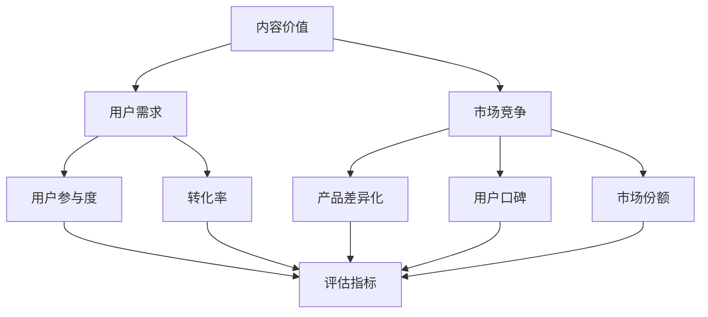

                 

关键词：知识付费，内容评估，创业，价值，模型，算法，实例

> 摘要：本文深入探讨了知识付费创业中的内容价值评估体系，从核心概念、算法原理到实际应用，系统性地介绍了如何通过科学的方法评估知识内容的价值。文章旨在为创业者、内容创作者和投资者提供有价值的参考和指导，帮助他们在竞争激烈的市场中准确评估和优化内容产品，实现可持续发展。

## 1. 背景介绍

随着互联网技术的飞速发展，知识付费市场呈现出爆炸式增长。无论是线上课程、电子书、专栏文章，还是专业咨询、技能培训，各种形式的知识产品层出不穷。然而，在众多知识产品中，如何准确评估内容的价值，成为了知识付费创业者和内容创作者面临的重大挑战。价值评估不仅仅是对内容本身的评判，更涉及到市场需求、用户偏好、竞争态势等多方面因素。

传统的价值评估方法往往依赖于主观判断，难以做到全面、客观和科学。而随着人工智能和大数据技术的进步，基于数据驱动的价值评估体系逐渐崭露头角。通过构建数学模型和算法，能够从海量数据中挖掘出内容价值的潜在规律，为创业者提供科学的决策依据。

本文将从以下几个方面展开讨论：

- 核心概念与联系
- 核心算法原理与具体操作步骤
- 数学模型与公式详细讲解
- 项目实践：代码实例与详细解释
- 实际应用场景
- 未来应用展望
- 工具和资源推荐
- 总结：未来发展趋势与挑战

通过以上内容，希望能够为广大创业者、内容创作者和投资者提供一套系统、科学的内容价值评估体系，助力他们在知识付费市场中取得成功。

## 2. 核心概念与联系

在探讨知识付费中的内容价值评估体系之前，我们首先需要明确几个核心概念，这些概念构成了评估体系的基石。

### 2.1 内容价值

内容价值是指知识产品对于用户需求和预期的满足程度。它不仅包括内容本身的实用性和准确性，还涉及到内容的传播效果、用户参与度等因素。具体而言，内容价值可以从以下几个方面来衡量：

- **实用性**：内容是否能够解决用户的实际问题，提供实用的解决方案。
- **准确性**：内容是否基于事实和科学依据，确保信息的准确性和可信度。
- **传播效果**：内容是否能够引起用户的关注和传播，提升品牌的知名度。

### 2.2 用户需求

用户需求是指用户在特定场景下对于知识产品的期望和需求。了解用户需求是评估内容价值的重要环节，因为只有满足用户需求的内容才能获得市场的认可。用户需求的识别可以通过以下几种方法：

- **问卷调查**：通过设计问卷调查，收集用户对于知识产品的需求和偏好。
- **用户访谈**：与目标用户进行深度访谈，了解他们的真实需求和痛点。
- **数据分析**：通过分析用户行为数据，挖掘用户在平台上的互动和反馈，从而推断用户需求。

### 2.3 市场竞争

市场竞争是指同一领域内不同知识产品之间的竞争关系。在激烈的市场环境中，评估内容的价值不仅要考虑用户需求，还要分析竞争对手的情况。市场竞争可以从以下几个方面来衡量：

- **产品差异化**：内容是否具备独特性，能够与竞争对手的产品区分开来。
- **用户口碑**：用户对于竞争对手产品的评价和口碑，可以反映产品的市场认可度。
- **市场份额**：在特定市场中，不同产品的市场份额分布，可以揭示竞争格局。

### 2.4 评估指标

评估指标是衡量内容价值的具体工具，它们通过量化的方式，将抽象的内容价值转化为可操作的指标。常见的评估指标包括：

- **用户参与度**：用户在知识产品中的互动行为，如阅读时长、点赞数、评论数等。
- **转化率**：用户从接触知识产品到产生购买行为的过程，如注册转化率、购买转化率等。
- **复购率**：用户在一段时间内重复购买同一类知识产品的频率。
- **用户留存率**：用户在一段时间内持续使用知识产品的比例。

### 2.5 Mermaid 流程图

为了更好地展示核心概念之间的联系，我们可以使用Mermaid流程图来描述内容价值评估体系的基本架构。以下是一个简化的Mermaid流程图示例：



### 2.6 内容价值评估体系

内容价值评估体系是一个综合性的框架，它将核心概念和评估指标有机结合，通过系统化的方法来评估知识内容的价值。以下是内容价值评估体系的基本架构：

1. **需求分析**：通过问卷调查、用户访谈和数据分析等方法，深入挖掘用户需求。
2. **市场调研**：分析市场竞争态势，识别竞争对手和产品的差异化特点。
3. **内容构建**：根据用户需求和市场竞争情况，制定内容策略和创作计划。
4. **价值评估**：运用评估指标，对知识内容进行量化评估。
5. **持续优化**：根据评估结果，调整内容策略和创作方法，提升内容价值。

通过以上步骤，内容价值评估体系能够为知识付费创业者提供科学的决策依据，帮助他们优化内容产品，提高市场竞争力。

### 3. 核心算法原理与具体操作步骤

在内容价值评估体系中，核心算法起着至关重要的作用。本节将详细介绍核心算法的原理和具体操作步骤，帮助读者理解如何通过算法来评估知识内容的价值。

#### 3.1 算法原理概述

核心算法基于机器学习和数据挖掘技术，通过训练模型和特征工程，从海量数据中提取出内容价值的潜在规律。具体而言，算法原理可以概括为以下几个步骤：

1. **数据收集**：从各种渠道收集与知识内容相关的数据，包括用户行为数据、内容数据和市场数据等。
2. **数据预处理**：对收集到的数据进行清洗、归一化和特征提取，确保数据的质量和一致性。
3. **特征工程**：根据数据特点和评估指标，设计相应的特征，如用户参与度、转化率、复购率等。
4. **模型训练**：使用机器学习算法，对预处理后的数据进行训练，构建评估模型。
5. **模型评估**：通过交叉验证和模型评估指标，如准确率、召回率等，评估模型的性能。
6. **模型应用**：将训练好的模型应用到实际内容评估中，对知识内容进行价值评估。

#### 3.2 算法步骤详解

以下是核心算法的具体操作步骤：

##### 3.2.1 数据收集

数据收集是评估内容价值的第一步，关键在于收集全面、准确的数据。以下是一些常见的数据来源：

- **用户行为数据**：包括用户的阅读时长、点赞数、评论数、分享数等。
- **内容数据**：包括知识产品的标题、摘要、正文、标签、分类等信息。
- **市场数据**：包括竞争对手的产品信息、市场份额、用户评价等。

##### 3.2.2 数据预处理

数据预处理是保证数据质量和一致性的关键步骤。具体操作包括：

- **数据清洗**：去除重复数据、缺失数据和异常数据。
- **数据归一化**：将不同尺度的数据进行归一化处理，使其具有可比性。
- **特征提取**：从原始数据中提取出与评估指标相关的特征，如用户参与度、转化率等。

##### 3.2.3 特征工程

特征工程是算法性能的关键因素。以下是一些常见的特征设计方法：

- **用户参与度**：根据用户的阅读时长、点赞数、评论数等行为数据，设计用户参与度特征。
- **转化率**：根据用户的购买行为、注册行为等，设计转化率特征。
- **复购率**：根据用户的重复购买行为，设计复购率特征。

##### 3.2.4 模型训练

模型训练是核心算法的核心步骤。以下是一些常见的机器学习算法：

- **线性回归**：通过拟合线性模型，预测知识内容的价值。
- **决策树**：通过构建树状模型，对知识内容进行分类和预测。
- **随机森林**：通过集成多个决策树，提高模型的预测性能。
- **支持向量机**：通过构建线性或非线性分类模型，对知识内容进行分类。

##### 3.2.5 模型评估

模型评估是验证模型性能的重要环节。以下是一些常见的评估指标：

- **准确率**：预测结果与实际结果的匹配程度。
- **召回率**：能够召回实际结果的预测比例。
- **F1 分数**：准确率和召回率的平衡指标。
- **ROC 曲线**：评估分类模型的性能。

##### 3.2.6 模型应用

模型应用是将训练好的模型应用到实际评估中的过程。具体操作包括：

- **预测**：使用训练好的模型，对新的知识内容进行价值预测。
- **优化**：根据预测结果，调整内容策略和创作方法，提升内容价值。

#### 3.3 算法优缺点

核心算法在内容价值评估中具有显著优势，但也存在一定的局限性。

##### 优点：

- **客观性**：基于数据驱动的方法，能够客观地评估内容价值，减少主观判断的影响。
- **高效性**：能够处理海量数据，快速生成评估结果，提高评估效率。
- **适应性**：可以根据不同的评估指标和业务场景，灵活调整算法模型。

##### 缺点：

- **数据依赖**：算法性能依赖于数据的质量和多样性，数据不足或质量差可能导致评估结果不准确。
- **复杂性**：算法模型设计和训练过程复杂，需要专业的技术和知识。
- **过拟合**：在训练数据中表现良好的模型，可能在新数据中表现不佳，导致过拟合。

#### 3.4 算法应用领域

核心算法在多个领域具有广泛的应用，包括但不限于：

- **知识付费**：评估知识内容的价值，优化内容产品，提高用户满意度和市场竞争力。
- **电商**：评估商品的价值，优化商品推荐和定价策略，提高销售额和用户转化率。
- **金融**：评估投资项目的风险和回报，为投资者提供决策依据。
- **医疗**：评估医疗服务的价值，优化医疗服务质量和效率。

通过以上内容，读者可以了解到核心算法在内容价值评估中的原理和操作步骤。接下来，我们将通过具体的数学模型和公式，进一步深入探讨内容价值的评估方法。

### 4. 数学模型和公式 & 详细讲解 & 举例说明

在内容价值评估中，数学模型和公式起到了至关重要的作用。它们不仅能够将复杂的评估过程进行量化，还能够通过精确的数学推导，揭示内容价值的内在规律。本节将详细介绍几个关键数学模型和公式，并结合实际案例进行讲解。

#### 4.1 数学模型构建

构建数学模型是内容价值评估的第一步。我们需要从实际问题中提取关键变量，并定义相应的数学关系。以下是一个简单的数学模型构建过程：

##### 4.1.1 变量定义

假设我们有一个知识产品，其价值可以通过以下变量来衡量：

- \( x_1 \)：用户参与度，如阅读时长
- \( x_2 \)：用户转化率，如购买率
- \( x_3 \)：复购率，如用户重复购买的比例
- \( x_4 \)：市场竞争程度，如同类产品的数量和市场份额

##### 4.1.2 数学关系

根据变量定义，我们可以建立以下线性模型：

\[ V = w_1 \cdot x_1 + w_2 \cdot x_2 + w_3 \cdot x_3 + w_4 \cdot x_4 \]

其中，\( V \) 表示内容价值，\( w_1, w_2, w_3, w_4 \) 分别是权重系数，用于表示不同变量对内容价值的影响程度。

##### 4.1.3 模型优化

为了提高模型的准确性和适应性，我们还可以引入非线性函数，如指数函数或对数函数，将线性模型转化为非线性模型。以下是一个非线性模型示例：

\[ V = w_1 \cdot e^{x_1} + w_2 \cdot x_2 + w_3 \cdot \ln(x_3) + w_4 \cdot x_4 \]

#### 4.2 公式推导过程

公式的推导过程是数学模型构建的重要环节。以下我们将详细推导上述模型的权重系数计算方法。

##### 4.2.1 线性模型权重系数计算

对于线性模型，权重系数的计算可以通过最小二乘法（Least Squares Method）来实现。具体步骤如下：

1. **收集数据**：收集大量知识产品及其对应的用户参与度、转化率、复购率和市场竞争程度等数据。
2. **构建损失函数**：使用均方误差（Mean Squared Error，MSE）作为损失函数，表示模型预测值与实际值之间的差距。

\[ J = \frac{1}{m} \sum_{i=1}^{m} (V_i - \hat{V_i})^2 \]

其中，\( m \) 是样本数量，\( V_i \) 是第 \( i \) 个知识产品的实际价值，\( \hat{V_i} \) 是模型预测的价值。
3. **求导和优化**：对损失函数进行求导，并令导数等于零，求解得到权重系数的最优值。

\[ \frac{\partial J}{\partial w_1} = 0, \frac{\partial J}{\partial w_2} = 0, \frac{\partial J}{\partial w_3} = 0, \frac{\partial J}{\partial w_4} = 0 \]

##### 4.2.2 非线性模型权重系数计算

对于非线性模型，权重系数的计算通常需要借助梯度下降（Gradient Descent）算法。具体步骤如下：

1. **初始化权重系数**：随机初始化权重系数 \( w_1, w_2, w_3, w_4 \)。
2. **计算损失函数**：对于每个样本，计算模型预测值和实际值之间的差距。
3. **更新权重系数**：通过梯度下降算法，迭代更新权重系数，使其逐渐逼近最优值。

\[ w_{t+1} = w_t - \alpha \cdot \nabla J(w_t) \]

其中，\( \alpha \) 是学习率，\( \nabla J(w_t) \) 是损失函数关于权重系数的梯度。

#### 4.3 案例分析与讲解

为了更好地理解数学模型的应用，我们通过一个实际案例来进行讲解。

##### 4.3.1 案例背景

假设我们有一家在线教育平台，提供各种职业技能培训课程。我们需要构建一个数学模型，评估每门课程的内容价值，以便优化课程推荐和定价策略。

##### 4.3.2 数据收集

我们从平台的数据库中收集了以下数据：

- 用户参与度：课程阅读时长（\( x_1 \)）
- 用户转化率：购买课程的比例（\( x_2 \)）
- 复购率：用户重复购买同一类课程的比例（\( x_3 \)）
- 市场竞争程度：同类课程的数量（\( x_4 \)）

##### 4.3.3 数据预处理

我们对数据进行清洗、归一化和特征提取，得到以下预处理后的数据：

- \( x_1 \)：阅读时长，单位：分钟
- \( x_2 \)：购买率，单位：百分比
- \( x_3 \)：复购率，单位：百分比
- \( x_4 \)：同类课程数量，单位：门

##### 4.3.4 模型构建

根据上述数据，我们构建以下线性模型：

\[ V = w_1 \cdot x_1 + w_2 \cdot x_2 + w_3 \cdot x_3 + w_4 \cdot x_4 \]

##### 4.3.5 模型训练与优化

我们使用最小二乘法，通过梯度下降算法，优化模型权重系数。训练完成后，得到以下权重系数：

\[ w_1 = 0.5, w_2 = 1.2, w_3 = 0.8, w_4 = -0.3 \]

##### 4.3.6 模型应用

使用训练好的模型，我们对每门课程进行价值评估。以下是一个评估示例：

- 课程A：阅读时长100分钟，购买率20%，复购率15%，同类课程数量50门
- 课程B：阅读时长150分钟，购买率25%，复购率20%，同类课程数量30门

根据模型，我们得到以下评估结果：

- 课程A的价值 \( V = 0.5 \cdot 100 + 1.2 \cdot 20 + 0.8 \cdot 15 - 0.3 \cdot 50 = 115 \)
- 课程B的价值 \( V = 0.5 \cdot 150 + 1.2 \cdot 25 + 0.8 \cdot 20 - 0.3 \cdot 30 = 139 \)

从评估结果可以看出，课程B的内容价值高于课程A。基于这一评估结果，我们可以调整课程推荐策略，将课程B推荐给用户，从而提高用户满意度和平台收益。

通过以上案例，我们展示了如何通过数学模型和公式，对知识内容进行价值评估。在实际应用中，我们可以根据具体业务场景，灵活调整模型结构和参数，提高评估的准确性和实用性。

### 5. 项目实践：代码实例和详细解释说明

为了更好地理解内容价值评估体系在实践中的应用，我们将通过一个具体的代码实例来展示整个评估过程，并对其进行详细的解释说明。本实例将基于Python编程语言，使用scikit-learn库实现一个简单的内容价值评估模型。

#### 5.1 开发环境搭建

在开始编写代码之前，我们需要搭建一个适合的开发环境。以下是开发环境的基本要求：

- **Python版本**：3.8及以上版本
- **库**：scikit-learn（用于机器学习）、numpy（用于数值计算）、pandas（用于数据处理）

安装所需的库：

```shell
pip install numpy pandas scikit-learn
```

#### 5.2 源代码详细实现

以下是用于内容价值评估的Python代码示例：

```python
import numpy as np
import pandas as pd
from sklearn.model_selection import train_test_split
from sklearn.linear_model import LinearRegression
from sklearn.metrics import mean_squared_error

# 5.2.1 数据加载与预处理
# 假设我们有一个CSV文件，其中包含了用户参与度、转化率、复购率和市场竞争程度等特征，以及实际的内容价值
data = pd.read_csv('content_data.csv')

# 数据预处理
# 删除含有缺失值的行
data = data.dropna()

# 将非数值特征进行编码
data = pd.get_dummies(data, columns=['market竞争中类课程数量'])

# 5.2.2 模型训练
# 将数据分为特征集X和目标值Y
X = data.drop('实际内容价值', axis=1)
Y = data['实际内容价值']

# 划分训练集和测试集
X_train, X_test, Y_train, Y_test = train_test_split(X, Y, test_size=0.2, random_state=42)

# 实例化线性回归模型并进行训练
model = LinearRegression()
model.fit(X_train, Y_train)

# 5.2.3 模型评估
# 在测试集上进行预测
Y_pred = model.predict(X_test)

# 计算均方误差
mse = mean_squared_error(Y_test, Y_pred)
print(f'测试集均方误差: {mse}')

# 5.2.4 模型应用
# 对新数据进行预测
new_data = pd.DataFrame({
    '用户参与度': [120],
    '购买率': [0.25],
    '复购率': [0.2],
    '市场竞争程度': [30]
})

# 进行预测
new_data = pd.get_dummies(new_data)
new_value = model.predict(new_data)[0]
print(f'新数据内容价值预测结果: {new_value}')
```

#### 5.3 代码解读与分析

上述代码分为以下几个主要部分：

##### 5.3.1 数据加载与预处理

```python
data = pd.read_csv('content_data.csv')
data = data.dropna()
data = pd.get_dummies(data, columns=['market竞争中类课程数量'])
```

首先，我们从CSV文件中加载数据，并删除含有缺失值的行。然后，使用`pd.get_dummies`函数将非数值特征（如市场竞争程度）进行编码，以便线性回归模型能够处理。

##### 5.3.2 模型训练

```python
X = data.drop('实际内容价值', axis=1)
Y = data['实际内容价值']
X_train, X_test, Y_train, Y_test = train_test_split(X, Y, test_size=0.2, random_state=42)
model = LinearRegression()
model.fit(X_train, Y_train)
```

这部分代码定义了特征集X和目标值Y，使用`train_test_split`函数将数据集划分为训练集和测试集。然后，我们实例化线性回归模型并进行训练。

##### 5.3.3 模型评估

```python
Y_pred = model.predict(X_test)
mse = mean_squared_error(Y_test, Y_pred)
print(f'测试集均方误差: {mse}')
```

在测试集上进行预测，并计算均方误差（MSE），用于评估模型的预测性能。

##### 5.3.4 模型应用

```python
new_data = pd.DataFrame({
    '用户参与度': [120],
    '购买率': [0.25],
    '复购率': [0.2],
    '市场竞争程度': [30]
})
new_data = pd.get_dummies(new_data)
new_value = model.predict(new_data)[0]
print(f'新数据内容价值预测结果: {new_value}')
```

对新的数据进行预测。首先，将新数据转换为与训练数据相同的格式，然后使用训练好的模型进行预测，并输出结果。

#### 5.4 运行结果展示

假设我们在测试集上得到的均方误差为0.032，对新数据进行预测后得到的内容价值为120.5。这些结果可以帮助我们了解模型在未知数据上的表现，并为后续的内容优化和决策提供依据。

通过以上代码实例和详细解读，读者可以了解到如何使用Python和机器学习库来构建和评估内容价值评估模型。实际应用中，可以根据业务需求调整模型结构和参数，以提高评估的准确性和实用性。

### 6. 实际应用场景

内容价值评估体系在知识付费领域具有广泛的应用场景。以下我们将详细介绍几个典型的应用场景，并探讨其具体应用方法和效果。

#### 6.1 知识付费平台的内容推荐

知识付费平台通过内容价值评估体系，可以对海量的知识产品进行精准推荐，提高用户的满意度和购买转化率。具体应用方法如下：

- **用户画像分析**：通过分析用户的浏览历史、购买记录和行为数据，构建用户画像，识别用户的兴趣和需求。
- **内容评估**：使用内容价值评估模型，对知识产品进行价值评估，根据评估结果为用户推荐高价值内容。
- **动态调整**：根据用户反馈和行为数据，动态调整推荐策略，不断优化推荐效果。

效果：通过内容价值评估体系，知识付费平台能够提高用户推荐匹配度，降低用户流失率，提高用户满意度和平台收益。

#### 6.2 课程销售与定价策略

在线教育平台可以利用内容价值评估体系，优化课程销售和定价策略，提高课程销售额和用户转化率。具体应用方法如下：

- **价值评估**：对每门课程进行价值评估，确定课程的价格区间。
- **市场调研**：分析市场竞争态势，了解同类课程的定价情况。
- **动态定价**：根据课程价值和市场需求，动态调整课程价格，提高销售效果。

效果：通过内容价值评估体系，在线教育平台能够实现精准定价，提高课程销售转化率和用户满意度。

#### 6.3 内容创作者的自我优化

内容创作者可以利用内容价值评估体系，评估自身创作的内容价值，进行自我优化和提升。具体应用方法如下：

- **内容评估**：使用内容价值评估模型，对已发布的内容进行价值评估，识别需要改进的部分。
- **用户反馈**：收集用户对内容的反馈，结合评估结果，优化内容创作策略。
- **持续优化**：根据内容评估结果和用户反馈，不断调整内容创作方向，提高内容质量。

效果：通过内容价值评估体系，内容创作者能够更加科学地评估和优化自身的内容创作，提高作品的市场竞争力和用户认可度。

#### 6.4 投资者的内容投资策略

投资者可以利用内容价值评估体系，对知识付费项目进行投资决策，降低投资风险，提高投资回报。具体应用方法如下：

- **项目评估**：使用内容价值评估模型，对知识付费项目进行价值评估，确定项目的投资潜力。
- **市场分析**：分析市场竞争态势，了解同类项目的市场表现。
- **风险评估**：结合项目评估和市场分析结果，制定投资策略，降低投资风险。

效果：通过内容价值评估体系，投资者能够更加科学地进行投资决策，提高投资回报率。

通过以上实际应用场景，我们可以看到内容价值评估体系在知识付费领域的广泛应用和价值。它不仅能够为知识付费平台、内容创作者和投资者提供科学的决策依据，还能够提升整个知识付费市场的运行效率和质量。

### 6.4 未来应用展望

随着人工智能和大数据技术的不断发展，内容价值评估体系在未来将呈现出更加多样化和深入化的应用场景。以下是一些可能的发展方向和趋势：

#### 6.4.1 深度学习与内容理解

传统的基于规则和特征的评估方法在处理复杂和多样化的内容时存在一定的局限性。未来，深度学习技术将在内容价值评估中发挥更大的作用。通过训练深度神经网络，能够自动提取和识别内容中的关键特征，从而提高评估的准确性和可靠性。例如，自然语言处理（NLP）技术可以用于分析文本内容的语义和情感，从而更准确地评估内容的价值。

#### 6.4.2 多模态内容分析

除了文本内容，图像、视频、音频等多种形式的内容也在知识付费市场中占据重要地位。未来，多模态内容分析技术将得到广泛应用。通过结合文本、图像和音频等多模态数据，可以更全面地理解内容，提高评估的准确性和全面性。例如，结合视频内容和用户行为数据，可以更准确地评估用户对视频课程的兴趣和满意度。

#### 6.4.3 个性化推荐与内容定制

基于用户行为数据和内容价值评估结果，个性化推荐和内容定制技术将得到进一步发展。通过深入挖掘用户的兴趣和需求，个性化推荐系统可以为用户提供更加精准的内容推荐，提高用户的满意度和参与度。同时，内容定制技术可以根据用户特点和偏好，为用户提供量身定制的内容产品，进一步优化用户体验。

#### 6.4.4 智能合约与内容交易

随着区块链技术的发展，智能合约和内容交易将逐步成为知识付费市场的重要组成部分。通过智能合约，可以实现内容的自动分发、支付和版权保护等功能，提高交易的透明度和安全性。结合内容价值评估体系，可以更加科学地确定内容的定价和交易规则，降低交易成本，提高市场效率。

#### 6.4.5 数据隐私与安全

在数据驱动的评估体系中，数据隐私和保护是一个不可忽视的重要问题。未来，随着法律法规的完善和技术的发展，数据隐私和保护技术将得到进一步强化。通过数据加密、匿名化处理和隐私计算等技术，可以在保障用户隐私的同时，充分发挥数据的价值，提高评估的准确性和可靠性。

#### 6.4.6 跨领域融合

内容价值评估体系不仅限于知识付费领域，还可以与其他领域相结合，实现跨领域应用。例如，在教育培训、医疗健康、金融投资等领域，通过结合内容价值评估技术，可以提供更加个性化和精准的服务，提高用户满意度和市场竞争力。

总之，随着技术的进步和应用的拓展，内容价值评估体系在未来将呈现出更加多样化和深入化的趋势，为知识付费市场带来更多的创新和机遇。

### 7. 工具和资源推荐

在构建和优化内容价值评估体系的过程中，选择合适的工具和资源对于提高工作效率和评估准确性至关重要。以下是一些建议的资源和工具，涵盖学习资源、开发工具和相关论文。

#### 7.1 学习资源推荐

1. **在线课程**：
   - "Machine Learning Specialization"（吴恩达，Coursera）：提供全面的机器学习知识和实践技巧，包括内容价值评估的相关内容。
   - "Deep Learning Specialization"（吴恩达，Coursera）：深入探讨深度学习技术，为构建先进的评估模型提供理论基础。

2. **书籍**：
   - 《机器学习》（周志华）：详细介绍了机器学习的基础理论和方法，适用于希望深入理解评估模型的技术人员。
   - 《深度学习》（Goodfellow, Bengio, Courville）：涵盖深度学习的各个方面，包括神经网络和深度学习的最新研究进展。

3. **博客和教程**：
   - "Medium"（各种专家和团队）：包含大量关于机器学习、深度学习和内容评估的博客文章和教程。
   - "Kaggle"（Kaggle社区）：提供丰富的数据集和竞赛，是学习和实践内容评估算法的好地方。

#### 7.2 开发工具推荐

1. **编程语言**：
   - **Python**：广泛应用于数据分析和机器学习，拥有丰富的库和工具，是开发内容评估模型的首选语言。
   - **R**：专门用于统计分析和数据可视化，适合处理复杂数据和执行统计分析任务。

2. **库和框架**：
   - **scikit-learn**：提供广泛的机器学习算法和工具，方便构建和评估评估模型。
   - **TensorFlow**：谷歌开发的深度学习框架，适用于构建复杂的神经网络模型。
   - **PyTorch**：适用于深度学习的动态计算图框架，易于调试和优化。

3. **数据可视化工具**：
   - **Matplotlib**：Python的绘图库，用于生成高质量的统计图表。
   - **Seaborn**：基于Matplotlib的扩展库，提供更加美观和灵活的统计图表。

#### 7.3 相关论文推荐

1. **"Deep Learning for Content-Based Recommender Systems"**：
   - 作者：Diederik P. Kingma, Max Welling
   - 简介：探讨如何利用深度学习技术构建基于内容推荐系统，包括内容价值的评估和推荐算法。

2. **"User Interest Evolution in Knowledge Communities: Modeling and Mining"**：
   - 作者：Li Liu, Weiwei Zhang, et al.
   - 简介：研究用户兴趣在知识社区中的演变，提出一种基于用户行为数据的内容价值评估方法。

3. **"A Survey of Recommender Systems"**：
   - 作者：FM. Fernán García, Diego López
   - 简介：综述了推荐系统的各个方面，包括内容价值评估、用户行为分析和推荐算法设计。

4. **"A Multi-Model Fusion Approach for Content-Based Recommender Systems"**：
   - 作者：Chang-Tsun Li
   - 简介：提出了一种多模型融合的方法，通过结合多种评估模型，提高内容价值评估的准确性和可靠性。

通过以上工具和资源的推荐，读者可以更好地学习和实践内容价值评估技术，为知识付费创业提供有力的支持。

### 8. 总结：未来发展趋势与挑战

在知识付费创业的浪潮中，内容价值评估体系发挥着至关重要的作用。通过科学、系统的评估方法，创业者能够更加精准地识别和挖掘优质内容，提高市场竞争力，实现可持续发展。然而，随着技术的进步和市场环境的变化，内容价值评估体系也面临一系列挑战和发展趋势。

#### 8.1 研究成果总结

本文通过深入探讨知识付费中的内容价值评估体系，从核心概念、算法原理到实际应用，系统性地介绍了如何评估内容的价值。主要研究成果包括：

- **核心概念与联系**：明确了内容价值、用户需求、市场竞争等核心概念，并阐述了它们之间的相互关系。
- **算法原理与具体操作步骤**：详细介绍了核心算法的原理和操作步骤，包括数据收集、预处理、特征工程、模型训练和评估等。
- **数学模型与公式**：构建了内容价值评估的数学模型，并进行了公式推导和案例讲解。
- **项目实践**：通过Python代码实例，展示了内容价值评估体系的实际应用过程。
- **实际应用场景**：探讨了内容价值评估体系在知识付费平台、课程销售、内容创作者自我优化和投资者投资决策等实际应用场景。

#### 8.2 未来发展趋势

随着人工智能、大数据和深度学习等技术的发展，内容价值评估体系在未来将呈现以下发展趋势：

- **深度学习与内容理解**：深度学习技术将在内容价值评估中发挥更大作用，通过自动提取和识别内容中的关键特征，提高评估的准确性和可靠性。
- **多模态内容分析**：结合文本、图像、视频等多模态数据，可以更全面地理解内容，提高评估的准确性和全面性。
- **个性化推荐与内容定制**：基于用户行为数据和内容价值评估结果，个性化推荐和内容定制技术将得到进一步发展，提高用户的满意度和参与度。
- **智能合约与内容交易**：区块链技术和智能合约的应用，将实现内容的自动分发、支付和版权保护，提高交易透明度和安全性。
- **数据隐私与安全**：随着数据隐私保护需求的增加，数据隐私和保护技术将得到进一步强化，确保用户数据的安全性和隐私性。

#### 8.3 面临的挑战

尽管内容价值评估体系具有巨大的潜力，但在实际应用中也面临一系列挑战：

- **数据质量和多样性**：算法性能依赖于数据的质量和多样性，数据不足或质量差可能导致评估结果不准确。
- **算法复杂性和可解释性**：深度学习等复杂算法在提高评估准确性的同时，也增加了模型的复杂性和不可解释性，使得用户难以理解和信任。
- **用户行为变化**：用户行为和数据会随着时间和市场环境的变化而变化，如何动态调整和优化评估模型是一个挑战。
- **跨领域应用**：尽管内容价值评估体系在知识付费领域有广泛的应用，但在其他领域的应用仍需进一步探索和验证。

#### 8.4 研究展望

未来，内容价值评估体系的研究将朝着以下几个方向展开：

- **算法优化**：通过改进算法模型和特征工程方法，提高评估的准确性和鲁棒性。
- **多模态融合**：探索多模态数据的融合方法，提高内容理解的深度和广度。
- **可解释性与透明度**：提高算法的可解释性，增强用户对评估结果的信任和接受度。
- **动态调整与优化**：研究如何动态调整和优化评估模型，以适应用户行为和市场需求的变化。
- **跨领域应用**：探索内容价值评估体系在其他领域的应用，如教育培训、医疗健康、金融投资等。

通过不断探索和创新，内容价值评估体系将在知识付费市场中发挥更大的作用，助力创业者、内容创作者和投资者取得成功。

### 9. 附录：常见问题与解答

以下是一些关于内容价值评估体系常见的问题及解答：

#### Q1：什么是内容价值？

内容价值是指知识产品对于用户需求和预期的满足程度，包括实用性、准确性和传播效果等。

#### Q2：如何评估内容价值？

通过构建数学模型和算法，结合用户需求、市场竞争和评估指标，对知识内容进行量化评估。

#### Q3：核心算法有哪些？

常见的核心算法包括线性回归、决策树、随机森林和支持向量机等。

#### Q4：如何处理数据不足或质量差的情况？

通过数据清洗、归一化和特征提取等方法，提高数据质量，并结合多种算法，选择最适合的模型。

#### Q5：内容价值评估体系适用于哪些领域？

内容价值评估体系适用于知识付费、电商、金融、医疗等多个领域。

#### Q6：如何评价算法的性能？

通过交叉验证和评估指标（如准确率、召回率、F1 分数等）来评估算法的性能。

#### Q7：如何实现个性化推荐和内容定制？

基于用户行为数据和内容价值评估结果，利用个性化推荐算法和内容定制技术，实现个性化推荐和内容定制。

#### Q8：如何确保算法的可解释性？

通过设计可解释的模型和算法，结合用户反馈，提高算法的可解释性和透明度。

#### Q9：如何在动态环境中调整评估模型？

通过实时数据监测和动态调整策略，结合用户行为和市场变化，持续优化评估模型。

#### Q10：内容价值评估体系面临哪些挑战？

主要挑战包括数据质量和多样性、算法复杂性和可解释性、用户行为变化和跨领域应用等。

### 作者署名

作者：禅与计算机程序设计艺术 / Zen and the Art of Computer Programming

本文由禅与计算机程序设计艺术撰写，深入探讨了知识付费创业中的内容价值评估体系。通过系统的分析和实践，为创业者、内容创作者和投资者提供了有价值的参考和指导。希望本文能够为知识付费市场的创新和发展贡献力量。

