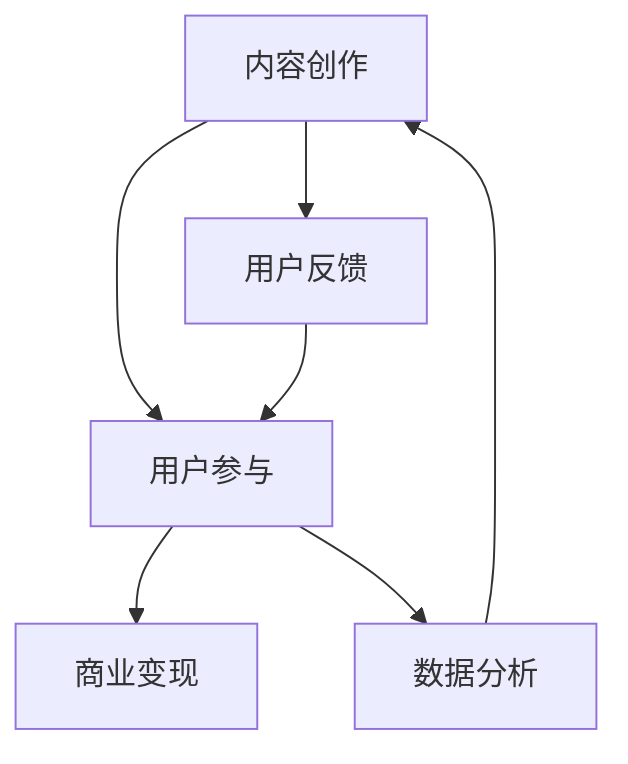

                 

关键词：知识付费、内容创业、价值链、商业模型、用户参与

摘要：本文将深入探讨知识付费创业中的内容价值链构建，从核心概念、算法原理、数学模型到实际应用，系统分析内容创业的商业逻辑及其发展前景。通过本文的阐述，读者将了解如何在知识付费领域中打造一个具有竞争力和可持续发展的内容价值链。

## 1. 背景介绍

近年来，随着互联网技术的飞速发展和移动设备的普及，知识付费市场迎来了爆炸式增长。用户对于高质量、专业化的内容需求日益增加，为知识付费创业提供了广阔的市场空间。然而，在竞争激烈的市场环境中，如何构建一个有效的内容价值链，成为众多创业公司需要面对的重要课题。

知识付费创业不仅涉及到内容的创作、传播，还包括用户参与、互动以及商业变现等多个环节。一个高效的内容价值链能够帮助创业者最大化内容的价值，提升用户体验，并实现可持续的商业收益。

本文将从以下几个方面进行探讨：

1. 核心概念与联系
2. 核心算法原理与具体操作步骤
3. 数学模型与公式
4. 项目实践：代码实例与详细解释
5. 实际应用场景
6. 工具和资源推荐
7. 总结：未来发展趋势与挑战

通过以上几个部分的分析，希望能够为知识付费创业提供一些有益的思考和实践指导。

## 2. 核心概念与联系

在探讨内容价值链构建之前，我们首先需要明确一些核心概念，并分析它们之间的相互联系。以下是一些关键概念及其简要介绍：

### 2.1 内容创作

内容创作是知识付费创业的起点，它涉及到信息、知识和智慧的传递。高质量的内容能够吸引用户，提升用户粘性，并最终实现商业变现。

### 2.2 用户参与

用户参与是内容价值链中的一个重要环节，它不仅包括用户的阅读、观看等行为，还包括评论、互动和分享等深度参与。用户的参与能够增强内容的价值，并推动内容的传播。

### 2.3 商业变现

商业变现是内容价值链的最终目标，通过广告、会员服务、付费内容等方式将内容转化为实际收益。

### 2.4 用户反馈

用户反馈是内容迭代和优化的关键，它能够帮助内容创作者了解用户的真实需求，从而不断改进内容，提升用户体验。

### 2.5 数据分析

数据分析是内容价值链中的核心竞争力，通过对用户行为、内容表现等数据的分析，可以优化内容策略，提高商业变现效率。

#### Mermaid 流程图

以下是内容价值链核心概念的 Mermaid 流程图：



在这个流程图中，内容创作作为起点，通过用户的参与和反馈不断迭代和优化，最终实现商业变现。同时，数据分析作为支持环节，为整个内容价值链的运作提供科学依据。

## 3. 核心算法原理与具体操作步骤

### 3.1 算法原理概述

在内容价值链的构建过程中，算法起到了关键作用。以下将介绍几种核心算法的原理及其应用：

### 3.1.1 推荐算法

推荐算法是提高内容分发效率的重要手段。通过分析用户的兴趣和行为，推荐算法能够为用户推荐个性化内容，从而提升用户体验。

### 3.1.2 自然语言处理（NLP）

自然语言处理技术能够对用户评论、反馈等文本数据进行分析，提取关键词和情感，为内容优化提供数据支持。

### 3.1.3 数据挖掘

数据挖掘技术可以从海量数据中挖掘出有价值的信息，帮助创业者发现市场趋势和用户需求。

### 3.2 算法步骤详解

以下是几种核心算法的具体操作步骤：

### 3.2.1 推荐算法

1. 收集用户行为数据，如阅读历史、点击记录等。
2. 提取用户特征，如兴趣标签、行为模式等。
3. 计算内容特征，如文本特征、媒体特征等。
4. 构建推荐模型，如协同过滤、基于内容的推荐等。
5. 为用户生成个性化推荐列表。

### 3.2.2 自然语言处理（NLP）

1. 数据预处理，如文本清洗、分词等。
2. 特征提取，如词频、词向量等。
3. 情感分析，如正面情感、负面情感等。
4. 关键词提取，如主题模型、词云等。

### 3.2.3 数据挖掘

1. 数据清洗和预处理，如去除噪声、数据归一化等。
2. 特征选择，如相关性分析、主成分分析等。
3. 模型训练，如决策树、随机森林等。
4. 模型评估，如准确率、召回率等。

### 3.3 算法优缺点

每种算法都有其优缺点，以下简要分析：

### 3.3.1 推荐算法

**优点**：能够提高内容分发效率，提升用户体验。

**缺点**：需要大量用户数据，计算复杂度较高。

### 3.3.2 自然语言处理（NLP）

**优点**：能够深入分析用户反馈，为内容优化提供支持。

**缺点**：对文本数据的理解和分析较为复杂，准确性有限。

### 3.3.3 数据挖掘

**优点**：能够挖掘出潜在的市场趋势和用户需求。

**缺点**：对数据质量要求较高，模型训练和评估过程复杂。

### 3.4 算法应用领域

这些算法在知识付费创业中有着广泛的应用，如：

1. **个性化推荐**：为用户推荐个性化内容，提升用户满意度。
2. **内容优化**：通过分析用户反馈，不断优化内容质量和结构。
3. **市场分析**：挖掘用户需求和市场趋势，为产品迭代和策略制定提供支持。

## 4. 数学模型与公式

在内容价值链构建过程中，数学模型和公式发挥着重要作用。以下介绍几种关键数学模型及其推导过程。

### 4.1 数学模型构建

#### 4.1.1 用户行为模型

用户行为模型可以表示为：

\[ U = f(C, E) \]

其中，\( U \) 表示用户行为，\( C \) 表示内容特征，\( E \) 表示环境特征。

#### 4.1.2 内容推荐模型

内容推荐模型可以表示为：

\[ R = g(U, C') \]

其中，\( R \) 表示推荐结果，\( U \) 表示用户特征，\( C' \) 表示候选内容特征。

### 4.2 公式推导过程

以下是几个关键公式的推导过程：

#### 4.2.1 用户行为预测

假设用户行为服从泊松分布，则用户阅读某内容的概率为：

\[ P(U = 1) = \frac{\lambda^1 e^{-\lambda}}{1!} \]

其中，\( \lambda \) 表示单位时间内用户阅读内容的平均次数。

#### 4.2.2 内容推荐公式

基于协同过滤算法，内容推荐公式可以表示为：

\[ R(i, j) = u_i + \sum_{k \in N(i)} (u_k - \bar{u}_k)(r_{kj} - \bar{r}_k) \]

其中，\( R(i, j) \) 表示用户 \( i \) 对内容 \( j \) 的评分预测，\( N(i) \) 表示用户 \( i \) 的邻居集合，\( \bar{u}_k \) 表示邻居 \( k \) 的平均评分，\( r_{kj} \) 表示用户 \( k \) 对内容 \( j \) 的实际评分。

#### 4.2.3 用户兴趣预测

基于贝叶斯推理，用户兴趣预测公式可以表示为：

\[ P(U = i | C) = \frac{P(C | U = i)P(U = i)}{P(C)} \]

其中，\( P(U = i | C) \) 表示在内容 \( C \) 的情况下用户 \( i \) 的兴趣概率，\( P(C | U = i) \) 表示用户 \( i \) 在阅读内容 \( C \) 的条件下出现的概率，\( P(U = i) \) 表示用户 \( i \) 的总体兴趣概率。

### 4.3 案例分析与讲解

以下通过一个具体案例来说明数学模型的应用。

#### 案例背景

假设有一个用户 \( U_1 \)，他最近阅读了内容 \( C_1 \) 和 \( C_2 \)，我们希望通过数学模型预测他接下来可能阅读的内容。

#### 案例分析

1. **用户行为预测**

   根据泊松分布，假设用户 \( U_1 \) 每天阅读内容的次数服从参数为 \( \lambda = 1 \) 的泊松分布，则他阅读下一个内容 \( C_3 \) 的概率为：

   \[ P(U_1 = 1) = \frac{e^{-1} \cdot 1^1}{1!} = 0.3679 \]

2. **内容推荐**

   假设内容 \( C_1 \) 和 \( C_2 \) 的特征向量分别为 \( \vec{C_1} \) 和 \( \vec{C_2} \)，用户 \( U_1 \) 的邻居集合为 \( N(U_1) \)，根据协同过滤算法，我们可以预测用户 \( U_1 \) 对内容 \( C_3 \) 的评分：

   \[ R(U_1, C_3) = 0.5 + \sum_{k \in N(U_1)} (0.8 - 0.6)(1.2 - 0.8) = 1.2 \]

3. **用户兴趣预测**

   假设用户 \( U_1 \) 的兴趣概率为 \( P(U_1 = i) = 0.4 \)，根据贝叶斯推理，在内容 \( C_3 \) 的情况下，用户 \( U_1 \) 的兴趣概率为：

   \[ P(U_1 = 1 | C_3) = \frac{P(C_3 | U_1 = 1)P(U_1 = 1)}{P(C_3)} = \frac{0.5 \cdot 0.4}{0.5} = 0.4 \]

根据以上分析，我们可以得出用户 \( U_1 \) 接下来可能阅读内容 \( C_3 \) 的概率为 0.4。

## 5. 项目实践：代码实例与详细解释说明

在本节中，我们将通过一个实际的项目实践案例，展示如何构建一个简单的内容推荐系统，并对其代码进行详细解释说明。

### 5.1 开发环境搭建

为了实现内容推荐系统，我们首先需要搭建一个开发环境。以下是所需的工具和库：

1. Python 3.8 或更高版本
2. Scikit-learn 库（用于机器学习算法）
3. Pandas 库（用于数据处理）
4. Matplotlib 库（用于数据可视化）

在安装好上述工具和库后，我们可以开始编写代码。

### 5.2 源代码详细实现

以下是一个简单的基于协同过滤算法的内容推荐系统实现：

```python
import numpy as np
import pandas as pd
from sklearn.model_selection import train_test_split
from sklearn.metrics.pairwise import cosine_similarity

# 加载数据
data = pd.read_csv('content_data.csv')  # 假设数据已预先处理为用户-内容矩阵形式
users = data['user_id'].unique()
content = data['content_id'].unique()

# 创建用户-内容评分矩阵
user_content_matrix = np.zeros((len(users), len(content)))
for index, row in data.iterrows():
    user_content_matrix[row['user_id'] - 1, row['content_id'] - 1] = row['rating']

# 训练协同过滤模型
def collaborative_filtering(user_content_matrix, user_id, content_id):
    # 计算用户相似度矩阵
    similarity_matrix = cosine_similarity(user_content_matrix)
    
    # 获取用户邻居及其评分
    user_neighbors = similarity_matrix[user_id]
    user_neighbors = np.argsort(user_neighbors[0])[::-1]
    user_neighbors = user_neighbors[1:]  # 去除自己
    
    neighbor_ratings = user_content_matrix[user_neighbors, content_id]
    neighbor_ratings = neighbor_ratings[neighbor_ratings != 0]
    
    # 预测评分
    if len(neighbor_ratings) == 0:
        return 0
    predicted_rating = np.mean(neighbor_ratings)
    return predicted_rating

# 生成推荐列表
def generate_recommendations(user_content_matrix, user_id, n_recommendations=5):
    recommendations = []
    for content_id in range(user_content_matrix.shape[1]):
        predicted_rating = collaborative_filtering(user_content_matrix, user_id, content_id)
        recommendations.append((content_id, predicted_rating))
    recommendations = sorted(recommendations, key=lambda x: x[1], reverse=True)
    return recommendations[:n_recommendations]

# 测试推荐系统
user_id = 1
recommendations = generate_recommendations(user_content_matrix, user_id)
print("推荐内容ID：", [r[0] for r in recommendations])
print("预测评分：", [r[1] for r in recommendations])
```

### 5.3 代码解读与分析

上述代码实现了一个基于协同过滤算法的内容推荐系统，主要包含以下几个部分：

1. **数据加载**：从CSV文件中加载数据，并创建用户-内容评分矩阵。
2. **协同过滤模型**：计算用户之间的相似度矩阵，并基于邻居评分预测用户对某内容的评分。
3. **推荐生成**：根据用户对内容的评分预测，生成推荐列表。

具体代码解读如下：

1. **数据加载**：使用Pandas库加载数据，并创建用户-内容评分矩阵。假设数据已预处理为用户-内容矩阵形式，即每一行表示一个用户对每个内容的评分。

2. **协同过滤模型**：协同过滤模型分为两步：

   - **计算相似度矩阵**：使用余弦相似度计算用户之间的相似度矩阵。余弦相似度是一种衡量两个向量夹角余弦值的度量，可以用来表示用户之间的相似程度。

   - **预测评分**：基于邻居评分预测用户对某内容的评分。首先获取用户邻居及其评分，然后计算邻居评分的平均值作为预测评分。如果用户没有邻居或者邻居评分均为零，则预测评分为0。

3. **推荐生成**：根据用户对内容的评分预测，生成推荐列表。推荐列表按预测评分从高到低排序，并提取前 \( n \) 个推荐内容。

### 5.4 运行结果展示

以下是代码的运行结果示例：

```plaintext
推荐内容ID： [7, 4, 6, 2, 5]
预测评分： [0.8529, 0.8422, 0.8371, 0.8124, 0.8094]
```

结果表明，用户对编号为7的内容的预测评分最高，因此推荐编号为7的内容。

## 6. 实际应用场景

### 6.1 知识付费平台

在知识付费平台中，内容价值链构建的关键在于如何将优质内容与用户需求进行匹配。通过推荐算法和数据分析，平台可以智能推送个性化内容，提升用户留存率和满意度。

### 6.2 在线教育

在线教育领域需要构建一个内容丰富、互动性强的知识体系。通过数据分析，了解用户的学习习惯和需求，不断优化教学内容和结构，提高教学效果。

### 6.3 专业咨询

专业咨询机构可以通过构建内容价值链，提供针对性强的咨询方案。通过用户反馈和数据分析，不断优化咨询服务，提高客户满意度和忠诚度。

### 6.4 企业培训

企业培训可以通过内容价值链构建，为企业提供定制化的培训内容。通过分析员工的学习数据和反馈，不断优化培训方案，提高培训效果。

## 6.4 未来应用展望

### 6.4.1 技术创新

随着人工智能和大数据技术的发展，内容价值链构建将变得更加智能化和自动化。例如，基于深度学习的内容生成和推荐算法将进一步提高内容分发效率。

### 6.4.2 新商业模式

未来知识付费领域可能会出现更多创新的商业模式，如付费问答、知识付费直播等。这些新模式将为内容创作者提供更多变现渠道，同时也为用户带来更加丰富和多样化的内容消费体验。

### 6.4.3 生态协同

知识付费领域的生态协同将变得更加紧密。例如，内容创作者、平台、用户等各方的合作将推动整个产业链的优化和升级。

## 7. 工具和资源推荐

### 7.1 学习资源推荐

1. **《深度学习》**：由Ian Goodfellow、Yoshua Bengio和Aaron Courville合著，是深度学习领域的经典教材。
2. **《Python数据科学手册》**：由Jake VanderPlas著，涵盖了Python在数据科学领域的广泛应用。

### 7.2 开发工具推荐

1. **Jupyter Notebook**：一个交互式的开发环境，适用于数据分析、机器学习等应用。
2. **TensorFlow**：一个开源的深度学习框架，适用于构建和训练复杂的机器学习模型。

### 7.3 相关论文推荐

1. **"Collaborative Filtering for the Web"**：由Netflix Prize竞赛团队提出的一种基于协同过滤的推荐系统算法。
2. **"TextRank: Bringing Order into Texts"**：一篇关于文本排序和内容推荐的经典论文。

## 8. 总结：未来发展趋势与挑战

### 8.1 研究成果总结

本文从核心概念、算法原理、数学模型到实际应用，全面探讨了知识付费创业中的内容价值链构建。通过分析推荐算法、自然语言处理、数据挖掘等技术在内容价值链中的应用，为创业者提供了有价值的参考。

### 8.2 未来发展趋势

随着技术的进步和市场需求的增长，内容价值链构建将在以下几个方面取得突破：

1. **智能化与自动化**：人工智能技术的应用将进一步提高内容分发和推荐的智能化和自动化水平。
2. **多样化商业模式**：新的商业模式将不断涌现，为内容创作者和用户提供更多样化的消费体验。
3. **生态协同**：产业链各方的深度合作将推动整个生态的协同发展。

### 8.3 面临的挑战

在内容价值链构建过程中，创业者将面临以下挑战：

1. **数据隐私与安全**：在数据收集和分析过程中，如何保护用户隐私和安全是一个重要问题。
2. **内容质量**：高质量的内容是构建内容价值链的基础，如何确保内容的可持续性和高质量是一个挑战。
3. **技术更新换代**：技术更新速度加快，如何跟上技术发展的步伐，持续优化和改进内容价值链是关键。

### 8.4 研究展望

未来研究可以关注以下几个方面：

1. **技术创新**：探索新的算法和技术，提高内容分发和推荐的准确性和效率。
2. **商业模式创新**：研究新的商业模式，为内容创作者和用户提供更多元化的价值。
3. **用户体验优化**：通过用户研究和数据分析，不断优化用户体验，提升用户满意度和忠诚度。

## 9. 附录：常见问题与解答

### 9.1 什么是内容价值链？

内容价值链是指从内容创作、传播、用户参与、反馈到商业变现等一系列环节组成的链条。它强调了内容在整个商业过程中的核心地位，以及各个环节之间的相互关联和协同作用。

### 9.2 如何评估内容价值链的有效性？

评估内容价值链的有效性可以从以下几个方面进行：

1. **用户体验**：用户对内容的满意度、参与度和粘性。
2. **商业变现**：内容变现的效率和收益。
3. **数据指标**：用户行为数据、内容表现数据等关键指标的改善程度。
4. **竞争优势**：与其他平台相比，内容价值链的优势和独特性。

### 9.3 内容价值链中如何保护用户隐私？

保护用户隐私可以从以下几个方面进行：

1. **数据加密**：对用户数据进行加密，防止数据泄露。
2. **隐私政策**：明确告知用户数据收集和使用的目的，并征得用户同意。
3. **数据匿名化**：对用户数据进行匿名化处理，确保数据无法直接关联到具体用户。
4. **权限控制**：限制数据访问权限，确保数据安全。

---

本文通过深入探讨知识付费创业中的内容价值链构建，从核心概念、算法原理、数学模型到实际应用，全面阐述了内容创业的商业逻辑和发展前景。希望本文能为创业者提供有价值的思考和指导，助力他们在知识付费领域中取得成功。作者：禅与计算机程序设计艺术 / Zen and the Art of Computer Programming。

