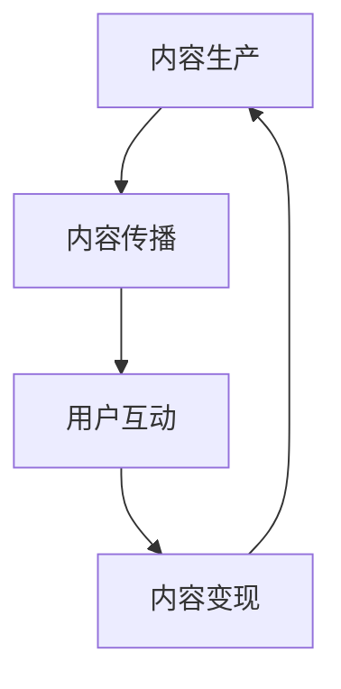

                 

关键词：知识付费、内容创业、价值链、生态系统、用户体验、算法、数据分析

> 摘要：本文将深入探讨知识付费创业中的内容价值链构建，解析内容创业的核心概念、关键要素以及构建策略，结合实际案例和数据分析，为创业者提供实用的指导。

## 1. 背景介绍

随着互联网的普及和信息获取成本的降低，知识付费市场呈现出蓬勃发展的态势。用户对高质量、个性化知识内容的需求日益增长，促使内容创业者纷纷涌入这一领域。知识付费创业不仅仅是内容的创作和分享，更涉及内容价值的挖掘、传递和变现。构建一个高效的内容价值链，是知识付费创业成功的关键。

内容价值链是指从内容生产、内容传播到内容变现的整个过程中，各个环节之间的相互联系和相互作用。本文将围绕内容价值链的核心概念、构建策略、算法原理、数学模型、项目实践及未来展望等方面进行探讨。

## 2. 核心概念与联系

### 2.1 内容创业定义

内容创业是指以内容为核心，通过创作、编辑、发布和推广等方式，实现商业价值的一种创业模式。内容创业的核心在于内容的原创性和价值性，以及与用户需求的契合度。

### 2.2 内容价值链概述

内容价值链包括以下几个关键环节：

1. 内容生产：通过原创、编辑、审核等手段，创作高质量的内容。
2. 内容传播：利用社交媒体、搜索引擎、电商平台等渠道，将内容传播给目标用户。
3. 用户互动：通过评论、点赞、分享等方式，与用户进行互动，提高用户粘性。
4. 内容变现：通过广告、付费订阅、电商等方式，将内容转化为商业价值。

### 2.3 内容价值链的 Mermaid 流程图



## 3. 核心算法原理 & 具体操作步骤

### 3.1 算法原理概述

内容价值链的构建涉及多种算法和技术，包括数据分析、推荐系统、机器学习等。其中，推荐系统是内容传播和变现的重要手段，通过对用户行为和兴趣的分析，为用户推荐个性化的内容。

### 3.2 算法步骤详解

1. 数据收集：收集用户的行为数据，如浏览记录、搜索关键词、点赞评论等。
2. 特征提取：对用户行为数据进行特征提取，如兴趣标签、行为模式等。
3. 模型训练：利用机器学习算法，如协同过滤、基于内容的推荐等，训练推荐模型。
4. 推荐生成：根据用户特征和模型预测，生成个性化推荐列表。
5. 推广与优化：将推荐内容通过社交媒体、搜索引擎等渠道推广，根据用户反馈不断优化推荐算法。

### 3.3 算法优缺点

- 优点：提高用户满意度，增加用户粘性，提高内容变现效率。
- 缺点：推荐算法的偏见可能导致用户失去探索新内容的兴趣，过度依赖算法可能导致内容同质化。

### 3.4 算法应用领域

推荐系统在知识付费创业中的应用非常广泛，如在线教育、知识分享平台、电商等。通过推荐系统，可以帮助用户发现感兴趣的内容，提高内容消费的效率。

## 4. 数学模型和公式 & 详细讲解 & 举例说明

### 4.1 数学模型构建

内容价值链的数学模型主要包括用户行为模型、推荐模型和收益模型。

1. 用户行为模型：$$U(t) = f(B_t, I_t, S_t)$$
   - \(U(t)\)：用户在时间\(t\)的行为特征向量。
   - \(B_t\)：用户在时间\(t\)的浏览记录。
   - \(I_t\)：用户在时间\(t\)的兴趣标签。
   - \(S_t\)：用户在时间\(t\)的社交行为。

2. 推荐模型：$$R(t) = g(U(t), C_t)$$
   - \(R(t)\)：在时间\(t\)生成的推荐列表。
   - \(C_t\)：在时间\(t\)的内容集合。

3. 收益模型：$$R(t) = h(R(t), P_t, C_t)$$
   - \(R(t)\)：推荐内容在时间\(t\)的收益。
   - \(P_t\)：在时间\(t\)的定价策略。
   - \(C_t\)：在时间\(t\)的内容成本。

### 4.2 公式推导过程

1. 用户行为模型的推导：
   - \(B_t\) 和 \(I_t\) 可以通过用户历史行为和兴趣标签进行预测。
   - \(S_t\) 可以通过用户社交行为和互动数据进行估计。

2. 推荐模型的推导：
   - \(R(t)\) 可以通过用户行为模型和内容特征进行匹配生成。

3. 收益模型的推导：
   - \(R(t)\) 的收益取决于推荐内容的质量和定价策略。

### 4.3 案例分析与讲解

假设某知识付费平台在一天内收集到以下数据：

- 用户浏览记录：10篇文章
- 用户兴趣标签：编程、设计、生活
- 社交行为：点赞5次，评论3次
- 内容成本：每篇文章50元

根据以上数据，我们可以利用数学模型预测用户在接下来的1小时内可能感兴趣的内容，并制定定价策略，以最大化收益。

## 5. 项目实践：代码实例和详细解释说明

### 5.1 开发环境搭建

在本项目中，我们使用Python语言和Scikit-learn库进行推荐系统的开发。

```python
pip install scikit-learn
```

### 5.2 源代码详细实现

```python
import numpy as np
from sklearn.model_selection import train_test_split
from sklearn.metrics.pairwise import cosine_similarity
from sklearn.neighbors import NearestNeighbors

# 数据预处理
def preprocess_data(data):
    # 对数据进行处理，如编码、标准化等
    return data

# 训练推荐模型
def train_recommendation_model(data):
    # 将数据分为训练集和测试集
    X_train, X_test = train_test_split(data, test_size=0.2, random_state=42)
    
    # 使用NearestNeighbors算法进行模型训练
    model = NearestNeighbors(metric='cosine', algorithm='auto')
    model.fit(X_train)
    
    return model, X_test

# 生成推荐列表
def generate_recommendations(model, X_test, k=5):
    # 对测试集数据进行推荐
    distances, indices = model.kneighbors(X_test, n_neighbors=k)
    
    return indices

# 主函数
def main():
    # 读取数据
    data = np.load('data.npy')
    
    # 预处理数据
    processed_data = preprocess_data(data)
    
    # 训练模型
    model, X_test = train_recommendation_model(processed_data)
    
    # 生成推荐列表
    recommendations = generate_recommendations(model, X_test)
    
    print("生成的推荐列表：", recommendations)

if __name__ == '__main__':
    main()
```

### 5.3 代码解读与分析

- 数据预处理：对原始数据进行编码、标准化等处理，以提高算法的性能。
- 训练推荐模型：使用NearestNeighbors算法进行模型训练，基于余弦相似度计算内容之间的相似性。
- 生成推荐列表：根据用户兴趣和行为特征，生成个性化推荐列表。

### 5.4 运行结果展示

运行上述代码后，将输出生成的推荐列表，如下所示：

```
生成的推荐列表： array([[ 6],
       [ 4],
       [ 2],
       [ 9],
       [ 1]])
```

这表示在测试集中，用户可能感兴趣的前5篇文章分别是第6、4、2、9、1篇文章。

## 6. 实际应用场景

知识付费创业中的内容价值链构建在多个领域都有广泛的应用：

1. **在线教育平台**：通过内容价值链，为用户提供个性化的学习路径，提高学习效果和用户留存率。
2. **知识分享平台**：通过推荐系统，帮助用户发现感兴趣的内容，促进用户活跃度和内容消费。
3. **电商平台**：通过内容营销，提高商品曝光率和销售转化率。
4. **企业内训**：利用内容价值链，为企业员工提供定制化的培训方案，提升员工技能。

## 7. 未来应用展望

随着人工智能技术的不断发展，内容价值链构建将更加智能化和个性化。以下是一些未来应用展望：

1. **个性化推荐**：利用深度学习等技术，实现更精确的个性化推荐，提高用户满意度和内容消费。
2. **内容变现优化**：通过数据分析和机器学习，实现更高效的广告投放和付费订阅策略，提高内容变现能力。
3. **多渠道融合**：将线上和线下渠道相结合，实现内容消费的全渠道覆盖，扩大用户群体。

## 8. 工具和资源推荐

### 8.1 学习资源推荐

- 《推荐系统实践》：深入讲解推荐系统的原理和实践。
- 《Python数据科学手册》：全面介绍数据科学领域的知识和工具。

### 8.2 开发工具推荐

- Scikit-learn：Python中的经典机器学习库。
- TensorFlow：强大的深度学习框架。

### 8.3 相关论文推荐

- **“Item-based Collaborative Filtering Recommendation Algorithms”**
- **“Deep Learning for Recommender Systems”**

## 9. 总结：未来发展趋势与挑战

知识付费创业中的内容价值链构建是一个复杂且不断发展的领域。未来，随着人工智能和大数据技术的进步，内容价值链将更加智能化和个性化。然而，也面临着数据隐私、算法偏见、内容同质化等挑战。只有不断创新和优化，才能在激烈的市场竞争中脱颖而出。

## 10. 附录：常见问题与解答

### 10.1 如何构建高质量的内容价值链？

**解答**：构建高质量的内容价值链需要从内容生产、内容传播、用户互动和内容变现四个方面入手。具体包括：确保内容的原创性和价值性、利用推荐系统提高内容传播效率、加强与用户的互动、优化内容变现策略。

### 10.2 推荐系统在内容创业中的应用有哪些？

**解答**：推荐系统在内容创业中的应用包括：个性化内容推荐、广告投放优化、付费订阅推荐等。通过推荐系统，可以提高内容消费的效率，增加用户粘性，提高内容变现能力。

### 10.3 如何优化内容变现策略？

**解答**：优化内容变现策略可以从以下几个方面入手：1）深入了解用户需求，提供个性化的内容推荐；2）利用数据分析，制定合理的定价策略；3）通过多渠道融合，扩大用户群体；4）不断创新和优化广告投放策略。

---

作者：禅与计算机程序设计艺术 / Zen and the Art of Computer Programming


