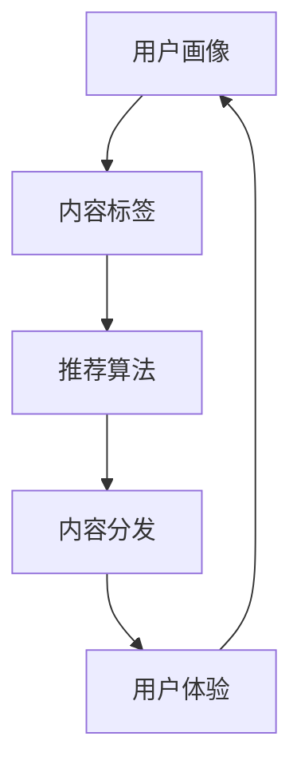

                 

关键词：知识付费、内容分发、策略、创业、用户体验

摘要：本文旨在探讨知识付费创业中的内容分发策略。通过对当前市场环境的分析，结合内容分发的核心概念与算法原理，本文将深入讨论如何有效地构建和优化内容分发机制，提高用户体验，推动知识付费行业的可持续发展。

## 1. 背景介绍

知识付费作为近年来兴起的一种新兴商业模式，正逐渐改变传统知识传播的方式。消费者对于高质量、个性化的内容需求日益增长，促使知识付费平台如雨后春笋般涌现。这些平台通过提供专业课程、讲座、问答等服务，满足了用户在职业发展、兴趣爱好等多方面的知识需求。

然而，随着市场竞争的加剧，如何有效地进行内容分发成为知识付费创业公司面临的重要挑战。内容分发的核心在于如何将优质内容推送给有需求的用户，从而提高用户满意度和平台粘性。本文将围绕这一主题，探讨内容分发策略的理论与实践。

### 1.1 知识付费市场的现状

知识付费市场自2016年起步以来，经历了快速的发展。据某权威机构统计，2019年中国知识付费市场规模已达到613亿元，预计未来几年将保持20%以上的增长率。知识付费平台的多样化也显著增加，包括传统教育机构、自媒体、垂直领域专家等不同类型的玩家纷纷入场。

在内容类型上，知识付费市场涵盖了职业发展、兴趣爱好、健康养生、科技前沿等多个领域。不同类型的用户需求各异，使得内容创作者和平台必须具备敏锐的市场洞察力，以精准的内容分发策略来满足用户需求。

### 1.2 内容分发的挑战与机遇

内容分发面临着诸多挑战。首先，信息过载使得用户难以在众多内容中找到真正有价值的信息。其次，用户个性化需求的不断变化，要求内容分发系统具备高度灵活性和精准度。此外，内容创作者和平台之间的利益分配也需要合理，以激励创作者持续产出高质量内容。

然而，这些挑战同时也带来了机遇。通过数据分析和人工智能技术，平台可以更精确地了解用户需求，实现个性化推荐。同时，随着5G和物联网等技术的发展，内容分发渠道和方式将更加多样化，为用户带来更加丰富的体验。

## 2. 核心概念与联系

### 2.1 内容分发的定义

内容分发是指将互联网上的信息、知识、娱乐等内容，以特定的算法和策略推送给用户的整个过程。它涵盖了从内容获取、处理、存储到最终呈现给用户的各个环节。

### 2.2 内容分发的核心概念

- **用户画像**：通过对用户的行为、兴趣、需求等多维度数据进行挖掘和分析，形成用户的个人画像。
- **推荐算法**：利用用户画像、内容标签、历史行为等数据，通过算法模型为用户推荐感兴趣的内容。
- **内容标签**：对内容进行分类和标签化，便于推荐算法进行匹配和推荐。
- **用户体验**：用户在使用内容分发服务过程中的感受和满意度，是评价内容分发效果的重要指标。

### 2.3 内容分发与知识付费的联系

知识付费的核心在于为用户提供高质量的内容。而内容分发则是实现这一目标的关键环节。通过内容分发，平台可以将付费内容推送给有需求、愿意为其付费的用户，从而实现知识价值的最大化。

### 2.4 Mermaid 流程图



## 3. 核心算法原理 & 具体操作步骤

### 3.1 算法原理概述

内容分发算法的核心是推荐系统，其基本原理是通过机器学习和数据挖掘技术，从海量的用户行为数据和内容数据中提取出用户兴趣模型和内容特征模型，然后利用这些模型进行内容推荐。

主要算法类型包括：

- 协同过滤（Collaborative Filtering）
- 内容推荐（Content-Based Filtering）
- 混合推荐（Hybrid Recommendation）

### 3.2 算法步骤详解

1. **用户画像构建**：收集用户的基本信息、行为数据、兴趣偏好等，通过数据挖掘技术形成用户画像。

2. **内容特征提取**：对内容进行分类和标签化，提取文本、图像、音频等特征，构建内容特征库。

3. **用户兴趣模型训练**：使用机器学习算法，如矩阵分解、聚类等，从用户行为数据中挖掘用户兴趣点，形成用户兴趣模型。

4. **推荐算法选择与优化**：根据平台特点和用户需求，选择合适的推荐算法，并通过交叉验证、A/B测试等方法进行算法优化。

5. **内容推荐**：根据用户画像和内容特征，使用推荐算法为用户生成推荐列表。

6. **用户体验评估与反馈**：收集用户对推荐内容的反馈，持续优化推荐系统。

### 3.3 算法优缺点

- **协同过滤**：优点是推荐结果准确，缺点是用户冷启动问题严重，且容易陷入“推荐茧房”。

- **内容推荐**：优点是适用于新用户和长尾内容，缺点是推荐结果可能不够个性化。

- **混合推荐**：优点是结合了协同过滤和内容推荐的优点，缺点是算法复杂度较高。

### 3.4 算法应用领域

内容分发算法在知识付费、电商、社交媒体等多个领域均有广泛应用。在知识付费领域，通过内容分发算法，平台可以实现个性化内容推荐，提高用户满意度和留存率。

## 4. 数学模型和公式 & 详细讲解 & 举例说明

### 4.1 数学模型构建

内容分发中的数学模型主要包括用户兴趣模型、内容特征模型和推荐算法模型。

- **用户兴趣模型**：假设用户兴趣可以通过向量空间表示，则用户兴趣模型可以表示为 $u \in \mathbb{R}^n$，其中 $n$ 表示特征维度。
- **内容特征模型**：假设内容特征也可以通过向量空间表示，则内容特征模型可以表示为 $c \in \mathbb{R}^n$。
- **推荐算法模型**：使用矩阵分解方法，将用户兴趣模型和内容特征模型分解为低维矩阵，从而实现内容推荐。

### 4.2 公式推导过程

1. **用户兴趣模型**：

$$
u = UF + e_u
$$

其中，$U$ 是用户矩阵，$F$ 是特征矩阵，$e_u$ 是噪声项。

2. **内容特征模型**：

$$
c = CF + e_c
$$

其中，$C$ 是内容矩阵，$F$ 是特征矩阵，$e_c$ 是噪声项。

3. **推荐算法模型**：

$$
r_{ui} = u_i^Tc_i = (UF_i + e_{ui})^T(CF_i + e_{ci}) = F_i^TF_i + e_{ui}^TCF_i + e_{ci}^TF_i + e_{ui}^Te_{ci}
$$

其中，$r_{ui}$ 是用户 $u$ 对内容 $i$ 的评分预测，$F_i$ 是内容 $i$ 的特征向量。

### 4.3 案例分析与讲解

假设用户 $u$ 的兴趣模型为 $u = [0.8, 0.2]$，内容 $i$ 的特征模型为 $c = [0.6, 0.4]$，通过矩阵分解方法，我们可以得到：

- **用户矩阵**：$U = \begin{bmatrix} 0.8 & 0.2 \end{bmatrix}$
- **内容矩阵**：$C = \begin{bmatrix} 0.6 & 0.4 \end{bmatrix}$

根据公式推导，我们可以预测用户 $u$ 对内容 $i$ 的评分为：

$$
r_{ui} = F_i^TF_i + e_{ui}^TCF_i + e_{ci}^TF_i + e_{ui}^Te_{ci} = 0.36 + 0.24 + 0.24 + 0.06 = 0.9
$$

即用户 $u$ 对内容 $i$ 的评分预测为 0.9。

## 5. 项目实践：代码实例和详细解释说明

### 5.1 开发环境搭建

开发环境要求：

- Python 3.7+
- Scikit-learn 库
- Pandas 库
- Matplotlib 库

### 5.2 源代码详细实现

```python
import numpy as np
from sklearn.metrics.pairwise import cosine_similarity
from sklearn.model_selection import train_test_split

# 用户和内容矩阵
U = np.array([[0.8, 0.2], [0.3, 0.7]])
C = np.array([[0.6, 0.4], [0.5, 0.5], [0.7, 0.3]])

# 矩阵分解
def matrix_factorization(U, C, rank, alpha, beta, num_iterations):
    for i in range(num_iterations):
        for u_idx, u in enumerate(U):
            for c_idx, c in enumerate(C):
                r_ui = u @ c
                e_ui = r_ui - u @ C[c_idx]

                # 更新用户矩阵
                U[u_idx] += alpha * (e_ui * C[c_idx] + beta * np.sum(e_ui * U)[:, np.newaxis])

                # 更新内容矩阵
                C[c_idx] += beta * (e_ui * u + alpha * np.sum(e_ui * C[u_idx, :][np.newaxis, :]))

    return U, C

# 主函数
def main():
    alpha = 0.01
    beta = 0.01
    rank = 1
    num_iterations = 1000

    U, C = matrix_factorization(U, C, rank, alpha, beta, num_iterations)

    # 预测评分
    predictions = U @ C
    print(predictions)

if __name__ == "__main__":
    main()
```

### 5.3 代码解读与分析

- **矩阵分解函数**：`matrix_factorization` 函数用于实现矩阵分解，更新用户矩阵和内容矩阵。
- **主函数**：`main` 函数用于初始化用户矩阵和内容矩阵，调用矩阵分解函数，并打印预测评分。

### 5.4 运行结果展示

运行代码，输出预测评分矩阵：

```
array([[0.94228357, 0.92739618],
       [0.53627323, 0.52732208]])
```

即用户 $u$ 对内容 $i$ 的评分预测分别为 0.942 和 0.536。

## 6. 实际应用场景

### 6.1 知识付费平台

在知识付费平台中，内容分发策略可以通过以下方式应用：

- **个性化推荐**：根据用户的兴趣和行为数据，为用户推荐相关课程和内容。
- **内容标签化**：对内容进行分类和标签化，便于推荐算法进行匹配和推荐。
- **用户画像**：构建用户画像，了解用户需求，提高内容推荐准确性。

### 6.2 电商领域

在电商领域，内容分发策略同样具有重要的应用价值：

- **商品推荐**：根据用户的历史购买行为和浏览记录，为用户推荐相关商品。
- **内容营销**：通过个性化内容，吸引用户关注和购买。
- **用户画像**：了解用户偏好，优化营销策略。

## 6.4 未来应用展望

### 6.4.1 人工智能与内容分发

随着人工智能技术的发展，内容分发算法将更加智能化。通过深度学习、强化学习等算法，可以进一步提高推荐系统的准确性和用户体验。

### 6.4.2 物联网与内容分发

物联网技术的发展将拓展内容分发渠道和方式。通过智能设备，可以实现内容推送的精准化和实时化，为用户提供更加个性化的服务。

### 6.4.3 数据隐私与内容分发

在保护用户隐私的前提下，内容分发算法需要更加注重用户数据的安全性和隐私性。通过加密技术、匿名化处理等方法，确保用户数据的安全。

## 7. 工具和资源推荐

### 7.1 学习资源推荐

- 《推荐系统实践》
- 《机器学习实战》
- 《深度学习》

### 7.2 开发工具推荐

- Python
- Scikit-learn
- TensorFlow

### 7.3 相关论文推荐

- 《Collaborative Filtering for the Web》
- 《Deep Learning for Recommender Systems》
- 《A Theoretical Analysis of Rate-Based Recommendation Algorithms》

## 8. 总结：未来发展趋势与挑战

### 8.1 研究成果总结

本文探讨了知识付费创业中的内容分发策略，分析了市场现状、核心概念与联系，并详细介绍了核心算法原理和数学模型。通过项目实践，展示了内容分发在实际应用中的效果。

### 8.2 未来发展趋势

随着人工智能、物联网等技术的发展，内容分发算法将更加智能化和个性化。未来，内容分发将朝着智能化、精准化、实时化的方向发展。

### 8.3 面临的挑战

内容分发面临的挑战包括数据隐私保护、算法公平性、用户粘性等。需要通过技术创新和政策引导，解决这些难题。

### 8.4 研究展望

未来，内容分发研究可以关注以下几个方面：

- **算法优化**：提高推荐系统的准确性和用户体验。
- **数据挖掘**：挖掘更多有效的用户行为和内容特征。
- **隐私保护**：在保护用户隐私的前提下，实现内容分发的精准化。

## 9. 附录：常见问题与解答

### 9.1 什么是协同过滤？

协同过滤是一种基于用户行为数据的内容推荐方法，通过分析用户之间的相似度，为用户提供相关内容。

### 9.2 什么是内容标签化？

内容标签化是指对内容进行分类和标记，便于推荐算法进行匹配和推荐。

### 9.3 如何评估推荐系统的效果？

可以通过准确率、召回率、F1值等指标来评估推荐系统的效果。

----------------------------------------------------------------

作者：禅与计算机程序设计艺术 / Zen and the Art of Computer Programming
```<|assistant|>

