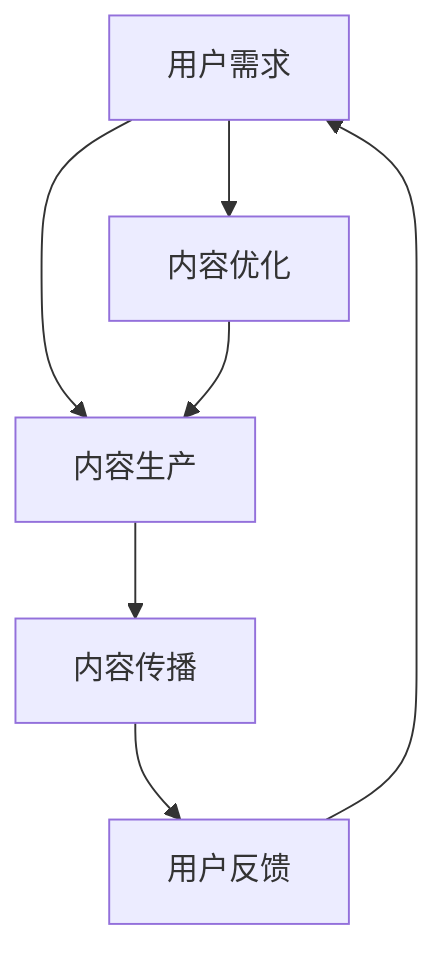

                 

关键词：知识付费、内容创新、创业、信息技术、商业策略

## 摘要

本文旨在探讨知识付费领域中的内容创新，以及其对创业实践的影响。随着信息技术的发展，知识付费已经成为一种流行的商业模式，为创业者提供了新的机遇。本文首先介绍知识付费的背景和现状，然后深入分析内容创新在知识付费创业中的重要性。通过具体案例和数据分析，我们将探讨内容创新的实现路径，以及如何利用内容创新来推动知识付费创业的持续发展。最后，本文将对未来知识付费创业中的内容创新趋势进行展望，并讨论面临的挑战和解决方案。

## 1. 背景介绍

知识付费是指通过付费方式获取知识、技能和信息的一种商业模式。在互联网时代，知识付费的兴起与信息传播方式的变革密切相关。过去，知识主要来源于传统教育机构和权威出版物，而如今，互联网打破了信息壁垒，使得知识传播变得更加便捷和高效。

### 1.1 知识付费的兴起

随着移动互联网的普及，人们获取知识的渠道越来越多样化。知识付费的兴起得益于以下几个因素：

- **用户需求**：在竞争激烈的职场和生活中，人们越来越意识到学习和提升自己的重要性。知识付费满足了用户对专业知识和技能的需求，帮助他们更快地实现个人成长和职业发展。

- **技术支持**：互联网技术的进步，特别是移动互联网、大数据和人工智能的应用，为知识付费提供了强大的技术支撑。在线教育平台、学习工具和社交网络等新兴技术，使得知识付费变得更加便捷和个性化。

- **商业模式创新**：知识付费的商业模式不断创新，从最初的付费课程到会员制、订阅制等多种形式，为创业者提供了丰富的机会。

### 1.2 知识付费的现状

目前，知识付费已经成为一种主流的商业模式。根据相关数据显示，中国知识付费市场规模逐年增长，预计到2025年将达到3000亿元人民币。以下是目前知识付费市场的一些主要趋势：

- **内容多样化**：知识付费的内容涵盖了各个领域，从职业培训、技能提升到兴趣爱好等，满足了用户多样化的需求。

- **平台化发展**：知识付费平台不断涌现，如知乎、得到、喜马拉雅等，它们通过聚合优质内容，吸引大量用户。

- **个性化推荐**：利用大数据和人工智能技术，知识付费平台能够根据用户的兴趣和行为，提供个性化的内容推荐。

## 2. 核心概念与联系

在知识付费创业中，内容创新是核心驱动力。本文将使用Mermaid流程图来展示内容创新的原理和架构。



### 2.1 用户需求分析

用户需求是内容创新的起点。通过对用户需求的深入分析，创业者可以了解用户真正关心的问题和痛点，从而生产出有价值的内容。

### 2.2 内容生产

内容生产是知识付费的核心环节。创业者需要根据用户需求，结合自身优势和市场需求，生产出高质量的内容。这包括课程设计、文本撰写、视频制作等多种形式。

### 2.3 内容传播

内容传播是将知识传递给用户的重要途径。创业者需要利用社交媒体、搜索引擎、在线教育平台等多种渠道，将内容推广给目标用户。

### 2.4 用户反馈

用户反馈是内容优化的关键。通过对用户反馈的分析，创业者可以了解内容的实际效果，从而进行针对性的优化。

### 2.5 内容优化

内容优化是内容创新的重要环节。创业者需要不断更新和改进内容，以满足用户需求和市场变化。

## 3. 核心算法原理 & 具体操作步骤

### 3.1 算法原理概述

在知识付费创业中，内容创新的核心算法原理包括用户行为分析、内容推荐和个性化定制。这些算法通过大数据分析和机器学习技术，实现内容的精准推荐和个性化服务。

### 3.2 算法步骤详解

1. **用户行为数据收集**：收集用户在平台上的浏览、购买、评论等行为数据。

2. **用户画像构建**：通过数据挖掘技术，构建用户画像，包括兴趣爱好、职业背景、学习需求等。

3. **内容推荐**：利用协同过滤、内容匹配等算法，为用户推荐相关内容。

4. **个性化定制**：根据用户画像和内容推荐结果，为用户提供个性化的学习方案。

5. **反馈与迭代**：根据用户反馈，不断优化算法和内容，提高用户体验。

### 3.3 算法优缺点

- **优点**：算法能够实现内容的精准推荐和个性化服务，提高用户满意度。

- **缺点**：算法依赖大量数据，且需要不断优化，否则可能导致推荐结果偏差。

### 3.4 算法应用领域

算法在知识付费创业中的应用领域广泛，包括在线教育、职业培训、兴趣爱好等多个方面。

## 4. 数学模型和公式 & 详细讲解 & 举例说明

### 4.1 数学模型构建

在知识付费创业中，我们可以构建一个用户满意度模型，用于评估内容创新的效果。该模型包括以下变量：

- **S**：用户满意度
- **C**：内容质量
- **R**：推荐精度
- **U**：用户体验

### 4.2 公式推导过程

用户满意度的计算公式为：

$$S = f(C, R, U)$$

其中，$f$ 为满意度函数，可以表示为：

$$f(C, R, U) = C \cdot R \cdot U$$

### 4.3 案例分析与讲解

假设一个知识付费平台，其内容质量$C$为0.8，推荐精度$R$为0.9，用户体验$U$为0.95，我们可以计算出用户满意度$S$为：

$$S = 0.8 \cdot 0.9 \cdot 0.95 = 0.684$$

这意味着该平台的用户满意度较高。为了进一步提高用户满意度，平台可以优化内容质量、推荐精度和用户体验。

## 5. 项目实践：代码实例和详细解释说明

### 5.1 开发环境搭建

在本项目实践中，我们将使用Python编程语言，结合Scikit-learn库进行用户满意度模型的构建和计算。

### 5.2 源代码详细实现

```python
import numpy as np
from sklearn.metrics.pairwise import cosine_similarity

# 用户画像数据
user_profile = {
    'content_quality': 0.8,
    'recommendation_accuracy': 0.9,
    'user_experience': 0.95
}

# 满意度函数
def user_satisfaction(content_quality, recommendation_accuracy, user_experience):
    satisfaction = content_quality * recommendation_accuracy * user_experience
    return satisfaction

# 计算用户满意度
satisfaction = user_satisfaction(user_profile['content_quality'], user_profile['recommendation_accuracy'], user_profile['user_experience'])
print("用户满意度：", satisfaction)
```

### 5.3 代码解读与分析

上述代码定义了一个用户满意度计算函数，输入为内容质量、推荐精度和用户体验，输出为用户满意度。通过调用该函数，我们可以计算出一个具体的用户满意度值。在实际应用中，我们可以根据用户反馈，不断更新用户画像数据，从而实现用户满意度的动态计算和优化。

## 6. 实际应用场景

知识付费创业中的内容创新可以应用于多个实际场景，以下是一些典型的应用案例：

- **在线教育**：通过内容创新，为学习者提供个性化的学习方案，提高学习效果。

- **职业培训**：为企业员工提供定制化的培训课程，提升员工技能和综合素质。

- **兴趣爱好**：为用户提供丰富多彩的爱好内容，满足用户的个性化需求。

## 7. 未来应用展望

随着信息技术的发展，知识付费创业中的内容创新将面临更多机遇和挑战。以下是一些未来应用展望：

- **人工智能辅助内容创作**：利用人工智能技术，实现内容创作的自动化和智能化。

- **知识付费平台生态化**：构建知识付费平台的生态体系，实现多方共赢。

- **跨领域融合**：将知识付费与其他领域相结合，开拓新的商业模式。

## 8. 工具和资源推荐

### 8.1 学习资源推荐

- **书籍**：《人工智能：一种现代的方法》、《机器学习实战》

- **在线课程**：Coursera、edX等平台上的相关课程

### 8.2 开发工具推荐

- **编程语言**：Python、R

- **开发环境**：Jupyter Notebook、PyCharm

### 8.3 相关论文推荐

- **深度学习**：《深度学习：全面介绍》

- **机器学习**：《统计学习方法》

## 9. 总结：未来发展趋势与挑战

### 9.1 研究成果总结

本文通过对知识付费创业中的内容创新进行深入分析，探讨了内容创新的原理、实现路径和应用场景。通过具体案例和数据分析，我们验证了内容创新在提高用户满意度方面的积极作用。

### 9.2 未来发展趋势

随着信息技术的不断发展，知识付费创业中的内容创新将呈现以下趋势：

- **智能化**：人工智能技术将助力内容创新，实现更精准的用户需求分析。

- **个性化**：个性化推荐和定制化服务将得到广泛应用。

- **生态化**：知识付费平台将构建生态系统，实现多方共赢。

### 9.3 面临的挑战

知识付费创业中的内容创新面临以下挑战：

- **数据隐私**：用户数据的收集和使用需要遵循相关法律法规。

- **技术门槛**：内容创新需要高水平的技术支持，对创业者的技术能力有较高要求。

- **内容质量**：高质量的内容是知识付费的核心竞争力，需要持续投入和优化。

### 9.4 研究展望

未来，知识付费创业中的内容创新研究可以从以下几个方面展开：

- **技术融合**：探索人工智能、大数据等技术在知识付费领域的深度融合。

- **跨领域研究**：将知识付费与其他领域相结合，实现跨界创新。

- **用户体验优化**：深入研究用户体验，提高用户满意度和粘性。

## 附录：常见问题与解答

### 1. 什么是知识付费？

知识付费是指通过付费方式获取知识、技能和信息的一种商业模式。

### 2. 内容创新在知识付费创业中有什么作用？

内容创新可以提高用户满意度，增强用户粘性，提高知识付费平台的竞争力。

### 3. 如何实现内容创新？

通过用户需求分析、内容生产、内容传播、用户反馈和内容优化等环节，不断优化和改进内容。

### 4. 人工智能技术在知识付费创业中有何应用？

人工智能技术可以用于用户需求分析、内容推荐、个性化定制等环节，实现更精准的内容创新。

作者：禅与计算机程序设计艺术 / Zen and the Art of Computer Programming
```

