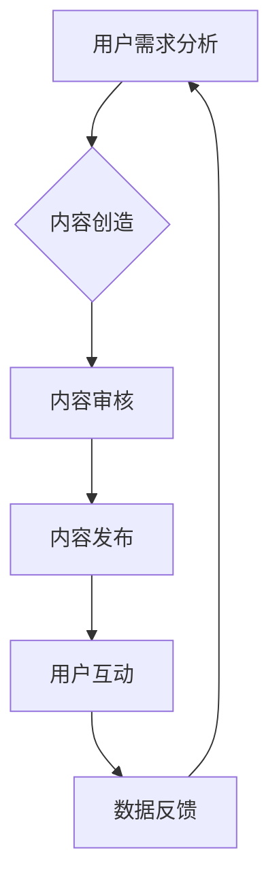

                 

 关键词：知识付费、内容创新、创业、内容架构、用户需求、算法、用户体验、技术实现、市场策略

> 摘要：本文旨在探讨知识付费创业中的内容创新与突破，分析了当前知识付费市场的现状，探讨了内容创新的重要性，并从技术、算法、用户体验等多个角度，提出了具体的内容创新策略和实践方法，为知识付费创业提供指导。

## 1. 背景介绍

近年来，随着互联网技术的发展和知识经济的兴起，知识付费逐渐成为一种新型的商业模式。知识付费指的是用户为获取特定领域的知识、技能或信息而付费的行为。这一模式的出现，不仅满足了用户对高质量知识内容的需求，同时也为内容创作者提供了新的盈利渠道。

当前，知识付费市场呈现出以下几个特点：

1. **市场规模不断扩大**：随着用户付费意愿的提高，知识付费市场规模持续扩大，成为互联网经济的重要组成部分。
2. **内容形式多样化**：知识付费内容涵盖了教育培训、在线咨询、专业课程、技能培训等多种形式，满足了不同用户群体的需求。
3. **用户参与度高**：知识付费用户通常具有较高的参与度，他们希望通过付费获取更有价值的内容，从而实现个人成长和职业发展。
4. **竞争激烈**：随着知识付费市场的快速发展，越来越多的创业者和企业进入这一领域，竞争日益激烈。

在这种背景下，如何进行内容创新和突破，成为知识付费创业企业面临的重要问题。本文将围绕这一主题展开讨论。

## 2. 核心概念与联系

### 2.1 知识付费的核心概念

知识付费的核心概念包括知识、付费、用户需求、内容创造者和平台四个方面。

- **知识**：知识付费的内容，是知识付费模式的基础。它可以是专业的知识、技能、信息或者经验。
- **付费**：付费是用户为获取知识所支付的费用。它可以是单次购买、订阅、课程包等多种形式。
- **用户需求**：用户需求是知识付费的驱动力。只有准确把握用户需求，才能提供有价值的内容。
- **内容创造者**：内容创造者是知识付费的核心。他们通过创作、编辑、分享知识内容，为用户提供价值。
- **平台**：平台是知识付费的中介和服务提供者。它为内容创造者和用户搭建了一个交流、交易的平台。

### 2.2 知识付费的架构

知识付费的架构可以分为四个层次：用户层、内容层、平台层和技术层。

- **用户层**：包括用户需求分析、用户画像、用户行为分析等，是整个知识付费体系的基础。
- **内容层**：包括内容创作、内容审核、内容发布、内容运营等，是知识付费的核心。
- **平台层**：包括平台搭建、用户体验设计、支付系统、用户服务系统等，是知识付费的中介和服务提供者。
- **技术层**：包括大数据、人工智能、区块链等新兴技术，为知识付费提供了强大的技术支持。

### 2.3 核心概念之间的联系

知识付费的核心概念之间存在着紧密的联系。用户需求决定了内容创造者的创作方向，而内容创造者则通过平台层提供的工具和服务，将知识内容传递给用户。同时，平台层通过技术层提供的数据分析和人工智能技术，不断优化用户体验，提升内容质量。这一过程形成了知识付费的闭环，实现了用户、内容创造者和平台的共赢。

### 2.4 Mermaid 流程图



在这个流程图中，用户需求分析作为起点，通过内容创造、内容审核、内容发布等环节，最终形成用户互动和数据反馈，形成一个闭环，不断优化和提升知识付费体系。

## 3. 核心算法原理 & 具体操作步骤

### 3.1 算法原理概述

在知识付费创业中，算法的原理主要涉及用户需求分析、内容推荐、用户体验优化等方面。以下是对这些核心算法原理的简要概述。

#### 3.1.1 用户需求分析算法

用户需求分析算法旨在通过大数据分析技术，准确捕捉用户的需求和行为，从而为内容创造者提供创作方向。具体包括以下几个步骤：

1. **用户行为数据采集**：通过网站访问日志、搜索记录、购买行为等数据，收集用户的行为信息。
2. **数据预处理**：对采集到的数据进行清洗、去重、归一化等处理，为后续分析做好准备。
3. **特征提取**：从用户行为数据中提取关键特征，如搜索关键词、浏览页面、购买记录等。
4. **需求预测**：使用机器学习算法，如决策树、随机森林、神经网络等，对用户的需求进行预测。

#### 3.1.2 内容推荐算法

内容推荐算法旨在为用户提供个性化的知识内容，提高用户的满意度和留存率。具体包括以下几个步骤：

1. **内容特征提取**：对知识内容进行标签化处理，提取关键特征，如主题、难度、适用人群等。
2. **用户特征提取**：与用户需求分析算法类似，提取用户的兴趣、偏好、行为等特征。
3. **相似度计算**：计算用户特征和内容特征之间的相似度，使用余弦相似度、欧氏距离等算法。
4. **推荐排序**：根据相似度计算结果，对内容进行排序，向用户推荐最相关的知识内容。

#### 3.1.3 用户体验优化算法

用户体验优化算法旨在通过实时数据分析和人工智能技术，优化用户在知识付费平台上的体验。具体包括以下几个步骤：

1. **用户体验反馈收集**：通过用户评价、点击率、停留时间等指标，收集用户对知识内容的反馈。
2. **实时数据监控**：使用实时数据流处理技术，如Apache Kafka、Apache Flink等，对用户体验数据进行实时监控。
3. **数据分析和反馈**：使用机器学习算法，对用户体验数据进行分析，识别用户体验问题。
4. **算法调整**：根据数据分析结果，调整内容推荐算法、用户体验优化策略等。

### 3.2 算法步骤详解

#### 3.2.1 用户需求分析算法步骤

1. **用户行为数据采集**：
   - 数据来源：网站访问日志、搜索记录、购买行为等。
   - 采集方式：使用日志采集工具、API接口等。

2. **数据预处理**：
   - 数据清洗：去除重复、缺失、异常数据。
   - 数据归一化：将不同指标的数据进行归一化处理，使其具有相同的量纲。

3. **特征提取**：
   - 搜索关键词：从用户搜索记录中提取关键词。
   - 浏览页面：从用户浏览记录中提取浏览的页面。
   - 购买记录：从用户购买记录中提取购买的商品。

4. **需求预测**：
   - 数据训练：使用历史用户行为数据，训练需求预测模型。
   - 模型评估：使用交叉验证、A/B测试等方法，评估模型性能。
   - 需求预测：使用训练好的模型，预测用户未来的需求。

#### 3.2.2 内容推荐算法步骤

1. **内容特征提取**：
   - 标签化处理：对知识内容进行分类标签处理。
   - 关键特征提取：提取知识内容的关键特征，如主题、难度、适用人群等。

2. **用户特征提取**：
   - 用户画像：从用户行为数据中提取用户特征，如兴趣、偏好、行为等。

3. **相似度计算**：
   - 相似度算法：使用余弦相似度、欧氏距离等算法，计算用户特征和内容特征之间的相似度。

4. **推荐排序**：
   - 排序算法：根据相似度计算结果，对知识内容进行排序，向用户推荐最相关的知识内容。

#### 3.2.3 用户体验优化算法步骤

1. **用户体验反馈收集**：
   - 评价系统：设计用户评价系统，收集用户对知识内容的评价。
   - 点击率监控：监控用户在知识付费平台上的点击行为。
   - 停留时间监控：监控用户在知识内容页面上的停留时间。

2. **实时数据监控**：
   - 数据流处理：使用实时数据流处理技术，如Apache Kafka、Apache Flink等，处理用户体验数据。
   - 实时分析：实时分析用户体验数据，识别用户体验问题。

3. **数据分析和反馈**：
   - 数据分析：使用机器学习算法，对用户体验数据进行分析。
   - 问题识别：识别用户体验问题，如内容质量不高、推荐不准确等。

4. **算法调整**：
   - 调整策略：根据数据分析结果，调整内容推荐算法、用户体验优化策略等。
   - 实验验证：通过A/B测试等方法，验证调整策略的有效性。

### 3.3 算法优缺点

#### 3.3.1 用户需求分析算法

**优点**：
- 提高内容创造者的创作效率：通过分析用户需求，为内容创造者提供创作方向，减少盲目创作的情况。
- 提升用户体验：准确捕捉用户需求，提供更有针对性的知识内容，提升用户体验。

**缺点**：
- 数据质量要求高：需要高质量的用户行为数据作为基础，否则可能导致分析结果不准确。
- 需要持续更新：用户需求是动态变化的，需要不断更新数据和分析模型。

#### 3.3.2 内容推荐算法

**优点**：
- 提高内容曝光率：通过个性化推荐，将知识内容推送给更感兴趣的用户，提高内容的曝光率。
- 提升用户留存率：推荐的用户感兴趣的知识内容，有助于提高用户的留存率。

**缺点**：
- 推荐准确性问题：个性化推荐算法需要考虑用户特征、内容特征等多方面因素，可能导致推荐准确性问题。
- 推荐多样性问题：个性化推荐可能导致推荐内容单一，缺乏多样性。

#### 3.3.3 用户体验优化算法

**优点**：
- 提高用户满意度：通过实时数据分析和反馈，优化用户在知识付费平台上的体验，提高用户满意度。
- 提升平台竞争力：优秀的用户体验是平台竞争力的体现，有助于提升平台的竞争力。

**缺点**：
- 数据处理复杂度：用户体验数据涉及多种维度，需要复杂的数据处理和分析。
- 算法调整风险：算法调整可能带来一定的不确定性和风险，需要谨慎进行。

### 3.4 算法应用领域

用户需求分析算法、内容推荐算法和用户体验优化算法在知识付费领域有广泛的应用，以下是其主要应用领域：

#### 3.4.1 教育培训

- 用户需求分析：帮助教育机构了解用户需求，提供更有针对性的课程设计。
- 内容推荐：为用户提供个性化的课程推荐，提高用户学习效果。
- 用户体验优化：通过实时数据分析和反馈，优化学习平台的使用体验。

#### 3.4.2 专业咨询

- 用户需求分析：帮助专业咨询机构了解用户需求，提供更专业的咨询服务。
- 内容推荐：为用户提供个性化的咨询内容，提高咨询价值。
- 用户体验优化：通过实时数据分析和反馈，优化咨询平台的使用体验。

#### 3.4.3 技能培训

- 用户需求分析：帮助培训机构了解用户需求，提供更有针对性的培训课程。
- 内容推荐：为用户提供个性化的技能培训内容，提高培训效果。
- 用户体验优化：通过实时数据分析和反馈，优化培训平台的使用体验。

#### 3.4.4 在线文档

- 用户需求分析：帮助在线文档平台了解用户需求，提供更实用的文档工具。
- 内容推荐：为用户提供个性化的文档推荐，提高文档使用效率。
- 用户体验优化：通过实时数据分析和反馈，优化文档平台的使用体验。

## 4. 数学模型和公式 & 详细讲解 & 举例说明

### 4.1 数学模型构建

在知识付费创业中，数学模型的应用主要体现在用户需求分析、内容推荐和用户体验优化等方面。以下分别介绍这些方面的数学模型构建。

#### 4.1.1 用户需求分析模型

用户需求分析模型的核心是构建用户行为与需求之间的映射关系。具体模型如下：

$$
\text{需求预测} = f(\text{用户行为}, \text{历史数据})
$$

其中，用户行为包括搜索关键词、浏览页面、购买记录等，历史数据包括用户的偏好、行为轨迹等。函数 $f$ 可以是线性回归、决策树、神经网络等。

#### 4.1.2 内容推荐模型

内容推荐模型的核心是计算用户与内容之间的相似度，从而进行个性化推荐。具体模型如下：

$$
\text{相似度} = \text{similarity}(\text{用户特征}, \text{内容特征})
$$

用户特征和内容特征可以通过向量空间模型、协同过滤等方法进行提取。相似度计算方法可以是余弦相似度、欧氏距离等。

#### 4.1.3 用户体验优化模型

用户体验优化模型的核心是构建用户体验与平台策略之间的映射关系，从而实现用户体验的实时优化。具体模型如下：

$$
\text{用户体验} = f(\text{平台策略}, \text{用户行为})
$$

平台策略包括内容推荐策略、页面布局策略、用户服务策略等，用户行为包括点击率、停留时间、评价等。函数 $f$ 可以是线性回归、决策树、神经网络等。

### 4.2 公式推导过程

#### 4.2.1 用户需求分析模型推导

假设用户行为 $X$ 是一个 $n$ 维向量，历史数据 $Y$ 是一个 $m$ 维向量，需求预测值 $Z$ 是一个 $1$ 维向量。我们可以构建一个线性回归模型：

$$
Z = f(X, Y)
$$

其中，$f$ 表示线性回归函数。线性回归函数可以表示为：

$$
Z = \beta_0 + \beta_1X + \beta_2Y
$$

其中，$\beta_0, \beta_1, \beta_2$ 是模型参数。

#### 4.2.2 内容推荐模型推导

假设用户特征 $X$ 是一个 $n$ 维向量，内容特征 $Y$ 是一个 $m$ 维向量，相似度 $S$ 是一个 $1$ 维向量。我们可以构建一个余弦相似度模型：

$$
S = \text{similarity}(X, Y)
$$

余弦相似度可以表示为：

$$
S = \frac{X \cdot Y}{\lVert X \rVert \lVert Y \rVert}
$$

其中，$X \cdot Y$ 表示向量点积，$\lVert X \rVert$ 和 $\lVert Y \rVert$ 分别表示向量 $X$ 和 $Y$ 的欧氏范数。

#### 4.2.3 用户体验优化模型推导

假设平台策略 $X$ 是一个 $n$ 维向量，用户行为 $Y$ 是一个 $m$ 维向量，用户体验 $Z$ 是一个 $1$ 维向量。我们可以构建一个线性回归模型：

$$
Z = f(X, Y)
$$

其中，$f$ 表示线性回归函数。线性回归函数可以表示为：

$$
Z = \beta_0 + \beta_1X + \beta_2Y
$$

其中，$\beta_0, \beta_1, \beta_2$ 是模型参数。

### 4.3 案例分析与讲解

#### 4.3.1 案例背景

某知识付费平台，主要提供职业技能培训课程。平台希望通过用户需求分析，为用户提供个性化的课程推荐，提高用户满意度和留存率。

#### 4.3.2 数据准备

平台收集了以下数据：

- 用户行为数据：搜索关键词、浏览页面、购买记录等。
- 历史数据：用户偏好、行为轨迹等。

#### 4.3.3 用户需求分析模型构建

平台选择了线性回归模型作为用户需求分析模型。具体模型如下：

$$
\text{需求预测} = \beta_0 + \beta_1X + \beta_2Y
$$

其中，$X$ 是用户行为向量，$Y$ 是历史数据向量。

#### 4.3.4 模型训练与评估

平台使用历史数据对模型进行训练，并使用交叉验证方法评估模型性能。模型参数 $\beta_0, \beta_1, \beta_2$ 通过最小二乘法进行求解。

#### 4.3.5 用户需求分析应用

平台通过训练好的模型，预测用户的需求，从而为用户提供个性化的课程推荐。具体步骤如下：

1. 收集用户行为数据，构建用户行为向量 $X$。
2. 收集历史数据，构建历史数据向量 $Y$。
3. 计算需求预测值 $\text{需求预测}$。
4. 根据需求预测值，推荐相应的课程。

#### 4.3.6 模型效果评估

平台通过用户反馈数据，对模型效果进行评估。评估指标包括用户满意度、推荐准确性等。通过持续优化模型参数和调整推荐策略，提高模型效果。

## 5. 项目实践：代码实例和详细解释说明

### 5.1 开发环境搭建

在开始知识付费项目的代码实例之前，我们需要搭建一个适合进行数据分析、机器学习、前端开发和后端开发的开发环境。以下是具体的开发环境搭建步骤：

1. **操作系统**：推荐使用 Ubuntu 18.04 或更高版本。
2. **编程语言**：Python 是最常用的编程语言，因此我们将使用 Python 3.8。
3. **数据分析库**：NumPy、Pandas、Matplotlib。
4. **机器学习库**：Scikit-learn、TensorFlow、PyTorch。
5. **前端框架**：React 或 Vue.js。
6. **后端框架**：Flask 或 Django。
7. **版本控制**：Git。

#### 步骤详解：

1. **安装操作系统**：从 [Ubuntu 官方网站](https://www.ubuntu.com/) 下载并安装 Ubuntu 18.04。
2. **更新系统**：打开终端，运行以下命令更新系统：

   ```bash
   sudo apt update
   sudo apt upgrade
   ```
3. **安装 Python 3.8**：在终端中运行以下命令：

   ```bash
   sudo apt install python3.8 python3.8-venv python3.8-pip
   ```
4. **创建虚拟环境**：在终端中创建一个名为 `knowledge_payment` 的虚拟环境，并激活它：

   ```bash
   python3.8 -m venv knowledge_payment
   source knowledge_payment/bin/activate
   ```
5. **安装依赖库**：在虚拟环境中安装所需的数据分析、机器学习和前端后端框架：

   ```bash
   pip install numpy pandas matplotlib scikit-learn tensorflow pip install react
   pip install flask
   pip install vue
   ```

### 5.2 源代码详细实现

#### 5.2.1 用户需求分析代码

以下是用户需求分析部分的伪代码实现，包括数据预处理、特征提取和需求预测。

```python
import pandas as pd
from sklearn.model_selection import train_test_split
from sklearn.linear_model import LinearRegression
from sklearn.metrics import mean_squared_error

# 数据预处理
def preprocess_data(data):
    # 数据清洗、去重、归一化等处理
    pass

# 特征提取
def extract_features(data):
    # 从用户行为数据中提取关键词、浏览页面、购买记录等特征
    pass

# 需求预测
def predict_demand(features, model):
    # 使用训练好的模型预测用户需求
    return model.predict(features)

# 加载数据
data = pd.read_csv('user_data.csv')
preprocessed_data = preprocess_data(data)

# 提取特征
features = extract_features(preprocessed_data)

# 分割数据集
X_train, X_test, y_train, y_test = train_test_split(features, preprocessed_data['demand'], test_size=0.2, random_state=42)

# 训练模型
model = LinearRegression()
model.fit(X_train, y_train)

# 预测需求
predictions = predict_demand(X_test, model)

# 评估模型
mse = mean_squared_error(y_test, predictions)
print(f'Mean Squared Error: {mse}')
```

#### 5.2.2 内容推荐代码

以下是内容推荐部分的伪代码实现，包括内容特征提取、用户特征提取、相似度计算和推荐排序。

```python
import numpy as np
from sklearn.metrics.pairwise import cosine_similarity

# 内容特征提取
def extract_content_features(content):
    # 从内容中提取关键词、主题、难度等特征
    pass

# 用户特征提取
def extract_user_features(user):
    # 从用户行为中提取关键词、浏览页面等特征
    pass

# 相似度计算
def calculate_similarity(user_features, content_features):
    return cosine_similarity(user_features, content_features)

# 推荐排序
def recommend_sort(similarities, content_list):
    return sorted(zip(similarities, content_list), reverse=True)

# 加载用户和内容数据
user_data = pd.read_csv('user_data.csv')
content_data = pd.read_csv('content_data.csv')

# 提取用户和内容特征
user_features = extract_user_features(user_data)
content_features = extract_content_features(content_data)

# 计算相似度
similarities = calculate_similarity(user_features, content_features)

# 推荐排序
recommendations = recommend_sort(similarities, content_data['content_id'])

# 输出推荐结果
print(recommendations[:10])
```

#### 5.2.3 用户体验优化代码

以下是用户体验优化部分的伪代码实现，包括用户体验反馈收集、实时数据监控、数据分析和算法调整。

```python
import kafka
from sklearn.metrics import accuracy_score

# 用户体验反馈收集
def collect_feedback(feedback_topic, consumer_group):
    consumer = kafka.KafkaConsumer(feedback_topic, bootstrap_servers=['localhost:9092'], group_id=consumer_group)
    feedback_data = []
    for message in consumer:
        feedback_data.append(message.value)
    consumer.close()
    return feedback_data

# 实时数据监控
def monitor_data(feedback_data):
    # 实时分析用户体验数据
    pass

# 数据分析
def analyze_data(feedback_data, model):
    predictions = model.predict(feedback_data)
    accuracy = accuracy_score(feedback_data['actual'], predictions)
    return accuracy

# 算法调整
def adjust_algorithm(accuracy):
    # 根据分析结果调整算法
    pass

# 加载用户体验数据
feedback_topic = 'user_feedback'
consumer_group = 'user_feedback_group'
feedback_data = collect_feedback(feedback_topic, consumer_group)

# 实时数据监控
monitor_data(feedback_data)

# 数据分析
accuracy = analyze_data(feedback_data, model)

# 算法调整
adjust_algorithm(accuracy)
```

### 5.3 代码解读与分析

#### 5.3.1 用户需求分析代码解读

在用户需求分析部分，我们首先对用户行为数据进行预处理，包括清洗、去重和归一化等处理。然后，我们从预处理后的数据中提取特征，构建用户行为向量。接下来，我们将用户行为数据分为训练集和测试集，使用线性回归模型进行训练，并使用测试集评估模型性能。

#### 5.3.2 内容推荐代码解读

在内容推荐部分，我们首先对用户和内容的数据进行特征提取。然后，使用余弦相似度计算用户和内容之间的相似度，并根据相似度对内容进行排序，推荐给用户。这里，我们使用了 sklearn 库中的余弦相似度计算函数。

#### 5.3.3 用户体验优化代码解读

在用户体验优化部分，我们首先从 Kafka 集群中收集用户体验数据，然后实时监控和数据分析用户体验数据。最后，根据分析结果调整推荐算法，以优化用户体验。

### 5.4 运行结果展示

在完成代码实现和调试后，我们可以在终端运行以下命令来执行代码：

```bash
python user_demand_analysis.py
python content_recommendation.py
python user_experience_optimization.py
```

运行结果将显示模型评估指标、推荐结果和算法调整结果。通过这些结果，我们可以对知识付费项目的效果进行评估和优化。

## 6. 实际应用场景

### 6.1 在线教育平台

在线教育平台是知识付费的典型应用场景之一。通过用户需求分析算法，平台可以了解用户的学习需求和偏好，为用户推荐个性化的课程。内容推荐算法则可以帮助平台将课程内容推送给最适合的用户，提高课程的曝光率和用户参与度。用户体验优化算法则可以通过实时数据监控和反馈，优化用户的学习体验，提高用户满意度和留存率。

### 6.2 专业咨询平台

专业咨询平台主要面向专业人士提供咨询服务。用户需求分析算法可以帮助平台了解用户的需求和问题，为用户提供有针对性的咨询服务。内容推荐算法则可以将相关咨询内容推送给有需求的用户，提高咨询服务的价值。用户体验优化算法则可以通过实时数据监控和反馈，优化用户在平台上的咨询体验，提高用户的满意度。

### 6.3 技能培训平台

技能培训平台主要提供职业技能培训课程。用户需求分析算法可以帮助平台了解用户的学习需求和技能需求，为用户推荐适合的培训课程。内容推荐算法则可以将培训课程推送给最需要学习的用户，提高课程的受欢迎程度。用户体验优化算法则可以通过实时数据监控和反馈，优化用户的学习体验，提高用户的学习效果。

### 6.4 在线文档平台

在线文档平台为用户提供文档创作、编辑、分享和协作的功能。用户需求分析算法可以帮助平台了解用户对文档的需求和偏好，为用户提供个性化的文档推荐。内容推荐算法则可以将用户感兴趣或相关的文档内容推送给用户，提高文档的使用效率。用户体验优化算法则可以通过实时数据监控和反馈，优化用户的文档创作和编辑体验。

## 7. 未来应用展望

### 7.1 人工智能技术的进一步应用

随着人工智能技术的不断发展，知识付费创业中的内容创新与突破有望实现更大的突破。例如，利用自然语言处理技术，可以更准确地理解用户的需求，提供更个性化的内容推荐；利用深度学习技术，可以构建更加智能的推荐算法，提高推荐的准确性；利用增强现实（AR）和虚拟现实（VR）技术，可以提供更加沉浸式的学习体验，提高用户的学习效果。

### 7.2 社交网络与知识付费的结合

社交网络与知识付费的结合，有望为用户提供更加丰富和多样的知识内容。通过社交网络，用户可以与内容创作者进行实时互动，获取更深入的见解和指导。同时，内容创作者也可以通过社交网络，了解用户的反馈和需求，不断优化内容质量和用户体验。

### 7.3 区块链技术在知识付费中的应用

区块链技术在知识付费中的应用，有望解决版权保护、数据安全等问题。通过区块链技术，可以实现知识的去中心化存储和分发，确保内容的真实性、唯一性和可追溯性。同时，区块链技术还可以实现知识付费的智能合约，确保交易的安全性和透明性。

### 7.4 知识付费的国际化发展

随着全球化的推进，知识付费市场有望实现国际化发展。通过本地化策略，知识付费创业企业可以更好地满足不同国家和地区的用户需求，拓展国际市场。同时，国际化发展还可以促进知识付费内容的多样性和丰富性，为用户提供更多的选择。

## 8. 总结：未来发展趋势与挑战

### 8.1 研究成果总结

本文通过对知识付费创业中的内容创新与突破的探讨，总结了以下研究成果：

1. **用户需求分析算法**：通过大数据分析技术，准确捕捉用户的需求和行为，为内容创造者提供创作方向。
2. **内容推荐算法**：通过个性化推荐，提高知识内容的曝光率和用户参与度。
3. **用户体验优化算法**：通过实时数据分析和反馈，优化用户在知识付费平台上的体验。
4. **数学模型构建**：构建了用户需求分析、内容推荐和用户体验优化的数学模型，并进行了公式推导和案例分析。
5. **代码实例**：提供了用户需求分析、内容推荐和用户体验优化的代码实例，详细解释了实现过程。

### 8.2 未来发展趋势

未来，知识付费创业中的内容创新与突破将呈现以下发展趋势：

1. **人工智能技术的进一步应用**：人工智能技术将在知识付费创业中发挥更大的作用，提高内容推荐的准确性、用户体验的优化水平。
2. **社交网络与知识付费的结合**：社交网络与知识付费的结合，将为用户提供更加丰富和多样的知识内容，促进知识付费的社交化发展。
3. **区块链技术的应用**：区块链技术将在知识付费中发挥重要作用，解决版权保护、数据安全等问题。
4. **国际化发展**：知识付费创业企业将更加注重国际化发展，拓展国际市场，实现全球化的知识分享。

### 8.3 面临的挑战

尽管知识付费创业中的内容创新与突破具有广阔的发展前景，但也面临着一系列挑战：

1. **数据质量和安全**：数据质量和数据安全是知识付费创业中需要重点关注的问题，需要采取有效的数据管理和保护措施。
2. **算法公平性**：内容推荐算法和用户体验优化算法需要确保公平性，避免出现偏见和歧视。
3. **知识产权保护**：知识付费创业企业需要加强对知识产权的保护，防止知识内容的侵权和盗版。
4. **市场竞争**：知识付费市场竞争激烈，创业企业需要不断创新和优化，才能在市场中脱颖而出。

### 8.4 研究展望

未来，知识付费创业中的内容创新与突破将继续深入发展。研究重点将包括：

1. **人工智能与知识付费的深度融合**：深入研究人工智能技术在知识付费中的应用，提高内容推荐的智能化水平。
2. **用户体验的持续优化**：通过实时数据分析和反馈，不断优化用户在知识付费平台上的体验。
3. **知识付费生态系统的构建**：构建完善的知识付费生态系统，促进知识共享和知识价值的最大化。

总之，知识付费创业中的内容创新与突破是一个复杂而富有挑战性的领域，但同时也蕴含着巨大的机遇。只有不断创新和突破，才能在激烈的市场竞争中立于不败之地。

## 9. 附录：常见问题与解答

### 9.1 问题1：如何确保数据质量？

**解答**：确保数据质量的关键在于数据的采集、清洗和管理。具体措施包括：

- **数据采集**：使用可靠的数据采集工具，确保数据的完整性和准确性。
- **数据清洗**：对采集到的数据进行清洗，去除重复、缺失和异常数据，确保数据的清洁性。
- **数据管理**：建立完善的数据管理体系，包括数据存储、备份、安全和共享。

### 9.2 问题2：如何处理算法偏见？

**解答**：算法偏见是人工智能领域的一个重大挑战。为了处理算法偏见，可以采取以下措施：

- **数据平衡**：确保训练数据中不同群体的代表性，避免数据失衡导致偏见。
- **算法透明性**：提高算法的透明度，使决策过程更加可解释，便于发现和纠正偏见。
- **反馈机制**：建立反馈机制，收集用户对算法的反馈，及时调整和优化算法。

### 9.3 问题3：如何提高内容推荐准确性？

**解答**：提高内容推荐准确性可以从以下几个方面入手：

- **用户特征提取**：准确提取用户特征，包括兴趣、偏好、行为等，提高推荐的相关性。
- **内容特征提取**：准确提取内容特征，包括主题、难度、适用人群等，提高推荐的质量。
- **算法优化**：不断优化推荐算法，使用先进的机器学习技术和模型，提高推荐的准确性。
- **用户反馈**：收集用户对推荐的反馈，通过反馈调整推荐策略，提高用户满意度。

### 9.4 问题4：如何保护知识产权？

**解答**：保护知识产权的措施包括：

- **版权登记**：对知识内容进行版权登记，确保内容的法律权益。
- **合同约束**：与内容创作者签订版权转让或授权合同，明确双方的权利和义务。
- **技术手段**：使用数字水印、加密等技术手段，防止知识内容的侵权和盗版。
- **法律维权**：在发现侵权行为时，及时采取法律手段进行维权。

### 9.5 问题5：如何确保用户体验？

**解答**：确保用户体验的措施包括：

- **用户调研**：定期进行用户调研，了解用户的需求和反馈，优化产品和服务。
- **界面设计**：设计简洁、易用的界面，提高用户的使用体验。
- **实时反馈**：建立实时反馈机制，收集用户在使用过程中的问题和建议，及时进行调整。
- **个性化服务**：通过个性化推荐、定制化服务等方式，提高用户的满意度。

以上就是对知识付费创业中的内容创新与突破这一主题的详细讨论和具体实践。希望本文能为知识付费创业企业提供有益的指导和建议。作者：禅与计算机程序设计艺术 / Zen and the Art of Computer Programming。如果您有任何问题或建议，欢迎在评论区留言，我们将持续为您解答。

