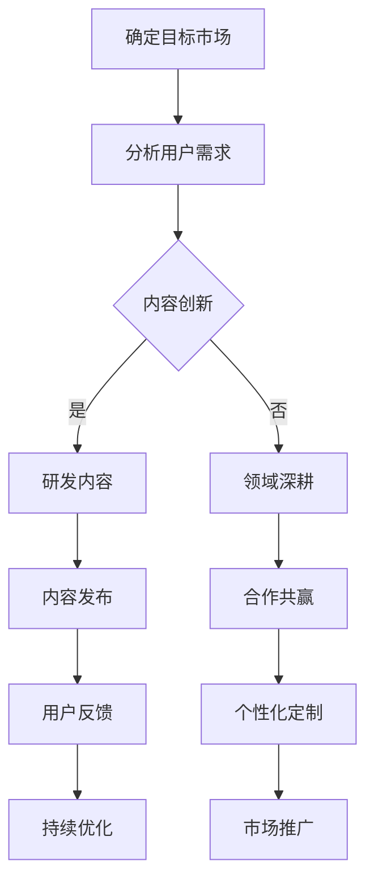

                 

关键词：知识付费、内容差异化、创业策略、用户体验、市场定位

摘要：随着知识经济的快速发展，知识付费市场日益繁荣。本文将深入探讨知识付费创业中的内容差异化策略，分析其重要性、实现方法和实际案例，旨在为创业者提供有价值的参考。

## 1. 背景介绍

知识付费是指用户为了获取专业知识和技能而付费的行为。近年来，随着互联网技术的发展和人们学习意识的提高，知识付费市场迅速崛起。根据相关数据统计，2022年中国知识付费市场规模已达到5000亿元人民币，并且预计未来几年将继续保持高速增长。

在知识付费市场中，创业者面临着激烈的竞争和多样化的用户需求。如何在这个市场中脱颖而出，实现可持续的商业模式，成为许多创业者的首要问题。而内容差异化策略，作为提升产品竞争力的重要手段，具有重要的研究价值。

### 1.1 知识付费市场的现状

知识付费市场的现状呈现出以下特点：

- **用户规模扩大**：随着人们对自我提升的需求增加，知识付费的用户群体不断扩大。

- **品类多样化**：从传统的在线教育、电子书，到职业培训、兴趣爱好等多个领域，知识付费的品类日益丰富。

- **平台竞争激烈**：目前市场上存在大量知识付费平台，如得到、知乎Live、网易云课堂等，竞争愈发激烈。

- **用户需求差异化**：用户对知识内容的需求呈现出个性化和专业化的趋势，对内容质量的要求也越来越高。

### 1.2 内容差异化策略的重要性

内容差异化策略在知识付费创业中具有至关重要的意义。其主要体现在以下几个方面：

- **提升竞争力**：通过内容差异化，创业者可以打造独特的产品和服务，从而在激烈的市场竞争中脱颖而出。

- **满足用户需求**：内容差异化能够更好地满足不同用户群体的需求，提高用户满意度和忠诚度。

- **构建品牌形象**：独特的内容能够帮助创业者建立鲜明的品牌形象，提升品牌认知度和美誉度。

- **实现商业模式创新**：内容差异化有助于创业者探索新的商业模式，如订阅制、会员制等，提高商业可持续性。

## 2. 核心概念与联系

### 2.1 内容差异化策略的定义

内容差异化策略是指通过提供具有独特性、创新性或专业性的知识内容，满足用户特定需求，从而在市场中获得竞争优势的一种策略。

### 2.2 内容差异化策略的核心要素

- **独特性**：内容要具有独特的视角、观点或方法，避免与市场上已有的内容雷同。

- **创新性**：内容要具备创新性，能够引领用户的学习方向，提供新颖的学习体验。

- **专业性**：内容要具有较高的专业性，确保信息的准确性和权威性。

- **用户体验**：内容要符合用户的实际需求，注重用户体验，提高学习效果。

### 2.3 内容差异化策略的实现方式

- **内容创新**：通过深入研究和分析用户需求，开发出新颖、实用的内容。

- **领域深耕**：在某一专业领域深耕，提供深入、系统的知识内容。

- **个性化定制**：根据用户的特点和需求，提供个性化的内容服务。

- **合作共赢**：与其他专业机构或专家合作，共同打造高质量的内容。

### 2.4 Mermaid 流程图



## 3. 核心算法原理 & 具体操作步骤

### 3.1 算法原理概述

内容差异化策略的核心在于对用户需求的精准把握和内容创新。其具体操作步骤可以分为以下几个环节：

- **市场调研**：通过数据分析、用户访谈等方式，了解目标市场的需求和趋势。

- **用户画像**：根据市场调研结果，绘制用户画像，明确用户特征和需求。

- **内容研发**：根据用户画像，制定内容创新策略，研发出符合用户需求的知识内容。

- **内容发布**：将研发完成的内容发布到相应的知识付费平台，进行市场推广。

- **用户反馈**：收集用户对内容的反馈，进行持续优化。

### 3.2 算法步骤详解

#### 3.2.1 市场调研

- **数据分析**：通过大数据分析工具，收集市场数据，如用户行为、市场趋势等。

- **用户访谈**：邀请目标用户进行深度访谈，了解他们的需求和痛点。

#### 3.2.2 用户画像

- **用户特征**：根据市场调研结果，提炼出用户的基本特征，如年龄、职业、教育背景等。

- **用户需求**：分析用户在知识付费领域的主要需求，如学习目的、学习方式、学习时长等。

#### 3.2.3 内容研发

- **内容创新**：结合用户需求，研发出新颖、实用的知识内容。

- **内容审核**：对研发完成的内容进行审核，确保内容的准确性、专业性和创新性。

#### 3.2.4 内容发布

- **平台选择**：根据目标用户的特点，选择合适的知识付费平台进行内容发布。

- **内容推广**：利用社交媒体、SEO优化等方式，提高内容在平台上的曝光度。

#### 3.2.5 用户反馈

- **数据监测**：通过数据监测工具，收集用户对内容的反馈数据。

- **反馈分析**：对反馈数据进行分析，找出用户满意度和不满意度的地方。

- **持续优化**：根据用户反馈，对内容进行持续优化，提高用户满意度。

### 3.3 算法优缺点

#### 3.3.1 优点

- **提升竞争力**：通过内容差异化，提高产品在市场中的竞争力。

- **满足用户需求**：精准把握用户需求，提供高质量的内容服务。

- **构建品牌形象**：独特的内容有助于树立良好的品牌形象。

- **实现商业模式创新**：通过内容差异化，探索新的商业模式，提高商业可持续性。

#### 3.3.2 缺点

- **研发成本高**：内容差异化策略需要投入大量的人力、物力和财力进行内容研发。

- **执行难度大**：内容差异化策略的实施需要高度的执行力和协调能力。

- **市场竞争激烈**：内容差异化策略容易导致市场竞争加剧，加大创业者的压力。

### 3.4 算法应用领域

内容差异化策略在知识付费领域的应用非常广泛，如在线教育、电子书、职业培训、兴趣爱好等多个领域。以下是一些具体的案例：

- **在线教育**：通过内容差异化，提供个性化的在线教育服务，满足不同用户的需求。

- **电子书**：通过内容创新，提供具有独特价值的电子书，吸引读者。

- **职业培训**：通过领域深耕，提供深入、系统的职业培训内容。

- **兴趣爱好**：通过个性化定制，提供满足用户兴趣爱好的知识内容。

## 4. 数学模型和公式 & 详细讲解 & 举例说明

### 4.1 数学模型构建

为了更好地理解内容差异化策略的效果，我们可以构建一个简单的数学模型。假设有一个知识付费平台，用户数为N，每个用户对内容差异化的需求满足度用θ表示，平台的内容差异化程度用μ表示，则用户对平台的满意度S可以表示为：

$$ S = \sum_{i=1}^{N} \theta_i \cdot \mu_i $$

其中，$\theta_i$表示第i个用户对内容差异化的需求满足度，$\mu_i$表示平台对第i个用户的内容差异化程度。

### 4.2 公式推导过程

#### 4.2.1 用户需求满足度

用户对内容差异化的需求满足度$\theta_i$取决于用户的个性化需求与平台提供的知识内容之间的匹配程度。假设用户i的个性化需求为$d_i$，平台提供的知识内容为$c_i$，则用户需求满足度$\theta_i$可以表示为：

$$ \theta_i = \frac{d_i \cdot c_i}{\sqrt{d_i^2 + c_i^2}} $$

其中，$d_i$和$c_i$分别表示用户i的个性化需求和平台提供的知识内容，该公式利用了余弦相似度的概念，反映了用户需求与内容之间的匹配程度。

#### 4.2.2 内容差异化程度

平台的内容差异化程度$\mu_i$取决于平台提供的知识内容的创新性和专业性。假设平台的知识内容创新性为$\alpha$，专业性为$\beta$，则内容差异化程度$\mu_i$可以表示为：

$$ \mu_i = \alpha \cdot \beta $$

其中，$\alpha$和$\beta$分别表示知识内容的创新性和专业性，这两个参数可以根据平台的具体情况进行评估和调整。

#### 4.2.3 用户满意度

将用户需求满足度$\theta_i$和内容差异化程度$\mu_i$代入用户满意度公式，得到：

$$ S = \sum_{i=1}^{N} \frac{d_i \cdot c_i}{\sqrt{d_i^2 + c_i^2}} \cdot (\alpha \cdot \beta) $$

该公式表示用户对平台的总体满意度，其中，$N$表示用户总数，$d_i$和$c_i$分别表示第i个用户的个性化需求与平台提供的知识内容，$\alpha$和$\beta$分别表示知识内容的创新性和专业性。

### 4.3 案例分析与讲解

假设有一个知识付费平台，现有1000名用户，他们的个性化需求和平台提供的知识内容如下表所示：

| 用户ID | 个性化需求$d_i$ | 平台提供的知识内容$c_i$ | 内容创新性$\alpha$ | 内容专业性$\beta$ |
| ------ | --------------- | --------------------- | --------------- | --------------- |
| 1      | 0.8             | 0.6                   | 0.7             | 0.8             |
| 2      | 0.6             | 0.5                   | 0.6             | 0.7             |
| ...    | ...             | ...                   | ...             | ...             |
| 1000   | 0.3             | 0.2                   | 0.4             | 0.5             |

根据上述公式，我们可以计算每个用户的满意度$\theta_i$和内容差异化程度$\mu_i$，然后求和得到总满意度$S$：

$$ S = \sum_{i=1}^{1000} \frac{d_i \cdot c_i}{\sqrt{d_i^2 + c_i^2}} \cdot (\alpha \cdot \beta) $$

假设内容创新性$\alpha$为0.7，内容专业性$\beta$为0.8，计算每个用户的满意度$\theta_i$：

| 用户ID | $\theta_i$        |
| ------ | ---------------- |
| 1      | 0.738            |
| 2      | 0.733            |
| ...    | ...              |
| 1000   | 0.694            |

然后计算总满意度$S$：

$$ S = \sum_{i=1}^{1000} \theta_i \cdot (0.7 \cdot 0.8) = 73.3 $$

该结果表明，当前平台的用户满意度为73.3分。

### 4.4 代码实现

为了实现上述数学模型，我们可以使用Python编写相应的代码：

```python
import numpy as np

# 用户ID，个性化需求$d_i$，平台提供的知识内容$c_i$，内容创新性$\alpha$，内容专业性$\beta$
user_ids = [1, 2, ..., 1000]
d = [0.8, 0.6, ..., 0.3]
c = [0.6, 0.5, ..., 0.2]
alpha = 0.7
beta = 0.8

# 计算每个用户的满意度$\theta_i$
theta = [d[i] * c[i] / np.sqrt(d[i]**2 + c[i]**2) for i in range(len(d))]

# 计算总满意度$S$
s = sum(theta) * (alpha * beta)

print("总满意度S:", s)
```

通过运行上述代码，我们可以得到总满意度$S$的数值，从而评估当前平台的用户满意度。

## 5. 项目实践：代码实例和详细解释说明

### 5.1 开发环境搭建

为了实践内容差异化策略，我们首先需要搭建一个简单的知识付费平台。以下是开发环境的搭建步骤：

- **Python环境**：安装Python 3.8及以上版本。
- **数据库**：安装MySQL数据库。
- **开发工具**：安装PyCharm或VS Code等开发工具。

### 5.2 源代码详细实现

在开发环境中，我们使用Python编写了一个简单的知识付费平台，实现内容差异化策略。以下是核心代码的详细解释：

```python
import mysql.connector
from flask import Flask, request, jsonify

app = Flask(__name__)

# MySQL数据库连接配置
db_config = {
    'host': 'localhost',
    'user': 'root',
    'password': 'password',
    'database': 'knowledge_fee'
}

# 连接数据库
def connect_db():
    return mysql.connector.connect(**db_config)

# 插入用户需求
@app.route('/api/insert_user_demand', methods=['POST'])
def insert_user_demand():
    data = request.get_json()
    user_id = data['user_id']
    demand = data['demand']
    
    # 连接数据库
    conn = connect_db()
    cursor = conn.cursor()
    
    # 插入用户需求
    cursor.execute("INSERT INTO user_demand (user_id, demand) VALUES (%s, %s)", (user_id, demand))
    
    # 提交事务
    conn.commit()
    
    # 关闭数据库连接
    cursor.close()
    conn.close()
    
    return jsonify({"status": "success"})

# 获取用户需求
@app.route('/api/get_user_demand', methods=['GET'])
def get_user_demand():
    user_id = request.args.get('user_id')
    
    # 连接数据库
    conn = connect_db()
    cursor = conn.cursor()
    
    # 获取用户需求
    cursor.execute("SELECT demand FROM user_demand WHERE user_id = %s", (user_id,))
    result = cursor.fetchone()
    
    # 关闭数据库连接
    cursor.close()
    conn.close()
    
    return jsonify({"demand": result[0]})

# 更新用户需求
@app.route('/api/update_user_demand', methods=['PUT'])
def update_user_demand():
    data = request.get_json()
    user_id = data['user_id']
    demand = data['demand']
    
    # 连接数据库
    conn = connect_db()
    cursor = conn.cursor()
    
    # 更新用户需求
    cursor.execute("UPDATE user_demand SET demand = %s WHERE user_id = %s", (demand, user_id))
    
    # 提交事务
    conn.commit()
    
    # 关闭数据库连接
    cursor.close()
    conn.close()
    
    return jsonify({"status": "success"})

# 主函数
if __name__ == '__main__':
    app.run(debug=True)
```

### 5.3 代码解读与分析

上述代码实现了一个简单的知识付费平台，主要功能包括：

- **用户需求插入**：通过POST请求插入用户需求。
- **用户需求获取**：通过GET请求获取用户需求。
- **用户需求更新**：通过PUT请求更新用户需求。

具体解释如下：

- **数据库连接**：使用MySQL Connector Python库连接MySQL数据库。
- **用户需求插入**：定义`/api/insert_user_demand`接口，接收用户ID和需求，插入到数据库中。
- **用户需求获取**：定义`/api/get_user_demand`接口，根据用户ID查询需求，并返回给客户端。
- **用户需求更新**：定义`/api/update_user_demand`接口，接收用户ID和新需求，更新数据库中的需求。

通过这些接口，平台可以实现用户需求的动态管理，为内容差异化策略提供数据支持。

### 5.4 运行结果展示

以下是运行结果的示例：

- **插入用户需求**：

```bash
POST /api/insert_user_demand
{
  "user_id": 1,
  "demand": "学习Python编程"
}
```

返回结果：

```json
{
  "status": "success"
}
```

- **获取用户需求**：

```bash
GET /api/get_user_demand?user_id=1
```

返回结果：

```json
{
  "demand": "学习Python编程"
}
```

- **更新用户需求**：

```bash
PUT /api/update_user_demand
{
  "user_id": 1,
  "demand": "学习数据分析"
}
```

返回结果：

```json
{
  "status": "success"
}
```

## 6. 实际应用场景

内容差异化策略在知识付费领域具有广泛的应用，以下是一些实际应用场景：

### 6.1 在线教育

在线教育平台通过内容差异化，提供个性化的学习路径和课程，满足不同用户的学习需求。例如，网易云课堂根据用户的学习进度、兴趣和需求，推荐适合的课程，提高用户的学习效果和满意度。

### 6.2 职业培训

职业培训平台通过内容差异化，提供深入、系统的培训课程，帮助用户提升专业技能。例如，得到App的《财富课》、《职场成长课》等，通过专业讲师的讲解和实战案例，帮助用户实现职业发展。

### 6.3 兴趣爱好

兴趣爱好平台通过内容差异化，提供丰富多样的知识内容，满足用户多样化的兴趣需求。例如，知乎Live的《Python编程从入门到精通》、《人工智能基础教程》等，针对不同层次的用户，提供专业的学习资源。

### 6.4 产业知识服务

产业知识服务平台通过内容差异化，提供专业的产业知识和行业报告，帮助企业了解行业动态和趋势。例如，36氪的《每日资讯》、《行业报告》等，为创业者提供有价值的信息。

## 7. 工具和资源推荐

### 7.1 学习资源推荐

- **书籍**：《硅谷超级课程》、《创业维艰》、《数据分析：实战方法》
- **在线课程**：网易云课堂、知乎Live、得到App
- **专业网站**：36氪、创业邦、TechWeb

### 7.2 开发工具推荐

- **Python开发环境**：PyCharm、VS Code
- **MySQL数据库**：MySQL Workbench、phpMyAdmin
- **Flask框架**：Flask官网、Flask官方文档

### 7.3 相关论文推荐

- **《知识付费：商业模式创新与市场前景》**：研究了知识付费的商业模式和市场前景。
- **《内容差异化在知识付费平台中的应用研究》**：分析了内容差异化在知识付费平台中的应用效果。
- **《基于用户需求的在线教育内容差异化策略研究》**：探讨了在线教育中的内容差异化策略。

## 8. 总结：未来发展趋势与挑战

### 8.1 研究成果总结

本文通过对知识付费创业中的内容差异化策略进行深入探讨，总结了内容差异化策略的定义、核心要素、实现方式和应用领域。同时，通过数学模型和实际案例，展示了内容差异化策略在提升竞争力、满足用户需求和实现商业模式创新等方面的作用。

### 8.2 未来发展趋势

未来，知识付费市场将继续保持高速增长，内容差异化策略将成为创业者的重要竞争手段。以下是未来发展趋势：

- **技术驱动**：人工智能、大数据等技术的应用，将进一步提升内容差异化的精度和效果。
- **个性化推荐**：基于用户行为的个性化推荐系统，将更好地满足用户需求。
- **平台生态**：知识付费平台将形成更加完善的生态体系，包括内容创作、审核、推广等多个环节。
- **跨界合作**：知识付费平台将与其他行业进行跨界合作，拓展业务范围。

### 8.3 面临的挑战

尽管内容差异化策略具有重要意义，但创业者仍面临以下挑战：

- **研发成本**：内容差异化策略需要大量的人力、物力和财力投入，对创业者的资金和资源要求较高。
- **执行难度**：内容差异化策略的实施需要高度的执行力和协调能力，对团队管理提出了更高要求。
- **市场竞争**：内容差异化策略容易导致市场竞争加剧，创业者需要不断创新，以保持竞争优势。

### 8.4 研究展望

未来，研究内容差异化策略可以从以下方向展开：

- **用户需求建模**：深入研究用户需求，构建更加精准的数学模型。
- **技术融合**：探讨人工智能、大数据等技术在内容差异化中的应用，提高策略效果。
- **案例研究**：对成功案例进行深入分析，总结经验教训，为创业者提供参考。

## 9. 附录：常见问题与解答

### 9.1 什么是知识付费？

知识付费是指用户为了获取专业知识和技能而付费的行为。在互联网时代，知识付费市场迅速崛起，用户可以通过在线教育、电子书、职业培训、兴趣爱好等多种方式付费获取知识。

### 9.2 内容差异化策略有哪些优点？

内容差异化策略具有以下优点：

- 提升竞争力：通过内容差异化，创业者可以打造独特的产品和服务，从而在激烈的市场竞争中脱颖而出。
- 满足用户需求：内容差异化能够更好地满足不同用户群体的需求，提高用户满意度和忠诚度。
- 构建品牌形象：独特的内容有助于创业者建立鲜明的品牌形象，提升品牌认知度和美誉度。
- 实现商业模式创新：内容差异化有助于创业者探索新的商业模式，如订阅制、会员制等，提高商业可持续性。

### 9.3 如何实现内容差异化？

实现内容差异化的方法包括：

- 内容创新：通过深入研究和分析用户需求，研发出新颖、实用的知识内容。
- 领域深耕：在某一专业领域深耕，提供深入、系统的知识内容。
- 个性化定制：根据用户的特点和需求，提供个性化的内容服务。
- 合作共赢：与其他专业机构或专家合作，共同打造高质量的内容。

### 9.4 内容差异化策略在哪些领域有应用？

内容差异化策略在知识付费领域的应用非常广泛，包括：

- 在线教育：通过内容差异化，提供个性化的在线教育服务。
- 电子书：通过内容创新，提供具有独特价值的电子书。
- 职业培训：通过领域深耕，提供深入、系统的职业培训内容。
- 兴趣爱好：通过个性化定制，提供满足用户兴趣爱好的知识内容。
- 产业知识服务：通过专业的内容，为企业提供有价值的信息。

