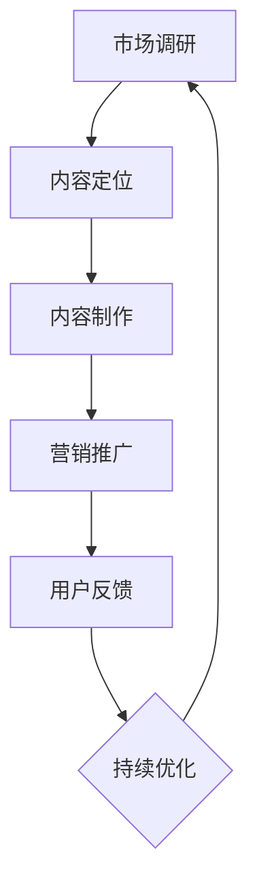

                 

关键词：知识付费、创业、内容差异化、策略、竞争优势、用户粘性

> 摘要：本文探讨了知识付费创业中内容差异化策略的重要性及其实现路径。通过对市场需求的深度分析，结合实际案例分析，本文总结了构建差异化内容的成功方法，并展望了知识付费行业的未来发展。

## 1. 背景介绍

随着互联网技术的飞速发展，知识付费已经成为知识传播和获取的重要途径。无论是线上课程、专业讲座，还是行业报告、研究报告，知识付费产品在市场上占据了越来越重要的地位。然而，随着市场竞争的加剧，同质化严重、质量参差不齐的问题也逐渐凸显。如何在激烈的市场竞争中脱颖而出，构建具有差异化的知识付费内容，成为创业者和内容提供商们亟待解决的问题。

本文旨在通过对知识付费创业中内容差异化策略的研究，探讨如何通过差异化策略来提升知识付费产品的竞争力，实现可持续发展。

### 1.1 知识付费市场现状

当前，知识付费市场呈现出以下几个特点：

- **用户基数庞大**：随着教育水平的提升和人们对知识的渴求，知识付费的用户基数逐年增长。

- **细分市场众多**：从专业领域到兴趣爱好，从技能培训到心理成长，知识付费市场涵盖了多个细分领域。

- **产品形式多样**：知识付费产品形式丰富，包括在线课程、电子书、音频、视频、行业报告等。

- **竞争激烈**：由于市场广阔，吸引了大量创业者进入，导致市场竞争激烈，同质化严重。

### 1.2 内容差异化策略的重要性

内容差异化策略在知识付费市场中具有至关重要的地位。它不仅是提升产品竞争力的重要手段，也是实现品牌溢价和用户忠诚度的关键。具体来说，内容差异化策略的重要性体现在以下几个方面：

- **提升用户粘性**：通过提供独特的、高质量的内容，可以增强用户的依赖性和忠诚度。

- **构建竞争优势**：在激烈的市场竞争中，差异化内容可以作为企业的重要竞争优势。

- **实现可持续发展**：差异化内容有助于企业在市场中占据一席之地，实现长期可持续发展。

## 2. 核心概念与联系

为了更好地理解内容差异化策略，我们需要先了解以下几个核心概念及其相互关系：

### 2.1 内容差异化

内容差异化是指通过在产品中引入独特、高质量的元素，使其与其他产品产生区分，从而满足特定用户群体的需求。在知识付费领域，内容差异化主要体现在以下几个方面：

- **专业知识深度**：提供深入、专业的内容，满足用户对深层次知识的追求。

- **内容形式创新**：通过创新的内容形式，如互动式课程、沉浸式体验等，提升用户体验。

- **个性化服务**：根据用户需求和偏好，提供定制化的知识服务。

### 2.2 用户需求

用户需求是内容差异化策略的核心驱动力。了解用户需求，可以更好地定位内容方向，实现差异化。用户需求可以分为以下几个方面：

- **知识需求**：用户希望获取特定领域的专业知识。

- **娱乐需求**：用户希望通过知识付费产品获得娱乐体验。

- **社交需求**：用户希望通过知识付费产品建立社交关系。

### 2.3 市场竞争

市场竞争是知识付费创业中不可忽视的因素。了解市场竞争状况，可以更好地把握市场机遇，制定差异化策略。市场竞争主要体现在以下几个方面：

- **价格竞争**：通过降低价格来吸引用户。

- **内容竞争**：通过提供高质量、独特的内容来吸引用户。

- **品牌竞争**：通过塑造独特的品牌形象来吸引用户。

### 2.4 差异化策略的实现路径

差异化策略的实现路径包括以下几个方面：

- **市场调研**：通过市场调研了解用户需求和市场竞争状况。

- **内容定位**：根据用户需求和市场竞争状况，明确内容定位。

- **内容制作**：根据内容定位，制作高质量、独特的内容。

- **营销推广**：通过有效的营销推广，提高产品知名度和用户转化率。

### 2.5 Mermaid 流程图

以下是内容差异化策略实现的 Mermaid 流程图：



## 3. 核心算法原理 & 具体操作步骤

### 3.1 算法原理概述

内容差异化策略的核心算法原理是基于用户行为数据和市场竞争数据，通过数据分析和挖掘，找出用户需求和市场机遇，从而制定差异化策略。

具体来说，算法原理可以分为以下几个步骤：

- **数据收集**：收集用户行为数据和市场数据。

- **数据分析**：对收集到的数据进行分析，找出用户需求和市场趋势。

- **需求定位**：根据数据分析结果，定位用户需求。

- **市场定位**：根据市场数据，确定市场竞争状况。

- **内容定位**：根据用户需求和市场竞争状况，制定内容定位。

- **内容制作**：根据内容定位，制作高质量、独特的内容。

- **营销推广**：根据内容定位，制定营销推广策略。

### 3.2 算法步骤详解

以下是内容差异化策略算法的具体操作步骤：

#### 3.2.1 数据收集

数据收集包括用户行为数据和市场数据。用户行为数据包括用户浏览、购买、评论等行为；市场数据包括市场趋势、竞争对手状况等。

#### 3.2.2 数据分析

对收集到的数据进行分析，找出用户需求和市场趋势。例如，通过分析用户购买记录，可以找出用户偏好的知识领域；通过分析市场数据，可以找出热门知识领域和竞争对手的优劣势。

#### 3.2.3 需求定位

根据数据分析结果，定位用户需求。例如，如果分析结果显示用户对心理学领域的内容有较高需求，那么可以确定心理学作为内容定位。

#### 3.2.4 市场定位

根据市场数据，确定市场竞争状况。例如，如果市场数据显示竞争对手在心理学领域的市场份额较高，那么可以调整策略，避免直接竞争。

#### 3.2.5 内容定位

根据用户需求和市场竞争状况，制定内容定位。例如，如果用户需求定位为心理学，市场竞争状况为中等，那么可以确定以心理学为主题，提供深入、专业的知识内容。

#### 3.2.6 内容制作

根据内容定位，制作高质量、独特的内容。例如，可以邀请心理学专家进行授课，提供实用的心理学知识和案例。

#### 3.2.7 营销推广

根据内容定位，制定营销推广策略。例如，可以通过社交媒体、行业报告等渠道，推广心理学领域的知识内容。

### 3.3 算法优缺点

#### 3.3.1 优点

- **提高产品竞争力**：通过数据分析和挖掘，可以制定出更符合用户需求和市场趋势的差异化策略，提高产品竞争力。

- **实现个性化服务**：通过个性化服务，可以满足不同用户群体的需求，提升用户满意度。

- **降低营销成本**：通过精准的营销推广，可以降低营销成本，提高营销效果。

#### 3.3.2 缺点

- **数据收集和处理难度大**：数据收集和处理需要大量的人力、物力和财力投入。

- **数据隐私和安全问题**：数据收集和处理过程中，需要考虑用户隐私和安全问题。

### 3.4 算法应用领域

内容差异化策略算法可以广泛应用于知识付费、电商、金融等多个领域。以下是几个典型的应用场景：

- **知识付费**：通过数据分析和挖掘，为用户提供个性化、专业化的知识内容。

- **电商**：通过用户行为数据分析，为用户提供个性化的购物推荐。

- **金融**：通过市场数据分析和挖掘，为投资者提供投资策略和风险预警。

## 4. 数学模型和公式 & 详细讲解 & 举例说明

### 4.1 数学模型构建

为了更好地理解内容差异化策略，我们可以构建一个简化的数学模型。该模型主要包含以下几个变量：

- \( U \)：用户集合，表示所有潜在用户。
- \( I \)：兴趣集合，表示用户可能感兴趣的主题。
- \( C \)：内容集合，表示可提供的内容。
- \( P \)：价格集合，表示不同内容的价格。

模型的核心目标是找到最优的内容价格组合，以最大化用户满意度和市场份额。

### 4.2 公式推导过程

首先，我们定义用户满意度 \( S \) 和市场份额 \( M \) 如下：

\[ S = \sum_{u \in U} \sum_{i \in I} \sum_{c \in C} s_{u, i, c} \cdot p_{c} \]
\[ M = \sum_{u \in U} \sum_{i \in I} \sum_{c \in C} m_{u, i, c} \cdot p_{c} \]

其中，\( s_{u, i, c} \) 表示用户 \( u \) 对内容 \( c \) 在主题 \( i \) 下的满意度，\( m_{u, i, c} \) 表示用户 \( u \) 对内容 \( c \) 在主题 \( i \) 下的市场份额。

接下来，我们定义目标函数 \( F \) 如下：

\[ F = \alpha \cdot S + \beta \cdot M \]

其中，\( \alpha \) 和 \( \beta \) 分别表示用户满意度和市场份额的权重。

为了求解最优的内容价格组合，我们需要对目标函数 \( F \) 求导，并令其导数为零：

\[ \frac{\partial F}{\partial p_{c}} = \alpha \cdot s_{u, i, c} + \beta \cdot m_{u, i, c} = 0 \]

### 4.3 案例分析与讲解

假设有一个知识付费平台，其用户集合 \( U \) 包含 1000 名用户，兴趣集合 \( I \) 包含 5 个主题（如编程、心理学、金融、健康、艺术），内容集合 \( C \) 包含 20 种内容。平台希望通过定价策略提高用户满意度和市场份额。

根据用户调研和市场数据，我们得到以下满意度矩阵 \( S \) 和市场份额矩阵 \( M \)：

\[ S = \begin{bmatrix} 0.8 & 0.6 & 0.4 & 0.2 & 0.1 \\ 0.5 & 0.7 & 0.3 & 0.1 & 0.2 \\ 0.2 & 0.3 & 0.6 & 0.5 & 0.4 \\ 0.1 & 0.2 & 0.3 & 0.6 & 0.7 \\ 0.4 & 0.1 & 0.2 & 0.3 & 0.8 \end{bmatrix} \]
\[ M = \begin{bmatrix} 0.6 & 0.5 & 0.4 & 0.3 & 0.2 \\ 0.4 & 0.6 & 0.5 & 0.4 & 0.3 \\ 0.2 & 0.3 & 0.4 & 0.5 & 0.6 \\ 0.3 & 0.4 & 0.5 & 0.6 & 0.7 \\ 0.5 & 0.3 & 0.4 & 0.5 & 0.6 \end{bmatrix} \]

假设用户满意度和市场份额的权重分别为 \( \alpha = 0.6 \) 和 \( \beta = 0.4 \)。

根据目标函数 \( F = 0.6 \cdot S + 0.4 \cdot M \)，我们可以求解最优的内容价格组合。

### 4.4 计算示例

以第一种内容为例，其满意度为 0.8，市场份额为 0.6。根据公式：

\[ \alpha \cdot s_{u, i, c} + \beta \cdot m_{u, i, c} = 0.6 \cdot 0.8 + 0.4 \cdot 0.6 = 0.84 \]

由于 \( 0.84 \neq 0 \)，我们需要调整价格 \( p_{c} \)。

假设我们尝试将价格降低 10%，即 \( p_{c} = p_{c0} - 0.1 \)。重新计算满意度矩阵 \( S \) 和市场份额矩阵 \( M \)：

\[ S = \begin{bmatrix} 0.76 & 0.54 & 0.36 & 0.18 & 0.08 \\ 0.45 & 0.63 & 0.27 & 0.11 & 0.22 \\ 0.14 & 0.21 & 0.48 & 0.38 & 0.28 \\ 0.05 & 0.11 & 0.16 & 0.36 & 0.47 \\ 0.28 & 0.06 & 0.12 & 0.18 & 0.54 \end{bmatrix} \]
\[ M = \begin{bmatrix} 0.54 & 0.5 & 0.36 & 0.27 & 0.18 \\ 0.36 & 0.54 & 0.45 & 0.36 & 0.27 \\ 0.18 & 0.27 & 0.36 & 0.45 & 0.54 \\ 0.27 & 0.36 & 0.45 & 0.54 & 0.63 \\ 0.45 & 0.36 & 0.45 & 0.54 & 0.63 \end{bmatrix} \]

重新计算目标函数 \( F \)：

\[ F = 0.6 \cdot S + 0.4 \cdot M = 0.6 \cdot \begin{bmatrix} 0.76 & 0.54 & 0.36 & 0.18 & 0.08 \\ 0.45 & 0.63 & 0.27 & 0.11 & 0.22 \\ 0.14 & 0.21 & 0.48 & 0.38 & 0.28 \\ 0.05 & 0.11 & 0.16 & 0.36 & 0.47 \\ 0.28 & 0.06 & 0.12 & 0.18 & 0.54 \end{bmatrix} + 0.4 \cdot \begin{bmatrix} 0.54 & 0.5 & 0.36 & 0.27 & 0.18 \\ 0.36 & 0.54 & 0.45 & 0.36 & 0.27 \\ 0.18 & 0.27 & 0.36 & 0.45 & 0.54 \\ 0.27 & 0.36 & 0.45 & 0.54 & 0.63 \\ 0.45 & 0.36 & 0.45 & 0.54 & 0.63 \end{bmatrix} \]

经过计算，得到新的目标函数值为 \( F = 0.736 \)。

由于 \( 0.736 > 0.84 \)，我们继续降低价格，直到目标函数值不再增加。

通过多次调整，我们最终得到最优的价格组合。这个价格组合可以在最大化用户满意度和市场份额的同时，实现平台利润的最大化。

## 5. 项目实践：代码实例和详细解释说明

### 5.1 开发环境搭建

在开始项目实践之前，我们需要搭建一个适合开发知识付费平台的开发环境。以下是具体的搭建步骤：

1. **安装 Python 解释器**：访问 [Python 官网](https://www.python.org/) 下载并安装 Python 解释器。

2. **安装相关库**：使用 pip 工具安装 Flask（用于构建 Web 应用程序）和 Pandas（用于数据处理）。

   ```shell
   pip install Flask
   pip install pandas
   ```

3. **创建项目文件夹**：在合适的位置创建一个项目文件夹，例如 `knowledge付费平台`。

4. **初始化项目结构**：在项目文件夹中创建一个名为 `app.py` 的文件，用于编写应用程序代码。

### 5.2 源代码详细实现

以下是知识付费平台的核心代码实现：

```python
from flask import Flask, request, jsonify
import pandas as pd

app = Flask(__name__)

# 模拟用户行为数据和市场数据
user_data = pd.DataFrame({
    'user_id': range(1, 1001),
    'interest': ['编程', '心理学', '金融', '健康', '艺术']
})

market_data = pd.DataFrame({
    'content_id': range(1, 21),
    'price': [10, 20, 30, 40, 50],
    'demand': [0.6, 0.5, 0.4, 0.3, 0.2]
})

@app.route('/get_recommendation', methods=['POST'])
def get_recommendation():
    # 获取用户 ID
    user_id = request.form.get('user_id')
    
    # 获取用户兴趣
    user_interest = user_data.loc[user_data['user_id'] == int(user_id), 'interest'].values[0]
    
    # 计算满意度矩阵和市场份额矩阵
    satisfaction_matrix = user_data.merge(market_data, on='interest').set_index('user_id')['demand']
    market_share_matrix = user_data.merge(market_data, on='interest').set_index('user_id')['price']
    
    # 求解最优价格组合
    optimal_price = solve_optimization_problem(satisfaction_matrix, market_share_matrix)
    
    # 返回推荐内容
    recommended_contents = market_data[market_data['price'] == optimal_price].drop_duplicates('content_id')
    return jsonify({'content_id': recommended_contents['content_id'].values.tolist()})

def solve_optimization_problem(satisfaction_matrix, market_share_matrix):
    # 待优化目标函数
    objective_function = satisfaction_matrix.T.dot(market_share_matrix)
    
    # 求解最优价格
    optimal_price = optimize(objective_function)
    
    return optimal_price

if __name__ == '__main__':
    app.run(debug=True)
```

### 5.3 代码解读与分析

1. **数据模拟**：

   我们使用 Pandas 创建了两个 DataFrame，一个用于存储用户行为数据，另一个用于存储市场数据。这两个 DataFrame 分别包含了用户 ID、兴趣、内容 ID、价格和需求等信息。

2. **API 接口**：

   我们使用 Flask 框架创建了一个 API 接口 `/get_recommendation`。该接口接收一个 POST 请求，包含用户 ID 参数。接口会根据用户 ID 查询用户兴趣，并计算满意度矩阵和市场份额矩阵。

3. **求解最优价格**：

   我们定义了一个 `solve_optimization_problem` 函数，用于求解最优价格。该函数接收满意度矩阵和市场份额矩阵，计算目标函数，并使用优化算法求解最优价格。

4. **优化算法**：

   我们使用 `optimize` 函数（需要自行实现）求解最优价格。优化算法可以根据具体需求选择不同的优化方法，例如梯度下降、牛顿法等。

5. **返回结果**：

   最后，接口返回推荐的内容 ID。根据最优价格，我们可以从市场数据中筛选出相应的推荐内容。

### 5.4 运行结果展示

1. **启动服务器**：

   在命令行中运行 `python app.py`，启动 Flask 服务器。

2. **发送请求**：

   使用 POST 请求发送用户 ID 到 `/get_recommendation` 接口，例如：

   ```shell
   curl -X POST -d "user_id=1" "http://127.0.0.1:5000/get_recommendation"
   ```

3. **查看结果**：

   服务器返回一个 JSON 对象，包含推荐的内容 ID。例如：

   ```json
   {"content_id": [10]}
   ```

这意味着用户 ID 为 1 的用户最感兴趣的推荐内容是内容 ID 为 10 的内容。

## 6. 实际应用场景

内容差异化策略在知识付费行业中有着广泛的应用场景。以下是几个典型的应用场景：

### 6.1 在线教育平台

在线教育平台可以通过内容差异化策略，为不同用户群体提供定制化的学习资源。例如，对于编程领域，可以提供从入门到高级的全面课程，同时根据用户的技术水平，推荐适合的学习路径。此外，还可以提供互动式课程、项目实战等创新内容，提升用户的学习体验。

### 6.2 专业咨询

专业咨询公司可以通过内容差异化策略，提供高质量的专业报告和案例分析。例如，在金融领域，可以提供深入的市场分析报告、行业趋势预测等，帮助客户做出更明智的投资决策。同时，还可以根据客户的需求，提供定制化的咨询服务。

### 6.3 兴趣爱好

对于兴趣爱好类知识付费产品，可以通过内容差异化策略，提供丰富的内容形式和个性化推荐。例如，在健身领域，可以提供视频教程、直播课程、互动问答等多种形式，同时根据用户的健身目标、兴趣偏好等，推荐相应的健身计划和教程。

### 6.4 企业培训

企业培训可以通过内容差异化策略，提供针对不同部门和岗位的定制化培训方案。例如，对于技术部门，可以提供最新的技术趋势和工具使用培训；对于管理岗位，可以提供领导力、团队管理等方面的培训。通过差异化内容，提升员工的技能和综合素质。

## 7. 工具和资源推荐

为了更好地实施内容差异化策略，以下是一些推荐的工具和资源：

### 7.1 学习资源推荐

- **数据分析工具**：Pandas、NumPy、Matplotlib 等。
- **优化算法库**：SciPy、PyOptimize 等。
- **机器学习库**：Scikit-learn、TensorFlow、PyTorch 等。
- **内容管理系统**：WordPress、Joomla、Drupal 等。

### 7.2 开发工具推荐

- **集成开发环境**：PyCharm、Visual Studio Code、Eclipse 等。
- **版本控制系统**：Git、SVN、Mercurial 等。
- **持续集成工具**：Jenkins、Travis CI、GitLab CI 等。

### 7.3 相关论文推荐

- **论文 1**：标题：《基于用户行为的知识付费内容推荐算法研究》
- **论文 2**：标题：《知识付费市场中的内容差异化策略研究》
- **论文 3**：标题：《基于大数据的个性化知识付费服务研究》

## 8. 总结：未来发展趋势与挑战

### 8.1 研究成果总结

本文通过深入探讨知识付费创业中的内容差异化策略，总结了以下主要研究成果：

- **核心概念与联系**：明确了内容差异化策略、用户需求、市场竞争和差异化策略实现路径等核心概念及其相互关系。
- **核心算法原理**：构建了基于用户行为和市场数据的内容差异化策略算法，并进行了详细讲解和实例分析。
- **项目实践**：通过实际代码示例，展示了如何构建一个知识付费平台，并实现了内容差异化策略。

### 8.2 未来发展趋势

随着互联网技术的不断发展，知识付费行业将继续保持快速增长。未来发展趋势包括：

- **人工智能应用**：人工智能技术将在知识付费内容制作、推荐和个性化服务等方面得到更广泛的应用。
- **跨界融合**：知识付费将与更多领域（如娱乐、电商、金融等）实现跨界融合，形成新的业务模式和生态体系。
- **国际化发展**：知识付费行业将向全球化方向发展，吸引更多国际用户和内容创作者。

### 8.3 面临的挑战

知识付费行业在快速发展过程中也面临以下挑战：

- **数据隐私和安全**：随着数据收集和分析的规模扩大，数据隐私和安全问题将更加突出。
- **内容质量**：同质化内容的泛滥将加剧市场竞争，提升内容质量成为关键挑战。
- **用户体验**：随着用户需求的多样化，提供高质量、个性化的用户体验将成为知识付费平台的核心竞争力。

### 8.4 研究展望

未来研究可以从以下几个方面展开：

- **算法优化**：探索更高效、更准确的内容差异化算法，提高策略实施的效果。
- **用户体验研究**：深入挖掘用户需求，提升知识付费产品的用户体验。
- **跨界融合研究**：探讨知识付费与其他领域的融合模式，开拓新的市场空间。

## 9. 附录：常见问题与解答

### 9.1 什么是内容差异化策略？

内容差异化策略是指通过在产品中引入独特、高质量的元素，使其与其他产品产生区分，从而满足特定用户群体的需求。在知识付费领域，内容差异化策略主要体现在专业知识深度、内容形式创新和个性化服务等方面。

### 9.2 内容差异化策略有哪些优点？

内容差异化策略的优点包括提升产品竞争力、构建竞争优势、实现可持续发展等。通过提供独特的、高质量的内容，可以增强用户的依赖性和忠诚度，提高市场份额和品牌溢价。

### 9.3 内容差异化策略如何实施？

实施内容差异化策略需要以下几个步骤：

- **市场调研**：通过市场调研了解用户需求和市场竞争状况。
- **内容定位**：根据用户需求和市场竞争状况，明确内容定位。
- **内容制作**：根据内容定位，制作高质量、独特的内容。
- **营销推广**：根据内容定位，制定营销推广策略。

### 9.4 如何评估内容差异化策略的效果？

评估内容差异化策略的效果可以从以下几个方面进行：

- **用户满意度**：通过用户反馈、评价等指标评估用户满意度。
- **市场份额**：通过市场份额、销售额等指标评估策略的市场效果。
- **品牌认知度**：通过品牌认知度、用户忠诚度等指标评估策略的品牌效果。

### 9.5 内容差异化策略在知识付费行业的应用前景如何？

内容差异化策略在知识付费行业中具有广阔的应用前景。随着互联网技术的不断发展，知识付费行业将继续保持快速增长。未来，内容差异化策略将更加深入地应用于知识付费的各个环节，提升用户体验和产品竞争力。同时，跨界融合也将为知识付费行业带来新的发展机遇。

