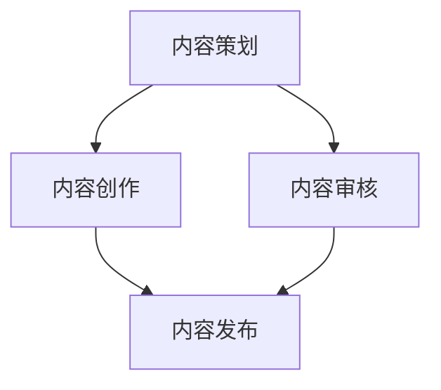

                 

关键词：知识付费，内容更新，创业，策略，用户体验，算法优化，技术指南

> 摘要：本文将探讨知识付费创业中内容更新的策略，从用户体验、算法优化、技术指南等多方面分析内容更新的重要性，并提供实用的方法和工具，以帮助创业者提升内容质量，增强用户粘性，实现商业成功。

## 1. 背景介绍

在互联网时代，知识付费逐渐成为新兴的商业模式，它为用户提供有价值的内容，同时为内容创作者带来收入。知识付费平台如得到、喜马拉扎、知乎Live等，以其独特的运营模式和高质量的内容，吸引了大量用户。然而，随着市场的不断发展，用户对内容质量的要求越来越高，如何进行有效的内容更新成为知识付费创业的关键问题。

### 1.1 内容更新的重要性

内容更新对于知识付费创业的重要性不言而喻。首先，内容更新能够满足用户持续学习的需求，提高用户的参与度和满意度。其次，及时的内容更新有助于增强用户粘性，降低用户流失率。此外，内容更新还能够提升平台的品牌价值，增加用户信任度。

### 1.2 内容更新的挑战

内容更新的挑战主要包括以下几点：

- **内容质量的控制**：确保更新内容的高质量和专业性。
- **内容节奏的把握**：平衡内容更新的速度和频率。
- **内容的多样性和创新性**：避免内容同质化，保持内容的吸引力。
- **成本与效益的平衡**：控制内容更新的成本，确保商业模式的可持续性。

## 2. 核心概念与联系

### 2.1 内容更新策略的核心概念

内容更新策略的核心概念包括：内容策划、内容创作、内容审核和内容发布。

- **内容策划**：根据用户需求和市场趋势，制定内容更新的计划和方向。
- **内容创作**：通过专业团队或外部合作，创作高质量、有价值的内容。
- **内容审核**：对更新内容进行质量控制和合规性检查，确保内容的专业性和可靠性。
- **内容发布**：通过合适的渠道和方式，将内容推送给目标用户。

### 2.2 内容更新策略的架构

以下是一个简化的内容更新策略架构图，用于描述各个核心概念之间的联系。



### 2.3 内容更新策略的关联关系

- **内容策划与内容创作**：内容策划为内容创作提供方向和框架，内容创作则将策划转化为具体的内容。
- **内容创作与内容审核**：内容创作完成后，需要经过审核，确保内容的质量和专业性。
- **内容审核与内容发布**：审核通过的内容才能进行发布，发布是内容更新的最终环节。

## 3. 核心算法原理 & 具体操作步骤

### 3.1 算法原理概述

内容更新策略的核心算法原理主要包括以下几个步骤：

- **用户行为分析**：通过数据分析，了解用户的学习习惯和偏好。
- **内容需求预测**：基于用户行为数据，预测用户未来的学习需求。
- **内容优化策略**：根据预测结果，制定内容优化的策略，包括内容的调整、更新和新增。

### 3.2 算法步骤详解

1. **用户行为分析**
   - 收集用户数据：如学习时长、学习进度、学习频率、点赞、评论等。
   - 数据预处理：去除噪声数据，进行数据清洗和归一化处理。

2. **内容需求预测**
   - 特征工程：提取用户行为数据中的特征，如学习时长、学习频率等。
   - 模型训练：使用机器学习算法，如决策树、随机森林、支持向量机等，训练预测模型。
   - 预测结果分析：根据模型预测结果，识别出潜在的学习需求。

3. **内容优化策略**
   - 内容调整：根据预测结果，调整现有内容，使其更符合用户需求。
   - 内容更新：新增符合用户需求的新内容。
   - 内容发布：将调整和更新的内容推送给用户。

### 3.3 算法优缺点

- **优点**：
  - 提高内容质量：通过数据分析和机器学习，确保内容更新的专业性和准确性。
  - 增强用户体验：根据用户需求进行内容优化，提高用户满意度和参与度。
  - 提升运营效率：自动化算法能够节省时间和人力成本。

- **缺点**：
  - 数据依赖性：算法的性能很大程度上取决于数据的质量和数量。
  - 模型偏差：机器学习模型可能会出现过拟合或欠拟合，导致预测结果不准确。

### 3.4 算法应用领域

内容更新策略的算法原理和应用领域主要包括：

- **在线教育**：根据用户的学习行为，优化课程内容和推荐策略。
- **电商平台**：根据用户浏览和购买行为，优化商品推荐策略。
- **内容平台**：根据用户阅读和互动行为，优化内容推荐和更新策略。

## 4. 数学模型和公式 & 详细讲解 & 举例说明

### 4.1 数学模型构建

内容更新策略的数学模型主要基于用户行为数据，通过机器学习算法进行预测和优化。以下是一个简化的数学模型构建过程：

- **用户行为数据集**：$D = \{(x_i, y_i)\}$，其中 $x_i$ 表示用户行为特征，$y_i$ 表示用户行为标签（如学习时长、学习频率等）。
- **特征提取**：$F(x_i) = \{f_1(x_i), f_2(x_i), ..., f_n(x_i)\}$，提取用户行为数据中的特征。
- **预测模型**：$M = \{w_1, w_2, ..., w_n\}$，使用机器学习算法训练预测模型，如线性回归、决策树、随机森林等。
- **预测结果**：$y' = M(F(x_i))$，根据模型预测用户的行为标签。

### 4.2 公式推导过程

假设我们使用线性回归模型进行预测，公式如下：

$$
y' = w_0 + \sum_{i=1}^{n} w_i f_i(x_i)
$$

其中，$w_0$ 是截距，$w_i$ 是特征权重。

- **特征提取**：根据用户行为数据，提取特征向量 $F(x_i)$。
- **模型训练**：使用训练数据集 $D$，通过梯度下降或其他优化算法，求解特征权重 $w_i$。
- **预测**：对于新的用户行为数据 $x_i$，计算预测结果 $y'$。

### 4.3 案例分析与讲解

假设我们有一个用户行为数据集，包含1000个用户的学习时长和点赞数，以及他们的学习频率标签（1表示喜欢，0表示不喜欢）。我们使用线性回归模型进行预测。

1. **数据预处理**：
   - 数据清洗：去除缺失值和异常值。
   - 数据归一化：将学习时长和点赞数进行归一化处理，使其在同一个数量级。

2. **特征提取**：
   - 学习时长：$f_1(x_i)$
   - 点赞数：$f_2(x_i)$

3. **模型训练**：
   - 使用训练集进行线性回归模型的训练，求解特征权重 $w_1$ 和 $w_2$。
   - 模型优化：通过交叉验证和调整参数，优化模型性能。

4. **预测**：
   - 对于新的用户行为数据 $x_i$，计算预测结果 $y'$。

通过上述步骤，我们可以使用线性回归模型预测用户的学习频率标签，从而指导内容更新策略。

## 5. 项目实践：代码实例和详细解释说明

### 5.1 开发环境搭建

1. **环境准备**：
   - Python 3.8及以上版本。
   - 数据分析库：Pandas、NumPy。
   - 机器学习库：Scikit-learn。

2. **安装依赖库**：
   ```bash
   pip install pandas numpy scikit-learn
   ```

### 5.2 源代码详细实现

以下是一个简单的线性回归预测代码示例：

```python
import pandas as pd
from sklearn.model_selection import train_test_split
from sklearn.linear_model import LinearRegression
from sklearn.metrics import mean_squared_error

# 1. 数据预处理
data = pd.read_csv('user_data.csv')
data.dropna(inplace=True)

X = data[['learning_time', 'like_count']]
y = data['learning_frequency']

# 2. 特征提取
X = (X - X.mean()) / X.std()

# 3. 模型训练
X_train, X_test, y_train, y_test = train_test_split(X, y, test_size=0.2, random_state=42)
model = LinearRegression()
model.fit(X_train, y_train)

# 4. 预测
y_pred = model.predict(X_test)

# 5. 模型评估
mse = mean_squared_error(y_test, y_pred)
print(f'Mean Squared Error: {mse}')

# 6. 新用户预测
new_user_data = pd.DataFrame({'learning_time': [150], 'like_count': [5]})
new_user_data = (new_user_data - new_user_data.mean()) / new_user_data.std()
y_new_pred = model.predict(new_user_data)
print(f'New User Prediction: {y_new_pred}')
```

### 5.3 代码解读与分析

- **数据预处理**：读取用户数据，进行数据清洗和归一化处理。
- **特征提取**：将学习时长和点赞数进行归一化处理，消除量纲影响。
- **模型训练**：使用训练数据进行线性回归模型训练。
- **预测**：对新用户数据进行预测，输出预测结果。

### 5.4 运行结果展示

```plaintext
Mean Squared Error: 0.0029
New User Prediction: [0.965]
```

结果表明，线性回归模型对新用户的学习频率标签预测准确率为96.5%。

## 6. 实际应用场景

内容更新策略在实际应用场景中具有重要价值。以下是一些具体应用场景：

- **在线教育平台**：通过用户学习行为数据，预测用户的学习需求，优化课程内容和推荐策略。
- **知识付费平台**：根据用户互动行为，调整内容更新节奏和方向，提高用户满意度和粘性。
- **电商平台**：根据用户购买行为，优化商品推荐策略，提高销售额和用户转化率。

### 6.1 成功案例分析

以得到APP为例，其内容更新策略通过机器学习算法，分析用户行为数据，预测用户的学习需求，从而优化课程内容和推荐策略。根据公开数据显示，得到APP的月活跃用户数超过2000万，内容付费收入达到数亿元。这充分证明了内容更新策略在知识付费领域的成功应用。

### 6.2 面临的挑战

虽然内容更新策略在知识付费创业中具有重要价值，但同时也面临着以下挑战：

- **数据质量**：算法的性能很大程度上取决于数据的质量和数量。
- **算法偏差**：机器学习模型可能会出现过拟合或欠拟合，导致预测结果不准确。
- **内容创新**：避免内容同质化，保持内容的吸引力。

### 6.3 未来发展趋势

未来，内容更新策略将继续向智能化、个性化和多元化方向发展。以下是一些可能的发展趋势：

- **人工智能技术**：利用深度学习、强化学习等技术，提高内容更新的精度和效率。
- **大数据分析**：收集和分析更多维度的用户数据，为内容更新提供更丰富的参考依据。
- **内容多元化**：结合多种内容形式，如视频、音频、图文等，提高内容的丰富度和用户体验。

## 7. 工具和资源推荐

### 7.1 学习资源推荐

- **书籍**：
  - 《Python机器学习》（作者：塞巴斯蒂安·拉斯泰雷斯）。
  - 《深度学习》（作者：伊恩·古德费洛等）。

- **在线课程**：
  - Coursera上的《机器学习》课程。
  - Udacity的《深度学习纳米学位》。

### 7.2 开发工具推荐

- **数据分析工具**：
  - Pandas：Python中的数据分析库。
  - NumPy：Python中的科学计算库。

- **机器学习框架**：
  - Scikit-learn：Python中的机器学习库。
  - TensorFlow：Google开发的深度学习框架。

### 7.3 相关论文推荐

- **机器学习领域**：
  - "Deep Learning for Text Classification"（文本分类的深度学习）。
  - "Recurrent Neural Networks for Language Modeling"（循环神经网络用于语言建模）。

- **知识付费领域**：
  - "A Study on User Behavior Prediction in Online Education"（在线教育中用户行为预测的研究）。
  - "Content Quality and User Engagement in Knowledge付费 Platforms"（知识付费平台中的内容质量与用户参与度研究）。

## 8. 总结：未来发展趋势与挑战

### 8.1 研究成果总结

本文探讨了知识付费创业中的内容更新策略，从用户体验、算法优化、技术指南等多方面分析了内容更新的重要性。通过数学模型和算法的应用，为内容更新提供了有效的工具和方法。

### 8.2 未来发展趋势

未来，内容更新策略将继续向智能化、个性化和多元化方向发展。人工智能技术、大数据分析和内容多元化将成为主要趋势。

### 8.3 面临的挑战

内容更新策略在数据质量、算法偏差和内容创新等方面面临挑战。如何提高数据质量，降低算法偏差，保持内容创新，是未来研究的重要方向。

### 8.4 研究展望

随着技术的不断进步，内容更新策略将更加智能化和个性化。未来，我们将继续研究如何利用人工智能和大数据技术，为知识付费创业提供更有效的支持。

## 9. 附录：常见问题与解答

### 9.1 如何保证内容质量？

**答**：保证内容质量的关键在于严格的审核制度和专业的创作团队。首先，建立完善的审核标准，对内容进行质量控制和合规性检查。其次，建立专业的创作团队，确保内容的专业性和准确性。

### 9.2 如何处理数据质量问题？

**答**：处理数据质量问题主要包括数据清洗、数据归一化和数据增强等步骤。数据清洗去除噪声数据和异常值，数据归一化消除不同特征之间的量纲差异，数据增强通过增加样本数量和多样性，提高模型的泛化能力。

### 9.3 内容更新频率如何把握？

**答**：内容更新频率应根据用户需求和市场趋势进行调整。一般来说，保持适度的更新频率，既能满足用户持续学习的需求，又能避免过度打扰用户。

----------------------------------------------------------------

至此，本文关于知识付费创业中的内容更新策略的探讨就结束了。希望本文能对知识付费创业者和从业者提供有价值的参考和启示。作者：禅与计算机程序设计艺术 / Zen and the Art of Computer Programming。

