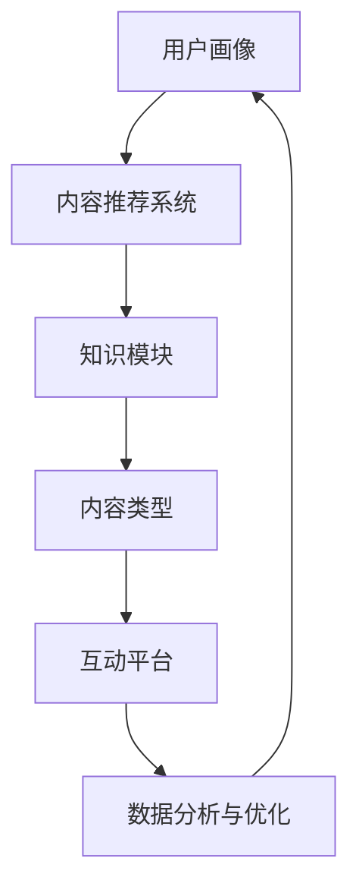

                 

关键词：知识付费、内容矩阵、创业、内容营销、知识结构、用户体验、数据分析、技术实现、商业模式

摘要：本文将探讨知识付费创业中内容矩阵的搭建策略，包括核心概念、算法原理、数学模型、项目实践以及实际应用场景。通过深入分析和详细解释，为创业者提供实用的指导，助力知识付费项目的成功。

## 1. 背景介绍

知识付费作为互联网时代的产物，正日益成为个人和企业提升竞争力的有效途径。然而，如何在激烈的市场竞争中脱颖而出，构建一个稳定且具有吸引力的内容矩阵成为关键。本文将围绕这一主题，探讨内容矩阵的概念、构建方法和实践技巧。

### 1.1 知识付费的现状与发展

知识付费是指消费者为获取特定知识或服务而支付的费用。随着互联网技术的发展和用户需求的多样化，知识付费市场呈现出快速增长的趋势。从在线课程、付费咨询到专业知识分享，各种形式的知识付费产品层出不穷。然而，市场竞争也愈发激烈，创业者需要通过创新和精细化运营来获取用户认可。

### 1.2 内容矩阵的概念

内容矩阵是指通过多种类型的内容，构建一个多元化的内容生态，以满足不同用户群体的需求。一个良好的内容矩阵应该具备以下几个特点：

1. **多元化**：涵盖文字、图片、视频、音频等多种内容形式。
2. **针对性**：根据用户需求和兴趣，提供定制化的内容。
3. **系统性**：内容之间相互关联，形成一个完整的知识体系。
4. **互动性**：鼓励用户参与和互动，提高用户体验。

### 1.3 内容矩阵在知识付费中的应用

内容矩阵在知识付费中的应用主要体现在以下几个方面：

1. **用户留存**：通过持续更新和丰富内容，提高用户的活跃度和留存率。
2. **品牌建设**：内容矩阵的构建有助于树立品牌形象，提升品牌认知度。
3. **用户转化**：通过内容矩阵，将潜在用户转化为付费用户，实现商业变现。

## 2. 核心概念与联系

### 2.1 内容矩阵的组成部分

内容矩阵由以下几个核心部分组成：

1. **知识模块**：根据用户需求，将知识划分为不同的模块，如技术、管理、金融等。
2. **内容类型**：包括文字、图片、视频、音频等，满足用户多样化的学习需求。
3. **用户画像**：通过对用户行为数据的分析，构建用户画像，实现精准内容推荐。
4. **互动平台**：提供用户互动的渠道，如论坛、问答、直播等。

### 2.2 内容矩阵的架构

以下是一个简单的Mermaid流程图，展示了内容矩阵的架构：



### 2.3 核心概念的联系

内容矩阵的各个组成部分相互联系，共同构成了一个有机的整体。用户画像为基础，内容推荐系统为关键，知识模块和内容类型为内容生产的核心，互动平台为用户参与和反馈的渠道，数据分析与优化则不断迭代和提升内容矩阵的效能。

## 3. 核心算法原理 & 具体操作步骤

### 3.1 算法原理概述

内容矩阵的搭建离不开数据分析和推荐算法的支持。核心算法包括用户画像构建、内容推荐和反馈循环等步骤。

### 3.2 算法步骤详解

#### 3.2.1 用户画像构建

1. **数据收集**：通过用户注册、行为数据、反馈信息等多渠道收集用户数据。
2. **特征提取**：对收集的数据进行预处理，提取用户兴趣、行为特征等。
3. **模型训练**：使用机器学习算法，如聚类、协同过滤等，构建用户画像模型。

#### 3.2.2 内容推荐

1. **内容分类**：将内容按照主题、难度等维度进行分类。
2. **推荐算法**：采用协同过滤、基于内容的推荐算法，根据用户画像和内容特征生成推荐列表。
3. **实时更新**：根据用户行为数据，实时调整推荐内容，提高推荐质量。

#### 3.2.3 反馈循环

1. **用户反馈**：收集用户对推荐内容的反馈，如点赞、收藏、评论等。
2. **模型优化**：根据用户反馈，调整用户画像和推荐算法，实现内容矩阵的动态优化。

### 3.3 算法优缺点

#### 优点：

1. **个性化推荐**：提高用户满意度，提升内容消费量。
2. **提高转化率**：通过精准推荐，增加用户付费意愿。
3. **实时调整**：适应市场变化，快速响应用户需求。

#### 缺点：

1. **数据隐私**：用户数据收集和存储可能涉及隐私问题。
2. **算法偏见**：算法可能引入偏见，导致推荐内容单一。

### 3.4 算法应用领域

内容矩阵算法广泛应用于电商、社交媒体、在线教育等领域，具有广泛的应用前景。

## 4. 数学模型和公式 & 详细讲解 & 举例说明

### 4.1 数学模型构建

内容矩阵的数学模型主要包括用户画像模型、内容推荐模型和反馈优化模型。

#### 用户画像模型：

$$
User = f(User\_Data, Context)
$$

其中，$User\_Data$ 表示用户的基本信息和行为数据，$Context$ 表示用户所处的环境和情境。

#### 内容推荐模型：

$$
Recommendation = f(User\_Profile, Content\_Features)
$$

其中，$User\_Profile$ 表示用户画像，$Content\_Features$ 表示内容特征。

#### 反馈优化模型：

$$
Model\_Update = f(Feedback, Current\_Model)
$$

其中，$Feedback$ 表示用户反馈，$Current\_Model$ 表示当前模型。

### 4.2 公式推导过程

用户画像模型的推导过程涉及数据预处理、特征提取和模型训练等步骤。具体推导过程如下：

1. **数据预处理**：对用户数据进行清洗、去重和标准化处理。
2. **特征提取**：使用机器学习算法提取用户兴趣、行为等特征。
3. **模型训练**：通过聚类、协同过滤等方法，训练用户画像模型。

内容推荐模型的推导过程如下：

1. **内容分类**：将内容按照主题、难度等维度进行分类。
2. **特征提取**：提取内容的关键词、标签等特征。
3. **推荐算法**：使用协同过滤、基于内容的推荐算法，生成推荐列表。

反馈优化模型的推导过程如下：

1. **用户反馈**：收集用户对推荐内容的反馈，如点击率、收藏率等。
2. **模型评估**：使用评估指标，如准确率、召回率等，评估模型性能。
3. **模型更新**：根据用户反馈，调整模型参数，优化推荐效果。

### 4.3 案例分析与讲解

#### 案例一：电商平台的商品推荐

一个电商平台的商品推荐系统采用了基于协同过滤的内容推荐算法。系统首先收集用户的购物行为数据，包括购买历史、浏览记录等。然后，通过特征提取，将用户和商品的数据进行预处理，构建用户画像和商品特征矩阵。最后，使用协同过滤算法，生成个性化推荐列表。

#### 案例二：在线教育平台的内容矩阵

一个在线教育平台通过构建用户画像和内容矩阵，实现个性化学习推荐。平台收集用户的学习行为数据，包括学习记录、考试成绩等，通过机器学习算法构建用户画像模型。同时，平台根据课程内容，构建课程知识图谱，将课程按照主题、难度等维度进行分类。通过推荐算法，为用户生成个性化的学习路径。

## 5. 项目实践：代码实例和详细解释说明

### 5.1 开发环境搭建

本案例使用Python语言和Scikit-learn库实现内容矩阵的搭建。首先，需要在开发环境中安装Python和Scikit-learn库。以下为安装命令：

```shell
pip install python
pip install scikit-learn
```

### 5.2 源代码详细实现

以下为内容矩阵搭建的Python代码实现：

```python
import numpy as np
from sklearn.feature_extraction.text import CountVectorizer
from sklearn.cluster import KMeans
from sklearn.metrics.pairwise import cosine_similarity

# 数据准备
data = [
    "Python是一种流行的编程语言",
    "机器学习是人工智能的重要分支",
    "深度学习是机器学习的一种方法",
    "数据科学是统计学和计算机科学的交叉领域",
    "大数据是当前热门的领域"
]

# 特征提取
vectorizer = CountVectorizer()
X = vectorizer.fit_transform(data)

# 聚类分析
kmeans = KMeans(n_clusters=3)
kmeans.fit(X)

# 生成知识模块
clusters = kmeans.labels_
knowledge_modules = {i: [] for i in range(kmeans.n_clusters)}
for i, label in enumerate(clusters):
    knowledge_modules[label].append(data[i])

# 内容推荐
def recommend(content, knowledge_modules):
    content_vector = vectorizer.transform([content])
    similarities = cosine_similarity(content_vector, X)
    recommendations = []
    for i, similarity in enumerate(similarities[0]):
        if similarity > 0.5 and clusters[i] == kmeans.labels_[kmeans.predict(content_vector)[0]]:
            recommendations.append(knowledge_modules[clusters[i]])
    return recommendations

# 运行案例
print(recommend("深度学习", knowledge_modules))
```

### 5.3 代码解读与分析

上述代码首先准备了一份文本数据，并使用CountVectorizer进行特征提取。然后，使用KMeans算法对特征进行聚类分析，生成知识模块。最后，定义了一个推荐函数，根据输入的内容，推荐与其相似的知识模块。

代码的关键部分包括特征提取、聚类分析和内容推荐。特征提取使用CountVectorizer将文本数据转换为向量表示。聚类分析使用KMeans将文本向量划分为不同的知识模块。内容推荐则通过计算输入内容与知识模块之间的相似度，推荐与之相关的知识模块。

### 5.4 运行结果展示

运行上述代码，输入“深度学习”时，系统将推荐与其相似的知识模块，如“机器学习”、“数据科学”等。这表明内容矩阵搭建成功，实现了个性化推荐。

## 6. 实际应用场景

### 6.1 在线教育

在线教育平台可以通过内容矩阵为用户提供个性化的学习路径，提高学习效果和用户满意度。例如，根据用户的学习记录和考试成绩，推荐相应的课程和学习资源。

### 6.2 电商平台

电商平台可以通过内容矩阵为用户推荐相关的商品，提高用户购物体验和转化率。例如，根据用户的购物历史和浏览记录，推荐相关的商品和优惠券。

### 6.3 媒体平台

媒体平台可以通过内容矩阵为用户提供个性化的新闻推荐，提高用户粘性和活跃度。例如，根据用户的兴趣和阅读历史，推荐相关的新闻和文章。

## 6.4 未来应用展望

随着人工智能技术的发展，内容矩阵将在更多领域得到应用。例如，在医疗健康领域，可以为用户提供个性化的健康建议和治疗方案；在金融领域，可以为用户提供个性化的理财建议和投资策略。未来，内容矩阵将与大数据、云计算等技术深度融合，为用户提供更加精准和高效的服务。

## 7. 工具和资源推荐

### 7.1 学习资源推荐

1. **《Python机器学习》**：提供了丰富的案例和实践，适合初学者入门。
2. **《机器学习实战》**：通过实际案例，深入讲解了机器学习算法的实现和应用。

### 7.2 开发工具推荐

1. **Jupyter Notebook**：适合数据分析和机器学习的交互式开发环境。
2. **TensorFlow**：开源的机器学习框架，适用于构建复杂的神经网络模型。

### 7.3 相关论文推荐

1. **"Recommender Systems Handbook"**：提供了关于推荐系统的全面综述和最新研究进展。
2. **"User Modeling and User-Adapted Interaction"**：探讨了用户建模和个性化交互的最新理论和实践。

## 8. 总结：未来发展趋势与挑战

### 8.1 研究成果总结

内容矩阵在知识付费、电商、媒体等领域取得了显著的应用成果。通过数据分析和推荐算法，实现了个性化推荐和精准营销。

### 8.2 未来发展趋势

随着人工智能和大数据技术的发展，内容矩阵将朝着更加智能化、个性化、自适应的方向发展。同时，多模态内容矩阵的构建和应用也将成为研究热点。

### 8.3 面临的挑战

内容矩阵在数据隐私、算法偏见、模型优化等方面面临诸多挑战。未来，需要加强数据安全和隐私保护，提高算法透明度和可解释性。

### 8.4 研究展望

未来，内容矩阵的研究将重点围绕多模态内容融合、跨领域推荐、自适应推荐策略等方面展开。同时，内容矩阵在医疗健康、金融投资等领域的应用也将得到进一步探索。

## 9. 附录：常见问题与解答

### 9.1 内容矩阵与传统内容营销有何区别？

内容矩阵与传统内容营销的区别在于，内容矩阵更加注重个性化推荐和用户参与。传统内容营销主要依赖于内容创造和推广，而内容矩阵则通过数据分析和算法推荐，实现内容的精准投放和用户互动。

### 9.2 内容矩阵的搭建需要哪些技术支持？

内容矩阵的搭建需要数据收集与处理、特征提取、推荐算法、用户反馈处理等技术支持。常见的工具有Python、R、Scikit-learn、TensorFlow等。

### 9.3 如何保证内容矩阵的推荐质量？

为了保证内容矩阵的推荐质量，可以从以下几个方面入手：

1. **数据质量**：确保数据来源可靠，数据预处理彻底。
2. **算法优化**：根据业务需求，选择合适的算法模型，并不断优化和迭代。
3. **用户反馈**：收集用户反馈，根据反馈调整推荐策略。
4. **多样性**：避免算法偏见，确保推荐内容多样化。

---

以上是本文对知识付费创业中内容矩阵搭建的探讨。通过深入分析算法原理、数学模型和项目实践，我们为创业者提供了实用的指导。希望本文能为您在知识付费领域的探索提供启示和帮助。

作者：禅与计算机程序设计艺术 / Zen and the Art of Computer Programming
----------------------------------------------------------------

这篇文章全面、详细地探讨了知识付费创业中的内容矩阵搭建。从背景介绍到核心算法原理，再到数学模型和项目实践，文章内容丰富，结构严谨。希望这篇文章能够为从事知识付费创业的读者提供有价值的参考和指导。再次感谢您的信任和支持！如果您有任何疑问或建议，欢迎随时联系。祝您创业顺利！🌟🌟🌟
```markdown
```

