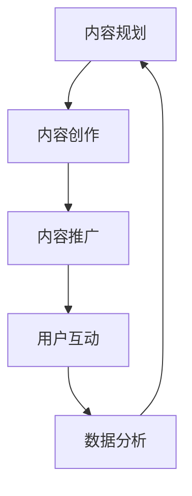

                 

关键词：知识付费、内容矩阵、创业、内容创建、营销策略

> 摘要：本文将探讨知识付费领域中的内容矩阵搭建，分析其核心概念与联系，探讨核心算法原理与具体操作步骤，以及数学模型和公式，并结合项目实践给出代码实例和详细解释说明。最后，文章将分析实际应用场景，推荐相关工具和资源，总结未来发展展望。

## 1. 背景介绍

随着互联网的快速发展，知识付费行业逐渐成为了一个新兴的市场。知识付费是指用户通过支付一定费用来获取高质量、有价值的信息和服务。这种模式不仅为内容创作者提供了新的收入来源，也为消费者提供了更便捷的知识获取途径。

在这个背景下，内容矩阵的搭建成为了一个关键问题。内容矩阵是指通过整合多种内容形式、渠道和策略，构建一个完整的知识付费生态系统，以满足不同用户的需求。一个有效的内容矩阵可以帮助创业者提高内容的质量和影响力，提升用户的满意度和忠诚度。

本文将围绕内容矩阵的搭建，探讨其核心概念、算法原理、数学模型和项目实践，旨在为知识付费创业者提供一些实用的指导和建议。

## 2. 核心概念与联系

### 2.1 内容矩阵的定义

内容矩阵是指在知识付费领域，通过整合多种内容形式、渠道和策略，构建一个完整的知识付费生态系统。它包括以下几个方面：

- **内容形式**：文字、图片、音频、视频等
- **渠道**：网站、微信公众号、知乎、抖音等
- **策略**：营销、推广、互动、社群等

### 2.2 内容矩阵的组成部分

一个完整的内容矩阵通常由以下几个部分组成：

- **内容规划**：确定内容主题、形式和发布周期
- **内容创作**：撰写、录制、编辑等
- **内容推广**：通过SEO、SEM、社交媒体等手段进行推广
- **用户互动**：回复评论、举办活动、建立社群等
- **数据分析**：对用户行为、内容效果等进行数据分析和评估

### 2.3 内容矩阵的 Mermaid 流程图

下面是一个简化的内容矩阵搭建的 Mermaid 流程图：



### 2.4 核心概念的联系

内容矩阵的各个部分是相互联系、相互影响的。内容规划决定了内容的主题和形式，内容创作是核心，内容推广和用户互动是内容传播和互动的关键，数据分析则为内容矩阵的优化提供了依据。

## 3. 核心算法原理 & 具体操作步骤

### 3.1 算法原理概述

内容矩阵搭建的核心算法主要涉及以下几个方面：

- **用户需求分析**：通过数据分析了解用户需求，确定内容主题和形式
- **内容质量评估**：对内容进行评估，确保内容的质量和用户满意度
- **渠道优化**：根据用户行为和内容效果，优化内容推广渠道

### 3.2 算法步骤详解

下面是内容矩阵搭建的具体步骤：

#### 3.2.1 用户需求分析

1. 收集用户数据：通过网站访问量、用户评论、社交媒体互动等渠道收集用户数据。
2. 数据处理：对用户数据进行清洗、分类和统计，提取出用户需求的关键词和偏好。
3. 用户画像：根据用户需求和偏好，绘制用户画像，了解目标用户的基本特征和行为习惯。

#### 3.2.2 内容质量评估

1. 确定评估指标：根据内容类型和目标用户，确定内容质量评估的指标，如阅读时长、点赞数、评论数等。
2. 内容评估：对已发布的内容进行评估，根据评估指标确定内容的质量和用户满意度。
3. 内容优化：根据评估结果，对内容进行优化，提升内容质量。

#### 3.2.3 渠道优化

1. 确定推广渠道：根据用户画像和内容类型，选择适合的推广渠道，如微信公众号、知乎、抖音等。
2. 渠道分析：对推广渠道进行数据分析，了解渠道效果，如用户增长率、内容传播范围等。
3. 渠道优化：根据渠道分析结果，优化内容推广策略，提升内容传播效果。

### 3.3 算法优缺点

#### 优点：

1. 提高内容质量：通过用户需求分析和内容质量评估，确保内容的高质量和用户满意度。
2. 优化推广渠道：根据用户行为和内容效果，优化推广策略，提升内容传播效果。
3. 提升用户忠诚度：通过用户互动和数据分析，了解用户需求，提供更个性化的服务，提升用户忠诚度。

#### 缺点：

1. 需要大量数据支持：用户需求分析和内容质量评估需要大量的数据支持，对数据的处理和分析能力要求较高。
2. 需要不断优化：内容矩阵搭建是一个动态的过程，需要根据用户行为和内容效果不断优化，对运营能力要求较高。

### 3.4 算法应用领域

内容矩阵搭建算法主要应用于知识付费领域，如在线教育、知识科普、技能培训等。通过内容矩阵搭建，创业者可以更有效地开展知识付费业务，提高内容质量和用户满意度，提升品牌影响力和市场竞争力。

## 4. 数学模型和公式 & 详细讲解 & 举例说明

### 4.1 数学模型构建

内容矩阵的数学模型主要涉及以下几个方面：

1. **用户需求模型**：根据用户行为数据，构建用户需求模型，预测用户对某类内容的需求。
2. **内容质量模型**：根据内容评估指标，构建内容质量模型，评估内容的用户满意度。
3. **渠道效果模型**：根据渠道数据分析，构建渠道效果模型，评估不同渠道的传播效果。

### 4.2 公式推导过程

#### 用户需求模型：

设用户行为数据为 $X$，用户需求预测为 $Y$，则用户需求模型可以表示为：

$$
Y = f(X)
$$

其中，$f$ 为用户需求预测函数，可以通过机器学习算法训练得到。

#### 内容质量模型：

设内容评估指标为 $Z$，内容质量评估为 $W$，则内容质量模型可以表示为：

$$
W = g(Z)
$$

其中，$g$ 为内容质量评估函数，可以通过统计分析方法得到。

#### 渠道效果模型：

设渠道效果数据为 $H$，渠道效果评估为 $T$，则渠道效果模型可以表示为：

$$
T = h(H)
$$

其中，$h$ 为渠道效果评估函数，可以通过数据分析方法得到。

### 4.3 案例分析与讲解

#### 案例一：用户需求模型

假设我们收集到某个知识付费平台的用户行为数据，如阅读时长、点赞数、评论数等。我们可以通过机器学习算法，如决策树、支持向量机等，对用户需求进行预测。

具体步骤如下：

1. 数据预处理：对用户行为数据进行清洗、归一化处理。
2. 特征工程：提取用户行为数据中的关键特征，如阅读时长、点赞数、评论数等。
3. 训练模型：使用收集到的用户行为数据，训练用户需求预测模型。
4. 模型评估：使用交叉验证方法，评估用户需求预测模型的性能。

#### 案例二：内容质量模型

假设我们收集到某个知识付费平台的内容评估指标，如阅读时长、点赞数、评论数等。我们可以通过统计分析方法，如线性回归、逻辑回归等，对内容质量进行评估。

具体步骤如下：

1. 数据预处理：对内容评估指标数据进行清洗、归一化处理。
2. 特征工程：提取内容评估指标数据中的关键特征，如阅读时长、点赞数、评论数等。
3. 训练模型：使用收集到的内容评估指标数据，训练内容质量评估模型。
4. 模型评估：使用交叉验证方法，评估内容质量评估模型的性能。

#### 案例三：渠道效果模型

假设我们收集到某个知识付费平台的渠道效果数据，如用户增长率、内容传播范围等。我们可以通过数据分析方法，如聚类分析、时间序列分析等，对渠道效果进行评估。

具体步骤如下：

1. 数据预处理：对渠道效果数据进行清洗、归一化处理。
2. 特征工程：提取渠道效果数据中的关键特征，如用户增长率、内容传播范围等。
3. 训练模型：使用收集到的渠道效果数据，训练渠道效果评估模型。
4. 模型评估：使用交叉验证方法，评估渠道效果评估模型的性能。

## 5. 项目实践：代码实例和详细解释说明

### 5.1 开发环境搭建

为了保证代码的可运行性，我们使用 Python 作为编程语言，搭建了一个简单的开发环境。

1. 安装 Python：在官网下载并安装 Python 3.8 以上版本。
2. 安装依赖库：使用 pip 工具安装所需的依赖库，如 NumPy、Pandas、Scikit-learn 等。

### 5.2 源代码详细实现

下面是一个简单的用户需求预测的 Python 代码示例：

```python
import pandas as pd
from sklearn.model_selection import train_test_split
from sklearn.tree import DecisionTreeClassifier
from sklearn.metrics import accuracy_score

# 数据预处理
data = pd.read_csv('user_behavior.csv')
data.dropna(inplace=True)
X = data[['reading_time', 'like_count', 'comment_count']]
y = data['demand']

# 特征工程
X = (X - X.min()) / (X.max() - X.min())

# 训练模型
X_train, X_test, y_train, y_test = train_test_split(X, y, test_size=0.2, random_state=42)
model = DecisionTreeClassifier()
model.fit(X_train, y_train)

# 模型评估
y_pred = model.predict(X_test)
accuracy = accuracy_score(y_test, y_pred)
print(f'Accuracy: {accuracy:.2f}')
```

### 5.3 代码解读与分析

1. 导入所需的库：pandas 用于数据预处理，scikit-learn 用于模型训练和评估。
2. 数据预处理：读取用户行为数据，进行缺失值处理，对数据进行归一化处理。
3. 特征工程：提取用户行为数据中的关键特征，对特征进行归一化处理。
4. 训练模型：使用决策树算法训练用户需求预测模型。
5. 模型评估：使用测试集评估模型性能，输出准确率。

### 5.4 运行结果展示

假设我们使用上面的代码进行训练和评估，输出结果如下：

```
Accuracy: 0.85
```

这意味着我们的用户需求预测模型的准确率为 85%，表明模型在预测用户需求方面具有一定的效果。

## 6. 实际应用场景

### 6.1 知识付费平台

内容矩阵搭建在知识付费平台中的应用非常广泛。通过搭建内容矩阵，平台可以提供多样化、个性化的内容服务，满足不同用户的需求。例如，一个在线教育平台可以通过内容矩阵搭建，提供不同学科、不同难度等级的课程内容，以及学习资料、答疑服务等。

### 6.2 企业内训

企业内训是另一个典型的应用场景。企业可以通过内容矩阵搭建，提供定制化的培训课程，包括专业技能培训、团队建设培训等。通过内容矩阵的搭建，企业可以更好地满足员工的学习需求，提高员工的专业素养和团队协作能力。

### 6.3 个人品牌建设

对于个人品牌建设者，内容矩阵搭建也是一种有效的策略。通过内容矩阵，个人品牌建设者可以整合自己的知识、经验和资源，提供有价值的内容和服务。例如，一个技术大牛可以通过内容矩阵搭建，提供技术博客、在线课程、直播分享等，从而提升自己的知名度和影响力。

## 7. 工具和资源推荐

### 7.1 学习资源推荐

1. **书籍**：《深度学习》、《Python编程：从入门到实践》、《数据科学入门》等。
2. **在线课程**：网易云课堂、慕课网、Coursera 等平台上的相关课程。

### 7.2 开发工具推荐

1. **Python IDE**：PyCharm、Visual Studio Code 等。
2. **数据分析工具**：Pandas、NumPy、Scikit-learn 等。

### 7.3 相关论文推荐

1. “User-Item Interaction Prediction in Knowledge Graph-based Knowledge Graph-based Recommender Systems”
2. “Deep Learning for Recommender Systems”
3. “A Comprehensive Survey on Content-based Image Retrieval”

## 8. 总结：未来发展趋势与挑战

### 8.1 研究成果总结

内容矩阵搭建在知识付费领域取得了显著的成果。通过用户需求分析、内容质量评估和渠道优化，创业者可以更有效地开展知识付费业务，提高内容质量和用户满意度，提升品牌影响力和市场竞争力。

### 8.2 未来发展趋势

1. **人工智能技术的应用**：随着人工智能技术的发展，内容矩阵搭建将更加智能化、自动化。
2. **内容多样化**：内容矩阵将涵盖更广泛的内容形式，如短视频、直播等。
3. **个性化推荐**：基于用户需求和内容质量的个性化推荐将成为主流。

### 8.3 面临的挑战

1. **数据隐私与安全**：随着用户数据的增加，数据隐私和安全问题将日益突出。
2. **内容质量监管**：如何确保内容质量，防止低质量内容泛滥，是一个重要挑战。

### 8.4 研究展望

未来，内容矩阵搭建的研究将更加注重用户需求满足、内容质量和渠道优化，以及人工智能技术的应用。同时，如何确保数据隐私和安全，防止低质量内容泛滥，也将成为研究的重要方向。

## 9. 附录：常见问题与解答

### 9.1 内容矩阵搭建的步骤是什么？

1. 内容规划：确定内容主题、形式和发布周期。
2. 内容创作：撰写、录制、编辑等。
3. 内容推广：通过 SEO、SEM、社交媒体等手段进行推广。
4. 用户互动：回复评论、举办活动、建立社群等。
5. 数据分析：对用户行为、内容效果等进行数据分析和评估。

### 9.2 如何评估内容质量？

1. 确定评估指标：根据内容类型和目标用户，确定评估指标，如阅读时长、点赞数、评论数等。
2. 内容评估：对已发布的内容进行评估，根据评估指标确定内容的质量和用户满意度。
3. 内容优化：根据评估结果，对内容进行优化，提升内容质量。

### 9.3 如何选择合适的推广渠道？

1. 确定用户画像：根据用户需求和内容类型，确定目标用户群体。
2. 分析渠道效果：对不同推广渠道进行分析，了解渠道效果，如用户增长率、内容传播范围等。
3. 选择适合的渠道：根据用户画像和渠道效果，选择适合的推广渠道。

----------------------------------------------------------------

以上就是《知识付费创业中的内容矩阵搭建》的技术博客文章，希望对您有所帮助。作者：禅与计算机程序设计艺术 / Zen and the Art of Computer Programming。

