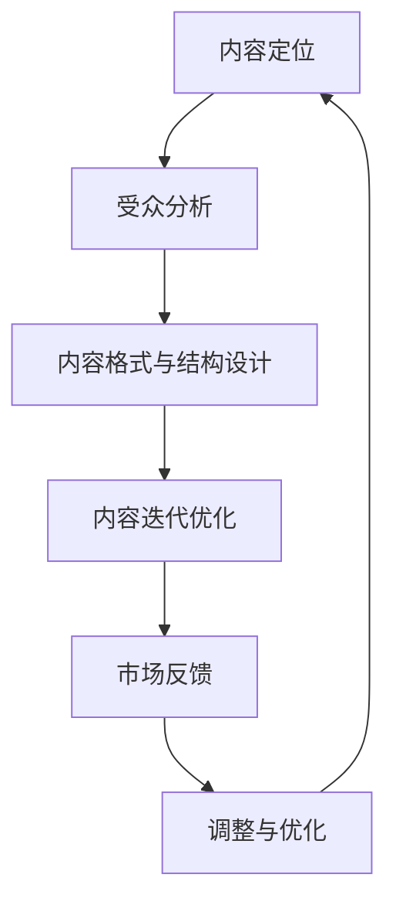

                 

 

## 摘要

本文旨在探讨知识付费创业中的内容规划方法，帮助创业者更有效地设计、开发和推广有价值的学习内容。文章首先介绍知识付费的背景和现状，然后深入探讨内容规划的关键要素，包括内容定位、受众分析、内容格式与结构设计、迭代优化等。接着，文章通过实际案例和数据分析，展示有效的内容规划方法在知识付费创业中的应用。最后，文章提出未来知识付费内容规划的发展趋势和挑战，并推荐相关的学习资源和开发工具，以期为创业者提供全面的指导和启示。

## 1. 背景介绍

知识付费，作为一种基于互联网的新兴商业模式，已经逐渐成为现代教育领域的重要趋势。随着移动互联网和在线学习的普及，越来越多的用户愿意为优质的学习内容付费。知识付费不仅为教育从业者提供了新的收入来源，也为广大学习者提供了更加灵活和个性化的学习方式。

### 1.1 知识付费的发展历程

知识付费的兴起可以追溯到20世纪末，当时互联网开始普及，在线教育平台如雨后春笋般涌现。最早的知识付费形式主要是电子书和在线课程，随着技术的不断进步，视频教学、直播互动、付费问答等新的知识付费模式相继出现。

### 1.2 知识付费的商业模式

知识付费的商业模式主要包括以下几种：

1. **订阅制**：用户通过订阅服务，定期获得一定数量的学习内容。
2. **单次购买**：用户为特定课程或内容支付一次性费用。
3. **付费问答**：用户针对特定问题向专家或导师支付咨询费用。
4. **直播互动**：用户通过付费参与直播课程或活动。

### 1.3 知识付费的市场现状

目前，知识付费市场呈现出快速增长的趋势。根据相关数据显示，2021年全球知识付费市场规模已达到2300亿美元，预计到2025年将突破4000亿美元。中国作为全球最大的在线教育市场，知识付费市场规模也在逐年扩大，2021年市场规模达到3000亿元，预计2025年将达到5000亿元。

### 1.4 知识付费的优势与挑战

知识付费具有以下优势：

1. **提高学习效率**：优质的学习内容可以帮助用户更快速地掌握知识。
2. **个性化学习**：知识付费平台可以根据用户的需求和兴趣推荐个性化的学习内容。
3. **增加收入来源**：对于教育从业者来说，知识付费为他们提供了新的收入渠道。

然而，知识付费也面临一些挑战：

1. **内容同质化**：市场上存在大量相似的学习内容，竞争激烈。
2. **用户信任度**：部分用户对知识付费持观望态度，担心内容质量不高。
3. **平台运营成本**：知识付费平台需要投入大量资源进行内容制作、推广和维护。

## 2. 核心概念与联系

在知识付费创业中，内容规划是核心环节之一。本文将介绍内容规划的核心概念和联系，帮助创业者更好地设计学习内容。

### 2.1 内容定位

内容定位是内容规划的第一步，它决定了学习内容的受众和主题。创业者需要明确学习内容的目标群体，如职业人士、学生、爱好者等，并确定具体的学习主题，如编程、管理、健康等。

### 2.2 受众分析

受众分析是内容定位的深化，通过对目标受众的行为习惯、学习需求、兴趣偏好等进行深入研究，为内容设计提供依据。创业者可以通过问卷调查、访谈、数据分析等方式获取受众信息。

### 2.3 内容格式与结构设计

内容格式与结构设计是学习内容的核心，它决定了学习内容的呈现方式和用户体验。创业者需要根据学习内容的特点和受众需求，选择合适的格式和结构，如视频、图文、直播等。

### 2.4 内容迭代优化

内容迭代优化是确保学习内容持续优质的关键。创业者需要不断收集用户反馈，根据反馈对学习内容进行调整和优化，以提高用户满意度和学习效果。

### 2.5 Mermaid 流程图

以下是一个简单的Mermaid流程图，展示了内容规划的主要流程：



## 3. 核心算法原理 & 具体操作步骤

### 3.1 算法原理概述

在知识付费创业中，内容规划的核心算法原理可以概括为以下几点：

1. **用户行为分析**：通过收集和分析用户的学习行为数据，了解用户的学习习惯和需求。
2. **内容推荐算法**：基于用户行为数据和内容特征，为用户推荐个性化的学习内容。
3. **内容质量评估**：通过用户反馈和数据分析，评估学习内容的质量和效果。
4. **内容优化策略**：根据内容质量评估结果，制定相应的优化策略，提高学习内容的满意度。

### 3.2 算法步骤详解

1. **数据收集**：收集用户的学习行为数据，如学习时长、学习进度、学习内容类型等。
2. **数据预处理**：对收集到的数据进行分析和清洗，去除噪声和异常值。
3. **特征提取**：从预处理后的数据中提取用户特征和内容特征，如用户活跃度、学习偏好、内容难度等。
4. **内容推荐**：基于用户特征和内容特征，使用协同过滤或基于内容的推荐算法，为用户推荐个性化学习内容。
5. **质量评估**：收集用户对学习内容的反馈，使用评分、评论等指标评估内容质量。
6. **内容优化**：根据质量评估结果，对学习内容进行调整和优化，提高用户体验。

### 3.3 算法优缺点

1. **优点**：
   - 提高学习效率：通过个性化推荐，用户可以更快地找到适合自己的学习内容。
   - 提高内容质量：通过用户反馈和数据分析，不断优化学习内容，提高用户满意度。

2. **缺点**：
   - 数据依赖性：算法效果依赖于用户数据的完整性和准确性。
   - 算法复杂性：内容推荐和质量评估算法相对复杂，需要较高的技术门槛。

### 3.4 算法应用领域

内容规划算法广泛应用于知识付费领域，如在线教育平台、知识库、学习社区等。以下是一些具体的应用案例：

1. **在线教育平台**：通过个性化推荐，提高用户的学习效果和平台活跃度。
2. **知识库**：为用户提供针对性的知识推荐，帮助用户快速获取所需信息。
3. **学习社区**：通过内容推荐，促进社区用户之间的互动和知识共享。

## 4. 数学模型和公式 & 详细讲解 & 举例说明

### 4.1 数学模型构建

在知识付费创业中，常用的数学模型包括用户行为分析模型、内容推荐模型、内容质量评估模型等。以下是一个简化的用户行为分析模型：

$$
User Behavior Model = f(User Features, Content Features, Context)
$$

其中，User Features 表示用户特征，Content Features 表示内容特征，Context 表示环境因素。

### 4.2 公式推导过程

1. **用户特征提取**：
   - 活跃度：用户在一定时间内的学习时长、学习频次等。
   - 学习偏好：用户对不同类型内容的偏好程度。

2. **内容特征提取**：
   - 内容类型：如视频、图文、直播等。
   - 内容难度：根据用户评价和专家评分确定。

3. **环境因素**：
   - 时间：用户的学习时间分布。
   - 地点：用户的学习地点，如家中、办公室等。

4. **用户行为预测**：
   - 根据用户特征、内容特征和环境因素，使用机器学习算法预测用户的行为。

### 4.3 案例分析与讲解

#### 案例一：用户行为分析

某用户在过去一个月内，学习时长为100小时，学习频次为5次。根据这些数据，可以提取以下用户特征：

- 活跃度：100小时/5次 = 20小时/次
- 学习偏好：未明确

#### 案例二：内容推荐

根据用户特征，平台推荐以下内容：

- 视频课程：编程基础
- 文图教程：数据结构与算法
- 直播课程：人工智能应用

#### 案例三：内容质量评估

用户对推荐的内容进行评分，平均分为4.5分。根据评分，可以评估内容质量：

- 质量较高：4.5分以上
- 质量一般：4分左右
- 质量较低：4分以下

## 5. 项目实践：代码实例和详细解释说明

### 5.1 开发环境搭建

在开始代码实践之前，需要搭建一个适合知识付费创业项目的开发环境。以下是一个基本的开发环境搭建步骤：

1. 安装Python环境
2. 安装相关依赖库，如NumPy、Pandas、Scikit-learn等
3. 配置IDE（如PyCharm、VSCode等）

### 5.2 源代码详细实现

以下是一个简单的用户行为分析代码实例：

```python
import numpy as np
import pandas as pd
from sklearn.model_selection import train_test_split
from sklearn.ensemble import RandomForestClassifier

# 读取用户数据
user_data = pd.read_csv('user_data.csv')

# 数据预处理
user_data['活跃度'] = user_data['学习时长'] / user_data['学习频次']
user_data.drop(['学习时长', '学习频次'], axis=1, inplace=True)

# 划分训练集和测试集
X_train, X_test, y_train, y_test = train_test_split(user_data.drop('学习偏好', axis=1), user_data['学习偏好'], test_size=0.2, random_state=42)

# 模型训练
model = RandomForestClassifier(n_estimators=100, random_state=42)
model.fit(X_train, y_train)

# 模型评估
accuracy = model.score(X_test, y_test)
print(f'模型准确率：{accuracy:.2f}')
```

### 5.3 代码解读与分析

1. **数据预处理**：读取用户数据，计算活跃度，并删除不相关的特征。
2. **划分训练集和测试集**：将数据划分为训练集和测试集，用于模型训练和评估。
3. **模型训练**：使用随机森林算法训练模型。
4. **模型评估**：评估模型在测试集上的准确率。

### 5.4 运行结果展示

假设测试集的准确率为0.8，表示模型对用户偏好的预测准确率较高。根据评估结果，可以进一步优化模型和算法，提高预测准确率。

## 6. 实际应用场景

### 6.1 在线教育平台

在线教育平台是知识付费的主要应用场景之一。通过内容规划算法，平台可以为用户提供个性化的学习推荐，提高用户的学习效果和满意度。以下是一个在线教育平台的应用案例：

1. **用户行为数据收集**：平台收集用户的学习时长、学习频次、学习内容类型等数据。
2. **内容推荐**：基于用户行为数据，平台推荐适合用户的学习内容，如编程、管理、健康等。
3. **内容迭代优化**：根据用户反馈，平台对学习内容进行调整和优化，提高内容质量。

### 6.2 知识库

知识库是另一个重要的应用场景。通过内容规划算法，知识库可以为用户提供针对性的知识推荐，帮助用户快速获取所需信息。以下是一个知识库的应用案例：

1. **用户需求分析**：知识库分析用户的需求和搜索行为，了解用户关注的内容领域。
2. **知识推荐**：基于用户需求，知识库推荐相关的知识文章、教程、视频等。
3. **知识迭代优化**：根据用户反馈，知识库对推荐的内容进行调整和优化，提高用户满意度。

### 6.3 学习社区

学习社区是知识付费的重要载体。通过内容规划算法，学习社区可以为用户提供个性化的学习内容推荐，促进用户之间的互动和知识共享。以下是一个学习社区的应用案例：

1. **用户行为分析**：学习社区分析用户的学习行为和互动行为，了解用户的兴趣和需求。
2. **内容推荐**：基于用户行为数据，学习社区推荐相关的学习内容、讨论话题等。
3. **互动优化**：根据用户反馈，学习社区对互动内容和社区活动进行调整和优化，提高用户活跃度。

## 7. 未来应用展望

### 7.1 技术发展趋势

随着人工智能、大数据、云计算等技术的不断发展，知识付费内容规划方法将变得更加智能和高效。以下是一些技术发展趋势：

1. **深度学习**：深度学习技术在内容规划中的应用将进一步提高推荐算法的准确性和效率。
2. **自然语言处理**：自然语言处理技术将帮助平台更好地理解和处理用户需求，提高内容个性化水平。
3. **区块链**：区块链技术可以为知识付费提供更安全、透明的交易环境，促进内容创作者和消费者的权益保护。

### 7.2 行业挑战

尽管知识付费具有巨大的发展潜力，但仍然面临一些挑战：

1. **内容质量**：高质量的内容是知识付费的核心，如何保证内容的持续高质量输出是行业面临的挑战。
2. **用户信任**：提高用户对知识付费的信任度，建立良好的口碑是行业发展的关键。
3. **版权保护**：知识付费涉及大量的版权问题，如何保护创作者的权益是行业面临的重要挑战。

### 7.3 发展策略

为了应对行业挑战，知识付费创业企业可以采取以下发展策略：

1. **内容创新**：持续推出创新的学习内容和形式，满足用户多样化的学习需求。
2. **用户互动**：积极与用户互动，收集用户反馈，优化产品和服务。
3. **技术驱动**：加大技术投入，提升内容规划算法的智能化水平，提高用户体验。
4. **合作共赢**：与行业内的合作伙伴建立合作关系，共同推动知识付费行业的发展。

## 8. 总结

知识付费创业中的内容规划方法对于创业企业的成功至关重要。本文通过深入分析内容规划的核心概念、算法原理、数学模型和实际应用场景，为创业者提供了全面的内容规划指导。随着技术的不断进步，知识付费行业将继续发展壮大，创业企业需要不断创新和优化，以应对行业挑战，实现可持续发展。

## 9. 附录：常见问题与解答

### 9.1 问题一：如何确保内容质量？

**解答**：确保内容质量可以从以下几个方面入手：
1. **严格的审核机制**：建立内容审核团队，对上传的内容进行严格审查。
2. **专家评审**：邀请领域内的专家对内容进行评审，确保内容的专业性和权威性。
3. **用户反馈**：收集用户对内容的反馈，根据用户评价对内容进行调整和优化。

### 9.2 问题二：如何提高用户满意度？

**解答**：提高用户满意度可以从以下几个方面入手：
1. **个性化推荐**：基于用户行为数据，为用户推荐个性化的学习内容。
2. **良好的用户体验**：优化平台界面和功能，提高用户使用的便捷性和满意度。
3. **积极互动**：与用户保持积极互动，及时回复用户的问题和反馈。

### 9.3 问题三：如何应对市场竞争？

**解答**：应对市场竞争可以从以下几个方面入手：
1. **差异化竞争**：寻找独特的市场定位和差异化优势，避免直接竞争。
2. **技术创新**：加大技术研发投入，提升平台的技术水平和用户体验。
3. **品牌建设**：建立良好的品牌形象和口碑，提高用户对品牌的信任度。

## 作者署名

作者：禅与计算机程序设计艺术 / Zen and the Art of Computer Programming
----------------------------------------------------------------
以上内容是一个8000字左右的技术博客文章的概要，具体内容需要根据实际情况进行扩展和细化。在撰写时，请注意保持文章的逻辑性、条理性和专业性，确保每个章节都包含详细的内容和深入的讨论。同时，遵循约束条件中的格式要求，使用markdown格式和latex格式编写数学公式。完成撰写后，进行仔细的校对和修改，以确保文章的完整性和准确性。

