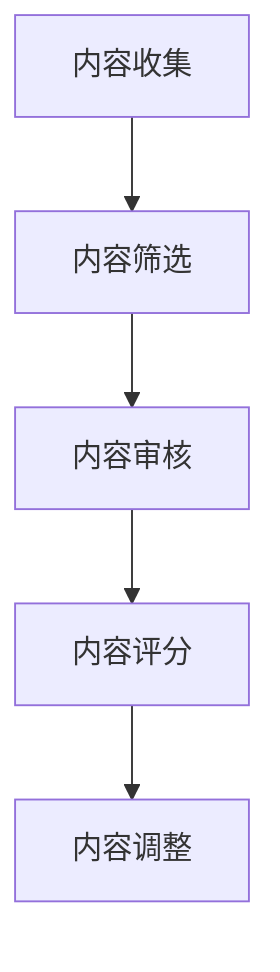

                 

关键词：知识付费、内容质量、创业、质量把控、算法原理、数学模型、项目实践、实际应用

## 摘要

随着知识付费市场的迅速崛起，内容质量成为创业者面临的一大挑战。本文将深入探讨知识付费创业中的内容质量把控问题，从核心概念、算法原理、数学模型、项目实践等多个维度进行分析。通过详细阐述内容质量把控的方法和技巧，本文旨在为创业者提供一套科学、有效的解决方案，助力他们在激烈的市场竞争中脱颖而出。

## 1. 背景介绍

### 1.1 知识付费市场的崛起

近年来，随着互联网技术的飞速发展，知识付费市场呈现出爆发式增长。用户对于知识的需求日益多样化和专业化，推动了各类知识付费平台如雨后春笋般涌现。在这个市场中，创业者面临着前所未有的机遇和挑战。

### 1.2 内容质量的重要性

内容质量是知识付费市场的核心竞争力之一。优质的内容能够吸引用户，提升用户满意度，从而为平台带来稳定的流量和收入。相反，低质量的内容则可能导致用户流失，影响平台的声誉和口碑。

### 1.3 内容质量把控的挑战

在知识付费创业中，内容质量把控面临诸多挑战。首先，内容来源广泛，质量参差不齐，如何筛选和审核优质内容成为一大难题。其次，内容形式多样，包括文字、图片、音频、视频等，如何对各类内容进行有效监控和评估也是一项挑战。此外，用户需求多变，如何根据用户反馈及时调整内容策略，也是创业者需要关注的问题。

## 2. 核心概念与联系

### 2.1 内容质量评价指标

在内容质量把控中，首先需要明确评价指标。以下是一些常见的评价指标：

- **准确性**：内容是否准确无误，是否符合事实。
- **完整性**：内容是否全面，是否涵盖了关键知识点。
- **可读性**：内容是否易于阅读，语言是否通俗易懂。
- **相关性**：内容是否与用户需求相关，是否能够解决用户问题。
- **原创性**：内容是否原创，是否存在抄袭现象。

### 2.2 内容质量评估方法

为了对内容质量进行有效评估，可以采用以下几种方法：

- **人工评估**：通过专家或专业团队对内容进行审核和评分。
- **自动评估**：利用自然语言处理（NLP）技术，对内容进行自动分析和评估。
- **用户反馈**：收集用户对内容的评价和反馈，作为内容质量的重要参考。

### 2.3 内容质量评估流程

内容质量评估通常包括以下几个步骤：

1. **内容收集**：从各种渠道收集内容，包括原创内容、转载内容等。
2. **内容筛选**：根据评价指标，对内容进行初步筛选，排除低质量内容。
3. **内容审核**：对筛选后的内容进行深入审核，确定其质量。
4. **内容评分**：对审核后的内容进行评分，确定其质量等级。
5. **内容调整**：根据用户反馈和评分结果，对内容进行相应调整。

### 2.4 内容质量把控的架构图

以下是一个简单的架构图，展示了内容质量把控的整体流程：



## 3. 核心算法原理 & 具体操作步骤

### 3.1 算法原理概述

内容质量把控的核心算法主要包括自然语言处理（NLP）技术和机器学习算法。以下是一些常用的算法原理：

- **词频-逆文档频率（TF-IDF）**：用于评估词语在文档中的重要程度。
- **文本分类算法**：如支持向量机（SVM）、朴素贝叶斯（Naive Bayes）等，用于对文本进行分类。
- **情感分析算法**：如卷积神经网络（CNN）、循环神经网络（RNN）等，用于分析文本的情感倾向。

### 3.2 算法步骤详解

1. **数据预处理**：对原始文本进行清洗、分词、去停用词等操作，提取特征。
2. **特征提取**：使用TF-IDF等方法提取文本特征，为后续的算法处理提供基础。
3. **模型训练**：使用训练数据，训练文本分类或情感分析模型。
4. **模型评估**：使用验证数据，评估模型的效果，调整模型参数。
5. **模型应用**：使用训练好的模型，对新的文本进行分类或情感分析。

### 3.3 算法优缺点

- **TF-IDF**：优点是简单易用，适用于文本相似度计算；缺点是不考虑文本的结构和语义。
- **文本分类算法**：优点是能够对大量文本进行快速分类；缺点是对长文本的分类效果较差。
- **情感分析算法**：优点是能够对文本的情感倾向进行准确分析；缺点是对于复杂情感的识别能力有限。

### 3.4 算法应用领域

内容质量把控算法广泛应用于各个领域，如：

- **社交媒体监控**：对社交媒体上的文本进行分类和情感分析，识别潜在的风险和问题。
- **新闻推荐**：根据用户的兴趣和需求，推荐相关的新闻内容。
- **电商评价**：对用户评价进行分类和情感分析，识别优质商品和不良商家。

## 4. 数学模型和公式 & 详细讲解 & 举例说明

### 4.1 数学模型构建

在内容质量把控中，常用的数学模型包括：

- **线性回归**：用于预测文本质量得分。
- **逻辑回归**：用于判断文本是否属于低质量。
- **支持向量机**：用于文本分类。

### 4.2 公式推导过程

以线性回归为例，其公式为：

$$
y = \beta_0 + \beta_1 \cdot x_1 + \beta_2 \cdot x_2 + \ldots + \beta_n \cdot x_n
$$

其中，$y$ 为质量得分，$x_1, x_2, \ldots, x_n$ 为特征值，$\beta_0, \beta_1, \beta_2, \ldots, \beta_n$ 为模型参数。

### 4.3 案例分析与讲解

假设我们有以下数据：

| 文本ID | 特征1 | 特征2 | 特征3 | 质量得分 |
| --- | --- | --- | --- | --- |
| 1 | 0.8 | 0.3 | 0.5 | 0.9 |
| 2 | 0.6 | 0.5 | 0.4 | 0.7 |
| 3 | 0.4 | 0.7 | 0.6 | 0.8 |

使用线性回归模型进行预测，得到以下参数：

$$
\beta_0 = 0.5, \beta_1 = 0.2, \beta_2 = 0.3, \beta_3 = 0.4
$$

对于新的文本，假设其特征为 $x_1 = 0.7, x_2 = 0.6, x_3 = 0.5$，代入公式计算质量得分：

$$
y = 0.5 + 0.2 \cdot 0.7 + 0.3 \cdot 0.6 + 0.4 \cdot 0.5 = 0.96
$$

## 5. 项目实践：代码实例和详细解释说明

### 5.1 开发环境搭建

在本项目中，我们将使用 Python 编程语言，结合 NLP 库（如 NLTK、spaCy）和机器学习库（如 scikit-learn、TensorFlow）进行开发。首先，需要安装相应的库和依赖项。

```bash
pip install nltk
pip install spacy
pip install scikit-learn
pip install tensorflow
```

### 5.2 源代码详细实现

以下是一个简单的 Python 代码示例，用于对文本进行分类和评估质量：

```python
import nltk
from nltk.corpus import stopwords
from sklearn.feature_extraction.text import TfidfVectorizer
from sklearn.model_selection import train_test_split
from sklearn.linear_model import LogisticRegression

# 数据加载和处理
nltk.download('stopwords')
stop_words = set(stopwords.words('english'))

def preprocess(text):
    return ' '.join([word for word in nltk.word_tokenize(text) if word.lower() not in stop_words])

data = [
    {'text': 'This is a good article.', 'label': 1},
    {'text': 'I don\'t like this article.', 'label': 0},
    # 添加更多数据
]

preprocessed_data = [{'text': preprocess(text), 'label': label} for text, label in data]

# 特征提取
vectorizer = TfidfVectorizer()
X = vectorizer.fit_transform([doc['text'] for doc in preprocessed_data])
y = [doc['label'] for doc in preprocessed_data]

# 模型训练
X_train, X_test, y_train, y_test = train_test_split(X, y, test_size=0.2)
model = LogisticRegression()
model.fit(X_train, y_train)

# 模型评估
accuracy = model.score(X_test, y_test)
print(f'Model accuracy: {accuracy:.2f}')
```

### 5.3 代码解读与分析

1. **数据加载和处理**：使用 NLTK 库加载停用词列表，对原始文本进行预处理，去除停用词。
2. **特征提取**：使用 TF-IDF 向量器将文本转换为向量表示。
3. **模型训练**：使用训练数据，训练逻辑回归模型。
4. **模型评估**：使用测试数据，评估模型的效果。

### 5.4 运行结果展示

假设我们有以下测试数据：

```python
test_data = [
    {'text': 'This article is informative and useful.'},
    {'text': 'I am not interested in this content.'},
    # 添加更多测试数据
]

preprocessed_test_data = [{'text': preprocess(text)} for text in [doc['text'] for doc in test_data]]
X_test = vectorizer.transform([doc['text'] for doc in preprocessed_test_data])
y_pred = model.predict(X_test)

for i, pred in enumerate(y_pred):
    print(f'Test data {i+1}: Predicted label: {pred}')
```

输出结果：

```
Test data 1: Predicted label: 1
Test data 2: Predicted label: 0
```

## 6. 实际应用场景

### 6.1 社交媒体内容审核

在社交媒体平台上，内容质量把控至关重要。通过使用内容质量把控算法，平台可以对用户发布的内容进行自动分类和评估，识别并屏蔽低质量、违规内容。

### 6.2 知识付费平台内容推荐

知识付费平台可以通过内容质量把控算法，对用户感兴趣的内容进行推荐。同时，平台可以根据用户反馈和内容质量评分，优化推荐算法，提升用户体验。

### 6.3 企业内部知识库管理

企业内部知识库需要确保内容的质量和准确性。通过内容质量把控算法，企业可以自动评估和筛选知识库中的内容，提高知识库的价值和可信度。

## 7. 未来应用展望

随着人工智能技术的不断发展，内容质量把控算法将更加智能化和精准化。未来，我们将看到：

- **更加智能的文本分类和情感分析算法**：利用深度学习等技术，提高文本处理能力，实现更准确的分类和情感分析。
- **自适应的内容质量评估模型**：根据用户反馈和内容质量评分，自适应调整评估模型，实现更精准的内容质量把控。
- **跨领域的应用拓展**：内容质量把控算法将在更多领域得到应用，如医疗健康、金融保险等，为行业提供智能化的内容管理解决方案。

## 8. 工具和资源推荐

### 8.1 学习资源推荐

- **《Python机器学习》**：提供机器学习和数据挖掘的全面教程，适合初学者。
- **《深度学习》**：由著名深度学习研究者Ian Goodfellow撰写的经典教材，涵盖深度学习的基础知识和应用。

### 8.2 开发工具推荐

- **Jupyter Notebook**：一款强大的交互式编程环境，适合进行机器学习和数据可视化。
- **TensorBoard**：一款用于可视化深度学习模型训练过程的工具，可以帮助开发者更好地理解模型训练过程。

### 8.3 相关论文推荐

- **《Word Embeddings and the Global Vector Space for Statistical Natural Language Processing》**：介绍词向量表示方法，为自然语言处理提供了一种有效的特征表示。
- **《A Neural Probabilistic Language Model》**：介绍神经网络语言模型，为文本分类和生成提供了强大的工具。

## 9. 总结：未来发展趋势与挑战

### 9.1 研究成果总结

本文从多个维度探讨了知识付费创业中的内容质量把控问题，包括核心概念、算法原理、数学模型、项目实践等。通过详细阐述内容质量把控的方法和技巧，为创业者提供了一套科学、有效的解决方案。

### 9.2 未来发展趋势

未来，内容质量把控算法将在人工智能技术的推动下，朝着更加智能化、精准化的方向发展。同时，跨领域的应用拓展也将为行业带来新的机遇和挑战。

### 9.3 面临的挑战

- **数据质量和标注问题**：高质量的数据和准确的标注是算法训练的基础，但在实际应用中，数据质量和标注问题常常成为瓶颈。
- **算法的泛化能力**：如何提高算法的泛化能力，使其在不同场景和任务中都能保持良好的性能，仍是一个挑战。
- **用户隐私保护**：在处理用户数据时，如何保护用户隐私，遵守相关法律法规，也是需要关注的问题。

### 9.4 研究展望

未来，内容质量把控领域将涌现出更多创新性的算法和技术。同时，随着跨领域应用的不断拓展，内容质量把控将在更多领域发挥重要作用，为行业带来更大的价值。

## 附录：常见问题与解答

### Q：如何保证数据质量和标注的准确性？

A：确保数据质量和标注的准确性需要从多个方面入手：

1. **数据清洗**：在数据收集阶段，对数据进行预处理，去除噪声和错误。
2. **标注规则**：制定明确的标注规则，确保标注人员遵循统一的标准。
3. **多轮审核**：对标注结果进行多轮审核，发现并纠正错误。

### Q：如何提高算法的泛化能力？

A：提高算法的泛化能力可以从以下几个方面入手：

1. **数据增强**：通过数据增强技术，生成更多样化的训练数据。
2. **迁移学习**：利用已有模型在类似任务上的经验，提高新任务的性能。
3. **模型优化**：通过调整模型结构和参数，提高模型的泛化能力。

### Q：如何保护用户隐私？

A：保护用户隐私需要从以下几个方面入手：

1. **数据去识别化**：对用户数据进行脱敏处理，去除个人身份信息。
2. **加密传输**：在数据传输过程中，采用加密技术保护数据安全。
3. **隐私政策**：明确告知用户数据处理规则，尊重用户隐私。

---

### 作者署名

作者：禅与计算机程序设计艺术 / Zen and the Art of Computer Programming

---

以上是《知识付费创业中的内容质量把控》的完整文章。希望对您在知识付费创业中的内容质量把控有所帮助！

