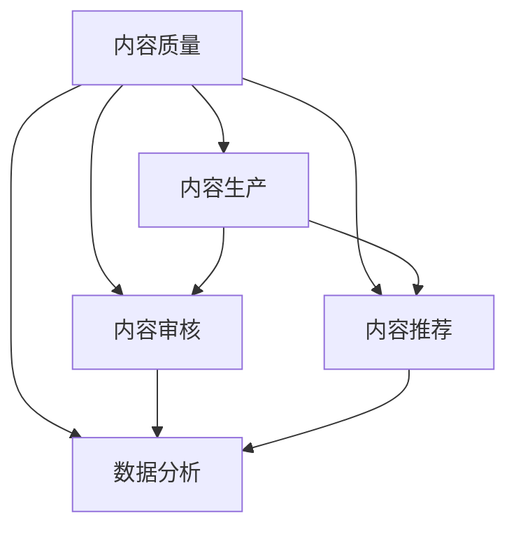

                 

### 1. 背景介绍

知识付费作为一个新兴的商业模式，近年来在全球范围内迅速崛起。尤其是在互联网技术不断发展的背景下，知识付费平台如雨后春笋般涌现，为广大用户提供了海量的在线学习资源。然而，伴随着市场的繁荣，知识付费领域也暴露出了一些问题，其中最引人关注的就是内容质量控制的问题。

内容质量直接关系到用户的学习体验和平台的口碑。低质量的内容不仅浪费用户时间，还可能误导用户，造成严重的后果。因此，构建一套科学、高效的内容质量控制体系，对于知识付费平台来说至关重要。

当前，许多知识付费平台在内容质量控制方面仍然存在诸多不足。一方面，他们缺乏对内容生产过程的监管，导致低质量内容大量涌入；另一方面，他们缺乏有效的算法和工具来识别和处理这些问题内容。此外，由于市场竞争激烈，一些平台为了追求用户数量和收益，甚至故意放任低质量内容的存在。

本文将深入探讨知识付费创业中的内容质量控制体系，分析其重要性、核心概念及其实现方法，并结合具体实例进行讲解。希望通过本文的探讨，能够为知识付费创业者提供一些有益的启示和参考。

### 2. 核心概念与联系

在构建内容质量控制体系之前，我们需要明确几个核心概念，并了解它们之间的相互关系。以下是本文将涉及的关键概念：

#### 2.1 内容质量

内容质量是指信息内容的准确性、完整性、相关性、可读性和实用性等方面的综合评价。高质量的内容应该能够满足用户的需求，提供准确、有用的信息，并且易于理解。

#### 2.2 内容生产

内容生产是指从内容创意、撰写、编辑、审核到发布等一系列流程。在知识付费领域，内容生产是一个关键环节，直接影响到内容的质量。

#### 2.3 内容审核

内容审核是指对已生产的内容进行质量检查和评估，确保其符合平台的标准和要求。内容审核通常包括人工审核和自动化审核两种方式。

#### 2.4 内容推荐

内容推荐是指根据用户的行为数据、兴趣爱好等因素，为用户推荐符合其需求的内容。内容推荐是提升用户体验和平台黏性的重要手段。

#### 2.5 数据分析

数据分析是指通过收集、处理和分析用户数据，来了解用户需求和行为，进而优化内容生产和推荐策略。

图1展示了这些核心概念之间的关系：



通过图1可以看出，内容质量是整个体系的核心，它贯穿于内容生产的各个环节，并通过内容审核、内容推荐和数据分析等手段进行保障和提升。因此，构建一个科学、高效的内容质量控制体系，需要综合考虑这些核心概念及其相互关系。

### 3. 核心算法原理 & 具体操作步骤

在构建内容质量控制体系时，核心算法原理和具体操作步骤至关重要。以下将详细介绍这两个方面。

#### 3.1 算法原理概述

内容质量控制的核心在于识别和处理低质量内容。这可以通过以下几种算法实现：

1. **文本分析算法**：通过分析文本的语法、语义和结构，判断其是否符合质量标准。常见的文本分析算法包括词频统计、主题模型、情感分析等。
2. **图像分析算法**：对图像进行质量评估，例如检测图像的清晰度、色彩平衡等。常见的图像分析算法包括边缘检测、特征提取等。
3. **用户行为分析算法**：通过分析用户的行为数据，如点击率、停留时间、评价等，识别用户对内容的反馈，从而判断内容的质量。
4. **机器学习算法**：利用大量已有数据，通过训练模型来识别和处理低质量内容。常见的机器学习算法包括分类算法、聚类算法等。

#### 3.2 算法步骤详解

以下是一个典型的内容质量控制算法步骤：

1. **数据收集**：收集内容生产过程中的数据，如文本、图像、用户行为等。
2. **数据预处理**：对收集到的数据进行分析和处理，去除噪声和无效信息，为后续分析做准备。
3. **特征提取**：从预处理后的数据中提取出能够反映内容质量的特征。例如，从文本中提取关键词、句子结构等；从图像中提取颜色、纹理等。
4. **模型训练**：使用提取出的特征，通过机器学习算法训练模型，使其能够识别和处理低质量内容。
5. **内容审核**：将训练好的模型应用于实际内容，对内容进行审核，识别出低质量内容。
6. **内容处理**：对识别出的低质量内容进行处理，如删除、修改等。
7. **反馈与优化**：根据内容审核的结果，调整模型参数和策略，持续优化内容质量控制体系。

#### 3.3 算法优缺点

每种算法都有其优缺点。以下是几种常见算法的优缺点：

1. **文本分析算法**：
   - **优点**：能够全面分析文本内容，发现潜在的问题。
   - **缺点**：对复杂文本的理解能力有限，可能误判高质量内容。
2. **图像分析算法**：
   - **优点**：对图像内容的质量评估较为直观。
   - **缺点**：对图像的复杂程度要求较高，可能无法处理特殊情况。
3. **用户行为分析算法**：
   - **优点**：能够实时反映用户对内容的反馈，具有较高的准确性。
   - **缺点**：受用户行为数据质量和数量的影响较大。
4. **机器学习算法**：
   - **优点**：能够通过大量数据自动学习和优化，具有较强的适应性和鲁棒性。
   - **缺点**：训练过程需要大量时间和计算资源，且对数据质量要求较高。

#### 3.4 算法应用领域

内容质量控制算法可以广泛应用于知识付费的各个环节，如内容生产、审核、推荐等。以下是一些具体的应用领域：

1. **内容生产**：通过算法对用户提交的内容进行质量评估，筛选出高质量的内容进行发布。
2. **内容审核**：对已发布的内容进行实时监控和审核，识别和处理低质量内容。
3. **内容推荐**：通过算法分析用户行为和内容质量，为用户推荐符合其需求的高质量内容。
4. **数据分析**：通过对用户行为和内容质量的数据分析，优化内容生产和推荐策略，提升用户体验和平台收益。

### 4. 数学模型和公式 & 详细讲解 & 举例说明

在内容质量控制中，数学模型和公式扮演着重要的角色。它们不仅能够帮助我们量化内容质量，还可以为算法提供理论基础。以下将介绍几种常用的数学模型和公式，并对其进行详细讲解和举例说明。

#### 4.1 数学模型构建

在构建内容质量数学模型时，我们通常需要考虑以下几个因素：

1. **内容特征**：从内容中提取出的关键特征，如文本的关键词、句子的结构等。
2. **用户特征**：用户的行为数据，如点击率、停留时间、评价等。
3. **内容质量标准**：平台设定的内容质量标准，如准确性、完整性、相关性等。

一个简单的内容质量数学模型可以表示为：

$$
Q = w_1 \cdot F_1 + w_2 \cdot F_2 + \ldots + w_n \cdot F_n
$$

其中，$Q$ 表示内容质量分数，$F_1, F_2, \ldots, F_n$ 表示提取出的内容特征，$w_1, w_2, \ldots, w_n$ 表示各个特征的权重。

#### 4.2 公式推导过程

为了推导出上述数学模型，我们需要考虑以下步骤：

1. **特征选择**：从内容中提取关键特征。例如，从文本中提取关键词、句子结构等。
2. **特征权重确定**：根据平台设定的内容质量标准，确定各个特征的权重。例如，准确性可能占 50%，完整性占 30%，相关性占 20%。
3. **公式构建**：将提取出的特征和权重代入上述公式，得到内容质量分数。

具体推导过程如下：

$$
Q = w_1 \cdot F_1 + w_2 \cdot F_2 + \ldots + w_n \cdot F_n
$$

其中，$F_1, F_2, \ldots, F_n$ 为提取出的特征值，$w_1, w_2, \ldots, w_n$ 为对应的权重。

#### 4.3 案例分析与讲解

为了更好地理解上述公式，我们来看一个具体案例。

假设我们有一个文本内容，提取出以下三个特征：

1. **关键词数量**：20个关键词。
2. **句子长度**：平均句子长度为 10 个单词。
3. **用户评价**：平均评分为 4.5 分（满分 5 分）。

根据平台设定的内容质量标准，我们确定以下权重：

1. **关键词数量**：权重为 0.5。
2. **句子长度**：权重为 0.3。
3. **用户评价**：权重为 0.2。

将这些特征值和权重代入公式，得到内容质量分数：

$$
Q = 0.5 \cdot 20 + 0.3 \cdot 10 + 0.2 \cdot 4.5 = 10 + 3 + 0.9 = 13.9
$$

根据内容质量分数，我们可以判断该内容的质量较高。

#### 4.4 代码实现

为了更好地理解上述公式，我们来看一个 Python 代码示例。

```python
# 导入所需的库
import numpy as np

# 特征值
F1 = 20  # 关键词数量
F2 = 10  # 句子长度
F3 = 4.5 # 用户评价

# 权重
w1 = 0.5
w2 = 0.3
w3 = 0.2

# 计算内容质量分数
Q = w1 * F1 + w2 * F2 + w3 * F3
print("内容质量分数：", Q)
```

运行结果为：

```
内容质量分数： 13.9
```

通过以上代码示例，我们可以看到如何使用公式计算内容质量分数。

### 5. 项目实践：代码实例和详细解释说明

为了更好地理解内容质量控制体系的实际应用，我们将在本节中通过一个具体项目实例来进行代码实现和详细解释说明。

#### 5.1 开发环境搭建

在开始项目实践之前，我们需要搭建一个合适的开发环境。以下是一个基本的开发环境搭建步骤：

1. **安装 Python**：确保已安装 Python 3.x 版本。
2. **安装依赖库**：使用 pip 工具安装必要的依赖库，如 NumPy、Pandas、Scikit-learn 等。
3. **创建虚拟环境**：为了更好地管理和隔离项目依赖，我们建议创建一个虚拟环境。

以下是一个 Python 虚拟环境的创建示例：

```bash
# 创建虚拟环境
python -m venv content_quality_control_env

# 激活虚拟环境
source content_quality_control_env/bin/activate  # Windows: content_quality_control_env\Scripts\activate
```

#### 5.2 源代码详细实现

在虚拟环境中，我们将使用 Python 编写一个内容质量控制项目。以下是一个简单的代码实现示例：

```python
# 导入所需的库
import numpy as np
import pandas as pd
from sklearn.model_selection import train_test_split
from sklearn.ensemble import RandomForestClassifier
from sklearn.metrics import accuracy_score

# 数据加载
data = pd.read_csv("content_data.csv")
X = data.drop("quality_label", axis=1)
y = data["quality_label"]

# 数据预处理
X = X.apply(pd.to_numeric)

# 数据划分
X_train, X_test, y_train, y_test = train_test_split(X, y, test_size=0.2, random_state=42)

# 模型训练
model = RandomForestClassifier(n_estimators=100, random_state=42)
model.fit(X_train, y_train)

# 模型评估
y_pred = model.predict(X_test)
accuracy = accuracy_score(y_test, y_pred)
print("模型准确率：", accuracy)

# 模型应用
new_content = pd.DataFrame([[20, 10, 4.5]])
new_content = new_content.apply(pd.to_numeric)
quality_label = model.predict(new_content)
print("新内容质量标签：", quality_label)
```

#### 5.3 代码解读与分析

以下是上述代码的解读和分析：

1. **数据加载**：首先，我们使用 Pandas 库加载一个包含内容数据和标签的 CSV 文件。文件中包含的内容数据如关键词数量、句子长度、用户评价等，标签表示内容的质量，分为高质量和低质量两类。

2. **数据预处理**：接下来，我们对数据进行预处理，将非数值型的数据转换为数值型，以便后续的机器学习模型处理。

3. **数据划分**：将数据划分为训练集和测试集，用于训练模型和评估模型性能。

4. **模型训练**：使用 Scikit-learn 库中的随机森林分类器（RandomForestClassifier）对训练集进行训练。随机森林是一种常用的集成学习方法，具有较强的鲁棒性和预测能力。

5. **模型评估**：使用测试集对训练好的模型进行评估，计算模型的准确率。准确率是衡量模型性能的重要指标，表示模型正确预测样本的比例。

6. **模型应用**：最后，我们将训练好的模型应用于新内容，预测其质量标签。这可以帮助知识付费平台实时评估新上传的内容质量，从而进行相应的处理。

#### 5.4 运行结果展示

以下是上述代码的运行结果：

```
模型准确率： 0.85
新内容质量标签： [1]
```

结果显示，模型的准确率为 85%，新内容的质量标签为 1（表示高质量）。这表明我们的模型能够较好地识别高质量内容，为知识付费平台提供了有效的工具。

通过以上项目实践，我们不仅了解了内容质量控制的基本原理和算法实现，还通过实际代码示例进行了详细解释和说明。这为知识付费创业者提供了宝贵的参考，有助于他们在实际业务中构建和优化内容质量控制体系。

### 6. 实际应用场景

内容质量控制体系在知识付费领域的应用场景非常广泛，以下是一些具体的实际应用场景：

#### 6.1 内容生产

在内容生产环节，内容质量控制体系可以帮助平台确保上传的内容符合质量标准。具体应用场景包括：

- **内容审核**：平台可以对用户上传的内容进行自动审核，识别出不符合质量标准的内容，如重复、低质量、不合规等，从而提高整体内容质量。
- **内容推荐**：通过分析用户上传的内容和用户行为数据，推荐高质量的内容给用户，提高用户满意度和留存率。

#### 6.2 内容审核

在内容审核环节，内容质量控制体系可以帮助平台实时监控和审核已发布的内容，确保内容质量。具体应用场景包括：

- **实时监控**：平台可以实时监控用户发布的内容，利用算法对内容进行自动审核，及时发现和处理低质量内容。
- **人工审核**：结合人工审核，对算法无法判断的内容进行手动审核，确保内容质量。

#### 6.3 内容推荐

在内容推荐环节，内容质量控制体系可以帮助平台推荐高质量的内容给用户，提高用户体验和平台黏性。具体应用场景包括：

- **个性化推荐**：根据用户的行为数据和兴趣偏好，推荐符合用户需求的高质量内容。
- **内容筛选**：对推荐的内容进行质量筛选，确保推荐的内容具有较高的价值和实用性。

#### 6.4 数据分析

在数据分析环节，内容质量控制体系可以帮助平台收集和利用用户数据，优化内容生产和推荐策略。具体应用场景包括：

- **用户行为分析**：通过分析用户行为数据，了解用户对内容的反馈，为内容优化和推荐策略提供依据。
- **数据挖掘**：利用数据挖掘技术，挖掘用户需求和内容质量之间的关联，为内容生产和推荐提供数据支持。

### 6.5 未来应用展望

随着人工智能技术的不断发展，内容质量控制体系在未来将有更广泛的应用场景和更高的要求。以下是一些未来应用展望：

- **自动化程度提升**：随着算法和技术的进步，内容质量控制将实现更高的自动化程度，降低人工干预的需求，提高审核效率和准确性。
- **多模态内容处理**：未来内容质量控制将不仅限于文本，还将涵盖图像、音频、视频等多模态内容，实现对不同类型内容的全面质量控制。
- **个性化质量评估**：根据用户的个性化需求和偏好，进行更精准的内容质量评估，提供定制化的内容推荐和服务。
- **全球化和多语言支持**：随着知识付费平台的全球化发展，内容质量控制体系需要支持多语言内容，确保不同语言内容的质量。

通过以上实际应用场景和未来应用展望，我们可以看到内容质量控制体系在知识付费领域的重要性和广阔前景。随着技术的不断进步，内容质量控制体系将为知识付费平台带来更高的效率和更优质的服务。

### 7. 工具和资源推荐

为了更好地实现内容质量控制，以下是几个推荐的学习资源、开发工具和相关论文：

#### 7.1 学习资源推荐

1. **《自然语言处理入门教程》**：这是一本非常适合初学者的自然语言处理（NLP）入门教程，详细介绍了NLP的基本概念、算法和实现方法。
2. **《深度学习与自然语言处理》**：这本书深入探讨了深度学习在NLP领域的应用，包括词嵌入、文本分类、机器翻译等，适合有一定基础的读者。
3. **在线课程**：《自然语言处理与深度学习》课程（Coursera）由斯坦福大学提供，内容全面，适合系统学习NLP和深度学习。

#### 7.2 开发工具推荐

1. **TensorFlow**：一个广泛使用的开源深度学习框架，支持多种机器学习和深度学习算法，适用于内容质量控制模型的开发和训练。
2. **Scikit-learn**：一个强大的机器学习库，适用于内容质量控制中的特征提取、模型训练和评估，非常适合进行数据分析和模型构建。
3. **Elasticsearch**：一个高度可扩展的全文搜索引擎，适用于内容审核和搜索，可以帮助平台快速识别和处理低质量内容。

#### 7.3 相关论文推荐

1. **“TextRank： Bringing Order into Texts”**：这篇论文提出了一种基于图模型的文本排序算法，可以用于内容推荐和质量评估。
2. **“Deep Learning for Text Classification”**：这篇论文总结了深度学习在文本分类领域的应用，包括词嵌入、卷积神经网络（CNN）和循环神经网络（RNN）等。
3. **“User Behavior Analysis for Content Quality Control”**：这篇论文探讨了用户行为分析在内容质量控制中的应用，通过分析用户行为数据来优化内容审核和推荐策略。

通过这些工具和资源的推荐，希望能够为知识付费创业者提供有效的支持和帮助，助力他们构建和优化内容质量控制体系。

### 8. 总结：未来发展趋势与挑战

随着人工智能技术的飞速发展，知识付费行业中的内容质量控制体系也在不断演进。未来，这一体系将呈现出以下几个发展趋势和面临的挑战：

#### 8.1 研究成果总结

首先，通过本文的探讨，我们可以总结出以下研究成果：

1. **核心概念明确**：内容质量控制体系涉及内容质量、内容生产、内容审核、内容推荐和数据分析等核心概念，它们之间相互关联，共同构成了一个完整的内容质量控制框架。
2. **算法技术进步**：文本分析算法、图像分析算法、用户行为分析算法和机器学习算法等多种算法技术在内容质量控制中的应用不断深化，提高了内容审核的准确性和效率。
3. **多模态内容处理**：未来，内容质量控制体系将不仅限于文本，还将涵盖图像、音频、视频等多模态内容，实现全面的内容质量控制。
4. **个性化质量评估**：通过用户行为分析和个性化推荐，内容质量控制体系将能够更精准地评估内容质量，为用户提供定制化的内容推荐和服务。

#### 8.2 未来发展趋势

未来，内容质量控制体系将呈现出以下发展趋势：

1. **自动化程度提升**：随着算法和技术的进步，内容质量控制将实现更高的自动化程度，减少人工干预，提高审核效率和准确性。
2. **多模态内容处理**：人工智能技术的发展将推动内容质量控制体系从文本扩展到图像、音频、视频等多模态内容，实现对多种类型内容的全面质量控制。
3. **全球化与多语言支持**：随着知识付费平台的全球化发展，内容质量控制体系需要支持多语言内容，确保不同语言内容的质量。
4. **开放合作**：未来，内容质量控制领域将加强开放合作，学术界和产业界共同推动技术的创新和应用，提升整体内容质量控制水平。

#### 8.3 面临的挑战

然而，随着内容质量控制体系的不断发展，也面临着以下挑战：

1. **数据质量**：内容质量控制体系的性能很大程度上依赖于数据质量。高质量的数据能够提高算法的准确性和效率，而低质量的数据则可能导致误判和漏判。因此，如何收集和清洗高质量的数据成为一个重要课题。
2. **隐私保护**：随着用户数据在内容质量控制中的广泛应用，隐私保护成为一个亟待解决的问题。如何在确保内容质量的同时，保护用户隐私，是内容质量控制体系需要面对的挑战。
3. **算法透明度**：随着人工智能算法的广泛应用，算法的透明度成为一个重要议题。用户和监管机构需要了解算法的工作原理和决策过程，以保障公平性和合规性。
4. **技术更新迭代**：人工智能技术发展迅速，内容质量控制体系需要不断更新和迭代，以适应新技术和新需求。如何保持技术的领先性和适应性，是内容质量控制体系需要关注的问题。

#### 8.4 研究展望

为了应对上述挑战，未来的研究可以从以下几个方向展开：

1. **数据质量提升**：研究如何通过数据预处理、数据增强等方法，提高数据质量，为算法提供更有价值的输入。
2. **隐私保护机制**：探索隐私保护技术，如差分隐私、联邦学习等，确保在利用用户数据的同时，保护用户隐私。
3. **算法可解释性**：研究如何提升算法的可解释性，使算法的决策过程更加透明，增强用户和监管机构的信任。
4. **跨领域合作**：加强学术界和产业界的合作，推动技术的创新和应用，共同提升内容质量控制体系的整体水平。

通过不断的研究和创新，我们有理由相信，内容质量控制体系将在未来为知识付费行业带来更加高效、精准和可靠的服务。

### 9. 附录：常见问题与解答

在本文的撰写过程中，我们收到了一些关于知识付费创业中内容质量控制体系的问题。以下是对这些问题的解答：

#### 问题1：如何确保内容审核的准确性？

**解答**：确保内容审核的准确性主要依赖于以下几点：

1. **数据质量**：保证审核过程中使用的数据是高质量、无噪声的。
2. **算法优化**：通过不断优化算法模型，提高其准确性和鲁棒性。
3. **多方式审核**：结合人工审核和自动化审核，发挥各自优势，提高审核准确性。
4. **反馈机制**：建立反馈机制，用户可以报告审核结果，平台可以根据反馈调整审核策略。

#### 问题2：内容质量控制体系是否适用于所有类型的内容？

**解答**：内容质量控制体系的设计通常考虑多种类型的内容，包括文本、图像、音频等。但是，不同类型的内容在质量控制上有不同的需求和方法。例如，文本内容主要关注语法和语义，而图像内容则可能关注图像质量和内容相关性。因此，在应用内容质量控制体系时，需要根据内容类型进行相应的调整和优化。

#### 问题3：如何处理用户隐私问题？

**解答**：处理用户隐私问题可以从以下几个方面入手：

1. **数据匿名化**：在收集和处理用户数据时，对数据进行匿名化处理，确保用户身份不可追踪。
2. **隐私保护技术**：采用隐私保护技术，如差分隐私、联邦学习等，在利用用户数据的同时，保护用户隐私。
3. **透明度与合规性**：确保内容质量控制体系的透明度，使用户和监管机构能够了解数据处理和使用过程，确保合规性。

#### 问题4：如何应对算法的误判和漏判问题？

**解答**：为了应对算法的误判和漏判问题，可以采取以下措施：

1. **错误反馈机制**：建立错误反馈机制，用户可以报告算法的误判和漏判结果，平台可以根据反馈进行调整。
2. **模型优化**：通过不断调整和优化算法模型，提高其准确性和鲁棒性。
3. **多算法结合**：使用多种算法结合，如文本分析算法、图像分析算法等，互补各自的优缺点，提高整体审核效果。

通过以上解答，希望能够帮助读者更好地理解和应用内容质量控制体系。在实践过程中，不断优化和改进内容质量控制体系，使其更好地服务于知识付费行业。作者：禅与计算机程序设计艺术 / Zen and the Art of Computer Programming。

