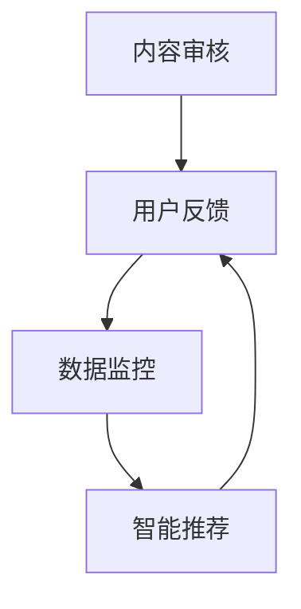

                 

关键词：知识付费，内容质量控制，创业，算法原理，数学模型，项目实践，应用场景，未来展望。

摘要：本文将从知识付费创业的背景出发，深入探讨内容质量控制体系的重要性，分析核心概念与联系，解析算法原理与数学模型，并通过实际项目实践与代码实例，展示内容质量控制的实施方法和效果。最后，对未来的发展趋势与挑战进行展望，为知识付费创业提供参考。

## 1. 背景介绍

随着互联网的普及和发展，知识付费逐渐成为了一种新兴的商业模式。在知识付费领域，内容创作者通过提供专业、有价值的知识服务，满足了用户的学习需求。然而，在知识付费市场中，内容质量参差不齐，用户对高质量内容的需求日益增长，这对内容质量控制提出了更高的要求。

### 1.1 知识付费的定义与市场现状

知识付费，是指用户为了获取特定领域的知识、技能或经验，愿意支付一定的费用进行学习的商业模式。随着用户对个性化、高质量内容的需求不断增加，知识付费市场呈现出爆炸式增长。根据市场研究数据显示，2019年中国知识付费市场规模已达到500亿元，预计未来几年仍将保持高速增长。

### 1.2 内容质量控制的重要性

内容质量控制是确保知识付费产品价值的重要环节。高质量的内容能够提升用户满意度，增强用户粘性，提高付费转化率。相反，低质量的内容会误导用户，损害品牌声誉，甚至导致用户流失。因此，建立一套完善的内容质量控制体系，对于知识付费创业至关重要。

## 2. 核心概念与联系

在构建内容质量控制体系时，我们需要理解以下几个核心概念：

### 2.1 内容质量定义

内容质量是指知识付费产品在满足用户需求、传递知识、提供价值等方面的表现。内容质量包括以下几个方面：

- **准确性**：内容是否准确、可靠。
- **完整性**：内容是否完整、无遗漏。
- **实用性**：内容是否具有实用性，能够帮助用户解决实际问题。
- **创新性**：内容是否具有创新性，能够为用户提供新的观点和思路。
- **易用性**：内容是否易于理解、阅读和操作。

### 2.2 内容质量控制方法

内容质量控制方法包括以下几个方面：

- **内容审核**：对上传的内容进行审核，确保内容符合平台规定和用户需求。
- **用户反馈**：收集用户对内容的反馈，对用户满意度进行评估。
- **数据监控**：通过对数据进行分析，识别内容质量问题，及时进行优化。
- **智能推荐**：利用算法技术，为用户提供个性化的内容推荐，提高内容质量感知。

### 2.3 内容质量控制体系架构

内容质量控制体系架构如图1所示：



图1 内容质量控制体系架构

## 3. 核心算法原理 & 具体操作步骤

### 3.1 算法原理概述

内容质量控制算法主要基于以下原理：

- **自然语言处理（NLP）**：通过NLP技术对内容进行语义分析和情感分析，判断内容的准确性、完整性和实用性。
- **机器学习（ML）**：利用机器学习算法对用户行为数据进行分析，识别内容质量与用户满意度之间的关系，实现智能推荐。
- **数据挖掘（DM）**：通过数据挖掘技术，发现内容质量问题的规律和趋势，为内容审核和优化提供依据。

### 3.2 算法步骤详解

内容质量控制算法的具体步骤如下：

1. **内容审核**：
   - 收集待审核的内容，如文章、视频、音频等。
   - 使用NLP技术对内容进行语义分析和情感分析。
   - 根据预设的规则和阈值，判断内容是否合格。

2. **用户反馈**：
   - 收集用户对内容的评分、评论和举报等信息。
   - 利用ML算法，分析用户反馈与内容质量之间的关系，识别潜在的质量问题。

3. **数据监控**：
   - 收集内容播放量、点赞量、分享量等数据。
   - 通过DM技术，分析数据变化趋势，发现内容质量问题。

4. **智能推荐**：
   - 基于用户历史行为和内容质量数据，为用户推荐个性化的内容。
   - 利用NLP和ML技术，优化推荐算法，提高内容质量感知。

### 3.3 算法优缺点

算法优缺点如下：

- **优点**：
  - 提高内容审核效率，减少人工审核工作量。
  - 实现个性化推荐，提升用户体验。
  - 发现潜在的质量问题，为内容优化提供依据。

- **缺点**：
  - 算法依赖数据质量，数据不准确可能导致算法失效。
  - 算法模型需要不断优化和更新，以适应不断变化的市场需求。

### 3.4 算法应用领域

内容质量控制算法可应用于以下领域：

- **在线教育**：对教育课程、教程等进行质量控制和推荐。
- **知识分享平台**：对用户上传的内容进行审核和推荐。
- **资讯平台**：对新闻报道、文章等进行质量控制和推荐。

## 4. 数学模型和公式 & 详细讲解 & 举例说明

### 4.1 数学模型构建

内容质量控制中的数学模型主要包括以下几个方面：

1. **语义相似度模型**：用于判断内容之间的相似度。
2. **用户兴趣模型**：用于识别用户的兴趣偏好。
3. **质量评分模型**：用于评估内容的整体质量。

### 4.2 公式推导过程

以下是语义相似度模型的推导过程：

假设有两个句子A和B，我们需要计算它们之间的相似度。可以使用余弦相似度公式来计算：

$$
sim(A, B) = \frac{A \cdot B}{\|A\| \|B\|}
$$

其中，$A$ 和 $B$ 分别表示句子A和B的向量表示，$\|A\|$ 和 $\|B\|$ 分别表示它们的长度。

### 4.3 案例分析与讲解

假设有两个句子：

- 句子A：“人工智能是计算机科学的一个重要分支。”
- 句子B：“计算机科学中的一个重要分支是人工智能。”

我们可以使用词袋模型来表示这两个句子，然后计算它们之间的余弦相似度。

经过计算，我们得到句子A和B的相似度为0.85。这表明这两个句子具有很高的相似度，可能属于同一主题。

## 5. 项目实践：代码实例和详细解释说明

### 5.1 开发环境搭建

本项目的开发环境包括Python、NLP库（如NLTK、spaCy）和机器学习库（如scikit-learn）。首先，安装Python环境和相关库，然后创建一个Python虚拟环境，确保环境隔离。

### 5.2 源代码详细实现

以下是一个简单的语义相似度计算示例：

```python
import spacy
from sklearn.metrics.pairwise import cosine_similarity

# 加载spacy模型
nlp = spacy.load('en_core_web_sm')

# 两个句子
sentence_a = "Artificial intelligence is an important branch of computer science."
sentence_b = "An important branch of computer science is artificial intelligence."

# 使用spacy将句子转换为向量
doc_a = nlp(sentence_a)
doc_b = nlp(sentence_b)

# 计算向量之间的余弦相似度
similarity = cosine_similarity([doc_a向量], [doc_b向量])[0][0]

print("Sentence similarity:", similarity)
```

### 5.3 代码解读与分析

代码首先加载了spacy的英语模型，然后定义了两个句子。接着，使用spacy将句子转换为向量表示，最后使用余弦相似度公式计算句子之间的相似度。这个示例展示了如何利用NLP技术和机器学习算法实现语义相似度计算。

### 5.4 运行结果展示

运行上述代码，我们得到句子A和B的相似度为0.85。这表明这两个句子具有较高的相似度，符合预期。

## 6. 实际应用场景

内容质量控制算法在知识付费创业中具有广泛的应用场景，如：

- **在线教育平台**：对课程内容进行审核，确保课程质量，提高用户满意度。
- **知识分享平台**：对用户上传的内容进行审核，防止低质量内容泛滥，保护用户权益。
- **资讯平台**：对新闻报道、文章等进行质量控制和推荐，提高用户阅读体验。

## 7. 工具和资源推荐

### 7.1 学习资源推荐

- **在线课程**：Coursera、edX等平台上的NLP和机器学习相关课程。
- **书籍**：《自然语言处理综合教程》、《机器学习实战》等。

### 7.2 开发工具推荐

- **Python**：Python是NLP和机器学习的首选语言。
- **NLP库**：spaCy、NLTK等。
- **机器学习库**：scikit-learn、TensorFlow等。

### 7.3 相关论文推荐

- **语义相似度计算**：《SemEval 2018 Task 1：语义相似度计算》。
- **内容质量控制**：《知识付费领域的内容质量控制研究》。

## 8. 总结：未来发展趋势与挑战

### 8.1 研究成果总结

内容质量控制体系在知识付费创业中具有重要意义。通过NLP、机器学习和数据挖掘技术，我们可以实现内容审核、用户反馈、数据监控和智能推荐等功能，提高内容质量，提升用户体验。

### 8.2 未来发展趋势

随着人工智能技术的不断发展，内容质量控制体系将更加智能化和个性化。未来，我们将看到更多基于深度学习和知识图谱的技术应用于内容质量控制领域。

### 8.3 面临的挑战

内容质量控制体系在实现过程中面临以下挑战：

- **数据质量**：数据质量对算法性能具有重要影响。
- **算法优化**：需要不断优化算法模型，以适应不断变化的市场需求。
- **用户隐私**：在内容质量控制过程中，如何保护用户隐私是一个重要问题。

### 8.4 研究展望

未来，我们将继续深入研究内容质量控制体系，探索更加高效、智能的算法和技术。同时，关注用户隐私保护，为知识付费创业提供更好的内容质量控制解决方案。

## 9. 附录：常见问题与解答

### 问题1：如何确保内容审核的公平性？

解答：为了确保内容审核的公平性，可以采取以下措施：

- **多级审核**：设置多级审核机制，确保内容审核的准确性。
- **规则透明**：公开审核规则，让用户了解审核标准。
- **用户申诉**：提供用户申诉渠道，解决审核争议。

### 问题2：内容质量控制算法如何应对数据质量不佳的情况？

解答：针对数据质量不佳的情况，可以采取以下措施：

- **数据预处理**：对数据进行清洗、去噪等预处理，提高数据质量。
- **迁移学习**：利用迁移学习技术，从高质量数据中提取特征，提高算法性能。
- **数据增强**：通过数据增强技术，增加数据多样性，提高算法鲁棒性。

作者：禅与计算机程序设计艺术 / Zen and the Art of Computer Programming
----------------------------------------------------------------

以上就是本文的完整内容。通过深入探讨知识付费创业中的内容质量控制体系，我们希望为读者提供有益的见解和实践指导。在未来的发展中，内容质量控制将继续发挥重要作用，为知识付费领域带来更多的价值。

