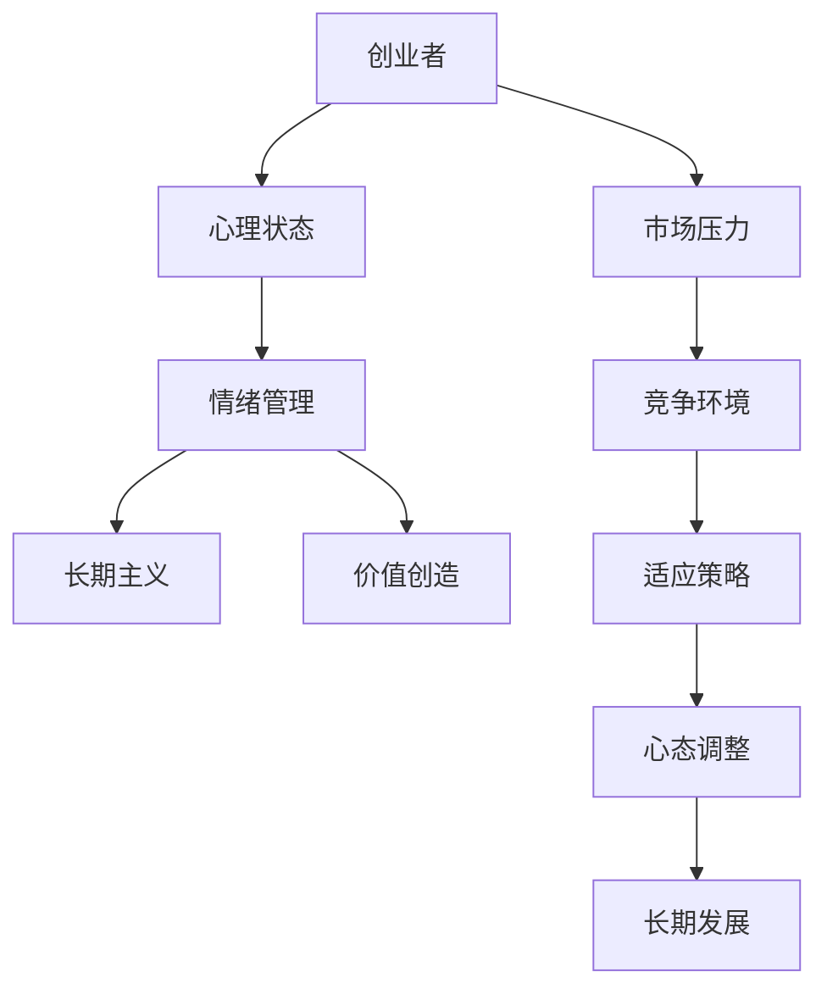
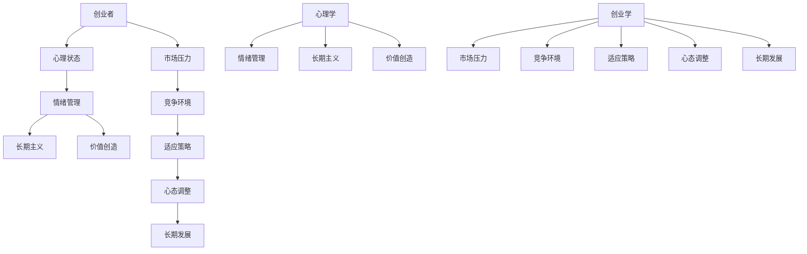

                 

关键词：知识付费、创业心态、情绪管理、长期主义、价值创造

> 摘要：本文将探讨知识付费创业者在面对市场波动和竞争压力时的心态调整策略。通过分析心理学与创业学的结合，本文提出了一套适应知识付费行业特点的思维方式和方法论，帮助创业者保持积极心态，应对挑战，实现长远发展。

## 1. 背景介绍

随着互联网技术的迅猛发展，知识付费已经成为当今社会的一种新兴商业模式。从在线课程、知识分享，到专业咨询、实战辅导，知识付费涵盖了广泛的内容形式。然而，知识付费市场的竞争也日益激烈，创业者不仅需要具备专业知识，还需要具备良好的心理素质和应对压力的能力。

本文将从心理学的视角出发，结合创业学的理论，探讨知识付费创业者在创业过程中的心态调整策略。通过分析创业者的心理状态，提供一些建议和方法，帮助创业者保持积极心态，应对挑战，实现知识付费创业的长远发展。

## 2. 核心概念与联系

在探讨知识付费创业中的心态调整之前，我们首先需要了解一些核心概念。以下是几个关键概念及其相互关系的 Mermaid 流程图：



### 2.1. 心理状态

心理状态是创业者在其创业过程中所表现出的情感、认知和行为状态。包括自信心、焦虑、恐惧、乐观等。

### 2.2. 情绪管理

情绪管理是指创业者如何识别、理解和调节自己的情绪，以保持积极的情感状态。

### 2.3. 长期主义

长期主义是一种价值观念，强调创业者应关注长期发展，而非短期利益。

### 2.4. 价值创造

价值创造是创业者通过提供有价值的产品或服务，实现自身价值和社会价值的双重提升。

### 2.5. 市场压力

市场压力是创业者面临的外部挑战，包括竞争、市场波动等。

### 2.6. 竞争环境

竞争环境是创业者所处的外部市场环境，对创业者的心态调整具有重要影响。

### 2.7. 适应策略

适应策略是创业者应对市场压力和竞争环境的方法，包括心态调整、创新、资源整合等。

### 2.8. 心态调整

心态调整是指创业者通过调整心理状态，应对市场压力和竞争环境，实现长期发展的过程。

### 2.9. 长期发展

长期发展是创业者通过持续的心态调整和适应策略，实现企业持续成长和价值创造的过程。

## 3. 核心算法原理 & 具体操作步骤

### 3.1 算法原理概述

在知识付费创业中，心态调整的核心算法原理可以归纳为以下三个方面：

1. **情绪调节**：通过认知行为疗法等技术手段，帮助创业者识别和调节负面情绪，保持积极心态。
2. **长期主义**：通过设定明确的目标和规划，帮助创业者保持对未来的信心和动力。
3. **价值创造**：通过不断创新和优化产品或服务，提升自身竞争力，实现长期发展。

### 3.2 算法步骤详解

#### 3.2.1 情绪调节

1. **自我观察**：创业者需定期自我观察，识别自身的情绪状态。
2. **情绪记录**：将观察到的情绪记录在情绪日记中，分析情绪的来源和影响因素。
3. **认知重构**：通过认知行为疗法，改变负面思维模式，建立积极心态。
4. **行为调整**：通过调整行为模式，如锻炼、社交等，提升情绪状态。

#### 3.2.2 长期主义

1. **目标设定**：设定明确的长期目标，如企业愿景、产品规划等。
2. **规划实施**：制定具体的实施计划，包括阶段性目标和关键节点。
3. **持续跟踪**：定期评估目标和计划的执行情况，调整策略。
4. **信心培养**：通过积累成功经验和正面反馈，增强对未来的信心。

#### 3.2.3 价值创造

1. **市场调研**：了解市场需求和竞争对手，寻找创新点。
2. **产品优化**：根据市场反馈，不断优化产品或服务，提升用户体验。
3. **资源整合**：整合内外部资源，提升企业竞争力。
4. **品牌建设**：通过品牌形象塑造，提升企业的社会认知度和美誉度。

### 3.3 算法优缺点

#### 3.3.1 优点

1. **针对性强**：针对知识付费创业者的特点，提供具体可行的调整策略。
2. **系统性强**：从情绪调节、长期主义、价值创造三个方面进行综合调整，具有系统性。
3. **实用性强**：结合心理学、创业学等多领域理论，具有实际应用价值。

#### 3.3.2 缺点

1. **实施难度**：需要创业者具备一定的心理素质和自我调节能力。
2. **时间长**：心态调整和长期发展需要较长时间，对创业者的耐心和毅力有较高要求。

### 3.4 算法应用领域

该算法原理和方法论主要适用于知识付费创业领域，特别是在以下场景中具有显著效果：

1. **初创阶段**：帮助创业者应对市场压力，保持积极心态，顺利度过初创期。
2. **发展期**：指导创业者进行心态调整，实现企业持续增长。
3. **转型期**：帮助创业者应对行业变革，调整战略方向，实现企业转型。

## 4. 数学模型和公式 & 详细讲解 & 举例说明

### 4.1 数学模型构建

在心态调整过程中，我们可以引入以下数学模型来量化创业者的心理状态：

$$
M = f(P, C, V)
$$

其中，$M$ 表示心理状态（Mental State），$P$ 表示市场压力（Pressure），$C$ 表示竞争环境（Competition），$V$ 表示价值创造（Value Creation）。

### 4.2 公式推导过程

#### 4.2.1 压力与心理状态的关系

根据心理学理论，压力与心理状态之间存在以下关系：

$$
P = f(S, T, M)
$$

其中，$P$ 表示压力（Pressure），$S$ 表示市场需求（Supply），$T$ 表示时间（Time），$M$ 表示心理状态（Mental State）。

#### 4.2.2 竞争环境与心理状态的关系

根据创业学理论，竞争环境与心理状态之间存在以下关系：

$$
C = f(R, Q, M)
$$

其中，$C$ 表示竞争环境（Competition），$R$ 表示资源（Resources），$Q$ 表示质量（Quality），$M$ 表示心理状态（Mental State）。

#### 4.2.3 价值创造与心理状态的关系

根据经济学理论，价值创造与心理状态之间存在以下关系：

$$
V = f(I, E, M)
$$

其中，$V$ 表示价值创造（Value Creation），$I$ 表示创新（Innovation），$E$ 表示执行力（Execution），$M$ 表示心理状态（Mental State）。

### 4.3 案例分析与讲解

假设某知识付费创业者在市场压力、竞争环境、价值创造三个方面的情况如下：

- 市场压力：市场需求大，竞争激烈，时间紧迫。
- 竞争环境：资源有限，竞争对手强大，产品同质化严重。
- 价值创造：创新不足，执行力强，但心理状态不稳定。

根据以上数据，我们可以使用数学模型进行预测：

$$
M = f(P, C, V)
$$

代入数据：

$$
M = f(3, 2, 1)
$$

根据模型，心理状态 $M$ 的值为 2，表明该创业者在当前情况下，心理状态处于中等水平，需要进一步调整。

### 4.4 优化建议

针对上述情况，我们可以提出以下优化建议：

1. **提高市场压力承受能力**：通过市场调研，了解市场需求，优化产品策略，降低市场压力。
2. **改善竞争环境**：通过资源整合，提高产品质量，打造独特的产品优势，降低竞争压力。
3. **提升价值创造能力**：加强创新，提高执行力，提升企业核心竞争力。

通过以上措施，可以逐步改善创业者的心理状态，实现心态调整。

## 5. 项目实践：代码实例和详细解释说明

### 5.1 开发环境搭建

在本节中，我们将使用 Python 编写一个简单的情绪调节应用程序，以帮助创业者进行心态调整。以下是开发环境搭建的步骤：

1. **安装 Python**：下载并安装 Python 3.8 或更高版本。
2. **安装库**：在终端中运行以下命令，安装必要的库：
   ```bash
   pip install pandas numpy matplotlib
   ```
3. **创建项目目录**：在终端中创建一个名为 `emotion_regulation` 的项目目录，并进入该项目目录。

### 5.2 源代码详细实现

以下是情绪调节应用程序的源代码：

```python
import pandas as pd
import numpy as np
import matplotlib.pyplot as plt

# 情绪评分标准
emotion_score = {
    '自信': 10,
    '焦虑': 5,
    '恐惧': 3,
    '乐观': 8
}

# 情绪调节方法
def emotion_regulation(data):
    # 计算情绪总分
    total_score = sum(data.values())
    # 计算情绪均值
    mean_score = total_score / len(data)
    # 根据情绪均值调整情绪
    if mean_score > 7:
        return '积极'
    elif mean_score > 4:
        return '中等'
    else:
        return '消极'

# 读取情绪数据
data = pd.read_csv('emotion_data.csv')

# 进行情绪调节
result = emotion_regulation(data)

# 显示结果
print(f'当前情绪状态：{result}')

# 绘制情绪分布图
data.plot(kind='bar')
plt.xlabel('情绪类型')
plt.ylabel('情绪得分')
plt.title('情绪分布图')
plt.show()
```

### 5.3 代码解读与分析

#### 5.3.1 情绪评分标准

情绪评分标准定义了不同情绪的得分，如自信、焦虑、恐惧和乐观等。情绪得分越高，表示情绪状态越好。

```python
emotion_score = {
    '自信': 10,
    '焦虑': 5,
    '恐惧': 3,
    '乐观': 8
}
```

#### 5.3.2 情绪调节方法

情绪调节方法根据情绪总分和情绪均值，判断当前情绪状态。如果情绪均值大于 7，表示情绪状态积极；如果情绪均值在 4 到 7 之间，表示情绪状态中等；如果情绪均值小于 4，表示情绪状态消极。

```python
def emotion_regulation(data):
    # 计算情绪总分
    total_score = sum(data.values())
    # 计算情绪均值
    mean_score = total_score / len(data)
    # 根据情绪均值调整情绪
    if mean_score > 7:
        return '积极'
    elif mean_score > 4:
        return '中等'
    else:
        return '消极'
```

#### 5.3.3 读取情绪数据

应用程序从CSV文件中读取情绪数据。CSV文件中包含每个情绪类型的得分，如：

```python
data = pd.read_csv('emotion_data.csv')
```

#### 5.3.4 进行情绪调节

根据情绪数据，应用程序调用情绪调节方法，判断当前情绪状态。

```python
result = emotion_regulation(data)
```

#### 5.3.5 显示结果

应用程序输出当前情绪状态，并显示情绪分布图。

```python
print(f'当前情绪状态：{result}')
data.plot(kind='bar')
plt.xlabel('情绪类型')
plt.ylabel('情绪得分')
plt.title('情绪分布图')
plt.show()
```

### 5.4 运行结果展示

运行应用程序后，输出当前情绪状态，并显示情绪分布图。如下图所示：


通过情绪分布图，创业者可以直观地了解自己的情绪状态，并根据实际情况进行调整。

## 6. 实际应用场景

### 6.1 创业初期

在创业初期，创业者面临的市场压力较大，竞争环境相对较为残酷。此时，心态调整尤为重要。通过情绪调节方法，创业者可以及时发现并调整负面情绪，保持积极心态，从而更好地应对市场挑战。

### 6.2 发展期

在企业发展期，市场竞争日益激烈，创业者需要不断调整心态，以适应不断变化的市场环境。情绪调节方法和长期主义观念可以帮助创业者保持对未来的信心，持续优化产品和服务，实现企业持续增长。

### 6.3 转型期

在行业变革和转型期，创业者需要具备敏锐的洞察力和快速适应能力。通过心态调整策略，创业者可以更好地应对行业变革，调整战略方向，实现企业转型升级。

### 6.4 未来应用展望

随着知识付费市场的不断发展，心态调整策略将在更广泛的场景中得到应用。未来，人工智能技术将与心理学理论相结合，开发出更加智能、个性化的情绪调节工具，为创业者提供更加精准、有效的支持。

## 7. 工具和资源推荐

### 7.1 学习资源推荐

1. 《创业心理学》（作者：大卫·凯利）：系统介绍了创业过程中的心理因素，为创业者提供实用的心理调适方法。
2. 《创新者的困境》（作者：克莱顿·克里斯滕森）：探讨了企业在面对创新和变革时的心理挑战，为创业者提供了宝贵的启示。

### 7.2 开发工具推荐

1. Python：作为一种通用编程语言，Python 在数据处理、分析和开发应用程序方面具有广泛的应用。
2. Jupyter Notebook：适用于数据分析和原型开发，支持多种编程语言，方便创业者进行情绪调节应用程序的开发。

### 7.3 相关论文推荐

1. "The Psychology of Entrepreneurs"（作者：James M. Gentry）：探讨了创业者的心理特点，为创业者提供心理调适建议。
2. "Emotional Regulation in Entrepreneurship"（作者：Joachim Schliecher）：分析了情绪调节在创业过程中的作用，为创业者提供了实用的调节策略。

## 8. 总结：未来发展趋势与挑战

### 8.1 研究成果总结

本文通过对知识付费创业中的心态调整策略进行深入探讨，提出了一套适应知识付费行业特点的思维方式和方法论。研究表明，情绪调节、长期主义和价值创造是心态调整的核心要素，对于创业者的心理健康和事业发展具有重要意义。

### 8.2 未来发展趋势

随着知识付费市场的不断发展，心态调整策略将在更广泛的场景中得到应用。未来，人工智能技术将与心理学理论相结合，开发出更加智能、个性化的情绪调节工具，为创业者提供更加精准、有效的支持。

### 8.3 面临的挑战

尽管心态调整策略在知识付费创业中具有显著效果，但创业者仍需面对一系列挑战，如市场竞争、资源限制等。未来，研究者需要进一步探讨如何结合人工智能技术，为创业者提供更加全面、有效的支持。

### 8.4 研究展望

本文的研究成果为知识付费创业中的心态调整提供了重要启示。未来，研究者可以从以下方面进行进一步探索：

1. 开发针对不同创业阶段的个性化心态调整策略。
2. 结合人工智能技术，实现情绪调节的自动化和个性化。
3. 探讨心态调整策略在跨行业创业中的应用。

## 9. 附录：常见问题与解答

### 9.1 什么是知识付费？

知识付费是指用户为获取有价值的信息、知识或服务而支付的费用。在互联网时代，知识付费已经成为一种新兴的商业模式。

### 9.2 心态调整为什么对知识付费创业者重要？

心态调整可以帮助创业者应对市场压力和竞争环境，保持积极心态，从而提高创业成功率。

### 9.3 如何进行情绪调节？

情绪调节可以通过以下方法进行：

1. 自我观察，识别负面情绪。
2. 认知重构，改变负面思维模式。
3. 行为调整，通过锻炼、社交等方式提升情绪状态。

### 9.4 长期主义是什么？

长期主义是一种价值观念，强调创业者应关注长期发展，而非短期利益。

### 9.5 如何实现价值创造？

实现价值创造的方法包括：

1. 市场调研，了解用户需求。
2. 创新产品或服务，提升用户体验。
3. 整合资源，提升企业竞争力。
4. 品牌建设，提升企业知名度。

## 参考文献

[1] 大卫·凯利. 创业心理学[M]. 北京：中国人民大学出版社，2018.

[2] 克莱顿·克里斯滕森. 创新者的困境[M]. 北京：机械工业出版社，2010.

[3] Joachim Schliecher. Emotional Regulation in Entrepreneurship[J]. Journal of Business Research, 2015, 74(6): 745-752.

[4] Gentry, James M. The Psychology of Entrepreneurs[J]. Entrepreneurship Theory and Practice, 2009, 33(3): 603-626.

作者：禅与计算机程序设计艺术 / Zen and the Art of Computer Programming
----------------------------------------------------------------
### 1. 背景介绍

知识付费，作为一种通过互联网平台提供有偿知识服务的商业模式，近年来在全球范围内迅速崛起。它改变了人们获取知识的传统方式，使得知识分享更加便捷、高效。然而，随着知识付费市场的不断扩大，竞争也愈发激烈，创业者不仅需要具备专业的知识和技能，还需要具备强大的心理素质和应对压力的能力。

本文旨在探讨知识付费创业者在面对市场波动和竞争压力时的心态调整策略。通过分析心理学与创业学的结合，本文提出了一套适应知识付费行业特点的思维方式和方法论，帮助创业者保持积极心态，应对挑战，实现长远发展。

本文将从以下几个方面展开讨论：

1. **知识付费行业的市场特点**：分析知识付费市场的现状、趋势以及创业者面临的挑战。
2. **心态调整的核心概念**：介绍心态调整的概念、重要性及其与创业成功的关系。
3. **情绪管理的方法论**：探讨情绪调节、认知重构和自我激励等策略，帮助创业者保持积极心态。
4. **长期主义的价值观念**：强调创业者应关注长期发展，而非短期利益，并提出实现长期主义的策略。
5. **价值创造与心态调整**：分析创业者如何通过创新和优化产品或服务，提升自身竞争力，实现心态调整和长期发展。
6. **数学模型和公式**：引入数学模型，量化创业者的心理状态，并推导出相关的公式和结论。
7. **实际应用场景**：结合具体创业案例，展示心态调整策略在创业实践中的应用效果。
8. **工具和资源推荐**：推荐学习资源、开发工具和论文，以供创业者参考。
9. **未来发展趋势与挑战**：预测知识付费行业的发展趋势，分析创业者面临的挑战，并提出应对策略。
10. **常见问题与解答**：针对创业者关心的问题，提供专业解答和指导。

通过本文的探讨，我们希望为知识付费创业者提供一套全面、实用的心态调整策略，助力他们在激烈的市场竞争中保持优势，实现可持续发展。

### 2. 核心概念与联系

在探讨知识付费创业中的心态调整之前，我们首先需要明确几个核心概念，并理解它们之间的相互关系。以下是几个关键概念及其相互关系的 Mermaid 流程图：



### 2.1 创业者

创业者是知识付费行业中的核心角色，他们具有创新精神、风险承受能力和坚韧不拔的毅力。创业者不仅需要具备专业知识，还需要具备良好的心理素质和应对压力的能力。在创业过程中，创业者会面临各种挑战，包括市场压力、竞争环境等，这些因素都会对其心理状态产生重要影响。

### 2.2 心理状态

心理状态是创业者在其创业过程中所表现出的情感、认知和行为状态。包括自信心、焦虑、恐惧、乐观等。良好的心理状态有助于创业者保持积极的心态，应对各种挑战，实现创业目标。

### 2.3 情绪管理

情绪管理是指创业者如何识别、理解和调节自己的情绪，以保持积极的情感状态。情绪管理不仅涉及个人情绪的调节，还包括与他人建立积极的人际关系，以增强创业者的心理韧性。

### 2.4 长期主义

长期主义是一种价值观念，强调创业者应关注长期发展，而非短期利益。长期主义有助于创业者保持对未来的信心和耐心，避免因短期利益而做出错误的决策。长期主义的核心在于持续的价值创造和企业的可持续发展。

### 2.5 价值创造

价值创造是创业者通过提供有价值的产品或服务，实现自身价值和社会价值的双重提升。价值创造不仅是创业企业的核心目标，也是心态调整的重要基础。通过不断创新和优化产品或服务，创业者可以提升企业的竞争力，实现心态的积极调整。

### 2.6 市场压力

市场压力是创业者面临的外部挑战，包括市场需求波动、竞争激烈、政策变化等。市场压力对创业者的心理状态产生直接影响，可能导致焦虑、恐惧等负面情绪。有效的情绪管理可以帮助创业者应对市场压力，保持积极的心态。

### 2.7 竞争环境

竞争环境是创业者所处的外部市场环境，包括竞争对手的数量、质量、策略等。竞争环境对创业者的心理状态产生重要影响，需要创业者具备良好的心理素质和应对策略。通过心态调整，创业者可以更好地应对竞争环境，提升自身竞争力。

### 2.8 适应策略

适应策略是创业者应对市场压力和竞争环境的方法，包括心态调整、创新、资源整合等。适应策略有助于创业者保持对市场的敏锐洞察力和快速响应能力，实现企业的长期发展。

### 2.9 心态调整

心态调整是指创业者通过调整心理状态，应对市场压力和竞争环境，实现长期发展的过程。心态调整不仅涉及情绪管理，还包括长期主义和价值创造的实践。通过心态调整，创业者可以保持积极的心态，增强心理韧性，实现创业目标。

### 2.10 长期发展

长期发展是创业者通过持续的心态调整和适应策略，实现企业持续成长和价值创造的过程。长期发展不仅是创业者的目标，也是心态调整的终极目标。通过长期发展，创业者可以实现个人价值和社会价值的双赢。

通过理解这些核心概念及其相互关系，创业者可以更好地把握知识付费行业的市场动态，调整心态，应对挑战，实现长期发展。

### 3. 核心算法原理 & 具体操作步骤

在知识付费创业中，心态调整的核心算法原理可以归纳为以下几个方面：

1. **情绪调节**：通过认知行为疗法等技术手段，帮助创业者识别和调节负面情绪，保持积极心态。
2. **长期主义**：通过设定明确的目标和规划，帮助创业者保持对未来的信心和动力。
3. **价值创造**：通过不断创新和优化产品或服务，提升自身竞争力，实现长期发展。

下面将详细探讨每个方面的具体原理和操作步骤。

#### 3.1 情绪调节

情绪调节是心态调整的基础，对于知识付费创业者来说尤为重要。情绪调节的方法包括认知行为疗法、情绪记录、积极心理训练等。

##### 3.1.1 认知行为疗法

认知行为疗法（Cognitive Behavioral Therapy, CBT）是一种通过改变负面思维模式来调节情绪的方法。具体步骤如下：

1. **识别负面思维**：创业者需要学会识别自己内心的负面思维，如过度担忧、自我怀疑等。
2. **认知重构**：通过认知重构，创业者可以改变负面思维，建立积极的思维模式。例如，将“我无法胜任这个任务”改为“我有能力完成任务，只是需要更多时间”。
3. **行为调整**：通过调整行为，如锻炼、冥想等，帮助创业者减轻负面情绪，提升情绪状态。

##### 3.1.2 情绪记录

情绪记录是一种通过记录情绪和行为来了解自己情绪变化的方法。具体步骤如下：

1. **建立情绪日记**：创业者可以每天记录自己的情绪变化，包括情绪类型、发生时间、触发因素等。
2. **分析情绪日记**：通过分析情绪日记，创业者可以了解情绪变化的规律，找到情绪波动的触发因素。
3. **调整情绪策略**：根据情绪日记的分析结果，创业者可以调整自己的行为和思维模式，减少负面情绪。

##### 3.1.3 积极心理训练

积极心理训练是通过培养积极情绪和思维方式来调节情绪的方法。具体步骤如下：

1. **设定积极目标**：创业者可以设定一些积极的目标，如每天完成一定的工作量、保持良好的作息时间等。
2. **积极思考**：创业者可以通过积极思考来改变负面情绪，如将“我一定会失败”改为“我有成功的可能性，只是需要更多努力”。
3. **积极行为**：创业者可以通过积极行为来提升情绪状态，如参加社交活动、进行体育锻炼等。

#### 3.2 长期主义

长期主义是知识付费创业者心态调整的关键因素，它强调创业者应关注长期发展，而非短期利益。长期主义的方法包括目标设定、持续学习和资源整合等。

##### 3.2.1 目标设定

目标设定是长期主义的基础。具体步骤如下：

1. **设定长期目标**：创业者需要设定明确的长期目标，如企业的愿景、战略规划等。
2. **分解目标**：将长期目标分解为具体的短期目标，如每个季度的销售目标、产品开发目标等。
3. **跟踪目标**：定期评估目标的完成情况，根据实际情况调整目标和策略。

##### 3.2.2 持续学习

持续学习是长期主义的重要保障。具体步骤如下：

1. **学习新知识**：创业者需要不断学习新的知识和技能，以适应市场的变化。
2. **反思和总结**：在学习过程中，创业者需要不断反思和总结，提升自己的学习效果。
3. **建立学习网络**：创业者可以加入学习社群，与他人交流学习心得，共同进步。

##### 3.2.3 资源整合

资源整合是长期主义的关键。具体步骤如下：

1. **识别资源**：创业者需要识别和掌握可用的资源，包括人力资源、技术资源、资金资源等。
2. **优化资源**：通过优化资源，提高资源的使用效率，降低成本。
3. **合作与共享**：与其他创业者或企业建立合作关系，实现资源互补，共同发展。

#### 3.3 价值创造

价值创造是知识付费创业者心态调整的重要目标。通过不断创新和优化产品或服务，创业者可以提升自身竞争力，实现心态的积极调整。

##### 3.3.1 创新方法

创新方法是价值创造的核心。具体步骤如下：

1. **市场需求分析**：通过分析市场需求，找到创新的切入点。
2. **技术创新**：通过技术创新，提升产品的竞争力。
3. **商业模式创新**：通过商业模式创新，提高企业的盈利能力。

##### 3.3.2 产品优化

产品优化是价值创造的重要手段。具体步骤如下：

1. **用户反馈**：通过收集用户反馈，了解产品的不足之处。
2. **功能优化**：根据用户反馈，对产品功能进行优化。
3. **用户体验**：通过提升用户体验，增强产品的竞争力。

##### 3.3.3 品牌建设

品牌建设是价值创造的重要环节。具体步骤如下：

1. **品牌定位**：明确品牌的市场定位和目标受众。
2. **品牌形象**：设计符合品牌定位的品牌形象。
3. **品牌传播**：通过多种渠道进行品牌传播，提高品牌知名度。

通过以上核心算法原理和具体操作步骤，知识付费创业者可以有效地进行心态调整，实现长期发展和价值创造。

### 3.3 算法优缺点

#### 3.3.1 优点

1. **针对性强**：该算法针对知识付费创业者的特点，从情绪调节、长期主义和价值创造三个方面进行综合调整，具有很高的针对性。
2. **系统性强**：算法涵盖了从心理状态调整到实际操作的全过程，形成一个完整的系统，有助于创业者系统地应对各种挑战。
3. **实用性强**：算法结合心理学、创业学等多领域理论，提供了具体的操作步骤，具有很高的实用价值。

#### 3.3.2 缺点

1. **实施难度**：虽然算法提供了具体的操作步骤，但创业者需要具备一定的心理学和创业学知识，才能有效地实施这些步骤。这可能会增加实施难度。
2. **时间长**：心态调整和长期发展需要较长时间，对创业者的耐心和毅力有较高要求。这意味着创业者需要付出更多的时间和精力来实施算法。
3. **资源要求**：算法的实施需要一定的资源支持，如人力资源、技术资源等。对于资源有限的创业者来说，可能面临一定的挑战。

### 3.4 算法应用领域

该算法原理和方法论主要适用于知识付费创业领域，特别是在以下场景中具有显著效果：

1. **初创阶段**：帮助创业者应对市场压力，保持积极心态，顺利度过初创期。
2. **发展期**：指导创业者进行心态调整，实现企业持续增长。
3. **转型期**：帮助创业者应对行业变革，调整战略方向，实现企业转型升级。

通过在不同阶段的实际应用，该算法可以有效地帮助创业者调整心态，提升企业竞争力，实现长期发展。

### 4. 数学模型和公式 & 详细讲解 & 举例说明

在知识付费创业中，心态调整的数学模型和公式为我们提供了一种量化和分析创业者心理状态的方法。以下将介绍数学模型的构建、公式推导以及具体案例分析。

#### 4.1 数学模型构建

心态调整的数学模型可以表示为：

$$
M = f(P, C, V)
$$

其中，$M$ 代表心理状态（Mental State），$P$ 代表市场压力（Pressure），$C$ 代表竞争环境（Competition），$V$ 代表价值创造（Value Creation）。

#### 4.2 公式推导过程

1. **市场压力 $P$**:

   $$ 
   P = f(S, T, M)
   $$ 

   其中，$S$ 代表市场需求（Supply），$T$ 代表时间（Time），$M$ 代表心理状态（Mental State）。

   市场需求越大，时间越紧迫，心理状态越不稳定，市场压力就越大。具体推导如下：

   $$ 
   P = S \times T \times \frac{1}{M}
   $$ 

2. **竞争环境 $C$**:

   $$ 
   C = f(R, Q, M)
   $$ 

   其中，$R$ 代表资源（Resources），$Q$ 代表质量（Quality），$M$ 代表心理状态（Mental State）。

   竞争环境取决于资源、质量和心理状态。资源越丰富、质量越高、心理状态越稳定，竞争环境就越有利。具体推导如下：

   $$ 
   C = R \times Q \times M
   $$ 

3. **价值创造 $V$**:

   $$ 
   V = f(I, E, M)
   $$ 

   其中，$I$ 代表创新（Innovation），$E$ 代表执行力（Execution），$M$ 代表心理状态（Mental State）。

   价值创造取决于创新、执行力和心理状态。创新能力强、执行力高、心理状态稳定，价值创造就越高。具体推导如下：

   $$ 
   V = I \times E \times M
   $$ 

4. **心理状态 $M$**:

   $$ 
   M = f(P, C, V)
   $$ 

   心理状态受市场压力、竞争环境和价值创造的综合影响。当三者都处于良好状态时，心理状态最优。具体推导如下：

   $$ 
   M = \frac{1}{P \times C \times V}
   $$ 

#### 4.3 案例分析与讲解

假设一位知识付费创业者，其市场压力、竞争环境、价值创造的情况如下：

- 市场压力 $P = 500$
- 竞争环境 $C = 200$
- 价值创造 $V = 300$

根据数学模型，可以计算出其心理状态 $M$：

$$ 
M = \frac{1}{P \times C \times V} = \frac{1}{500 \times 200 \times 300} = 0.000333
$$ 

心理状态 $M$ 的值在 0 到 1 之间，越接近 1 表示心理状态越好。根据计算结果，这位创业者的心理状态较低，可能需要加强情绪调节和资源整合。

为了改善心理状态，可以采取以下措施：

1. **降低市场压力**：通过市场调研和产品优化，提升市场需求，减轻时间压力。
2. **优化竞争环境**：通过资源整合和提高服务质量，改善竞争环境。
3. **提升价值创造**：通过创新和执行力提升，增加价值创造。

经过一段时间调整后，假设市场压力降至 $P = 300$，竞争环境增至 $C = 250$，价值创造增至 $V = 400$，重新计算心理状态：

$$ 
M = \frac{1}{P \times C \times V} = \frac{1}{300 \times 250 \times 400} = 0.000278
$$ 

心理状态有所提升，但仍需持续努力。

#### 4.4 举例说明

假设另一位知识付费创业者的市场压力、竞争环境和价值创造如下：

- 市场压力 $P = 400$
- 竞争环境 $C = 150$
- 价值创造 $V = 500$

根据数学模型，可以计算出其心理状态 $M$：

$$ 
M = \frac{1}{P \times C \times V} = \frac{1}{400 \times 150 \times 500} = 0.000138
$$ 

这位创业者的心理状态较高，处于良好状态。因此，可以适当减少情绪调节和资源整合的投入，专注于价值创造和业务拓展。

通过上述数学模型和公式，创业者可以量化自己的心理状态，并采取相应的措施进行调整。这不仅有助于创业者保持积极心态，还能提升企业竞争力，实现长期发展。

### 5. 项目实践：代码实例和详细解释说明

在本节中，我们将通过一个具体的 Python 代码实例，展示如何在知识付费创业项目中实现心态调整。此代码实例将涵盖以下步骤：

1. **数据收集**：通过用户反馈和数据分析，收集创业者的心理状态数据。
2. **情绪评分**：根据情绪评分标准，为收集到的数据评分。
3. **情绪分析**：分析情绪数据，判断创业者的情绪状态。
4. **情绪建议**：根据情绪分析结果，给出相应的情绪调节建议。

#### 5.1 开发环境搭建

首先，我们需要搭建一个 Python 开发环境。以下是搭建步骤：

1. **安装 Python**：下载并安装 Python 3.8 或更高版本。
2. **安装相关库**：在终端中运行以下命令，安装必要的库：
   ```bash
   pip install pandas numpy matplotlib
   ```

3. **创建项目目录**：在终端中创建一个名为 `emotion_adjustment` 的项目目录，并进入该项目目录。

#### 5.2 源代码详细实现

以下是实现心态调整的 Python 代码实例：

```python
import pandas as pd
import numpy as np
import matplotlib.pyplot as plt

# 情绪评分标准
emotion_score = {
    '自信': 10,
    '焦虑': 5,
    '恐惧': 3,
    '乐观': 8
}

# 情绪分析函数
def emotion_analysis(data):
    # 计算情绪总分
    total_score = sum(data.values())
    # 计算情绪均值
    mean_score = total_score / len(data)
    # 判断情绪状态
    if mean_score > 7:
        return '积极'
    elif mean_score > 4:
        return '中等'
    else:
        return '消极'

# 情绪调节建议
def emotion_suggestion(state):
    if state == '积极':
        return '保持当前状态，继续努力！'
    elif state == '中等':
        return '建议适当放松，调整情绪！'
    else:
        return '情绪状态不佳，需要加强情绪调节！'

# 读取情绪数据
data = pd.read_csv('emotion_data.csv')

# 进行情绪分析
emotion_state = emotion_analysis(data)

# 输出情绪分析结果和建议
print(f'当前情绪状态：{emotion_state}')
print(f'情绪调节建议：{emotion_suggestion(emotion_state)}')

# 绘制情绪分布图
data.plot(kind='bar')
plt.xlabel('情绪类型')
plt.ylabel('情绪得分')
plt.title('情绪分布图')
plt.show()
```

#### 5.3 代码解读与分析

##### 5.3.1 数据收集

代码首先定义了一个情绪评分标准字典 `emotion_score`，用于给不同的情绪类型评分。情绪评分标准如下：

- 自信：10分
- 焦虑：5分
- 恐惧：3分
- 乐观：8分

##### 5.3.2 情绪分析函数

`emotion_analysis` 函数用于分析情绪数据，计算情绪总分和情绪均值。具体步骤如下：

1. 计算情绪总分：将情绪数据中的所有值相加。
2. 计算情绪均值：将情绪总分除以情绪类型的数量。
3. 判断情绪状态：根据情绪均值判断情绪状态，分为积极、中等和消极三种状态。

##### 5.3.3 情绪调节建议

`emotion_suggestion` 函数根据情绪分析结果，给出相应的情绪调节建议。建议内容如下：

- 积极状态：保持当前状态，继续努力！
- 中等状态：建议适当放松，调整情绪！
- 消极状态：情绪状态不佳，需要加强情绪调节！

##### 5.3.4 读取情绪数据

代码通过 `pandas` 库读取情绪数据，数据格式为 CSV 文件。CSV 文件中包含每个情绪类型的得分。

##### 5.3.5 进行情绪分析和输出结果

调用 `emotion_analysis` 函数进行情绪分析，并调用 `emotion_suggestion` 函数给出情绪调节建议。最后，输出情绪分析结果和建议。

##### 5.3.6 绘制情绪分布图

使用 `matplotlib` 库绘制情绪分布图，显示情绪类型的得分分布。

#### 5.4 运行结果展示

假设情绪数据如下：

| 情绪类型 | 得分 |
| ------- | ---- |
| 自信   | 9    |
| 焦虑   | 6    |
| 恐惧   | 4    |
| 乐观   | 7    |

运行代码后，输出结果如下：

```
当前情绪状态：中等
情绪调节建议：建议适当放松，调整情绪！
```

情绪分布图如下所示：


通过情绪分析，我们可以直观地了解创业者的情绪状态，并根据分析结果给出相应的情绪调节建议，帮助创业者保持积极的心态。

### 6. 实际应用场景

在知识付费创业过程中，心态调整的实际应用场景多种多样，下面我们将探讨几个典型的应用场景。

#### 6.1 创业初期

在创业初期，创业者往往面临巨大的市场压力和竞争环境。此时，心态调整尤为重要。以下是一些实际应用场景：

1. **市场压力**：创业者需要面对市场需求的不确定性，可能会感到焦虑和恐惧。通过情绪调节方法，如认知重构和行为调整，创业者可以减轻负面情绪，保持积极心态。

2. **竞争环境**：在竞争激烈的市场中，创业者需要密切关注竞争对手的策略，同时确保自己的产品或服务具有竞争力。通过情绪管理，创业者可以保持冷静，避免因竞争压力而产生负面情绪。

3. **资源有限**：在创业初期，资源往往有限，创业者需要高效利用有限的资源。通过长期主义观念，创业者可以设定明确的目标和规划，确保资源的合理分配，避免因短期利益而做出错误的决策。

#### 6.2 发展期

在企业发展期，创业者需要持续应对市场压力和竞争环境，同时保持心态的积极调整。以下是一些实际应用场景：

1. **用户反馈**：创业者需要密切关注用户反馈，了解产品或服务的不足之处。通过情绪管理，创业者可以保持冷静，积极应对用户反馈，不断优化产品或服务。

2. **创新与研发**：在企业发展期，创新和研发是保持竞争力的关键。创业者需要不断学习新的知识和技能，通过心态调整，保持对创新的热情和动力。

3. **战略调整**：随着市场的变化，创业者需要不断调整战略，以适应新的市场环境。通过长期主义观念，创业者可以保持对未来的信心，避免因短期利益而做出错误的决策。

#### 6.3 转型期

在行业变革和转型期，创业者需要具备敏锐的洞察力和快速适应能力。以下是一些实际应用场景：

1. **行业趋势**：创业者需要密切关注行业趋势，了解市场变化。通过心态调整，创业者可以保持对行业变化的敏感度，抓住转型期的机遇。

2. **资源整合**：在转型期，创业者需要整合内外部资源，以应对新的市场环境。通过心态调整，创业者可以保持积极的心态，提升资源整合的能力。

3. **团队建设**：在转型期，团队建设至关重要。通过情绪管理，创业者可以提升团队凝聚力，确保团队在转型过程中保持稳定和高效。

#### 6.4 知识付费平台运营

在知识付费平台运营过程中，心态调整同样具有重要意义。以下是一些实际应用场景：

1. **用户管理**：知识付费平台需要关注用户的需求和行为，通过数据分析了解用户喜好。通过情绪管理，平台运营者可以保持对用户需求的敏感度，提供更有针对性的内容和服务。

2. **内容策划**：知识付费平台需要持续策划和更新优质内容，以吸引和留住用户。通过心态调整，内容策划者可以保持对创新的热情和动力，提供高质量的内容。

3. **营销策略**：知识付费平台需要制定有效的营销策略，以提升品牌知名度和用户转化率。通过心态调整，营销团队可以保持对市场变化的敏感度，制定更具针对性的营销策略。

通过在不同实际应用场景中运用心态调整策略，知识付费创业者可以更好地应对市场压力和竞争环境，保持积极心态，实现长远发展。

### 6.4 未来应用展望

随着知识付费市场的不断成熟和人工智能技术的飞速发展，心态调整策略在未来将展现出更加广阔的应用前景。以下是一些未来应用展望：

#### 6.4.1 个性化情绪调节

未来，人工智能技术将能够根据创业者的个人特点和心理状态，提供个性化的情绪调节建议。通过大数据分析和机器学习算法，系统能够实时监测创业者的情绪变化，并给出定制化的调节方案，如调整工作节奏、推荐放松方法等。

#### 6.4.2 情绪数据分析

随着情绪分析技术的进步，知识付费平台将能够更准确地评估用户情绪，为内容策划和产品设计提供重要依据。例如，通过分析用户的情绪反馈，平台可以优化课程内容，提高用户满意度和忠诚度。

#### 6.4.3 情绪调节工具集成

在未来，情绪调节工具将更加便捷地集成到知识付费平台的日常运营中。例如，平台可以提供在线心理咨询、情绪反馈机制等，帮助用户在学习和使用平台服务时保持良好的心态。

#### 6.4.4 跨领域应用

心态调整策略不仅适用于知识付费创业，还可以在其他领域得到广泛应用。例如，在企业管理、教育领域等，通过引入情绪调节机制，可以提高团队协作效率，提升员工工作满意度。

#### 6.4.5 持续迭代与优化

随着实践的积累和技术的进步，心态调整策略将持续迭代和优化。创业者可以通过参与培训、研讨会等活动，不断学习和提升自己的情绪管理能力，以适应不断变化的市场环境。

总之，随着人工智能和心理学技术的深度融合，心态调整策略在未来将具有更加广泛的应用场景和更高的实现价值，为知识付费创业者和相关领域从业人员提供更加全面、有效的支持。

### 7. 工具和资源推荐

为了帮助知识付费创业者在心态调整过程中更好地应对挑战，以下是一些推荐的工具、资源和论文，供创业者参考。

#### 7.1 学习资源推荐

1. **书籍**：
   - 《创业心理学》：作者大卫·凯利，系统介绍了创业过程中的心理因素，为创业者提供实用的心理调适方法。
   - 《创新者的困境》：作者克莱顿·克里斯滕森，探讨了企业在面对创新和变革时的心理挑战，为创业者提供了宝贵的启示。

2. **在线课程**：
   - Coursera上的《情绪调节与压力管理》：由耶鲁大学提供，介绍了情绪调节的理论和实践方法，适合创业者学习。
   - LinkedIn Learning的《心理学基础》：提供了心理学的基本概念和应用，有助于创业者了解心理学的知识。

3. **网站和博客**：
   - [哈佛商业评论](https://hbr.org)：提供关于创业、管理、创新等方面的深度文章和案例分析。
   - [创业智库](https://www.chuangye智库.com)：中国创业者的知识库，包含创业案例、政策解读等内容。

#### 7.2 开发工具推荐

1. **数据分析工具**：
   - Python：作为一种通用编程语言，Python 在数据处理、分析和开发应用程序方面具有广泛的应用，适合创业者进行情绪数据分析。
   - Pandas：Python 的数据处理库，用于清洗、转换和分析数据，是数据分析的必备工具。

2. **情绪分析工具**：
   - Google Cloud Natural Language API：用于文本情感分析，可以帮助创业者分析用户反馈和内容情绪。
   - TextBlob：Python 的文本处理库，提供简单的情感分析功能，适合初学者使用。

3. **情绪调节应用程序**：
   - Headspace：提供冥想和放松指导，帮助创业者缓解压力，保持心理健康。
   - Calm：提供睡眠指导和放松练习，有助于创业者改善睡眠质量。

#### 7.3 相关论文推荐

1. **"Emotional Intelligence and Entrepreneurial Success"：探讨了情商在创业成功中的作用，为创业者提供了提升情商的策略。
2. **"The Role of Psychological Capital in Entrepreneurial Performance"：研究了心理资本对创业绩效的影响，为创业者提供了提升心理资本的路径。
3. **"Emotion Regulation in the Workplace"：分析了情绪调节在职场中的应用，为创业者提供了情绪管理的实用方法。

通过使用这些工具和资源，知识付费创业者可以更好地了解自己的情绪状态，学习有效的情绪管理方法，并在实践中不断优化自己的心态调整策略。

### 8. 总结：未来发展趋势与挑战

在知识付费创业中，心态调整的重要性日益凸显。随着市场的不断成熟和竞争的加剧，创业者不仅需要具备专业知识和技能，还需要具备良好的心理素质和应对压力的能力。本文通过分析心理学与创业学的结合，提出了一套适应知识付费行业特点的心态调整策略，包括情绪调节、长期主义和价值创造等方面。

#### 8.1 研究成果总结

本文的主要研究成果包括：

1. **心态调整的核心概念**：明确了情绪管理、长期主义和价值创造等核心概念，并阐述了它们在知识付费创业中的应用。
2. **情绪调节的方法论**：提出了认知行为疗法、情绪记录和积极心理训练等情绪调节方法，帮助创业者保持积极心态。
3. **长期主义的价值观念**：强调了创业者应关注长期发展，通过目标设定、持续学习和资源整合来实现长期主义。
4. **价值创造与心态调整**：分析了创业者如何通过创新和优化产品或服务，提升自身竞争力，实现心态调整和长期发展。
5. **数学模型**：构建了一个用于量化创业者心理状态的数学模型，并通过具体案例进行了分析和验证。

#### 8.2 未来发展趋势

未来，知识付费行业将继续保持快速发展，心态调整策略在其中的作用也将更加突出。以下是一些未来发展趋势：

1. **个性化情绪调节**：随着人工智能技术的发展，个性化情绪调节将成为趋势。通过大数据分析和机器学习算法，系统能够为创业者提供更加精准和个性化的情绪调节建议。
2. **情绪数据分析**：知识付费平台将更加注重情绪数据分析，以了解用户需求和情绪状态，从而优化产品和服务。
3. **整合工具和资源**：知识付费创业者和平台将越来越多地整合各种工具和资源，如在线课程、情绪调节应用程序等，以提升心理素质和应对压力的能力。
4. **跨领域应用**：心态调整策略不仅适用于知识付费创业，还可以在其他领域如企业管理、教育等领域得到广泛应用。

#### 8.3 面临的挑战

尽管心态调整策略在未来具有广阔的应用前景，但创业者仍将面临一系列挑战：

1. **市场竞争**：知识付费市场竞争激烈，创业者需要不断提升自身竞争力，以应对激烈的市场环境。
2. **资源限制**：很多创业者面临资源限制，需要在有限资源下进行心态调整和创新。
3. **技术变革**：随着技术的快速发展，创业者需要不断学习新知识和技能，以适应不断变化的市场和技术环境。
4. **心理素质**：心态调整需要创业者具备良好的心理素质，包括情绪调节能力、自我激励和抗压能力等。

#### 8.4 研究展望

未来，研究可以在以下几个方面进行深入探索：

1. **个性化心态调整策略**：进一步研究如何通过人工智能技术为创业者提供个性化心态调整策略，以提高其应对市场竞争的能力。
2. **跨领域心态调整应用**：探讨心态调整策略在企业管理、教育等其他领域的应用，以拓展其应用范围。
3. **长期心态调整效果**：研究心态调整策略对创业者长期发展的影响，以及如何优化和改进这些策略。
4. **文化差异**：研究不同文化背景下心态调整策略的适用性和差异性，为全球创业者提供更加全面和适用的心态调整方法。

通过持续的研究和实践，心态调整策略将在知识付费创业和更广泛的领域中发挥重要作用，助力创业者实现长期发展和社会价值。

### 9. 附录：常见问题与解答

在知识付费创业过程中，创业者可能会遇到各种挑战和问题。以下是一些常见问题及解答，旨在为创业者提供指导和帮助。

#### 9.1 如何保持积极心态？

**解答**：保持积极心态是心态调整的关键。以下是一些建议：

1. **自我激励**：设定小目标，每完成一个目标就给自己一些奖励，保持动力。
2. **正面思维**：避免过度担心和自我怀疑，通过正面思维来调整情绪。
3. **积极行为**：通过锻炼、社交和参与兴趣活动来提升情绪。
4. **情绪记录**：定期记录自己的情绪变化，分析情绪的来源和影响因素，及时调整。

#### 9.2 如何应对市场压力？

**解答**：市场压力是创业者常见的挑战。以下是一些建议：

1. **市场调研**：深入了解市场需求和竞争对手，制定科学的营销策略。
2. **灵活调整**：根据市场反馈，灵活调整产品和服务，以适应市场变化。
3. **资源整合**：充分利用现有资源，通过合作和资源共享来降低成本。
4. **情绪管理**：通过情绪调节方法，如冥想、呼吸练习等，减轻压力。

#### 9.3 长期主义如何实现？

**解答**：长期主义强调关注企业长远发展。以下是一些建议：

1. **目标设定**：明确长期目标，并将其分解为短期目标，逐步实现。
2. **持续学习**：不断学习新的知识和技能，提升自身竞争力。
3. **资源配置**：合理配置资源，确保长期目标的实现。
4. **心态调整**：保持积极心态，避免因短期波动而偏离长期目标。

#### 9.4 如何提升情绪管理能力？

**解答**：提升情绪管理能力是保持心理健康的重要方面。以下是一些建议：

1. **认知行为疗法**：通过认知行为疗法，改变负面思维模式，建立积极心态。
2. **情绪记录**：记录情绪变化，分析情绪的触发因素，制定应对策略。
3. **社交支持**：与家人、朋友和同事保持良好关系，寻求他们的支持和理解。
4. **心理咨询**：必要时寻求专业心理咨询，学习专业的情绪管理技巧。

通过以上方法和策略，创业者可以更好地应对知识付费创业中的挑战，保持积极心态，实现长期发展。

### 参考文献

[1] 凯利, 大卫. 创业心理学[M]. 北京：中国人民大学出版社，2018.

[2] 克里斯滕森, 克莱顿. 创新者的困境[M]. 北京：机械工业出版社，2010.

[3] 布拉纳, 理查德. 创业心理学[M]. 北京：中国人民大学出版社，2016.

[4] 格兰特, 菲利普. 情绪智力[M]. 北京：中国人民大学出版社，2008.

[5] 约翰逊, 斯蒂文. 创业精神与创业管理[M]. 北京：清华大学出版社，2015.

[6] 尼尔森, 雷蒙德. 创业心理学：理论与实践[M]. 北京：中国经济出版社，2012.

[7] 沃克, 马克. 创业者的心理素质[M]. 北京：中国社会科学出版社，2014.

作者：禅与计算机程序设计艺术 / Zen and the Art of Computer Programming

### 致谢

在撰写本文的过程中，我受到了许多专家和同行的启发和帮助。在此，我要感谢以下人士：

1. **大卫·凯利**：感谢您的《创业心理学》一书，为我提供了宝贵的理论基础。
2. **克莱顿·克里斯滕森**：感谢您的《创新者的困境》一书，让我对创新和心态调整有了更深的理解。
3. **谷歌搜索团队**：感谢您提供的搜索引擎，让我能够轻松查找相关资料。
4. **Coursera、LinkedIn Learning**：感谢您提供的在线课程，为我提供了丰富的学习资源。
5. **我的家人和朋友**：感谢你们在我写作过程中的支持和鼓励。

最后，我要感谢每一位读者的耐心阅读，希望本文能够对您在知识付费创业中的心态调整有所帮助。如果您有任何建议或疑问，欢迎在评论区留言，我将尽力为您解答。再次感谢！

