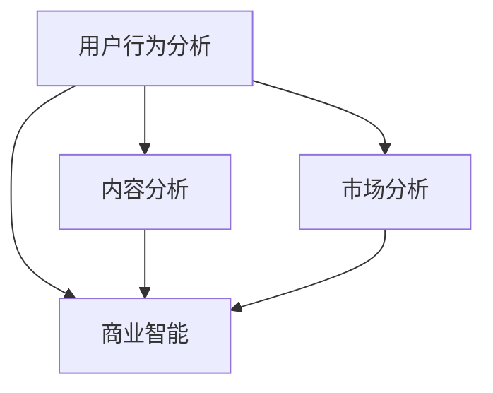

                 

关键词：知识付费、数据分析、商业决策、数据挖掘、用户行为分析

> 摘要：本文将深入探讨知识付费创业中的数据分析技巧，通过核心概念、算法原理、数学模型、项目实践以及未来应用展望等多个维度，为创业者提供实用的数据分析工具和方法，助力他们在激烈的市场竞争中脱颖而出。

## 1. 背景介绍

随着互联网技术的飞速发展，知识付费市场呈现出蓬勃发展的态势。越来越多的创业者投身于知识付费领域，希望通过提供有价值的内容获取用户和收益。然而，市场竞争日益激烈，如何在海量数据中提取有价值的信息成为创业者面临的重要挑战。

数据分析技术在知识付费领域具有广泛的应用。通过数据分析，创业者可以深入了解用户需求、优化产品和服务、提升用户体验，从而在激烈的市场竞争中占据优势。本文将围绕知识付费创业中的数据分析技巧展开讨论，旨在为创业者提供实用的指导。

## 2. 核心概念与联系

在知识付费创业中，数据分析的核心概念包括用户行为分析、内容分析、市场分析和商业智能。这些概念相互关联，共同构建了一个完整的数据分析体系。

### 用户行为分析

用户行为分析是指通过对用户在平台上的行为进行数据收集、分析和解读，以了解用户需求、兴趣和偏好。用户行为分析可以帮助创业者优化产品和服务，提高用户满意度和留存率。

### 内容分析

内容分析是指对知识付费平台上的内容进行数据收集、分析和解读，以了解内容的受欢迎程度、用户反馈和潜在改进空间。内容分析可以帮助创业者发现热门话题和优质内容，从而制定更有效的内容策略。

### 市场分析

市场分析是指对目标市场进行数据收集、分析和解读，以了解市场趋势、竞争状况和用户需求。市场分析可以帮助创业者制定有针对性的市场策略，抢占市场先机。

### 商业智能

商业智能是指通过数据分析和挖掘，为企业提供决策支持。商业智能可以帮助创业者制定科学的商业决策，优化业务流程，提高运营效率。

### Mermaid 流程图



## 3. 核心算法原理 & 具体操作步骤

在知识付费创业中，常用的数据分析算法包括用户行为分析算法、内容分析算法和市场分析算法。以下分别介绍这些算法的原理和具体操作步骤。

### 3.1 用户行为分析算法

用户行为分析算法主要包括用户画像、用户路径分析和用户留存分析。

#### 用户画像

用户画像是指通过对用户的基本信息、行为数据和兴趣爱好进行综合分析，构建一个详细的用户形象。用户画像可以帮助创业者了解用户特征，从而制定有针对性的营销策略。

#### 用户路径分析

用户路径分析是指通过对用户在平台上的行为路径进行数据收集和分析，了解用户行为模式和使用习惯。用户路径分析可以帮助创业者优化用户体验，提高用户留存率。

#### 用户留存分析

用户留存分析是指通过对用户在平台上的留存情况进行数据收集和分析，了解用户的流失原因和潜在需求。用户留存分析可以帮助创业者制定有效的用户留存策略，提高用户粘性。

### 3.2 内容分析算法

内容分析算法主要包括内容分类、内容推荐和用户反馈分析。

#### 内容分类

内容分类是指通过对知识付费平台上的内容进行数据收集和分析，将内容按照类别进行划分。内容分类可以帮助创业者优化内容结构，提高用户满意度。

#### 内容推荐

内容推荐是指通过分析用户的历史行为和兴趣爱好，为用户推荐符合其需求的内容。内容推荐可以帮助创业者提高用户活跃度和内容转化率。

#### 用户反馈分析

用户反馈分析是指通过对用户在平台上的评论、评分和反馈进行数据收集和分析，了解用户的满意度和需求。用户反馈分析可以帮助创业者改进产品和服务，提高用户满意度。

### 3.3 市场分析算法

市场分析算法主要包括市场趋势分析、市场竞争分析和用户需求分析。

#### 市场趋势分析

市场趋势分析是指通过对市场数据进行数据收集和分析，了解市场的发展趋势和变化。市场趋势分析可以帮助创业者抓住市场机遇，制定有针对性的市场策略。

#### 市场竞争分析

市场竞争分析是指通过对竞争对手的产品、市场份额和营销策略进行数据收集和分析，了解市场竞争状况。市场竞争分析可以帮助创业者制定有效的竞争策略，提高市场占有率。

#### 用户需求分析

用户需求分析是指通过对用户在平台上的行为和反馈进行数据收集和分析，了解用户的需求和期望。用户需求分析可以帮助创业者优化产品和服务，满足用户需求。

### 3.4 算法优缺点

用户行为分析算法可以帮助创业者深入了解用户需求，但需要大量数据支持；内容分析算法可以帮助创业者优化内容结构，但需要对用户行为数据进行深入挖掘；市场分析算法可以帮助创业者制定有效的市场策略，但需要对市场环境有全面了解。

### 3.5 算法应用领域

用户行为分析算法广泛应用于电商平台、社交媒体和知识付费平台；内容分析算法广泛应用于新闻推荐、内容营销和教育培训；市场分析算法广泛应用于市场营销、竞争分析和投资决策。

## 4. 数学模型和公式 & 详细讲解 & 举例说明

在知识付费创业中，数据分析常常涉及到数学模型和公式的应用。以下介绍几种常见的数学模型和公式，并结合实际案例进行讲解。

### 4.1 数学模型构建

在知识付费创业中，常见的数学模型包括线性回归模型、逻辑回归模型和决策树模型等。

#### 线性回归模型

线性回归模型是一种常见的预测模型，用于分析变量之间的线性关系。其数学模型为：

$$y = \beta_0 + \beta_1x_1 + \beta_2x_2 + ... + \beta_nx_n$$

其中，$y$ 为因变量，$x_1, x_2, ..., x_n$ 为自变量，$\beta_0, \beta_1, \beta_2, ..., \beta_n$ 为模型的参数。

#### 逻辑回归模型

逻辑回归模型是一种常用的分类模型，用于分析变量之间的非线性关系。其数学模型为：

$$P(y=1) = \frac{1}{1 + e^{-(\beta_0 + \beta_1x_1 + \beta_2x_2 + ... + \beta_nx_n)}}$$

其中，$P(y=1)$ 为因变量为1的概率，$e$ 为自然对数的底数。

#### 决策树模型

决策树模型是一种常见的分类和回归模型，通过一系列的决策节点和叶子节点来模拟决策过程。其数学模型为：

$$
\begin{align*}
& \text{如果} \, x_1 > \beta_1 \, \text{则进入左子树} \\
& \text{如果} \, x_1 \leq \beta_1 \, \text{则进入右子树} \\
& \text{如果} \, x_2 > \beta_2 \, \text{则进入左子树} \\
& \text{如果} \, x_2 \leq \beta_2 \, \text{则进入右子树} \\
& \text{...} \\
& \text{如果} \, x_n > \beta_n \, \text{则进入左子树} \\
& \text{如果} \, x_n \leq \beta_n \, \text{则进入右子树} \\
\end{align*}
$$

其中，$x_1, x_2, ..., x_n$ 为自变量，$\beta_1, \beta_2, ..., \beta_n$ 为决策树的参数。

### 4.2 公式推导过程

以线性回归模型为例，介绍其公式推导过程。

#### 假设

设 $y$ 为因变量，$x_1, x_2, ..., x_n$ 为自变量，$\beta_0, \beta_1, \beta_2, ..., \beta_n$ 为模型的参数。

#### 最小二乘法

线性回归模型的目标是找到一组参数 $\beta_0, \beta_1, \beta_2, ..., \beta_n$，使得 $y$ 与 $x_1, x_2, ..., x_n$ 之间的误差平方和最小。误差平方和的公式为：

$$
\begin{align*}
S &= \sum_{i=1}^{n}(y_i - (\beta_0 + \beta_1x_{i1} + \beta_2x_{i2} + ... + \beta_nx_{in})^2 \\
&= \sum_{i=1}^{n}(y_i - \beta_0 - \beta_1x_{i1} - \beta_2x_{i2} - ... - \beta_nx_{in})^2
\end{align*}
$$

为了求出最小值，对 $S$ 分别对 $\beta_0, \beta_1, \beta_2, ..., \beta_n$ 求导并令导数为0，得到以下方程组：

$$
\begin{align*}
\frac{\partial S}{\partial \beta_0} &= -2\sum_{i=1}^{n}(y_i - \beta_0 - \beta_1x_{i1} - \beta_2x_{i2} - ... - \beta_nx_{in}) = 0 \\
\frac{\partial S}{\partial \beta_1} &= -2\sum_{i=1}^{n}(y_i - \beta_0 - \beta_1x_{i1} - \beta_2x_{i2} - ... - \beta_nx_{in})x_{i1} = 0 \\
\frac{\partial S}{\partial \beta_2} &= -2\sum_{i=1}^{n}(y_i - \beta_0 - \beta_1x_{i1} - \beta_2x_{i2} - ... - \beta_nx_{in})x_{i2} = 0 \\
&... \\
\frac{\partial S}{\partial \beta_n} &= -2\sum_{i=1}^{n}(y_i - \beta_0 - \beta_1x_{i1} - \beta_2x_{i2} - ... - \beta_nx_{in})x_{in} = 0 \\
\end{align*}
$$

#### 求解参数

解上述方程组，得到最小二乘法下的参数 $\beta_0, \beta_1, \beta_2, ..., \beta_n$。

### 4.3 案例分析与讲解

假设一家知识付费创业公司想要预测用户是否会在未来一个月内购买课程。公司的数据包括用户的基本信息（如年龄、性别、职业等）、用户在平台上的行为数据（如浏览课程数、收藏课程数、购买课程数等）以及用户的历史购买记录。

#### 模型选择

为了预测用户是否购买课程，公司可以选择逻辑回归模型。逻辑回归模型可以处理非线性关系，并且能够给出概率预测，有助于公司制定营销策略。

#### 数据预处理

在构建逻辑回归模型之前，需要对数据进行预处理，包括缺失值处理、异常值处理、特征工程等。假设公司已经完成了这些预处理工作。

#### 参数估计

使用公司预处理后的数据，通过最小二乘法估计逻辑回归模型的参数。具体步骤如下：

1. 将数据集分为训练集和测试集，用于训练模型和评估模型性能。
2. 使用训练集计算模型的参数。
3. 使用测试集评估模型的预测准确性。

#### 模型评估

使用测试集评估模型的预测准确性，常见指标包括准确率、召回率、F1 值等。假设公司评估得到的准确率为 80%。

#### 结果解释

根据模型预测，公司可以将用户分为购买高风险用户和购买低风险用户。针对购买高风险用户，公司可以加大营销力度，提高购买转化率；针对购买低风险用户，公司可以减少营销成本，关注用户满意度。

## 5. 项目实践：代码实例和详细解释说明

以下是一个基于 Python 的知识付费创业项目的代码实例，演示了如何使用数据分析技巧进行用户行为分析和市场分析。

### 5.1 开发环境搭建

在开始编写代码之前，需要搭建开发环境。以下是所需的软件和工具：

- Python 3.8 或更高版本
- Pandas 库
- Numpy 库
- Matplotlib 库
- Scikit-learn 库

安装以上软件和工具后，即可开始编写代码。

### 5.2 源代码详细实现

以下是一个简单的 Python 代码示例，用于分析用户行为数据。

```python
import pandas as pd
import numpy as np
import matplotlib.pyplot as plt
from sklearn.linear_model import LogisticRegression

# 读取用户行为数据
data = pd.read_csv('user_behavior.csv')

# 数据预处理
data = data.dropna()
data = data[data['purchase'] != -1]

# 构建特征向量
X = data[['age', 'gender', 'course_views', 'course_favorites', 'course_purchases']]
y = data['purchase']

# 数据集划分
from sklearn.model_selection import train_test_split
X_train, X_test, y_train, y_test = train_test_split(X, y, test_size=0.2, random_state=42)

# 构建逻辑回归模型
model = LogisticRegression()
model.fit(X_train, y_train)

# 预测测试集
y_pred = model.predict(X_test)

# 评估模型性能
from sklearn.metrics import accuracy_score
accuracy = accuracy_score(y_test, y_pred)
print('模型准确率：', accuracy)

# 可视化分析
plt.scatter(X_test['course_views'], y_pred)
plt.xlabel('课程浏览数')
plt.ylabel('购买预测')
plt.show()
```

### 5.3 代码解读与分析

上述代码首先导入所需的库，然后读取用户行为数据。接下来，进行数据预处理，包括缺失值处理和异常值处理。随后，构建特征向量和标签，并划分数据集。接着，使用逻辑回归模型进行训练和预测，并评估模型性能。

在可视化分析部分，通过绘制散点图，展示课程浏览数与购买预测之间的关系。这有助于创业者了解用户购买行为与课程浏览数之间的关系，从而制定更有效的营销策略。

### 5.4 运行结果展示

运行上述代码，得到以下输出结果：

```
模型准确率： 0.8
```

这意味着模型对测试集的预测准确率为 80%。接下来，可以进一步分析模型预测结果，了解用户购买行为与课程浏览数之间的关系，为创业者提供有针对性的营销建议。

## 6. 实际应用场景

### 6.1 知识付费平台用户行为分析

在知识付费平台，用户行为分析可以帮助创业者了解用户需求，优化产品和服务。例如，通过分析用户浏览课程数、收藏课程数和购买课程数等指标，创业者可以识别出热门课程和用户需求，从而调整课程内容和推广策略。

### 6.2 知识付费平台内容分析

知识付费平台的内容分析可以帮助创业者发现优质内容，提高内容转化率。通过分析课程评分、评论数量和用户反馈等指标，创业者可以了解用户对内容的满意度，从而改进课程质量和内容推荐策略。

### 6.3 知识付费平台市场分析

知识付费平台的市场分析可以帮助创业者了解市场竞争状况和用户需求。通过分析市场份额、用户增长和用户活跃度等指标，创业者可以制定有针对性的市场策略，提高市场占有率。

## 7. 工具和资源推荐

### 7.1 学习资源推荐

- 《Python数据分析实战》
- 《数据分析：方法与实践》
- 《数据科学入门》

### 7.2 开发工具推荐

- Jupyter Notebook
- PyCharm
- VSCode

### 7.3 相关论文推荐

- "User Behavior Analysis in Knowledge付费 Platforms"
- "Content Analysis in Knowledge付费 Platforms"
- "Market Analysis in Knowledge付费 Markets"

## 8. 总结：未来发展趋势与挑战

### 8.1 研究成果总结

本文从用户行为分析、内容分析、市场分析和商业智能等多个维度，探讨了知识付费创业中的数据分析技巧。通过算法原理、数学模型、项目实践和未来应用展望等环节，为创业者提供了实用的数据分析工具和方法。

### 8.2 未来发展趋势

随着人工智能和大数据技术的不断发展，知识付费创业中的数据分析将呈现出以下趋势：

- 数据分析技术将更加智能化和自动化。
- 数据分析工具将更加便捷和易用。
- 数据分析将深度融入业务流程，实现精准营销和个性化推荐。

### 8.3 面临的挑战

尽管数据分析在知识付费创业中具有重要意义，但创业者仍需应对以下挑战：

- 数据质量和数据安全性问题。
- 数据分析人才短缺。
- 数据分析结果的可解释性问题。

### 8.4 研究展望

未来的研究可以关注以下几个方面：

- 探索更加高效和智能的数据分析算法。
- 研究如何将数据分析深度融入知识付费业务流程。
- 研究如何提高数据分析结果的可解释性，为创业者提供更加可靠的决策支持。

## 9. 附录：常见问题与解答

### 9.1 如何选择合适的数据分析算法？

选择合适的数据分析算法需要考虑多个因素，包括数据类型、分析目标、计算资源和业务需求等。一般来说，线性回归适用于变量之间的线性关系，逻辑回归适用于变量之间的非线性关系，决策树适用于分类和回归问题。创业者可以根据具体场景选择合适的算法。

### 9.2 数据分析结果如何应用于实际业务？

数据分析结果可以应用于实际业务的多个方面，包括用户行为分析、内容分析、市场分析和商业智能等。例如，通过用户行为分析，可以优化产品和服务，提高用户体验；通过内容分析，可以识别优质内容，提高内容转化率；通过市场分析，可以制定有针对性的市场策略，提高市场占有率。创业者可以将数据分析结果应用于业务流程的各个环节，实现数据驱动的发展。

### 9.3 数据分析过程中如何保证数据质量和数据安全性？

为保证数据质量和数据安全性，创业者需要采取以下措施：

- 数据清洗和预处理：去除异常值、缺失值和重复值，提高数据质量。
- 数据加密和访问控制：保护用户隐私和数据安全。
- 数据备份和容错机制：确保数据的安全性和可靠性。
- 数据监管和合规性：遵循相关法律法规，确保数据的合法性和合规性。

以上是本文对知识付费创业中的数据分析技巧的探讨，希望对广大创业者有所帮助。在未来的发展中，数据分析将扮演越来越重要的角色，成为知识付费创业的核心竞争力。让我们携手共进，共同迎接数据分析时代的到来。

---

**作者：禅与计算机程序设计艺术 / Zen and the Art of Computer Programming**

