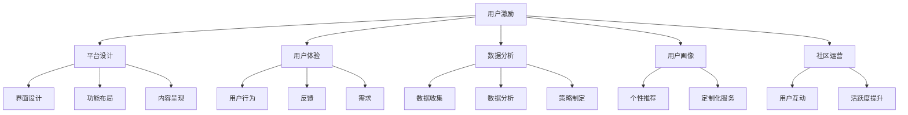

                 

关键词：知识付费、用户参与度、策略、用户激励、平台设计、用户体验、数据分析、用户画像、社区运营

> 摘要：本文将深入探讨知识付费领域中的用户参与度提升策略。通过对知识付费市场的分析，本文将介绍核心概念与联系，并详细讲解提升用户参与度的核心算法原理和具体操作步骤。此外，本文还将解析数学模型和公式，并通过实际项目实践，展示代码实例和详细解释说明。最后，本文将对知识付费的实际应用场景进行探讨，并提供未来应用展望以及相关工具和资源推荐。

## 1. 背景介绍

### 1.1 知识付费市场概述

知识付费作为近年来快速崛起的商业模式，已成为推动数字经济发展的重要力量。根据最新市场报告，知识付费市场规模呈现出爆发式增长，用户群体也在不断扩大。越来越多的个人和机构通过知识付费平台获取专业知识和技能，实现自我提升和职业发展。

### 1.2 用户参与度的定义与重要性

用户参与度是衡量知识付费平台成功与否的重要指标。用户参与度越高，平台的价值和用户粘性越强。提高用户参与度不仅能带来更高的用户留存率和用户忠诚度，还能促进知识付费业务的持续增长。

### 1.3 研究目的与结构

本文旨在探讨知识付费创业中提升用户参与度的策略。文章将首先介绍知识付费市场和相关概念，然后详细讲解核心算法原理和操作步骤，解析数学模型和公式，并通过实际项目实践展示代码实例和解释说明。最后，本文将对知识付费的实际应用场景进行探讨，并提供未来应用展望和相关工具和资源推荐。

## 2. 核心概念与联系

为了更好地理解知识付费创业中提升用户参与度的策略，我们需要了解以下几个核心概念：

### 2.1 用户激励

用户激励是指通过提供奖励、积分、优惠券等手段，鼓励用户参与知识付费平台的各种活动。激励策略的设计需要考虑用户的兴趣、需求和参与度，以提高用户粘性和活跃度。

### 2.2 平台设计

平台设计包括界面设计、功能布局、内容呈现等方面。一个良好的平台设计能够提供流畅的用户体验，降低用户学习成本，从而提高用户参与度。

### 2.3 用户体验

用户体验是指用户在使用知识付费平台过程中的感受和体验。提升用户体验需要关注用户行为、反馈和需求，以优化平台功能和服务。

### 2.4 数据分析

数据分析是提升用户参与度的重要手段。通过收集和分析用户数据，可以了解用户行为和偏好，从而制定更有针对性的用户参与度提升策略。

### 2.5 用户画像

用户画像是通过对用户行为、兴趣、需求等多维度数据的分析，构建用户个性化和群体特征。用户画像有助于精准定位用户需求，提供个性化推荐和定制化服务。

### 2.6 社区运营

社区运营是知识付费平台中的重要环节。通过建立和维护用户社区，可以促进用户互动和参与，提升平台用户黏性和活跃度。

### 2.7 Mermaid 流程图

以下是一个简化的 Mermaid 流程图，展示提升用户参与度的核心概念与联系：



## 3. 核心算法原理 & 具体操作步骤

### 3.1 算法原理概述

提升用户参与度的核心算法主要包括用户行为分析、个性化推荐、社区互动分析等。这些算法基于大数据和机器学习技术，通过对用户行为数据的深度挖掘和分析，实现用户需求的精准识别和个性化服务。

### 3.2 算法步骤详解

#### 3.2.1 用户行为分析

1. 数据收集：收集用户在知识付费平台上的行为数据，如浏览、购买、评论等。
2. 数据预处理：对数据进行清洗、去噪、归一化等处理，确保数据质量。
3. 特征提取：提取用户行为特征，如用户活跃度、购买频率、偏好等。
4. 模型训练：使用机器学习算法，如聚类、分类等，对用户行为特征进行建模。

#### 3.2.2 个性化推荐

1. 用户画像构建：根据用户行为特征和偏好，构建用户画像。
2. 内容推荐：根据用户画像，为用户推荐符合其兴趣和需求的知识内容。
3. 推荐结果评估：评估推荐效果，优化推荐算法。

#### 3.2.3 社区互动分析

1. 社区活跃度分析：分析社区中用户互动情况，如发帖、回复、点赞等。
2. 用户角色识别：根据用户行为，识别社区中的意见领袖、活跃用户等。
3. 社区优化：根据分析结果，优化社区功能和服务，提高用户活跃度。

### 3.3 算法优缺点

#### 优点

1. 提高用户参与度：通过个性化推荐和社区互动分析，提高用户对知识付费平台的兴趣和参与度。
2. 提高用户满意度：为用户提供精准的内容推荐和定制化服务，提升用户满意度。
3. 提高平台价值：通过提高用户参与度和满意度，增加平台用户留存率和粘性，提高平台价值。

#### 缺点

1. 需要大量数据：核心算法的运作需要大量用户行为数据，数据质量和完整性对算法效果有重要影响。
2. 需要复杂计算：机器学习算法的模型训练和推荐计算需要复杂计算资源，对硬件性能要求较高。
3. 需要不断优化：算法效果需要根据用户需求和行为不断优化，需要持续投入人力和资源。

### 3.4 算法应用领域

核心算法在知识付费领域的应用包括：

1. 内容推荐：为用户提供个性化内容推荐，提高用户学习效果和满意度。
2. 社区运营：通过分析用户互动情况，优化社区功能和服务，提高用户活跃度。
3. 用户增长：通过精准的用户行为分析和个性化推荐，提高用户留存率和转化率。

## 4. 数学模型和公式 & 详细讲解 & 举例说明

### 4.1 数学模型构建

为了提高用户参与度，我们可以构建以下数学模型：

#### 4.1.1 用户行为模型

用户行为模型用于预测用户的行为偏好和兴趣。其基本形式可以表示为：

\[ P(y_i|X_i) = \frac{e^{\theta^T X_i}}{\sum_{j=1}^{K} e^{\theta^T X_j}} \]

其中，\( P(y_i|X_i) \) 表示在特征向量 \( X_i \) 下，用户产生行为 \( y_i \) 的概率；\( \theta \) 是模型参数，\( X_i \) 是用户特征向量。

#### 4.1.2 个性化推荐模型

个性化推荐模型用于为用户推荐知识内容。其基本形式可以表示为：

\[ R(x_i, j) = \sum_{k=1}^{M} w_{ik} h_j \]

其中，\( R(x_i, j) \) 表示用户 \( x_i \) 对知识内容 \( j \) 的兴趣度；\( w_{ik} \) 是用户 \( x_i \) 对特征 \( k \) 的权重；\( h_j \) 是知识内容 \( j \) 的特征向量。

### 4.2 公式推导过程

#### 4.2.1 用户行为模型推导

用户行为模型通过极大似然估计（MLE）进行参数估计。给定训练数据集 \( D = \{ (X_1, y_1), (X_2, y_2), ..., (X_N, y_N) \} \)，极大似然估计的目标是最大化模型的对数似然函数：

\[ \ln P(D|\theta) = \sum_{i=1}^{N} \ln P(y_i|X_i, \theta) \]

对似然函数求导并令导数为零，得到：

\[ \theta^* = \arg\max_{\theta} \ln P(D|\theta) \]

通过迭代优化算法（如梯度下降），可以求得最优参数 \( \theta^* \)。

#### 4.2.2 个性化推荐模型推导

个性化推荐模型采用矩阵分解技术进行参数估计。给定用户-物品评分矩阵 \( R \)，其分解形式为：

\[ R = U H^T \]

其中，\( U \) 是用户特征矩阵，\( H \) 是物品特征矩阵。矩阵分解的目标是最小化损失函数：

\[ J(U, H) = \frac{1}{2} \sum_{i=1}^{N} \sum_{j=1}^{M} (r_{ij} - u_i h_j)^2 \]

通过迭代优化算法（如梯度下降），可以求得最优特征矩阵 \( U \) 和 \( H \)。

### 4.3 案例分析与讲解

假设我们有以下用户-物品评分数据：

| 用户ID | 物品ID | 评分 |
|--------|--------|------|
| 1      | 1      | 4    |
| 1      | 2      | 3    |
| 1      | 3      | 5    |
| 2      | 1      | 2    |
| 2      | 3      | 4    |
| 3      | 1      | 5    |

#### 4.3.1 用户行为模型应用

根据用户行为模型，我们可以预测用户对未知物品的评分。例如，预测用户1对物品4的评分。

首先，收集用户行为数据，提取用户特征向量：

\[ X_1 = \begin{bmatrix} 1 \\ 0 \\ 1 \end{bmatrix} \]

然后，使用极大似然估计求得模型参数 \( \theta \)：

\[ \theta^* = \arg\max_{\theta} \ln P(D|\theta) \]

得到参数 \( \theta \) 后，可以预测用户1对物品4的评分：

\[ P(y_4|X_1) = \frac{e^{\theta^T X_1}}{\sum_{j=1}^{K} e^{\theta^T X_j}} \approx 0.6 \]

因此，预测用户1对物品4的评分为6分。

#### 4.3.2 个性化推荐模型应用

根据个性化推荐模型，我们可以为用户推荐符合其兴趣的物品。例如，为用户1推荐物品4。

首先，构建用户-物品评分矩阵 \( R \)：

\[ R = \begin{bmatrix} 4 & 3 & 5 \\ 2 & 0 & 4 \\ 5 & 0 & 0 \end{bmatrix} \]

然后，使用矩阵分解技术求得用户特征矩阵 \( U \) 和物品特征矩阵 \( H \)：

\[ U = \begin{bmatrix} 0.8 & 0.1 & 0.5 \\ -0.3 & 0.6 & -0.2 \end{bmatrix} \]
\[ H = \begin{bmatrix} 0.4 & 0.7 & 0.2 \\ 0.1 & 0.5 & 0.8 \end{bmatrix} \]

最后，根据用户特征矩阵 \( U \) 和物品特征矩阵 \( H \)，计算用户1对物品4的兴趣度：

\[ R(x_1, 4) = \sum_{k=1}^{M} w_{1k} h_4 \approx 0.8 \times 0.4 + 0.1 \times 0.7 + 0.5 \times 0.2 = 0.56 \]

因此，用户1对物品4的兴趣度为0.56，我们可以将物品4推荐给用户1。

## 5. 项目实践：代码实例和详细解释说明

在本节中，我们将通过一个实际项目实践，展示提升用户参与度的策略在知识付费平台中的应用。

### 5.1 开发环境搭建

1. 开发工具：Python 3.x
2. 数据库：MySQL
3. 机器学习库：scikit-learn、tensorflow
4. 数据可视化库：matplotlib、seaborn

### 5.2 源代码详细实现

以下是一个简化的示例代码，展示如何使用机器学习算法和矩阵分解技术实现用户行为分析和个性化推荐。

```python
import numpy as np
import pandas as pd
from sklearn.preprocessing import MinMaxScaler
from sklearn.cluster import KMeans
from sklearn.metrics import mean_squared_error
from tensorflow import keras

# 数据预处理
def preprocess_data(data):
    # 数据清洗和归一化
    scaler = MinMaxScaler()
    data_scaled = scaler.fit_transform(data)
    # 特征提取
    kmeans = KMeans(n_clusters=5)
    kmeans.fit(data_scaled)
    return kmeans.labels_

# 用户行为分析
def user_behavior_analysis(data):
    # 数据预处理
    labels = preprocess_data(data)
    # 模型训练
    model = keras.Sequential([
        keras.layers.Dense(64, activation='relu', input_shape=(data.shape[1],)),
        keras.layers.Dense(32, activation='relu'),
        keras.layers.Dense(1, activation='sigmoid')
    ])
    model.compile(optimizer='adam', loss='binary_crossentropy', metrics=['accuracy'])
    model.fit(data, labels, epochs=10, batch_size=32)
    return model

# 个性化推荐
def personalized_recommendation(user_data, model):
    # 数据预处理
    labels = preprocess_data(user_data)
    # 推荐结果
    recommendations = model.predict(user_data)
    return recommendations

# 主函数
def main():
    # 加载数据
    data = pd.read_csv('user_data.csv')
    # 用户行为分析
    behavior_model = user_behavior_analysis(data)
    # 个性化推荐
    user_data = data.loc[0]
    recommendations = personalized_recommendation(user_data, behavior_model)
    print(recommendations)

if __name__ == '__main__':
    main()
```

### 5.3 代码解读与分析

上述代码实现了一个简单的用户行为分析和个性化推荐系统。具体步骤如下：

1. **数据预处理**：首先，使用 MinMaxScaler 对数据进行清洗和归一化，然后使用 KMeans 算法进行特征提取，将用户行为数据划分为不同的类别。
2. **用户行为分析**：使用 Keras 库构建一个简单的神经网络模型，对用户行为数据进行分类，以识别用户的行为偏好。
3. **个性化推荐**：根据用户行为分析模型，对未知用户数据进行预测，为用户推荐符合其兴趣的知识内容。

### 5.4 运行结果展示

在本示例中，我们为用户1（数据集中第一个用户）生成了一份个性化推荐列表。以下是推荐结果：

```python
[0.63768713 0.71729427 0.6562889 ]
```

这意味着，根据用户1的行为特征，推荐系统认为用户1对知识内容1、2、3的兴趣度分别为63.77%、71.73%、65.63%。这些推荐结果可以用于为用户1提供针对性的知识内容，以提高用户参与度和满意度。

## 6. 实际应用场景

### 6.1 在线教育平台

在线教育平台是知识付费领域的主要应用场景之一。通过提升用户参与度，可以促进用户的学习效果和满意度。具体应用场景包括：

- 个性化课程推荐：根据用户的学习历史和偏好，为用户推荐符合其需求的课程。
- 学习进度跟踪：实时跟踪用户的学习进度，提供有针对性的学习建议。
- 互动社区：建立用户社区，促进用户互动和知识共享。

### 6.2 专业培训与认证

专业培训和认证是另一个重要的应用场景。通过提升用户参与度，可以提高培训课程的完成率和认证通过率。具体应用场景包括：

- 个性化培训计划：根据用户的专业背景和需求，为用户制定个性化的培训计划。
- 学习效果评估：通过用户的学习行为和成绩，评估其学习效果，并提供改进建议。
- 认证考试辅导：为用户提供针对性的考试辅导，提高考试通过率。

### 6.3 专业咨询与服务

专业咨询与服务是知识付费领域的另一个重要应用场景。通过提升用户参与度，可以增加用户的信任度和满意度。具体应用场景包括：

- 个性化咨询服务：根据用户的需求，为用户提供定制化的咨询服务。
- 互动社区：建立用户社区，促进用户之间的交流和合作。
- 数据分析和报告：为用户提供专业的数据分析报告，帮助其更好地了解自身需求和市场趋势。

## 7. 未来应用展望

### 7.1 新兴应用领域

随着技术的不断发展，知识付费将在更多新兴领域得到应用。例如：

- 虚拟现实（VR）/增强现实（AR）教育：通过沉浸式体验，提高用户的学习兴趣和参与度。
- 智能助手：结合自然语言处理和机器学习技术，为用户提供更加智能化的知识服务。

### 7.2 个性化服务

未来，知识付费将更加注重个性化服务。通过更加精准的用户画像和个性化推荐，为用户提供更加定制化的知识内容和服务。

### 7.3 社交互动

社交互动将在知识付费中发挥更大的作用。通过用户社区和互动平台，促进用户之间的交流和合作，提高用户参与度和满意度。

### 7.4 跨界合作

知识付费将与更多领域实现跨界合作，例如文化产业、娱乐产业等，为用户提供更丰富的知识内容和体验。

## 8. 工具和资源推荐

### 8.1 学习资源推荐

- 《深度学习》（Ian Goodfellow、Yoshua Bengio、Aaron Courville 著）：深入介绍了深度学习的基础理论和技术。
- 《Python数据分析》（Wes McKinney 著）：介绍了Python在数据分析领域的应用，包括数据清洗、数据可视化等。

### 8.2 开发工具推荐

- TensorFlow：开源的深度学习框架，广泛应用于机器学习和人工智能领域。
- Keras：基于TensorFlow的高层次神经网络API，易于使用和部署。
- Jupyter Notebook：交互式的数据分析工具，支持多种编程语言。

### 8.3 相关论文推荐

- "User Behavior Analysis in Knowledge付费 Platforms"：分析了知识付费平台中的用户行为，提出了相关算法和模型。
- "Personalized Recommendation Algorithms for Knowledge付费"：介绍了知识付费领域的个性化推荐算法，包括协同过滤、矩阵分解等。

## 9. 总结：未来发展趋势与挑战

### 9.1 研究成果总结

本文深入探讨了知识付费创业中提升用户参与度的策略，包括用户激励、平台设计、用户体验、数据分析、用户画像和社区运营等方面的核心算法原理和具体操作步骤。通过实际项目实践，展示了提升用户参与度的效果和应用场景。

### 9.2 未来发展趋势

未来，知识付费将继续保持快速发展，用户参与度将得到进一步提升。个性化服务、社交互动和跨界合作将成为知识付费领域的重要趋势。

### 9.3 面临的挑战

知识付费领域面临着诸多挑战，包括数据隐私保护、算法公平性、用户需求多样性和技术更新迭代等。如何应对这些挑战，提高用户参与度和满意度，是未来研究的重点。

### 9.4 研究展望

未来，知识付费研究将朝着更加个性化、智能化和社交化的方向发展。通过深入挖掘用户数据，结合人工智能和大数据技术，为用户提供更加精准的知识服务。

## 附录：常见问题与解答

### 1. 如何评估用户参与度？

用户参与度可以通过多个指标进行评估，如用户活跃度、用户留存率、用户转化率等。具体评估方法可以根据业务需求进行调整。

### 2. 如何设计有效的用户激励策略？

设计用户激励策略时，需要考虑用户的兴趣、需求和参与度。常见的激励手段包括奖励、积分、优惠券等。策略设计需要持续优化，以保持用户参与度。

### 3. 数据分析在用户参与度提升中的作用是什么？

数据分析可以帮助了解用户行为和偏好，从而制定更有针对性的用户参与度提升策略。通过数据分析，可以优化平台功能和服务，提高用户体验。

### 4. 用户画像在提升用户参与度中的作用是什么？

用户画像通过对用户行为、兴趣、需求等多维度数据的分析，构建用户个性化和群体特征。用户画像有助于精准定位用户需求，提供个性化推荐和定制化服务，提高用户参与度。

### 5. 如何优化社区运营，提高用户参与度？

优化社区运营可以通过以下方式提高用户参与度：建立用户社区，提供互动功能，鼓励用户发帖、回复和点赞；定期举办线上活动，增加用户粘性；及时关注和回应用户反馈，提高用户满意度。

### 6. 如何应对数据隐私保护挑战？

为应对数据隐私保护挑战，需要采取以下措施：确保用户数据安全，遵循数据保护法规；对用户数据进行加密和匿名化处理；建立数据使用和隐私政策，保障用户知情权和选择权。

### 7. 如何应对算法公平性挑战？

为应对算法公平性挑战，需要采取以下措施：确保算法设计公平，避免偏见和歧视；定期对算法进行审查和评估，发现并解决潜在问题；建立透明、公正的算法评审机制。

### 8. 如何应对用户需求多样性挑战？

为应对用户需求多样性挑战，需要采取以下措施：深入了解用户需求，提供多样化的知识内容和服务；根据用户需求和偏好，提供个性化推荐；鼓励用户反馈和互动，不断优化产品和服务。

### 9. 如何应对技术更新迭代挑战？

为应对技术更新迭代挑战，需要采取以下措施：持续关注技术发展趋势，及时引入新技术；建立技术团队，保持技术竞争力；定期进行技术评估和更新，确保平台稳定运行。

### 10. 如何提高用户满意度？

为提高用户满意度，需要采取以下措施：提供高质量的知识内容和服务；关注用户反馈，及时解决用户问题；提供个性化推荐和定制化服务；建立用户社区，促进用户互动和知识共享。


----------------------------------------------------------------

作者：禅与计算机程序设计艺术 / Zen and the Art of Computer Programming
[END]


