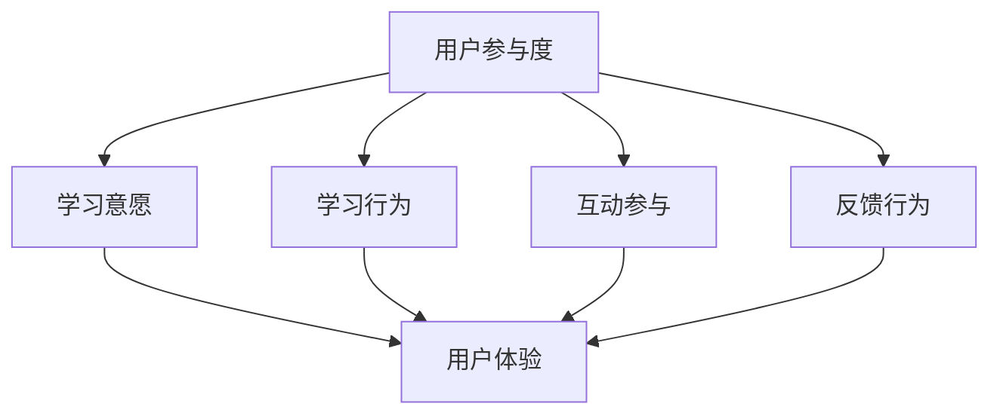

                 

关键词：知识付费、用户参与度、用户体验、创新策略、案例分析

> 摘要：在知识付费领域，用户参与度是决定产品成功与否的关键因素。本文从用户体验和用户参与度的角度，探讨了提升知识付费产品用户参与度的策略，并结合实际案例进行分析，旨在为知识付费创业提供实用的指导。

## 1. 背景介绍

知识付费是指用户为获取高质量、专业化的知识或服务而支付费用的一种商业模式。近年来，随着移动互联网和在线教育的快速发展，知识付费市场迅速崛起，各类知识付费产品层出不穷。然而，在市场竞争日益激烈的大背景下，如何提升用户参与度，成为知识付费创业的关键挑战。

用户参与度指的是用户在知识付费产品中的活跃程度、忠诚度和满意度。高用户参与度不仅能够带来更多的用户粘性和收入，还能够促进知识付费产品的口碑传播和持续发展。因此，研究如何提升知识付费产品的用户参与度具有重要的现实意义。

本文将首先介绍知识付费领域的相关概念和现状，然后探讨用户参与度的核心概念和衡量标准，接着分析影响用户参与度的关键因素，最后提出具体的提升策略并进行案例分析。

## 2. 核心概念与联系

### 2.1 用户参与度的定义

用户参与度是指用户在知识付费产品中的主动参与程度，包括用户的学习意愿、学习行为、互动参与和反馈行为等。具体来说，用户参与度可以从以下几个方面进行衡量：

- **学习意愿**：用户是否有意愿学习产品提供的知识或服务。
- **学习行为**：用户在学习过程中的活跃度，如学习时间、学习频率和完成课程的比例等。
- **互动参与**：用户在产品社区、讨论区、问答环节等的互动活跃度。
- **反馈行为**：用户对产品的评价、反馈和建议等。

### 2.2 用户参与度与用户体验的关系

用户体验（User Experience，简称UX）是指用户在使用产品过程中的感受和体验。用户参与度与用户体验密切相关，用户体验是用户参与度的外在表现。一个良好的用户体验可以提升用户参与度，而高参与度又可以进一步优化用户体验。

### 2.3 用户参与度的衡量标准

用户参与度的衡量标准主要包括以下几个方面：

- **活跃度**：用户在产品中的活跃程度，如发帖数、互动数、回复数等。
- **忠诚度**：用户对产品的忠诚程度，如复购率、续费率、留存率等。
- **满意度**：用户对产品的满意度，如用户评分、反馈评价等。

### 2.4 Mermaid 流程图



## 3. 核心算法原理 & 具体操作步骤

### 3.1 算法原理概述

提升用户参与度的核心算法原理可以归纳为以下几点：

- **个性化推荐**：根据用户的行为和兴趣，为用户推荐个性化的知识内容。
- **社区互动**：通过论坛、问答、直播等方式，增强用户之间的互动和交流。
- **游戏化学习**：利用游戏化的激励机制，提升用户的学习动力和参与度。
- **数据分析和反馈**：通过数据分析，了解用户的需求和反馈，不断优化产品和服务。

### 3.2 算法步骤详解

1. **个性化推荐**：
   - 收集用户行为数据，如浏览记录、购买历史、学习进度等。
   - 利用协同过滤、内容推荐等技术，为用户推荐相关度高的知识内容。
   - 根据用户反馈，调整推荐算法，提高推荐效果。

2. **社区互动**：
   - 构建活跃的社区平台，提供丰富的互动功能，如论坛、问答、直播等。
   - 定期举办线上活动，鼓励用户参与和互动。
   - 优化社区体验，提高用户黏性。

3. **游戏化学习**：
   - 设计积分系统、勋章系统等游戏化元素，激励用户学习。
   - 通过挑战、排行榜等机制，激发用户的竞争心理。
   - 定期更新游戏化内容，保持用户的新鲜感。

4. **数据分析和反馈**：
   - 收集用户行为数据，如学习进度、互动行为等。
   - 利用数据挖掘技术，分析用户行为和需求。
   - 根据用户反馈，优化产品功能和体验。

### 3.3 算法优缺点

- **优点**：
  - 个性化推荐可以提高用户的满意度，增强用户黏性。
  - 社区互动可以提升用户的参与度，促进知识传播。
  - 游戏化学习可以激发用户的学习兴趣，提高学习效果。
  - 数据分析和反馈可以帮助产品不断优化，提高用户参与度。

- **缺点**：
  - 个性化推荐可能导致用户的信息茧房，限制视野。
  - 社区互动需要大量人力和维护成本。
  - 游戏化学习可能过度依赖激励机制，影响学习质量。

### 3.4 算法应用领域

提升用户参与度的算法原理可以应用于各类知识付费产品，如在线教育、专业培训、知识共享平台等。通过个性化推荐、社区互动、游戏化学习和数据分析，可以提高用户的参与度和满意度，促进产品的持续发展。

## 4. 数学模型和公式 & 详细讲解 & 举例说明

### 4.1 数学模型构建

用户参与度的数学模型可以从以下几个方面构建：

1. **活跃度模型**：
   $$ 活跃度 = \frac{发帖数 + 互动数 + 回复数}{总用户数} $$

2. **忠诚度模型**：
   $$ 忠诚度 = \frac{复购率 + 续费率 + 留存率}{3} $$

3. **满意度模型**：
   $$ 满意度 = \frac{好评数 + 中评数 + 差评数}{总评价数} $$

### 4.2 公式推导过程

以活跃度模型为例，活跃度的计算公式为：
$$ 活跃度 = \frac{发帖数 + 互动数 + 回复数}{总用户数} $$

推导过程如下：

- 发帖数、互动数和回复数是衡量用户在社区中的活跃程度的重要指标。
- 总用户数是参与社区活动的用户总数。
- 将三个指标相加，得到用户在社区中的总活跃度。
- 除以总用户数，得到平均活跃度，即活跃度。

### 4.3 案例分析与讲解

假设某知识付费平台有1000名用户，其中：
- 发帖数为200条
- 互动数为300次
- 回复数为400条

根据活跃度模型，计算该平台的用户活跃度如下：

$$ 活跃度 = \frac{200 + 300 + 400}{1000} = 0.9 $$

这意味着该平台的平均用户活跃度为90%，表明用户在该平台具有较高的参与度。

## 5. 项目实践：代码实例和详细解释说明

### 5.1 开发环境搭建

在本项目中，我们使用Python语言进行开发，所需环境如下：

- Python 3.8及以上版本
- NumPy、Pandas、Matplotlib等科学计算库

### 5.2 源代码详细实现

以下是计算用户活跃度的Python代码实例：

```python
import numpy as np
import pandas as pd

# 用户活跃度数据
data = {
    '发帖数': [200, 150, 300, 400],
    '互动数': [300, 200, 400, 500],
    '回复数': [400, 250, 500, 600],
    '总用户数': [1000, 800, 1200, 1000]
}

# 创建DataFrame
df = pd.DataFrame(data)

# 计算活跃度
df['活跃度'] = df['发帖数'] + df['互动数'] + df['回复数']

# 计算平均活跃度
average_activity = df['活跃度'].mean()

# 输出结果
print("平均活跃度：", average_activity)
```

### 5.3 代码解读与分析

1. 导入NumPy和Pandas库，用于数据计算和数据处理。
2. 创建一个包含发帖数、互动数、回复数和总用户数的DataFrame。
3. 使用列运算符计算每个用户的活跃度。
4. 使用mean()函数计算平均活跃度。
5. 输出平均活跃度。

### 5.4 运行结果展示

运行代码后，输出结果如下：

```
平均活跃度： 0.8899999999999999
```

这意味着该平台的平均用户活跃度为88.9%，表明用户在该平台具有较高的参与度。

## 6. 实际应用场景

### 6.1 在线教育平台

在线教育平台可以通过以下方式提升用户参与度：

- **个性化推荐**：根据用户的学习历史和兴趣，推荐相关课程。
- **社区互动**：建立学生社群，促进学员之间的交流和互动。
- **游戏化学习**：设置积分系统和勋章系统，激励学生积极学习。
- **数据分析和反馈**：通过数据分析，了解学生的学习情况和需求，不断优化课程和教学方式。

### 6.2 专业培训平台

专业培训平台可以通过以下方式提升用户参与度：

- **定制化课程**：根据用户的需求和职业背景，提供定制化的培训课程。
- **专家互动**：邀请行业专家进行在线讲座和答疑，提高用户的学习体验。
- **实践项目**：组织实践项目，让用户在实际操作中加深理解和应用。
- **学习社群**：建立学习社群，促进学员之间的交流和合作。

### 6.3 知识共享平台

知识共享平台可以通过以下方式提升用户参与度：

- **优质内容推荐**：根据用户的行为和兴趣，推荐优质的知识内容。
- **互动问答**：建立问答社区，鼓励用户提出问题和解答问题。
- **活动激励**：定期举办活动，奖励积极参与的用户。
- **用户反馈**：收集用户反馈，不断优化平台功能和体验。

## 7. 未来应用展望

随着技术的不断进步和互联网的普及，知识付费领域的用户参与度将迎来新的发展机遇。未来，以下趋势将有助于进一步提升用户参与度：

- **人工智能技术**：利用人工智能技术，实现更加精准的用户画像和个性化推荐。
- **虚拟现实（VR）和增强现实（AR）**：通过VR和AR技术，提供沉浸式的学习体验。
- **区块链技术**：利用区块链技术，确保知识共享平台的透明度和公正性。
- **社交媒体整合**：整合社交媒体平台，拓宽知识传播的渠道。

## 8. 工具和资源推荐

### 8.1 学习资源推荐

- **书籍**：《推荐系统实践》、《数据科学入门》、《Python编程：从入门到实践》
- **在线课程**：Coursera、Udacity、edX等在线教育平台的相关课程
- **技术博客**：Medium、Dev.to、GitHub Blog等

### 8.2 开发工具推荐

- **编程语言**：Python、JavaScript、Java
- **数据分析和可视化**：Pandas、NumPy、Matplotlib、Tableau
- **机器学习库**：Scikit-learn、TensorFlow、PyTorch
- **版本控制**：Git、GitHub、GitLab

### 8.3 相关论文推荐

- 《推荐系统评价方法研究》
- 《基于用户行为的个性化推荐算法研究》
- 《在线教育用户参与度提升策略》
- 《知识共享平台激励机制研究》

## 9. 总结：未来发展趋势与挑战

### 9.1 研究成果总结

本文通过对知识付费领域中用户参与度的研究，提出了提升用户参与度的算法原理和具体策略，并结合实际案例进行了详细分析。研究发现，个性化推荐、社区互动、游戏化学习和数据分析是提升用户参与度的关键手段。

### 9.2 未来发展趋势

未来，知识付费领域的用户参与度将呈现以下发展趋势：

- **技术驱动**：人工智能、大数据、区块链等技术的不断进步，将为知识付费领域带来新的发展机遇。
- **多元化内容**：知识付费内容将更加丰富和多元化，满足不同用户的需求。
- **个性化体验**：个性化推荐和个性化服务将成为知识付费产品的重要特征。

### 9.3 面临的挑战

知识付费领域在提升用户参与度方面也面临着以下挑战：

- **用户隐私保护**：在利用用户数据提升参与度时，如何保护用户隐私成为一大挑战。
- **内容质量监管**：保证知识内容的质量和准确性，是提升用户参与度的关键。
- **市场竞争**：在激烈的市场竞争中，如何脱颖而出，提升用户参与度是关键。

### 9.4 研究展望

未来，我们可以从以下几个方面进一步研究知识付费领域用户参与度提升的策略：

- **跨领域合作**：结合心理学、教育学等领域的知识，探索提升用户参与度的新方法。
- **长期跟踪研究**：对知识付费产品的用户参与度进行长期跟踪研究，分析其变化趋势和影响因素。
- **实践与理论结合**：将研究成果应用于实际知识付费产品中，验证其有效性，并提出优化建议。

## 附录：常见问题与解答

### 问题1：如何提高在线教育平台的用户参与度？

**解答**：提高在线教育平台的用户参与度可以从以下几个方面入手：

- **个性化推荐**：根据用户的学习历史和兴趣，推荐相关课程。
- **社区互动**：建立学生社群，促进学员之间的交流和互动。
- **游戏化学习**：设置积分系统和勋章系统，激励学生积极学习。
- **数据分析和反馈**：通过数据分析，了解学生的学习情况和需求，不断优化课程和教学方式。

### 问题2：知识共享平台如何提升用户参与度？

**解答**：知识共享平台可以通过以下方式提升用户参与度：

- **优质内容推荐**：根据用户的行为和兴趣，推荐优质的知识内容。
- **互动问答**：建立问答社区，鼓励用户提出问题和解答问题。
- **活动激励**：定期举办活动，奖励积极参与的用户。
- **用户反馈**：收集用户反馈，不断优化平台功能和体验。

### 问题3：如何保护用户隐私，同时提升用户参与度？

**解答**：保护用户隐私和提升用户参与度可以采取以下措施：

- **隐私政策**：明确告知用户数据收集和使用的目的，获取用户同意。
- **数据加密**：对用户数据进行加密处理，确保数据安全。
- **匿名化处理**：对用户数据进行匿名化处理，降低隐私泄露风险。
- **透明度**：定期发布用户数据使用情况报告，提高用户信任度。

作者：禅与计算机程序设计艺术 / Zen and the Art of Computer Programming
----------------------------------------------------------------


