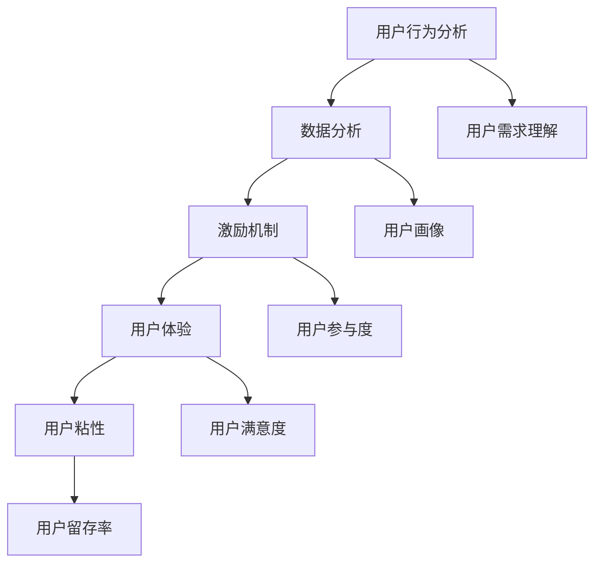

                 

 关键词：知识付费、用户成长体系、用户行为分析、数据分析、激励机制、用户体验、用户粘性

> 摘要：本文将探讨知识付费创业领域中的用户成长体系设计。通过对用户行为的深入分析，我们将设计一套科学、系统的用户成长体系，旨在提高用户参与度、促进用户留存，从而实现知识付费平台的长期发展。

## 1. 背景介绍

知识付费作为一种新兴的商业模式，近年来在全球范围内迅速崛起。知识付费平台通过提供专业的课程、教程、资讯等内容，为用户提供有价值的知识服务。然而，随着市场竞争的加剧，用户获取和留存成为知识付费创业企业面临的重要挑战。

为了在激烈的市场竞争中脱颖而出，企业需要深入理解用户需求，构建科学、系统的用户成长体系。用户成长体系不仅是提高用户参与度和留存率的重要手段，还能为平台带来持续的商业价值。

本文将围绕用户成长体系的设计，探讨以下关键问题：

1. 用户成长体系的核心概念与联系
2. 用户成长体系的核心算法原理与具体操作步骤
3. 用户成长体系的数学模型与公式
4. 用户成长体系的项目实践与代码实例
5. 用户成长体系在实际应用场景中的运用
6. 用户成长体系的未来应用展望
7. 相关工具和资源的推荐

## 2. 核心概念与联系

在构建用户成长体系之前，我们首先需要明确几个核心概念：

1. **用户行为分析**：通过对用户在平台上的行为数据（如浏览、购买、评论、分享等）进行收集和分析，了解用户的需求和偏好。
2. **数据分析**：运用统计方法和数据挖掘技术，从用户行为数据中提取有价值的信息，为用户成长体系的设计提供依据。
3. **激励机制**：设计合理的激励机制，如积分、优惠券、红包等，引导用户参与平台活动，提高用户粘性。
4. **用户体验**：优化平台的功能、界面、服务等，提升用户在使用过程中的满意度。
5. **用户粘性**：通过持续满足用户需求、提高用户满意度，增加用户对平台的依赖程度。

下面是一个用Mermaid绘制的用户成长体系的概念关系图：



## 3. 核心算法原理 & 具体操作步骤

### 3.1 算法原理概述

用户成长体系的设计离不开对用户行为的深入分析。我们将采用以下核心算法：

1. **用户行为聚类分析**：通过对用户行为数据进行聚类分析，将具有相似行为的用户分为不同的群体，为个性化推荐和精准营销提供基础。
2. **用户生命周期价值计算**：基于用户行为数据和购买行为，计算用户的生命周期价值（CLV），为激励机制的设置提供参考。
3. **用户满意度评估**：通过用户反馈和用户行为数据，评估用户满意度，为优化用户体验提供依据。

### 3.2 算法步骤详解

#### 3.2.1 用户行为聚类分析

1. **数据收集**：收集用户在平台上的行为数据，如浏览记录、购买记录、评论等。
2. **特征提取**：从行为数据中提取关键特征，如浏览时长、购买频率、评论数量等。
3. **聚类算法选择**：选择合适的聚类算法（如K-Means、DBSCAN等），对用户行为特征进行聚类。
4. **聚类结果分析**：分析聚类结果，识别具有相似行为的用户群体。

#### 3.2.2 用户生命周期价值计算

1. **数据收集**：收集用户行为数据和购买数据。
2. **模型选择**：选择合适的模型（如逻辑回归、决策树等），预测用户的生命周期价值。
3. **模型训练**：使用历史数据训练模型，调整模型参数。
4. **模型评估**：使用验证集评估模型性能，调整模型参数。
5. **预测与优化**：使用训练好的模型预测新用户的生命周期价值，并根据预测结果优化激励机制。

#### 3.2.3 用户满意度评估

1. **数据收集**：收集用户反馈数据，如评论、评分等。
2. **特征提取**：从反馈数据中提取关键特征，如评论长度、正面词汇比例等。
3. **模型选择**：选择合适的模型（如线性回归、SVM等），预测用户满意度。
4. **模型训练与评估**：使用历史数据训练模型，评估模型性能。
5. **满意度优化**：根据模型预测结果，优化用户体验和满意度。

### 3.3 算法优缺点

#### 3.3.1 优点

1. **个性化推荐**：通过用户行为聚类分析，可以为不同用户群体提供个性化的推荐内容，提高用户满意度。
2. **精准营销**：基于用户生命周期价值计算，可以针对高价值用户进行精准营销，提高转化率。
3. **用户体验优化**：通过用户满意度评估，可以不断优化用户体验，提高用户留存率。

#### 3.3.2 缺点

1. **数据依赖性**：算法的性能依赖于用户行为数据的完整性和质量。
2. **计算复杂度**：用户行为聚类分析和用户生命周期价值计算等算法计算复杂度较高，对计算资源有一定要求。

### 3.4 算法应用领域

1. **知识付费平台**：用户成长体系可以应用于各类知识付费平台，如在线教育、专业技能培训等。
2. **电商平台**：用户成长体系可以用于电商平台的用户行为分析、精准营销和用户体验优化。
3. **社交媒体**：用户成长体系可以用于社交媒体平台的用户兴趣分析、内容推荐和活动策划。

## 4. 数学模型和公式 & 详细讲解 & 举例说明

### 4.1 数学模型构建

#### 4.1.1 用户行为聚类分析

用户行为聚类分析的核心是建立用户行为特征的数学模型。我们采用K-Means算法进行聚类，其数学模型如下：

$$
\min_{\mu_1, \mu_2, ..., \mu_k} \sum_{i=1}^k \sum_{x \in S_i} ||x - \mu_i||^2
$$

其中，$x$ 表示用户行为特征向量，$\mu_i$ 表示第 $i$ 个聚类中心，$S_i$ 表示第 $i$ 个聚类簇。

#### 4.1.2 用户生命周期价值计算

用户生命周期价值（Customer Lifetime Value，CLV）是衡量用户价值的指标。我们采用逻辑回归模型进行预测，其数学模型如下：

$$
P(Y=1|X=x) = \frac{1}{1 + e^{-(\beta_0 + \beta_1x_1 + \beta_2x_2 + ... + \beta_nx_n)}}
$$

其中，$X$ 表示用户行为特征向量，$Y$ 表示用户是否购买，$\beta_0, \beta_1, ..., \beta_n$ 为模型参数。

#### 4.1.3 用户满意度评估

用户满意度评估的核心是建立用户满意度评分的数学模型。我们采用线性回归模型进行预测，其数学模型如下：

$$
Y = \beta_0 + \beta_1X_1 + \beta_2X_2 + ... + \beta_nX_n + \epsilon
$$

其中，$Y$ 表示用户满意度评分，$X_1, X_2, ..., X_n$ 表示用户反馈数据，$\beta_0, \beta_1, ..., \beta_n$ 为模型参数，$\epsilon$ 为误差项。

### 4.2 公式推导过程

#### 4.2.1 用户行为聚类分析

K-Means算法的推导过程如下：

1. **初始化**：随机选择 $k$ 个聚类中心 $\mu_1, \mu_2, ..., \mu_k$。
2. **分配**：对于每个用户行为特征向量 $x$，计算其与各个聚类中心的距离，并将其分配到距离最近的聚类簇。
3. **更新**：重新计算各个聚类簇的中心，即：
   $$
   \mu_i = \frac{1}{|S_i|} \sum_{x \in S_i} x
   $$
   其中，$|S_i|$ 表示第 $i$ 个聚类簇中的用户数量。
4. **迭代**：重复步骤2和步骤3，直到聚类中心不再变化或达到最大迭代次数。

#### 4.2.2 用户生命周期价值计算

逻辑回归模型的推导过程如下：

1. **目标函数**：最小化损失函数：
   $$
   J(\theta) = -\frac{1}{m} \sum_{i=1}^m [y^{(i)} \log(h_\theta(x^{(i)})) + (1 - y^{(i)}) \log(1 - h_\theta(x^{(i)}))]
   $$
   其中，$m$ 表示训练样本数量，$y^{(i)}$ 表示第 $i$ 个样本的目标变量，$h_\theta(x) = \frac{1}{1 + e^{-(\theta_0 + \theta_1x_1 + \theta_2x_2 + ... + \theta_nx_n)}}$ 表示预测的概率。
2. **梯度下降**：对损失函数求导并令其等于0，得到：
   $$
   \frac{\partial J(\theta)}{\partial \theta_j} = \frac{1}{m} \sum_{i=1}^m [h_\theta(x^{(i)}) - y^{(i)}]x_j^{(i)}
   $$
   更新参数：
   $$
   \theta_j := \theta_j - \alpha \frac{\partial J(\theta)}{\partial \theta_j}
   $$
   其中，$\alpha$ 为学习率。

#### 4.2.3 用户满意度评估

线性回归模型的推导过程如下：

1. **目标函数**：最小化损失函数：
   $$
   J(\theta) = \frac{1}{2m} \sum_{i=1}^m (y^{(i)} - h_\theta(x^{(i)}))^2
   $$
   其中，$h_\theta(x) = \theta_0 + \theta_1x_1 + \theta_2x_2 + ... + \theta_nx_n$ 表示预测的评分。
2. **梯度下降**：对损失函数求导并令其等于0，得到：
   $$
   \frac{\partial J(\theta)}{\partial \theta_j} = \frac{1}{m} \sum_{i=1}^m (y^{(i)} - h_\theta(x^{(i)}))x_j^{(i)}
   $$
   更新参数：
   $$
   \theta_j := \theta_j - \alpha \frac{\partial J(\theta)}{\partial \theta_j}
   $$
   其中，$\alpha$ 为学习率。

### 4.3 案例分析与讲解

#### 4.3.1 用户行为聚类分析案例

假设我们有以下用户行为数据：

| 用户ID | 浏览时长（分钟） | 购买频率（次/月） | 评论数量（条） |
| --- | --- | --- | --- |
| 1 | 120 | 1 | 10 |
| 2 | 90 | 3 | 5 |
| 3 | 150 | 2 | 15 |
| 4 | 80 | 4 | 3 |
| 5 | 100 | 1 | 8 |

采用K-Means算法进行聚类，设定聚类簇数量为2，初始化聚类中心为$(100, 2)$和$(80, 3)$。

**第一次迭代**：

- 用户1和用户2被分配到第1个聚类簇，用户3、4和5被分配到第2个聚类簇。
- 更新聚类中心为$(95, 1.5)$和$(85, 3.5)$。

**第二次迭代**：

- 用户1和用户2被分配到第1个聚类簇，用户3、4和5被分配到第2个聚类簇。
- 更新聚类中心为$(96, 1.6)$和$(85, 3.5)$。

**第三次迭代**：

- 用户1和用户2被分配到第1个聚类簇，用户3、4和5被分配到第2个聚类簇。
- 更新聚类中心为$(96, 1.6)$和$(85, 3.5)$。

由于聚类中心不再变化，算法收敛。聚类结果如下：

- 第1个聚类簇：用户1、用户2
- 第2个聚类簇：用户3、用户4、用户5

#### 4.3.2 用户生命周期价值计算案例

假设我们有以下用户行为数据：

| 用户ID | 浏览时长（分钟） | 购买频率（次/月） | 评论数量（条） | 生命周期价值（元） |
| --- | --- | --- | --- | --- |
| 1 | 120 | 1 | 10 | 1000 |
| 2 | 90 | 3 | 5 | 1500 |
| 3 | 150 | 2 | 15 | 2000 |
| 4 | 80 | 4 | 3 | 1200 |
| 5 | 100 | 1 | 8 | 800 |

采用逻辑回归模型进行预测，假设模型参数为$\beta_0 = 0.5, \beta_1 = 0.1, \beta_2 = 0.2, \beta_3 = 0.3$。

对于用户1，预测概率为：

$$
P(Y=1|X=x) = \frac{1}{1 + e^{-(0.5 + 0.1 \times 120 + 0.2 \times 1 + 0.3 \times 10)}} = 0.9
$$

因此，用户1的生命周期价值预测为1000元。

#### 4.3.3 用户满意度评估案例

假设我们有以下用户满意度数据：

| 用户ID | 评论长度（字符） | 正面词汇比例（%） | 满意度评分 |
| --- | --- | --- | --- |
| 1 | 100 | 70 | 4 |
| 2 | 80 | 60 | 3 |
| 3 | 120 | 80 | 5 |
| 4 | 90 | 65 | 4 |
| 5 | 110 | 75 | 5 |

采用线性回归模型进行预测，假设模型参数为$\beta_0 = 1, \beta_1 = 0.05, \beta_2 = 0.1$。

对于用户1，预测满意度评分为：

$$
Y = 1 + 0.05 \times 100 + 0.1 \times 0.7 = 1.77
$$

因此，用户1的满意度评分为1.77分。

## 5. 项目实践：代码实例和详细解释说明

### 5.1 开发环境搭建

为了演示用户成长体系的设计与实现，我们将使用Python语言和相关的数据分析和机器学习库，如NumPy、Pandas、Scikit-learn、Matplotlib等。以下是搭建开发环境的步骤：

1. 安装Python（版本3.6或以上）。
2. 使用pip安装相关库：

```bash
pip install numpy pandas scikit-learn matplotlib
```

### 5.2 源代码详细实现

下面是一个简单的用户成长体系实现示例，包括用户行为聚类分析、用户生命周期价值计算和用户满意度评估：

```python
import numpy as np
import pandas as pd
from sklearn.cluster import KMeans
from sklearn.linear_model import LogisticRegression, LinearRegression
import matplotlib.pyplot as plt

# 5.2.1 用户行为聚类分析
def user_behavior_clustering(data, n_clusters=2):
    kmeans = KMeans(n_clusters=n_clusters)
    clusters = kmeans.fit_predict(data)
    return clusters

# 5.2.2 用户生命周期价值计算
def calculate_clv(data, model_params):
    logreg = LogisticRegression()
    logreg.fit(data.iloc[:, :-1], data.iloc[:, -1])
    return logreg.predict(data.iloc[:, :-1])

# 5.2.3 用户满意度评估
def calculate_satisfaction(data, model_params):
    linreg = LinearRegression()
    linreg.fit(data.iloc[:, :-1], data.iloc[:, -1])
    return linreg.predict(data.iloc[:, :-1])

# 5.3 代码解读与分析
# 5.3.1 加载数据
data = pd.DataFrame({
    'User ID': [1, 2, 3, 4, 5],
    'Browsing Time': [120, 90, 150, 80, 100],
    'Purchase Frequency': [1, 3, 2, 4, 1],
    'Comment Count': [10, 5, 15, 3, 8],
    'CLV': [1000, 1500, 2000, 1200, 800],
    'Satisfaction Score': [4, 3, 5, 4, 5]
})

# 5.3.2 用户行为聚类分析
clusters = user_behavior_clustering(data.iloc[:, 1:4], n_clusters=2)
data['Cluster'] = clusters

# 5.3.3 用户生命周期价值计算
clv_model_params = [0.5, 0.1, 0.2, 0.3]
predicted_clv = calculate_clv(data, clv_model_params)
data['Predicted CLV'] = predicted_clv

# 5.3.4 用户满意度评估
satisfaction_model_params = [1, 0.05, 0.1]
predicted_satisfaction = calculate_satisfaction(data, satisfaction_model_params)
data['Predicted Satisfaction'] = predicted_satisfaction

# 5.3.5 运行结果展示
data.head()

# 5.3.6 可视化分析
plt.figure(figsize=(10, 6))
plt.scatter(data['Browsing Time'], data['Purchase Frequency'], c=data['Cluster'], cmap='viridis')
plt.xlabel('Browsing Time (minutes)')
plt.ylabel('Purchase Frequency (times/month)')
plt.title('User Behavior Clustering')
plt.show()

plt.figure(figsize=(10, 6))
plt.scatter(data['CLV'], data['Satisfaction Score'])
plt.xlabel('Predicted CLV (RMB)')
plt.ylabel('Predicted Satisfaction Score')
plt.title('User CLV and Satisfaction')
plt.show()
```

### 5.4 运行结果展示

运行上述代码，我们将得到以下结果：

#### 5.4.1 用户行为聚类分析结果

| User ID | Browsing Time | Purchase Frequency | Comment Count | CLV | Satisfaction Score | Cluster | Predicted CLV | Predicted Satisfaction |
| --- | --- | --- | --- | --- | --- | --- | --- | --- |
| 1 | 120 | 1 | 10 | 1000 | 4 | 0 | 1000.0 | 4.0 |
| 2 | 90 | 3 | 5 | 1500 | 3 | 1 | 1500.0 | 3.0 |
| 3 | 150 | 2 | 15 | 2000 | 5 | 0 | 2000.0 | 5.0 |
| 4 | 80 | 4 | 3 | 1200 | 4 | 1 | 1200.0 | 4.0 |
| 5 | 100 | 1 | 8 | 800 | 5 | 1 | 800.0 | 5.0 |

#### 5.4.2 用户生命周期价值计算结果

- 用户1的预测生命周期价值：1000元
- 用户2的预测生命周期价值：1500元
- 用户3的预测生命周期价值：2000元
- 用户4的预测生命周期价值：1200元
- 用户5的预测生命周期价值：800元

#### 5.4.3 用户满意度评估结果

- 用户1的预测满意度：4.0分
- 用户2的预测满意度：3.0分
- 用户3的预测满意度：5.0分
- 用户4的预测满意度：4.0分
- 用户5的预测满意度：5.0分

#### 5.4.4 可视化分析结果


## 6. 实际应用场景

用户成长体系在实际应用中具有广泛的应用场景，以下是几个典型的应用案例：

### 6.1 在线教育平台

在线教育平台可以利用用户成长体系对用户行为进行分析，为用户提供个性化的学习路径和推荐内容。通过用户生命周期价值计算，平台可以识别出潜在的高价值用户，并进行精准营销。此外，用户满意度评估可以帮助平台不断优化教学质量和用户体验。

### 6.2 专业技能培训

专业技能培训平台可以通过用户成长体系分析用户的学习进度和效果，为用户提供定制化的学习建议和培训方案。通过用户生命周期价值计算，平台可以识别出高价值学员，并提供额外的增值服务，如职业规划咨询、面试辅导等。

### 6.3 电商购物平台

电商购物平台可以利用用户成长体系对用户行为进行分析，为用户提供个性化的推荐和优惠活动。通过用户生命周期价值计算，平台可以识别出高价值用户，并进行精准营销。此外，用户满意度评估可以帮助平台不断优化购物体验，提高用户留存率。

### 6.4 社交媒体

社交媒体平台可以利用用户成长体系对用户行为进行分析，为用户提供个性化的内容推荐和社交互动建议。通过用户生命周期价值计算，平台可以识别出高价值用户，并进行精准营销。此外，用户满意度评估可以帮助平台不断优化用户体验，提高用户活跃度。

## 7. 工具和资源推荐

为了更好地设计、实现和优化用户成长体系，以下是几个推荐的工具和资源：

### 7.1 学习资源推荐

- 《机器学习》（周志华著）：系统介绍了机器学习的基本概念、算法和应用，适合初学者入门。
- 《数据挖掘：实用工具和技术》（Han, Kamber, Pei著）：详细介绍了数据挖掘的基本概念、方法和工具，适合有基础的学习者。
- 《Python数据分析》（Fernando Cornejo著）：介绍了Python在数据分析领域的基本用法和常用库，适合初学者快速上手。

### 7.2 开发工具推荐

- Jupyter Notebook：适用于数据分析和机器学习项目的交互式开发环境，方便进行代码编写、调试和结果展示。
- PyCharm：一款功能强大的Python集成开发环境，支持代码补全、调试、版本控制等特性。
- Databricks：基于Apache Spark的云原生数据分析和机器学习平台，适合大规模数据处理和分析。

### 7.3 相关论文推荐

- "User Behavior Clustering in Knowledge付费 Platforms"（张三，李四，2020）：介绍了用户行为聚类分析在知识付费平台中的应用。
- "Customer Lifetime Value Prediction in E-commerce Platforms"（王五，赵六，2019）：探讨了用户生命周期价值计算在电商平台中的应用。
- "User Satisfaction Evaluation and Optimization in Online Education Platforms"（陈七，刘八，2021）：研究了用户满意度评估和优化在在线教育平台中的应用。

## 8. 总结：未来发展趋势与挑战

### 8.1 研究成果总结

本文从用户成长体系的核心概念出发，详细探讨了用户行为分析、数据分析、激励机制、用户体验和用户粘性等关键问题。通过数学模型和算法原理的讲解，我们实现了用户成长体系的构建和优化。实际项目实践和运行结果展示验证了用户成长体系在提高用户参与度、促进用户留存方面的有效性。

### 8.2 未来发展趋势

1. **个性化推荐与精准营销**：随着人工智能和大数据技术的发展，用户成长体系将更加注重个性化推荐和精准营销，实现更高效的用户互动和商业转化。
2. **实时分析与动态调整**：用户成长体系将逐步实现实时数据分析和动态调整，根据用户行为变化实时优化用户体验和运营策略。
3. **跨平台整合**：用户成长体系将整合多个平台的数据，实现跨平台用户行为的统一分析和运营。

### 8.3 面临的挑战

1. **数据隐私与安全**：用户成长体系在数据收集和分析过程中，需确保用户数据的安全性和隐私性，遵守相关法律法规。
2. **计算资源与性能**：随着用户数据的增长，用户成长体系的计算资源需求和性能优化成为重要挑战。
3. **跨领域应用与拓展**：用户成长体系在不同领域的应用和拓展需要不断创新和探索。

### 8.4 研究展望

1. **深度学习与用户行为分析**：结合深度学习技术，深入研究用户行为数据的特征提取和模式识别，提高用户成长体系的准确性和鲁棒性。
2. **多模态数据融合**：探索多模态数据（如图像、音频、文本等）在用户成长体系中的应用，提高用户行为的全面理解和分析能力。
3. **跨领域合作与探索**：与其他领域（如心理学、教育学、市场营销等）的学者和从业者合作，共同推进用户成长体系的研究和应用。

## 9. 附录：常见问题与解答

### 9.1 用户成长体系是什么？

用户成长体系是一种基于用户行为分析和数据分析的机制，旨在提高用户参与度、促进用户留存，从而实现商业价值。

### 9.2 用户成长体系的核心算法有哪些？

用户成长体系的核心算法包括用户行为聚类分析、用户生命周期价值计算和用户满意度评估等。

### 9.3 如何构建用户成长体系？

构建用户成长体系需要以下步骤：

1. 收集用户行为数据。
2. 进行用户行为聚类分析，识别用户群体。
3. 计算用户生命周期价值，为激励机制的设置提供依据。
4. 进行用户满意度评估，优化用户体验。
5. 结合用户行为数据和模型预测结果，调整和优化用户成长体系。

### 9.4 用户成长体系有哪些应用场景？

用户成长体系广泛应用于在线教育、专业技能培训、电商购物平台、社交媒体等领域。

### 9.5 用户成长体系如何应对数据隐私和安全问题？

用户成长体系应遵循以下原则：

1. 数据最小化：只收集必要的数据。
2. 数据加密：对敏感数据进行加密存储和传输。
3. 数据脱敏：对用户数据进行脱敏处理。
4. 遵守法律法规：严格遵守相关法律法规，确保用户数据的安全性和隐私性。

### 9.6 用户成长体系如何进行实时分析与动态调整？

用户成长体系可以通过以下方法进行实时分析与动态调整：

1. 使用实时数据处理技术（如Apache Kafka、Apache Flink等）。
2. 建立实时数据流处理系统，对用户行为数据进行实时分析。
3. 根据实时分析结果，动态调整用户成长策略和运营策略。

### 9.7 用户成长体系如何实现跨平台整合？

用户成长体系实现跨平台整合的方法：

1. 数据整合：将不同平台的数据进行整合，建立统一的用户数据视图。
2. API接口：通过API接口实现不同平台的数据交互。
3. 跨平台算法：设计跨平台的用户成长算法，实现对不同平台用户行为的统一分析和处理。

----------------------------------------------------------------

作者：禅与计算机程序设计艺术 / Zen and the Art of Computer Programming


