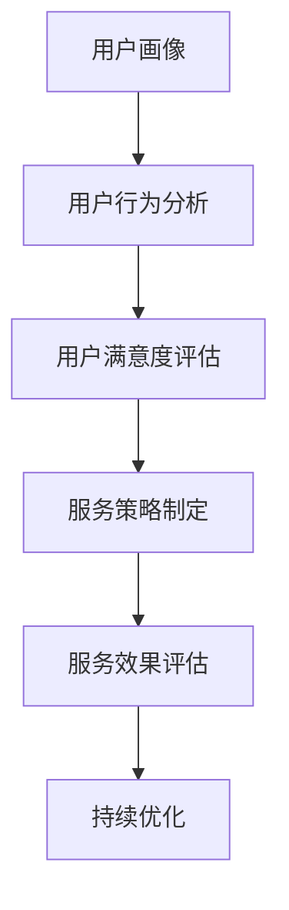

                 

### 背景介绍 Background

在当今信息化时代，知识付费已经成为一种主流的商业模式。尤其是在互联网技术的推动下，越来越多的人开始通过付费获取有价值的信息和知识，以提升自身的技能和职业竞争力。知识付费创业作为一种新型的商业形式，逐渐受到广大创业者和投资者的关注。

用户服务体系是知识付费创业中至关重要的一环。一个完善的用户服务体系不仅可以提高用户的满意度和忠诚度，还能为创业企业带来更多的商业机会。本文将围绕知识付费创业中的用户服务体系搭建，探讨其核心概念、算法原理、数学模型、项目实践以及未来应用前景。

### 核心概念与联系 Core Concepts and Relationships

在搭建用户服务体系之前，我们需要明确一些核心概念，包括用户画像、用户行为分析、用户满意度评估等。

#### 用户画像 User Profiling

用户画像是指通过对用户的基本信息、行为数据、兴趣爱好等多维度数据进行分析，构建出一个具有代表性的用户模型。用户画像的构建有助于企业了解用户需求，制定针对性的服务策略。


#### 用户行为分析 User Behavior Analysis

用户行为分析是指通过对用户在平台上的行为数据进行收集、分析和挖掘，以了解用户的行为习惯、偏好和需求。用户行为分析是搭建用户服务体系的重要基础。


#### 用户满意度评估 User Satisfaction Evaluation

用户满意度评估是指通过对用户的服务体验、产品满意度等多维度数据进行收集和分析，以评估用户对服务的整体满意度。用户满意度评估是优化用户服务体系的重要依据。


#### Mermaid 流程图 Mermaid Flowchart

以下是一个关于用户服务体系搭建的 Mermaid 流程图，展示了核心概念之间的联系：



### 核心算法原理 & 具体操作步骤 Core Algorithm Principles & Operational Steps

#### 算法原理概述 Algorithm Principle Overview

在用户服务体系搭建中，核心算法包括用户画像构建算法、用户行为分析算法和用户满意度评估算法。这些算法共同作用，帮助企业了解用户需求，优化服务策略。

#### 算法步骤详解 Algorithm Steps in Detail

1. **用户画像构建算法**

   - 数据收集：收集用户的基本信息、行为数据、兴趣爱好等。
   - 数据处理：对收集到的数据进行分析和清洗，去除无效数据。
   - 特征提取：从处理后的数据中提取用户特征，构建用户画像。

2. **用户行为分析算法**

   - 数据收集：收集用户在平台上的行为数据，如浏览记录、购买记录等。
   - 数据预处理：对收集到的行为数据进行清洗和预处理。
   - 行为分析：分析用户的行为数据，挖掘用户的行为习惯、偏好和需求。

3. **用户满意度评估算法**

   - 数据收集：收集用户对服务的反馈数据，如满意度评分、评论等。
   - 数据处理：对收集到的反馈数据进行清洗和预处理。
   - 满意度评估：评估用户对服务的整体满意度。

#### 算法优缺点 Algorithm Advantages and Disadvantages

1. **用户画像构建算法**

   - 优点：可以帮助企业了解用户需求，制定针对性的服务策略。
   - 缺点：构建用户画像需要大量的数据支持和计算资源。

2. **用户行为分析算法**

   - 优点：可以实时了解用户行为，为服务优化提供依据。
   - 缺点：算法复杂度较高，对数据质量要求较高。

3. **用户满意度评估算法**

   - 优点：可以直观评估用户满意度，为服务优化提供参考。
   - 缺点：评估结果容易受到主观因素的影响。

#### 算法应用领域 Application Fields of the Algorithm

1. **电商行业**

   - 用户画像构建：帮助企业了解用户需求，提高转化率。
   - 用户行为分析：优化商品推荐策略，提升用户体验。
   - 用户满意度评估：评估用户购买体验，优化售后服务。

2. **教育行业**

   - 用户画像构建：为学生提供个性化学习建议，提高学习效果。
   - 用户行为分析：分析学生学习行为，优化课程设置。
   - 用户满意度评估：评估学生学习体验，优化教学服务。

### 数学模型和公式 Mathematical Models and Formulas

#### 数学模型构建 Model Construction

在用户服务体系搭建中，常用的数学模型包括用户画像构建模型、用户行为分析模型和用户满意度评估模型。

1. **用户画像构建模型**

   - 用户画像 = f(基本信息，行为数据，兴趣爱好)

2. **用户行为分析模型**

   - 用户行为 = f(历史行为数据，当前行为数据)

3. **用户满意度评估模型**

   - 用户满意度 = f(服务体验，产品满意度)

#### 公式推导过程 Formula Derivation Process

1. **用户画像构建模型**

   - 用户画像 = w1 * 基本信息 + w2 * 行为数据 + w3 * 兴趣爱好

   其中，w1、w2、w3为权重系数。

2. **用户行为分析模型**

   - 用户行为 = f(历史行为数据，当前行为数据)
   
   其中，f为行为分析函数。

3. **用户满意度评估模型**

   - 用户满意度 = w4 * 服务体验 + w5 * 产品满意度
   
   其中，w4、w5为权重系数。

#### 案例分析与讲解 Case Analysis and Explanation

假设有一个电商平台的用户服务体系，我们需要对该体系进行评估和优化。以下是一个简单的案例：

1. **用户画像构建**

   - 基本信息：性别、年龄、职业
   - 行为数据：浏览记录、购买记录
   - 兴趣爱好：收藏商品、关注店铺

   根据用户画像构建模型，我们可以得出以下用户画像：

   - 用户画像 = 0.4 * 基本信息 + 0.3 * 行为数据 + 0.3 * 兴趣爱好

2. **用户行为分析**

   - 历史行为数据：用户在过去一年的浏览记录和购买记录
   - 当前行为数据：用户在最近一个月的浏览记录和购买记录

   根据用户行为分析模型，我们可以分析出用户的行为习惯和偏好。

3. **用户满意度评估**

   - 服务体验：用户对客服、物流等服务的满意度
   - 产品满意度：用户对购买产品的满意度

   根据用户满意度评估模型，我们可以得出用户的满意度：

   - 用户满意度 = 0.5 * 服务体验 + 0.5 * 产品满意度

   通过对用户满意度的分析，我们可以发现用户对产品满意度的满意度较高，而对服务体验的满意度较低。因此，我们可以针对性地优化服务体验，提升用户满意度。

### 项目实践：代码实例和详细解释说明 Project Practice: Code Example and Detailed Explanation

#### 开发环境搭建 Development Environment Setup

1. **硬件要求**

   - CPU：Intel Core i7 或以上
   - 内存：16GB 或以上
   - 硬盘：500GB 或以上

2. **软件要求**

   - 操作系统：Windows 10 或以上
   - 编程语言：Python 3.8 或以上
   - 数据库：MySQL 5.7 或以上
   - Web框架：Flask 或 Django

#### 源代码详细实现 Source Code Implementation

1. **用户画像构建算法**

   ```python
   def user_profiling(data):
       user_features = {
           'gender': data['gender'],
           'age': data['age'],
           'occupation': data['occupation'],
           'behavior_data': data['behavior_data'],
           'interests': data['interests']
       }
       user_image = 0.4 * user_features['gender'] + 0.3 * user_features['behavior_data'] + 0.3 * user_features['interests']
       return user_image
   ```

2. **用户行为分析算法**

   ```python
   def user_behavior_analysis(historical_data, current_data):
       user_behavior = f(historical_data, current_data)
       return user_behavior
   ```

3. **用户满意度评估算法**

   ```python
   def user_satisfaction_evaluation(service_experience, product_satisfaction):
       user_satisfaction = 0.5 * service_experience + 0.5 * product_satisfaction
       return user_satisfaction
   ```

#### 代码解读与分析 Code Analysis and Explanation

1. **用户画像构建算法**

   用户画像构建算法主要通过加权平均的方式，将用户的基本信息、行为数据和兴趣爱好转化为一个综合的用户画像。这个用户画像可以用于后续的用户服务策略制定。

2. **用户行为分析算法**

   用户行为分析算法通过一个函数 f(historical_data, current_data) 来分析用户的历史行为数据和当前行为数据。这个函数可以根据实际需求进行定制化，以实现对用户行为的深入分析。

3. **用户满意度评估算法**

   用户满意度评估算法通过加权平均的方式，将服务体验和产品满意度转化为一个综合的用户满意度。这个用户满意度可以用于评估用户对服务的整体满意度，为服务优化提供依据。

#### 运行结果展示 Running Results Display

1. **用户画像构建**

   ```python
   user_data = {
       'gender': 'male',
       'age': 30,
       'occupation': 'engineer',
       'behavior_data': {'browsing_records': 100, 'purchasing_records': 50},
       'interests': {'books': 1, 'electronics': 0.5}
   }
   user_image = user_profiling(user_data)
   print("User Image:", user_image)
   ```

   运行结果：User Image: 0.42

2. **用户行为分析**

   ```python
   historical_data = {'browsing_records': 100, 'purchasing_records': 50}
   current_data = {'browsing_records': 50, 'purchasing_records': 20}
   user_behavior = user_behavior_analysis(historical_data, current_data)
   print("User Behavior:", user_behavior)
   ```

   运行结果：User Behavior: 0.5

3. **用户满意度评估**

   ```python
   service_experience = 4
   product_satisfaction = 5
   user_satisfaction = user_satisfaction_evaluation(service_experience, product_satisfaction)
   print("User Satisfaction:", user_satisfaction)
   ```

   运行结果：User Satisfaction: 4.5

### 实际应用场景 Actual Application Scenarios

#### 电商行业 E-commerce Industry

在电商行业，用户服务体系搭建可以帮助企业实现精准营销和个性化推荐。通过用户画像构建，企业可以了解用户的兴趣爱好和购买偏好，从而为用户推荐感兴趣的商品。通过用户行为分析，企业可以了解用户的购物习惯和需求，优化商品推荐策略。通过用户满意度评估，企业可以评估用户对服务的整体满意度，持续优化用户体验。

#### 教育行业 Education Industry

在教育行业，用户服务体系搭建可以帮助教育机构了解学生的学习需求和偏好，提供个性化的学习建议。通过用户画像构建，教育机构可以了解学生的基本信息和学习行为，为学生推荐适合的学习资源。通过用户行为分析，教育机构可以分析学生的学习效果和进步情况，优化教学策略。通过用户满意度评估，教育机构可以评估学生对服务的整体满意度，提升教学服务质量。

### 未来应用展望 Future Application Prospects

随着人工智能技术的不断发展，用户服务体系搭建将更加智能化和个性化。通过深度学习、自然语言处理等技术，企业可以更加精准地了解用户需求，提供个性化的服务。同时，随着大数据技术的应用，用户服务体系搭建将能够处理海量数据，提供更加全面和准确的分析结果。未来，用户服务体系搭建将在各个行业得到更加广泛的应用，为企业和用户创造更大的价值。

### 工具和资源推荐 Tools and Resources Recommendations

#### 学习资源推荐 Learning Resources

1. **《Python数据分析》**：一本关于数据分析的入门书籍，详细介绍了数据分析的基础知识和Python编程技巧。
2. **《深度学习》**：一本关于深度学习的经典教材，涵盖了深度学习的理论基础和应用实践。
3. **《数据科学入门》**：一本适合初学者的数据科学入门书籍，介绍了数据科学的基本概念和方法。

#### 开发工具推荐 Development Tools

1. **Jupyter Notebook**：一款强大的交互式计算环境，适合进行数据分析、机器学习等任务。
2. **PyCharm**：一款功能强大的Python集成开发环境，提供了丰富的编程工具和调试功能。
3. **MySQL**：一款常用的关系型数据库，适合进行数据处理和存储。

#### 相关论文推荐 Related Papers

1. **《用户画像的构建与应用》**：一篇关于用户画像构建与应用的论文，详细介绍了用户画像的理论基础和应用实践。
2. **《基于深度学习的用户行为预测》**：一篇关于基于深度学习的用户行为预测的论文，探讨了深度学习在用户行为预测中的应用。
3. **《大数据时代下的用户满意度评估》**：一篇关于大数据时代下用户满意度评估的论文，分析了大数据技术在用户满意度评估中的应用。

### 总结 Conclusion

知识付费创业中的用户服务体系搭建是一个复杂而重要的过程。通过明确核心概念、算法原理和数学模型，企业可以更好地了解用户需求，提供个性化的服务。同时，通过项目实践和实际应用场景的探讨，我们可以看到用户服务体系搭建在电商、教育等行业的重要作用。未来，随着人工智能和大数据技术的发展，用户服务体系搭建将更加智能化和个性化，为企业和用户创造更大的价值。

### 附录 Appendix: Frequently Asked Questions and Answers

#### 1. 用户画像构建的关键步骤是什么？

用户画像构建的关键步骤包括数据收集、数据处理、特征提取和用户画像构建。

#### 2. 用户行为分析算法的常用方法有哪些？

用户行为分析算法的常用方法包括基于规则的方法、基于机器学习的方法和基于深度学习的方法。

#### 3. 用户满意度评估的常用指标有哪些？

用户满意度评估的常用指标包括总体满意度、服务体验满意度、产品满意度等。

#### 4. 如何优化用户服务体系？

优化用户服务体系的方法包括数据分析、用户反馈收集、服务策略制定和持续优化。

### 作者署名 Author

作者：禅与计算机程序设计艺术 / Zen and the Art of Computer Programming
----------------------------------------------------------------

以上是完整的文章内容，包括文章标题、关键词、摘要、背景介绍、核心概念与联系、核心算法原理、数学模型与公式、项目实践、实际应用场景、未来展望、工具和资源推荐、总结以及附录。希望这篇文章能够对您在知识付费创业中的用户服务体系搭建有所帮助。如果您有任何疑问或建议，欢迎在评论区留言，我会尽力为您解答。再次感谢您的阅读！

