                 

关键词：知识付费、用户权益、版权保护、安全策略、法律法规

> 摘要：在知识付费快速发展的今天，用户权益保护成为了一个不容忽视的问题。本文将深入探讨知识付费创业中的用户权益保护，包括版权保护、安全策略、法律法规等方面，并提出相应的解决方案。

## 1. 背景介绍

知识付费，顾名思义，是指用户为获取知识、技能或信息而支付一定费用的一种商业模式。随着互联网的普及和在线教育的兴起，知识付费市场迅速扩张，吸引了大量的创业者和资本投入。然而，知识付费市场的快速发展也带来了一系列问题，尤其是用户权益保护问题。

用户权益保护是知识付费创业过程中的一个核心问题。用户在知识付费平台上的权益主要包括：获取知识资源的权利、信息隐私保护、账户安全等。然而，由于市场不规范、平台监管不到位等原因，用户权益保护面临着诸多挑战。本文将针对这些问题进行分析，并提出解决方案。

### 1.1 知识付费市场现状

近年来，知识付费市场呈现出爆发式增长。根据《2020年中国知识付费行业研究报告》，2019年中国知识付费市场规模达到1300亿元，同比增长了50%以上。预计未来几年，知识付费市场仍将保持高速增长。

知识付费市场的主要参与者包括：

- **平台方**：如知乎、得到、喜马拉雅等。
- **内容方**：包括个人创作者、机构、企业等。
- **用户**：各类寻求知识、技能或信息的人。

### 1.2 用户权益保护的挑战

在知识付费市场中，用户权益保护面临以下挑战：

- **版权问题**：知识付费内容往往涉及版权问题，如何保护创作者的版权成为关键。
- **信息安全**：用户在平台上的信息隐私和安全问题。
- **服务质量**：平台方如何保证知识付费内容的质量和真实性。
- **法律法规**：知识付费市场的法律法规体系尚不完善。

## 2. 核心概念与联系

在探讨用户权益保护之前，我们需要了解一些核心概念，包括版权、信息安全、隐私保护等。

### 2.1 版权

版权是指创作者对其作品享有的专有权利，包括复制权、发行权、展示权、改编权等。在知识付费领域，版权保护尤为重要，因为知识付费内容的原创性往往受到挑战。

### 2.2 信息安全

信息安全是指保护信息免受未经授权的访问、使用、披露、破坏、修改、干扰等威胁。在知识付费市场中，用户的信息安全是平台方必须重视的问题。

### 2.3 隐私保护

隐私保护是指保护用户个人信息的安全和隐私。在知识付费平台，用户的信息包括账户信息、学习记录、行为数据等，这些信息对用户隐私构成了潜在威胁。

### 2.4 Mermaid 流程图

以下是一个简化的知识付费中的用户权益保护流程图：

```mermaid
graph TB
    A[用户购买知识产品] --> B{版权保护}
    A --> C{信息安全}
    A --> D{隐私保护}
    B --> E{版权声明}
    B --> F{版权监控}
    C --> G{数据加密}
    C --> H{访问控制}
    D --> I{隐私政策}
    D --> J{数据匿名化}
    E --> K{内容审核}
    F --> L{侵权处理}
    G --> M{安全审计}
    H --> N{权限管理}
    I --> O{用户知情权}
    J --> P{数据安全策略}
    K --> Q{内容质量保障}
    L --> R{法律追究}
    M --> S{安全培训}
    N --> T{用户参与}
    O --> U{用户反馈}
    P --> V{隐私合规性}
    Q --> W{用户满意度}
    R --> X{平台责任}
    S --> Y{风险评估}
    T --> Z{用户教育}
    U --> A
    V --> A
    W --> A
    X --> A
    Y --> A
    Z --> A
```



## 3. 核心算法原理 & 具体操作步骤

### 3.1 算法原理概述

用户权益保护的核心算法主要包括版权保护算法、信息安全算法和隐私保护算法。以下分别介绍这些算法的原理。

#### 3.1.1 版权保护算法

版权保护算法的核心是版权声明和版权监控。版权声明是指创作者在作品上明确标注版权信息，以防止未经授权的复制和使用。版权监控是指通过技术手段对网络上的侵权行为进行监测和取证。

#### 3.1.2 信息安全算法

信息安全算法主要包括数据加密、访问控制和安全审计。数据加密是指使用加密算法对用户数据进行加密，以防止未经授权的访问。访问控制是指通过身份验证和权限管理，确保只有授权用户才能访问特定数据。安全审计是指定期对平台的安全性进行审查和评估。

#### 3.1.3 隐私保护算法

隐私保护算法主要包括隐私政策和数据匿名化。隐私政策是指明确告知用户其个人信息的收集、使用和共享方式。数据匿名化是指通过对用户数据进行脱敏处理，使其无法被直接识别。

### 3.2 算法步骤详解

#### 3.2.1 版权保护算法

1. **版权声明**：创作者在作品发布前，需在平台上进行版权声明，明确标注版权信息。
2. **版权监控**：平台方使用技术手段对网络进行实时监控，发现侵权行为后进行取证和处理。

#### 3.2.2 信息安全算法

1. **数据加密**：在数据存储和传输过程中，使用加密算法对数据进行加密。
2. **访问控制**：通过身份验证和权限管理，确保只有授权用户才能访问特定数据。
3. **安全审计**：定期对平台的安全性进行审查和评估，发现安全隐患后及时进行修复。

#### 3.2.3 隐私保护算法

1. **隐私政策**：明确告知用户其个人信息的收集、使用和共享方式。
2. **数据匿名化**：对用户数据进行脱敏处理，使其无法被直接识别。

### 3.3 算法优缺点

#### 3.3.1 版权保护算法

**优点**：有效保护创作者的版权，防止未经授权的复制和使用。

**缺点**：监控成本高，侵权行为难以完全杜绝。

#### 3.3.2 信息安全算法

**优点**：保护用户数据安全，防止数据泄露和篡改。

**缺点**：加密和解密过程复杂，可能影响数据传输速度。

#### 3.3.3 隐私保护算法

**优点**：保护用户隐私，防止个人信息被滥用。

**缺点**：数据匿名化可能降低数据分析的价值。

### 3.4 算法应用领域

版权保护算法主要应用于知识产权领域，如音乐、电影、文学等；信息安全算法广泛应用于各类信息系统，如银行、电商、社交网络等；隐私保护算法在各类互联网应用中都有广泛应用，如搜索引擎、社交媒体、在线教育等。

## 4. 数学模型和公式 & 详细讲解 & 举例说明

### 4.1 数学模型构建

在用户权益保护中，我们可以构建一个综合性的数学模型，以评估和优化版权保护、信息安全、隐私保护的效果。

假设：

- **P**：版权保护水平
- **S**：信息安全水平
- **I**：隐私保护水平
- **C**：用户满意度

数学模型如下：

\[ C = f(P, S, I) \]

其中，\( f \) 是一个复杂的函数，表示用户满意度与版权保护水平、信息安全水平、隐私保护水平之间的关系。

### 4.2 公式推导过程

推导过程如下：

1. **版权保护水平** \( P \)：

   \( P \) 可以通过以下公式计算：

   \[ P = \frac{1}{N} \sum_{i=1}^{N} p_i \]

   其中，\( p_i \) 是第 \( i \) 次版权监控发现的侵权比例，\( N \) 是监控次数。

2. **信息安全水平** \( S \)：

   \( S \) 可以通过以下公式计算：

   \[ S = \frac{1}{M} \sum_{j=1}^{M} s_j \]

   其中，\( s_j \) 是第 \( j \) 次安全审计发现的安全漏洞数量，\( M \) 是审计次数。

3. **隐私保护水平** \( I \)：

   \( I \) 可以通过以下公式计算：

   \[ I = \frac{1}{L} \sum_{k=1}^{L} i_k \]

   其中，\( i_k \) 是第 \( k \) 次用户隐私投诉的比例，\( L \) 是投诉次数。

4. **用户满意度** \( C \)：

   \( C \) 可以通过以下公式计算：

   \[ C = \alpha P + \beta S + \gamma I \]

   其中，\( \alpha, \beta, \gamma \) 是权重系数，表示版权保护水平、信息安全水平、隐私保护水平对用户满意度的相对重要性。

### 4.3 案例分析与讲解

以一个在线教育平台为例，分析其版权保护、信息安全、隐私保护水平对用户满意度的影响。

假设：

- 版权保护水平 \( P = 0.9 \)
- 信息安全水平 \( S = 0.8 \)
- 隐私保护水平 \( I = 0.85 \)
- 用户满意度 \( C = 0.95 \)

权重系数 \( \alpha = 0.4, \beta = 0.3, \gamma = 0.3 \)。

根据公式 \( C = \alpha P + \beta S + \gamma I \)，计算用户满意度：

\[ C = 0.4 \times 0.9 + 0.3 \times 0.8 + 0.3 \times 0.85 = 0.96 \]

结果表明，该在线教育平台的用户满意度较高，版权保护、信息安全、隐私保护水平对用户满意度的贡献较大。

## 5. 项目实践：代码实例和详细解释说明

### 5.1 开发环境搭建

在开始编写代码之前，我们需要搭建一个适合用户权益保护项目的开发环境。以下是一个简单的开发环境搭建步骤：

1. 安装Python 3.8及以上版本。
2. 安装必要的Python库，如requests、beautifulsoup4、scrapy等。
3. 搭建一个虚拟环境，以便隔离项目依赖。

### 5.2 源代码详细实现

以下是一个简单的用户权益保护项目的代码实例，包括版权保护、信息安全、隐私保护等方面。

```python
import requests
from bs4 import BeautifulSoup
from cryptography.fernet import Fernet

# 5.2.1 版权保护
def check_copyright(content):
    # 假设存在一个API用于检测版权
    response = requests.post('https://api.copyright-checker.com/check', data={'content': content})
    if response.status_code == 200:
        result = response.json()
        if result['is_infringement']:
            return '侵权'
        else:
            return '未侵权'
    else:
        return '检测失败'

# 5.2.2 信息安全
def encrypt_data(data, key):
    f = Fernet(key)
    encrypted_data = f.encrypt(data.encode())
    return encrypted_data

def decrypt_data(data, key):
    f = Fernet(key)
    decrypted_data = f.decrypt(data).decode()
    return decrypted_data

# 5.2.3 隐私保护
def anonymize_data(data):
    # 假设使用一种简单的匿名化算法
    return data.replace('真实值', '匿名值')

# 5.2.4 完整的用户权益保护函数
def user_equity_protection(content, user_data):
    # 版权保护
    copyright_status = check_copyright(content)
    if copyright_status == '侵权':
        return '版权保护失败'

    # 信息安全
    encrypted_user_data = encrypt_data(user_data, b'my_secret_key')
    decrypted_user_data = decrypt_data(encrypted_user_data, b'my_secret_key')

    # 隐私保护
    anonymized_user_data = anonymize_data(user_data)

    return '用户权益保护成功'

# 测试代码
content = "这是一篇关于知识付费的文章。"
user_data = {"name": "张三", "age": 30}
key = Fernet.generate_key()

print(user_equity_protection(content, user_data))
```

### 5.3 代码解读与分析

1. **版权保护**：使用一个假设的API进行版权检测，实际应用中可以替换为具体的版权检测服务。
2. **信息安全**：使用加密算法对用户数据进行加密和解密，确保数据在传输和存储过程中的安全性。
3. **隐私保护**：对用户数据进行匿名化处理，隐藏敏感信息。

### 5.4 运行结果展示

运行上述代码，输出结果为“用户权益保护成功”，表示用户权益保护过程成功完成。

## 6. 实际应用场景

用户权益保护在知识付费市场中具有广泛的应用场景。以下是一些典型的应用场景：

### 6.1 在线教育

在线教育平台需要保护用户的学习资料和隐私，确保用户数据的安全和版权保护。

### 6.2 在线咨询

在线咨询服务需要确保用户的信息安全和隐私保护，同时防止咨询内容的侵权。

### 6.3 专业技能培训

专业技能培训平台需要保护用户的培训资料和成果，同时确保用户的学习过程和成果的版权保护。

### 6.4 法律法规咨询

法律法规咨询服务需要保护用户的咨询内容和隐私，确保咨询过程的保密性和安全性。

## 7. 未来应用展望

随着知识付费市场的不断发展，用户权益保护将面临新的挑战和机遇。以下是一些未来应用展望：

### 7.1 版权保护技术升级

随着技术的发展，版权保护技术将更加成熟，如区块链技术、人工智能等，将为版权保护提供更有效的方法。

### 7.2 信息安全体系完善

随着信息安全意识的提高，知识付费平台将进一步完善信息安全体系，确保用户数据的安全。

### 7.3 隐私保护法规健全

隐私保护法规将不断完善，为知识付费平台提供明确的法律依据，确保用户隐私得到有效保护。

## 8. 工具和资源推荐

### 8.1 学习资源推荐

- 《隐私计算：理论与实践》
- 《网络安全：设计与实现》
- 《版权法律实务》

### 8.2 开发工具推荐

- Python：用于编写用户权益保护相关的脚本和应用程序。
- Git：用于版本控制和代码管理。

### 8.3 相关论文推荐

- 《基于区块链的版权保护研究》
- 《隐私计算在知识付费中的应用》
- 《人工智能在版权保护中的应用》

## 9. 总结：未来发展趋势与挑战

### 9.1 研究成果总结

本文系统地探讨了知识付费创业中的用户权益保护问题，包括版权保护、信息安全、隐私保护等方面，提出了相应的解决方案。

### 9.2 未来发展趋势

未来，用户权益保护将在知识付费市场中发挥更加重要的作用，随着技术的发展和法规的完善，用户权益保护将得到进一步提升。

### 9.3 面临的挑战

用户权益保护在知识付费市场中仍面临诸多挑战，如技术难题、法规不完善等。需要各方共同努力，不断完善用户权益保护体系。

### 9.4 研究展望

未来，用户权益保护研究将朝着更加智能化、自动化、规范化的方向发展，为知识付费市场的健康发展提供有力支持。

## 10. 附录：常见问题与解答

### 10.1 版权保护相关问题

**Q：如何进行版权保护？**

**A：版权保护主要包括版权声明、版权监控和侵权处理。创作者需在作品发布前进行版权声明，平台方需使用技术手段进行版权监控，发现侵权行为后及时处理。**

### 10.2 信息安全相关问题

**Q：如何保障信息安全？**

**A：保障信息安全主要包括数据加密、访问控制和安全审计。平台方需使用加密算法对用户数据进行加密，通过身份验证和权限管理控制用户访问权限，定期进行安全审计。**

### 10.3 隐私保护相关问题

**Q：如何保护用户隐私？**

**A：保护用户隐私主要包括隐私政策和数据匿名化。平台方需制定明确的隐私政策，告知用户其个人信息的使用方式，对用户数据进行脱敏处理，确保数据匿名化。**

作者：禅与计算机程序设计艺术 / Zen and the Art of Computer Programming
----------------------------------------------------------------


