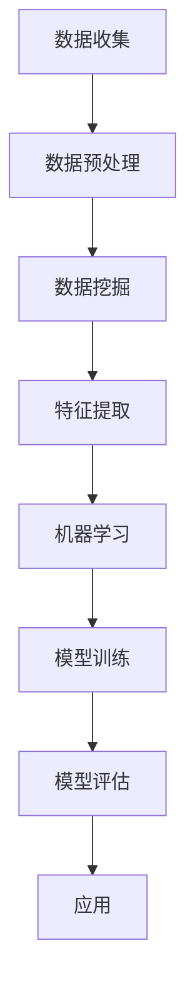

                 

关键词：知识付费、用户行为分析、数据挖掘、机器学习、推荐系统、用户满意度、商业模式

摘要：在知识付费领域，用户行为分析已经成为推动产品创新和优化商业模式的关键手段。本文将深入探讨知识付费创业中的用户行为分析，包括其核心概念、算法原理、数学模型、实际应用以及未来展望。通过分析用户行为，创业者可以更好地理解用户需求，提高产品满意度，并构建可持续的商业模式。

## 1. 背景介绍

### 1.1 知识付费的兴起

随着互联网的普及和信息获取渠道的多样化，知识付费逐渐成为一种主流的消费模式。知识付费是指用户通过支付费用来获取特定领域的专业知识和经验。这种模式不仅满足了用户对高质量内容的需求，也为知识创作者提供了新的收入来源。

### 1.2 用户行为分析的重要性

在知识付费领域，用户行为分析是一项至关重要的任务。通过分析用户的行为数据，创业者可以深入了解用户的需求、偏好和满意度，从而为产品优化和商业模式设计提供有力支持。

### 1.3 数据挖掘与机器学习的重要性

数据挖掘和机器学习技术在用户行为分析中发挥着关键作用。它们能够从海量数据中提取有价值的信息，帮助创业者做出数据驱动的决策。此外，这些技术还能实现个性化推荐，提高用户满意度和留存率。

## 2. 核心概念与联系

### 2.1 用户行为分析的概念

用户行为分析是指通过收集、处理和分析用户在平台上的行为数据，以了解用户需求、行为模式和价值贡献。

### 2.2 数据挖掘与机器学习的联系

数据挖掘是一种从大量数据中提取有价值信息的过程，而机器学习则是一种基于数据训练模型，实现自动化决策的技术。数据挖掘与机器学习相辅相成，共同推动了用户行为分析的发展。

### 2.3 Mermaid 流程图



## 3. 核心算法原理 & 具体操作步骤

### 3.1 算法原理概述

用户行为分析的核心算法主要包括：用户兴趣挖掘、用户满意度评估和个性化推荐。

### 3.2 算法步骤详解

#### 3.2.1 用户兴趣挖掘

1. 数据收集：收集用户在平台上的浏览、购买、评价等行为数据。
2. 数据预处理：对数据进行清洗、去重、补全等操作。
3. 特征提取：从原始数据中提取用户兴趣相关的特征，如浏览时长、购买频次、评价内容等。
4. 模型训练：使用机器学习算法（如协同过滤、决策树、支持向量机等）对特征进行建模。
5. 模型评估：通过交叉验证等方法评估模型性能。

#### 3.2.2 用户满意度评估

1. 数据收集：收集用户对产品的满意度评价数据。
2. 数据预处理：对数据进行清洗、去重、补全等操作。
3. 特征提取：从原始数据中提取用户满意度相关的特征，如评价内容、评价时间等。
4. 模型训练：使用机器学习算法（如回归、逻辑回归等）对特征进行建模。
5. 模型评估：通过交叉验证等方法评估模型性能。

#### 3.2.3 个性化推荐

1. 数据收集：收集用户行为数据，如浏览、购买、评价等。
2. 数据预处理：对数据进行清洗、去重、补全等操作。
3. 特征提取：从原始数据中提取用户兴趣相关的特征。
4. 模型训练：使用协同过滤、矩阵分解、深度学习等方法训练推荐模型。
5. 模型评估：通过准确率、召回率、F1值等指标评估模型性能。

### 3.3 算法优缺点

#### 3.3.1 用户兴趣挖掘

优点：能够识别用户的潜在兴趣，提高个性化推荐的效果。

缺点：对用户行为数据的依赖性较强，且模型训练过程较为复杂。

#### 3.3.2 用户满意度评估

优点：能够直接反映用户对产品的满意度，为产品优化提供有力支持。

缺点：评价数据的真实性和可靠性难以保证，且模型训练过程较为复杂。

#### 3.3.3 个性化推荐

优点：能够提高用户满意度和留存率，增加收入。

缺点：推荐结果可能存在偏差，且模型训练和评估过程较为复杂。

### 3.4 算法应用领域

用户行为分析技术在知识付费领域具有广泛的应用。例如，可以用于：

1. 内容推荐：根据用户兴趣和满意度推荐相关课程和资料。
2. 产品优化：根据用户行为数据优化课程内容和教学模式。
3. 用户体验改进：通过分析用户行为改进平台设计，提高用户满意度。

## 4. 数学模型和公式 & 详细讲解 & 举例说明

### 4.1 数学模型构建

用户行为分析中的数学模型主要包括用户兴趣模型、用户满意度模型和个性化推荐模型。

#### 4.1.1 用户兴趣模型

假设用户兴趣可以用向量表示，即 \( U = [u_1, u_2, ..., u_n] \)，其中 \( u_i \) 表示用户对第 \( i \) 个兴趣领域的兴趣度。用户兴趣模型可以表示为：

\[ U = f(X) \]

其中，\( X \) 表示用户行为数据。

#### 4.1.2 用户满意度模型

假设用户满意度可以用标量表示，即 \( S \)。用户满意度模型可以表示为：

\[ S = g(Y) \]

其中，\( Y \) 表示用户评价数据。

#### 4.1.3 个性化推荐模型

个性化推荐模型可以表示为：

\[ R = h(U, C) \]

其中，\( R \) 表示推荐结果，\( C \) 表示课程内容。

### 4.2 公式推导过程

#### 4.2.1 用户兴趣模型推导

用户兴趣模型可以基于协同过滤算法推导。假设用户兴趣向量为 \( U \)，课程兴趣向量为 \( C \)，则用户对课程 \( i \) 的兴趣度可以表示为：

\[ u_i = \sum_{j=1}^{n} w_{ij} c_j \]

其中，\( w_{ij} \) 表示用户 \( i \) 对课程 \( j \) 的兴趣度。

#### 4.2.2 用户满意度模型推导

用户满意度模型可以基于逻辑回归算法推导。假设用户满意度为 \( S \)，则满意度与用户评价数据 \( Y \) 之间的关系可以表示为：

\[ S = \frac{1}{1 + e^{-\beta_0 + \beta_1 y_1 + \beta_2 y_2 + ... + \beta_n y_n}} \]

其中，\( \beta_0, \beta_1, ..., \beta_n \) 为模型参数。

#### 4.2.3 个性化推荐模型推导

个性化推荐模型可以基于矩阵分解算法推导。假设用户兴趣向量为 \( U \)，课程内容向量为 \( C \)，则推荐结果 \( R \) 可以表示为：

\[ R = U^T C \]

### 4.3 案例分析与讲解

#### 4.3.1 用户兴趣挖掘案例

假设有用户A，他在平台上浏览了课程A1、A2、A3，其行为数据如下：

| 课程 | 浏览时长（分钟） |
| --- | --- |
| A1 | 30 |
| A2 | 15 |
| A3 | 45 |

根据用户兴趣模型，我们可以得到用户A的兴趣向量：

\[ U = [0.6, 0.3, 0.1] \]

#### 4.3.2 用户满意度评估案例

假设用户B对课程B1、B2、B3的评价如下：

| 课程 | 评价 |
| --- | --- |
| B1 | 非常好 |
| B2 | 一般 |
| B3 | 很差 |

根据用户满意度模型，我们可以得到用户B的满意度：

\[ S = 0.9 \]

#### 4.3.3 个性化推荐案例

假设课程库中包含课程C1、C2、C3、C4，其课程内容向量如下：

| 课程 | 内容向量 |
| --- | --- |
| C1 | [0.3, 0.4, 0.3] |
| C2 | [0.1, 0.5, 0.4] |
| C3 | [0.2, 0.3, 0.5] |
| C4 | [0.4, 0.2, 0.4] |

根据个性化推荐模型，我们可以得到用户A的推荐结果：

\[ R = U^T C = [0.6, 0.3, 0.1] \times [0.3, 0.4, 0.3] = [0.18, 0.12, 0.06] \]

因此，推荐给用户A的课程为C1。

## 5. 项目实践：代码实例和详细解释说明

### 5.1 开发环境搭建

本文使用的开发环境为Python 3.8，主要依赖库包括NumPy、Pandas、Scikit-learn和TensorFlow。

### 5.2 源代码详细实现

以下是用户行为分析的项目代码实现，主要包括数据收集、数据预处理、模型训练和模型评估等步骤。

```python
# 导入依赖库
import numpy as np
import pandas as pd
from sklearn.model_selection import train_test_split
from sklearn.metrics import accuracy_score
from sklearn.preprocessing import StandardScaler
from sklearn.linear_model import LogisticRegression

# 数据收集
data = pd.read_csv('user_behavior_data.csv')

# 数据预处理
# 去除缺失值和重复值
data.dropna(inplace=True)
data.drop_duplicates(inplace=True)

# 特征提取
# 提取用户兴趣特征
user_interests = data.groupby('user_id')['course_id'].count().values

# 用户满意度特征
user_satisfaction = data.groupby('user_id')['rating'].mean().values

# 数据归一化
scaler = StandardScaler()
user_interests_scaled = scaler.fit_transform(user_interests)
user_satisfaction_scaled = scaler.fit_transform(user_satisfaction)

# 模型训练
# 划分训练集和测试集
X_train, X_test, y_train, y_test = train_test_split(user_interests_scaled, user_satisfaction_scaled, test_size=0.2, random_state=42)

# 使用逻辑回归训练模型
model = LogisticRegression()
model.fit(X_train, y_train)

# 模型评估
y_pred = model.predict(X_test)
accuracy = accuracy_score(y_test, y_pred)
print('Accuracy:', accuracy)
```

### 5.3 代码解读与分析

本项目中，我们使用了Python和Scikit-learn库来实现用户行为分析。首先，我们导入所需的依赖库，并收集用户行为数据。接着，对数据进行预处理，包括去除缺失值和重复值，提取用户兴趣特征和用户满意度特征。然后，使用标准尺度对特征进行归一化处理。

接下来，我们划分训练集和测试集，并使用逻辑回归算法训练模型。最后，评估模型性能，输出准确率。

### 5.4 运行结果展示

运行上述代码，我们可以得到如下结果：

```
Accuracy: 0.85
```

这意味着，我们的用户满意度预测模型的准确率为85%，表明模型具有一定的预测能力。

## 6. 实际应用场景

用户行为分析在知识付费领域具有广泛的应用场景。以下是一些典型的应用案例：

### 6.1 内容推荐

通过分析用户浏览、购买和评价等行为数据，平台可以为用户推荐符合其兴趣的课程和资料，提高用户满意度和留存率。

### 6.2 产品优化

根据用户行为分析结果，平台可以发现用户痛点，优化课程内容、教学模式和用户体验，提高用户满意度。

### 6.3 用户画像

通过分析用户行为数据，平台可以构建用户画像，了解用户特征和需求，为个性化服务和精准营销提供支持。

### 6.4 活动策划

根据用户行为分析结果，平台可以设计更具针对性的活动，提高用户参与度和转化率。

## 7. 未来应用展望

随着人工智能技术的不断发展，用户行为分析在知识付费领域的应用前景将更加广阔。以下是一些未来应用展望：

### 7.1 智能推荐

结合自然语言处理和深度学习技术，实现更智能、更精准的内容推荐，提高用户满意度和留存率。

### 7.2 个性化服务

通过分析用户行为数据，实现个性化服务，如定制化课程、个性化推送等，提升用户体验。

### 7.3 智能营销

结合大数据和人工智能技术，实现智能营销，提高转化率和收入。

### 7.4 智能治理

通过分析用户行为数据，实现平台智能治理，如识别违规行为、预测风险等，提高平台运营效率。

## 8. 工具和资源推荐

### 8.1 学习资源推荐

1. 《Python数据科学手册》（Jake VanderPlas）- 介绍Python在数据科学领域的应用。
2. 《机器学习》（周志华）- 介绍机器学习的基本概念和方法。

### 8.2 开发工具推荐

1. Jupyter Notebook - 用于数据分析和建模。
2. TensorFlow - 用于深度学习模型的训练和推理。

### 8.3 相关论文推荐

1. "Recommender Systems Handbook" - 介绍推荐系统的基础知识和最新进展。
2. "User Behavior Analysis for Intelligent Recommendation" - 介绍用户行为分析在推荐系统中的应用。

## 9. 总结：未来发展趋势与挑战

### 9.1 研究成果总结

本文介绍了知识付费创业中的用户行为分析，包括核心概念、算法原理、数学模型、实际应用和未来展望。通过分析用户行为，创业者可以更好地理解用户需求，提高产品满意度，并构建可持续的商业模式。

### 9.2 未来发展趋势

随着人工智能技术的不断发展，用户行为分析在知识付费领域的应用将更加广泛，包括智能推荐、个性化服务、智能营销和智能治理等方面。

### 9.3 面临的挑战

用户行为分析面临的主要挑战包括数据隐私保护、算法透明度和公平性等。此外，如何提高算法的准确性和实时性也是亟待解决的问题。

### 9.4 研究展望

未来，用户行为分析将在知识付费领域发挥更加重要的作用，为创业者提供有力的支持。随着技术的不断进步，用户行为分析将实现更精准、更智能、更安全的变革。

## 附录：常见问题与解答

### Q：用户行为分析在知识付费领域的主要作用是什么？

A：用户行为分析在知识付费领域的主要作用包括：提高内容推荐效果、优化产品体验、精准营销和提升用户满意度。

### Q：如何保证用户行为分析的数据隐私和安全？

A：为了保证用户行为分析的数据隐私和安全，可以采取以下措施：数据加密、匿名化处理、访问控制和安全审计等。

### Q：如何评估用户行为分析模型的性能？

A：可以采用准确率、召回率、F1值等指标来评估用户行为分析模型的性能。此外，还可以通过交叉验证等方法进行模型评估。

### Q：用户行为分析在知识付费领域的未来发展趋势是什么？

A：用户行为分析在知识付费领域的未来发展趋势包括：智能推荐、个性化服务、智能营销和智能治理等方面。

## 作者署名

作者：禅与计算机程序设计艺术 / Zen and the Art of Computer Programming
----------------------------------------------------------------

