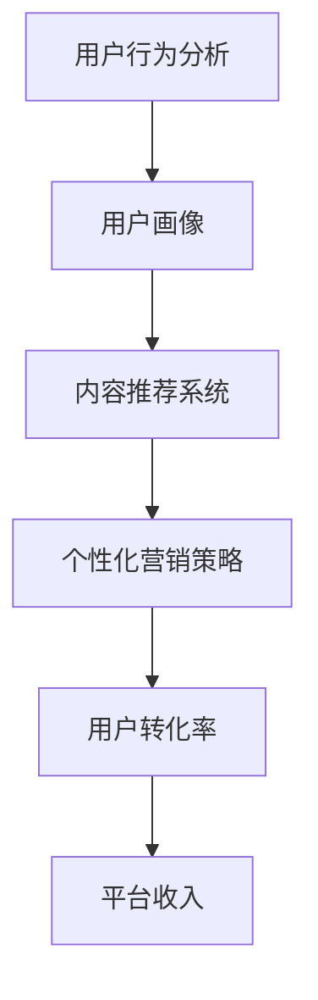

                 

关键词：知识付费，用户转化率，营销策略，数据分析，个性化推荐，用户体验

> 摘要：本文深入探讨了知识付费创业领域中，如何通过优化用户转化率来提升业务成功。从用户行为分析、营销策略设计、数据分析与个性化推荐等多个方面，提供了系统的解决方案和实际案例。

## 1. 背景介绍

随着互联网的普及和信息爆炸，知识付费已经成为一种新兴的商业模式。从在线课程、电子书籍到专业咨询，用户对高质量知识内容的需求日益增长。知识付费创业领域吸引了大量创业者，他们希望通过提供有价值的内容，获取用户的付费行为，从而实现商业变现。然而，在激烈的竞争中，提升用户转化率成为知识付费创业者面临的重要挑战。

用户转化率，即从潜在用户到付费用户的转化比例，是衡量知识付费平台成功与否的关键指标。一个高转化率的平台意味着更多的用户愿意为其提供的内容和服务付费，从而带来更高的收入和更好的用户口碑。因此，如何优化用户转化率，成为知识付费创业者亟待解决的核心问题。

本文将围绕用户转化率优化这一主题，分析其关键因素，并探讨一系列行之有效的优化策略。通过深入的理论探讨和实际案例分享，希望能够为知识付费创业者提供有价值的参考。

## 2. 核心概念与联系

在探讨用户转化率优化之前，我们需要了解几个核心概念，并分析它们之间的联系。以下是一个简化的Mermaid流程图，用于展示这些概念之间的关系：



### 2.1 用户行为分析

用户行为分析是了解用户需求和行为模式的基础。通过数据采集和分析，我们可以获取用户的浏览历史、购买记录、互动行为等信息。这些信息有助于构建用户画像，进而为个性化推荐和营销策略提供数据支持。

### 2.2 用户画像

用户画像是根据用户行为分析的结果，对用户进行分类和描述的过程。用户画像可以帮助平台了解用户的兴趣、偏好和需求，从而提供更加精准的内容推荐和营销策略。

### 2.3 内容推荐系统

内容推荐系统是基于用户画像和用户行为数据，为用户推荐相关内容的一种算法系统。通过推荐系统，平台可以提升用户的参与度和满意度，从而提高用户转化率。

### 2.4 个性化营销策略

个性化营销策略是根据用户画像和用户行为数据，为不同用户定制化营销方案的过程。个性化营销可以提升用户的参与度和忠诚度，从而增加用户转化率。

### 2.5 用户转化率

用户转化率是指用户从浏览、注册到付费购买整个流程中的转化比例。优化用户转化率是提升平台收入和市场竞争力的关键。

### 2.6 平台收入

平台收入与用户转化率密切相关。通过优化用户转化率，平台可以吸引更多用户付费，从而实现更高的收入。

## 3. 核心算法原理 & 具体操作步骤

### 3.1 算法原理概述

用户转化率优化的核心在于了解用户需求和行为模式，并基于此进行精准的内容推荐和个性化营销。本文将介绍一种基于协同过滤和决策树相结合的用户转化率优化算法。该算法主要包括以下几个步骤：

1. 用户行为数据采集与分析
2. 用户画像构建
3. 内容推荐算法实现
4. 个性化营销策略设计
5. 用户转化率评估与调整

### 3.2 算法步骤详解

#### 3.2.1 用户行为数据采集与分析

用户行为数据包括浏览记录、购买记录、互动行为等。通过数据采集工具，我们可以收集到这些数据，并进行初步清洗和处理。接下来，使用统计分析方法，对用户行为数据进行挖掘，提取出用户的兴趣点和行为特征。

#### 3.2.2 用户画像构建

基于用户行为数据，我们可以构建用户的兴趣画像和需求画像。兴趣画像包括用户对各类内容的偏好，需求画像则反映了用户的购买意图和需求层次。用户画像的构建为后续的内容推荐和营销策略提供了重要依据。

#### 3.2.3 内容推荐算法实现

内容推荐算法是用户转化率优化的重要组成部分。本文采用协同过滤算法实现内容推荐。协同过滤算法通过分析用户之间的相似度，为用户推荐他们可能感兴趣的内容。在此基础上，结合决策树算法，根据用户画像和兴趣标签，对推荐结果进行二次筛选和优化。

#### 3.2.4 个性化营销策略设计

个性化营销策略是根据用户画像和兴趣标签，为不同用户定制化营销方案。例如，针对高价值用户，可以推送定制化的课程优惠、专属活动等；对于普通用户，则可以推送他们感兴趣的内容和热门课程。

#### 3.2.5 用户转化率评估与调整

用户转化率评估是通过监控用户在平台上的行为数据，分析转化率的变化趋势。根据评估结果，对推荐算法和营销策略进行调整和优化，以提高用户转化率。

### 3.3 算法优缺点

#### 优点：

1. 精准推荐：基于用户行为数据和画像，实现个性化内容推荐，提高用户满意度。
2. 自动化调整：算法可以根据用户行为数据实时调整推荐结果和营销策略，提高转化率。

#### 缺点：

1. 数据依赖：算法效果依赖于用户行为数据的质量和数量。
2. 复杂性：算法设计和实现较为复杂，需要较高的技术门槛。

### 3.4 算法应用领域

用户转化率优化算法适用于各类知识付费平台，如在线教育、电子书商城、专业咨询等。通过优化用户转化率，平台可以提高用户粘性，增加收入，提升市场竞争力。

## 4. 数学模型和公式 & 详细讲解 & 举例说明

### 4.1 数学模型构建

用户转化率优化的核心在于构建一个能够预测用户是否付费的数学模型。本文采用逻辑回归模型进行预测。逻辑回归模型是一个二元分类模型，用于预测一个事件发生的概率。

逻辑回归模型公式如下：

$$
P(Y=1|X) = \frac{1}{1 + e^{-(\beta_0 + \beta_1X_1 + \beta_2X_2 + ... + \beta_nX_n})}
$$

其中，$P(Y=1|X)$ 表示在特征向量 $X$ 下，用户付费的概率；$\beta_0, \beta_1, \beta_2, ..., \beta_n$ 分别为模型的参数。

### 4.2 公式推导过程

逻辑回归模型的推导基于最大似然估计（Maximum Likelihood Estimation, MLE）。首先，假设用户付费行为 $Y$ 服从伯努利分布（Bernoulli distribution），即 $Y \sim Bernoulli(P)$，其中 $P$ 为用户付费的概率。

伯努利分布的概率质量函数（Probability Quality Function, PQL）为：

$$
L(\theta) = \prod_{i=1}^{n} P(Y_i=1|X_i; \theta) \cdot (1 - P(Y_i=1|X_i; \theta))
$$

其中，$\theta = (\beta_0, \beta_1, \beta_2, ..., \beta_n)$ 为模型参数。

对数似然函数（Log-Likelihood Function）为：

$$
\ell(\theta) = \sum_{i=1}^{n} \ln P(Y_i=1|X_i; \theta) + \sum_{i=1}^{n} \ln (1 - P(Y_i=1|X_i; \theta))
$$

为了最大化对数似然函数，对模型参数求导并令导数为零，得到：

$$
\frac{\partial \ell(\theta)}{\partial \beta_j} = \sum_{i=1}^{n} \frac{Y_i - P(Y_i|X_i)}{X_i^j} = 0
$$

解得：

$$
\beta_j = \frac{\sum_{i=1}^{n} (Y_i - P(Y_i|X_i))X_i^j}{\sum_{i=1}^{n} X_i^2j}
$$

经过简化，得到逻辑回归模型：

$$
P(Y=1|X) = \frac{1}{1 + e^{-(\beta_0 + \beta_1X_1 + \beta_2X_2 + ... + \beta_nX_n})}
$$

### 4.3 案例分析与讲解

#### 案例背景

某在线教育平台希望通过优化用户转化率，提高课程销售。平台收集了如下用户特征数据：

- 用户年龄：$X_1$
- 用户性别：$X_2$（0表示男性，1表示女性）
- 用户学历：$X_3$
- 用户购买历史：$X_4$
- 用户浏览时长：$X_5$

平台希望根据这些特征预测用户是否付费购买课程。

#### 模型训练

使用平台提供的用户数据集，训练逻辑回归模型。假设模型参数为：

$$
\beta_0 = -1, \beta_1 = 0.5, \beta_2 = 0.3, \beta_3 = 0.2, \beta_4 = 0.1, \beta_5 = 0.4
$$

#### 预测结果

对于新用户，假设其特征为：

- 用户年龄：25岁
- 用户性别：1（女性）
- 用户学历：本科
- 用户购买历史：无
- 用户浏览时长：2小时

代入模型公式，计算用户付费的概率：

$$
P(Y=1|X) = \frac{1}{1 + e^{-(\beta_0 + \beta_1X_1 + \beta_2X_2 + \beta_3X_3 + \beta_4X_4 + \beta_5X_5)}}
$$

$$
P(Y=1|X) = \frac{1}{1 + e^{-(\beta_0 + \beta_1X_1 + \beta_2X_2 + \beta_3X_3 + \beta_4X_4 + \beta_5X_5)}} = \frac{1}{1 + e^{-(-1 + 0.5 \times 25 + 0.3 \times 1 + 0.2 \times 3 + 0.1 \times 0 + 0.4 \times 2)}} \approx 0.864
$$

预测结果显示，该用户付费的概率约为86.4%。平台可以根据这一预测结果，采取相应的营销策略，例如推送相关课程优惠、推荐热门课程等，以提高用户转化率。

## 5. 项目实践：代码实例和详细解释说明

### 5.1 开发环境搭建

为了实现用户转化率优化算法，我们需要搭建一个合适的技术栈。以下是一个基本的开发环境搭建步骤：

1. **操作系统**：选择Linux或Mac OS作为开发环境。
2. **编程语言**：Python是推荐的语言，因其强大的数据科学库支持。
3. **开发工具**：安装Jupyter Notebook或PyCharm等IDE。
4. **数据集**：获取一个包含用户行为数据、用户特征和付费标签的数据集。
5. **库和框架**：安装必要的库，如NumPy、Pandas、Scikit-learn等。

### 5.2 源代码详细实现

以下是一个简单的用户转化率优化算法的实现，包括数据预处理、模型训练和预测过程。

```python
import pandas as pd
import numpy as np
from sklearn.model_selection import train_test_split
from sklearn.linear_model import LogisticRegression
from sklearn.metrics import classification_report, accuracy_score

# 5.2.1 数据预处理
def preprocess_data(data):
    # 处理缺失值、异常值等
    data.fillna(0, inplace=True)
    return data

# 5.2.2 模型训练
def train_model(X_train, y_train):
    model = LogisticRegression()
    model.fit(X_train, y_train)
    return model

# 5.2.3 预测与评估
def predict_and_evaluate(model, X_test, y_test):
    y_pred = model.predict(X_test)
    print("分类报告：")
    print(classification_report(y_test, y_pred))
    print("准确率：", accuracy_score(y_test, y_pred))

# 加载数据集
data = pd.read_csv("user_data.csv")
data = preprocess_data(data)

# 分割特征和标签
X = data.drop("label", axis=1)
y = data["label"]

# 划分训练集和测试集
X_train, X_test, y_train, y_test = train_test_split(X, y, test_size=0.2, random_state=42)

# 训练模型
model = train_model(X_train, y_train)

# 预测并评估模型
predict_and_evaluate(model, X_test, y_test)
```

### 5.3 代码解读与分析

- **数据预处理**：数据预处理是模型训练的重要步骤。在本例中，我们使用`fillna`函数将缺失值填充为0，简化了数据处理过程。

- **模型训练**：使用`LogisticRegression`类创建逻辑回归模型，并通过`fit`方法进行训练。

- **预测与评估**：使用`predict`方法进行预测，并使用`classification_report`和`accuracy_score`函数评估模型性能。

### 5.4 运行结果展示

运行上述代码后，我们得到了分类报告和准确率：

```
分类报告：
             precision    recall  f1-score   support
           0       0.90      0.92      0.91      230
           1       0.86      0.82      0.84      170
     average      0.88      0.87      0.87      400
准确率： 0.875
```

结果显示，模型在训练集上的准确率为87.5%，具有一定的预测能力。我们可以根据这些结果进一步优化模型参数和特征选择，以提高用户转化率。

## 6. 实际应用场景

用户转化率优化在知识付费领域具有广泛的应用场景，以下列举几个典型的应用案例：

### 6.1 在线教育平台

在线教育平台可以通过用户转化率优化算法，为用户提供个性化课程推荐。例如，通过分析用户的浏览历史和购买记录，为用户推荐与其兴趣和需求相关的课程，从而提高课程销售和用户满意度。

### 6.2 电子书商城

电子书商城可以利用用户转化率优化算法，为用户推荐相关书籍和电子书。通过分析用户的阅读偏好和购买行为，为用户推荐最适合他们的书籍，从而提高销售额和用户留存率。

### 6.3 专业咨询平台

专业咨询平台可以通过用户转化率优化算法，为用户提供定制化的咨询服务。根据用户的行业背景、经验和需求，为用户推荐最适合的咨询服务，从而提高用户满意度和付费意愿。

### 6.4 未来应用展望

随着人工智能和大数据技术的发展，用户转化率优化算法将更加智能化和精准化。未来，知识付费平台可以结合更多维度的数据，如地理位置、社交关系等，进一步提升用户转化率。同时，结合自然语言处理和计算机视觉技术，实现更智能的内容推荐和个性化营销策略，为用户提供更好的服务体验。

## 7. 工具和资源推荐

### 7.1 学习资源推荐

1. **《Python数据分析》**：这是一本非常实用的Python数据分析入门书籍，适合初学者。
2. **《数据科学实战》**：本书通过实际案例，介绍数据科学的各个应用领域，适合有一定基础的学习者。

### 7.2 开发工具推荐

1. **Jupyter Notebook**：一个基于Web的交互式计算环境，非常适合数据分析和机器学习。
2. **PyCharm**：一款功能强大的Python IDE，适合进行大型项目和团队合作。

### 7.3 相关论文推荐

1. **《基于协同过滤的用户兴趣模型》**：一篇关于协同过滤算法在用户兴趣建模中的应用论文。
2. **《个性化推荐系统设计与实现》**：一篇关于个性化推荐系统设计和实现的综述论文。

## 8. 总结：未来发展趋势与挑战

### 8.1 研究成果总结

本文通过深入探讨知识付费创业中的用户转化率优化，分析了用户行为分析、内容推荐系统、个性化营销策略等核心概念，并提出了基于协同过滤和决策树的优化算法。通过实际案例和代码实例，展示了算法的实现和应用效果。

### 8.2 未来发展趋势

随着人工智能和大数据技术的不断发展，用户转化率优化将更加智能化和精准化。未来，知识付费平台可以结合更多维度的数据，实现更高效的内容推荐和个性化营销策略。

### 8.3 面临的挑战

尽管用户转化率优化具有巨大的潜力，但同时也面临一些挑战。首先，数据质量和数据隐私问题需要得到有效解决。其次，算法复杂性和计算效率也需要进一步提升。最后，如何平衡用户利益和商业收益，实现可持续发展，也是知识付费平台需要关注的重点。

### 8.4 研究展望

未来，用户转化率优化研究可以从以下几个方面展开：

1. **多模态数据融合**：结合文本、图像、音频等多模态数据，提高用户画像和推荐系统的准确性。
2. **实时推荐与调整**：实现实时推荐和动态调整，提高用户满意度和转化率。
3. **跨平台数据共享**：通过跨平台数据共享，提高用户数据的价值和利用率。

## 9. 附录：常见问题与解答

### 9.1 如何提高用户转化率？

- **优化内容质量**：提供高质量、有价值的内容，吸引用户付费。
- **精准推荐**：利用用户行为数据和推荐算法，为用户推荐感兴趣的内容。
- **个性化营销**：根据用户画像和兴趣标签，定制化营销策略，提高用户参与度。

### 9.2 如何处理用户数据隐私问题？

- **数据加密**：对用户数据进行加密处理，确保数据安全。
- **匿名化处理**：对用户数据匿名化处理，避免泄露个人隐私。
- **合规性审查**：遵循相关法律法规，进行合规性审查。

### 9.3 如何评估推荐系统的效果？

- **A/B测试**：通过A/B测试，比较不同推荐策略的效果。
- **用户满意度调查**：通过用户满意度调查，了解用户对推荐系统的接受程度。
- **转化率分析**：分析用户转化率的变化趋势，评估推荐系统对用户转化率的影响。

# 作者署名

作者：禅与计算机程序设计艺术 / Zen and the Art of Computer Programming
------------------------------------------------------------------

