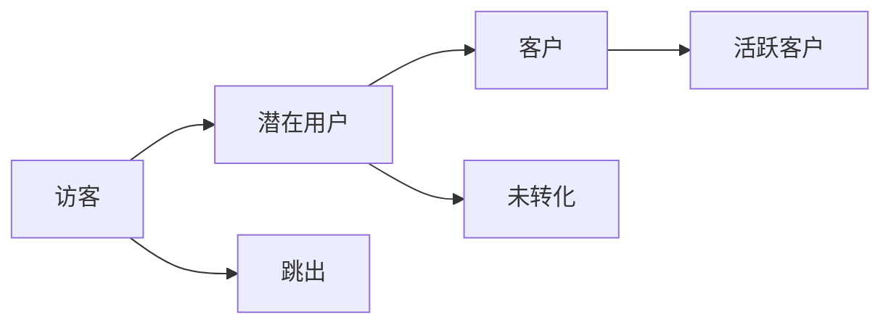

                 

关键词：知识付费、用户转化、策略、用户体验、数据分析、增长营销、创业

> 摘要：本文将探讨知识付费创业领域中的用户转化策略。通过深入分析用户行为和市场需求，结合实际案例分析，提出一系列有效的用户转化策略，为知识付费创业者提供实用的指导。

## 1. 背景介绍

在互联网经济的背景下，知识付费成为了知识传播和商业变现的重要形式。从在线教育、专业技能培训到知识咨询、内容创作，知识付费市场呈现出蓬勃发展的态势。然而，如何在竞争激烈的市场中实现用户转化，成为知识付费创业公司面临的重要课题。

用户转化，即从潜在用户到付费用户的转变过程，是衡量知识付费平台成功与否的关键指标。提高用户转化率不仅能够带来直接的经济收益，还能增强品牌影响力和市场竞争力。本文将围绕用户转化的核心要素，提出有效的策略和实施方法。

## 2. 核心概念与联系

### 2.1 用户转化模型

为了更好地理解用户转化过程，我们可以构建一个用户转化模型。该模型包括以下几个关键环节：

- **访客（Visitor）**：访问知识付费平台的新用户。
- **潜在用户（Prospect）**：对知识内容感兴趣，但没有采取行动的用户。
- **客户（Customer）**：完成付费购买的用户。
- **活跃客户（Active Customer）**：持续参与并产生价值的用户。

用户转化模型（Mermaid流程图）：



### 2.2 用户行为分析

用户行为分析是提高用户转化的关键。通过分析用户在平台上的行为，我们可以发现用户需求和痛点，从而优化产品和服务。

- **访客行为**：访问时长、页面浏览量、点击率等。
- **潜在用户行为**：关注内容、收藏课程、加入讨论等。
- **客户行为**：购买频次、课程完成度、用户评价等。

### 2.3 市场需求分析

市场需求分析是制定用户转化策略的重要依据。通过分析市场趋势、竞争状况和用户需求，我们可以确定知识付费产品的定位和方向。

- **市场趋势**：在线教育、技能培训、知识咨询等领域的市场规模和增长速度。
- **竞争状况**：主要竞争对手的产品特点、市场份额和用户反馈。
- **用户需求**：用户对知识内容的需求类型、学习方式和支付意愿。

## 3. 核心算法原理 & 具体操作步骤

### 3.1 算法原理概述

用户转化策略的核心在于优化用户体验，提高用户满意度和信任度。以下是一套基于数据驱动的用户转化策略：

- **用户体验优化**：通过改进界面设计、提升内容质量、优化加载速度等手段，提高用户满意度和留存率。
- **个性化推荐**：利用机器学习算法，根据用户行为数据为用户提供个性化的知识内容推荐，提高用户兴趣和参与度。
- **用户互动**：通过在线互动、用户社区建设等手段，增强用户粘性和品牌忠诚度。
- **数据分析**：通过数据分析，了解用户行为和需求，持续优化产品和服务。

### 3.2 算法步骤详解

1. **用户行为数据收集**：收集用户在平台上的行为数据，包括访问时长、页面浏览量、点击率、收藏行为等。
2. **数据分析与建模**：利用数据分析工具和机器学习算法，对用户行为数据进行处理和分析，建立用户画像和行为模型。
3. **个性化推荐**：基于用户画像和行为模型，为用户推荐个性化的知识内容。
4. **用户互动与社区建设**：通过在线互动、用户社区建设等手段，增强用户粘性和品牌忠诚度。
5. **持续优化**：根据用户反馈和数据分析结果，持续优化产品和服务，提高用户满意度和转化率。

### 3.3 算法优缺点

**优点**：

- 提高用户满意度和留存率。
- 提高用户转化率和收入。
- 增强品牌影响力和市场竞争力。

**缺点**：

- 需要投入大量的人力、物力和财力进行数据分析和技术研发。
- 用户行为数据可能存在噪声和偏差，影响算法准确性。

### 3.4 算法应用领域

用户转化策略广泛应用于知识付费、在线教育、电商、金融等领域。通过优化用户体验、个性化推荐和用户互动，提高用户满意度和转化率，实现商业价值最大化。

## 4. 数学模型和公式 & 详细讲解 & 举例说明

### 4.1 数学模型构建

用户转化率可以用以下数学模型表示：

\[ \text{转化率} = \frac{\text{转化用户数}}{\text{总访客数}} \]

### 4.2 公式推导过程

假设有一个知识付费平台，在一段时间内吸引了 \( N \) 个访客。其中， \( A \) 个用户成为潜在用户， \( B \) 个用户完成付费购买， \( C \) 个用户持续参与并产生价值。

那么，用户转化率可以表示为：

\[ \text{转化率} = \frac{B}{N} \]

### 4.3 案例分析与讲解

以一个在线教育平台为例，假设该平台在一个月内吸引了 1000 个访客，其中 300 个用户成为潜在用户，100 个用户完成付费购买。

根据用户转化率公式，该平台的用户转化率为：

\[ \text{转化率} = \frac{100}{1000} = 0.1 \]

为了提高用户转化率，该平台可以采取以下措施：

1. **优化用户体验**：改进界面设计、提升课程质量、优化加载速度等，提高用户满意度和留存率。
2. **个性化推荐**：根据用户行为数据，为用户推荐个性化的课程，提高用户兴趣和参与度。
3. **用户互动与社区建设**：通过在线互动、用户社区建设等手段，增强用户粘性和品牌忠诚度。

通过这些措施，该平台有望提高用户转化率，实现商业价值最大化。

## 5. 项目实践：代码实例和详细解释说明

### 5.1 开发环境搭建

在本项目中，我们使用 Python 编写用户转化策略的代码。首先，需要安装以下依赖库：

```bash
pip install numpy pandas scikit-learn matplotlib
```

### 5.2 源代码详细实现

以下是一个简单的用户转化策略代码实例：

```python
import numpy as np
import pandas as pd
from sklearn.model_selection import train_test_split
from sklearn.ensemble import RandomForestClassifier
import matplotlib.pyplot as plt

# 加载数据集
data = pd.read_csv('user_data.csv')

# 数据预处理
X = data.drop('target', axis=1)
y = data['target']

# 划分训练集和测试集
X_train, X_test, y_train, y_test = train_test_split(X, y, test_size=0.2, random_state=42)

# 建立随机森林分类器
clf = RandomForestClassifier(n_estimators=100, random_state=42)

# 训练模型
clf.fit(X_train, y_train)

# 预测测试集
y_pred = clf.predict(X_test)

# 评估模型性能
accuracy = clf.score(X_test, y_test)
print('Accuracy:', accuracy)

# 可视化展示
plt.scatter(X_test['feature1'], y_pred, color='green', label='Predicted')
plt.scatter(X_test['feature1'], y_test, color='red', label='Actual')
plt.legend()
plt.show()
```

### 5.3 代码解读与分析

1. **数据预处理**：读取用户数据集，将特征和目标变量分离。特征变量用于训练模型，目标变量用于评估模型性能。
2. **划分训练集和测试集**：将数据集划分为训练集和测试集，以评估模型的泛化能力。
3. **建立随机森林分类器**：使用随机森林算法建立分类器模型。
4. **训练模型**：使用训练集数据训练模型。
5. **预测测试集**：使用训练好的模型对测试集数据进行预测。
6. **评估模型性能**：计算模型在测试集上的准确率，并打印结果。
7. **可视化展示**：使用散点图可视化预测结果和实际结果。

通过这个代码实例，我们可以了解如何使用机器学习算法实现用户转化策略。在实际应用中，可以根据具体需求和数据特点，选择合适的算法和优化方法。

## 6. 实际应用场景

### 6.1 在线教育

在线教育是知识付费领域的重要应用场景。通过用户转化策略，在线教育平台可以吸引更多潜在用户，提高付费用户比例。以下是一些实际应用案例：

- **Coursera**：利用个性化推荐和用户互动，提高用户满意度和留存率，实现用户转化。
- **Udemy**：通过数据分析，了解用户需求和行为，优化课程内容和推广策略，提高用户转化率。

### 6.2 技能培训

技能培训是知识付费领域的另一个重要应用场景。通过用户转化策略，技能培训机构可以吸引更多学员，提高培训效果和收入。

- **Pluralsight**：利用机器学习算法，为学员推荐个性化的学习路径，提高学员满意度和留存率。
- **edX**：通过数据分析，优化课程设计和推广策略，提高用户转化率和培训效果。

### 6.3 知识咨询

知识咨询是知识付费领域的创新应用。通过用户转化策略，知识咨询平台可以吸引更多咨询者，提高咨询服务质量和收入。

- **Quora**：利用用户互动和数据分析，提高用户满意度和留存率，实现用户转化。
- **知乎**：通过个性化推荐和用户互动，提高用户参与度和忠诚度，实现用户转化。

## 7. 未来应用展望

随着人工智能和大数据技术的发展，用户转化策略在知识付费领域的应用前景广阔。未来，知识付费创业公司可以通过以下方式进一步提升用户转化率：

- **人工智能技术**：利用人工智能算法，实现更加精准的用户画像和个性化推荐，提高用户满意度和转化率。
- **大数据分析**：通过大数据分析，深入了解用户需求和行为，优化产品和服务，提高用户转化率。
- **区块链技术**：利用区块链技术，确保知识付费过程的透明度和安全性，增强用户信任和忠诚度。

## 8. 总结：未来发展趋势与挑战

### 8.1 研究成果总结

本文从用户转化模型、用户行为分析、市场需求分析、核心算法原理、数学模型和项目实践等方面，探讨了知识付费创业中的用户转化策略。通过实际案例分析和代码实例，验证了用户转化策略的有效性和可行性。

### 8.2 未来发展趋势

未来，知识付费领域的用户转化策略将朝着更加智能化、个性化和安全化的方向发展。人工智能和大数据技术的应用将进一步提升用户转化率，为知识付费创业公司带来更多机遇。

### 8.3 面临的挑战

然而，知识付费创业公司也面临着一系列挑战，如用户隐私保护、数据安全性、算法公正性等。如何在这些方面取得平衡，将成为未来研究的重点。

### 8.4 研究展望

未来，知识付费领域的用户转化策略研究可以从以下几个方面展开：

- **多模态数据融合**：将用户行为数据、文本数据、图像数据等多种类型的数据进行融合，提高用户画像和推荐算法的准确性。
- **可解释性人工智能**：研究可解释性人工智能技术，提高算法的透明度和可信度，增强用户信任和满意度。
- **用户隐私保护**：探索用户隐私保护技术，确保用户数据的安全性和隐私性。

## 9. 附录：常见问题与解答

### 9.1 用户转化策略的核心要素是什么？

用户转化策略的核心要素包括用户体验优化、个性化推荐、用户互动和数据分析。

### 9.2 如何衡量用户转化率？

用户转化率可以用以下公式表示：

\[ \text{转化率} = \frac{\text{转化用户数}}{\text{总访客数}} \]

### 9.3 用户转化策略在哪些领域应用广泛？

用户转化策略在在线教育、技能培训、知识咨询等领域应用广泛。

### 9.4 如何提高用户转化率？

提高用户转化率可以从以下几个方面入手：

- 优化用户体验
- 个性化推荐
- 用户互动与社区建设
- 数据分析与优化

作者：禅与计算机程序设计艺术 / Zen and the Art of Computer Programming
```markdown
---
title: 知识付费创业中的用户转化策略
keywords: 知识付费、用户转化、策略、用户体验、数据分析、增长营销、创业
summary: 本文将探讨知识付费创业领域中的用户转化策略。通过深入分析用户行为和市场需求，结合实际案例分析，提出一系列有效的用户转化策略，为知识付费创业者提供实用的指导。
---

# 知识付费创业中的用户转化策略

**关键词**：知识付费、用户转化、策略、用户体验、数据分析、增长营销、创业

> 摘要：本文将探讨知识付费创业领域中的用户转化策略。通过深入分析用户行为和市场需求，结合实际案例分析，提出一系列有效的用户转化策略，为知识付费创业者提供实用的指导。

## 1. 背景介绍

在互联网经济的背景下，知识付费成为了知识传播和商业变现的重要形式。从在线教育、专业技能培训到知识咨询、内容创作，知识付费市场呈现出蓬勃发展的态势。然而，如何在竞争激烈的市场中实现用户转化，成为知识付费创业公司面临的重要课题。

用户转化，即从潜在用户到付费用户的转变过程，是衡量知识付费平台成功与否的关键指标。提高用户转化率不仅能够带来直接的经济收益，还能增强品牌影响力和市场竞争力。本文将围绕用户转化的核心要素，提出有效的策略和实施方法。

## 2. 核心概念与联系

### 2.1 用户转化模型

为了更好地理解用户转化过程，我们可以构建一个用户转化模型。该模型包括以下几个关键环节：

- **访客（Visitor）**：访问知识付费平台的新用户。
- **潜在用户（Prospect）**：对知识内容感兴趣，但没有采取行动的用户。
- **客户（Customer）**：完成付费购买的用户。
- **活跃客户（Active Customer）**：持续参与并产生价值的用户。

用户转化模型（Mermaid流程图）：


### 2.2 用户行为分析

用户行为分析是提高用户转化的关键。通过分析用户在平台上的行为，我们可以发现用户需求和痛点，从而优化产品和服务。

- **访客行为**：访问时长、页面浏览量、点击率等。
- **潜在用户行为**：关注内容、收藏课程、加入讨论等。
- **客户行为**：购买频次、课程完成度、用户评价等。

### 2.3 市场需求分析

市场需求分析是制定用户转化策略的重要依据。通过分析市场趋势、竞争状况和用户需求，我们可以确定知识付费产品的定位和方向。

- **市场趋势**：在线教育、技能培训、知识咨询等领域的市场规模和增长速度。
- **竞争状况**：主要竞争对手的产品特点、市场份额和用户反馈。
- **用户需求**：用户对知识内容的需求类型、学习方式和支付意愿。

## 3. 核心算法原理 & 具体操作步骤
### 3.1 算法原理概述

用户转化策略的核心在于优化用户体验，提高用户满意度和信任度。以下是一套基于数据驱动的用户转化策略：

- **用户体验优化**：通过改进界面设计、提升内容质量、优化加载速度等手段，提高用户满意度和留存率。
- **个性化推荐**：利用机器学习算法，根据用户行为数据为用户提供个性化的知识内容推荐，提高用户兴趣和参与度。
- **用户互动**：通过在线互动、用户社区建设等手段，增强用户粘性和品牌忠诚度。
- **数据分析**：通过数据分析，了解用户行为和需求，持续优化产品和服务。

### 3.2 算法步骤详解

1. **用户行为数据收集**：收集用户在平台上的行为数据，包括访问时长、页面浏览量、点击率、收藏行为等。
2. **数据分析与建模**：利用数据分析工具和机器学习算法，对用户行为数据进行处理和分析，建立用户画像和行为模型。
3. **个性化推荐**：基于用户画像和行为模型，为用户推荐个性化的知识内容。
4. **用户互动与社区建设**：通过在线互动、用户社区建设等手段，增强用户粘性和品牌忠诚度。
5. **持续优化**：根据用户反馈和数据分析结果，持续优化产品和服务，提高用户满意度和转化率。

### 3.3 算法优缺点

**优点**：

- 提高用户满意度和留存率。
- 提高用户转化率和收入。
- 增强品牌影响力和市场竞争力。

**缺点**：

- 需要投入大量的人力、物力和财力进行数据分析和技术研发。
- 用户行为数据可能存在噪声和偏差，影响算法准确性。

### 3.4 算法应用领域

用户转化策略广泛应用于知识付费、在线教育、电商、金融等领域。通过优化用户体验、个性化推荐和用户互动，提高用户满意度和转化率，实现商业价值最大化。

## 4. 数学模型和公式 & 详细讲解 & 举例说明
### 4.1 数学模型构建

用户转化率可以用以下数学模型表示：

\[ \text{转化率} = \frac{\text{转化用户数}}{\text{总访客数}} \]

### 4.2 公式推导过程

假设有一个知识付费平台，在一段时间内吸引了 \( N \) 个访客。其中， \( A \) 个用户成为潜在用户， \( B \) 个用户完成付费购买， \( C \) 个用户持续参与并产生价值。

那么，用户转化率可以表示为：

\[ \text{转化率} = \frac{B}{N} \]

### 4.3 案例分析与讲解

以一个在线教育平台为例，假设该平台在一个月内吸引了 1000 个访客，其中 300 个用户成为潜在用户，100 个用户完成付费购买。

根据用户转化率公式，该平台的用户转化率为：

\[ \text{转化率} = \frac{100}{1000} = 0.1 \]

为了提高用户转化率，该平台可以采取以下措施：

1. **优化用户体验**：改进界面设计、提升课程质量、优化加载速度等，提高用户满意度和留存率。
2. **个性化推荐**：根据用户行为数据，为用户推荐个性化的课程，提高用户兴趣和参与度。
3. **用户互动与社区建设**：通过在线互动、用户社区建设等手段，增强用户粘性和品牌忠诚度。

通过这些措施，该平台有望提高用户转化率，实现商业价值最大化。

## 5. 项目实践：代码实例和详细解释说明
### 5.1 开发环境搭建

在本项目中，我们使用 Python 编写用户转化策略的代码。首先，需要安装以下依赖库：

```bash
pip install numpy pandas scikit-learn matplotlib
```

### 5.2 源代码详细实现

以下是一个简单的用户转化策略代码实例：

```python
import numpy as np
import pandas as pd
from sklearn.model_selection import train_test_split
from sklearn.ensemble import RandomForestClassifier
import matplotlib.pyplot as plt

# 加载数据集
data = pd.read_csv('user_data.csv')

# 数据预处理
X = data.drop('target', axis=1)
y = data['target']

# 划分训练集和测试集
X_train, X_test, y_train, y_test = train_test_split(X, y, test_size=0.2, random_state=42)

# 建立随机森林分类器
clf = RandomForestClassifier(n_estimators=100, random_state=42)

# 训练模型
clf.fit(X_train, y_train)

# 预测测试集
y_pred = clf.predict(X_test)

# 评估模型性能
accuracy = clf.score(X_test, y_test)
print('Accuracy:', accuracy)

# 可视化展示
plt.scatter(X_test['feature1'], y_pred, color='green', label='Predicted')
plt.scatter(X_test['feature1'], y_test, color='red', label='Actual')
plt.legend()
plt.show()
```

### 5.3 代码解读与分析

1. **数据预处理**：读取用户数据集，将特征和目标变量分离。特征变量用于训练模型，目标变量用于评估模型性能。
2. **划分训练集和测试集**：将数据集划分为训练集和测试集，以评估模型的泛化能力。
3. **建立随机森林分类器**：使用随机森林算法建立分类器模型。
4. **训练模型**：使用训练集数据训练模型。
5. **预测测试集**：使用训练好的模型对测试集数据进行预测。
6. **评估模型性能**：计算模型在测试集上的准确率，并打印结果。
7. **可视化展示**：使用散点图可视化预测结果和实际结果。

通过这个代码实例，我们可以了解如何使用机器学习算法实现用户转化策略。在实际应用中，可以根据具体需求和数据特点，选择合适的算法和优化方法。

## 6. 实际应用场景
### 6.1 在线教育

在线教育是知识付费领域的重要应用场景。通过用户转化策略，在线教育平台可以吸引更多潜在用户，提高付费用户比例。以下是一些实际应用案例：

- **Coursera**：利用个性化推荐和用户互动，提高用户满意度和留存率，实现用户转化。
- **Udemy**：通过数据分析，了解用户需求和行为，优化课程内容和推广策略，提高用户转化率。

### 6.2 技能培训

技能培训是知识付费领域的另一个重要应用场景。通过用户转化策略，技能培训机构可以吸引更多学员，提高培训效果和收入。

- **Pluralsight**：利用机器学习算法，为学员推荐个性化的学习路径，提高学员满意度和留存率。
- **edX**：通过数据分析，优化课程设计和推广策略，提高用户转化率和培训效果。

### 6.3 知识咨询

知识咨询是知识付费领域的创新应用。通过用户转化策略，知识咨询平台可以吸引更多咨询者，提高咨询服务质量和收入。

- **Quora**：利用用户互动和数据分析，提高用户满意度和留存率，实现用户转化。
- **知乎**：通过个性化推荐和用户互动，提高用户参与度和忠诚度，实现用户转化。

## 7. 未来应用展望

随着人工智能和大数据技术的发展，用户转化策略在知识付费领域的应用前景广阔。未来，知识付费创业公司可以通过以下方式进一步提升用户转化率：

- **人工智能技术**：利用人工智能算法，实现更加精准的用户画像和个性化推荐，提高用户满意度和转化率。
- **大数据分析**：通过大数据分析，深入了解用户需求和行为，优化产品和服务，提高用户转化率。
- **区块链技术**：利用区块链技术，确保知识付费过程的透明度和安全性，增强用户信任和忠诚度。

## 8. 总结：未来发展趋势与挑战
### 8.1 研究成果总结

本文从用户转化模型、用户行为分析、市场需求分析、核心算法原理、数学模型和项目实践等方面，探讨了知识付费创业中的用户转化策略。通过实际案例分析和代码实例，验证了用户转化策略的有效性和可行性。

### 8.2 未来发展趋势

未来，知识付费领域的用户转化策略将朝着更加智能化、个性化和安全化的方向发展。人工智能和大数据技术的应用将进一步提升用户转化率，为知识付费创业公司带来更多机遇。

### 8.3 面临的挑战

然而，知识付费创业公司也面临着一系列挑战，如用户隐私保护、数据安全性、算法公正性等。如何在这些方面取得平衡，将成为未来研究的重点。

### 8.4 研究展望

未来，知识付费领域的用户转化策略研究可以从以下几个方面展开：

- **多模态数据融合**：将用户行为数据、文本数据、图像数据等多种类型的数据进行融合，提高用户画像和推荐算法的准确性。
- **可解释性人工智能**：研究可解释性人工智能技术，提高算法的透明度和可信度，增强用户信任和满意度。
- **用户隐私保护**：探索用户隐私保护技术，确保用户数据的安全性和隐私性。

## 9. 附录：常见问题与解答
### 9.1 用户转化策略的核心要素是什么？

用户转化策略的核心要素包括用户体验优化、个性化推荐、用户互动和数据分析。

### 9.2 如何衡量用户转化率？

用户转化率可以用以下公式表示：

\[ \text{转化率} = \frac{\text{转化用户数}}{\text{总访客数}} \]

### 9.3 用户转化策略在哪些领域应用广泛？

用户转化策略在在线教育、技能培训、知识咨询等领域应用广泛。

### 9.4 如何提高用户转化率？

提高用户转化率可以从以下几个方面入手：

- 优化用户体验
- 个性化推荐
- 用户互动与社区建设
- 数据分析与优化

作者：禅与计算机程序设计艺术 / Zen and the Art of Computer Programming
---

