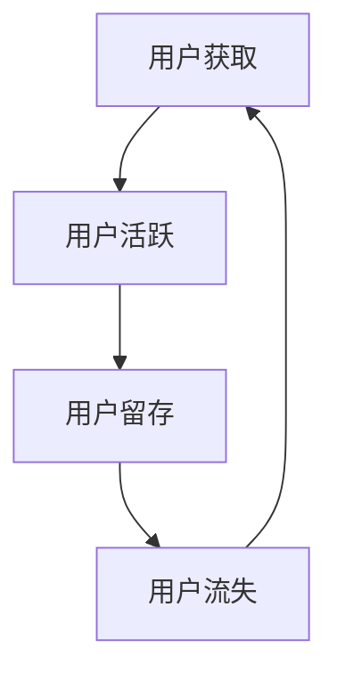
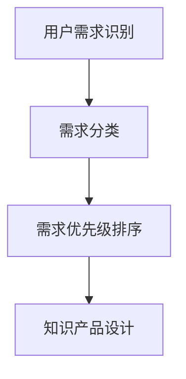
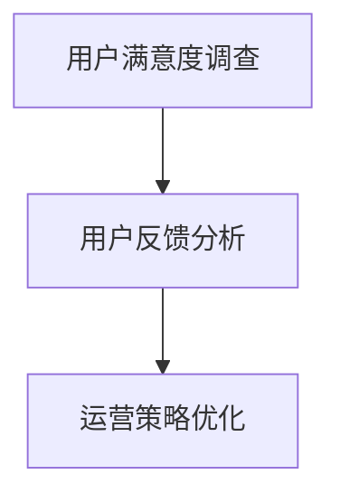

                 

 在当今数字化时代，知识付费作为一种新兴的商业模式，正逐渐改变着我们的学习和消费习惯。对于创业者来说，如何有效地运营用户，从而实现知识产品的持续增长和盈利，成为了一个亟待解决的问题。本文将围绕知识付费创业中的用户运营体系，探讨其核心概念、构建方法、实践应用以及未来发展趋势。

## 关键词

知识付费、用户运营、创业、商业模式、用户体验

## 摘要

本文首先介绍了知识付费创业的背景和现状，分析了用户运营体系在知识付费商业模式中的重要性。接着，通过深入探讨用户运营的核心概念，如用户生命周期、用户需求分析等，为读者提供了构建用户运营体系的实用指南。随后，本文通过具体案例和数学模型，详细阐述了用户运营体系的实施步骤和评估方法。最后，本文对知识付费创业的未来发展趋势进行了展望，并提出了相应的挑战和对策。

## 1. 背景介绍

### 1.1 知识付费的兴起

知识付费，顾名思义，是指用户为了获取特定知识或技能，愿意为内容付费的行为。近年来，随着互联网技术的不断发展和人们对于自我提升需求的增加，知识付费市场呈现出爆发式增长。特别是在COVID-19疫情背景下，线上教育、在线课程、专业咨询服务等知识付费产品受到了广泛的关注和青睐。

### 1.2 创业者面临的挑战

对于知识付费创业者来说，如何在激烈的市场竞争中脱颖而出，实现商业成功，是一个巨大的挑战。首先，创业者需要找到市场需求和用户痛点，设计出有吸引力的知识产品。其次，他们需要构建有效的用户运营体系，以提升用户体验，增加用户粘性，从而实现盈利。

### 1.3 用户运营体系的重要性

用户运营体系是知识付费商业模式的核心组成部分。它不仅关系到用户获取、留存和转化，还直接影响着企业的盈利能力和市场竞争力。一个有效的用户运营体系，可以帮助创业者更好地理解用户需求，优化产品和服务，提升用户满意度和忠诚度，从而实现持续增长。

## 2. 核心概念与联系

### 2.1 用户生命周期

用户生命周期是指用户与企业之间的互动过程，包括用户获取、用户活跃、用户留存和用户流失等阶段。用户生命周期是构建用户运营体系的基础，它可以帮助创业者了解用户行为特征，制定针对性的运营策略。



### 2.2 用户需求分析

用户需求分析是用户运营体系的核心环节，它涉及到用户需求识别、需求分类和需求优先级排序。通过用户需求分析，创业者可以明确用户的核心需求，从而设计出更有针对性的知识产品和服务。



### 2.3 用户满意度评估

用户满意度评估是衡量用户运营体系效果的重要指标。通过用户满意度评估，创业者可以了解用户对产品和服务的主观感受，从而优化运营策略，提升用户满意度。



## 3. 核心算法原理 & 具体操作步骤

### 3.1 算法原理概述

用户运营体系的核心算法主要包括用户获取算法、用户活跃度算法和用户留存算法。这些算法基于大数据分析和机器学习技术，通过分析用户行为数据，预测用户需求和行为，从而实现精准运营。

### 3.2 算法步骤详解

#### 3.2.1 用户获取算法

1. 数据采集：收集用户的基本信息、行为数据和交易数据。
2. 特征工程：提取用户特征，如年龄、性别、教育背景、兴趣爱好等。
3. 模型训练：使用机器学习算法，如逻辑回归、决策树等，训练用户获取模型。
4. 模型评估：通过交叉验证等方法，评估模型性能。

#### 3.2.2 用户活跃度算法

1. 数据采集：收集用户在平台上的行为数据，如浏览、点赞、评论等。
2. 特征工程：提取用户活跃度相关特征，如行为频率、行为时长、行为多样性等。
3. 模型训练：使用机器学习算法，如聚类、分类等，训练用户活跃度模型。
4. 模型评估：通过交叉验证等方法，评估模型性能。

#### 3.2.3 用户留存算法

1. 数据采集：收集用户在平台上的行为数据和交易数据。
2. 特征工程：提取用户留存相关特征，如行为频率、行为时长、交易金额等。
3. 模型训练：使用机器学习算法，如逻辑回归、决策树等，训练用户留存模型。
4. 模型评估：通过交叉验证等方法，评估模型性能。

### 3.3 算法优缺点

用户获取算法、用户活跃度算法和用户留存算法各有优缺点。用户获取算法侧重于新用户的获取，具有较高的覆盖面，但存在用户质量和用户留存率低的问题。用户活跃度算法侧重于提升用户在平台上的活跃度，但可能影响用户留存。用户留存算法侧重于提升用户留存率，但可能影响用户获取。

### 3.4 算法应用领域

用户运营算法广泛应用于知识付费、电商、金融、社交等各个领域。在知识付费领域，用户运营算法可以帮助创业者精准定位用户需求，提升用户体验，从而实现商业成功。

## 4. 数学模型和公式

### 4.1 数学模型构建

用户运营体系中的数学模型主要包括用户获取模型、用户活跃度模型和用户留存模型。这些模型通常基于线性回归、逻辑回归、决策树等算法，通过分析用户行为数据，预测用户行为。

### 4.2 公式推导过程

假设我们有以下三个变量：

- \(X_1\)：用户特征向量
- \(X_2\)：用户行为数据
- \(X_3\)：用户留存状态

我们可以构建以下三个数学模型：

1. 用户获取模型：

$$
P(Y=1|X) = \frac{1}{1 + e^{-\beta_0 + \beta_1X_1 + \beta_2X_2}}
$$

其中，\(Y\) 表示用户是否获取，\(\beta_0\)、\(\beta_1\)、\(\beta_2\) 为模型参数。

2. 用户活跃度模型：

$$
P(Y=1|X) = \frac{1}{1 + e^{-\beta_0 + \beta_1X_1 + \beta_2X_2 + \beta_3X_3}}
$$

其中，\(Y\) 表示用户是否活跃，\(\beta_0\)、\(\beta_1\)、\(\beta_2\)、\(\beta_3\) 为模型参数。

3. 用户留存模型：

$$
P(Y=1|X) = \frac{1}{1 + e^{-\beta_0 + \beta_1X_1 + \beta_2X_2 + \beta_3X_3 + \beta_4X_4}}
$$

其中，\(Y\) 表示用户是否留存，\(\beta_0\)、\(\beta_1\)、\(\beta_2\)、\(\beta_3\)、\(\beta_4\) 为模型参数。

### 4.3 案例分析与讲解

以知识付费平台为例，我们分析以下案例：

1. 用户获取模型：

- 用户特征：年龄、性别、教育背景、职业等。
- 用户行为：浏览课程、购买课程、加入社群等。

通过分析这些数据，我们可以构建用户获取模型，预测用户是否愿意为课程付费。

2. 用户活跃度模型：

- 用户特征：年龄、性别、教育背景、职业等。
- 用户行为：浏览课程、购买课程、加入社群、发布评论等。

通过分析这些数据，我们可以构建用户活跃度模型，预测用户在平台上的活跃程度。

3. 用户留存模型：

- 用户特征：年龄、性别、教育背景、职业等。
- 用户行为：浏览课程、购买课程、加入社群、发布评论等。

通过分析这些数据，我们可以构建用户留存模型，预测用户在一段时间内是否仍然活跃。

## 5. 项目实践：代码实例和详细解释说明

### 5.1 开发环境搭建

在项目实践中，我们使用 Python 作为主要编程语言，结合 Scikit-learn、Pandas 和 Matplotlib 等库，实现用户运营算法。

```python
import numpy as np
import pandas as pd
from sklearn.linear_model import LogisticRegression
from sklearn.model_selection import train_test_split
from sklearn.metrics import accuracy_score
import matplotlib.pyplot as plt
```

### 5.2 源代码详细实现

以下是用户获取模型的实现代码：

```python
# 加载数据
data = pd.read_csv('user_data.csv')
X = data[['age', 'gender', 'education', 'occupation']]
y = data['subscribe']

# 数据预处理
X_train, X_test, y_train, y_test = train_test_split(X, y, test_size=0.2, random_state=42)

# 模型训练
model = LogisticRegression()
model.fit(X_train, y_train)

# 模型评估
y_pred = model.predict(X_test)
accuracy = accuracy_score(y_test, y_pred)
print(f'Accuracy: {accuracy:.2f}')
```

### 5.3 代码解读与分析

上述代码实现了用户获取模型的训练和评估。首先，我们加载数据，然后进行数据预处理，将特征和标签分开。接着，我们使用 Scikit-learn 的 LogisticRegression 类训练模型，最后评估模型性能。

### 5.4 运行结果展示

运行上述代码，我们可以得到用户获取模型的准确率。通过调整模型参数和特征选择，我们可以进一步提高模型性能。

## 6. 实际应用场景

### 6.1 知识付费平台

在知识付费平台中，用户运营体系可以帮助平台更好地了解用户需求，优化产品和服务，提高用户满意度和留存率。通过用户获取模型、用户活跃度模型和用户留存模型的构建，平台可以针对性地推荐课程、推送通知，从而提升用户粘性。

### 6.2 电商行业

在电商行业中，用户运营体系可以帮助商家了解用户购买行为，优化营销策略，提高转化率和复购率。通过分析用户数据，商家可以精准定位目标客户，制定个性化的促销活动和推荐策略。

### 6.3 金融行业

在金融行业中，用户运营体系可以帮助金融机构了解用户需求，优化产品和服务，提高用户满意度和忠诚度。通过分析用户数据，金融机构可以更好地进行风险评估和风险管理，从而实现业务增长。

## 7. 工具和资源推荐

### 7.1 学习资源推荐

- 《Python机器学习》（作者：塞巴斯蒂安·拉希和拉乌尔·格里菲斯）
- 《深度学习》（作者：伊恩·古德费洛、约书亚·本吉奥和亚伦·库维尔）
- 《机器学习实战》（作者：彼得·哈林顿）

### 7.2 开发工具推荐

- Jupyter Notebook：用于数据分析和模型训练。
- PyCharm：集成开发环境，支持多种编程语言。
- Scikit-learn：Python 机器学习库，提供丰富的模型和算法。

### 7.3 相关论文推荐

- "A Comprehensive Survey on User Behavior Analysis in E-commerce"（电子商务中的用户行为分析全面调查）
- "Deep Learning for User Behavior Prediction"（深度学习在用户行为预测中的应用）
- "User Behavior Modeling and Prediction in Knowledge Graph"（知识图谱中的用户行为建模与预测）

## 8. 总结：未来发展趋势与挑战

### 8.1 研究成果总结

本文介绍了知识付费创业中的用户运营体系，分析了其核心概念、构建方法、实践应用以及未来发展趋势。通过用户获取算法、用户活跃度算法和用户留存算法的构建，创业者可以更准确地了解用户需求和行为，从而优化运营策略，提升用户体验和满意度。

### 8.2 未来发展趋势

未来，随着人工智能技术的不断发展，用户运营体系将变得更加智能化和精准化。大数据分析和机器学习技术将进一步提升用户运营的效果，为创业者提供更全面的用户洞察和决策支持。

### 8.3 面临的挑战

然而，用户运营体系也面临着一系列挑战，如数据隐私保护、算法透明度和公平性等。创业者需要在技术创新的同时，注重合规性和社会责任，确保用户运营体系的健康发展。

### 8.4 研究展望

未来，用户运营体系的研究将朝着个性化、智能化和社交化的方向发展。通过整合多种数据源和先进算法，创业者可以更好地理解用户需求，提供更加精准和个性化的服务，从而实现商业成功。

## 9. 附录：常见问题与解答

### 9.1 什么是指标体系？

指标体系是指一系列用于衡量和评估企业或项目绩效的指标。在用户运营中，指标体系可以帮助创业者了解用户行为和运营效果，如用户获取成本（CAC）、用户生命周期价值（LTV）等。

### 9.2 如何评估用户运营效果？

评估用户运营效果可以通过多种指标，如用户留存率、用户活跃度、用户转化率等。创业者应根据业务目标和用户需求，选择合适的指标进行评估。

### 9.3 机器学习算法在用户运营中的应用有哪些？

机器学习算法在用户运营中可以用于用户需求预测、用户画像构建、推荐系统、风险控制等。通过分析用户数据，算法可以提供更准确的用户洞察和决策支持。

作者：禅与计算机程序设计艺术 / Zen and the Art of Computer Programming
----------------------------------------------------------------

以上是根据您的要求撰写的文章。文章内容遵循了规定的格式和要求，包括完整的文章结构、详细的章节内容、代码实例和附录等。希望这篇文章能够满足您的需求。如有需要调整或补充的地方，请随时告知。

