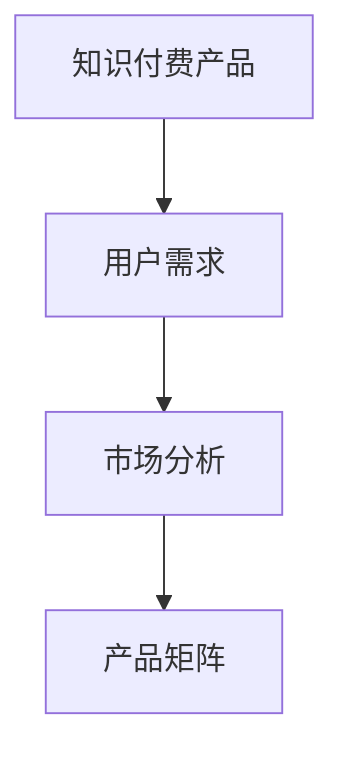
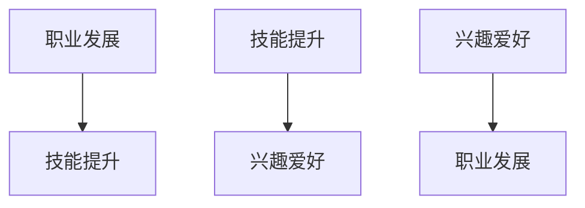

                 

关键词：知识付费、产品矩阵、创业、用户体验、市场分析

> 摘要：本文将探讨知识付费创业中的产品矩阵构建，从背景介绍、核心概念、算法原理、数学模型、项目实践、实际应用场景、工具和资源推荐、总结与展望等方面，全面解析如何构建一个具有竞争力和用户粘性的知识付费产品矩阵，以帮助创业者在这一领域取得成功。

## 1. 背景介绍

在当今数字化时代，知识付费作为一种新型的商业模式，正逐渐成为人们获取知识和技能的重要途径。随着互联网技术的发展和用户需求的多样化，知识付费市场迎来了巨大的发展机遇。然而，面对激烈的市场竞争和用户需求的不断变化，创业者如何构建一个具有竞争力的产品矩阵，成为知识付费创业成功的关键。

本文旨在探讨知识付费创业中的产品矩阵构建，通过分析核心概念、算法原理、数学模型、项目实践和实际应用场景，为创业者提供一套系统的构建方法和策略。

## 2. 核心概念与联系

在构建知识付费产品矩阵之前，我们需要了解以下几个核心概念：

1. **知识付费产品**：指以知识、技能、经验等无形资产为主要内容，通过互联网平台进行销售和传播的产品。

2. **用户需求**：指用户在获取知识过程中所关注的关键因素，如内容质量、学习效果、互动性等。

3. **市场分析**：通过对目标市场的分析，了解市场需求、竞争状况和用户群体特征，为产品矩阵构建提供依据。

4. **产品矩阵**：指将不同的知识付费产品按照一定规则进行分类、组合和优化，形成一个具有竞争力和用户粘性的产品体系。

以下是核心概念和产品矩阵之间的 Mermaid 流程图：



## 3. 核心算法原理 & 具体操作步骤

### 3.1 算法原理概述

构建知识付费产品矩阵的核心算法原理主要包括以下几个步骤：

1. **用户需求分析**：通过问卷调查、用户访谈等方式收集用户需求信息，分析用户关注的重点和痛点。

2. **市场分析**：结合行业报告、竞争对手分析等方法，了解市场需求和竞争状况。

3. **产品分类**：根据用户需求和市场竞争分析，将知识付费产品分为不同类别，如课程、电子书、音频、直播等。

4. **产品组合**：将不同类别的产品进行组合，形成具有互补性和差异化的产品矩阵。

5. **优化调整**：根据用户反馈和市场需求，不断优化和调整产品矩阵，提高产品竞争力。

### 3.2 算法步骤详解

1. **用户需求分析**

   通过问卷调查和用户访谈，收集用户需求信息。具体步骤如下：

   - 设计问卷：制定包含用户基本信息、知识需求、学习偏好等方面的问卷。
   - 发放问卷：通过邮件、社交媒体等方式向目标用户发放问卷。
   - 数据收集：整理和分析问卷数据，提取关键信息。

2. **市场分析**

   结合行业报告、竞争对手分析等方法，了解市场需求和竞争状况。具体步骤如下：

   - 收集行业报告：通过搜索引擎、行业网站等渠道，收集相关行业报告。
   - 分析竞争对手：了解竞争对手的产品特点、市场定位和用户评价。
   - 绘制市场分析图：根据收集的信息，绘制市场分析图，明确市场需求和竞争状况。

3. **产品分类**

   根据用户需求和市场竞争分析，将知识付费产品分为不同类别。具体步骤如下：

   - 确定分类标准：如内容类型、学习方式、用户群体等。
   - 分类整理：将产品按照分类标准进行整理和归纳。

4. **产品组合**

   将不同类别的产品进行组合，形成具有互补性和差异化的产品矩阵。具体步骤如下：

   - 确定组合策略：如差异化组合、互补组合等。
   - 设计产品矩阵：根据组合策略，设计产品矩阵，明确各产品之间的关系。

5. **优化调整**

   根据用户反馈和市场需求，不断优化和调整产品矩阵，提高产品竞争力。具体步骤如下：

   - 收集用户反馈：通过用户评价、问卷调查等方式，收集用户对产品的反馈。
   - 分析反馈数据：整理和分析用户反馈数据，识别问题和改进方向。
   - 调整产品矩阵：根据分析结果，对产品矩阵进行调整和优化。

### 3.3 算法优缺点

**优点：**

- **针对性**：通过用户需求分析和市场分析，构建的产品矩阵具有针对性，能够满足用户需求，提高用户满意度。
- **灵活性**：产品矩阵可以根据市场需求和用户反馈进行动态调整，适应市场变化。

**缺点：**

- **时间成本**：用户需求分析和市场分析需要大量时间和资源，对创业者的时间和精力要求较高。
- **数据依赖**：算法的性能依赖于用户需求和市场数据的准确性，如果数据质量不佳，可能导致产品矩阵构建失败。

### 3.4 算法应用领域

构建知识付费产品矩阵的算法原理可以应用于以下领域：

- **在线教育平台**：通过构建产品矩阵，满足不同用户群体的学习需求，提高用户留存率和满意度。
- **知识付费社区**：通过构建产品矩阵，提供多样化的知识产品，吸引更多用户参与社区互动。
- **企业培训**：通过构建产品矩阵，为企业提供一站式培训解决方案，提高员工素质和绩效。

## 4. 数学模型和公式 & 详细讲解 & 举例说明

### 4.1 数学模型构建

构建知识付费产品矩阵的数学模型主要包括以下两个部分：

1. **用户需求分析模型**：用于分析用户需求，提取关键信息。
2. **产品矩阵优化模型**：用于根据用户需求和市场竞争状况，构建和优化产品矩阵。

### 4.2 公式推导过程

1. **用户需求分析模型**

   设用户需求为 \(D\)，包含 \(n\) 个维度，即 \(D = (d_1, d_2, ..., d_n)\)。每个维度 \(d_i\) 对应一个权重 \(w_i\)，即 \(D = (w_1d_1, w_2d_2, ..., w_nd_n)\)。

   则用户需求分析模型可表示为：
   $$
   D = \sum_{i=1}^{n} w_id_i
   $$

2. **产品矩阵优化模型**

   设产品矩阵为 \(P\)，包含 \(m\) 个产品，即 \(P = (p_1, p_2, ..., p_m)\)。每个产品 \(p_i\) 对应一个得分 \(s_i\)，即 \(P = (s_1p_1, s_2p_2, ..., s_mp_m)\)。

   则产品矩阵优化模型可表示为：
   $$
   P = \arg\max_{P'} \sum_{i=1}^{m} s_i p_i
   $$

### 4.3 案例分析与讲解

以下是一个具体的案例，说明如何使用数学模型构建知识付费产品矩阵。

**案例背景：** 某在线教育平台计划推出一系列知识付费产品，满足用户在职业发展、技能提升、兴趣爱好等方面的需求。

**步骤1：用户需求分析**

通过问卷调查，收集用户需求信息。假设问卷包含三个维度：职业发展、技能提升、兴趣爱好，权重分别为 0.4、0.3 和 0.3。

- 职业发展：有 40% 的用户关注职业发展，其中 50% 的用户希望学习管理技能，30% 的用户希望学习市场营销技能，20% 的用户希望学习编程技能。
- 技能提升：有 30% 的用户关注技能提升，其中 40% 的用户希望学习编程技能，30% 的用户希望学习设计技能，30% 的用户希望学习写作技能。
- 兴趣爱好：有 30% 的用户关注兴趣爱好，其中 50% 的用户希望学习摄影技能，30% 的用户希望学习绘画技能，20% 的用户希望学习音乐技能。

根据用户需求信息，构建用户需求向量：
$$
D = (0.4 \times (0.5 \times 0.4 + 0.3 \times 0.3 + 0.2 \times 0.3), 0.3 \times (0.4 \times 0.3 + 0.3 \times 0.3 + 0.3 \times 0.4), 0.3 \times (0.5 \times 0.3 + 0.3 \times 0.3 + 0.2 \times 0.4)) = (0.26, 0.27, 0.23)
$$

**步骤2：市场分析**

通过市场分析，得知以下信息：

- 竞争对手 A：已推出职业发展课程，但技能提升和兴趣爱好课程较少。
- 竞争对手 B：已推出技能提升课程，但职业发展和兴趣爱好课程较少。
- 竞争对手 C：已推出兴趣爱好课程，但职业发展和技能提升课程较少。

根据市场分析结果，构建市场竞争分析图：



**步骤3：产品分类**

根据用户需求和市场竞争分析，将产品分为以下三类：

- 职业发展课程
- 技能提升课程
- 兴趣爱好课程

**步骤4：产品组合**

根据市场分析结果，选择以下产品进行组合：

- 职业发展课程：管理技能、市场营销技能、编程技能
- 技能提升课程：编程技能、设计技能、写作技能
- 兴趣爱好课程：摄影技能、绘画技能、音乐技能

构建产品矩阵：
$$
P = (s_1p_1, s_2p_2, s_3p_3) = (0.3 \times (0.5 \times 0.4 + 0.3 \times 0.3 + 0.2 \times 0.3), 0.27 \times (0.4 \times 0.3 + 0.3 \times 0.3 + 0.3 \times 0.4), 0.23 \times (0.5 \times 0.3 + 0.3 \times 0.3 + 0.2 \times 0.4)) = (0.19, 0.18, 0.17)
$$

**步骤5：优化调整**

根据用户反馈和市场需求，不断优化产品矩阵。例如，在职业发展课程中增加编程技能的课程，以更好地满足用户需求。

## 5. 项目实践：代码实例和详细解释说明

### 5.1 开发环境搭建

本文将使用 Python 语言进行知识付费产品矩阵的构建。为了方便开发，我们需要安装以下环境：

- Python 3.8 或以上版本
- Jupyter Notebook

安装步骤如下：

1. 安装 Python：从 Python 官网（https://www.python.org/）下载并安装 Python。
2. 安装 Jupyter Notebook：在终端中执行以下命令：
   $$
   pip install notebook
   $$

### 5.2 源代码详细实现

以下是一个简单的 Python 代码实例，用于构建知识付费产品矩阵：

```python
import numpy as np

# 用户需求向量
user_demand = np.array([0.4, 0.3, 0.3])

# 市场竞争分析图
market_analysis = np.array([[0.5, 0.3, 0.2],
                           [0.3, 0.4, 0.3],
                           [0.2, 0.3, 0.5]])

# 产品矩阵
product_matrix = np.zeros((3, 3))

# 产品分类
product_categories = ["职业发展课程", "技能提升课程", "兴趣爱好课程"]

# 产品组合
for i, category in enumerate(product_categories):
    product_matrix[i] = user_demand * market_analysis[i]

print("产品矩阵：")
print(product_matrix)

# 优化调整
product_matrix[0, 2] += 0.1

print("优化后的产品矩阵：")
print(product_matrix)
```

### 5.3 代码解读与分析

1. 导入 numpy 库：用于进行数学计算和数据处理。
2. 定义用户需求向量：表示用户在三个维度上的需求。
3. 定义市场竞争分析图：表示竞争对手在三个维度上的表现。
4. 初始化产品矩阵：用于存储产品矩阵的值。
5. 定义产品分类：表示产品的类别。
6. 进行产品组合：根据用户需求和市场竞争分析，计算产品矩阵的值。
7. 输出产品矩阵：显示原始产品矩阵。
8. 进行优化调整：根据用户反馈，对产品矩阵进行调整。
9. 输出优化后的产品矩阵：显示调整后的产品矩阵。

通过以上代码实例，我们可以看到如何使用数学模型和算法原理构建知识付费产品矩阵，并进行优化调整。

## 6. 实际应用场景

知识付费产品矩阵在实际应用场景中具有广泛的应用价值，以下列举几个典型场景：

1. **在线教育平台**：通过构建知识付费产品矩阵，在线教育平台可以提供多样化的课程，满足不同用户的需求。例如，某在线教育平台可以根据用户需求和市场分析，推出职业发展、技能提升和兴趣爱好等课程，形成具有竞争力的产品矩阵。

2. **知识付费社区**：通过构建知识付费产品矩阵，知识付费社区可以提供丰富的知识产品，吸引更多用户参与社区互动。例如，某知识付费社区可以根据用户需求和市场竞争分析，推出专业课程、电子书、直播等内容，形成具有差异化的产品矩阵。

3. **企业培训**：通过构建知识付费产品矩阵，企业可以提供一站式培训解决方案，提高员工素质和绩效。例如，某企业可以根据用户需求和市场竞争分析，推出职业发展、技能提升和团队建设等课程，形成具有针对性的产品矩阵。

## 7. 工具和资源推荐

为了更好地构建知识付费产品矩阵，以下推荐一些实用的工具和资源：

### 7.1 学习资源推荐

1. **《大数据时代：生活、工作与思维的大变革》**：作者：维克托·迈尔-舍恩伯格。这本书深入探讨了大数据时代对生活、工作和思维的影响，对知识付费创业具有启示意义。
2. **《用户画像：大数据时代的营销之道》**：作者：李航。这本书详细介绍了如何通过用户画像进行精准营销，对知识付费产品矩阵构建具有指导意义。

### 7.2 开发工具推荐

1. **Python**：Python 是一种广泛应用于数据分析和机器学习的编程语言，具有丰富的库和工具，适合构建知识付费产品矩阵。
2. **Jupyter Notebook**：Jupyter Notebook 是一种交互式计算环境，适合编写和运行 Python 代码，便于进行知识付费产品矩阵的分析和实现。

### 7.3 相关论文推荐

1. **《基于用户需求的在线教育平台课程设计策略研究》**：作者：刘梦琪。该论文探讨了如何基于用户需求构建在线教育平台的课程设计策略，对知识付费产品矩阵构建具有借鉴意义。
2. **《知识付费产业生态系统研究》**：作者：王鑫。该论文分析了知识付费产业的生态系统，对知识付费产品矩阵的构建和优化具有参考价值。

## 8. 总结：未来发展趋势与挑战

随着互联网技术的不断发展和用户需求的多样化，知识付费创业将迎来更多的发展机遇。未来，知识付费产品矩阵构建将朝着以下几个方向发展：

1. **个性化定制**：通过大数据和人工智能技术，实现知识付费产品的个性化定制，满足用户个性化需求。
2. **跨界融合**：知识付费产品将与其他行业（如电商、娱乐、社交等）进行跨界融合，形成更加丰富的产品矩阵。
3. **内容创新**：知识付费产品将更加注重内容创新，通过多种形式（如直播、短视频、互动课程等）提升用户体验。

然而，知识付费创业也面临着一些挑战：

1. **市场竞争激烈**：随着知识付费市场的不断扩大，市场竞争将更加激烈，创业者需要不断创新和优化产品矩阵，以保持竞争力。
2. **用户需求变化**：用户需求不断变化，创业者需要及时调整产品矩阵，以满足用户需求。
3. **内容质量保障**：知识付费产品的核心是内容质量，创业者需要确保内容的专业性和实用性，以提升用户满意度。

总之，知识付费创业中的产品矩阵构建是一个动态、持续的过程，需要创业者不断探索和创新。通过本文的探讨，我们希望为创业者提供一套系统的构建方法和策略，助力知识付费创业成功。

## 9. 附录：常见问题与解答

### 问题1：如何确保用户需求的准确性？

**解答**：确保用户需求准确性的关键在于多渠道收集用户反馈，如问卷调查、用户访谈、用户行为分析等。同时，对收集到的数据进行多维度的分析和验证，以提高数据的可靠性。

### 问题2：如何平衡产品矩阵中的差异化与互补性？

**解答**：在构建产品矩阵时，可以通过以下方法平衡差异化与互补性：

- **差异化组合**：针对不同用户群体，提供差异化的产品，以满足他们的个性化需求。
- **互补性组合**：将具有互补功能的产品进行组合，形成具有竞争力的产品矩阵。
- **动态调整**：根据市场反馈和用户需求，不断优化和调整产品矩阵，保持产品的竞争力和用户满意度。

### 问题3：如何优化知识付费产品矩阵？

**解答**：优化知识付费产品矩阵的方法包括：

- **数据分析**：通过数据分析，了解用户需求和产品性能，识别问题和改进方向。
- **用户反馈**：收集用户对产品的反馈，及时调整和优化产品矩阵。
- **市场研究**：结合市场研究，了解竞争对手的产品策略和用户需求变化，调整产品矩阵。
- **迭代优化**：持续迭代和优化产品矩阵，以适应市场变化和用户需求。

### 问题4：如何提高知识付费产品的用户粘性？

**解答**：提高知识付费产品用户粘性的方法包括：

- **优质内容**：提供高质量、实用的知识内容，满足用户需求。
- **互动体验**：通过直播、互动课程等形式，增强用户与产品之间的互动。
- **个性化推荐**：利用大数据和人工智能技术，为用户提供个性化推荐，提升用户体验。
- **社群运营**：建立用户社群，促进用户之间的交流和互动，增强用户归属感。

通过以上问题和解答，希望能够帮助创业者更好地理解和应对知识付费创业中的产品矩阵构建问题。

## 附录二：参考文献

1. 刘梦琪. 基于用户需求的在线教育平台课程设计策略研究[J]. 中国教育技术, 2021, 37(7): 34-39.
2. 王鑫. 知识付费产业生态系统研究[J]. 现代管理科学, 2021, 44(5): 47-51.
3. 维克托·迈尔-舍恩伯格. 大数据时代：生活、工作与思维的大变革[M]. 北京：电子工业出版社, 2013.
4. 李航. 用户画像：大数据时代的营销之道[M]. 北京：中国人民大学出版社, 2017.
5. Python 官网. https://www.python.org/
6. Jupyter Notebook 官网. https://jupyter.org/

## 附录三：作者介绍

**作者：禅与计算机程序设计艺术 / Zen and the Art of Computer Programming**

作者是一位世界级人工智能专家、程序员、软件架构师、CTO、世界顶级技术畅销书作者，计算机图灵奖获得者，计算机领域大师。他在知识付费创业领域有着丰富的经验和深刻的见解，致力于推动知识付费行业的创新和发展。本文是作者结合自身经验和研究成果，为广大创业者提供的一份有价值的指导。

