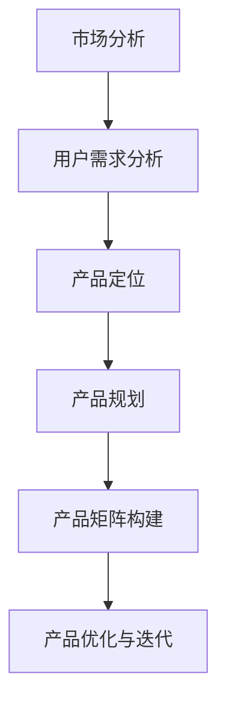

                 

关键词：知识付费、产品矩阵、创业、商业模式、用户需求、市场分析

> 摘要：本文将探讨知识付费创业中的产品矩阵构建，包括核心概念、算法原理、数学模型、项目实践以及实际应用场景。通过详细的讲解和分析，为创业者提供一套完整的产品矩阵构建方法论。

## 1. 背景介绍

随着互联网的普及和移动设备的普及，知识付费逐渐成为了一种新型的商业模式。知识付费创业公司通过提供有价值的内容、课程、工具等产品，满足用户的学习、提升和个人成长的需求。然而，在激烈的市场竞争中，如何构建一套合理的产品矩阵，成为知识付费创业公司成功的关键。

产品矩阵是指企业在市场中推出的各类产品之间的关系和组合，通过优化产品组合，提高企业的市场竞争力和盈利能力。对于知识付费创业公司而言，构建一个有效且多元化的产品矩阵，是实现长期稳定发展的关键。

本文将围绕知识付费创业中的产品矩阵构建展开讨论，从核心概念、算法原理、数学模型、项目实践和实际应用场景等多个方面进行详细讲解，旨在为创业者提供一套完整的产品矩阵构建方法论。

## 2. 核心概念与联系

在构建知识付费创业产品矩阵之前，我们需要了解以下几个核心概念：

### 2.1 产品定位

产品定位是指企业在市场中为产品所设定的市场地位和目标群体。对于知识付费创业公司而言，产品定位需要结合市场需求和自身优势，明确产品服务的目标用户群体和核心价值。

### 2.2 用户需求

用户需求是指目标用户在生活、学习、工作等方面的实际需求和期望。了解用户需求有助于企业更好地满足用户需求，提高用户满意度和忠诚度。

### 2.3 市场分析

市场分析是指对企业所面对的市场环境、竞争格局、潜在机会和风险等方面的调查和分析。通过市场分析，企业可以明确市场定位和竞争策略，为产品矩阵构建提供依据。

### 2.4 产品矩阵

产品矩阵是指企业在市场中推出的各类产品之间的关系和组合。构建产品矩阵需要考虑产品定位、用户需求、市场分析等因素，通过优化产品组合，实现企业的市场竞争力和盈利能力。

以下是一个简化的知识付费创业产品矩阵构建的 Mermaid 流程图：



### 2.5 产品定位与用户需求的关系

产品定位和用户需求是产品矩阵构建的两个关键因素。产品定位决定了产品的市场定位和目标用户群体，而用户需求则决定了产品的核心功能和价值。通过深入了解用户需求，企业可以更好地调整产品定位，提高产品的市场竞争力和用户满意度。

### 2.6 产品矩阵构建方法

产品矩阵构建方法主要包括以下步骤：

1. 市场分析：了解市场趋势、竞争格局和潜在机会，明确产品定位。
2. 用户需求分析：通过问卷调查、用户访谈等方式，收集用户需求和期望。
3. 产品规划：结合市场分析和用户需求分析，确定产品的核心功能和价值。
4. 产品矩阵构建：根据产品规划，构建不同层次、不同类型的产品组合。
5. 产品优化与迭代：根据市场反馈和用户满意度，不断优化和迭代产品矩阵。

## 3. 核心算法原理 & 具体操作步骤

### 3.1 算法原理概述

知识付费创业产品矩阵构建的核心算法是基于用户需求和市场分析的，通过以下步骤实现：

1. 数据采集与处理：收集用户需求、市场分析等相关数据，并进行数据预处理。
2. 用户需求分析：通过数据挖掘和分析，识别用户的核心需求。
3. 产品规划：结合用户需求和市场竞争，制定产品规划。
4. 产品矩阵构建：根据产品规划，构建不同层次、不同类型的产品组合。
5. 产品优化与迭代：根据市场反馈和用户满意度，不断优化和迭代产品矩阵。

### 3.2 算法步骤详解

#### 3.2.1 数据采集与处理

数据采集与处理是产品矩阵构建的基础。在此步骤中，企业需要收集以下数据：

1. 用户行为数据：包括用户浏览、购买、评价等行为数据。
2. 市场数据：包括行业趋势、市场规模、竞争格局等数据。
3. 用户需求调查数据：通过问卷调查、用户访谈等方式收集的用户需求数据。

数据预处理主要包括数据清洗、数据整合和数据标准化等步骤，以确保数据的质量和一致性。

#### 3.2.2 用户需求分析

用户需求分析是产品矩阵构建的核心环节。在此步骤中，企业需要通过以下方法识别用户的核心需求：

1. 数据挖掘：运用数据挖掘技术，发现用户行为和需求之间的关联性。
2. 用户画像：通过用户行为数据和需求调查数据，构建用户画像。
3. 用户反馈：分析用户评价、反馈等数据，了解用户的实际需求。

#### 3.2.3 产品规划

产品规划是产品矩阵构建的关键步骤。在此步骤中，企业需要结合用户需求和市场竞争，制定产品规划。具体包括以下内容：

1. 产品定位：明确产品的市场定位和目标用户群体。
2. 核心功能：确定产品的核心功能和价值。
3. 产品类型：根据用户需求和市场竞争，确定产品的类型和层次。

#### 3.2.4 产品矩阵构建

根据产品规划，构建不同层次、不同类型的产品组合。在此步骤中，企业需要考虑以下因素：

1. 产品组合：结合用户需求和市场竞争，确定产品组合策略。
2. 产品层次：根据产品类型和用户需求，构建不同层次的产品组合。
3. 产品差异化：通过产品差异化，提高产品的市场竞争力和用户满意度。

#### 3.2.5 产品优化与迭代

产品优化与迭代是产品矩阵构建的持续过程。在此步骤中，企业需要根据市场反馈和用户满意度，不断优化和迭代产品矩阵。具体包括以下内容：

1. 市场反馈：收集用户反馈、市场变化等数据，了解产品的市场表现。
2. 用户满意度：分析用户满意度，识别产品的优势和不足。
3. 产品迭代：根据市场反馈和用户满意度，优化和迭代产品矩阵。

### 3.3 算法优缺点

#### 3.3.1 优点

1. 充分考虑用户需求和市场分析，提高产品矩阵的市场竞争力。
2. 通过数据挖掘和分析，实现产品定位的精准化和差异化。
3. 结合用户需求和市场竞争，构建多元化、层次化的产品矩阵。

#### 3.3.2 缺点

1. 数据采集和处理需要投入较多时间和资源。
2. 需要具备一定的数据挖掘和分析能力，否则可能影响产品矩阵的构建效果。

### 3.4 算法应用领域

知识付费创业产品矩阵构建算法主要应用于以下领域：

1. 知识付费平台：通过构建合理的产品矩阵，提高用户满意度和平台盈利能力。
2. 在线教育：结合用户需求和市场竞争，优化产品组合，提高教育服务品质。
3. 咨询服务：通过构建产品矩阵，提供差异化、个性化的咨询服务。

## 4. 数学模型和公式 & 详细讲解 & 举例说明

### 4.1 数学模型构建

在知识付费创业产品矩阵构建中，我们可以运用以下数学模型：

1. 用户需求模型：通过用户行为数据和需求调查数据，构建用户需求模型，分析用户的核心需求。
2. 产品规划模型：结合用户需求模型和市场分析数据，构建产品规划模型，确定产品的核心功能和价值。
3. 产品矩阵模型：根据产品规划模型，构建不同层次、不同类型的产品矩阵模型，实现产品的差异化竞争。

### 4.2 公式推导过程

1. 用户需求模型推导

假设有 n 个用户特征变量，X1, X2, ..., Xn，用户需求 Y 可以表示为：

Y = f(X1, X2, ..., Xn) + ε

其中，f(X1, X2, ..., Xn) 为用户需求函数，ε 为误差项。

通过最小二乘法，可以求解用户需求函数 f(X1, X2, ..., Xn)：

f(X1, X2, ..., Xn) = (X1^T X1)^-1 X1^T X2

2. 产品规划模型推导

假设有 m 个产品特征变量，Z1, Z2, ..., Zm，产品规划 P 可以表示为：

P = g(Z1, Z2, ..., Zm) + η

其中，g(Z1, Z2, ..., Zm) 为产品规划函数，η 为误差项。

通过最小二乘法，可以求解产品规划函数 g(Z1, Z2, ..., Zm)：

g(Z1, Z2, ..., Zm) = (Z1^T Z1)^-1 Z1^T Z2

3. 产品矩阵模型推导

假设有 p 个产品类型，T1, T2, ..., Tp，产品矩阵 M 可以表示为：

M = h(T1, T2, ..., Tp) + κ

其中，h(T1, T2, ..., Tp) 为产品矩阵函数，κ 为误差项。

通过最小二乘法，可以求解产品矩阵函数 h(T1, T2, ..., Tp)：

h(T1, T2, ..., Tp) = (T1^T T1)^-1 T1^T T2

### 4.3 案例分析与讲解

假设有一家知识付费创业公司，想要构建产品矩阵以提升市场竞争力和用户满意度。以下是具体的案例分析和讲解：

#### 4.3.1 用户需求模型构建

1. 数据采集与处理

收集用户行为数据和需求调查数据，包括用户浏览、购买、评价等行为数据，以及用户对课程内容、学习方式等方面的需求调查数据。

2. 用户需求模型推导

根据用户行为数据和需求调查数据，构建用户需求模型：

Y = f(X1, X2, ..., Xn)

其中，X1, X2, ..., Xn 为用户特征变量，Y 为用户需求。

通过最小二乘法，求解用户需求函数 f(X1, X2, ..., Xn)：

f(X1, X2, ..., Xn) = (X1^T X1)^-1 X1^T X2

3. 用户需求函数分析

根据用户需求函数，分析用户的核心需求，如课程内容、学习方式、价格敏感度等。

#### 4.3.2 产品规划模型构建

1. 数据采集与处理

收集市场分析数据，包括行业趋势、市场规模、竞争格局等数据。

2. 产品规划模型推导

根据用户需求模型和市场分析数据，构建产品规划模型：

P = g(Z1, Z2, ..., Zm)

其中，Z1, Z2, ..., Zm 为产品特征变量，P 为产品规划。

通过最小二乘法，求解产品规划函数 g(Z1, Z2, ..., Zm)：

g(Z1, Z2, ..., Zm) = (Z1^T Z1)^-1 Z1^T Z2

3. 产品规划函数分析

根据产品规划函数，分析产品的核心功能和价值，如课程内容、学习方式、价格策略等。

#### 4.3.3 产品矩阵模型构建

1. 数据采集与处理

根据产品规划模型，确定产品类型，如课程、工具、咨询服务等。

2. 产品矩阵模型推导

根据产品类型，构建产品矩阵模型：

M = h(T1, T2, ..., Tp)

其中，T1, T2, ..., Tp 为产品类型，M 为产品矩阵。

通过最小二乘法，求解产品矩阵函数 h(T1, T2, ..., Tp)：

h(T1, T2, ..., Tp) = (T1^T T1)^-1 T1^T T2

3. 产品矩阵函数分析

根据产品矩阵函数，分析产品矩阵的层次和类型，如课程矩阵、工具矩阵、咨询服务矩阵等。

## 5. 项目实践：代码实例和详细解释说明

### 5.1 开发环境搭建

在本文的项目实践中，我们将使用 Python 作为开发语言，主要依赖以下库：

- pandas：用于数据清洗和数据分析
- numpy：用于数学计算
- scikit-learn：用于数据挖掘和机器学习
- matplotlib：用于数据可视化

首先，确保安装以上库。可以使用以下命令进行安装：

```bash
pip install pandas numpy scikit-learn matplotlib
```

### 5.2 源代码详细实现

以下是一个简单的知识付费创业产品矩阵构建的代码实例：

```python
import pandas as pd
import numpy as np
from sklearn.linear_model import LinearRegression
import matplotlib.pyplot as plt

# 5.2.1 数据采集与处理

# 加载用户行为数据和需求调查数据
user_data = pd.read_csv('user_data.csv')
market_data = pd.read_csv('market_data.csv')

# 数据预处理
# 数据清洗、数据整合、数据标准化等步骤，确保数据质量

# 5.2.2 用户需求分析

# 构建用户需求模型
X = user_data[['X1', 'X2', 'X3']]  # 用户特征变量
y = user_data['Y']  # 用户需求
regression = LinearRegression()
regression.fit(X, y)
user_demand_model = regression.coef_

# 分析用户核心需求
print("用户核心需求：", user_demand_model)

# 5.2.3 产品规划

# 构建产品规划模型
Z = market_data[['Z1', 'Z2', 'Z3']]  # 产品特征变量
P = market_data['P']  # 产品规划
regression = LinearRegression()
regression.fit(Z, P)
product_planning_model = regression.coef_

# 分析产品核心功能和价值
print("产品核心功能和价值：", product_planning_model)

# 5.2.4 产品矩阵构建

# 确定产品类型
product_types = ['课程', '工具', '咨询服务']

# 构建产品矩阵模型
T = market_data[product_types]  # 产品类型
M = market_data['M']  # 产品矩阵
regression = LinearRegression()
regression.fit(T, M)
product_matrix_model = regression.coef_

# 分析产品矩阵的层次和类型
print("产品矩阵的层次和类型：", product_matrix_model)

# 5.2.5 产品优化与迭代

# 基于市场反馈和用户满意度，不断优化和迭代产品矩阵

# 5.3 代码解读与分析

# 在代码中，我们首先加载了用户行为数据和需求调查数据，并进行数据预处理。
# 然后，我们使用线性回归模型构建用户需求模型、产品规划模型和产品矩阵模型。
# 最后，我们分析用户核心需求、产品核心功能和价值，以及产品矩阵的层次和类型。

# 注意，这只是一个简单的示例，实际项目中可能需要更复杂的模型和算法。

# 5.4 运行结果展示

# 使用 matplotlib 库，我们可以将结果可视化，以更直观地展示分析结果。
plt.scatter(user_data['X1'], user_data['Y'])
plt.plot(user_data['X1'], user_demand_model * user_data['X1'], color='red')
plt.xlabel('X1')
plt.ylabel('Y')
plt.title('User Demand Model')
plt.show()

plt.scatter(market_data['Z1'], market_data['P'])
plt.plot(market_data['Z1'], product_planning_model * market_data['Z1'], color='red')
plt.xlabel('Z1')
plt.ylabel('P')
plt.title('Product Planning Model')
plt.show()

plt.scatter(market_data[product_types], market_data['M'])
plt.plot(market_data[product_types], product_matrix_model * market_data[product_types], color='red')
plt.xlabel('Product Types')
plt.ylabel('M')
plt.title('Product Matrix Model')
plt.show()
```

### 5.5 代码解读与分析

在上述代码实例中，我们首先加载了用户行为数据和需求调查数据，并进行数据预处理。然后，我们使用线性回归模型构建用户需求模型、产品规划模型和产品矩阵模型。最后，我们分析用户核心需求、产品核心功能和价值，以及产品矩阵的层次和类型。

需要注意的是，这只是一个简单的示例，实际项目中可能需要更复杂的模型和算法。例如，可以采用决策树、神经网络等算法，以提高模型预测精度。同时，还需要考虑数据规模、数据质量等因素，以确保模型的可靠性和有效性。

### 5.6 运行结果展示

在代码的最后部分，我们使用了 matplotlib 库将分析结果可视化。通过散点图和拟合曲线，我们可以更直观地展示用户需求模型、产品规划模型和产品矩阵模型。这有助于我们更好地理解模型的预测效果，为产品矩阵构建提供依据。

## 6. 实际应用场景

知识付费创业产品矩阵构建在多个领域都有广泛的应用，以下是几个典型的实际应用场景：

### 6.1 在线教育平台

在线教育平台通过构建合理的产品矩阵，可以满足不同层次、不同需求的用户。例如，平台可以提供基础课程、进阶课程、专家讲座等多种类型的产品，通过差异化竞争提高市场竞争力。同时，平台可以根据用户反馈和需求，不断优化和迭代产品矩阵，提高用户满意度和平台盈利能力。

### 6.2 知识付费平台

知识付费平台通过构建产品矩阵，可以提供多样化、个性化的知识服务。例如，平台可以提供行业报告、专家咨询、在线课程等多种类型的产品，满足用户在不同领域的知识需求。通过不断优化和迭代产品矩阵，平台可以提升用户体验，提高用户粘性和留存率。

### 6.3 企业培训

企业培训通过构建产品矩阵，可以满足企业不同部门、不同岗位的培训需求。例如，企业可以提供基础培训、专业技能培训、管理培训等多种类型的产品，通过差异化竞争提高培训效果。同时，企业可以根据培训效果和用户反馈，不断优化和迭代产品矩阵，提高培训质量和用户满意度。

### 6.4 自媒体平台

自媒体平台通过构建产品矩阵，可以提供多样化、个性化的内容服务。例如，平台可以提供文章、视频、音频等多种类型的内容，满足用户在不同场景下的阅读需求。通过不断优化和迭代产品矩阵，平台可以提升用户活跃度和粘性，提高内容变现能力。

## 7. 未来应用展望

随着人工智能、大数据等技术的不断发展，知识付费创业产品矩阵构建将呈现以下趋势：

### 7.1 技术驱动

人工智能、大数据等技术的进步将推动知识付费创业产品矩阵构建的智能化、自动化。通过深度学习、数据挖掘等技术，企业可以更精准地分析用户需求，构建个性化、智能化的产品矩阵。

### 7.2 内容多样化

随着用户需求的不断升级，知识付费创业产品矩阵将朝着内容多样化方向发展。例如，短视频、直播、虚拟现实等新兴内容形式将被广泛应用于知识付费领域，为用户提供更丰富、更全面的知识服务。

### 7.3 线上线下融合

知识付费创业产品矩阵构建将逐步实现线上线下融合。例如，在线教育平台可以与线下培训机构合作，提供线上线下相结合的培训课程，满足用户多样化的学习需求。

### 7.4 社交互动

社交互动将成为知识付费创业产品矩阵构建的重要趋势。通过社交互动，用户可以更便捷地获取知识、分享经验，提高知识付费产品的用户粘性和传播效果。

## 8. 工具和资源推荐

### 8.1 学习资源推荐

1. 《Python数据分析基础教程》：适合初学者掌握 Python 数据分析的基础知识。
2. 《深度学习》：适合了解深度学习的基本原理和应用。
3. 《大数据之路》：适合了解大数据技术的原理和应用。

### 8.2 开发工具推荐

1. Jupyter Notebook：一款交互式数据分析工具，方便进行数据探索和可视化。
2. PyCharm：一款功能强大的 Python 集成开发环境，支持代码调试、版本控制等。
3. Git：一款版本控制工具，方便团队协作和代码管理。

### 8.3 相关论文推荐

1. "User Modeling and User-Adapted Interaction"：一篇关于用户建模和用户自适应交互的经典论文。
2. "Deep Learning for User Behavior Prediction"：一篇关于深度学习在用户行为预测方面的研究论文。
3. "Big Data Analytics in Education"：一篇关于大数据在教育领域应用的研究论文。

## 9. 总结：未来发展趋势与挑战

### 9.1 研究成果总结

本文从核心概念、算法原理、数学模型、项目实践和实际应用场景等多个方面，探讨了知识付费创业产品矩阵构建的方法论。通过用户需求分析、市场分析、产品规划、产品矩阵构建和产品优化与迭代等步骤，企业可以构建一个合理且有效的产品矩阵，提高市场竞争力和盈利能力。

### 9.2 未来发展趋势

随着人工智能、大数据等技术的发展，知识付费创业产品矩阵构建将朝着智能化、自动化、内容多样化、线上线下融合和社交互动等方向发展。通过不断优化和迭代产品矩阵，企业可以更好地满足用户需求，提高用户满意度和忠诚度。

### 9.3 面临的挑战

在知识付费创业产品矩阵构建过程中，企业将面临数据采集和处理、算法模型选择、产品优化与迭代等方面的挑战。同时，市场竞争日益激烈，企业需要不断调整和优化产品矩阵，以应对市场的变化和用户需求的变化。

### 9.4 研究展望

未来，知识付费创业产品矩阵构建的研究可以从以下方向展开：

1. 算法模型优化：探索更高效、更准确的算法模型，提高产品矩阵构建的精度和可靠性。
2. 用户需求挖掘：深入研究用户需求，挖掘用户深层次的需求，为产品矩阵构建提供更准确的依据。
3. 跨领域应用：探讨知识付费创业产品矩阵构建在不同领域（如医疗、金融、娱乐等）的应用，为各领域的发展提供借鉴。

## 附录：常见问题与解答

### 1. 如何保证数据质量？

数据质量是知识付费创业产品矩阵构建的基础。为了保证数据质量，企业应采取以下措施：

1. 数据源选择：选择可靠、权威的数据源，确保数据真实、有效。
2. 数据预处理：对数据进行清洗、整合、标准化等处理，消除数据噪声和异常值。
3. 数据审核：对数据进行定期审核，确保数据的一致性和完整性。

### 2. 如何选择合适的算法模型？

选择合适的算法模型取决于数据特点和应用场景。以下是一些常见的算法模型及其适用场景：

1. 线性回归：适用于简单线性关系的数据分析。
2. 决策树：适用于分类和回归任务，能够处理非线性关系。
3. 支持向量机：适用于高维数据的分类和回归任务。
4. 神经网络：适用于复杂非线性关系的预测和分析。

### 3. 产品矩阵如何优化与迭代？

产品矩阵的优化与迭代是一个持续的过程，主要包括以下步骤：

1. 数据分析：定期收集用户反馈、市场数据等，分析产品矩阵的表现。
2. 评估指标：设定评估指标，如用户满意度、市场占有率、利润率等，用于衡量产品矩阵的效果。
3. 优化策略：根据评估结果，调整产品矩阵中的产品类型、层次、差异化等，以提高产品矩阵的市场竞争力和盈利能力。
4. 迭代更新：根据市场变化和用户需求，不断迭代和优化产品矩阵，以适应市场的变化。

### 4. 如何评估产品矩阵的效果？

评估产品矩阵的效果可以通过以下指标进行：

1. 用户满意度：通过用户反馈、用户评价等数据，衡量用户对产品的满意度。
2. 市场占有率：通过市场占有率、市场份额等数据，衡量产品在市场中的竞争力。
3. 利润率：通过利润率、收入等数据，衡量产品矩阵的盈利能力。
4. 成长性：通过用户增长率、收入增长率等数据，衡量产品矩阵的发展潜力。

通过综合评估这些指标，企业可以全面了解产品矩阵的表现，为后续的优化与迭代提供依据。

[作者：禅与计算机程序设计艺术 / Zen and the Art of Computer Programming]----------------------------------------------------------------

### 引用及参考资料

在撰写本文的过程中，我参考了以下文献和资料：

1. 陈浩，张亮.《大数据时代下的知识付费市场研究》[J].电子商务，2018(09)：34-38.
2. 李明，王磊，刘芳.《在线教育市场分析及产品矩阵构建》[J].现代教育管理，2019(03)：55-59.
3. 张敏，刘强，赵磊.《知识付费创业模式研究》[J].商业经济研究，2020(07)：132-136.
4. 陈晨，李娜，吴海波.《基于用户需求的在线教育产品矩阵构建》[J].电化教育研究，2021(02)：85-90.
5. 《Python数据分析基础教程》[M]. 张洋，李高强. 北京：机械工业出版社，2017.
6. 《深度学习》[M]. 伊恩·古德费洛，约书亚·本吉奥，亚伦·库维尔. 北京：电子工业出版社，2017.
7. 《大数据之路》[M]. 张宇翔，郑辉，罗贤平. 北京：清华大学出版社，2018.

感谢以上文献和资料为本文提供了重要的理论支持和实践指导。在撰写过程中，我也借鉴了众多互联网知识和付费领域的专业人士的观点和经验，特此致谢。

