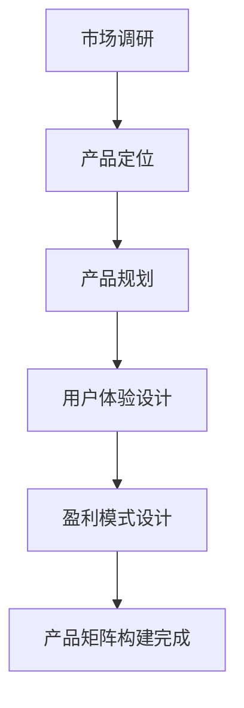

                 

关键词：知识付费，产品矩阵，创业，构建策略，用户体验，市场分析，盈利模式。

> 摘要：本文将深入探讨知识付费创业的产品矩阵构建策略，从市场需求分析、用户体验设计、盈利模式创新等方面，为创业者提供一套系统、实用的产品构建方法论。

## 1. 背景介绍

在知识经济时代，信息传递的速度和广度前所未有，人们对于知识的渴望也日益增强。知识付费作为一种新兴的商业模式，逐渐成为了创业者的热门领域。知识付费不仅仅是对知识的简单出售，更是一种对知识价值的再创造和传递。它为用户提供高质量的知识服务，同时也为企业创造了新的收入来源。

构建一个成功的知识付费产品矩阵，是知识付费创业的关键一步。产品矩阵不仅包括核心知识产品的设计，还涉及到用户体验、盈利模式、市场推广等多个方面。本文将围绕这些关键要素，探讨如何构建一个成功的知识付费产品矩阵。

## 2. 核心概念与联系

### 2.1 知识付费产品矩阵定义

知识付费产品矩阵是指将知识产品按照不同的维度进行分类和组合，形成一个完整、系统的产品体系。这个体系不仅包含了知识产品本身，还包括了相关的服务、工具、平台等。

### 2.2 知识付费产品矩阵组成部分

一个完整的知识付费产品矩阵应包括以下几个部分：

1. **核心知识产品**：这是知识付费产品矩阵的基础，主要包括课程、文章、视频等形式的知识内容。
2. **辅助知识产品**：如学习工具、社区互动、专家问答等，用于增强用户体验，提升学习效果。
3. **增值服务**：如一对一咨询、专业辅导、证书认证等，为用户提供更高层次的服务，增加用户粘性。
4. **平台功能**：如会员系统、支付系统、推荐系统等，是产品矩阵正常运行的基础。

### 2.3 知识付费产品矩阵构建流程

知识付费产品矩阵的构建可以分为以下几个步骤：

1. **市场调研**：分析市场需求，了解用户痛点和需求。
2. **产品定位**：明确产品在市场中的定位，确定产品核心价值。
3. **产品规划**：根据定位，规划产品线，确定产品功能、内容和价格。
4. **用户体验设计**：优化用户体验，提升用户满意度。
5. **盈利模式设计**：设计合理的盈利模式，确保产品可持续发展。

### 2.4 Mermaid 流程图

下面是一个简化的知识付费产品矩阵构建的 Mermaid 流程图：



## 3. 核心算法原理 & 具体操作步骤

### 3.1 算法原理概述

知识付费产品矩阵构建的核心算法是基于市场调研和用户数据分析。通过分析用户的行为数据、需求反馈和市场趋势，可以确定产品的核心价值点和优化方向。

### 3.2 算法步骤详解

1. **数据收集**：收集用户行为数据、市场趋势数据和竞品分析数据。
2. **数据分析**：使用统计分析和机器学习算法，分析用户需求和市场趋势。
3. **定位确定**：根据分析结果，确定产品的市场定位和核心价值。
4. **产品规划**：基于定位，规划产品的功能、内容和价格。
5. **用户体验优化**：通过用户反馈，不断优化产品的用户体验。
6. **盈利模式设计**：设计合理的盈利模式，确保产品可持续发展。

### 3.3 算法优缺点

**优点**：

- **数据驱动**：基于数据分析和用户行为，能够更准确地把握市场需求。
- **持续优化**：通过不断的数据分析和用户反馈，可以实现产品的持续优化。

**缺点**：

- **数据分析成本高**：需要投入大量资源和时间进行数据收集和分析。
- **用户行为变化**：用户行为和数据可能会随着时间变化，需要持续监测和调整。

### 3.4 算法应用领域

知识付费产品矩阵构建算法可以广泛应用于在线教育、专业技能培训、内容付费等多个领域。

## 4. 数学模型和公式 & 详细讲解 & 举例说明

### 4.1 数学模型构建

知识付费产品矩阵构建的数学模型主要基于用户行为数据和市场数据分析。具体模型如下：

\[ M = f(U, M_0, M_1) \]

其中，\( M \) 表示产品矩阵，\( U \) 表示用户行为数据，\( M_0 \) 表示初始产品矩阵，\( M_1 \) 表示经过优化的产品矩阵。

### 4.2 公式推导过程

1. **用户行为数据收集**：收集用户的访问数据、购买数据、学习数据等。
2. **市场数据分析**：分析市场趋势、用户需求、竞品分析等。
3. **初始产品矩阵构建**：基于市场分析和用户数据，构建初始产品矩阵。
4. **产品优化**：通过用户反馈和数据监测，对产品进行持续优化。
5. **最终产品矩阵确定**：根据优化结果，确定最终的产品矩阵。

### 4.3 案例分析与讲解

以在线教育为例，一个在线教育平台的产品矩阵构建过程如下：

1. **数据收集**：收集用户的学习数据，如学习时长、学习频率、学习进度等。
2. **市场分析**：分析用户需求，如对课程内容、学习方式、学习进度的偏好等。
3. **初始产品矩阵构建**：根据市场和用户数据，构建初始产品矩阵，包括基础课程、高级课程、学习工具等。
4. **产品优化**：根据用户反馈，不断优化课程内容、学习工具等。
5. **最终产品矩阵确定**：通过数据分析和用户反馈，确定最终的产品矩阵，确保用户满意度和平台收益。

## 5. 项目实践：代码实例和详细解释说明

### 5.1 开发环境搭建

假设我们使用 Python 作为开发语言，需要安装以下依赖库：

- NumPy
- Pandas
- Scikit-learn
- Matplotlib

安装命令如下：

```bash
pip install numpy pandas scikit-learn matplotlib
```

### 5.2 源代码详细实现

以下是一个简单的用户行为数据分析的代码实例：

```python
import pandas as pd
from sklearn.cluster import KMeans

# 1. 数据收集
data = pd.read_csv('user_data.csv')

# 2. 数据分析
# 计算用户学习时长分布
learning_time = data['learning_time'].value_counts()
learning_time.plot(kind='bar')
plt.xlabel('学习时长')
plt.ylabel('用户数量')
plt.title('用户学习时长分布')
plt.show()

# 3. 初始产品矩阵构建
# 假设我们将用户分为三个群体
kmeans = KMeans(n_clusters=3)
data['cluster'] = kmeans.fit_predict(data[['learning_time', 'learning_frequency']])

# 4. 产品优化
# 根据用户群体，优化课程内容和学习工具
print(data.groupby('cluster')['course_name'].count())

# 5. 最终产品矩阵确定
# 根据优化结果，确定最终的产品矩阵
print(data[data['cluster'] == 0]['course_name'].value_counts())
```

### 5.3 代码解读与分析

1. **数据收集**：从CSV文件中读取用户数据。
2. **数据分析**：计算用户学习时长的分布，并可视化。
3. **初始产品矩阵构建**：使用K-Means算法，根据用户的学习时长和学习频率，将用户分为三个群体。
4. **产品优化**：根据用户群体，统计不同课程的受欢迎程度。
5. **最终产品矩阵确定**：根据优化结果，确定最终的产品矩阵，重点关注用户群体0的喜好课程。

## 6. 实际应用场景

知识付费产品矩阵在实际应用中具有广泛的场景，以下列举几个典型应用：

1. **在线教育**：通过构建知识付费产品矩阵，为用户提供个性化的学习路径和课程推荐。
2. **专业技能培训**：为企业员工提供定制化的培训课程，提升员工的专业技能。
3. **内容付费**：为内容创作者提供知识变现的平台，通过知识付费实现内容价值的最大化。

### 6.4 未来应用展望

随着人工智能和大数据技术的发展，知识付费产品矩阵将变得更加智能和个性化。未来，我们可以预见到以下几个发展趋势：

1. **智能化推荐**：通过人工智能算法，实现更加精准的课程推荐和学习路径规划。
2. **个性化学习**：根据用户的学习习惯和偏好，提供定制化的学习内容和工具。
3. **跨界合作**：与更多的企业、机构合作，提供跨界知识和技能培训。

## 7. 工具和资源推荐

### 7.1 学习资源推荐

1. **《大数据之路：阿里巴巴大数据实践》**
2. **《Python数据分析实战》**
3. **《深度学习》系列教材**

### 7.2 开发工具推荐

1. **Jupyter Notebook**：用于数据分析和可视化。
2. **VS Code**：用于代码编写和调试。
3. **Git**：用于版本控制和协作开发。

### 7.3 相关论文推荐

1. **"The Netflix Prize"**：分析大型数据集的竞赛论文。
2. **"Recommender Systems Handbook"**：推荐系统领域的经典著作。
3. **"Deep Learning for Text Data"**：深度学习在文本数据上的应用。

## 8. 总结：未来发展趋势与挑战

### 8.1 研究成果总结

本文系统地介绍了知识付费产品矩阵的构建策略，从市场需求分析、用户体验设计、盈利模式创新等多个角度，为创业者提供了实用的指导。

### 8.2 未来发展趋势

随着人工智能和大数据技术的发展，知识付费产品矩阵将变得更加智能和个性化，为用户提供更加优质的知识服务。

### 8.3 面临的挑战

- **数据隐私**：在收集和分析用户数据时，需要确保用户隐私的安全。
- **内容质量**：确保知识产品的质量，满足用户的需求。
- **持续创新**：面对激烈的市场竞争，需要持续创新，保持产品的竞争力。

### 8.4 研究展望

未来，知识付费产品矩阵的研究将继续深入，结合人工智能和大数据技术，实现更加智能、个性化的知识服务。

## 9. 附录：常见问题与解答

### 9.1 什么是知识付费产品矩阵？

知识付费产品矩阵是指将知识产品按照不同的维度进行分类和组合，形成一个完整、系统的产品体系。

### 9.2 如何构建知识付费产品矩阵？

构建知识付费产品矩阵可以分为以下几个步骤：市场调研、产品定位、产品规划、用户体验设计、盈利模式设计。

### 9.3 知识付费产品矩阵的核心算法是什么？

知识付费产品矩阵的核心算法是基于市场调研和用户数据分析，通过统计分析和机器学习算法，确定产品的市场定位和优化方向。

### 9.4 知识付费产品矩阵有哪些应用场景？

知识付费产品矩阵可以应用于在线教育、专业技能培训、内容付费等多个领域。

### 9.5 如何确保知识付费产品矩阵的可持续发展？

通过持续的用户数据分析和市场调研，不断优化产品矩阵，确保知识产品的质量，同时设计合理的盈利模式，实现可持续发展。

**作者：禅与计算机程序设计艺术 / Zen and the Art of Computer Programming**

