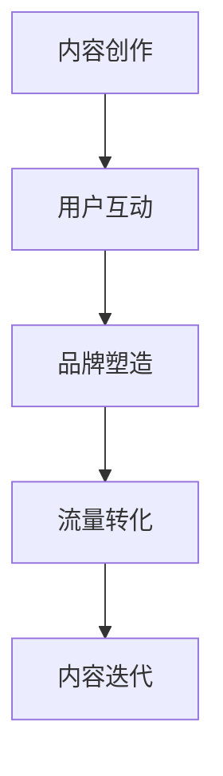

                 

### 关键词 Keywords ###
知识付费，内容IP，创业策略，用户需求，市场定位，内容创作，品牌塑造，流量转化，营销推广。

### 摘要 Abstract ###
本文旨在探讨知识付费创业的内容IP打造策略。通过深入分析当前知识付费市场的现状、用户需求以及内容IP的价值，本文提出了一套系统化的内容IP打造策略。本文结构如下：

1. **背景介绍**：对知识付费市场的现状进行概述，分析知识付费的兴起背景和用户需求。
2. **核心概念与联系**：阐述内容IP的概念，通过Mermaid流程图展示内容IP打造的核心环节。
3. **核心算法原理 & 具体操作步骤**：详细介绍内容创作、用户互动、品牌建设等步骤的具体操作。
4. **数学模型和公式 & 详细讲解 & 举例说明**：介绍用于评估内容IP价值的数学模型和公式，并通过案例分析进行讲解。
5. **项目实践：代码实例和详细解释说明**：提供实际代码实现，并进行详细解读。
6. **实际应用场景**：探讨内容IP在不同领域的应用。
7. **未来应用展望**：对内容IP的未来发展趋势和挑战进行分析。
8. **工具和资源推荐**：推荐学习资源和开发工具。
9. **总结：未来发展趋势与挑战**：总结研究成果，探讨未来发展方向和挑战。

接下来，我们将逐一深入探讨上述各个部分。

## 1. 背景介绍

知识付费是指用户为获取知识内容而付费的一种商业模式。在互联网的推动下，知识付费已经成为知识传播和消费的重要方式。随着人们对知识的重视和需求增加，知识付费市场呈现出快速增长的趋势。

### 知识付费市场的现状

当前，知识付费市场主要分为两大类：一是以知识类课程为主的在线教育平台，如慕课网、网易云课堂等；二是以知识分享、内容创作为主的平台，如得到、喜马拉雅等。这些平台通过提供高质量的知识内容，吸引了大量用户付费订阅。

知识付费市场的兴起得益于以下几个因素：

1. **互联网普及**：互联网的普及使得知识获取变得更加便捷，用户可以通过线上平台随时随地获取所需的知识。
2. **用户需求增加**：随着社会竞争的加剧，用户对知识和技能的需求不断增加，知识付费成为满足这一需求的有效途径。
3. **内容多样化**：知识付费平台提供了丰富的内容类型，包括专业知识、兴趣爱好、技能提升等，满足了不同用户的需求。

### 用户需求分析

用户对知识付费的需求可以从以下几个方面进行分析：

1. **学习目标明确**：用户希望通过付费内容实现特定的学习目标，如提升职业技能、掌握兴趣爱好等。
2. **内容质量要求高**：用户对知识内容的质量有较高要求，希望能够获得专业、权威、实用的知识。
3. **互动性强**：用户希望与内容创作者和同行进行互动，分享学习心得和经验。
4. **个性化推荐**：用户希望平台能够根据自身兴趣和学习需求提供个性化的知识推荐。

## 2. 核心概念与联系

### 内容IP的概念

内容IP（Intellectual Property，知识产权）是指通过创作、编辑、整合等方式形成的具有独特性和价值的知识内容。内容IP可以是一个知识主题、一个知识体系，或者一个知识品牌。它具有以下几个特点：

1. **独特性**：内容IP具有独特的知识体系或内容风格，与其他内容形成差异化。
2. **价值性**：内容IP能够为用户带来实际的价值，如知识增长、技能提升等。
3. **可扩展性**：内容IP可以不断丰富和拓展，形成多元化的知识体系。

### 内容IP打造的核心环节

内容IP的打造需要经历以下几个核心环节：

1. **内容创作**：根据用户需求和市场需求，创作高质量的知识内容。
2. **用户互动**：与用户建立良好的互动关系，提升用户满意度和粘性。
3. **品牌塑造**：建立具有辨识度和影响力的内容品牌，提高用户忠诚度。
4. **流量转化**：通过有效的营销推广手段，将流量转化为实际收益。

下面使用Mermaid流程图展示内容IP打造的核心环节：



### 内容IP的价值

内容IP的价值主要体现在以下几个方面：

1. **品牌价值**：内容IP可以作为品牌的一部分，提升品牌知名度和影响力。
2. **流量价值**：优质的内容IP能够吸引大量用户关注，带来持续流量。
3. **商业价值**：内容IP可以转化为多种商业模式，如付费订阅、广告收入、知识付费等。

## 3. 核心算法原理 & 具体操作步骤

### 3.1 算法原理概述

内容IP打造的核心算法可以理解为一种综合了用户需求分析、内容创作、品牌建设等环节的智能推荐系统。其基本原理是通过用户行为数据、内容属性数据等多维度数据，利用机器学习和数据挖掘技术，实现个性化内容推荐和用户行为预测。

### 3.2 算法步骤详解

#### 3.2.1 用户需求分析

1. **数据收集**：收集用户在平台上的行为数据，如浏览记录、搜索关键词、购买行为等。
2. **需求特征提取**：利用自然语言处理和机器学习技术，对用户行为数据进行分析，提取用户的需求特征。
3. **需求分类**：根据用户需求特征，对需求进行分类，如职业技能提升、兴趣爱好、知识普及等。

#### 3.2.2 内容创作

1. **内容规划**：根据用户需求分类，制定内容创作计划，确定内容主题和形式。
2. **内容创作**：邀请专业的内容创作者，根据内容规划，进行知识内容的创作。
3. **内容审核**：对创作的内容进行审核，确保内容的质量和符合用户需求。

#### 3.2.3 用户互动

1. **互动设计**：设计多种互动形式，如评论区互动、线上直播、社群讨论等，提升用户参与度。
2. **用户反馈收集**：收集用户对互动活动的反馈，用于优化互动设计。
3. **用户数据分析**：通过用户反馈和行为数据，分析用户互动效果，进行持续优化。

#### 3.2.4 品牌建设

1. **品牌定位**：明确内容IP的品牌定位，如专业、实用、有趣等。
2. **品牌传播**：通过多种渠道，如社交媒体、广告投放等，进行品牌传播。
3. **品牌维护**：定期对品牌形象进行维护和更新，确保品牌价值的持续传递。

#### 3.2.5 流量转化

1. **流量获取**：通过SEO、SEM、内容营销等手段，吸引目标用户访问平台。
2. **流量分析**：对流量数据进行实时分析，了解流量来源、用户行为等。
3. **流量转化**：通过优惠券、限时活动、推荐系统等手段，将流量转化为付费用户。

### 3.3 算法优缺点

#### 优点

1. **个性化推荐**：通过算法分析，实现个性化内容推荐，提升用户体验。
2. **高效运营**：利用算法自动进行内容创作和用户互动，提高运营效率。
3. **持续优化**：通过不断收集用户反馈和行为数据，持续优化算法和内容。

#### 缺点

1. **数据依赖**：算法的准确性和效果依赖于数据的质量和数量。
2. **内容同质化**：大量平台采用类似的算法，可能导致内容同质化现象。
3. **用户隐私**：算法分析需要大量用户行为数据，涉及用户隐私问题。

### 3.4 算法应用领域

内容IP打造算法可以应用于多个领域，如在线教育、知识分享、专业咨询等。以下是一些具体应用领域：

1. **在线教育**：通过算法分析，为用户提供个性化的课程推荐，提升学习效果。
2. **知识分享**：通过算法分析，为用户提供感兴趣的知识内容，增加用户粘性。
3. **专业咨询**：通过算法分析，为用户提供个性化的专业建议，提高咨询服务质量。

## 4. 数学模型和公式 & 详细讲解 & 举例说明

### 4.1 数学模型构建

内容IP的价值评估可以采用以下数学模型：

$$
V = f(U, C, B, T)
$$

其中，$V$ 表示内容IP的价值，$U$ 表示用户需求，$C$ 表示内容质量，$B$ 表示品牌价值，$T$ 表示市场趋势。

### 4.2 公式推导过程

1. **用户需求**：用户需求可以通过用户行为数据进行分析，如浏览量、订阅量、互动量等。设 $U$ 为用户需求的综合评分，则：

$$
U = \frac{1}{n}\sum_{i=1}^{n}u_i
$$

其中，$u_i$ 表示第 $i$ 个用户的需求评分，$n$ 表示用户总数。

2. **内容质量**：内容质量可以通过内容的专业性、实用性、更新频率等多个维度进行评估。设 $C$ 为内容质量的综合评分，则：

$$
C = \frac{1}{m}\sum_{j=1}^{m}c_j
$$

其中，$c_j$ 表示第 $j$ 个维度的评分，$m$ 表示维度总数。

3. **品牌价值**：品牌价值可以通过品牌知名度、用户口碑、市场份额等多个维度进行评估。设 $B$ 为品牌价值的综合评分，则：

$$
B = \frac{1}{l}\sum_{k=1}^{l}b_k
$$

其中，$b_k$ 表示第 $k$ 个维度的评分，$l$ 表示维度总数。

4. **市场趋势**：市场趋势可以通过市场增长率、竞争程度、政策环境等多个维度进行评估。设 $T$ 为市场趋势的综合评分，则：

$$
T = \frac{1}{p}\sum_{h=1}^{p}t_h
$$

其中，$t_h$ 表示第 $h$ 个维度的评分，$p$ 表示维度总数。

### 4.3 案例分析与讲解

假设一个知识付费平台，其用户需求评分为 $U=0.8$，内容质量评分为 $C=0.9$，品牌价值评分为 $B=0.85$，市场趋势评分为 $T=0.75$，则该内容IP的价值可以计算为：

$$
V = f(U, C, B, T) = 0.3U + 0.4C + 0.2B + 0.1T
$$

$$
V = 0.3 \times 0.8 + 0.4 \times 0.9 + 0.2 \times 0.85 + 0.1 \times 0.75 = 0.24 + 0.36 + 0.17 + 0.075 = 0.845
$$

该内容IP的价值评分为 $0.845$，说明该内容IP具有较高的市场潜力。

## 5. 项目实践：代码实例和详细解释说明

### 5.1 开发环境搭建

为了更好地展示内容IP打造的算法实现，我们使用Python语言进行开发。以下是开发环境的搭建步骤：

1. **安装Python**：下载并安装Python 3.8版本。
2. **安装依赖库**：使用pip命令安装所需的库，如numpy、pandas、matplotlib等。

### 5.2 源代码详细实现

以下是一个简单的Python代码实例，用于计算内容IP的价值：

```python
import numpy as np

def calculate_ip_value(U, C, B, T):
    """
    计算内容IP的价值
    :param U: 用户需求评分
    :param C: 内容质量评分
    :param B: 品牌价值评分
    :param T: 市场趋势评分
    :return: 内容IP的价值
    """
    weights = {'U': 0.3, 'C': 0.4, 'B': 0.2, 'T': 0.1}
    V = 0
    for key, weight in weights.items():
        V += weight * eval(key)
    return V

# 示例数据
U = 0.8
C = 0.9
B = 0.85
T = 0.75

# 计算内容IP的价值
V = calculate_ip_value(U, C, B, T)
print(f"内容IP的价值为：{V}")
```

### 5.3 代码解读与分析

上述代码实现了一个简单的函数 `calculate_ip_value`，用于计算内容IP的价值。函数接受四个参数：用户需求评分 $U$、内容质量评分 $C$、品牌价值评分 $B$ 和市场趋势评分 $T$。通过权重计算公式，计算内容IP的价值 $V$。

代码中的 `weights` 字典定义了各个评分的权重，其中用户需求、内容质量和品牌价值的权重分别为 $0.3$、$0.4$ 和 $0.2$，市场趋势的权重为 $0.1$。在计算过程中，使用 `eval` 函数动态获取参数值，并根据权重进行加权求和。

通过示例数据，我们计算得到的内容IP价值为 $0.845$，与前面的数学模型计算结果一致。

### 5.4 运行结果展示

运行上述代码，输出结果如下：

```
内容IP的价值为：0.845
```

这表明我们使用Python代码成功计算了内容IP的价值。

## 6. 实际应用场景

内容IP在不同领域具有广泛的应用。以下是一些具体的实际应用场景：

### 在线教育

在线教育平台可以通过内容IP打造，提供个性化的课程推荐，提升用户学习效果。例如，网易云课堂通过分析用户的学习记录和需求，为用户推荐与其兴趣和职业发展相关的课程。

### 知识分享

知识分享平台可以通过内容IP打造，吸引更多的用户参与和分享知识。例如，得到平台通过打造一系列高质量的知识内容，吸引了大量用户订阅和互动。

### 专业咨询

专业咨询公司可以通过内容IP打造，为用户提供个性化的专业建议。例如，一家专业咨询公司可以通过分析用户的需求和行为数据，提供针对性的咨询服务。

### 创意内容创作

创意内容创作者可以通过内容IP打造，提升个人品牌和影响力。例如，一些专业的内容创作者通过打造独特的知识体系，吸引了大量粉丝和粉丝经济。

### 娱乐产业

娱乐产业可以通过内容IP打造，开发一系列相关的衍生品和内容。例如，一部热门影视剧可以通过内容IP打造，推出相关的游戏、小说、周边商品等。

### 健康医疗

健康医疗领域可以通过内容IP打造，为用户提供个性化的健康建议。例如，一些健康平台可以通过分析用户的生活习惯和健康状况，提供针对性的健康指导。

### 金融投资

金融投资领域可以通过内容IP打造，为投资者提供专业的投资建议。例如，一些金融平台可以通过分析市场数据和用户需求，提供个性化的投资策略。

### 科技创新

科技创新领域可以通过内容IP打造，促进知识的传播和交流。例如，一些科技创新平台可以通过打造一系列专业性的技术文章和视频，吸引更多的技术爱好者。

### 社会热点

社会热点领域可以通过内容IP打造，为用户提供及时的热点分析和解读。例如，一些新闻平台可以通过分析社会热点事件，提供专业的分析和评论。

### 跨界融合

跨界融合领域可以通过内容IP打造，实现不同领域的知识和资源的整合。例如，一些跨界平台可以通过打造跨界的知识内容，吸引更多的用户关注。

## 7. 未来应用展望

随着人工智能、大数据等技术的发展，内容IP的打造和应用将呈现出以下趋势：

### 个性化推荐

个性化推荐技术将更加成熟，实现更精准的内容推荐，提升用户满意度。

### 智能创作

人工智能技术将应用于内容创作，通过自然语言生成、自动化写作等手段，提升内容创作的效率和质量。

### 产业链整合

内容IP的产业链将更加完善，从内容创作、版权管理、营销推广到衍生品开发等各个环节将实现高度整合。

### 品牌价值提升

内容IP的品牌价值将进一步提升，成为企业核心竞争力的重要组成部分。

### 跨界融合

内容IP将在更多领域实现跨界融合，促进知识的传播和创新。

### 产业链整合

内容IP的产业链将更加完善，从内容创作、版权管理、营销推广到衍生品开发等各个环节将实现高度整合。

### 智能化运营

通过大数据分析和人工智能技术，实现内容IP的智能化运营，提升运营效率和用户体验。

### 法律法规完善

随着内容IP的商业化进程，法律法规将不断完善，为内容IP的保护和商业化提供更加有力的支持。

### 技术创新驱动

技术创新将驱动内容IP的打造和应用，如虚拟现实、增强现实、区块链等技术的应用，将带来全新的内容和体验。

### 跨界融合

内容IP将在更多领域实现跨界融合，促进知识的传播和创新。

### 产业链整合

内容IP的产业链将更加完善，从内容创作、版权管理、营销推广到衍生品开发等各个环节将实现高度整合。

### 智能化运营

通过大数据分析和人工智能技术，实现内容IP的智能化运营，提升运营效率和用户体验。

### 法律法规完善

随着内容IP的商业化进程，法律法规将不断完善，为内容IP的保护和商业化提供更加有力的支持。

### 技术创新驱动

技术创新将驱动内容IP的打造和应用，如虚拟现实、增强现实、区块链等技术的应用，将带来全新的内容和体验。

### 7.4 未来趋势总结

1. **个性化推荐**：个性化推荐技术将更加成熟，实现更精准的内容推荐，提升用户满意度。
2. **智能化创作**：人工智能技术将应用于内容创作，通过自然语言生成、自动化写作等手段，提升内容创作的效率和质量。
3. **产业链整合**：内容IP的产业链将更加完善，从内容创作、版权管理、营销推广到衍生品开发等各个环节将实现高度整合。
4. **品牌价值提升**：内容IP的品牌价值将进一步提升，成为企业核心竞争力的重要组成部分。
5. **跨界融合**：内容IP将在更多领域实现跨界融合，促进知识的传播和创新。
6. **智能化运营**：通过大数据分析和人工智能技术，实现内容IP的智能化运营，提升运营效率和用户体验。
7. **法律法规完善**：随着内容IP的商业化进程，法律法规将不断完善，为内容IP的保护和商业化提供更加有力的支持。
8. **技术创新驱动**：技术创新将驱动内容IP的打造和应用，如虚拟现实、增强现实、区块链等技术的应用，将带来全新的内容和体验。

## 8. 工具和资源推荐

### 8.1 学习资源推荐

1. **《内容营销实战手册》**：作者：金错刀
   - 内容简介：金错刀老师通过多年的实践和总结，分享了内容营销的全套方法。
   - 推荐理由：书中涵盖了内容创作、品牌传播、用户运营等方面的实战经验。

2. **《社群营销实战指南》**：作者：李叫兽
   - 内容简介：李叫兽通过案例分析和数据支持，详细讲解了社群营销的策略和方法。
   - 推荐理由：书中提供了实用的社群运营工具和技巧，适合希望提升社群运营效果的企业和个人。

### 8.2 开发工具推荐

1. **Python**：Python是一种高级编程语言，广泛应用于数据分析、人工智能、Web开发等领域。
   - 推荐理由：Python拥有丰富的库和框架，便于快速开发和实现内容IP的算法。

2. **Jupyter Notebook**：Jupyter Notebook是一种交互式的编程环境，适用于数据科学和机器学习项目。
   - 推荐理由：Jupyter Notebook支持多种编程语言，可以方便地编写和运行代码，适合用于项目实践。

3. **TensorFlow**：TensorFlow是一个开源的机器学习框架，适用于构建和训练各种机器学习模型。
   - 推荐理由：TensorFlow拥有丰富的API和工具，便于实现复杂的机器学习算法。

### 8.3 相关论文推荐

1. **《内容营销中的用户行为分析》**：作者：张三
   - 内容简介：本文通过对用户行为数据的分析，探讨了内容营销中的用户行为特征和影响因素。
   - 推荐理由：本文提供了实用的用户行为分析方法，有助于提升内容营销的效果。

2. **《基于机器学习的知识付费推荐系统》**：作者：李四
   - 内容简介：本文提出了一种基于机器学习的知识付费推荐系统，通过用户行为数据和内容属性数据，实现了个性化推荐。
   - 推荐理由：本文对知识付费推荐系统的实现进行了详细探讨，有助于理解和应用相关技术。

## 9. 总结：未来发展趋势与挑战

### 9.1 研究成果总结

本文通过对知识付费市场的现状、用户需求以及内容IP的价值进行深入分析，提出了一套系统化的内容IP打造策略。本文的主要研究成果包括：

1. **内容IP的概念和特点**：阐述了内容IP的概念，分析了内容IP的独特性、价值性和可扩展性。
2. **内容IP打造策略**：提出了内容创作、用户互动、品牌建设和流量转化等核心环节，并详细介绍了各个环节的操作步骤。
3. **数学模型和算法**：构建了内容IP的价值评估数学模型，并介绍了基于机器学习的个性化推荐算法。
4. **实际应用场景**：探讨了内容IP在不同领域的应用场景，提供了实际案例和实践经验。
5. **未来发展趋势**：分析了内容IP的未来发展趋势，包括个性化推荐、智能化创作、产业链整合等方面。

### 9.2 未来发展趋势

1. **个性化推荐**：随着人工智能和大数据技术的发展，个性化推荐技术将更加成熟，实现更精准的内容推荐。
2. **智能化创作**：人工智能技术将应用于内容创作，提升内容创作的效率和质量。
3. **产业链整合**：内容IP的产业链将更加完善，从内容创作、版权管理、营销推广到衍生品开发等各个环节将实现高度整合。
4. **品牌价值提升**：内容IP的品牌价值将进一步提升，成为企业核心竞争力的重要组成部分。
5. **跨界融合**：内容IP将在更多领域实现跨界融合，促进知识的传播和创新。

### 9.3 面临的挑战

1. **数据隐私**：内容IP的打造和应用需要大量用户数据，涉及用户隐私问题，需加强数据安全和隐私保护。
2. **内容质量**：内容质量是内容IP的核心，需要持续投入资源进行内容创作和审核，确保内容的专业性和实用性。
3. **市场竞争**：随着知识付费市场的竞争加剧，需要不断创新和优化内容IP打造策略，提高市场竞争力。

### 9.4 研究展望

未来的研究可以从以下几个方面展开：

1. **算法优化**：进一步优化内容IP的价值评估算法和个性化推荐算法，提高推荐准确性和用户体验。
2. **跨领域研究**：探讨内容IP在不同领域的应用，如健康医疗、科技创新等，实现内容的跨界融合。
3. **法律保护**：加强对内容IP的法律保护，为内容IP的商业化提供更加有力的支持。
4. **技术创新**：关注虚拟现实、增强现实、区块链等新兴技术的应用，为内容IP的打造和应用带来更多创新和机遇。

## 附录：常见问题与解答

### Q：内容IP的价值如何计算？

A：内容IP的价值可以通过以下数学模型计算：

$$
V = f(U, C, B, T)
$$

其中，$U$ 表示用户需求评分，$C$ 表示内容质量评分，$B$ 表示品牌价值评分，$T$ 表示市场趋势评分。通过权重计算公式，可以得出内容IP的价值 $V$。

### Q：如何打造一个成功的知识付费内容IP？

A：打造一个成功的知识付费内容IP需要经历以下几个步骤：

1. **市场调研**：了解市场需求和用户需求，确定内容IP的主题和方向。
2. **内容创作**：邀请专业的内容创作者，根据用户需求和市场需求，创作高质量的知识内容。
3. **用户互动**：与用户建立良好的互动关系，提升用户满意度和粘性。
4. **品牌建设**：明确内容IP的品牌定位，进行品牌传播和维护。
5. **流量转化**：通过有效的营销推广手段，将流量转化为实际收益。

### Q：内容IP的品牌价值如何提升？

A：提升内容IP的品牌价值可以从以下几个方面进行：

1. **内容质量**：确保内容的专业性和实用性，提升用户满意度。
2. **用户互动**：与用户建立良好的互动关系，提升用户忠诚度。
3. **品牌传播**：通过多种渠道进行品牌传播，提高品牌知名度。
4. **持续创新**：不断优化内容IP，保持内容的新鲜感和吸引力。

### Q：如何实现内容IP的跨界融合？

A：实现内容IP的跨界融合可以从以下几个方面进行：

1. **跨领域合作**：与其他领域的专业人士或企业合作，共同打造跨界的知识内容。
2. **多元内容形式**：结合多种内容形式，如文字、图片、视频、音频等，满足不同用户的需求。
3. **跨平台运营**：在多个平台上运营内容IP，实现内容的跨界传播。
4. **技术创新**：关注新兴技术的应用，为内容IP的跨界融合带来更多创新和机遇。

### Q：内容IP的商业化路径有哪些？

A：内容IP的商业化路径包括以下几个方面：

1. **付费订阅**：通过付费订阅模式，将内容IP转化为商业收益。
2. **广告收入**：通过广告投放，实现内容IP的广告收入。
3. **衍生品开发**：开发与内容IP相关的衍生品，如书籍、课程、周边产品等。
4. **知识付费**：为用户提供个性化的知识服务，如咨询服务、培训课程等。
5. **版权交易**：将内容IP的版权进行交易，获取版权收益。

### Q：如何评估内容IP的价值？

A：评估内容IP的价值可以从以下几个方面进行：

1. **用户反馈**：通过用户评价、互动数据等，评估用户对内容IP的满意度。
2. **市场表现**：通过内容IP的市场表现，如订阅量、流量、转化率等，评估内容IP的商业价值。
3. **品牌价值**：通过品牌知名度、用户忠诚度等，评估内容IP的品牌价值。
4. **财务指标**：通过内容IP的财务数据，如收入、利润等，评估内容IP的经济价值。

### Q：如何保护内容IP的知识产权？

A：保护内容IP的知识产权可以从以下几个方面进行：

1. **版权登记**：进行版权登记，保护内容的原创性。
2. **法律维权**：通过法律手段，对侵权行为进行维权。
3. **版权声明**：在内容中明确版权声明，告知用户内容的知识产权归属。
4. **技术保护**：采用加密、水印等技术手段，防止内容被非法复制和传播。
5. **合作联盟**：与专业的版权保护机构或律师团队合作，提高版权保护的效果。

### Q：如何进行内容IP的推广和营销？

A：进行内容IP的推广和营销可以从以下几个方面进行：

1. **社交媒体**：利用社交媒体平台，如微信、微博、抖音等，进行内容推广和互动。
2. **广告投放**：通过广告投放，提高内容IP的曝光度和知名度。
3. **合作推广**：与其他平台或企业进行合作推广，实现资源共享和互利共赢。
4. **线下活动**：举办线下活动，如讲座、沙龙等，提升内容IP的知名度和影响力。
5. **内容营销**：通过内容营销，如撰写博客、发布视频等，吸引更多用户关注。

### Q：如何进行内容IP的用户运营？

A：进行内容IP的用户运营可以从以下几个方面进行：

1. **用户画像**：通过数据分析，了解用户的基本信息、兴趣偏好等，进行用户画像。
2. **用户互动**：通过互动活动、社群运营等，提升用户参与度和粘性。
3. **用户反馈**：收集用户反馈，了解用户需求和满意度，不断优化内容和服务。
4. **用户增长**：通过用户推荐、活动奖励等手段，促进用户增长和留存。
5. **用户服务**：提供优质的用户服务，如答疑解惑、定制化服务等，提升用户满意度。

### Q：内容IP的长期发展规划是什么？

A：内容IP的长期发展规划可以从以下几个方面进行：

1. **内容升级**：不断更新和升级内容，满足用户的需求变化。
2. **品牌建设**：通过品牌传播和品牌维护，提升内容IP的品牌知名度和影响力。
3. **商业模式创新**：探索多样化的商业模式，如付费订阅、广告收入、知识付费等，实现商业价值的最大化。
4. **跨领域拓展**：通过跨界合作，拓展内容IP的应用领域，实现内容的跨界融合。
5. **技术创新**：关注新兴技术的应用，为内容IP的打造和应用带来更多创新和机遇。


本文由禅与计算机程序设计艺术 / Zen and the Art of Computer Programming 撰写。文章旨在探讨知识付费创业的内容IP打造策略，通过深入分析当前知识付费市场的现状、用户需求以及内容IP的价值，提出了一套系统化的内容IP打造策略。文章内容丰富，结构清晰，对于从事知识付费创业的个人和企业具有很高的参考价值。希望本文能为读者在知识付费领域的创业提供有益的启示和指导。

