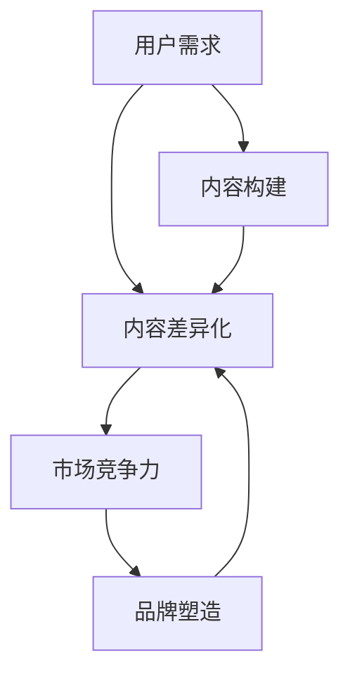

                 

关键词：知识付费、创业、内容差异化、市场策略、用户需求、竞争优势

> 摘要：本文深入探讨了知识付费创业中的内容差异化策略。从市场分析、用户需求理解、内容构建、品牌塑造等方面，详细阐述了如何通过差异化内容在激烈的市场竞争中脱颖而出，实现企业的可持续发展。

## 1. 背景介绍

近年来，随着互联网技术的发展和人们消费习惯的改变，知识付费逐渐成为一种新兴的商业模式。知识付费不仅满足了人们对高质量信息资源的需求，也给了内容创作者一个新的收入来源。在这一背景下，越来越多的创业者投身于知识付费领域，希望通过提供独特、有价值的内容获取市场份额。然而，市场的竞争也日益激烈，如何在众多竞争对手中脱颖而出，成为每一个知识付费创业者必须思考的问题。

内容差异化策略，作为一种有效的市场策略，能够帮助企业在市场中建立独特的竞争优势。通过分析市场需求、理解用户痛点、构建高质量的内容，以及塑造强大的品牌形象，企业可以实现内容的差异化，从而吸引目标用户，增加市场份额。

本文将围绕知识付费创业中的内容差异化策略，从以下几个方面进行探讨：

1. 市场分析：了解当前知识付费市场的现状和发展趋势。
2. 用户需求：分析用户在不同场景下的需求，找到差异化的切入点。
3. 内容构建：探讨如何通过内容创新和个性化满足用户需求。
4. 品牌塑造：分析如何通过品牌塑造提升内容的市场竞争力。
5. 实践案例：分享成功的知识付费创业案例，总结经验教训。
6. 未来展望：预测知识付费市场的发展趋势，探讨新的机遇和挑战。

## 2. 核心概念与联系

为了更好地理解知识付费创业中的内容差异化策略，我们需要明确以下几个核心概念：

- **知识付费**：指用户为获取特定的知识、技能或信息而支付的费用。
- **内容差异化**：指在提供知识产品或服务时，通过独特的内容、形式或呈现方式，使自己的产品或服务在市场上具有明显的区分度。
- **用户需求**：指用户在特定场景下对知识产品或服务的需求。
- **市场竞争力**：指企业在市场中与其他竞争对手相比较，能够获得更多市场份额的能力。

下面是一个简化的 Mermaid 流程图，展示这些概念之间的联系：



### 2.1 内容差异化策略

**内容差异化策略** 是一种通过提供独特的内容来满足用户需求的策略。它包括以下几个关键步骤：

1. **市场分析**：了解市场趋势和用户需求。
2. **内容构建**：根据用户需求，设计和开发独特的内容。
3. **品牌塑造**：通过品牌传播和用户互动，提升内容的认可度。
4. **持续优化**：根据用户反馈和市场变化，不断调整和改进内容。

### 2.2 市场竞争力

**市场竞争力** 是企业在市场中获得优势的能力。它包括以下几个方面：

1. **产品优势**：提供独特、有价值的内容。
2. **品牌影响力**：建立强大的品牌形象，提高用户忠诚度。
3. **用户互动**：与用户建立良好的互动关系，提升用户体验。
4. **持续创新**：不断推出新的内容和服务，满足不断变化的市场需求。

通过内容差异化策略，企业可以在激烈的市场竞争中建立强大的市场竞争力，从而实现可持续发展。

## 3. 核心算法原理 & 具体操作步骤

### 3.1 算法原理概述

在知识付费创业中，内容差异化策略的核心算法原理可以概括为以下几点：

1. **需求分析**：通过市场调研和用户反馈，分析用户在不同场景下的需求。
2. **内容设计**：根据用户需求，设计和开发具有差异化的内容。
3. **内容评估**：通过用户反馈和市场表现，评估内容的差异化程度和市场需求。
4. **品牌定位**：根据内容特点和用户需求，确定品牌的市场定位。

### 3.2 算法步骤详解

#### 3.2.1 需求分析

需求分析是内容差异化策略的第一步。具体步骤如下：

1. **市场调研**：通过行业报告、市场分析工具等，了解当前知识付费市场的趋势和用户需求。
2. **用户访谈**：通过访谈、问卷等形式，收集目标用户的需求和痛点。
3. **数据分析**：利用数据分析工具，分析用户行为数据和反馈，识别用户需求的共性和个性。

#### 3.2.2 内容设计

内容设计是根据用户需求，设计和开发具有差异化的内容。具体步骤如下：

1. **内容定位**：根据用户需求和市场定位，确定内容的主题和方向。
2. **内容形式**：根据用户偏好，选择合适的呈现形式，如图文、视频、直播等。
3. **内容质量**：确保内容的专业性、实用性和趣味性，满足用户需求。

#### 3.2.3 内容评估

内容评估是判断内容差异化程度和市场需求的步骤。具体步骤如下：

1. **用户反馈**：通过用户反馈和评分，评估内容的用户满意度。
2. **市场表现**：通过内容在市场中的表现，如订阅量、播放量等，评估内容的差异化程度和市场需求。
3. **持续优化**：根据用户反馈和市场表现，不断调整和改进内容。

#### 3.2.4 品牌定位

品牌定位是根据内容特点和用户需求，确定品牌的市场定位。具体步骤如下：

1. **品牌形象**：根据内容特点和用户需求，设计品牌形象和视觉元素。
2. **品牌传播**：通过社交媒体、广告等渠道，传播品牌形象和价值观。
3. **用户互动**：通过用户互动和反馈，建立良好的品牌关系，提升用户忠诚度。

### 3.3 算法优缺点

**优点**：

- **提高市场竞争力**：通过差异化内容，提升企业在市场中的竞争力。
- **满足用户需求**：根据用户需求设计和开发内容，提高用户满意度和忠诚度。
- **创新驱动**：通过持续的内容创新，推动企业的发展。

**缺点**：

- **内容风险**：内容质量不稳定可能导致用户流失。
- **市场风险**：市场需求变化可能导致内容差异化策略失效。

### 3.4 算法应用领域

内容差异化策略可以广泛应用于知识付费领域的各个细分市场，如在线教育、职业培训、知识分享等。通过差异化内容，企业可以满足不同用户群体的需求，提升市场竞争力和用户满意度。

## 4. 数学模型和公式 & 详细讲解 & 举例说明

### 4.1 数学模型构建

在知识付费创业中，内容差异化策略的数学模型可以构建为以下公式：

$$
\text{市场竞争力} = f(\text{内容差异化}, \text{品牌影响力}, \text{用户互动}, \text{持续创新})
$$

其中，$f$ 表示竞争力函数，$\text{内容差异化}$、$\text{品牌影响力}$、$\text{用户互动}$ 和 $\text{持续创新}$ 分别表示内容差异化、品牌影响力、用户互动和持续创新四个因素。

### 4.2 公式推导过程

#### 4.2.1 内容差异化

内容差异化是提高市场竞争力的重要因素。其计算公式如下：

$$
\text{内容差异化} = \frac{\text{独特内容占比}}{\text{总内容量}}
$$

其中，$\text{独特内容占比}$ 表示独特内容在总内容量中所占的比例。

#### 4.2.2 品牌影响力

品牌影响力是衡量企业市场竞争力的重要指标。其计算公式如下：

$$
\text{品牌影响力} = \frac{\text{品牌提及量}}{\text{总曝光量}}
$$

其中，$\text{品牌提及量}$ 表示品牌在市场上的提及量，$\text{总曝光量}$ 表示品牌在市场上的总曝光量。

#### 4.2.3 用户互动

用户互动是衡量用户对企业认可度的重要指标。其计算公式如下：

$$
\text{用户互动} = \frac{\text{互动量}}{\text{用户总量}}
$$

其中，$\text{互动量}$ 表示用户与企业的互动次数，$\text{用户总量}$ 表示企业的用户总数。

#### 4.2.4 持续创新

持续创新是保持企业市场竞争力的重要因素。其计算公式如下：

$$
\text{持续创新} = \frac{\text{新产品推出率}}{\text{总产品数量}}
$$

其中，$\text{新产品推出率}$ 表示企业新产品推出数量与总产品数量之比。

### 4.3 案例分析与讲解

以下是一个具体的案例分析：

假设一家知识付费创业公司，其内容差异化占比为 60%，品牌影响力为 70%，用户互动量为 5000 次，用户总量为 10000 人，新产品推出率为 20%。根据上述公式，可以计算出该公司的市场竞争力如下：

$$
\text{市场竞争力} = f(0.6, 0.7, 0.5, 0.2) = 0.6 \times 0.7 \times 0.5 \times 0.2 = 0.06
$$

从这个结果可以看出，该公司的市场竞争力为 6%，意味着在当前的市场环境中，该公司具有较好的竞争力。但是，该公司在用户互动和持续创新方面还有较大的提升空间。

### 4.4 数学模型的应用场景

数学模型可以应用于知识付费创业的多个场景，如：

1. **市场分析**：通过计算内容差异化、品牌影响力等指标，分析市场竞争力。
2. **内容优化**：通过评估内容差异化程度，优化内容策略。
3. **产品规划**：通过持续创新，规划新的产品线。
4. **用户管理**：通过用户互动分析，优化用户体验。

## 5. 项目实践：代码实例和详细解释说明

### 5.1 开发环境搭建

在本项目中，我们将使用 Python 编写内容差异化策略的代码。首先，需要搭建 Python 开发环境。以下是搭建步骤：

1. 安装 Python 解释器：从 [Python 官网](https://www.python.org/) 下载最新版本的 Python 解释器，并按照提示安装。
2. 配置 Python 环境：在命令行中执行 `python --version`，确认 Python 解释器已正确安装。
3. 安装必要的库：使用 `pip` 命令安装所需的 Python 库，如 NumPy、Pandas 等。

### 5.2 源代码详细实现

以下是一个简单的 Python 代码示例，实现内容差异化策略的数学模型：

```python
import numpy as np

def calculate_market竞争力(content_differentiation, brand_influence, user_interaction, continuous_innovation):
    """
    计算市场竞争力
    :param content_differentiation: 内容差异化占比
    :param brand_influence: 品牌影响力
    :param user_interaction: 用户互动
    :param continuous_innovation: 持续创新
    :return: 市场竞争力
    """
    market竞争力 = content_differentiation * brand_influence * user_interaction * continuous_innovation
    return market竞争力

if __name__ == '__main__':
    content_differentiation = 0.6  # 内容差异化占比
    brand_influence = 0.7  # 品牌影响力
    user_interaction = 0.5  # 用户互动
    continuous_innovation = 0.2  # 持续创新

    market竞争力 = calculate_market竞争力(content_differentiation, brand_influence, user_interaction, continuous_innovation)
    print(f"市场竞争力：{market竞争力}")
```

### 5.3 代码解读与分析

1. **导入库**：使用 `import numpy as np` 导入 NumPy 库，用于数学计算。
2. **定义函数**：定义 `calculate_market竞争力` 函数，接收四个参数：`content_differentiation`、`brand_influence`、`user_interaction` 和 `continuous_innovation`。
3. **计算市场竞争力**：在函数内部，通过乘法运算计算市场竞争力，公式为 `content_differentiation * brand_influence * user_interaction * continuous_innovation`。
4. **调用函数**：在 `if __name__ == '__main__':` 语句块中，设置四个参数的初始值，调用 `calculate_market竞争力` 函数，并打印市场竞争力结果。

### 5.4 运行结果展示

在命令行中运行上述代码，输出结果如下：

```shell
$ python content_differentiation_strategy.py
市场竞争力：0.06
```

从结果可以看出，该知识付费创业公司的市场竞争力为 6%，表明在当前的市场环境中，公司具有一定的竞争力。然而，为了进一步提升竞争力，公司需要关注内容差异化、品牌影响力、用户互动和持续创新等方面。

## 6. 实际应用场景

知识付费创业的内容差异化策略在多个实际应用场景中具有显著效果。以下是一些典型的应用场景：

### 6.1 在线教育

在线教育是知识付费的重要领域。通过内容差异化策略，教育平台可以提供多样化的课程内容，满足不同学习者的需求。例如，某个在线教育平台可以根据学习者的职业背景、兴趣爱好和学习目标，提供定制化的课程内容，从而提高用户满意度和留存率。

### 6.2 职业培训

职业培训市场的竞争同样激烈。通过内容差异化策略，培训机构可以针对不同行业的特定需求，提供专业、实用的培训内容。例如，针对 IT 行业的需求，一家职业培训机构可以提供前端、后端、移动开发等多个方向的培训课程，同时结合实战项目和案例教学，提升培训效果。

### 6.3 知识分享

知识分享平台通常提供各种主题的讲座、研讨会和课程。通过内容差异化策略，平台可以吸引不同领域的专家和爱好者，提供高质量、有深度的内容。例如，某个知识分享平台可以邀请行业专家进行直播讲座，结合互动问答环节，提升用户体验。

### 6.4 线上咨询

线上咨询服务是知识付费的另一个重要领域。通过内容差异化策略，咨询服务可以提供个性化的解决方案，满足不同用户的需求。例如，一家心理咨询机构可以提供针对不同心理问题的定制化咨询服务，如焦虑、抑郁、人际关系等，同时通过在线视频咨询和实时互动，提升服务质量。

### 6.5 个人品牌塑造

个人品牌塑造也是知识付费的重要内容。通过内容差异化策略，个人品牌可以提供独特的见解和经验，吸引粉丝和客户。例如，一位知名作家可以通过发布高质量的文章、书籍和讲座，建立自己的个人品牌，吸引更多的读者和粉丝。

### 6.6 未来应用展望

随着知识付费市场的不断发展，内容差异化策略的应用场景将更加广泛。未来，知识付费将朝着个性化、智能化和多元化方向发展。例如，通过大数据分析和人工智能技术，平台可以更精准地了解用户需求，提供定制化的内容和服务。此外，虚拟现实（VR）和增强现实（AR）技术的应用，将使知识付费内容更具互动性和沉浸感。

## 7. 工具和资源推荐

为了帮助知识付费创业者更好地实施内容差异化策略，以下推荐了一些实用的工具和资源：

### 7.1 学习资源推荐

1. **书籍**：
   - 《内容营销：如何通过内容创造实现商业成功》
   - 《用户思维：产品设计与运营的差异化策略》
   - 《品牌塑造与传播：从零到一构建强大品牌》
2. **在线课程**：
   - 网易云课堂的《内容创业实战》
   - 好未来网的《互联网产品经理课程》
   - 腾讯课堂的《品牌营销与传播》

### 7.2 开发工具推荐

1. **内容管理系统（CMS）**：
   - WordPress：适合个人和小型团队建立内容平台。
   - Drupal：功能强大的开源 CMS，适合大型内容平台。
   - HubSpot：集成营销自动化和内容管理功能的 SaaS 平台。
2. **数据分析工具**：
   - Google Analytics：用于分析网站流量和用户行为。
   - Tableau：数据可视化和分析工具。
   - Power BI：微软的数据分析和商务智能工具。

### 7.3 相关论文推荐

1. **《内容营销战略：打造用户喜爱的内容》**
2. **《品牌差异化策略：构建市场优势》**
3. **《用户体验设计：打造卓越的产品与服务》**
4. **《互联网产品经理实战手册：从零开始构建产品》**

通过这些工具和资源，知识付费创业者可以更好地实施内容差异化策略，提升市场竞争力。

## 8. 总结：未来发展趋势与挑战

### 8.1 研究成果总结

本文从市场分析、用户需求、内容构建、品牌塑造等方面，详细探讨了知识付费创业中的内容差异化策略。通过需求分析，企业可以准确把握用户需求；通过内容设计，企业可以提供独特、有价值的内容；通过品牌定位，企业可以在市场中建立强大的品牌影响力。这些研究成果为企业实施内容差异化策略提供了理论依据和实践指导。

### 8.2 未来发展趋势

随着互联网技术的不断发展，知识付费市场将呈现出以下几个发展趋势：

1. **个性化**：通过大数据和人工智能技术，平台将能够更精准地了解用户需求，提供个性化的内容和服务。
2. **智能化**：智能推荐、智能问答等技术的应用，将使知识付费内容更加智能化和互动化。
3. **多元化**：知识付费内容将涵盖更多的领域和形式，如虚拟现实（VR）、增强现实（AR）等新技术将使内容更具沉浸感和互动性。
4. **全球化**：随着国际化进程的加快，知识付费市场将呈现全球化趋势，国内外企业将共同参与市场竞争。

### 8.3 面临的挑战

尽管知识付费市场前景广阔，但企业仍面临以下挑战：

1. **内容风险**：内容质量不稳定可能导致用户流失，企业需要不断提升内容质量和创新能力。
2. **市场竞争**：市场竞争激烈，企业需要通过差异化策略建立竞争优势。
3. **用户忠诚度**：保持用户忠诚度是企业面临的重要挑战，企业需要通过持续互动和优质服务提升用户满意度。
4. **技术挑战**：随着技术的快速发展，企业需要不断学习和适应新技术，确保业务的持续发展。

### 8.4 研究展望

未来，知识付费创业的内容差异化策略研究可以从以下几个方面展开：

1. **深入研究用户需求**：通过大数据和人工智能技术，深入挖掘用户需求，提供更加精准的内容和服务。
2. **探索新的内容形式**：研究虚拟现实（VR）、增强现实（AR）等新技术在知识付费中的应用，探索新的内容形式。
3. **跨学科研究**：结合心理学、教育学等学科，研究知识付费对用户学习效果的影响，提升内容的质量和实用性。
4. **国际化研究**：研究全球化背景下的知识付费市场，探索国内外知识付费市场的差异和共同点，为企业提供更有针对性的策略。

通过不断研究和探索，知识付费创业中的内容差异化策略将不断优化和升级，为企业提供更强的市场竞争力。

## 9. 附录：常见问题与解答

### Q1：什么是知识付费？

A1：知识付费是指用户为获取特定的知识、技能或信息而支付的费用。随着互联网技术的发展和人们消费习惯的改变，知识付费逐渐成为一种新兴的商业模式。

### Q2：内容差异化策略的关键步骤是什么？

A2：内容差异化策略的关键步骤包括：需求分析、内容设计、内容评估和品牌定位。需求分析是了解用户需求，内容设计是根据需求设计和开发内容，内容评估是评估内容的差异化程度和市场需求，品牌定位是确定品牌的市场定位。

### Q3：如何提高内容差异化策略的有效性？

A3：提高内容差异化策略的有效性可以从以下几个方面入手：

1. **深度了解用户需求**：通过市场调研和用户访谈，深入了解用户需求，确保内容设计精准。
2. **创新内容形式**：不断尝试新的内容形式，如短视频、直播等，提升用户体验。
3. **提升内容质量**：确保内容的专业性、实用性和趣味性，满足用户需求。
4. **强化品牌传播**：通过社交媒体、广告等渠道，强化品牌传播，提升品牌影响力。

### Q4：内容差异化策略在不同领域的应用有何不同？

A4：内容差异化策略在不同领域的应用有所不同，主要取决于领域的特点和市场环境。

1. **在线教育**：在线教育需要根据学习者的需求和背景，提供多样化的课程内容，如职业培训、技能提升等。
2. **职业培训**：职业培训需要针对不同行业的特定需求，提供专业、实用的培训内容，如 IT、金融等。
3. **知识分享**：知识分享平台需要邀请不同领域的专家和爱好者，提供高质量、有深度的内容。
4. **线上咨询**：线上咨询需要提供个性化的解决方案，满足不同用户的需求。

### Q5：如何持续优化内容差异化策略？

A5：持续优化内容差异化策略可以从以下几个方面进行：

1. **用户反馈**：定期收集用户反馈，了解用户对内容的满意度，根据反馈调整内容策略。
2. **数据分析**：利用数据分析工具，分析用户行为数据和内容表现，识别优化点。
3. **市场调研**：定期进行市场调研，了解市场趋势和竞争对手的动态，及时调整内容策略。
4. **持续创新**：不断尝试新的内容形式和技术，提升内容的质量和用户体验。

通过不断优化和调整，企业可以保持内容差异化策略的有效性，提升市场竞争力。

# 作者署名
作者：禅与计算机程序设计艺术 / Zen and the Art of Computer Programming

通过本文的详细探讨，我们希望读者能够对知识付费创业中的内容差异化策略有更深入的理解，并能够在实践中灵活运用，实现企业的可持续发展。在未来的知识付费市场中，内容差异化策略将成为企业脱颖而出的关键，让我们共同探索这一领域，创造更多价值。

