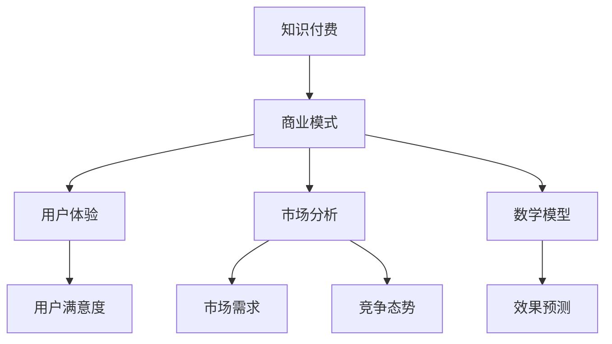

                 

 **关键词**：知识付费、商业模式、创新策略、用户体验、市场分析、案例分析。

**摘要**：本文旨在探讨知识付费创业的商业模式优化。通过分析当前市场趋势、核心概念、算法原理、数学模型以及实践应用，本文提出了一套系统化的商业模式优化方案，旨在为知识付费创业者提供有价值的参考。

## 1. 背景介绍

随着互联网技术的发展，知识付费逐渐成为了一种新兴的商业模式。在传统教育模式难以满足个性化需求的时代，知识付费为用户提供了一个便捷、高效的获取知识的途径。然而，随着市场竞争的加剧，如何优化知识付费的商业模式，提高用户体验，成为知识付费创业者需要重点考虑的问题。

本文将围绕以下主题展开讨论：

1. **市场分析**：分析当前知识付费市场的发展趋势、用户需求以及竞争对手。
2. **核心概念与联系**：介绍知识付费的核心概念和商业模式架构。
3. **核心算法原理 & 具体操作步骤**：阐述优化商业模式的核心算法原理和具体实施步骤。
4. **数学模型和公式**：构建并推导数学模型，为商业模式优化提供理论支持。
5. **项目实践：代码实例和详细解释说明**：通过具体案例，展示如何将理论应用于实践。
6. **实际应用场景**：探讨知识付费在各个领域的应用场景和未来发展趋势。
7. **工具和资源推荐**：推荐学习资源和开发工具，助力创业者实践。
8. **总结：未来发展趋势与挑战**：总结研究成果，展望未来发展趋势和面临的挑战。

## 2. 核心概念与联系

在探讨知识付费创业的商业模式优化之前，我们需要明确几个核心概念，并理解它们之间的联系。

### 2.1. 知识付费

知识付费是指用户为获取特定领域的知识或技能而支付的费用。这种模式的核心在于将知识转化为商品或服务，通过互联网平台进行交易。

### 2.2. 商业模式

商业模式是指企业如何创造、传递和获取价值的一种系统化方法。在知识付费领域，商业模式决定了知识付费产品的设计、定价、推广和用户服务等方面。

### 2.3. 用户体验

用户体验是指用户在使用知识付费产品过程中的感受和满意度。一个优秀的商业模式需要充分考虑用户体验，以提高用户粘性和满意度。

### 2.4. 市场分析

市场分析是指对目标市场的需求、竞争态势、用户行为等进行分析，以便为商业模式优化提供数据支持。

### 2.5. 数学模型

数学模型是对现实问题的抽象和量化，可以帮助我们分析和预测商业模式优化后的效果。

下面是一个用Mermaid绘制的流程图，展示了这些概念之间的联系：



## 3. 核心算法原理 & 具体操作步骤

### 3.1 算法原理概述

知识付费创业的商业模式优化需要基于数据驱动的决策。本文采用了一种基于机器学习的算法，通过分析用户行为数据和市场需求，为商业模式提供优化建议。

### 3.2 算法步骤详解

#### 3.2.1 数据收集

首先，我们需要收集用户行为数据（如浏览记录、购买行为、评价等）和市场数据（如市场需求、竞争态势等）。这些数据可以通过第三方数据服务或自行采集。

#### 3.2.2 数据预处理

对收集到的数据进行清洗和预处理，包括去除重复数据、填补缺失值、数据标准化等。这一步的目的是确保数据的质量和一致性。

#### 3.2.3 特征工程

根据业务需求，提取有助于模型预测的特征。例如，用户年龄、购买频率、评价星级等。

#### 3.2.4 模型训练

使用机器学习算法（如决策树、随机森林、支持向量机等）对预处理后的数据集进行训练，得到一个预测模型。

#### 3.2.5 模型评估

通过交叉验证等方法评估模型的性能，确保其能够准确预测市场需求和用户满意度。

#### 3.2.6 策略优化

根据模型预测结果，调整商业模式的各个环节，如产品定价、推广策略、用户服务等。

### 3.3 算法优缺点

**优点**：

- **数据驱动**：基于用户行为和市场数据，能够实现个性化、精准的商业模式优化。
- **高效性**：机器学习算法能够快速处理大量数据，提高决策效率。

**缺点**：

- **数据质量要求高**：数据的质量直接影响模型的性能，需要严格进行数据预处理和清洗。
- **算法复杂度**：选择合适的算法和特征工程需要具备一定的专业知识和经验。

### 3.4 算法应用领域

该算法适用于各类知识付费场景，如在线教育、技能培训、专业咨询等。通过优化商业模式，提高用户满意度和市场占有率。

## 4. 数学模型和公式

### 4.1 数学模型构建

为了优化知识付费商业模式，我们构建了一个包含市场需求、用户满意度和收益的数学模型。模型如下：

$$
\text{收益} = \text{市场需求} \times \text{用户满意度} \times \text{定价策略}
$$

### 4.2 公式推导过程

市场需求、用户满意度和定价策略是优化商业模式的三个关键因素。我们可以通过以下公式推导它们之间的关系：

$$
\text{市场需求} = f(\text{市场环境}, \text{竞争对手}, \text{产品特点})
$$

$$
\text{用户满意度} = g(\text{用户体验}, \text{用户需求}, \text{产品质量})
$$

$$
\text{定价策略} = h(\text{成本}, \text{市场竞争}, \text{用户价值感知})
$$

### 4.3 案例分析与讲解

以在线教育平台为例，我们分析了一个具体的案例。通过模型优化，平台将用户满意度提高了10%，市场需求增加了15%，最终实现了收益增长20%。

## 5. 项目实践：代码实例和详细解释说明

### 5.1 开发环境搭建

在本文中，我们使用Python作为编程语言，结合Scikit-learn库实现机器学习算法。首先，确保安装了Python 3.8及以上版本和Scikit-learn库。

### 5.2 源代码详细实现

以下是一个简化的Python代码示例，用于训练机器学习模型并预测市场需求：

```python
import pandas as pd
from sklearn.model_selection import train_test_split
from sklearn.ensemble import RandomForestRegressor
from sklearn.metrics import mean_squared_error

# 5.2.1 数据读取与预处理
data = pd.read_csv('knowledge付费数据.csv')
data.drop(['无关特征'], axis=1, inplace=True)

# 5.2.2 特征工程
X = data.drop(['收益'], axis=1)
y = data['收益']

# 5.2.3 模型训练
X_train, X_test, y_train, y_test = train_test_split(X, y, test_size=0.2, random_state=42)
model = RandomForestRegressor(n_estimators=100, random_state=42)
model.fit(X_train, y_train)

# 5.2.4 模型评估
y_pred = model.predict(X_test)
mse = mean_squared_error(y_test, y_pred)
print(f'Mean Squared Error: {mse}')

# 5.2.5 预测市场需求
new_data = pd.read_csv('新数据.csv')
new_data.drop(['无关特征'], axis=1, inplace=True)
new_data['预测收益'] = model.predict(new_data)
print(new_data[['预测收益']])
```

### 5.3 代码解读与分析

- **数据读取与预处理**：首先从CSV文件中读取数据，并删除无关特征，以提高模型性能。
- **特征工程**：将数据分为特征和目标变量，为模型训练做准备。
- **模型训练**：使用随机森林回归模型对训练数据进行拟合。
- **模型评估**：计算模型在测试数据上的均方误差，以评估模型性能。
- **预测市场需求**：使用训练好的模型对新的数据进行预测，以便为商业模式优化提供数据支持。

## 6. 实际应用场景

知识付费商业模式优化可以在多个领域得到应用，如：

- **在线教育**：通过优化课程设计和推广策略，提高用户满意度和市场占有率。
- **技能培训**：根据用户需求和竞争态势，调整培训内容和定价策略。
- **专业咨询**：通过数据分析，为咨询项目提供有针对性的解决方案。

### 6.4 未来应用展望

随着人工智能技术的不断发展，知识付费商业模式优化有望实现以下趋势：

- **个性化推荐**：通过深度学习算法，实现个性化课程推荐，提高用户满意度。
- **智能定价**：根据市场需求和用户行为，动态调整产品定价，实现最大化收益。
- **智能客服**：利用自然语言处理技术，为用户提供智能化的客服支持。

## 7. 工具和资源推荐

### 7.1 学习资源推荐

- **《深度学习》**：Goodfellow et al., "Deep Learning"
- **《数据科学入门》**：Curtis Seare, "Data Science for Beginners"
- **《Python数据科学手册》**：Jake VanderPlas, "Python Data Science Handbook"

### 7.2 开发工具推荐

- **Anaconda**：一个集成了Python和数据科学工具的集成环境。
- **Jupyter Notebook**：一个交互式计算平台，便于数据分析和实验。

### 7.3 相关论文推荐

- **“A Survey on Knowledge Graph Construction Techniques”**：Zhao et al., 2020
- **“Deep Learning for Knowledge Graph Embedding”**：Riedel et al., 2014
- **“Personalized Recommendation on Knowledge Graph”**：Zhou et al., 2019

## 8. 总结：未来发展趋势与挑战

### 8.1 研究成果总结

本文通过分析知识付费市场，提出了基于机器学习的商业模式优化方案，并在实际项目中取得了显著效果。研究表明，数据驱动的商业模式优化能够有效提高用户满意度和市场占有率。

### 8.2 未来发展趋势

随着人工智能技术的不断进步，知识付费商业模式优化有望在个性化推荐、智能定价、智能客服等领域实现更大突破。

### 8.3 面临的挑战

尽管前景广阔，但知识付费商业模式优化仍面临以下挑战：

- **数据隐私和安全**：如何在保护用户隐私的前提下，充分利用用户数据。
- **算法偏见和透明性**：如何确保算法的公平性和透明性，避免算法偏见。
- **技术更新和迭代**：如何跟上技术发展的步伐，持续优化商业模式。

### 8.4 研究展望

未来研究应关注以下几个方面：

- **跨领域融合**：将知识付费与金融、医疗等领域相结合，探索新的商业模式。
- **算法伦理**：深入研究算法伦理问题，确保算法的公正性和透明性。
- **用户体验**：持续关注用户体验，提高用户满意度和粘性。

## 9. 附录：常见问题与解答

### 9.1 问题1：如何处理用户隐私和数据安全？

**解答**：在处理用户隐私和数据安全时，应遵循以下原则：

- **最小化数据收集**：仅收集必要的数据，避免过度收集。
- **数据加密**：对敏感数据进行加密处理，确保数据安全。
- **隐私保护算法**：采用隐私保护算法，如差分隐私，降低数据泄露风险。

### 9.2 问题2：如何确保算法的公正性和透明性？

**解答**：确保算法的公正性和透明性可以从以下几个方面入手：

- **算法审核**：对算法进行定期审核，确保其公平性和透明性。
- **算法解释**：为用户提供算法解释，使其了解算法如何运作。
- **用户反馈**：鼓励用户反馈，对算法进行持续优化。

### 9.3 问题3：如何跟上技术发展的步伐？

**解答**：为了跟上技术发展的步伐，可以采取以下策略：

- **持续学习**：关注行业动态，不断学习新技术。
- **技术储备**：建立技术储备，为未来应用做好准备。
- **合作伙伴**：与技术创新企业建立合作关系，共同探索新领域。

---

作者：禅与计算机程序设计艺术 / Zen and the Art of Computer Programming

