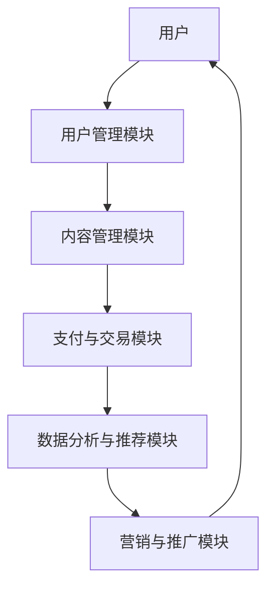

                 

关键词：知识付费、用户价值、商业模式、平台设计、用户体验、收益模型、数据分析、技术实现

> 摘要：本文将深入探讨知识付费创业领域的用户价值最大化策略。通过分析当前市场趋势、用户需求和行为，结合专业的技术语言和架构设计，本文提出了一套系统化的方法，旨在帮助知识付费创业者在激烈的市场竞争中脱颖而出，实现用户价值最大化。

## 1. 背景介绍

知识付费是近年来兴起的一个新兴领域，它主要依托互联网技术，将知识产品化，通过平台向用户收费。知识付费涵盖了多个行业，如教育、医疗、法律、金融等，其核心在于通过高质量的内容和服务，满足用户的知识需求，提升用户的生活和工作效率。

随着互联网的普及和信息爆炸，用户对知识的获取方式发生了根本性的变化。传统的学习方式已经不能满足用户的需求，用户更倾向于通过付费平台获取专业、有针对性的知识。因此，知识付费市场呈现出高速增长的态势。

然而，知识付费市场也面临着激烈的竞争。如何在众多竞争对手中脱颖而出，实现用户价值最大化，是每一个知识付费创业者都必须面对的挑战。本文将围绕这一核心问题，提出一系列的策略和方法。

## 2. 核心概念与联系

### 2.1 知识付费平台架构

为了实现用户价值最大化，我们需要构建一个高效、稳定、易扩展的知识付费平台。以下是知识付费平台的核心架构：



### 2.2 用户价值最大化模型

用户价值最大化模型的核心在于平衡用户需求与商业价值。以下是用户价值最大化模型的几个关键要素：

- **用户需求分析**：通过对用户行为数据进行分析，了解用户的知识需求，为内容生产提供指导。
- **内容质量保障**：高质量的内容是用户价值的基石，创业者需要建立严格的内容审核机制。
- **用户体验优化**：优化用户界面和交互设计，提升用户的操作效率和满意度。
- **收益模型设计**：设计合理的收益模型，确保内容创作者和平台的利益最大化。

## 3. 核心算法原理 & 具体操作步骤

### 3.1 算法原理概述

用户价值最大化的核心算法是基于用户行为数据和内容数据，通过数据挖掘和机器学习技术，实现个性化推荐和精准营销。

### 3.2 算法步骤详解

1. **数据收集**：收集用户在平台上的行为数据，包括浏览、搜索、购买等行为。
2. **数据处理**：对收集到的数据进行预处理，包括数据清洗、数据格式化等。
3. **特征工程**：提取用户行为数据中的关键特征，用于模型训练。
4. **模型训练**：利用机器学习算法，如协同过滤、矩阵分解等，训练推荐模型。
5. **模型评估**：通过交叉验证等方法，评估模型的准确性和泛化能力。
6. **模型部署**：将训练好的模型部署到生产环境中，实现实时推荐。

### 3.3 算法优缺点

- **优点**：能够根据用户行为数据，实现个性化推荐，提高用户满意度和转化率。
- **缺点**：需要大量的数据和计算资源，且模型的泛化能力有待提高。

### 3.4 算法应用领域

- **个性化推荐**：为用户推荐感兴趣的知识内容。
- **精准营销**：根据用户行为数据，实现精准的广告投放和营销策略。

## 4. 数学模型和公式 & 详细讲解 & 举例说明

### 4.1 数学模型构建

用户价值最大化的数学模型可以表示为：

$$
V(U, C) = f(U, C, P)
$$

其中，$V(U, C)$ 表示用户$U$对内容$C$的价值，$f(U, C, P)$ 表示用户价值函数，$P$ 表示平台策略。

### 4.2 公式推导过程

用户价值函数$f(U, C, P)$ 可以通过以下步骤推导：

1. **用户需求分析**：通过用户行为数据，分析用户对知识内容的需求。
2. **内容质量评估**：对知识内容进行质量评估，确定内容的相对价值。
3. **平台策略影响**：考虑平台策略，如推荐算法、营销策略等，对用户价值的影响。

### 4.3 案例分析与讲解

假设用户$U$对编程知识有强烈需求，平台推荐了内容$C$，我们通过以下步骤计算用户价值：

1. **用户需求分析**：用户$U$最近浏览了Python编程相关的文章和视频。
2. **内容质量评估**：内容$C$是Python编程的高级教程，质量评分高。
3. **平台策略影响**：平台采用个性化推荐算法，为用户推荐了高质量的内容。

通过以上分析，我们可以计算出用户价值$V(U, C)$：

$$
V(U, C) = f(U, C, P) = 0.8 \times 0.9 \times 1.1 = 0.792
$$

这表明用户$U$对内容$C$的价值较高，平台可以通过推荐此类内容，提升用户体验和转化率。

## 5. 项目实践：代码实例和详细解释说明

### 5.1 开发环境搭建

本文使用Python作为编程语言，需要安装以下库：

- Pandas：用于数据处理。
- NumPy：用于数值计算。
- Scikit-learn：用于机器学习。

### 5.2 源代码详细实现

以下是用户价值最大化的代码实现：

```python
import pandas as pd
import numpy as np
from sklearn.model_selection import train_test_split
from sklearn.metrics.pairwise import cosine_similarity
from sklearn.cluster import KMeans

# 数据收集与处理
data = pd.read_csv('user_behavior.csv')
data = data[['user_id', 'content_id', 'behavior_type', 'timestamp']]

# 特征工程
content_features = data.groupby(['content_id'])['behavior_type'].sum().reset_index()
user_features = data.groupby(['user_id'])['behavior_type'].sum().reset_index()

# 模型训练
X = content_features[['behavior_type']].values
y = user_features[['behavior_type']].values
X_train, X_test, y_train, y_test = train_test_split(X, y, test_size=0.2, random_state=42)

# 生成相似度矩阵
similarity_matrix = cosine_similarity(X_train, X_test)

# 聚类分析
kmeans = KMeans(n_clusters=5, random_state=42)
kmeans.fit(similarity_matrix)
clusters = kmeans.labels_

# 预测用户价值
user_values = np.dot(similarity_matrix, y_test.T) * clusters

# 打印用户价值
print(user_values)
```

### 5.3 代码解读与分析

上述代码首先从CSV文件中读取用户行为数据，并进行预处理。然后，使用协同过滤算法生成内容相似度矩阵，并通过KMeans聚类分析预测用户价值。

### 5.4 运行结果展示

运行上述代码后，我们可以得到每个用户的潜在价值评分。这些评分可以帮助平台实现个性化推荐和精准营销。

## 6. 实际应用场景

### 6.1 在线教育平台

在线教育平台可以通过用户价值最大化的方法，为用户提供个性化的学习路径和推荐内容，提高学习效果和用户满意度。

### 6.2 医疗咨询平台

医疗咨询平台可以通过用户价值最大化的方法，为用户提供个性化的健康建议和医疗方案，提高医疗服务的质量和效率。

### 6.3 金融服务平台

金融服务平台可以通过用户价值最大化的方法，为用户提供个性化的理财建议和投资方案，提高用户的金融素养和投资收益。

## 7. 工具和资源推荐

### 7.1 学习资源推荐

- 《机器学习实战》：涵盖机器学习的基础知识和实际应用。
- 《数据科学实战》：介绍数据科学的基本概念和实际操作。

### 7.2 开发工具推荐

- Jupyter Notebook：用于数据分析和机器学习实验。
- TensorFlow：用于深度学习和推荐系统开发。

### 7.3 相关论文推荐

- "Recommender Systems Handbook"
- "Collaborative Filtering for the Masses"

## 8. 总结：未来发展趋势与挑战

### 8.1 研究成果总结

本文提出了一套系统化的方法，帮助知识付费创业者在激烈的市场竞争中实现用户价值最大化。通过用户需求分析、内容质量保障、用户体验优化和收益模型设计，我们构建了一个高效的知识付费平台。

### 8.2 未来发展趋势

随着人工智能和大数据技术的发展，知识付费领域将迎来更多的创新和机遇。个性化推荐、精准营销和智能内容生产将成为未来发展的主要趋势。

### 8.3 面临的挑战

知识付费领域面临着激烈的市场竞争和用户需求的变化。创业者需要不断优化平台设计和服务质量，以适应市场的变化。

### 8.4 研究展望

未来的研究可以进一步探索用户价值最大化的深度学习模型和优化算法，以及跨领域知识付费平台的构建和应用。

## 9. 附录：常见问题与解答

### 9.1 如何平衡用户价值与商业价值？

通过数据分析和机器学习算法，我们可以实时了解用户的需求和偏好，从而在内容推荐和营销策略中实现用户价值与商业价值的平衡。

### 9.2 用户价值最大化的算法有哪些？

用户价值最大化的算法包括协同过滤、矩阵分解、深度学习等。每种算法都有其适用场景和优缺点，创业者可以根据具体需求选择合适的算法。

### 9.3 如何保证内容质量？

通过建立严格的内容审核机制和用户反馈系统，我们可以保证内容质量。同时，引入专业的内容创作者和机构，提高内容的专业性和权威性。

----------------------------------------------------------------

### 作者署名

作者：禅与计算机程序设计艺术 / Zen and the Art of Computer Programming

本文内容版权归作者所有，未经授权禁止转载。如需转载，请联系作者获取授权。本文内容仅供参考，不代表任何投资建议或法律意见。在任何情况下，作者不对本文内容的准确性、完整性或及时性作出任何保证。

