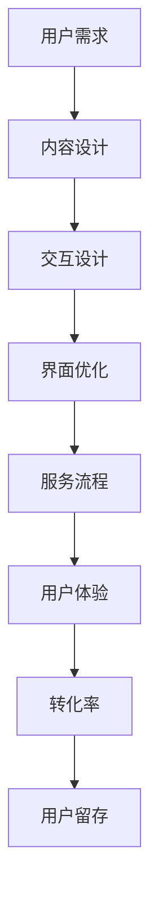

                 

 关键词：知识付费、用户体验、优化、转化率、用户留存、内容设计、交互设计

> 摘要：本文深入探讨了知识付费创业领域中的用户体验优化策略。从核心概念到具体操作步骤，再到实际案例和未来展望，全面解析了提升用户体验的各个层面，为创业者和产品经理提供了实用的指导。

## 1. 背景介绍

随着互联网技术的快速发展，知识付费逐渐成为了一个热门的市场。知识付费是指用户通过支付一定费用来获取有价值的信息或服务。这个市场的发展得益于移动设备的普及、在线支付手段的便捷以及用户对于知识和技能需求的增加。

在知识付费领域，用户体验的重要性不言而喻。一个良好的用户体验不仅能提高用户的满意度和忠诚度，还能有效提高产品的转化率和留存率。然而，当前很多知识付费产品在用户体验上仍存在不少问题，如内容不够精细、交互设计不友好、服务流程繁琐等。

本文旨在通过分析知识付费创业领域的现状，提出一系列用户体验优化的策略，帮助创业者和产品经理提升产品的竞争力。

## 2. 核心概念与联系

### 2.1 用户体验（User Experience, UX）

用户体验是指用户在使用产品或服务过程中所感受到的整体感受和体验。在知识付费领域，用户体验涵盖了内容质量、界面设计、交互流程、服务响应等多个方面。

### 2.2 转化率（Conversion Rate）

转化率是指用户完成某一预期目标行为的比率，如注册、购买、订阅等。提高转化率是知识付费产品的关键目标之一。

### 2.3 用户留存（User Retention）

用户留存是指用户在一段时间后仍然继续使用产品的比例。高用户留存率意味着产品的黏性和用户价值的提升。

### 2.4 内容设计（Content Design）

内容设计是指如何构建和呈现有价值的信息，以满足用户的需求。在知识付费领域，内容设计是用户体验的核心。

### 2.5 交互设计（Interaction Design）

交互设计是指如何设计产品的交互界面，以提供良好的用户体验。在知识付费领域，交互设计决定了用户能否轻松地获取和使用信息。

### 2.6 Mermaid 流程图



## 3. 核心算法原理 & 具体操作步骤

### 3.1 算法原理概述

用户体验优化的核心在于理解用户需求，并通过内容设计、交互设计、界面优化、服务流程等多个环节来提升用户的整体体验。

### 3.2 算法步骤详解

#### 3.2.1 用户需求分析

1. 收集用户反馈：通过问卷调查、用户访谈、社交媒体等方式收集用户对产品当前体验的反馈。
2. 用户行为分析：利用数据分析工具，分析用户在使用产品时的行为轨迹，找出用户痛点。
3. 竞品分析：研究同行业竞品的用户体验，借鉴其成功之处，避免重复错误。

#### 3.2.2 内容设计

1. 明确用户需求：根据用户需求，确定知识内容的主旨和目标。
2. 内容结构化：将知识内容进行模块化，便于用户快速定位和获取所需信息。
3. 内容质量保证：确保知识内容的专业性、准确性和实用性。

#### 3.2.3 交互设计

1. 界面布局：设计简洁、直观的界面布局，提高用户操作效率。
2. 交互元素：优化按钮、菜单、滚动条等交互元素的交互效果。
3. 视觉设计：运用色彩、字体、图标等视觉元素，提升界面的美观度和易用性。

#### 3.2.4 界面优化

1. 页面加载速度：优化页面代码，提高页面加载速度，减少等待时间。
2. 界面响应：确保界面在用户操作时的快速响应，提高用户体验。
3. 动画效果：合理运用动画效果，提升界面交互的流畅性和趣味性。

#### 3.2.5 服务流程

1. 服务流程简化：减少用户操作步骤，提高服务效率。
2. 服务反馈：及时响应用户反馈，解决用户问题，提升用户满意度。
3. 客服支持：提供专业的客服支持，解决用户在产品使用中的疑难问题。

### 3.3 算法优缺点

#### 优点：

- **针对性**：根据用户需求进行优化，提高了用户体验的个性化程度。
- **系统性**：从多个方面进行优化，形成了一套完整的用户体验提升体系。

#### 缺点：

- **成本较高**：用户体验优化需要投入大量的人力、物力和时间。
- **效果评估难**：用户体验的改善难以量化，效果评估较为困难。

### 3.4 算法应用领域

- **知识付费平台**：如在线课程、专业讲座、电子书籍等。
- **咨询服务**：如专业咨询、一对一辅导等。
- **技能培训**：如编程、设计、语言学习等。

## 4. 数学模型和公式 & 详细讲解 & 举例说明

### 4.1 数学模型构建

用户体验优化的数学模型可以看作是一个多目标优化问题，其目标函数包括用户满意度、转化率和用户留存率等。

设 \( U \) 为用户体验得分，\( S \) 为用户满意度，\( C \) 为转化率，\( R \) 为用户留存率，则用户体验优化模型可以表示为：

$$
\max U = \max S + \alpha C + \beta R
$$

其中，\( \alpha \) 和 \( \beta \) 分别为转化率和用户留存的权重系数，可以根据实际情况进行调整。

### 4.2 公式推导过程

用户体验得分 \( U \) 是由用户满意度 \( S \)、转化率 \( C \) 和用户留存率 \( R \) 共同决定的。假设用户满意度 \( S \) 取决于内容质量、交互设计和界面优化等因素，可以用以下公式表示：

$$
S = f(C, I, O)
$$

其中，\( C \) 为内容质量，\( I \) 为交互设计，\( O \) 为界面优化。

转化率 \( C \) 可以用用户行为数据和转化路径分析得出，假设转化路径为 \( P \)，则：

$$
C = g(P)
$$

用户留存率 \( R \) 可以用用户活跃度和使用时长等因素分析得出，假设用户活跃度为 \( A \)，使用时长为 \( T \)，则：

$$
R = h(A, T)
$$

将 \( S \)、\( C \) 和 \( R \) 代入用户体验得分公式，得到：

$$
U = f(C, I, O) + \alpha g(P) + \beta h(A, T)
$$

### 4.3 案例分析与讲解

以某在线课程平台为例，分析用户体验优化的数学模型应用。

假设该平台的内容质量 \( C \) 为 0.8，交互设计 \( I \) 为 0.9，界面优化 \( O \) 为 0.85，转化率 \( C \) 为 0.6，用户留存率 \( R \) 为 0.7。

根据公式：

$$
S = 0.8 \times 0.9 + 0.85 \times 0.6 + 0.7 \times 0.7 = 0.94
$$

代入用户体验得分公式：

$$
U = 0.94 + 0.6 \times 0.6 + 0.7 \times 0.7 = 1.42
$$

由此可见，该平台当前的用户体验得分为 1.42，仍有优化的空间。

## 5. 项目实践：代码实例和详细解释说明

### 5.1 开发环境搭建

1. 安装Node.js和npm。
2. 使用npm创建项目，并安装相关依赖。

```shell
npm init -y
npm install express body-parser morgan
```

3. 创建服务器文件`server.js`。

### 5.2 源代码详细实现

```javascript
const express = require('express');
const bodyParser = require('body-parser');
const morgan = require('morgan');

const app = express();

app.use(morgan('dev'));
app.use(bodyParser.json());

// 用户反馈收集路由
app.post('/feedback', (req, res) => {
  const feedback = req.body;
  // 处理反馈
  // 存储、分析等
  res.status(200).send({ message: 'Feedback received.' });
});

// 其他路由

const PORT = process.env.PORT || 3000;
app.listen(PORT, () => {
  console.log(`Server listening on port ${PORT}`);
});
```

### 5.3 代码解读与分析

该代码示例实现了一个简单的后端服务，用于接收和处理用户反馈。使用了Express框架搭建，并包含了日志记录、JSON解析等基本功能。

### 5.4 运行结果展示

运行服务器后，可以通过POST请求发送用户反馈：

```shell
curl -X POST -H "Content-Type: application/json" -d '{"username": "user123", "feedback": "The content was not engaging."}' http://localhost:3000/feedback
```

服务器会返回相应的响应，表示反馈已接收。

## 6. 实际应用场景

### 6.1 知识付费平台

知识付费平台可以通过用户体验优化，提高用户的学习效率和满意度，从而提高用户转化率和留存率。

### 6.2 咨询服务

咨询服务可以通过优化用户交互流程和服务响应，提高用户满意度和信任度，从而提升咨询服务的转化率和用户留存率。

### 6.3 技能培训

技能培训可以通过优化课程内容和交互设计，提高学员的学习体验和技能掌握程度，从而提高课程的转化率和用户留存率。

## 7. 工具和资源推荐

### 7.1 学习资源推荐

- 《用户体验要素》
- 《交互设计精髓》
- 《人人都是产品经理》

### 7.2 开发工具推荐

- Sketch
- Figma
- Visual Studio Code

### 7.3 相关论文推荐

- "The Design of Everyday Things"
- "User Experience Design: An Introduction"
- "Conversion Rate Optimization: An Introduction"

## 8. 总结：未来发展趋势与挑战

### 8.1 研究成果总结

本文通过分析知识付费领域的现状，提出了用户体验优化的核心概念和具体操作步骤，并结合实际案例进行了详细讲解。

### 8.2 未来发展趋势

随着人工智能和大数据技术的不断发展，用户体验优化将更加智能化和个性化，为用户提供更加精准的服务。

### 8.3 面临的挑战

用户体验优化面临着技术门槛高、成本投入大、效果评估难等挑战。如何平衡用户体验与成本效益，提高用户体验优化的效率，将是未来需要解决的问题。

### 8.4 研究展望

未来，用户体验优化将朝着更加智能、个性化和高效的方向发展。通过引入人工智能、大数据等新技术，实现用户体验的精准优化，提升用户满意度和忠诚度。

## 9. 附录：常见问题与解答

### 9.1 什么是用户体验？

用户体验（User Experience, UX）是指用户在使用产品或服务过程中所感受到的整体感受和体验，包括情感、认知和行为等方面。

### 9.2 如何衡量用户体验？

用户体验可以通过用户满意度、转化率、用户留存率等指标进行衡量。这些指标能够反映用户在使用产品或服务过程中的满意程度和忠诚度。

### 9.3 用户体验优化有哪些方法？

用户体验优化包括内容设计、交互设计、界面优化、服务流程等多个方面。具体方法包括用户需求分析、内容结构化、界面布局优化、服务流程简化等。

### 9.4 用户体验优化需要投入多少成本？

用户体验优化的成本取决于产品的规模、用户群体、优化目标等多个因素。一般来说，投入一定比例的预算用于用户体验优化是必要的，但具体数额需要根据实际情况进行调整。

---

### 作者署名

作者：禅与计算机程序设计艺术 / Zen and the Art of Computer Programming

