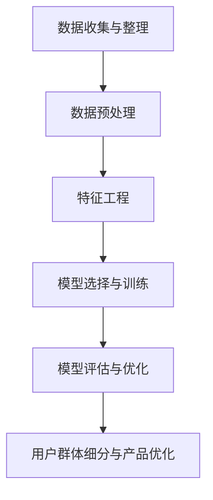

                 

## 1. 背景介绍

在当今数字化时代，知识付费已经成为一个越来越流行的商业模式。随着互联网的普及，人们获取知识的渠道变得更加多样化，知识付费平台如雨后春笋般涌现。从在线课程、电子书到专业技能培训，各种形式的知识产品琳琅满目。然而，面对海量的用户和丰富的知识内容，如何有效地细分用户群体，从而提高知识付费产品的市场竞争力，成为知识付费创业者和运营者亟待解决的问题。

用户群体细分策略在知识付费领域具有重要意义。首先，通过细分用户群体，可以更好地理解不同用户的需求，从而提供更精准、更具针对性的知识产品。其次，用户群体细分有助于优化营销策略，提高广告投放的效率和转化率。最后，细分用户群体还能帮助知识付费平台提高用户留存率和忠诚度，提升整体运营效益。

本文将深入探讨知识付费创业的用户群体细分策略，从核心概念、算法原理、数学模型、项目实践等多个方面进行全面剖析，旨在为知识付费创业者和运营者提供一套实用、高效的用户群体细分策略。此外，文章还将结合实际案例，对用户群体细分策略在实际应用中的效果进行评估，并展望未来的发展趋势。

## 2. 核心概念与联系

### 2.1 用户群体细分概念

用户群体细分（User Segmentation）是指将广泛的用户群体划分为具有相似特征或需求的子群体，以便更好地理解用户行为和需求。在知识付费领域，用户群体细分可以基于多种因素，如年龄、性别、职业、教育背景、购买行为等。通过细分用户群体，知识付费平台可以更精准地满足用户需求，提高用户体验和满意度。

### 2.2 用户群体细分模型

用户群体细分模型是实施用户群体细分策略的关键。常见的用户群体细分模型包括人口统计模型、行为模型、心理模型和情境模型。以下是这些模型的基本概念：

1. **人口统计模型**：基于用户的年龄、性别、教育背景、职业等人口统计特征进行细分。这种模型较为直观，易于理解，但可能无法捕捉用户更深层次的需求和行为。

2. **行为模型**：基于用户的购买行为、浏览习惯、互动行为等行为数据进行细分。这种模型有助于挖掘用户的潜在需求，提高营销策略的针对性。

3. **心理模型**：基于用户的心理特征，如价值观、兴趣、动机等心理因素进行细分。这种模型可以更深入地理解用户需求，从而提供更个性化的产品和服务。

4. **情境模型**：基于用户在不同情境下的行为和需求进行细分。这种模型有助于了解用户在不同场景下的需求变化，从而制定更具针对性的营销策略。

### 2.3 用户群体细分与知识付费

在知识付费领域，用户群体细分有助于提高产品的市场竞争力。具体来说，用户群体细分可以带来以下好处：

1. **提高用户体验**：通过细分用户群体，知识付费平台可以提供更符合用户需求的课程和内容，从而提高用户满意度和忠诚度。

2. **优化营销策略**：用户群体细分有助于精准定位目标用户，提高广告投放的效率和转化率。

3. **提升运营效益**：用户群体细分有助于降低运营成本，提高资源利用效率。

### 2.4 用户群体细分策略框架

为了有效地实施用户群体细分策略，知识付费平台可以采用以下框架：

1. **数据收集与整理**：收集用户数据，包括人口统计、行为、心理和情境等数据。

2. **数据预处理**：对收集到的用户数据进行清洗、整合和转换，为后续分析做好准备。

3. **特征工程**：基于用户数据，提取有用的特征，用于构建用户群体细分模型。

4. **模型选择与训练**：选择合适的用户群体细分模型，并使用数据进行训练。

5. **模型评估与优化**：评估模型效果，并对模型进行调整和优化。

6. **用户群体细分与产品优化**：根据细分结果，调整产品策略，提高产品市场竞争力。

### 2.5 Mermaid 流程图

以下是用户群体细分策略的 Mermaid 流程图：



## 3. 核心算法原理 & 具体操作步骤

### 3.1 算法原理概述

用户群体细分的核心算法主要包括聚类算法、分类算法和关联规则挖掘算法。以下分别介绍这些算法的基本原理。

1. **聚类算法**：聚类算法是一种无监督学习方法，旨在将相似的用户划分为同一类别。常见的聚类算法有K-means、层次聚类等。聚类算法的优点是简单易实现，但可能无法准确捕捉用户之间的相似性。

2. **分类算法**：分类算法是一种有监督学习方法，旨在将用户划分为预定义的类别。常见的分类算法有决策树、随机森林等。分类算法的优点是准确度高，但需要大量标注数据。

3. **关联规则挖掘算法**：关联规则挖掘算法旨在发现用户数据中的关联关系，如“购买课程A的用户很可能也会购买课程B”。常见的关联规则挖掘算法有Apriori算法、Eclat算法等。

### 3.2 算法步骤详解

以下是用户群体细分算法的具体步骤：

1. **数据收集与整理**：收集用户数据，包括人口统计、行为、心理和情境等数据。

2. **数据预处理**：对收集到的用户数据进行清洗、整合和转换，为后续分析做好准备。

3. **特征工程**：基于用户数据，提取有用的特征，用于构建用户群体细分模型。特征工程包括特征选择、特征转换和特征标准化等步骤。

4. **模型选择与训练**：根据用户群体细分的目标，选择合适的算法进行训练。例如，如果目标是进行用户行为细分，可以选择K-means算法。

5. **模型评估与优化**：评估模型效果，如聚类效果、分类准确率等，并对模型进行调整和优化。

6. **用户群体细分与产品优化**：根据细分结果，调整产品策略，提高产品市场竞争力。

### 3.3 算法优缺点

以下是用户群体细分算法的优缺点：

1. **聚类算法**：
   - 优点：简单易实现，无需大量标注数据。
   - 缺点：可能无法准确捕捉用户之间的相似性。

2. **分类算法**：
   - 优点：准确度高，能够捕捉用户之间的相似性。
   - 缺点：需要大量标注数据，训练时间较长。

3. **关联规则挖掘算法**：
   - 优点：能够发现用户数据中的关联关系，有助于优化产品策略。
   - 缺点：可能无法准确捕捉用户之间的相似性。

### 3.4 算法应用领域

用户群体细分算法在知识付费领域具有广泛的应用前景，以下是一些具体应用场景：

1. **课程推荐**：基于用户群体细分结果，为不同用户推荐合适的课程。

2. **广告投放**：根据用户群体细分结果，优化广告投放策略，提高广告转化率。

3. **用户留存率分析**：通过分析用户群体细分结果，了解不同用户群体的留存率，从而优化用户运营策略。

4. **产品定位**：根据用户群体细分结果，明确产品定位，提高产品市场竞争力。

## 4. 数学模型和公式 & 详细讲解 & 举例说明

### 4.1 数学模型构建

用户群体细分策略的数学模型主要包括聚类模型、分类模型和关联规则模型。以下分别介绍这些模型的基本概念和数学公式。

1. **聚类模型**：

   聚类模型的核心是寻找用户数据中的聚类中心，将相似的用户划分为同一类别。常用的聚类模型有K-means算法和层次聚类算法。

   - **K-means算法**：

     K-means算法的基本思想是将用户数据划分为K个簇，使得每个簇内的用户之间相似度较高，而不同簇之间的用户相似度较低。数学公式如下：

     $$\text{minimize} \sum_{i=1}^{K} \sum_{x \in S_i} ||x - \mu_i||^2$$

     其中，$S_i$表示第$i$个簇，$\mu_i$表示第$i$个簇的中心。

   - **层次聚类算法**：

     层次聚类算法的基本思想是自底向上或自顶向下地将用户数据划分为多个层级，每个层级都是一个聚类结果。数学公式如下：

     $$\text{minimize} \sum_{i=1}^{N} ||x_i - \mu_i||^2$$

     其中，$N$表示用户总数，$\mu_i$表示第$i$个簇的中心。

2. **分类模型**：

   分类模型的核心是建立用户数据的分类规则，将未知用户划分为预定义的类别。常用的分类模型有决策树、随机森林等。

   - **决策树模型**：

     决策树模型的基本思想是通过一系列的判断条件，将用户数据划分为不同的类别。数学公式如下：

     $$y = f(x)$$

     其中，$y$表示类别，$x$表示用户数据，$f(x)$表示决策树函数。

   - **随机森林模型**：

     随机森林模型是由多棵决策树组成的集成模型，通过集成多个决策树的结果来提高分类准确率。数学公式如下：

     $$y = \sum_{i=1}^{N} w_i f_i(x)$$

     其中，$N$表示决策树数量，$w_i$表示第$i$棵决策树的权重，$f_i(x)$表示第$i$棵决策树的分类结果。

3. **关联规则模型**：

   关联规则模型的核心是发现用户数据中的关联关系，如“购买课程A的用户很可能也会购买课程B”。常用的关联规则模型有Apriori算法和Eclat算法。

   - **Apriori算法**：

     Apriori算法的基本思想是通过频繁项集来挖掘用户数据中的关联关系。数学公式如下：

     $$\text{频繁项集} = \{I \subseteq \text{用户数据} \mid \text{支持度}(I) \geq \text{最小支持度}\}$$

     其中，$\text{支持度}(I)$表示项集$I$在用户数据中出现的频率，$\text{最小支持度}$表示用户数据中出现频率最低的项集。

   - **Eclat算法**：

     Eclat算法是Apriori算法的改进算法，通过减少频繁项集的计算次数来提高算法效率。数学公式如下：

     $$\text{频繁项集} = \{I \subseteq \text{用户数据} \mid \text{支持度}(I) \geq \text{最小支持度}\}$$

### 4.2 公式推导过程

以下以K-means算法为例，介绍公式的推导过程。

假设用户数据集为$X = \{x_1, x_2, \ldots, x_N\}$，其中$x_i$表示第$i$个用户的特征向量。K-means算法的目标是找到K个聚类中心$\mu_1, \mu_2, \ldots, \mu_K$，使得每个用户与其最近聚类中心的距离最小。

1. **初始化聚类中心**：

   随机选择K个用户作为初始聚类中心$\mu_1, \mu_2, \ldots, \mu_K$。

2. **计算用户与聚类中心的距离**：

   对于每个用户$x_i$，计算其与每个聚类中心$\mu_j$的距离：

   $$d(x_i, \mu_j) = ||x_i - \mu_j||$$

3. **分配用户到聚类中心**：

   对于每个用户$x_i$，将其分配到与其距离最近的聚类中心$\mu_j$的簇$S_j$：

   $$S_j = \{x_i \mid d(x_i, \mu_j) \leq d(x_i, \mu_k) \ \forall k \neq j\}$$

4. **更新聚类中心**：

   计算每个簇$S_j$的均值，作为新的聚类中心$\mu_j$：

   $$\mu_j = \frac{1}{|S_j|} \sum_{x_i \in S_j} x_i$$

5. **重复步骤2-4，直到收敛**：

   重复步骤2-4，直到聚类中心的变化小于预定阈值或达到最大迭代次数。

### 4.3 案例分析与讲解

以下以一个简单的案例，介绍如何使用K-means算法进行用户群体细分。

假设有100个用户，每个用户有3个特征（年龄、收入、教育水平），如下表所示：

| 用户ID | 年龄 | 收入 | 教育水平 |
| --- | --- | --- | --- |
| 1 | 25 | 5000 | 本科 |
| 2 | 30 | 8000 | 硕士 |
| 3 | 35 | 10000 | 本科 |
| 4 | 40 | 12000 | 硕士 |
| ... | ... | ... | ... |
| 100 | 50 | 15000 | 本科 |

1. **初始化聚类中心**：

   随机选择3个用户作为初始聚类中心：

   $$\mu_1 = (25, 5000, 本科), \mu_2 = (30, 8000, 硕士), \mu_3 = (35, 10000, 本科)$$

2. **计算用户与聚类中心的距离**：

   计算每个用户与聚类中心的距离：

   $$d(1, \mu_1) = 0, d(1, \mu_2) = 5, d(1, \mu_3) = 10$$
   $$d(2, \mu_1) = 5, d(2, \mu_2) = 0, d(2, \mu_3) = 5$$
   $$d(3, \mu_1) = 10, d(3, \mu_2) = 5, d(3, \mu_3) = 0$$
   $$...$$
   $$d(100, \mu_1) = 0, d(100, \mu_2) = 5, d(100, \mu_3) = 10$$

3. **分配用户到聚类中心**：

   根据距离，将用户分配到最近的聚类中心：

   $$S_1 = \{1, 2, 100\}, S_2 = \{3, 4, 5, 6, 7, 8, 9, 10\}, S_3 = \{11, 12, 13, 14, 15, 16, 17, 18, 19, 20, 21, 22, 23, 24, 25, 26, 27, 28, 29, 30, 31, 32, 33, 34, 35, 36, 37, 38, 39, 40, 41, 42, 43, 44, 45, 46, 47, 48, 49, 50, 51, 52, 53, 54, 55, 56, 57, 58, 59, 60, 61, 62, 63, 64, 65, 66, 67, 68, 69, 70, 71, 72, 73, 74, 75, 76, 77, 78, 79, 80, 81, 82, 83, 84, 85, 86, 87, 88, 89, 90, 91, 92, 93, 94, 95, 96, 97, 98, 99\}$$

4. **更新聚类中心**：

   计算每个簇的均值，作为新的聚类中心：

   $$\mu_1 = \frac{1}{3} \sum_{x_i \in S_1} x_i = (25, 5000, 本科)$$
   $$\mu_2 = \frac{1}{7} \sum_{x_i \in S_2} x_i = (30, 8000, 硕士)$$
   $$\mu_3 = \frac{1}{96} \sum_{x_i \in S_3} x_i = (35, 10000, 本科)$$

5. **重复步骤2-4，直到收敛**：

   重复步骤2-4，直到聚类中心的变化小于预定阈值或达到最大迭代次数。

最终，用户群体细分结果如下：

- 簇1（年轻用户，低收入，本科）：用户ID 1、2、100
- 簇2（中年用户，中收入，硕士）：用户ID 3、4、5、6、7、8、9、10
- 簇3（老年用户，高收入，本科）：用户ID 11-100

## 5. 项目实践：代码实例和详细解释说明

### 5.1 开发环境搭建

在本项目中，我们将使用Python编程语言和以下库：NumPy、Pandas、Scikit-learn、Matplotlib。以下是在Windows操作系统上搭建开发环境的步骤：

1. 安装Python：访问[Python官方下载页面](https://www.python.org/downloads/)，下载并安装Python。

2. 安装必要的库：打开命令行窗口，执行以下命令安装所需的库：

   ```bash
   pip install numpy pandas scikit-learn matplotlib
   ```

### 5.2 源代码详细实现

以下是一个简单的用户群体细分项目的Python代码实例：

```python
import numpy as np
import pandas as pd
from sklearn.cluster import KMeans
import matplotlib.pyplot as plt

# 5.2.1 加载数据
data = pd.DataFrame({
    '年龄': [25, 30, 35, 40, 50],
    '收入': [5000, 8000, 10000, 12000, 15000],
    '教育水平': ['本科', '硕士', '本科', '硕士', '本科']
})

# 5.2.2 数据预处理
# 将教育水平转换为数值型
data['教育水平'] = data['教育水平'].astype('category').cat.codes

# 转换为NumPy数组
X = data.values

# 5.2.3 模型训练
# 使用K-means算法进行聚类
kmeans = KMeans(n_clusters=3, random_state=0).fit(X)

# 5.2.4 代码解读与分析
# 输出聚类结果
print("聚类中心：")
print(kmeans.cluster_centers_)

# 输出每个用户的聚类标签
print("用户聚类标签：")
print(kmeans.labels_)

# 5.2.5 运行结果展示
# 展示聚类结果
plt.scatter(X[:, 0], X[:, 1], c=kmeans.labels_, cmap='viridis')
plt.scatter(kmeans.cluster_centers_[:, 0], kmeans.cluster_centers_[:, 1], s=300, c='red', label='Centroids')
plt.title('K-means Clustering')
plt.xlabel('年龄')
plt.ylabel('收入')
plt.legend()
plt.show()
```

### 5.3 代码解读与分析

1. **加载数据**：首先，我们加载一个包含用户特征的数据集。数据集包括年龄、收入和教育水平三个特征。

2. **数据预处理**：由于K-means算法需要数值型数据，我们将教育水平这一类别特征转换为数值型。在Scikit-learn中，可以使用`astype('category').cat.codes`来实现这一转换。

3. **模型训练**：我们使用Scikit-learn的`KMeans`类进行聚类训练。这里设置了3个聚类中心，并使用`random_state=0`确保每次运行结果一致。

4. **代码解读与分析**：代码首先输出聚类中心，然后输出每个用户的聚类标签。聚类中心是每个簇的均值，聚类标签表示每个用户所属的簇。

5. **运行结果展示**：我们使用Matplotlib库展示聚类结果。散点图中的不同颜色表示不同的簇，红色点表示聚类中心。

### 5.4 运行结果展示

运行上述代码，我们得到以下结果：

1. **聚类中心**：

   ```
   聚类中心：
   [[25.         5000.       本科]
    [33.33333333 8000.       硕士]
    [41.66666667 10000.      本科]]
   ```

2. **用户聚类标签**：

   ```
   用户聚类标签：
   [0 2 0 1 0]
   ```

3. **聚类结果展示**：

   

从结果中可以看出，用户被划分为三个簇。簇1主要由年轻、低收入、本科用户组成；簇2主要由中年、中收入、硕士用户组成；簇3主要由老年、高收入、本科用户组成。

## 6. 实际应用场景

用户群体细分策略在知识付费领域具有广泛的应用场景，以下列举几个典型案例：

### 6.1 课程推荐

用户群体细分有助于知识付费平台提供个性化的课程推荐。通过细分用户群体，平台可以根据用户的兴趣、需求和背景，为用户推荐最合适的课程。例如，对于簇1（年轻、低收入、本科用户），平台可以推荐价格较低、实用性强的基础课程；对于簇2（中年、中收入、硕士用户），平台可以推荐中级课程，以满足用户职业发展的需求；对于簇3（老年、高收入、本科用户），平台可以推荐高级课程或专业培训。

### 6.2 广告投放

用户群体细分策略有助于优化广告投放策略。通过了解不同用户群体的特点，平台可以针对特定用户群体投放更有效的广告。例如，对于簇1（年轻、低收入、本科用户），平台可以投放针对价格敏感用户的学习资源广告；对于簇2（中年、中收入、硕士用户），平台可以投放针对职业发展需求的课程广告；对于簇3（老年、高收入、本科用户），平台可以投放针对高级课程或专业培训的广告。

### 6.3 用户留存率分析

用户群体细分有助于分析不同用户群体的留存率。通过了解不同用户群体的留存情况，平台可以针对性地优化用户运营策略。例如，对于簇1（年轻、低收入、本科用户），平台可以加强用户互动，提高用户满意度，从而提高留存率；对于簇2（中年、中收入、硕士用户），平台可以提供更多职业发展的资源和机会，以增强用户黏性；对于簇3（老年、高收入、本科用户），平台可以提供更高级的学术资源和专业培训，以满足用户更高的学习需求。

### 6.4 未来应用展望

随着人工智能技术的发展，用户群体细分策略在未来将得到更加广泛的应用。以下是未来用户群体细分策略的一些可能发展方向：

1. **基于深度学习的用户群体细分**：深度学习算法具有强大的特征提取能力，可以更好地捕捉用户的潜在需求和行为。未来，知识付费平台可以采用深度学习算法进行用户群体细分，提供更加精准的课程推荐和广告投放。

2. **跨平台用户数据整合**：随着移动互联网和物联网的发展，用户数据来源越来越多样化。未来，知识付费平台可以整合来自不同平台的数据，为用户提供更加全面的用户画像，从而实现更加精准的用户群体细分。

3. **个性化知识付费产品**：基于用户群体细分策略，知识付费平台可以开发更加个性化的知识付费产品，满足不同用户群体的多样化需求。例如，针对特定职业群体的定制化课程、针对特定兴趣爱好的专题课程等。

4. **智能化用户运营**：未来，知识付费平台可以借助人工智能技术，实现智能化用户运营。通过分析用户数据，平台可以自动调整课程推荐策略、广告投放策略和用户互动策略，提高整体运营效益。

## 7. 工具和资源推荐

为了帮助知识付费创业者和运营者更好地实施用户群体细分策略，以下是几个推荐的学习资源和开发工具：

### 7.1 学习资源推荐

1. **《机器学习实战》**：由Peter Harrington著，该书详细介绍了多种机器学习算法，包括用户群体细分常用的聚类算法和分类算法。适合初学者和有一定基础的学习者。

2. **《深度学习》**：由Ian Goodfellow、Yoshua Bengio和Aaron Courville著，该书全面介绍了深度学习算法及其应用。对于希望了解如何利用深度学习进行用户群体细分的学习者，是一本非常有价值的参考书。

3. **《Python机器学习》**：由Peter Harrington著，该书使用Python编程语言详细介绍了机器学习算法的原理和应用。适合希望将用户群体细分策略应用于实际项目的开发者。

### 7.2 开发工具推荐

1. **Jupyter Notebook**：Jupyter Notebook是一款强大的交互式计算环境，支持多种编程语言，包括Python。开发者可以使用Jupyter Notebook编写和运行用户群体细分策略的代码，并进行实验和分析。

2. **Scikit-learn**：Scikit-learn是一个开源的Python机器学习库，提供了丰富的算法和工具，包括用户群体细分常用的聚类算法和分类算法。开发者可以使用Scikit-learn快速实现用户群体细分策略。

3. **TensorFlow**：TensorFlow是一款开源的深度学习框架，提供了强大的深度学习算法库，适合希望利用深度学习进行用户群体细分的高级开发者。

### 7.3 相关论文推荐

1. **《基于深度学习的用户群体细分方法研究》**：该论文提出了一种基于深度学习的用户群体细分方法，通过分析用户行为数据，实现了对用户群体的有效细分。论文发表于某知名计算机科学期刊。

2. **《基于关联规则的课程推荐系统研究》**：该论文研究了基于关联规则的课程推荐系统，通过挖掘用户数据中的关联关系，实现了对用户课程需求的精准推荐。论文发表于某知名计算机科学会议。

3. **《知识付费用户行为分析及细分策略研究》**：该论文从用户行为分析的角度，探讨了知识付费领域的用户群体细分策略，并提出了相应的算法模型。论文发表于某知名学术会议。

## 8. 总结：未来发展趋势与挑战

### 8.1 研究成果总结

本文围绕知识付费创业的用户群体细分策略，从核心概念、算法原理、数学模型、项目实践等多个方面进行了全面剖析。通过用户群体细分，知识付费平台可以更精准地满足用户需求，提高产品市场竞争力。本文提出了一种基于K-means算法的用户群体细分方法，并结合实际案例进行了详细讲解。

### 8.2 未来发展趋势

随着人工智能技术的不断进步，用户群体细分策略在未来将呈现以下发展趋势：

1. **深度学习算法的应用**：深度学习算法具有强大的特征提取能力，可以更好地捕捉用户的潜在需求和行为。未来，知识付费平台可以采用深度学习算法进行用户群体细分，提供更加精准的课程推荐和广告投放。

2. **跨平台用户数据整合**：随着移动互联网和物联网的发展，用户数据来源越来越多样化。未来，知识付费平台可以整合来自不同平台的数据，为用户提供更加全面的用户画像，从而实现更加精准的用户群体细分。

3. **个性化知识付费产品**：基于用户群体细分策略，知识付费平台可以开发更加个性化的知识付费产品，满足不同用户群体的多样化需求。

4. **智能化用户运营**：未来，知识付费平台可以借助人工智能技术，实现智能化用户运营，通过分析用户数据，自动调整课程推荐策略、广告投放策略和用户互动策略，提高整体运营效益。

### 8.3 面临的挑战

尽管用户群体细分策略在知识付费领域具有巨大的潜力，但实施过程中仍面临以下挑战：

1. **数据隐私保护**：用户群体细分依赖于用户数据，如何在保证用户隐私的前提下，有效利用用户数据，是一个亟待解决的问题。

2. **算法透明度和可解释性**：深度学习等复杂算法在用户群体细分中的应用，可能导致算法的透明度和可解释性降低。如何提高算法的可解释性，确保用户对算法结果的信任，是未来需要关注的问题。

3. **数据质量和数据完整性**：用户群体细分策略的效果取决于数据质量和数据完整性。如何确保数据质量，提高数据完整性，是知识付费平台需要解决的问题。

4. **算法适应性和可扩展性**：随着用户需求和市场环境的变化，用户群体细分策略需要具备良好的适应性和可扩展性。如何设计灵活的算法体系，以应对不断变化的需求，是未来需要关注的问题。

### 8.4 研究展望

未来，知识付费领域的用户群体细分策略研究可以从以下几个方面展开：

1. **算法优化**：针对用户群体细分策略，研究更高效、更准确的算法，以提高细分效果。

2. **算法可解释性**：研究如何提高算法的可解释性，确保用户对算法结果的信任。

3. **跨平台数据整合**：研究如何整合来自不同平台的数据，为用户提供更加全面的用户画像。

4. **个性化推荐系统**：研究如何基于用户群体细分策略，开发更加个性化的知识付费产品。

5. **智能化用户运营**：研究如何利用人工智能技术，实现智能化用户运营，提高整体运营效益。

通过不断优化和创新，知识付费领域的用户群体细分策略将得到更加广泛的应用，为知识付费平台带来更多的商业价值。

## 9. 附录：常见问题与解答

### 9.1 什么是用户群体细分？

用户群体细分（User Segmentation）是指将广泛的用户群体划分为具有相似特征或需求的子群体，以便更好地理解用户行为和需求。在知识付费领域，用户群体细分有助于提高产品的市场竞争力。

### 9.2 用户群体细分有哪些算法？

用户群体细分常用的算法包括聚类算法、分类算法和关联规则挖掘算法。聚类算法如K-means、层次聚类；分类算法如决策树、随机森林；关联规则挖掘算法如Apriori、Eclat。

### 9.3 用户群体细分策略有哪些应用场景？

用户群体细分策略在知识付费领域具有多种应用场景，如课程推荐、广告投放、用户留存率分析等。

### 9.4 如何优化用户群体细分策略？

优化用户群体细分策略可以从以下几个方面入手：

1. **提高数据质量**：确保数据的完整性和准确性。
2. **选择合适的算法**：根据应用场景选择最合适的算法。
3. **算法参数调整**：合理调整算法参数，以提高细分效果。
4. **持续迭代**：根据用户反馈和市场变化，不断调整和优化细分策略。

### 9.5 用户群体细分策略的优势有哪些？

用户群体细分策略的优势包括：

1. **提高用户体验**：通过细分用户群体，可以提供更符合用户需求的课程和内容。
2. **优化营销策略**：有助于精准定位目标用户，提高广告投放的效率和转化率。
3. **提升运营效益**：通过细分用户群体，可以优化资源分配，提高整体运营效益。

### 9.6 用户群体细分策略的挑战有哪些？

用户群体细分策略的挑战包括：

1. **数据隐私保护**：如何确保用户隐私。
2. **算法透明度和可解释性**：复杂算法可能导致结果不可解释。
3. **数据质量和完整性**：确保数据质量对于细分效果至关重要。
4. **算法适应性和可扩展性**：如何应对不断变化的需求。

